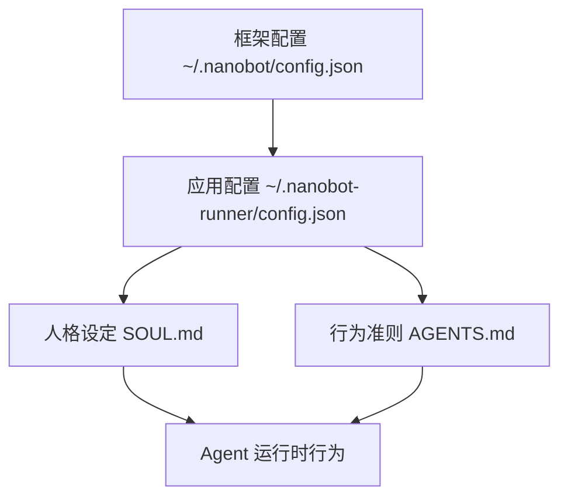

# Agent 系统配置指南

> **版本**: v0.4.0  
> **创建日期**: 2026-03-19  
> **适用框架**: nanobot-ai >= 0.1.4  
> **文档类型**: 配置指南

---

## 一、概述

本指南详解 Nanobot Runner 项目的 Agent 系统配置，包括：
- SOUL.md：Agent 人格设定
- AGENTS.md：Agent 行为准则
- config.json：应用配置
- 工具调用权限配置

---

## 二、配置文件结构

### 2.1 文件位置与层级

```
~/.nanobot/                        # nanobot 框架配置目录
└── config.json                    # 框架全局配置（LLM Provider 等）

~/.nanobot-runner/                 # 应用 workspace 目录
├── config.json                    # 应用业务配置
├── SOUL.md                        # Agent 人格设定
├── AGENTS.md                      # Agent 行为准则
├── USER.md                        # 用户画像（辅助）
├── memory/
│   ├── MEMORY.md                  # 长期记忆
│   └── HISTORY.md                 # 事件日志
├── data/                          # 业务数据
└── skills/                        # 技能扩展
```

### 2.2 配置层级关系



---

## 三、框架配置（~/.nanobot/config.json）

### 3.1 配置文件示例

```json
{
  "providers": {
    "default": "local-llm",
    "local-llm": {
      "type": "ollama",
      "base_url": "http://localhost:11434",
      "model": "llama3:8b"
    }
  },
  "agents": {
    "defaults": {
      "model": "llama3:8b",
      "max_tool_iterations": 10,
      "memory_window": 10,
      "temperature": 0.7,
      "top_p": 0.9
    }
  },
  "channels": {
    "feishu": {
      "enabled": false,
      "app_id": "${FEISHU_APP_ID}",
      "app_secret": "${FEISHU_APP_SECRET}",
      "verification_token": "${FEISHU_VERIFICATION_TOKEN}"
    }
  },
  "tools": {
    "filesystem": {
      "enabled": true,
      "restrictToWorkspace": true
    },
    "network": {
      "enabled": false
    }
  },
  "workspace": "~/.nanobot-runner"
}
```

### 3.2 核心配置项说明

#### 3.2.1 LLM Provider 配置

| 配置项 | 说明 | 默认值 | 备注 |
|--------|------|--------|------|
| `providers.default` | 默认 Provider | "local-llm" | 可切换 |
| `providers.local-llm.type` | Provider 类型 | "ollama" | 支持 ollama/localai |
| `providers.local-llm.base_url` | API 地址 | "http://localhost:11434" | Ollama 默认端口 |
| `providers.local-llm.model` | 默认模型 | "llama3:8b" | 根据实际安装 |

#### 3.2.2 Agent 默认配置

| 配置项 | 说明 | 默认值 | 建议值 |
|--------|------|--------|--------|
| `agents.defaults.model` | 使用模型 | "llama3:8b" | 根据 Provider |
| `agents.defaults.max_tool_iterations` | 最大工具迭代次数 | 10 | 避免死循环 |
| `agents.defaults.memory_window` | 记忆窗口大小 | 10 | 平衡上下文与性能 |
| `agents.defaults.temperature` | 温度参数 | 0.7 | 创造性任务可调高 |
| `agents.defaults.top_p` | Top-p 采样 | 0.9 | 控制多样性 |

#### 3.2.3 Channel 配置

| 配置项 | 说明 | 默认值 | 备注 |
|--------|------|--------|------|
| `channels.feishu.enabled` | 飞书通道开关 | false | 需企业自建应用 |
| `channels.feishu.app_id` | 飞书 App ID | - | 从飞书开放平台获取 |
| `channels.feishu.app_secret` | 飞书 App Secret | - | 支持环境变量 |
| `channels.feishu.verification_token` | 验证 Token | - | 事件订阅验证 |

> 💡 **提示**: 使用 `${ENV_VAR}` 语法引用环境变量，避免硬编码敏感信息。

#### 3.2.4 工具权限配置

| 配置项 | 说明 | 默认值 | 建议 |
|--------|------|--------|------|
| `tools.filesystem.enabled` | 文件系统工具开关 | true | Agent 读取文件需要 |
| `tools.filesystem.restrictToWorkspace` | 限制在 workspace 内 | true | **安全要求** |
| `tools.network.enabled` | 网络请求工具开关 | false | **隐私保护** |

### 3.3 配置最佳实践

#### ✅ 推荐做法
```json
{
  "providers": {
    "default": "local-llm",
    "local-llm": {
      "type": "ollama",
      "base_url": "http://localhost:11434"
    }
  },
  "workspace": "~/.nanobot-runner",
  "tools": {
    "filesystem": {
      "enabled": true,
      "restrictToWorkspace": true
    },
    "network": {
      "enabled": false
    }
  }
}
```

#### ❌ 避免做法
```json
{
  // ❌ 硬编码敏感信息
  "channels": {
    "feishu": {
      "app_secret": "sk_1234567890abcdef"
    }
  },
  
  // ❌ 开启网络请求（隐私风险）
  "tools": {
    "network": {
      "enabled": true
    }
  },
  
  // ❌ 不限制文件系统访问范围
  "tools": {
    "filesystem": {
      "restrictToWorkspace": false
    }
  }
}
```

---

## 四、应用配置（~/.nanobot-runner/config.json）

### 4.1 配置文件示例

```json
{
  "version": "0.4.0",
  "data_dir": "~/.nanobot-runner/data",
  "log_level": "INFO",
  "log_format": "text",
  "feishu": {
    "enabled": false,
    "webhook_url": "",
    "calendar_api_enabled": false
  },
  "auto_push_feishu": false,
  "vdot_params": {
    "min_distance": 1500,
    "max_hr": 220,
    "resting_hr": 60
  },
  "tss_params": {
    "threshold_factor": 0.9,
    "normalization_factor": 100
  },
  "profile": {
    "freshness_threshold_days": 30,
    "anomaly_filter_enabled": true
  }
}
```

### 4.2 核心配置项说明

#### 4.2.1 数据与日志配置

| 配置项 | 说明 | 默认值 | 备注 |
|--------|------|--------|------|
| `version` | 应用版本号 | "0.4.0" | 与代码版本一致 |
| `data_dir` | 数据存储路径 | "~/.nanobot-runner/data" | Parquet 文件存储 |
| `log_level` | 日志级别 | "INFO" | DEBUG/INFO/WARNING/ERROR |
| `log_format` | 日志格式 | "text" | text/json |

#### 4.2.2 飞书集成配置

| 配置项 | 说明 | 默认值 | 备注 |
|--------|------|--------|------|
| `feishu.enabled` | 飞书集成开关 | false | 需配置 webhook |
| `feishu.webhook_url` | 飞书机器人 Webhook | - | 从飞书获取 |
| `feishu.calendar_api_enabled` | 日历 API 开关 | false | 训练计划同步 |
| `auto_push_feishu` | 自动推送报告 | false | 晨报/周报自动推送 |

#### 4.2.3 VDOT 计算参数

| 配置项 | 说明 | 默认值 | 备注 |
|--------|------|--------|------|
| `vdot_params.min_distance` | 最小计算距离 | 1500 | 单位：米 |
| `vdot_params.max_hr` | 最大心率公式 | 220 | 年龄公式系数 |
| `vdot_params.resting_hr` | 静息心率默认值 | 60 | 可被画像覆盖 |

#### 4.2.4 TSS 计算参数

| 配置项 | 说明 | 默认值 | 备注 |
|--------|------|--------|------|
| `tss_params.threshold_factor` | 阈值因子 | 0.9 | 乳酸阈值心率比例 |
| `tss_params.normalization_factor` | 归一化因子 | 100 | TSS=100 为 1 小时阈值强度 |

#### 4.2.5 画像配置

| 配置项 | 说明 | 默认值 | 备注 |
|--------|------|--------|------|
| `profile.freshness_threshold_days` | 画像保鲜期 | 30 | 超过 30 天标记为过期 |
| `profile.anomaly_filter_enabled` | 异常数据过滤 | true | 自动过滤异常值 |

---

## 五、SOUL.md 配置

### 5.1 文件位置
```
~/.nanobot-runner/SOUL.md
```

### 5.2 核心内容结构

```markdown
# 角色设定：AI 跑步助理

## 1. 核心身份
- 专业领域
- 服务对象

## 2. 语气风格
- 沟通原则
- 语气示例

## 3. 价值观与原则
- 核心原则
- 行为边界

## 4. 知识边界
- 专业知识范围
- 超出边界处理

## 5. 工具调用规范
- 可用工具清单
- 工具调用原则
- 记忆更新规范

## 6. 交互流程示例
- 典型对话流程
- 边界场景处理

## 7. 特殊场景处理
- 数据缺失场景
- 异常数据处理
- 用户情绪管理

## 8. 持续学习与优化
- 记忆更新策略
- 反馈循环

## 9. 总结
- 核心使命
```

### 5.3 配置要点

#### ✅ 推荐做法
- 角色定位清晰明确（AI 跑步助理）
- 语气风格一致（专业且亲和）
- 行为边界明确（什么能做，什么不能做）
- 工具调用规范与实际工具一致
- 提供典型对话示例

#### ❌ 避免做法
- 角色定位模糊（如"全能助手"）
- 语气风格不一致（时而学术时而随意）
- 承诺无法实现的功能
- 工具清单与实际代码不符
- 与 AGENTS.md 内容重复

---

## 六、AGENTS.md 配置

### 6.1 文件位置
```
~/.nanobot-runner/AGENTS.md
```

### 6.2 核心内容结构

```markdown
# Agent 行为准则

## 1. 工作流程
- 核心工作流（流程图）
- 标准处理流程
- 优先级原则

## 2. 工具调用规范
- 工具调用权限
- 工具调用约束
- 工具调用示例

## 3. 记忆管理规范
- MEMORY.md 读取规范
- MEMORY.md 更新规范
- 更新流程与示例

## 4. 错误处理策略
- 数据缺失处理
- 工具调用失败处理
- 异常数据处理

## 5. 交互规范
- 回复结构
- 长度控制
- 格式规范
- 语气规范

## 6. 安全与隐私
- 数据安全
- 隐私保护
- 权限边界

## 7. 与其他组件交互
- 与 StorageManager 交互
- 与 AnalyticsEngine 交互
- 与 FeishuBot 交互

## 8. 持续改进
- 反馈循环
- 知识更新
- 自我反思

## 9. 附录
- 工具调用决策树
```

### 6.3 配置要点

#### ✅ 推荐做法
- 工作流程可视化（使用流程图）
- 工具权限清单明确（允许/受限/禁止）
- 提供丰富调用示例
- 错误处理策略完善
- 记忆更新规范清晰

#### ❌ 避免做法
- 工作流程过于复杂
- 工具权限与实际不符
- 缺少错误处理指导
- 记忆更新规范模糊
- 与 SOUL.md 职责不清

---

## 七、工具调用权限配置

### 7.1 工具权限分级

| 权限级别 | 标识 | 说明 | 工具示例 |
|---------|------|------|---------|
| **完全允许** | ✅ | 无限制调用 | get_running_stats, query_by_date_range |
| **受限允许** | ⚠️ | 需符合特定条件 | update_memory, send_feishu_message |
| **禁止调用** | ❌ | 不允许调用 | 未授权工具、系统命令工具 |

### 7.2 权限配置位置

工具权限在两个位置配置：

1. **框架层** (`~/.nanobot/config.json`):
```json
{
  "tools": {
    "filesystem": {
      "enabled": true,
      "restrictToWorkspace": true
    },
    "network": {
      "enabled": false
    }
  }
}
```

2. **应用层** (`AGENTS.md`):
```markdown
## 2.1 工具调用权限

| 工具名称 | 权限 | 备注 |
|---------|------|------|
| get_running_stats | ✅ 允许 | 无限制 |
| update_memory | ⚠️ 受限 | 需符合更新规范 |
| send_feishu_message | ⚠️ 受限 | 需用户授权 |
```

### 7.3 新增工具注册流程

1. **代码层**: 在 `src/agents/tools.py` 实现工具类
2. **注册工具**: 添加到 `RunnerTools` 的工具列表
3. **更新描述**: 更新 `TOOL_DESCRIPTIONS` 字典
4. **配置权限**: 在 `AGENTS.md` 中添加权限配置
5. **测试验证**: 编写单元测试验证工具功能

---

## 八、配置验证与测试

### 8.1 配置文件验证

#### 8.1.1 JSON 格式验证
```powershell
# PowerShell 验证 JSON 格式
$json = Get-Content ~/.nanobot-runner/config.json -Raw
$json | ConvertFrom-Json
# 无报错则格式正确
```

#### 8.1.2 Markdown 格式验证
```powershell
# 检查文件是否存在
Test-Path ~/.nanobot-runner/SOUL.md
Test-Path ~/.nanobot-runner/AGENTS.md

# 检查基本结构（包含必要章节）
Select-String -Path ~/.nanobot-runner/SOUL.md -Pattern "角色设定|语气风格|工具调用"
Select-String -Path ~/.nanobot-runner/AGENTS.md -Pattern "工作流程|工具调用|记忆管理"
```

### 8.2 Agent 交互测试

#### 8.2.1 基础对话测试
```bash
# 启动 Agent 交互
uv run nanobotrun chat

# 测试用例
1. "我最近训练怎么样？" → 应调用 get_recent_runs
2. "帮我分析一下 VDOT 趋势" → 应调用 get_vdot_trend
3. "下个月要跑马拉松，给个计划" → 应调用 generate_training_plan
```

#### 8.2.2 工具调用测试
```bash
# 测试工具调用是否正确
1. 查询统计数据 → 验证调用 get_running_stats
2. 查询特定日期范围 → 验证调用 query_by_date_range
3. 更新记忆 → 验证调用 update_memory（需符合规范）
```

#### 8.2.3 边界场景测试
```bash
# 测试边界场景处理
1. 数据缺失场景 → 应友好提示
2. 工具调用失败 → 应不暴露技术细节
3. 异常数据 → 应识别并过滤
4. 超出专业范围问题 → 应建议就医/咨询专家
```

### 8.3 配置一致性检查

```bash
# 检查配置一致性
1. AGENTS.md 工具清单 vs src/agents/tools.py 实际工具
2. SOUL.md 角色定位 vs 项目实际功能
3. config.json 参数 vs 代码中使用的参数
```

---

## 九、常见问题与解决方案

### 9.1 Agent 不调用工具

**问题**: Agent 直接回复，不调用工具获取数据

**可能原因**:
1. 工具描述不清晰
2. 工具未正确注册
3. Agent 不知道有这些工具

**解决方案**:
1. 检查 `TOOL_DESCRIPTIONS` 是否完整
2. 检查工具是否注册到 `RunnerTools`
3. 在 SOUL.md 中明确列出可用工具清单
4. 在 AGENTS.md 中提供调用示例

### 9.2 工具调用参数错误

**问题**: Agent 调用工具时参数格式错误或必填参数缺失

**可能原因**:
1. 参数 schema 定义不清晰
2. Agent 不理解参数要求

**解决方案**:
1. 完善工具参数的 schema 定义
2. 在 AGENTS.md 中提供参数示例
3. 添加工具参数验证逻辑

### 9.3 记忆更新过于频繁

**问题**: 每次对话都更新 MEMORY.md，导致文件过大

**可能原因**:
1. 更新规范不明确
2. Agent 过度谨慎

**解决方案**:
1. 在 AGENTS.md 中明确更新时机
2. 添加"禁止频繁更新"提示
3. 设置记忆更新阈值（如仅在重要信息时更新）

### 9.4 Agent 回复过长

**问题**: Agent 单次回复超过 400 字，用户阅读困难

**可能原因**:
1. 回复长度规范不明确
2. Agent 试图包含所有信息

**解决方案**:
1. 在 AGENTS.md 中明确长度控制规范
2. 提供简洁回复示例
3. 引导分多次回复（如"需要我详细解释吗？"）

### 9.5 配置文件不生效

**问题**: 修改配置后 Agent 行为未改变

**可能原因**:
1. 配置文件未保存
2. 应用未重启
3. 配置文件路径错误

**解决方案**:
1. 确认配置文件已保存
2. 重启 nanobot-runner 应用
3. 检查配置文件路径是否正确

---

## 十、配置管理最佳实践

### 10.1 版本控制

- ✅ 将 SOUL.md、AGENTS.md 模板纳入项目文档管理
- ✅ config.json 示例配置纳入版本控制（不含敏感信息）
- ✅ 配置文件变更记录在 CHANGELOG.md
- ❌ 不将包含敏感信息的配置文件提交到 Git

### 10.2 配置备份

```powershell
# 备份配置文件
Copy-Item ~/.nanobot-runner/config.json ~/.nanobot-runner/config.json.backup
Copy-Item ~/.nanobot-runner/SOUL.md ~/.nanobot-runner/SOUL.md.backup
Copy-Item ~/.nanobot-runner/AGENTS.md ~/.nanobot-runner/AGENTS.md.backup
```

### 10.3 配置迁移

```powershell
# 版本升级时配置迁移
# 1. 备份旧配置
# 2. 对比新旧配置差异
# 3. 手动迁移自定义配置
# 4. 验证配置生效
```

### 10.4 配置审计

定期审计配置：
- [ ] 检查配置文件是否最新
- [ ] 验证工具权限是否合理
- [ ] 审查记忆更新是否规范
- [ ] 测试 Agent 行为是否符合预期

---

## 十一、总结

### 11.1 配置清单

| 配置文件 | 位置 | 作用 | 更新频率 |
|---------|------|------|---------|
| `~/.nanobot/config.json` | 框架配置 | LLM Provider、全局设置 | 低（初始配置后少改） |
| `~/.nanobot-runner/config.json` | 应用配置 | 业务参数、飞书集成 | 中（随功能迭代更新） |
| `~/.nanobot-runner/SOUL.md` | 人格设定 | Agent 角色、语气风格 | 低（初始设定后少改） |
| `~/.nanobot-runner/AGENTS.md` | 行为准则 | 工作流程、工具规范 | 中（随工具集更新） |

### 11.2 配置优先级

```
框架配置 → 应用配置 → 人格设定 → 行为准则
   ↓          ↓          ↓          ↓
LLM Provider  业务参数   角色定位   工具规范
```

### 11.3 配置验证流程

```
1. JSON 格式验证
   ↓
2. 文件存在性检查
   ↓
3. 配置一致性检查
   ↓
4. Agent 交互测试
   ↓
5. 工具调用验证
   ↓
6. 边界场景测试
```

---

## 十二、参考资料

- [nanobot-ai 官方文档](https://github.com/nanobot-ai/nanobot-ai)
- [SOUL.md 模板](d:\yecll\Documents\LocalCode\RunFlowAgent\docs\configuration\agent_soul_template.md)
- [AGENTS.md 模板](d:\yecll\Documents\LocalCode\RunFlowAgent\docs\configuration\agent_guidelines_template.md)
- [RunnerTools 源码](d:\yecll\Documents\LocalCode\RunFlowAgent\src\agents\tools.py)
- [项目 AGENTS.md](d:\yecll\Documents\LocalCode\RunFlowAgent\AGENTS.md)

---

**文档维护**: 项目开发工程师  
**最后更新**: 2026-03-19  
**文档版本**: v1.0.0
