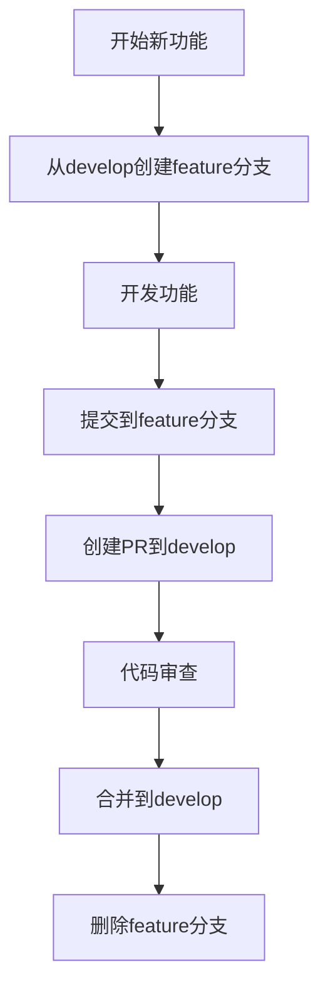
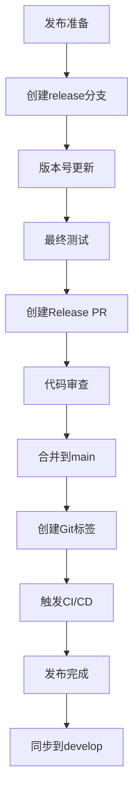
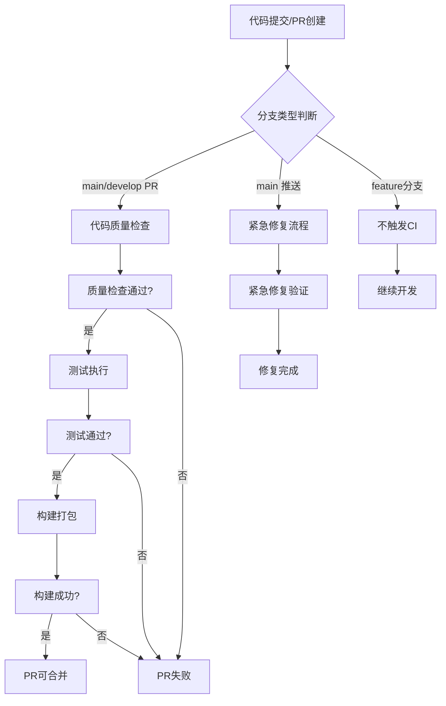

# 分支管理与发布流程规范

## 1. 概述

本文档定义了 Nanobot Runner 项目的分支管理策略和发布流程，旨在解决当前流程中存在的问题，提升开发与发布效率。

## 2. 分支命名规范

### 2.1 分支类型与命名

| 分支类型 | 命名规范 | 用途 | 生命周期 |
|---------|---------|------|---------|
| **主分支** | `main` | 生产发布 | 永久 |
| **开发分支** | `develop` | 功能集成 | 永久 |
| **特性分支** | `feature/<功能描述>` | 新功能开发 | 功能完成 |
| **修复分支** | `fix/<问题描述>` | Bug修复 | 修复完成 |
| **发布分支** | `release/v<版本号>` | 版本发布准备 | 发布完成 |
| **热修复分支** | `hotfix/<紧急问题>` | 生产问题修复 | 修复完成 |

### 2.2 命名示例
- `feature/user-authentication`
- `fix/memory-leak-issue`
- `release/v0.5.0`
- `hotfix/critical-security-fix`

## 3. 分支创建与合并规则

### 3.1 分支创建流程



### 3.2 合并规则

1. **特性分支 → develop**：通过 Pull Request 合并
2. **develop → main**：通过 Release PR 合并
3. **热修复 → main**：紧急情况下直接合并
4. **main → develop**：定期同步生产代码

### 3.3 代码审查要求

- **审查人员**：至少1名核心开发者
- **审查内容**：代码质量、测试覆盖、文档更新
- **通过标准**：所有检查通过，无阻塞性问题

## 4. 发布周期与版本管理

### 4.1 版本号规范

采用语义化版本控制（SemVer）：`主版本.次版本.修订版本`

- **主版本**：不兼容的API修改
- **次版本**：向下兼容的功能性新增
- **修订版本**：向下兼容的问题修正

### 4.2 发布周期

| 发布类型 | 周期 | 触发条件 |
|---------|------|---------|
| **常规发布** | 2-4周 | 功能积累达到发布标准 |
| **紧急发布** | 随时 | 生产环境严重问题 |
| **安全发布** | 立即 | 安全漏洞修复 |

## 5. 发布流程

### 5.1 标准发布流程



### 5.2 自动化发布

GitHub Actions 自动执行以下步骤：
1. **质量检查**：代码格式化、类型检查、安全扫描
2. **测试执行**：单元测试、集成测试、性能测试
3. **构建打包**：生成 wheel 和 sdist 包
4. **发布部署**：创建 GitHub Release，上传包文件

## 6. CI/CD 流水线配置

### 6.1 触发规则

GitHub Actions CI/CD 流水线根据分支类型采用不同的触发策略：

| 分支类型 | 触发条件 | 质量门禁 | 目的 |
|---------|---------|---------|------|
| **main分支** | 仅PR触发 + 紧急推送 | 严格检查 | 生产代码质量保障 |
| **develop分支** | 仅PR触发 | 标准检查 | 开发代码质量检查 |
| **feature分支** | 不触发CI | 无 | 提高开发效率 |

#### 具体配置
```yaml
on:
  push:
    branches: [ main ]  # 仅对 main 分支推送触发（紧急修复）
  pull_request:
    branches: [ main, develop ]  # 对 main 和 develop 的 PR 触发
    types: [opened, reopened, synchronize]  # 避免重复执行
```

### 6.2 质量门禁

CI/CD 流水线执行严格的质量检查，确保代码质量：

#### 代码质量检查
- **代码格式化**：black 格式化检查（零容忍）
- **导入排序**：isort 导入排序检查（零容忍）
- **类型检查**：mypy 类型注解检查（严格模式）
- **安全扫描**：bandit 安全漏洞扫描（高危漏洞零容忍）

#### 测试质量门禁
- **单元测试通过率**：100% 通过
- **集成测试通过率**：100% 通过
- **代码覆盖率**：core≥80%, agents≥70%, cli≥60%
- **测试执行时间**：单测试<30秒

#### 构建质量门禁
- **依赖安装**：无冲突依赖
- **包构建**：成功生成 wheel 和 sdist
- **发布验证**：GitHub Release 创建成功

### 6.3 流水线执行流程



## 7. 文件管理规范

### 7.1 文件分类与存储

| 文件类型 | 存储位置 | Git跟踪 | 说明 |
|---------|---------|---------|------|
| **源代码** | `src/` | ✅ | 核心业务逻辑 |
| **单元测试** | `tests/unit/` | ✅ | 代码质量保障 |
| **集成测试** | `tests/integration/` | ✅ | 系统集成验证 |
| **测试数据** | `tests/data/` | ✅ | 测试用例数据 |
| **文档文件** | `docs/` | ✅ | 项目文档 |
| **配置模板** | `templates/` | ✅ | 配置文件模板 |
| **IDE配置** | `.vscode/`, `.idea/` | ❌ | 个人开发环境 |
| **构建产物** | `dist/`, `build/` | ❌ | 临时构建文件 |

### 6.2 .gitignore 配置优化

```gitignore
# IDE配置文件
.vscode/
.idea/

# 构建产物
dist/
build/
*.egg-info/

# 缓存文件
__pycache__/
*.pyc

# 环境配置
.env
.env.local

# 日志文件
*.log
logs/

# 临时文件
*.tmp
*.temp
```

## 8. 问题分析与解决方案

### 8.1 文件标记删除问题分析

#### 问题现象
- 分支切换时大量文件显示为"deleted"
- 文件数量：242个
- 影响范围：测试数据、文档、IDE配置

#### 根本原因
1. **分支内容差异**：develop分支包含完整开发环境，main分支为精简生产版本
2. **Git正常行为**：切换分支时正确显示文件差异
3. **误读现象**：差异显示被误认为文件删除

#### 解决方案
1. **文件分类管理**：明确区分生产代码与开发资源
2. **分支策略优化**：避免频繁切换不同内容的分支
3. **团队培训**：正确理解Git分支切换行为

### 8.2 流程改进措施

#### 短期改进（立即实施）
1. **完善.gitignore**：排除IDE配置和构建产物
2. **分支保护规则**：设置main分支保护
3. **发布检查清单**：确保发布前状态正确

#### 中期优化（1-2周）
1. **自动化同步**：定期同步main到develop
2. **分支模板**：创建标准分支创建模板
3. **监控告警**：异常分支操作告警

#### 长期规划（1个月）
1. **CI/CD优化**：完善发布流程自动化
2. **文档自动化**：自动生成发布文档
3. **质量门禁**：强化代码质量检查

## 9. 实施步骤与验证方法

### 9.1 实施步骤

#### 第一阶段：基础规范建立（第1周）
- [ ] 更新.gitignore配置
- [ ] 设置分支保护规则
- [ ] 创建发布检查清单
- [ ] 团队培训与沟通

#### 第二阶段：流程优化（第2-3周）
- [ ] 实现自动化同步脚本
- [ ] 完善CI/CD流程
- [ ] 建立监控机制
- [ ] 优化文档模板

#### 第三阶段：持续改进（第4周及以后）
- [ ] 定期流程评审
- [ ] 收集团队反馈
- [ ] 持续优化改进

### 9.2 验证方法

#### 质量指标
- **分支一致性**：本地与远程分支差异为零
- **发布成功率**：发布流程成功率≥95%
- **问题响应时间**：分支问题30分钟内解决

#### 效率指标
- **发布周期**：从2-4周缩短至1-2周
- **合并冲突**：合并冲突减少50%
- **团队满意度**：通过问卷调查评估

## 10. 附录

### 10.1 常用命令参考

```bash
# 分支管理
git checkout -b feature/new-feature develop  # 创建特性分支
git push origin feature/new-feature          # 推送特性分支
git branch -d feature/new-feature            # 删除本地特性分支

# 发布流程
git checkout -b release/v0.5.0 develop       # 创建发布分支
git tag -a v0.5.0 -m "Release v0.5.0"        # 创建标签
git push origin v0.5.0                       # 推送标签

# 同步操作
git checkout develop                         # 切换到develop
git merge main                               # 同步main到develop
```

### 9.2 相关文档链接

- [GitHub Actions 配置说明](../ci-cd/GitHub_Actions配置说明.md)
- [代码质量门禁指南](../dev/code_quality_gate_guide.md)
- [发布检查清单](../devops/release_checklist.md)

---

**文档版本**: v1.0  
**最后更新**: 2026-03-30  
**维护者**: DevOps Team