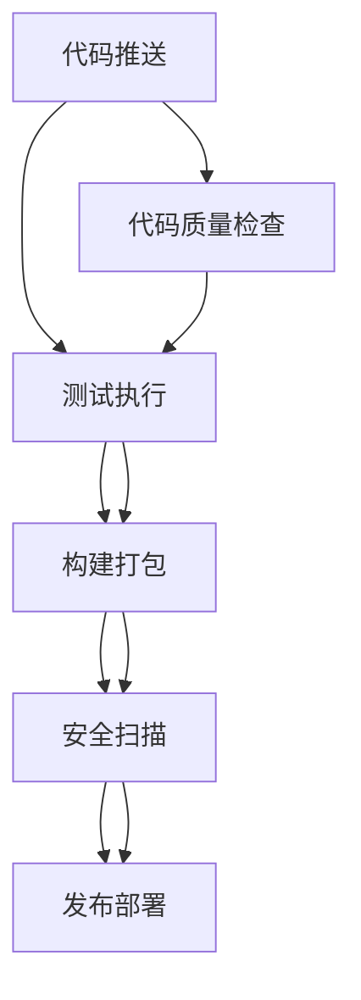

# CICD流水线配置说明

## 1. 流水线概述

Nanobot Runner项目采用GitHub Actions构建完整的CICD流水线，实现代码推送后的自动化测试、构建和部署。

### 1.1 流水线架构



### 1.2 触发条件

| 事件类型 | 触发条件 | 执行动作 |
|---------|---------|----------|
| **Push到main分支** | 代码合并到主干 | 完整CI流程 |
| **Push到develop分支** | 开发分支更新 | 完整CI流程 |
| **Pull Request** | 创建/更新PR | 测试和代码质量检查 |
| **Release发布** | 创建新版本标签 | 构建和发布包 |

## 2. 流水线配置详解

### 2.1 主要工作流文件

#### 2.1.1 CI流水线 (.github/workflows/ci.yml)

**核心功能**:
- 多版本Python测试 (3.11, 3.12)
- 单元测试、集成测试、E2E测试
- 代码覆盖率报告
- 代码质量检查
- 包构建

**配置要点**:
```yaml
strategy:
  matrix:
    python-version: ['3.11', '3.12']
```

#### 2.1.2 完整CICD流水线 (.github/workflows/ci-cd.yml)

**核心功能**:
- 代码质量检查 (black, isort, mypy, bandit)
- 多版本测试矩阵
- 性能测试
- 安全扫描
- 文档生成
- 发布到GitHub Releases

### 2.2 测试阶段配置

#### 2.2.1 单元测试
```yaml
- name: Run unit tests
  run: |
    pytest tests/unit/ -v --cov=src --cov-report=term-missing
```

**测试配置** (pyproject.toml):
```toml
[tool.pytest.ini_options]
testpaths = ["tests"]
python_files = ["test_*.py"]
python_functions = ["test_*"]
addopts = "-v --cov=src --cov-report=term-missing --cov-report=html --cov-report=xml"
```

#### 2.2.2 集成测试
```yaml
- name: Run integration tests
  run: |
    pytest tests/integration/ -v
```

#### 2.2.3 E2E测试
```yaml
- name: Run E2E tests
  run: |
    pytest tests/e2e/ -v
```

### 2.3 代码质量检查

#### 2.3.1 代码格式化
```yaml
- name: Check code formatting
  run: |
    black --check src/ tests/
    isort --check-only src/ tests/
```

**配置** (pyproject.toml):
```toml
[tool.black]
line-length = 88
target-version = ['py311']

[tool.isort]
profile = "black"
multi_line_output = 3
line_length = 88
```

#### 2.3.2 类型检查
```yaml
- name: Type checking
  run: |
    mypy src/
```

**配置** (pyproject.toml):
```toml
[tool.mypy]
python_version = "3.11"
warn_return_any = true
warn_unused_configs = true
disallow_untyped_defs = true
```

#### 2.3.3 安全扫描
```yaml
- name: Security scan
  run: |
    bandit -r src/ -f json -o bandit-report.json
```

**配置** (pyproject.toml):
```toml
[tool.bandit]
skips = ["B101"]
targets = ["src"]
recursive = true
```

### 2.4 构建阶段

#### 2.4.1 依赖安装
```yaml
- name: Install dependencies
  run: |
    python -m pip install --upgrade pip
    pip install -e .[test]
```

#### 2.4.2 包构建
```yaml
- name: Build package
  run: |
    python -m build
```

**构建系统配置** (pyproject.toml):
```toml
[build-system]
requires = ["hatchling"]
build-backend = "hatchling.build"

[tool.hatch.build.targets.wheel]
packages = ["src"]
```

### 2.5 部署阶段

#### 2.5.1 发布到GitHub Releases
```yaml
- name: Upload release assets
  uses: actions/upload-release-asset@v1
  env:
    GITHUB_TOKEN: ${{ secrets.GITHUB_TOKEN }}
  with:
    upload_url: ${{ github.event.release.upload_url }}
    asset_path: ./dist/*.whl
    asset_name: nanobot-runner-${{ github.event.release.tag_name }}.whl
```

#### 2.5.2 测试环境部署
```yaml
- name: Run deployment validation
  run: |
    echo "Deployment validation completed"
    echo "Application would be deployed to staging environment"
```

## 3. 环境配置

### 3.1 Python版本管理

**支持版本**: Python 3.11, 3.12

**配置方式**:
```yaml
env:
  PYTHON_VERSION: '3.11'

strategy:
  matrix:
    python-version: ['3.11', '3.12']
```

### 3.2 缓存配置

**依赖缓存**:
```yaml
- name: Set up Python
  uses: actions/setup-python@v4
  with:
    python-version: ${{ matrix.python-version }}
    cache: 'pip'
```

### 3.3 环境变量

**全局环境变量**:
```yaml
env:
  PYTHON_VERSION: '3.11'
  UV_VERSION: '0.4.0'
```

## 4. 测试覆盖率

### 4.1 覆盖率配置

**pytest配置**:
```toml
addopts = "-v --cov=src --cov-report=term-missing --cov-report=html --cov-report=xml"
```

**覆盖率上传**:
```yaml
- name: Upload coverage reports
  uses: codecov/codecov-action@v3
  with:
    file: ./coverage.xml
```

### 4.2 覆盖率报告

- **终端报告**: 显示缺失覆盖的行
- **HTML报告**: 生成详细的HTML报告
- **XML报告**: 用于CI/CD集成

## 5. 安全配置

### 5.1 安全扫描工具

**Bandit配置**:
```toml
[tool.bandit]
skips = ["B101"]  # 跳过断言检查
targets = ["src"]
recursive = true
```

**Safety检查**:
```yaml
- name: Run safety check
  run: |
    uv run safety check --json --output safety-report.json
```

### 5.2 安全报告

- **Bandit报告**: JSON格式安全漏洞报告
- **Safety报告**: 依赖安全漏洞报告

## 6. 性能优化

### 6.1 缓存策略

**依赖缓存**:
```yaml
- name: Cache pip packages
  uses: actions/cache@v3
  with:
    path: ~/.cache/pip
    key: ${{ runner.os }}-pip-${{ hashFiles('**/requirements.txt') }}
    restore-keys: |
      ${{ runner.os }}-pip-
```

### 6.2 并行执行

**测试并行化**:
```yaml
strategy:
  matrix:
    python-version: ['3.11', '3.12']
```

## 7. 故障排查

### 7.1 常见问题

#### 问题1: 依赖安装失败
**解决方案**:
```bash
# 清理缓存
uv cache clean

# 重新安装
uv sync --force-reinstall
```

#### 问题2: 测试超时
**解决方案**:
```yaml
- name: Run tests with timeout
  run: |
    timeout 300 pytest tests/ -v
```

#### 问题3: 构建失败
**解决方案**:
```bash
# 检查构建配置
python -c "import tomllib; print(tomllib.load(open('pyproject.toml', 'rb')))"

# 手动构建测试
python -m build --no-isolation
```

### 7.2 调试技巧

**启用详细日志**:
```yaml
- name: Run tests with debug
  run: |
    pytest tests/ -v -s --tb=long
```

**检查环境**:
```yaml
- name: Debug environment
  run: |
    python --version
    pip list
    ls -la
```

## 8. 扩展配置

### 8.1 自定义工作流

**添加自定义步骤**:
```yaml
- name: Custom step
  run: |
    echo "Custom build step"
    # 添加自定义逻辑
```

### 8.2 环境特定配置

**开发环境配置**:
```yaml
- name: Development setup
  if: github.ref == 'refs/heads/develop'
  run: |
    echo "Development environment setup"
```

**生产环境配置**:
```yaml
- name: Production setup
  if: github.ref == 'refs/heads/main'
  run: |
    echo "Production environment setup"
```

## 9. 监控与告警

### 9.1 流水线状态监控

**成功条件**:
- 所有测试通过
- 代码质量检查通过
- 构建成功
- 安全扫描无严重漏洞

**失败处理**:
- 自动通知开发团队
- 生成详细错误报告
- 提供修复建议

### 9.2 性能指标

**监控指标**:
- 构建时间
- 测试执行时间
- 代码覆盖率变化
- 安全漏洞数量

---

**最后更新**: 2026-03-02  
**维护者**: DevOps智能体