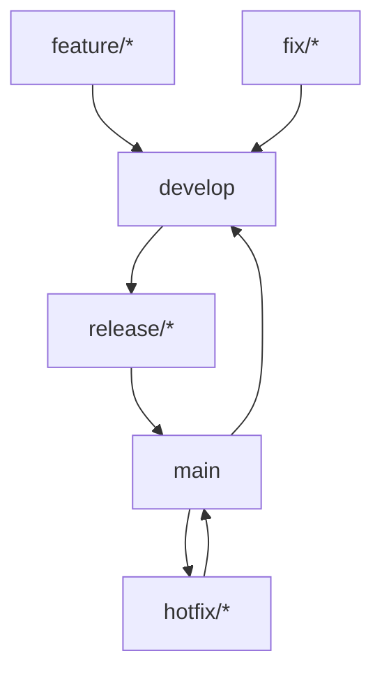

# Git分支与发布流程规范

## 1. 分支管理规范

### 1.1 分支命名约定

| 分支类型 | 命名格式 | 说明 | 示例 |
|---------|---------|------|------|
| 主分支 | `main` | 稳定版本分支，用于生产环境 | `main` |
| 开发分支 | `develop` | 集成开发分支，用于功能集成 | `develop` |
| 功能分支 | `feature/<功能名>` | 新功能开发分支 | `feature/user-auth` |
| 修复分支 | `fix/<问题描述>` | Bug修复分支 | `fix/api-response-error` |
| 发布分支 | `release/<版本号>` | 版本发布准备分支 | `release/v1.0.0` |
| 热修复分支 | `hotfix/<紧急修复>` | 紧急修复分支 | `hotfix/security-patch` |

### 1.2 分支生命周期



## 2. 提交信息规范

### 2.1 提交格式
```
<类型>(<范围>): <主题>

<正文>

<页脚>
```

### 2.2 提交类型
- `feat`: 新功能
- `fix`: Bug修复
- `docs`: 文档变更
- `style`: 代码风格变更
- `refactor`: 代码重构
- `perf`: 性能优化
- `test`: 测试相关
- `build`: 构建系统变更
- `ci`: CI配置变更
- `chore`: 其他变更

### 2.3 提交示例
```bash
# 功能提交
git commit -m "feat(auth): 添加用户登录功能

- 实现JWT认证机制
- 添加用户登录API端点
- 完善错误处理逻辑"

# Bug修复提交
git commit -m "fix(api): 修复响应格式错误

修复了API返回的JSON格式错误，确保所有端点返回有效的JSON响应"
```

## 3. 发布流程规范

### 3.1 版本发布流程

1. **准备发布**
   ```bash
   git checkout develop
   git pull
   git checkout -b release/v1.0.0
   ```

2. **更新版本信息**
   - 更新 `pyproject.toml` 中的版本号
   - 更新 `CHANGELOG.md`（如有）
   - 更新依赖版本

3. **测试验证**
   ```bash
   pytest tests/
   python -m nanobotrun --help
   ```

4. **合并到main分支**
   ```bash
   git checkout main
   git merge release/v1.0.0
   git tag -a v1.0.0 -m "版本1.0.0发布"
   git push origin main --tags
   ```

5. **合并回develop分支**
   ```bash
   git checkout develop
   git merge main
   git push origin develop
   ```

6. **删除发布分支**
   ```bash
   git branch -d release/v1.0.0
   git push origin --delete release/v1.0.0
   ```

### 3.2 热修复流程

1. **创建热修复分支**
   ```bash
   git checkout main
   git checkout -b hotfix/security-patch
   ```

2. **修复问题并测试**

3. **合并到main和develop**
   ```bash
   git checkout main
   git merge hotfix/security-patch
   git tag -a v1.0.1 -m "紧急安全修复"
   git push origin main --tags
   
   git checkout develop
   git merge main
   git push origin develop
   ```

## 4. 代码审查规范

### 4.1 Pull Request要求
- 每个PR必须关联Issue或功能描述
- PR标题清晰描述变更内容
- PR描述详细说明变更原因和影响
- 必须通过所有自动化测试
- 代码覆盖率不能降低

### 4.2 审查标准
- 代码符合项目编码规范
- 有适当的测试覆盖
- 没有引入安全漏洞
- 文档更新完整
- 性能影响可接受

## 5. 自动化流程

### 5.1 CI/CD流水线触发条件
- **Push到main分支**: 触发生产环境部署
- **Push到develop分支**: 触发测试环境部署
- **创建Pull Request**: 触发代码质量检查
- **创建Tag**: 触发版本发布流程

### 5.2 流水线阶段
1. **代码质量检查**: 代码规范、静态分析
2. **单元测试**: 运行所有单元测试
3. **集成测试**: 运行集成测试套件
4. **构建打包**: 生成可执行包
5. **部署验证**: 部署到测试环境验证
6. **发布**: 发布到生产环境

## 6. 安全规范

### 6.1 敏感信息保护
- 禁止提交包含API密钥、密码等敏感信息的代码
- 使用环境变量管理敏感配置
- 定期扫描代码库中的敏感信息

### 6.2 访问控制
- main分支保护：禁止直接push
- 代码审查：至少1人审查通过
- 权限管理：按角色分配仓库权限

## 7. 备份与恢复

### 7.1 备份策略
- 定期备份Git仓库
- 备份数据库和配置文件
- 验证备份的完整性和可恢复性

### 7.2 恢复流程
- 从最近的备份恢复代码
- 验证恢复后的系统功能
- 更新文档记录恢复过程

## 8. 监控与告警

### 8.1 监控指标
- 代码提交频率
- 构建成功率
- 部署成功率
- 测试覆盖率变化

### 8.2 告警规则
- 构建失败立即告警
- 代码质量下降告警
- 安全漏洞检测告警

---

**最后更新**: 2026-03-02  
**维护者**: DevOps智能体