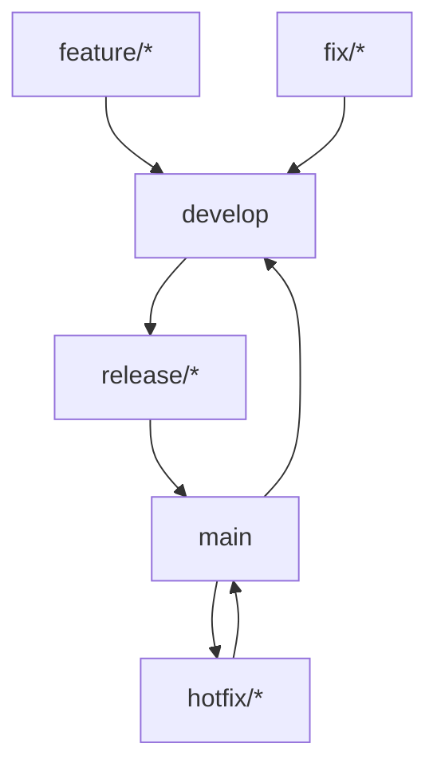

# Git分支与发布流程规范

## 📋 文档版本信息

| 项目 | 详细信息 |
|------|----------|
| **文档版本** | v3.0 |
| **更新日期** | 2026-03-17 |
| **适用版本** | v0.3.1+ |
| **更新内容** | 优化发布流程（预检→CI 验证→正式发布），新增标签推送最佳实践，解决 CI/CD 失败后的版本管理问题 |

## 1. 分支管理规范

### 1.1 分支命名约定

| 分支类型 | 命名格式 | 说明 | 示例 |
|---------|---------|------|------|
| 主分支 | `main` | 稳定版本分支，用于生产环境 | `main` |
| 开发分支 | `develop` | 集成开发分支，用于功能集成 | `develop` |
| 功能分支 | `feature/<功能名>` | 新功能开发分支 | `feature/user-auth` |
| 修复分支 | `fix/<问题描述>` | Bug修复分支 | `fix/api-response-error` |
| 发布分支 | `release/<版本号>` | 版本发布准备分支 | `release/v1.0.0` |
| 热修复分支 | `hotfix/<紧急修复>` | 紧急修复分支 | `hotfix/security-patch` |

### 1.2 分支生命周期



## 2. 提交信息规范

### 2.1 提交格式
```
<类型>(<范围>): <主题>

<正文>

<页脚>
```

### 2.2 提交类型
- `feat`: 新功能
- `fix`: Bug修复
- `docs`: 文档变更
- `style`: 代码风格变更
- `refactor`: 代码重构
- `perf`: 性能优化
- `test`: 测试相关
- `build`: 构建系统变更
- `ci`: CI配置变更
- `chore`: 其他变更

### 2.3 提交示例
```bash
# 功能提交
git commit -m "feat(auth): 添加用户登录功能

- 实现JWT认证机制
- 添加用户登录API端点
- 完善错误处理逻辑"

# Bug修复提交
git commit -m "fix(api): 修复响应格式错误

修复了API返回的JSON格式错误，确保所有端点返回有效的JSON响应"
```

## 3. 发布流程规范

### 3.1 版本发布流程（优化版）

#### 阶段一：发布准备与预检

1. **准备发布**
   ```bash
   git checkout develop
   git pull
   git checkout -b release/v0.3.1
   ```

2. **更新版本信息**
   - 更新 `pyproject.toml` 中的版本号（如：0.3.0 → 0.3.1）
   - 更新 `AGENTS.md` 中的版本号
   - 更新 `README.md` 中的版本号
   - 更新 `CHANGELOG.md`（如有）

3. **本地预检**
   ```bash
   # 运行代码质量检查
   uv run black --check src tests
   uv run isort --check-only src tests
   uv run mypy src
   uv run bandit -r src
   
   # 运行测试套件
   uv run pytest tests/ -v
   
   # 验证构建
   uv build
   ```

4. **推送预检分支触发 CI 预检**
   ```bash
   # 推送 release 分支，触发预检 workflow（不创建标签）
   git push origin release/v0.3.1
   ```
   
   **说明**：此时会触发 `.github/workflows/release-pre-check.yml`，执行完整 CI 流程但不发布。

#### 阶段二：CI 验证通过后的正式发布

5. **确认预检 CI 通过**
   - 访问 GitHub Actions 查看预检 workflow 状态
   - 确认所有检查项通过（code-quality, test, build）
   - 如有失败，在 release 分支修复后重新推送

6. **合并到 main 分支**
   ```bash
   git checkout main
   git merge release/v0.3.1
   ```

7. **创建并发布标签（关键步骤）**
   ```bash
   # 创建标签（本地）
   git tag -a v0.3.1 -m "版本 0.3.1 发布"
   
   # 推送代码到 main 分支
   git push origin main
   
   # 推送标签（明确指定标签名，避免推送旧标签）
   git push origin v0.3.1
   ```
   
   **⚠️ 重要注意事项**：
   - ✅ **推荐**：`git push origin v0.3.1`（只推送新标签）
   - ✅ **推荐**：`git push origin main && git push origin v0.3.1`（分步推送）
   - ❌ **避免**：`git push origin main --tags`（会尝试推送所有标签，包括已存在的旧标签）
   
   **原因**：使用 `--tags` 会推送所有本地标签到远程，如果远程已存在同名标签（如 v0.3.0），会导致推送失败并产生错误提示。虽然不影响新标签的发布，但会造成混淆。

8. **合并回 develop 分支**
   ```bash
   git checkout develop
   git merge main
   git push origin develop
   ```

9. **删除发布分支**
   ```bash
   git branch -d release/v0.3.1
   git push origin --delete release/v0.3.1
   ```

#### 阶段三：发布验证

10. **验证 GitHub Release**
    - 访问 https://github.com/yecllsl/nanobot-runner/releases
    - 确认 v0.3.1 标签已创建
    - 确认 Release 资产（.whl, .tar.gz）已上传

11. **验证 PyPI 发布**
    - 访问 https://pypi.org/project/nanobot-runner/#history
    - 确认版本号已更新到 v0.3.1

12. **验证 GitHub Actions**
    - 访问 https://github.com/yecllsl/nanobot-runner/actions
    - 确认 Release workflow 执行成功

### 3.2 热修复流程

1. **创建热修复分支**
   ```bash
   git checkout main
   git checkout -b hotfix/security-patch
   ```

2. **修复问题并测试**

3. **合并到main和develop**
   ```bash
   git checkout main
   git merge hotfix/security-patch
   git tag -a v1.0.1 -m "紧急安全修复"
   git push origin main --tags
   
   git checkout develop
   git merge main
   git push origin develop
   ```

## 4. 代码审查规范

### 4.1 Pull Request要求
- 每个PR必须关联Issue或功能描述
- PR标题清晰描述变更内容
- PR描述详细说明变更原因和影响
- 必须通过所有自动化测试
- 代码覆盖率不能降低

### 4.2 审查标准
- 代码符合项目编码规范
- 有适当的测试覆盖
- 没有引入安全漏洞
- 文档更新完整
- 性能影响可接受

## 5. 自动化流程

### 5.1 CI/CD流水线触发条件
- **Push到main分支**: 触发生产环境部署
- **Push到develop分支**: 触发测试环境部署
- **创建Pull Request**: 触发代码质量检查
- **创建Tag**: 触发版本发布流程

### 5.2 流水线阶段
1. **代码质量检查**: 代码规范、静态分析
2. **单元测试**: 运行所有单元测试
3. **集成测试**: 运行集成测试套件
4. **构建打包**: 生成可执行包
5. **部署验证**: 部署到测试环境验证
6. **发布**: 发布到生产环境

## 6. 安全规范

### 6.1 敏感信息保护
- 禁止提交包含API密钥、密码等敏感信息的代码
- 使用环境变量管理敏感配置
- 定期扫描代码库中的敏感信息

### 6.2 访问控制
- main分支保护：禁止直接push
- 代码审查：至少1人审查通过
- 权限管理：按角色分配仓库权限

## 7. 备份与恢复

### 7.1 备份策略
- 定期备份Git仓库
- 备份数据库和配置文件
- 验证备份的完整性和可恢复性

### 7.2 恢复流程
- 从最近的备份恢复代码
- 验证恢复后的系统功能
- 更新文档记录恢复过程

## 8. 监控与告警

### 8.1 监控指标
- 代码提交频率
- 构建成功率
- 部署成功率
- 测试覆盖率变化

### 8.2 告警规则
- 构建失败立即告警
- 代码质量下降告警
- 安全漏洞检测告警

---

**最后更新**: 2026-03-02  
**维护者**: DevOps智能体