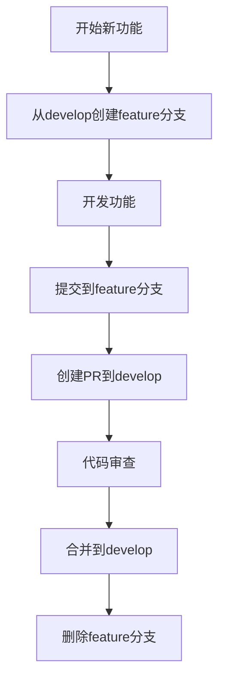
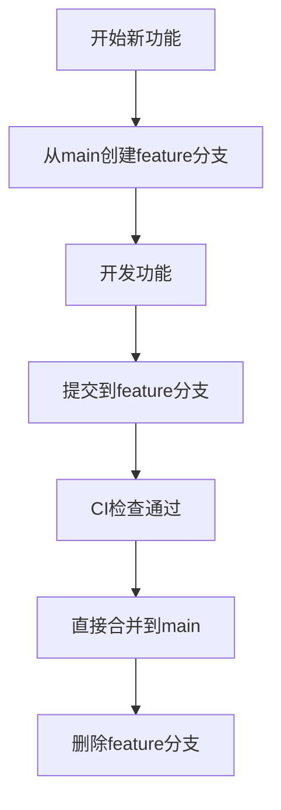
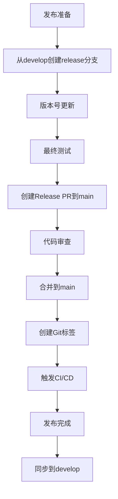
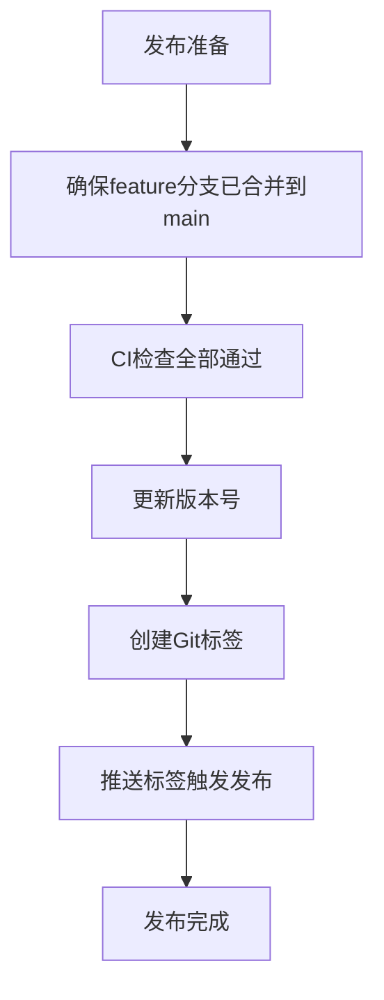

# 分支管理与发布流程规范

## 1. 概述

本文档定义了 Nanobot Runner 项目的分支管理策略和发布流程。

## 2. 分支命名规范

### 2.1 分支类型与命名

| 分支类型 | 命名规范 | 用途 | 生命周期 |
|---------|---------|------|---------|
| **主分支** | `main` | 生产发布 | 永久 |
| **开发分支** | `develop` | 功能集成 | 永久 |
| **特性分支** | `feature/<功能描述>` | 新功能开发 | 功能完成 |
| **修复分支** | `fix/<问题描述>` | Bug修复 | 修复完成 |
| **发布分支** | `release/v<版本号>` | 版本发布准备 | 发布完成 |
| **热修复分支** | `hotfix/<紧急问题>` | 生产问题修复 | 修复完成 |

### 2.2 命名示例

- `feature/user-authentication`
- `fix/memory-leak-issue`
- `release/v0.5.0`
- `hotfix/critical-security-fix`

## 3. 分支创建与合并规则

### 3.1 分支创建流程

#### 3.1.1 团队开发模式（多人项目）


#### 3.1.2 单人开发模式（推荐）


### 3.2 合并规则

#### 3.2.1 团队开发模式
1. **特性分支 → develop**：通过 Pull Request 合并
2. **develop → main**：通过 Release PR 合并
3. **热修复 → main**：紧急情况下直接合并
4. **main → develop**：定期同步生产代码

#### 3.2.2 单人开发模式（推荐）
1. **特性分支 → main**：CI检查通过后直接合并
2. **热修复 → main**：紧急情况下直接合并
3. **简化流程**：跳过develop分支，减少维护成本

### 3.3 代码审查要求

#### 3.3.1 团队开发模式
- **审查人员**：至少1名核心开发者
- **审查内容**：代码质量、测试覆盖、文档更新
- **通过标准**：所有检查通过，无阻塞性问题

#### 3.3.2 单人开发模式
- **审查方式**：依赖CI/CD自动化检查
- **审查内容**：代码格式化、类型检查、测试覆盖、安全扫描
- **通过标准**：CI检查全部通过，无阻塞性问题

## 4. 发布周期与版本管理

### 4.1 版本号规范

采用语义化版本控制（SemVer）：`主版本.次版本.修订版本`

- **主版本**：不兼容的API修改
- **次版本**：向下兼容的功能性新增
- **修订版本**：向下兼容的问题修正

### 4.2 发布周期

| 发布类型 | 周期 | 触发条件 |
|---------|------|---------|
| **常规发布** | 2-4周 | 功能积累达到发布标准 |
| **紧急发布** | 随时 | 生产环境严重问题 |
| **安全发布** | 立即 | 安全漏洞修复 |

## 5. 发布流程

### 5.1 团队开发模式发布流程



### 5.2 单人开发模式发布流程（推荐）



**单人开发模式优势**：
- **简化流程**：跳过release分支和develop分支同步，减少维护成本
- **快速迭代**：feature分支直接合并到main，加速发布周期
- **自动化质量保障**：依赖CI检查作为质量门禁，无需人工审查

**关键注意事项**：
- 确保所有代码已合并到main分支后再创建标签
- 禁止在PR合并前推送标签（会导致发布包不完整）
- 验证pyproject.toml中的版本号与标签一致

### 5.3 自动化发布

GitHub Actions 自动执行以下步骤：
1. **质量检查**：代码格式化、类型检查、安全扫描
2. **测试执行**：单元测试、集成测试、性能测试
3. **构建打包**：生成 wheel 和 sdist 包
4. **发布部署**：创建 GitHub Release，上传包文件

## 6. CI/CD 流水线配置

### 6.1 触发规则

#### 6.1.1 团队开发模式
| 分支类型 | 触发条件 | 质量门禁 |
|---------|---------|---------|
| **main分支** | 仅PR触发 + 紧急推送 | 严格检查 |
| **develop分支** | 仅PR触发 | 标准检查 |
| **feature分支** | 不触发CI | 无 |

#### 6.1.2 单人开发模式（推荐）
| 分支类型 | 触发条件 | 质量门禁 |
|---------|---------|---------|
| **main分支** | 推送触发 + PR触发 | 严格检查 |
| **feature分支** | 推送触发 | 标准检查 |
| **hotfix分支** | 推送触发 | 严格检查 |

### 6.2 分支保护策略

#### 6.2.1 团队开发模式
- **main分支**：启用PR审查要求，至少1人批准
- **develop分支**：启用PR审查要求
- **管理员绕过**：禁用（确保所有变更都经过审查）

#### 6.2.2 单人开发模式（推荐）
- **main分支**：禁用PR审查要求，保留CI检查
- **管理员绕过**：启用（允许紧急修复）
- **线性历史**：启用（保持提交历史清晰）

### 6.3 质量门禁

| 检查项 | 工具 | 门禁要求 |
|--------|------|----------|
| 代码格式化 | black | 零警告 |
| 导入排序 | isort | 零警告 |
| 类型检查 | mypy | 警告可接受 |
| 安全扫描 | bandit | 高危漏洞=0 |
| 单元测试 | pytest | 通过率100% |
| 代码覆盖率 | pytest-cov | core≥80%, agents≥70%, cli≥60% |

## 7. 常用命令参考

### 7.1 团队开发模式
```bash
# 分支管理
git checkout -b feature/new-feature develop  # 创建特性分支
git push origin feature/new-feature          # 推送特性分支
git branch -d feature/new-feature            # 删除本地特性分支

# 发布流程
git checkout -b release/v0.5.0 develop       # 创建发布分支
git tag -a v0.5.0 -m "Release v0.5.0"        # 创建标签
git push origin v0.5.0                       # 推送标签

# 同步操作
git checkout develop                         # 切换到develop
git merge main                               # 同步main到develop
```

### 7.2 单人开发模式（推荐）
```bash
# 分支管理
git checkout -b feature/new-feature main     # 从main创建特性分支
git push origin feature/new-feature          # 推送特性分支
git branch -d feature/new-feature            # 删除本地特性分支

# 发布流程（简化）
git tag -a v0.5.0 -m "Release v0.5.0"        # 在main分支创建标签
git push origin v0.5.0                       # 推送标签

# 紧急修复
git checkout -b hotfix/critical-issue main   # 创建热修复分支
git push origin hotfix/critical-issue        # 推送热修复
# 合并后删除分支：git push origin --delete hotfix/critical-issue
```

### 7.3 分支保护设置（GitHub）

#### 7.3.1 单人开发模式设置
```bash
# 查看当前保护设置
gh api repos/yecllsl/nanobot-runner/branches/main/protection

# 推荐的单人开发设置
{
  "required_pull_request_reviews": null,      # 禁用PR审查
  "enforce_admins": false,                    # 允许管理员绕过
  "required_status_checks": {
    "strict": true,
    "contexts": ["ci"]
  }
}
```

---

**文档版本**: v0.4.5  
**最后更新**: 2026-03-31  
**维护者**: DevOps Team  
**更新说明**: 新增单人开发模式推荐配置，优化分支保护策略
