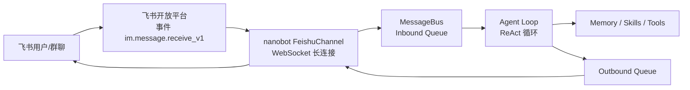

nanobot 已经内置了完整的飞书通道（WebSocket 长连接、接收消息、富文本解析、媒体下载等），基于它做飞书集成，最有价值的方向是：**在飞书里做“能看见、能听见、能动手”的企业级 AI Agent**，而不是一个纯聊天机器人。
下面我按“功能方向 + 和 nanobot 的结合点”给你梳理，方便你挑重点做二次开发。
---
## 一、整体架构：飞书在 nanobot 里的位置
nanobot 的架构是：Channel → Bus → Agent Core → Memory / Tools / LLM。  
飞书 Channel 只是一个“适配器”，把飞书消息转成统一的 `InboundMessage`，再由 Agent Loop 统一处理。

**你可以：**
- 在 `channels/feishu` 里扩展消息处理（比如新事件、新消息类型）。
- 在 `agent/tools` 里扩展“飞书相关工具”（比如读写飞书文档、操作日历）。
- 在 `skills` 里做“面向飞书场景的智能体角色”（如运维告警机器人、工单助手）。
---
## 二、可以重点考虑的飞书集成功能方向
### 1. 飞书富媒体 & 文件能力增强（推荐优先做）
**现状：**
- nanobot 已支持飞书 WebSocket 长连接接收消息，并解析富文本/表格等。
- 有 PR 专门增加了飞书媒体文件下载支持，图片、音频、文件、视频都能下载到 `~/.nanobot/media`，并把路径注入到消息里，供 Agent 使用。
**可以扩展的功能：**
1. **支持更多飞书消息类型**
   - 卡片消息（飞书卡片/交互卡片）。
   - 语音消息（ Whisper 转文字后交给 Agent）。
   - 视频消息（抽取关键帧/字幕再分析）。
   - 需要在 `FeishuChannel._handle_event` 里增加对这些 `msg_type` 的处理，再转换成统一的 `InboundMessage`。
2. **统一“文件-记忆-知识库”链路**
   - 用户在飞书里发文件/图片 → 自动下载 → 写入知识库（如向量数据库）。
   - Agent 在回答时，可以引用这些文件内容，甚至直接“翻飞书群文件”。
   - 你可以写一个 `tools/feishu_files.py`，封装“列出群文件 / 读取文件内容 / 写入多维表格”等能力。
3. **飞书文档/表格自动生成**
   - Agent 生成报告后，直接创建飞书文档或表格，并回链到群里。
   - 这块可以直接调用飞书开放接口（`docs:document.content:read`、`sheets:spreadsheet` 等权限）。
---
### 2. 飞书群聊 & 工作流自动化（企业场景最感兴趣）
**现状：**
- nanobot 已支持 `groupPolicy: mention | open`，以及 `allowFrom` 白名单。
- 飞书开放平台提供“消息与群组 API”，可以创建群、拉人、改群名、发消息等。
**可以做的功能：**
1. **告警 / 监控机器人**
   - 接到监控系统告警 → 通过飞书机器人自动创建“告警群” → 拉相关人员进群 → 定时推送处理进度 → 问题解决后自动改群名、归档或解散群。
   - 实现方式：写一个 `tools/feishu_group.py`，封装“创建群 / 拉人 / 发消息 / 解散群”，然后在 Skill 里编排。
2. **工单 / 反馈机器人**
   - 用户在某个群或私聊中反馈问题 → 机器人创建群聊 → 同步相关信息（来自多维表格或工单系统）→ 每次消息更新都自动同步到记录系统。
   - 结合 nanobot 的 Memory，可以让机器人“记住每个工单的上下文”，不丢失信息。
3. **流程审批机器人**
   - 结合飞书审批流 + nanobot，做自然语言审批：
     - “帮我发起一个请假审批，时间为 3 月 20 日至 3 月 22 日”。
   - 你需要对接飞书审批 API，并在 Skill 里定义审批动作和状态机。
---
### 3. 飞书知识库 & 企业问答助手
**现状：**
- nanobot 有三层记忆系统：Session（会话）、History（事件）、Memory（认知快照）。
- 飞书开放平台支持访问文档、知识库、多维表格等能力。
**可以做的功能：**
1. **飞书知识库问答**
   - Agent 在回答时，优先从飞书文档/知识库中检索内容，而不是仅依赖通用模型。
   - 你可以在工具层实现“飞书知识库搜索 / 文档检索”，并把结果注入到 Agent 的上下文中。
2. **自动整理群聊知识**
   - 选定一些“知识群”，让机器人定期将群内重要信息整理成飞书文档或知识库页面。
   - 可以利用 nanobot 的 `HISTORY.md` 和 `MEMORY.md` 机制，把群聊关键事件抽象为长期记忆。
3. **“企业百科”机器人**
   - 类似飞书官方的“企业百科”场景：用户发关键词 → 机器人匹配企业知识库 → 回答并附上来源链接。
---
### 4. 飞书日历 & 日程管理
**飞书能力：**
- 飞书开放平台提供日历、日程相关 API，可以查询、创建、修改日程等。
**可以做的功能：**
1. **自然语言日程助手**
   - “帮我安排一个 3 月 20 日下午 3 点的产品评审会，邀请 XX 群的所有人”。
   - Agent 调用飞书日历 API 创建日程，并在群里同步日程卡片。
2. **智能会议纪要**
   - 会议结束后，让 Agent 根据聊天记录和文档，生成飞书文档形式的会议纪要，并同步到相关群。
---
### 5. 飞书卡片交互 & 多轮表单式对话
**飞书能力：**
- 飞书支持交互卡片，用户点击按钮、下拉框等，会触发事件推送到你的服务。
- 需要开通 `cardkit:card:write` 等权限。
**可以做的功能：**
1. **卡片式多轮表单**
   - 例如：故障上报 → 先选故障类型 → 再选影响范围 → 再填写描述 → 最终生成工单。
   - 你可以在 `FeishuChannel` 里增加对卡片回调事件的处理，将用户选择映射为 `InboundMessage` 的特殊字段，由 Agent 统一处理。
2. **操作确认 / 审批卡片**
   - 危险操作（删除、重启服务）通过卡片让用户确认，避免误操作。
   - 可以利用 nanobot 的“虚拟工具”设计模式，让 Agent 输出结构化的决策，再由前端卡片渲染。
---
### 6. 多机器人 / 多租户 & 企业级管理
**现状：**
- nanobot 支持 `--config` 和 `--workspace`，可以跑多个实例，每个实例对应一个渠道或租户。
- OpenClaw 的文档中也推荐为不同 Agent 配置不同飞书机器人账号（`accounts` 字段）。
**可以做的功能：**
1. **多飞书机器人（不同部门/不同场景）**
   - 一个 nanobot 实例管理多个飞书机器人：
     - 运维机器人：负责告警、重启服务等。
     - HR 机器人：负责请假、入职指引。
   - 在配置里通过 `channels.feishu.accounts` 区分不同机器人。
2. **企业级管理后台**
   - 做一个简单的管理后台，用于：
     - 审批配对请求（nanobot 的 `allowFrom` 机制）。
     - 为不同群配置不同的 Agent / Skill / 权限。
   - 这部分可以是独立 Web 服务，通过 RPC 或直接修改 nanobot 的配置/数据库。
---
## 三、结合 nanobot 已有能力，你可以怎么落地
1. **从“消息增强”开始**
   - 先在 `channels/feishu` 里补充对卡片、语音、视频等消息类型的处理，让飞书消息更完整地进入 Agent Loop。
   - 利用已有的媒体下载能力，把文件和图片变成 Agent 可以直接用的资源。
2. **再扩展“飞书工具”**
   - 在 `agent/tools` 里封装飞书常用能力：群管理、发消息、文档操作、日历操作等。
   - 参考 nanobot 已有的 Shell / Web / File 工具实现模式。
3. **最后做“场景化 Skill”**
   - 针对具体业务场景（运维告警、工单助手、知识库问答）定义 Skill：
     - 设定人设（`SOUL.md` 风格）。
     - 限定可用工具（只允许调用某些飞书 API）。
     - 设计记忆/知识管理策略（哪些信息要长期记住）。
---
## 四、一个简单的“飞书告警机器人”示例思路
假设你要做一个“告警机器人”，核心流程可以是：
1. 监控系统 → 调用你暴露的 HTTP 接口。
2. nanobot 通过工具创建飞书群、拉人、发消息。
3. Agent 在群里持续更新状态，直到问题解决。
你只需要：
- 在 `tools/` 里写一个 `feishu_group.py`，封装“创建群 / 发消息 / 改群名”。
- 在 Skill 里定义“告警处理”的工作流和语气。
- 配置一个飞书机器人账号，开通相应权限（`im:chat`、`im:message` 等）。
---

