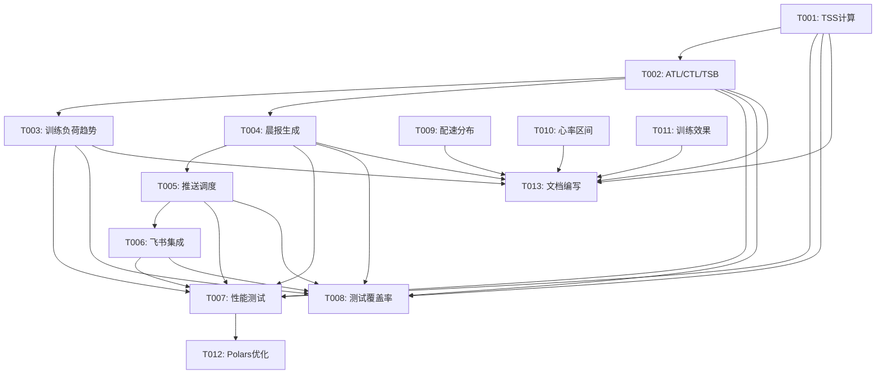

# 迭代开发任务清单 v0.3.0

## 文档信息

| 项目 | 内容 |
|------|------|
| 版本号 | v0.3.0 |
| 迭代主题 | 训练负荷完整实现与智能晨报生成 |
| 迭代周期 | 10 个工作日 |
| 总预估工时 | 61 小时 |
| 任务总数 | 13 个 |
| 创建日期 | 2026-03-06 |
| 基线版本 | v0.2.0 |

---

## 1. 任务分解总览

### 1.1 按优先级分类

| 优先级 | 任务数 | 预估工时 | 占比 |
|--------|--------|----------|------|
| P0 (核心) | 11 | 53h | 87% |
| P1 (扩展) | 2 | 8h | 13% |

### 1.2 按模块分类

| 模块 | 任务数 | 预估工时 |
|------|--------|----------|
| 训练负荷计算 | 3 | 14h |
| 晨报生成与推送 | 3 | 13h |
| 性能优化与测试 | 2 | 14h |
| 分析指标扩展 | 3 | 12h |
| 其他 | 2 | 8h |

---

## 2. 详细任务清单

### 2.1 P0 核心任务

#### T001: 实现 TSS 计算功能

| 属性 | 内容 |
|------|------|
| 任务ID | T001 |
| 任务名称 | 实现 TSS 计算功能 |
| 优先级 | P0 |
| 预估工时 | 4h |
| 前置依赖 | 无 |
| 负责模块 | `src/core/analytics.py` |

**任务描述**:
实现单次跑步的 TSS (训练压力分数) 计算，支持基于心率的 TSS 计算。

**验收标准**:
- [ ] 实现 `calculate_tss_for_run()` 方法
- [ ] 心率数据缺失时返回 0
- [ ] 时长为 0 时返回 0
- [ ] TSS 值范围合理 (0-500)
- [ ] 计算结果与 TrainingPeaks 标准一致 (误差 < 5%)
- [ ] 单元测试覆盖率 ≥ 90%

---

#### T002: 实现 ATL/CTL/TSB 计算

| 属性 | 内容 |
|------|------|
| 任务ID | T002 |
| 任务名称 | 实现 ATL/CTL/TSB 计算 |
| 优先级 | P0 |
| 预估工时 | 6h |
| 前置依赖 | T001 |
| 负责模块 | `src/core/analytics.py` |

**任务描述**:
实现训练负荷计算 (ATL/CTL/TSB)，使用指数加权移动平均 (EWMA) 算法。

**验收标准**:
- [ ] 实现 `get_training_load()` 方法
- [ ] ATL/CTL 计算使用 EWMA
- [ ] 数据不足时返回友好提示
- [ ] 计算结果与行业标准一致 (误差 < 10%)
- [ ] 提供体能状态评估和训练建议
- [ ] 性能要求: 1000 条记录计算时间 < 2 秒
- [ ] 单元测试覆盖率 ≥ 90%

---

#### T003: 实现训练负荷趋势分析

| 属性 | 内容 |
|------|------|
| 任务ID | T003 |
| 任务名称 | 实现训练负荷趋势分析 |
| 优先级 | P0 |
| 预估工时 | 4h |
| 前置依赖 | T002 |
| 负责模块 | `src/core/analytics.py` |

**任务描述**:
实现训练负荷趋势数据获取，支持可视化图表展示。

**验收标准**:
- [ ] 实现 `get_training_load_trend()` 方法
- [ ] 返回每日训练负荷数据
- [ ] 包含体能状态评估
- [ ] 性能要求: 90 天数据计算时间 < 3 秒
- [ ] 单元测试覆盖率 ≥ 85%

---

#### T004: 实现晨报内容生成

| 属性 | 内容 |
|------|------|
| 任务ID | T004 |
| 任务名称 | 实现晨报内容生成 |
| 优先级 | P0 |
| 预估工时 | 6h |
| 前置依赖 | T002 |
| 负责模块 | `src/core/analytics.py`, `src/notify/feishu.py` |

**任务描述**:
基于训练负荷数据，自动生成每日晨报内容。

**验收标准**:
- [ ] 实现 `generate_daily_report()` 方法
- [ ] 晨报内容完整，包含所有关键字段
- [ ] 训练建议基于训练负荷数据生成
- [ ] 语言风格友好且专业
- [ ] 生成时间 < 1 秒
- [ ] 单元测试覆盖率 ≥ 85%

---

#### T005: 实现晨报推送调度

| 属性 | 内容 |
|------|------|
| 任务ID | T005 |
| 任务名称 | 实现晨报推送调度 |
| 优先级 | P0 |
| 预估工时 | 4h |
| 前置依赖 | T004 |
| 负责模块 | `src/cli.py` |

**任务描述**:
配置每日晨报推送调度，支持配置推送时间和启用/禁用。

**验收标准**:
- [ ] 实现 `schedule_daily_report()` 方法
- [ ] 支持配置推送时间
- [ ] 支持启用/禁用推送
- [ ] 推送时间准确 (误差 < 1 分钟)
- [ ] 推送失败时记录日志并重试
- [ ] 单元测试覆盖率 ≥ 80%

---

#### T006: 集成飞书推送

| 属性 | 内容 |
|------|------|
| 任务ID | T006 |
| 任务名称 | 集成飞书推送 |
| 优先级 | P0 |
| 预估工时 | 3h |
| 前置依赖 | T005 |
| 负责模块 | `src/notify/feishu.py` |

**任务描述**:
完善飞书晨报推送功能，使用卡片消息格式。

**验收标准**:
- [ ] 实现 `send_daily_report_to_feishu()` 方法
- [ ] 消息格式正确 (飞书卡片消息)
- [ ] 推送成功率 ≥ 99%
- [ ] 推送失败时记录详细日志
- [ ] 支持 Webhook URL 配置
- [ ] 单元测试覆盖率 ≥ 85%

---

#### T007: 补充性能测试

| 属性 | 内容 |
|------|------|
| 任务ID | T007 |
| 任务名称 | 补充性能测试 |
| 优先级 | P0 |
| 预估工时 | 6h |
| 前置依赖 | T001-T006 |
| 负责模块 | `tests/performance/` |

**任务描述**:
补充性能基准测试，确保查询响应时间满足架构设计要求。

**验收标准**:
- [ ] 实现查询性能测试 (日期范围、距离范围)
- [ ] 实现 VDOT 趋势查询性能测试
- [ ] 实现训练负荷计算性能测试
- [ ] 实现晨报生成性能测试
- [ ] 所有性能测试通过
- [ ] 生成性能测试报告

---

#### T008: 提升测试覆盖率

| 属性 | 内容 |
|------|------|
| 任务ID | T008 |
| 任务名称 | 提升测试覆盖率 |
| 优先级 | P0 |
| 预估工时 | 8h |
| 前置依赖 | T001-T006 |
| 负责模块 | `tests/unit/`, `tests/integration/` |

**任务描述**:
提升测试覆盖率至 80% 以上，补充边界场景测试。

**验收标准**:
- [ ] `src/core/analytics.py` 覆盖率 ≥ 85%
- [ ] `src/agents/tools.py` 覆盖率 ≥ 85%
- [ ] `src/notify/feishu.py` 覆盖率 ≥ 80%
- [ ] `src/cli_formatter.py` 覆盖率 ≥ 80%
- [ ] 总体覆盖率 ≥ 80%
- [ ] 所有测试通过

---

#### T009: 实现配速分布分析

| 属性 | 内容 |
|------|------|
| 任务ID | T009 |
| 任务名称 | 实现配速分布分析 |
| 优先级 | P0 |
| 预估工时 | 4h |
| 前置依赖 | 无 |
| 负责模块 | `src/core/analytics.py` |

**任务描述**:
实现配速分布分析，提供配速区间统计。

**验收标准**:
- [ ] 实现 `get_pace_distribution()` 方法
- [ ] 配速区间划分合理
- [ ] 返回配速趋势分析
- [ ] 性能要求: 计算时间 < 2 秒
- [ ] 单元测试覆盖率 ≥ 85%

---

#### T010: 实现心率区间分析

| 属性 | 内容 |
|------|------|
| 任务ID | T010 |
| 任务名称 | 实现心率区间分析 |
| 优先级 | P0 |
| 预估工时 | 4h |
| 前置依赖 | 无 |
| 负责模块 | `src/core/analytics.py` |

**任务描述**:
实现心率区间分析，基于最大心率百分比划分区间。

**验收标准**:
- [ ] 实现 `get_heart_rate_zones()` 方法
- [ ] 心率区间划分符合运动科学原理
- [ ] 支持自定义年龄参数
- [ ] 性能要求: 计算时间 < 2 秒
- [ ] 单元测试覆盖率 ≥ 85%

---

#### T011: 实现训练效果评估

| 属性 | 内容 |
|------|------|
| 任务ID | T011 |
| 任务名称 | 实现训练效果评估 |
| 优先级 | P0 |
| 预估工时 | 4h |
| 前置依赖 | 无 |
| 负责模块 | `src/core/analytics.py` |

**任务描述**:
实现训练效果评估，提供有氧/无氧效果评估。

**验收标准**:
- [ ] 实现 `get_training_effect()` 方法
- [ ] 有氧/无氧效果评估合理
- [ ] 提供恢复时间估算
- [ ] 性能要求: 计算时间 < 2 秒
- [ ] 单元测试覆盖率 ≥ 85%

---

### 2.2 P1 扩展任务

#### T012: Polars 查询优化

| 属性 | 内容 |
|------|------|
| 任务ID | T012 |
| 任务名称 | Polars 查询优化 |
| 优先级 | P1 |
| 预估工时 | 4h |
| 前置依赖 | T007 |
| 负责模块 | `src/core/storage.py`, `src/core/analytics.py` |

**任务描述**:
优化 Polars 查询性能，使用 Lazy API 和缓存机制。

**验收标准**:
- [ ] 使用 LazyFrame 延迟加载
- [ ] 实现谓词下推优化
- [ ] 添加查询缓存机制
- [ ] 查询性能提升 ≥ 20%
- [ ] 无功能回归

---

#### T013: 文档编写

| 属性 | 内容 |
|------|------|
| 任务ID | T013 |
| 任务名称 | 文档编写 |
| 优先级 | P1 |
| 预估工时 | 4h |
| 前置依赖 | T001-T011 |
| 负责模块 | `docs/` |

**任务描述**:
编写 v0.3.0 版本相关文档，包括 API 文档、用户指南、发布说明。

**验收标准**:
- [ ] 更新 API 文档
- [ ] 更新用户指南
- [ ] 编写发布说明 (CHANGELOG)
- [ ] 更新 README.md

---

## 3. 任务依赖关系

---

## 4. 里程碑节点

| 里程碑 | 时间节点 | 交付物 | 验收标准 |
|--------|---------|--------|----------|
| M1: 训练负荷功能实现 | Day 3 | TSS/ATL/CTL 计算功能 | T001-T003 完成，单元测试通过 |
| M2: 晨报生成与推送 | Day 5 | 每日晨报自动推送 | T004-T006 完成，推送测试通过 |
| M3: 性能优化与测试 | Day 7 | 性能测试通过，覆盖率 ≥ 80% | T007-T008 完成，性能达标 |
| M4: 分析指标扩展 | Day 8 | 配速/心率区间分析 | T009-T011 完成，单元测试通过 |
| M5: 发布准备 | Day 10 | v0.3.0 正式发布 | 所有任务完成，CI/CD 通过 |

---

## 5. 风险识别与应对

| 风险项 | 可能性 | 影响程度 | 应对策略 |
|--------|--------|---------|---------|
| TSS 计算准确率不达标 | 中 | 高 | 参考 TrainingPeaks 标准，进行对比测试 |
| 性能不达标 | 中 | 高 | 使用 Polars Lazy API 优化，添加缓存 |
| 飞书推送失败 | 低 | 中 | 实现重试机制，记录详细日志 |
| 测试覆盖率不足 | 中 | 中 | 制定详细测试计划，自动化测试 |
| 开发周期延期 | 中 | 中 | 优先保证 MVP，扩展功能延后 |

---

## 6. 验收标准汇总

### 6.1 功能验收

- [ ] 所有 P0 任务完成
- [ ] 所有单元测试通过
- [ ] 所有集成测试通过
- [ ] 所有性能测试通过

### 6.2 质量验收

- [ ] 总体测试覆盖率 ≥ 80%
- [ ] 类型检查通过 (mypy)
- [ ] 代码格式化通过 (black, isort)
- [ ] 安全扫描无高危漏洞 (bandit)

### 6.3 性能验收

| 测试场景 | 数据规模 | 响应时间要求 |
|---------|---------|-------------|
| TSS 计算 | 单条记录 | < 0.1 秒 |
| 训练负荷计算 | 1000 条记录 | < 2 秒 |
| 晨报生成 | - | < 1 秒 |
| 日期范围查询 | 10000 条记录 | < 3 秒 |

---

## 7. 变更历史

| 版本 | 日期 | 变更内容 | 作者 |
|------|------|---------|------|
| v0.1 | 2026-03-06 | 初始版本 | 架构师智能体 |

---

**文档状态**: 待评审
**下次更新**: 开发启动后更新
**发布版本**: v0.3.0
