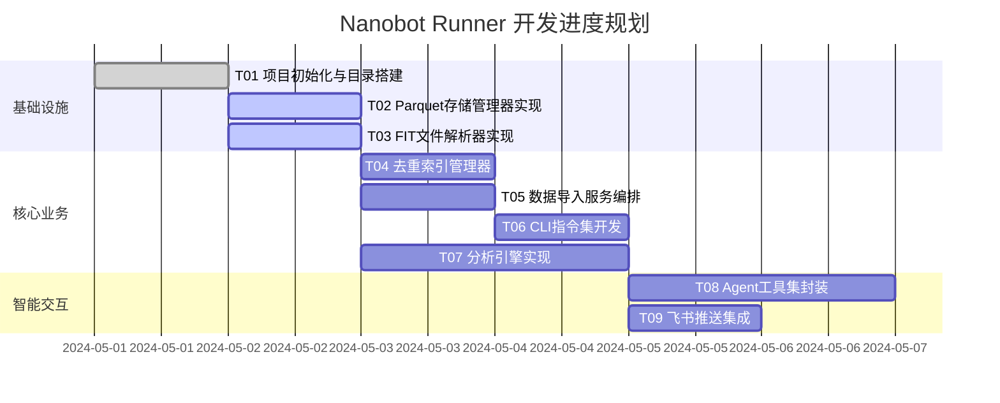

# 开发任务拆解清单
## 1. 迭代规划概览
本项目采用迭代式开发，分为两个主要阶段：
*   **MVP阶段 (V1.0)**：实现本地数据闭环，包含 FIT 解析、Parquet 存储、去重导入、CLI 指令、基于 Polars 的核心指标计算。
*   **迭代阶段 (V1.1)**：实现智能交互扩展，包含 Agent 自然语言查询工具、飞书推送集成。
## 2. 任务依赖关系图

## 3. 详细任务定义
### 3.1 基础设施层模块
#### T01 - 项目初始化与目录结构搭建
*   **优先级**：P0
*   **预估工时**：2小时
*   **前置依赖**：无
*   **任务描述**：
    *   初始化 Python 项目，配置 `pyproject.toml`。
    *   引入核心依赖：`polars`, `pyarrow`, `fitparse`, `typer`, `rich`。
    *   按照架构设计创建 `src/core`, `src/agents`, `src/cli` 等标准目录。
    *   配置 `~/.nanobot-runner/` 本地数据目录的初始化逻辑。
*   **交付物**：可运行的空白项目骨架，包含依赖锁定文件。
*   **验收标准**：执行 `nanobotrun --help` 能正常输出帮助信息（即使无具体功能）。
#### T02 - Parquet 存储管理器实现
*   **优先级**：P0
*   **预估工时**：4小时
*   **前置依赖**：T01
*   **任务描述**：
    *   封装 `StorageManager` 类。
    *   实现 `save_to_parquet(dataframe, year)` 方法：支持按年份分片追加写入数据。
    *   实现 `read_parquet(years=None)` 方法：支持读取指定年份或全量数据，返回 Polars LazyFrame。
    *   实现 `get_stats()` 方法：统计总记录数、时间跨度。
*   **交付物**：`src/core/storage.py`
*   **验收标准**：单元测试通过，能够成功写入 100 条模拟数据并正确读取。
#### T03 - FIT 文件解析器实现
*   **优先级**：P0
*   **预估工时**：6小时
*   **前置依赖**：T01
*   **任务描述**：
    *   封装 `FitParser` 类，基于 `fitparse` 库。
    *   实现数据字段映射逻辑，提取：心率、步频、配速、功率、轨迹点。
    *   处理异常数据（如空值填充、非法时间戳过滤）。
    *   输出标准化的 Polars DataFrame。
*   **交付物**：`src/core/parser.py`
*   **验收标准**：成功解析提供的 Garmin 样本 .fit 文件，输出 JSON 格式数据预览无误。
#### T04 - 去重索引管理器
*   **优先级**：P0
*   **预估工时**：3小时
*   **前置依赖**：T02
*   **任务描述**：
    *   实现指纹生成算法：`MD5(Serial Number + Time Created + Total Distance)`。
    *   封装 `IndexManager` 类，管理 `index.json`。
    *   提供 `exists(fingerprint)` 和 `add(fingerprint)` 接口。
*   **交付物**：`src/core/indexer.py`
*   **验收标准**：重复调用 `add` 接口，`index.json` 中数据不重复，查询速度 < 10ms。
### 3.2 核心业务层模块
#### T05 - 数据导入服务编排
*   **优先级**：P0
*   **预估工时**：5小时
*   **前置依赖**：T02, T03, T04
*   **任务描述**：
    *   整合 Parser、Indexer、Storage。
    *   实现单文件导入逻辑：解析 -> 生成指纹 -> 校验 -> 写入。
    *   实现目录扫描逻辑：递归查找 `.fit` 文件，批量处理。
    *   集成 Rich 进度条，实时输出 `[新增]` 或 `[跳过]` 日志。
*   **交付物**：`src/core/importer.py`
*   **验收标准**：执行导入命令，能准确识别重复文件，新数据正确落盘至对应年份的 Parquet 文件。
#### T06 - CLI 指令集开发
*   **优先级**：P0
*   **预估工时**：4小时
*   **前置依赖**：T05
*   **任务描述**：
    *   使用 `typer` 实现 `nanobotrun import <path>` 命令。
    *   实现 `nanobotrun stats` 命令，调用 `StorageManager` 展示数据概览。
*   **交付物**：`src/cli.py`
*   **验收标准**：命令行参数解析正确，输出格式美观（使用 Rich 表格）。
#### T07 - 分析引擎实现
*   **优先级**：P0
*   **预估工时**：8小时
*   **前置依赖**：T02
*   **任务描述**：
    *   基于 Polars 实现核心算法。
    *   **TSS/CTL/ATL 计算**：实现滚动窗口聚合，计算每日体能指标。
    *   **VDOT 计算**：根据距离和时间查表计算跑力值。
    *   **心率漂移分析**：计算心率-配速相关性，识别拐点。
*   **交付物**：`src/core/analytics.py`
*   **验收标准**：算法结果与 Garmin Connect 官方数据误差 < 5%。
### 3.3 智能交互层模块 (V1.1)
#### T08 - Agent 工具集封装
*   **优先级**：P1
*   **预估工时**：6小时
*   **前置依赖**：T07
*   **任务描述**：
    *   将 `StorageManager` 和 `AnalyticsEngine` 的核心方法封装为 `nanobot-ai` 可识别的 Tool。
    *   定义工具描述，确保 Agent 理解何时调用。
    *   实现查询过滤器，防止 Agent 执行删除操作。
*   **交付物**：`src/agents/tools.py`
*   **验收标准**：Agent 能根据“查询上周跑步总距离”的指令，正确调用工具并返回结果。
#### T09 - 飞书推送集成
*   **优先级**：P1
*   **预估工时**：4小时
*   **前置依赖**：T06
*   **任务描述**：
    *   实现飞书自定义机器人 Webhook 调用。
    *   封装消息卡片模板（导入结果通知、每日晨报）。
    *   在 CLI 中增加 `feishu test` 命令用于验证连通性。
*   **交付物**：`src/notify/feishu.py`
*   **验收标准**：导入完成后，手机端飞书能收到正确的汇总消息。
## 4. 风险前置与应对
| 风险点 | 影响 | 应对方案 |
| :--- | :--- | :--- |
| **FIT 格式不兼容** | 导入失败 | 在 T03 阶段准备多厂商样本文件测试；解析层增加 Try-Catch 容错，单个文件失败不阻断批量任务。 |
| **Polars 内存溢出** | 程序崩溃 | 强制使用 Lazy API；在 T07 阶段进行 10万行级别数据压测。 |
| **指纹冲突** | 数据丢失 | 在 T04 阶段选用 SHA256 替代 MD5（如果怀疑碰撞），并在日志中保留原始文件名以备核查。 |

