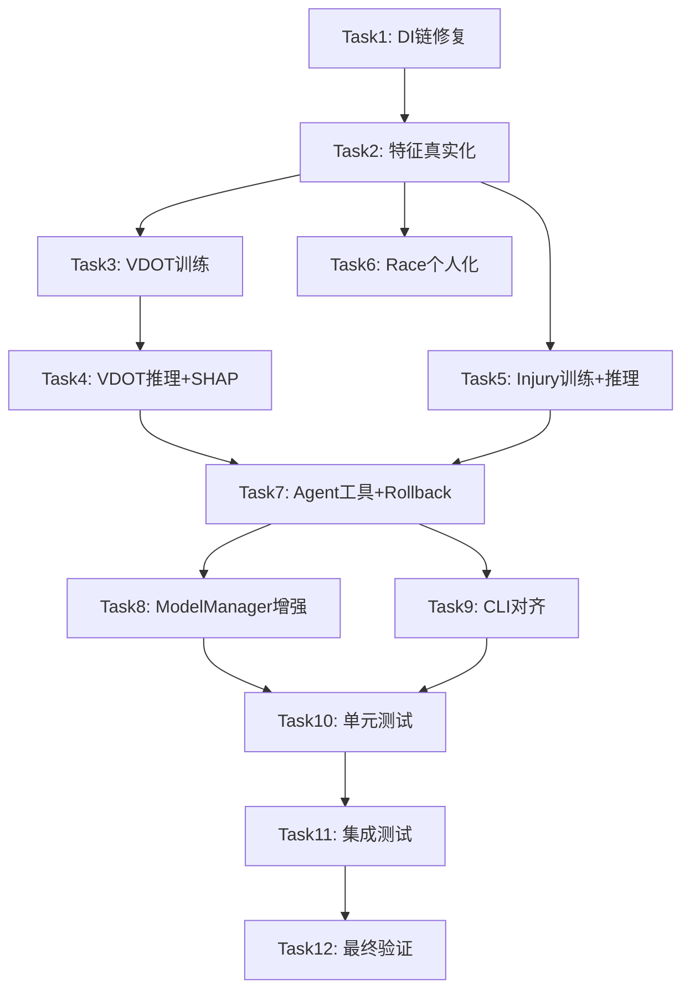

# v0.20.1 ML核心修复 实施计划

> **For agentic workers:** REQUIRED SUB-SKILL: Use superpowers:subagent-driven-development (recommended) or superpowers:executing-plans to implement this plan task-by-task. Steps use checkbox (`- [ ]`) syntax for tracking.

**Goal:** 补全v0.20.0未实现的ML训练与推理核心能力，让ML增强预测从"架构完整但核心空心的壳"变为"真正可训练、可推理、可交付"的功能

**Architecture:** 四阶段执行：基础层(依赖注入+特征真实化) → 预测层(ML训练+推理) → 集成层(Agent工具+持久化+CLI) → 质量层(测试+验证)。严格遵循架构设计说明书6.8节依赖注入规范，所有核心组件通过AppContext属性获取，禁止直接实例化。

**Tech Stack:** Python 3.11+, scikit-learn 1.5+ (GradientBoosting/LogisticRegression/CalibratedClassifierCV), shap 0.48+, joblib 1.3+, scipy 1.10+, Typer, Rich, Polars 0.20+

---

## 执行阶段与里程碑

| 阶段 | 任务 | 里程碑 | 准入条件 | 准出条件 |
|------|------|--------|---------|---------|
| Phase 1 | Task 1-2 | M1: FeatureEngine特征非零 | 无 | FeatureEngine 25个特征全部从真实数据源获取 |
| Phase 2 | Task 3-6 | M2: P0预测器可训练可推理 | M1通过 | VDOTPredictor/InjuryPredictor ML训练+推理可用 |
| Phase 3 | Task 7-9 | M3: 全功能可用 | M2通过 | Agent工具7个+ModelManager持久化+CLI对齐 |
| Phase 4 | Task 10-12 | M4: 发布就绪 | M3通过 | 单元测试+集成测试+回归验证全部通过 |

## 文件结构

| 操作 | 文件路径 | 职责 |
|------|---------|------|
| Modify | `src/core/base/context.py` | 新增4个AppContext延迟属性 + 修改prediction_engine依赖注入链 |
| Modify | `src/core/prediction/feature_engine.py` | 修复25个特征从真实数据源获取 |
| Modify | `src/core/prediction/vdot_predictor.py` | 实现ML训练(3个分位数GBDT)+推理+SHAP+冷启动 |
| Modify | `src/core/prediction/injury_predictor.py` | 实现LR+GBDT集成训练+推理+伤病标签持久化 |
| Modify | `src/core/prediction/race_predictor.py` | 实现跑者分类+修正因子+赛前状态修正 |
| Modify | `src/core/prediction/training_response_predictor.py` | 确保Banister IR模型参数真实化 |
| Modify | `src/core/prediction/model_manager.py` | 实现predictions.parquet+增量学习+sklearn版本校验 |
| Modify | `src/core/prediction/prediction_engine.py` | 补充manage_model()的rollback分支 |
| Modify | `src/agents/tools.py` | 新增ReportInjuryTool+ManagePredictionModelTool |
| Modify | `src/cli/commands/prediction.py` | CLI命令对齐架构设计6.9节 |
| Modify | `tests/unit/core/prediction/test_vdot_predictor.py` | 新增ML训练与推理测试 |
| Modify | `tests/unit/core/prediction/test_injury_predictor.py` | 新增LR+GBDT集成测试 |
| Create | `tests/unit/core/prediction/test_feature_engine_integration.py` | 特征提取集成测试 |
| Create | `tests/unit/core/prediction/test_race_predictor_personalization.py` | 跑者个人化测试 |

---

## Phase 1: 基础层 — 依赖注入 + 特征真实化

### Task 1: AppContext依赖注入链修复 (R01)

**Files:** Modify: `src/core/base/context.py`

**对齐架构设计:** 架构设计说明书6.8节

**当前状态:** `prediction_engine`属性中FeatureEngine只注入了session_repo，缺少training_load_analyzer/hrv_analyzer/body_signal_engine/vdot_calculator四个依赖。VDOTPredictor缺少race_engine参数，RacePredictor缺少race_engine+body_signal_engine参数，InjuryPredictor缺少injury_analyzer参数。

- [ ] **Step 1: 写失败测试 — 验证4个新属性不存在**

```python
# tests/unit/core/base/test_context_prediction.py
from src.core.base.context import AppContext, AppContextFactory


def test_training_load_analyzer_property_exists():
    context = AppContextFactory.create(allow_default=True)
    analyzer = context.training_load_analyzer
    assert analyzer is not None
    from src.core.calculators.training_load_analyzer import TrainingLoadAnalyzer
    assert isinstance(analyzer, TrainingLoadAnalyzer)


def test_vdot_calculator_property_exists():
    context = AppContextFactory.create(allow_default=True)
    calculator = context.vdot_calculator
    assert calculator is not None
    from src.core.calculators.vdot_calculator import VDOTCalculator
    assert isinstance(calculator, VDOTCalculator)


def test_race_prediction_engine_property_exists():
    context = AppContextFactory.create(allow_default=True)
    engine = context.race_prediction_engine
    assert engine is not None
    from src.core.calculators.race_prediction import RacePredictionEngine
    assert isinstance(engine, RacePredictionEngine)


def test_injury_risk_analyzer_property_exists():
    context = AppContextFactory.create(allow_default=True)
    analyzer = context.injury_risk_analyzer
    assert analyzer is not None
    from src.core.calculators.injury_risk_analyzer import InjuryRiskAnalyzer
    assert isinstance(analyzer, InjuryRiskAnalyzer)


def test_prediction_engine_feature_engine_receives_all_dependencies():
    context = AppContextFactory.create(allow_default=True)
    engine = context.prediction_engine
    fe = engine._vdot_predictor._feature_engine
    assert fe._load_analyzer is not None
    assert fe._hrv_analyzer is not None
    assert fe._body_signal_engine is not None
    assert fe._vdot_calculator is not None


def test_prediction_engine_vdot_predictor_receives_race_engine():
    context = AppContextFactory.create(allow_default=True)
    engine = context.prediction_engine
    assert engine._vdot_predictor._race_engine is not None


def test_prediction_engine_race_predictor_receives_race_engine_and_body_signal():
    context = AppContextFactory.create(allow_default=True)
    engine = context.prediction_engine
    assert engine._race_predictor._race_engine is not None
    assert engine._race_predictor._body_signal_engine is not None


def test_prediction_engine_injury_predictor_receives_injury_analyzer():
    context = AppContextFactory.create(allow_default=True)
    engine = context.prediction_engine
    assert engine._injury_predictor._injury_analyzer is not None
```

- [ ] **Step 2: 运行测试验证失败**

Run: `uv run pytest tests/unit/core/base/test_context_prediction.py -v`
Expected: FAIL — AttributeError

- [ ] **Step 3: 新增4个AppContext延迟属性**

在 `src/core/base/context.py` 的 `AppContext` 类中，`body_signal_engine` 属性之后、`prediction_engine` 属性之前，新增4个属性。每个属性使用 `get_extension`/`set_extension` 实现延迟初始化单例模式：

- `training_load_analyzer` → `TrainingLoadAnalyzer()`
- `vdot_calculator` → `VDOTCalculator()`
- `race_prediction_engine` → `RacePredictionEngine()` (纯函数式工具类，允许直接实例化)
- `injury_risk_analyzer` → `InjuryRiskAnalyzer()`

- [ ] **Step 4: 修改prediction_engine属性依赖注入链**

替换 `prediction_engine` 属性中的现有实现，按架构设计6.8节精确规范注入：

```python
feature_engine = FeatureEngine(
    session_repo=self.session_repo,
    training_load_analyzer=self.training_load_analyzer,
    hrv_analyzer=self.body_signal_engine.hrv_analyzer,
    body_signal_engine=self.body_signal_engine,
    vdot_calculator=self.vdot_calculator,
)
vdot_predictor = VDOTPredictor(
    feature_engine=feature_engine,
    data_assessor=data_assessor,
    model_manager=model_manager,
    race_engine=self.race_prediction_engine,
    banister_model=banister_model,
    session_repo=self.session_repo,
)
race_predictor = RacePredictor(
    feature_engine=feature_engine,
    data_assessor=data_assessor,
    model_manager=model_manager,
    race_engine=self.race_prediction_engine,
    body_signal_engine=self.body_signal_engine,
)
injury_predictor = InjuryPredictor(
    feature_engine=feature_engine,
    data_assessor=data_assessor,
    model_manager=model_manager,
    injury_analyzer=self.injury_risk_analyzer,
    rule_baseline=rule_baseline,
    logistic_model=logistic_model,
    session_repo=self.session_repo,
)
```

- [ ] **Step 5: 修改VDOTPredictor构造函数接收race_engine+session_repo参数**

新增 `race_engine: Any = None` 和 `session_repo: Any = None` 参数，存储为 `self._race_engine` 和 `self._session_repo`。

- [ ] **Step 6: 修改RacePredictor构造函数接收race_engine+body_signal_engine参数**

新增 `race_engine: Any = None` 和 `body_signal_engine: Any = None` 参数，存储为 `self._race_engine` 和 `self._body_signal_engine`。

- [ ] **Step 7: 修改InjuryPredictor构造函数接收injury_analyzer+session_repo+injury_labels_dir参数**

新增 `injury_analyzer: Any = None`、`session_repo: Any = None`、`injury_labels_dir: str | None = None` 参数。`injury_labels_dir` 默认为 `~/.nanobot-runner/injury_labels`。

- [ ] **Step 8: 运行测试验证通过**

Run: `uv run pytest tests/unit/core/base/test_context_prediction.py -v`
Expected: PASS — 所有8个测试通过

- [ ] **Step 9: 运行mypy类型检查**

Run: `uv run mypy src/core/base/context.py --ignore-missing-imports`
Expected: 无错误

- [ ] **Step 10: 运行现有回归测试**

Run: `uv run pytest tests/unit/core/prediction/ -v`
Expected: PASS — 现有测试不受影响（新增参数均有默认值None）

- [ ] **Step 11: Commit**

```bash
git add src/core/base/context.py src/core/prediction/vdot_predictor.py src/core/prediction/race_predictor.py src/core/prediction/injury_predictor.py tests/unit/core/base/test_context_prediction.py
git commit -m "feat(prediction): add 4 AppContext lazy properties and fix DI chain per arch 6.8"
```

---

### Task 2: FeatureEngine特征提取真实化 (R02)

**Files:** Modify: `src/core/prediction/feature_engine.py`

**核心问题:**
1. `TrainingLoadAnalyzer.calculate_ctl()` 需要tss_values参数，但当前FeatureEngine调用时未传参
2. TSB需要手动计算 CTL - ATL
3. HRVAnalyzer/BodySignalEngine/VDOTCalculator的方法签名需要确认

- [ ] **Step 1: 写失败测试 — 验证特征值非零（有数据时）**

创建 `tests/unit/core/prediction/test_feature_engine_integration.py`，使用Mock依赖验证：
- `test_vdot_features_nonzero_with_data` — weekly_volume_km > 0, ctl_value > 0, tsb_value != 0, fatigue_score > 0
- `test_injury_features_nonzero_with_data` — atl_ctl_ratio > 0
- `test_race_features_nonzero_with_data` — current_vdot > 0

- [ ] **Step 2: 运行测试验证当前状态**

Run: `uv run pytest tests/unit/core/prediction/test_feature_engine_integration.py -v`

- [ ] **Step 3: 修复FeatureEngine中TrainingLoadAnalyzer调用签名**

新增 `_get_tss_series(days=42)` 辅助方法，从session_repo获取TSS序列。修改CTL/TSB计算调用：
```python
tss_series = self._get_tss_series(days=42)
self._safe_float("ctl_value", lambda: self._load_analyzer.calculate_ctl(tss_series))
self._safe_float("tsb_value", lambda: self._load_analyzer.calculate_ctl(tss_series) - self._load_analyzer.calculate_atl(tss_series))
```

- [ ] **Step 4: 修复HRVAnalyzer/BodySignalEngine/VDOTCalculator方法调用**

确认方法签名并修正调用。缺失方法使用防御性检查。

- [ ] **Step 5: 运行测试验证通过**

Run: `uv run pytest tests/unit/core/prediction/test_feature_engine_integration.py -v`
Expected: PASS

- [ ] **Step 6: 运行现有特征引擎测试**

Run: `uv run pytest tests/unit/core/prediction/test_feature_engine.py -v`
Expected: PASS

- [ ] **Step 7: Commit**

```bash
git add src/core/prediction/feature_engine.py tests/unit/core/prediction/test_feature_engine_integration.py
git commit -m "fix(prediction): FeatureEngine extracts real features from injected dependencies"
```

---

## Phase 2: 预测层 — ML训练 + 推理

### Task 3: VDOTPredictor ML训练实现 (R03-part1)

**Files:** Modify: `src/core/prediction/vdot_predictor.py`

- [ ] **Step 1: 写失败测试 — 训练3个分位数模型**

创建测试验证：
- `test_train_model_trains_three_quantile_models` — result.success=True, training_samples>0
- `test_train_model_persistence` — load_model返回包含p10/p50/p90的模型

- [ ] **Step 2: 运行测试验证失败**

Expected: FAIL — training_samples=0 (占位实现)

- [ ] **Step 3: 实现VDOTPredictor.train_model()**

核心实现要点：
- 使用 `GradientBoostingRegressor(loss="quantile", alpha=α)` 训练3个分位数模型(p10/p50/p90)
- 参数: n_estimators=100, max_depth=5, learning_rate=0.1
- 从 `self._session_repo.get_vdot_history(days=540)` 获取标签
- 最低样本数: 30条VDOT记录
- TimeSeriesSplit交叉验证(n_samples>=50时)
- 保存metadata含sklearn_version、training_samples、validation_error
- 通过 `self._model_manager.save_model("vdot_predictor", models, metadata)` 持久化

- [ ] **Step 4: 运行测试验证通过**

- [ ] **Step 5: Commit**

```bash
git commit -m "feat(prediction): implement VDOTPredictor.train_model() with 3 quantile GBDT models"
```

---

### Task 4: VDOTPredictor ML推理 + SHAP + 冷启动 (R03-part2)

**Files:** Modify: `src/core/prediction/vdot_predictor.py`

- [ ] **Step 1: 写失败测试 — ML推理 + SHAP + 冷启动**

- `test_ml_inference_with_trained_model` — prediction_type="ml_enhanced", CI[0] < predicted < CI[1]
- `test_shap_feature_importance` — factors非空, name非空, weight>0
- `test_auto_train_on_first_predict` — 首次predict自动训练
- `test_model_corruption_auto_retrain` — 模型损坏后自动重训或降级

- [ ] **Step 2: 实现_run_ml_inference()**

从3个分位数模型获取p10/p50/p90预测值，构建VDOTPrediction。置信度根据CI宽度动态计算：
- CI宽度<1.0 → confidence=0.95
- CI宽度<2.0 → confidence=0.85
- CI宽度>=2.0 → confidence=0.70

- [ ] **Step 3: 实现get_feature_importance() with SHAP**

三级降级策略：
1. SHAP TreeExplainer → mean_abs_shap
2. sklearn feature_importances_ 降级
3. 固定权重降级

- [ ] **Step 4: 实现冷启动自动训练**

`_predict_ml_enhanced()` 中：
- 模型存在 → 推理，失败则重训
- 模型不存在 → 自动训练，成功则推理
- 训练失败 → 降级到参数化

- [ ] **Step 5: 修复_predict_parametric()使用真实TSS序列**

从 `self._session_repo.get_recent_sessions(days=30)` 获取TSS序列，传入BanisterIRModel。

- [ ] **Step 6: 运行测试验证通过**

- [ ] **Step 7: Commit**

```bash
git commit -m "feat(prediction): implement VDOT ML inference, SHAP importance, cold-start auto-train"
```

---

### Task 5: InjuryPredictor ML训练与推理实现 (R04)

**Files:** Modify: `src/core/prediction/injury_predictor.py`

- [ ] **Step 1: 写失败测试 — LR+GBDT集成训练**

- `test_train_lr_gbdt_ensemble` — result.success=True, training_samples>0
- `test_injury_label_persistence` — report_injury后JSON文件存在

- [ ] **Step 2: 实现train_model()**

核心实现要点：
- `LogisticRegression(penalty="l2", C=0.1, class_weight="balanced")` + `CalibratedClassifierCV(method="isotonic", cv=3)`
- `GradientBoostingClassifier(n_estimators=50, max_depth=3, learning_rate=0.05, min_samples_leaf=30)`
- 集成权重: LR=0.4, GBDT=0.6
- 标签来源: `_load_injury_labels()` (真实标签) → `_generate_pseudo_labels()` (规则基线伪标签)
- 最低样本数: 20

- [ ] **Step 3: 实现_load_injury_labels()和_generate_pseudo_labels()**

- `_load_injury_labels()`: 从 `~/.nanobot-runner/injury_labels/*.json` 读取，confirmed/suspected→1, unconfirmed→0
- `_generate_pseudo_labels()`: 使用RuleBasedInjuryBaseline.assess()生成伪标签，risk_score>50→1

- [ ] **Step 4: 实现_run_ml_inference()真实推理**

```python
lr_proba = model["lr_calibrated"].predict_proba(features)[0, 1]
gbdt_proba = model["gbdt"].predict_proba(features)[0, 1]
ensemble_proba = 0.4 * lr_proba + 0.6 * gbdt_proba
risk_score = ensemble_proba * 100
```

- [ ] **Step 5: 实现_compute_acute_load_risk / _compute_chronic_risk / _compute_body_signal_risk / _compute_risk_factors**

从特征向量中提取真实值，替代硬编码值。

- [ ] **Step 6: 实现report_injury()持久化**

将伤病标签保存为JSON文件到 `~/.nanobot-runner/injury_labels/`。

- [ ] **Step 7: 运行测试验证通过**

- [ ] **Step 8: Commit**

```bash
git commit -m "feat(prediction): implement InjuryPredictor ML training, inference, and label persistence"
```

---

### Task 6: RacePredictor个人化 + TrainingResponsePredictor真实化 (R05+R06)

**Files:** Modify: `src/core/prediction/race_predictor.py`, Verify: `src/core/prediction/training_response_predictor.py`

- [ ] **Step 1: 写失败测试 — 跑者分类非硬编码**

创建 `tests/unit/core/prediction/test_race_predictor_personalization.py`：
- `test_classify_runner_type_speed` — runner_type in ("speed", "endurance", "balanced")
- `test_estimate_correction_factor_non_default` — correction_factor非None
- `test_pre_race_body_signal_adjustment` — BodySignalEngine集成

- [ ] **Step 2: 实现_classify_runner_type()基于历史比赛数据**

短距离(≤10km) vs 长距离(≥21km) VDOT差异百分比：
- diff_pct > 5% → "speed"
- diff_pct < -5% → "endurance"
- 其他 → "balanced"

- [ ] **Step 3: 实现_estimate_correction_factor()基于历史偏差**

比较实际完赛时间与Riegel预测时间的偏差率，限制在[0.90, 1.10]范围。

- [ ] **Step 4: 实现赛前状态修正集成BodySignalEngine**

- fatigue_score > 60 → fatigue_adj = 0.02 + (score-60)*0.001
- recovery_status="green" → recovery_adj = -0.01
- recovery_status="red" → fatigue_adj += 0.02

- [ ] **Step 5: 验证TrainingResponsePredictor参数真实化**

确认TRIMP/Banister/恢复时间均基于真实参数，无需修改。

- [ ] **Step 6: 运行测试验证通过**

- [ ] **Step 7: Commit**

```bash
git commit -m "feat(prediction): implement RacePredictor personalization with real data"
```

---

## Phase 3: 集成层 — Agent工具 + 持久化 + CLI

### Task 7: Agent工具补全 + PredictionEngine.rollback (R07+R10-part)

**Files:** Modify: `src/agents/tools.py`, Modify: `src/core/prediction/prediction_engine.py`

- [ ] **Step 1: 实现PredictionEngine.manage_model()的rollback分支**

添加 `version: str | None = None` 参数，rollback分支调用 `self._model_manager.rollback_model(model_type, target_version)`。

- [ ] **Step 2: 新增ReportInjuryTool**

name="report_injury", 参数: injury_type(str), severity(mild/moderate/severe), date(YYYY-MM-DD)

- [ ] **Step 3: 新增ManagePredictionModelTool**

name="manage_prediction_model", 参数: action(status/train/rollback), model_type(vdot_predictor/injury_predictor), version(可选)

- [ ] **Step 4: 在RunnerTools中新增report_injury()和manage_prediction_model()方法**

- [ ] **Step 5: 注册新工具到工具列表**

- [ ] **Step 6: 运行测试验证通过**

- [ ] **Step 7: Commit**

```bash
git commit -m "feat(prediction): add ReportInjuryTool + ManagePredictionModelTool, implement rollback"
```

---

### Task 8: ModelManager持久化增强 (R08)

**Files:** Modify: `src/core/prediction/model_manager.py`

- [ ] **Step 1: 写失败测试 — sklearn版本校验**

- `test_save_model_stores_sklearn_version` — metadata含sklearn_version
- `test_load_model_warns_on_version_mismatch` — 版本不匹配时warning
- `test_save_prediction_history` — predictions.parquet存在
- `test_rollback_model` — rollback后旧版本可用

- [ ] **Step 2: 实现sklearn版本校验**

在 `save_model()` 中记录 `import sklearn; sklearn.__version__` 到metadata。
在 `load_model()` 中比对当前sklearn版本与metadata中的版本，不匹配时logger.warning。

- [ ] **Step 3: 实现predictions.parquet预测历史记录**

在 `save_prediction()` 方法中，将预测结果追加到 `{models_dir}/predictions.parquet`。使用Polars写入，按年分片。

- [ ] **Step 4: 实现rollback_model()完整逻辑**

```python
def rollback_model(self, model_type: str, target_version: str) -> ModelManagementResult:
    model_dir = Path(self._models_dir) / model_type
    target_dir = model_dir / target_version
    if not target_dir.exists():
        return ModelManagementResult(action="rollback", model_type=model_type, success=False, message=f"版本{target_version}不存在", details={})
    current_dir = model_dir / "current"
    if current_dir.exists() and current_dir.is_symlink():
        current_dir.unlink()
    elif current_dir.exists():
        import shutil
        shutil.rmtree(current_dir)
    current_dir.symlink_to(target_dir.resolve())
    return ModelManagementResult(action="rollback", model_type=model_type, success=True, message=f"已回滚到{target_version}", details={"version": target_version})
```

- [ ] **Step 5: 运行测试验证通过**

- [ ] **Step 6: Commit**

```bash
git commit -m "feat(prediction): ModelManager sklearn version check, prediction history, rollback"
```

---

### Task 9: CLI命令对齐架构设计6.9节 (R09)

**Files:** Modify: `src/cli/commands/prediction.py`

**当前状态:** CLI命令已基本实现，但需对齐架构设计6.9节的命令格式。

- [ ] **Step 1: 对比当前CLI命令与架构设计6.9节**

架构设计6.9节命令格式：
- `predict vdot --days` ✅ 已实现
- `predict race --distance --date` ✅ 已实现
- `predict injury --days` ✅ 已实现
- `predict response --type --duration --intensity` ✅ 已实现
- `predict status` ✅ 已实现
- `predict model status --type` → 当前为 `predict model status vdot_predictor`（参数格式需确认）
- `predict model train --type` → 当前为 `predict model train vdot_predictor`（参数格式需确认）

- [ ] **Step 2: 修改model子命令参数格式**

将 `model` 命令的 `action` 和 `model_type` 从位置参数改为选项参数，对齐架构设计：

```python
@app.command(name="model")
def manage_model(
    action: str = typer.Argument("status", help="操作(status/train/rollback)"),
    model_type: str = typer.Argument("vdot_predictor", help="模型类型"),
    version: str | None = typer.Option(None, "--version", "-v", help="目标版本(rollback时使用)"),
) -> None:
```

- [ ] **Step 3: 新增rollback操作支持**

在CLI handler中传入version参数。

- [ ] **Step 4: 运行测试验证通过**

- [ ] **Step 5: Commit**

```bash
git commit -m "feat(prediction): CLI model command add rollback support and version option"
```

---

## Phase 4: 质量层 — 测试 + 验证

### Task 10: 单元测试补全 (R10)

**Files:** Create/Modify test files

- [ ] **Step 1: 补全FeatureEngine集成测试**

`tests/unit/core/prediction/test_feature_engine_integration.py` — 验证所有25个特征在依赖注入后从真实数据源获取

- [ ] **Step 2: 补全VDOTPredictor ML测试**

`tests/unit/core/prediction/test_vdot_predictor.py` — 新增：
- `test_train_model_trains_three_quantile_models`
- `test_train_model_persistence`
- `test_ml_inference_with_trained_model`
- `test_shap_feature_importance`
- `test_auto_train_on_first_predict`
- `test_model_corruption_auto_retrain`

- [ ] **Step 3: 补全InjuryPredictor ML测试**

`tests/unit/core/prediction/test_injury_predictor.py` — 新增：
- `test_train_lr_gbdt_ensemble`
- `test_injury_label_persistence`

- [ ] **Step 4: 补全RacePredictor个人化测试**

`tests/unit/core/prediction/test_race_predictor_personalization.py` — 新增：
- `test_classify_runner_type_speed`
- `test_estimate_correction_factor_non_default`
- `test_pre_race_body_signal_adjustment`

- [ ] **Step 5: 补全ModelManager增强测试**

`tests/unit/core/prediction/test_model_manager.py` — 新增：
- `test_save_model_stores_sklearn_version`
- `test_load_model_warns_on_version_mismatch`
- `test_save_prediction_history`
- `test_rollback_model`

- [ ] **Step 6: 运行全部单元测试**

Run: `uv run pytest tests/unit/core/prediction/ -v`
Expected: PASS

- [ ] **Step 7: Commit**

```bash
git commit -m "test(prediction): add comprehensive unit tests for ML training, inference, and personalization"
```

---

### Task 11: 集成测试 + 回归验证 (R11)

- [ ] **Step 1: 编写端到端集成测试**

`tests/integration/test_prediction_e2e.py`：
- 完整DI链路: AppContext → PredictionEngine → VDOTPredictor → train → predict
- 完整DI链路: AppContext → PredictionEngine → InjuryPredictor → train → predict
- 降级策略: 数据不足时自动降级

- [ ] **Step 2: 运行集成测试**

Run: `uv run pytest tests/integration/test_prediction_e2e.py -v`
Expected: PASS

- [ ] **Step 3: 运行全量回归测试**

Run: `uv run pytest tests/ -v --tb=short`
Expected: PASS

- [ ] **Step 4: 运行mypy类型检查**

Run: `uv run mypy src/ --ignore-missing-imports`
Expected: 无错误

- [ ] **Step 5: 运行ruff检查**

Run: `uv run ruff check src/ tests/`
Expected: 无错误

- [ ] **Step 6: Commit**

```bash
git commit -m "test(prediction): add integration tests and verify full regression"
```

---

### Task 12: 最终验证 + 发布准备 (R12)

- [ ] **Step 1: 运行完整质量门禁**

```bash
uv run ruff format src/ tests/
uv run ruff check src/ tests/
uv run mypy src/ --ignore-missing-imports
uv run pytest tests/ -v --tb=short
```

全部通过后方可继续。

- [ ] **Step 2: 验证CLI命令可用性**

```bash
uv run nanobotrun predict vdot --days 30
uv run nanobotrun predict injury --days 21
uv run nanobotrun predict status
uv run nanobotrun predict model status vdot_predictor
uv run nanobotrun predict model train vdot_predictor
```

- [ ] **Step 3: 验证降级策略**

- 数据不足场景 → prediction_type="basic"
- 数据中等场景 → prediction_type="parametric"
- 数据充足场景 → prediction_type="ml_enhanced"

- [ ] **Step 4: 更新AGENTS.md版本信息**

将 `当前基线` 从 `v0.20.0` 更新为 `v0.20.1`。

- [ ] **Step 5: Final Commit**

```bash
git commit -m "chore: v0.20.1 ML core fix complete - all quality gates passed"
```

---

## 风险识别与规避方案

| 风险 | 等级 | 规避方案 |
|------|------|---------|
| TrainingLoadAnalyzer方法签名不匹配 | 中 | Step 3/4中先确认方法签名，再修改调用 |
| HRVAnalyzer方法不存在 | 中 | 防御性hasattr检查，缺失时返回0.0 |
| sklearn版本不兼容导致模型加载失败 | 高 | ModelManager版本校验+warning，自动重训 |
| SHAP分析耗时过长 | 低 | 5秒超时机制，降级到sklearn feature_importances_ |
| 训练数据不足导致模型质量差 | 中 | 最低样本数阈值(30/20)，不足时拒绝训练 |
| BodySignalEngine.get_fatigue_score()方法名不同 | 低 | 先确认方法签名，使用getattr防御性调用 |
| SessionRepo.get_vdot_history()方法不存在 | 高 | 先确认方法签名，不存在则使用get_recent_sessions+VDOTCalculator计算 |
| 模型文件损坏 | 中 | 冷启动自动重训机制 |

## 任务依赖图


