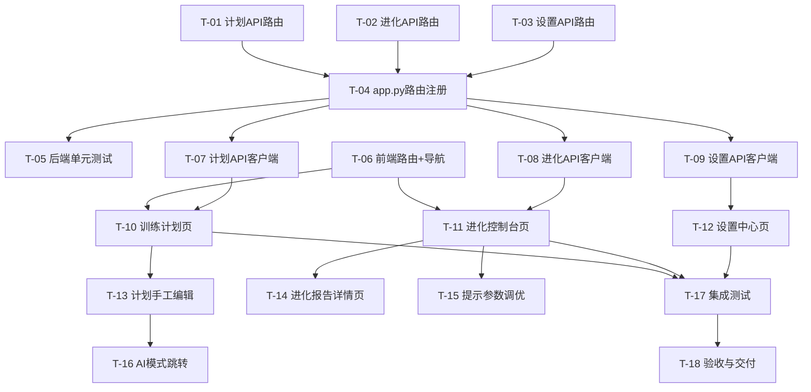

# v0.29.0 WebUI管理控制台 实施计划

> **版本**: v1.0.0
> **基线**: v0.28.0
> **创建日期**: 2026-06-09
> **架构依据**: 架构设计说明书 v21.0.0 §12
> **任务依据**: task_list_v0.29.0.md v1.0.0
> **UI参考**: COROS Training Hub (t.coros.com/admin/views/schedule)

---

## 一、实施概览

### 1.1 迭代节奏

| Sprint | 目标 | 任务范围 | 准入 | 准出 |
|--------|------|----------|------|------|
| **Sprint 1** | 后端API层 | T-01~T-06 | 架构评审通过 | 12个API端点可调用 + 单元测试通过 |
| **Sprint 2** | 前端P0页面 | T-07~T-11 | Sprint 1完成 | 训练计划页 + 进化控制台页可交互 |
| **Sprint 3** | 前端P1/P2 + 集成 | T-12~T-18 | Sprint 2完成 | 全部4页面可用 + 端到端集成测试通过 |

### 1.2 依赖关系图



---

## 二、Sprint 1：后端API层

### T-01: 训练计划API路由

**文件**: `src/core/webui/routes/plan.py`（新建）

**前置条件**: 无

**实现步骤**:

1. 创建路由模块文件，导入依赖：

```python
# src/core/webui/routes/plan.py
from fastapi import APIRouter, Depends, HTTPException
from starlette.concurrency import run_in_threadpool

from src.core.webui.auth import verify_token
from src.core.base.context import get_context
from src.core.models.training_plan import PlanStatus

router = APIRouter(dependencies=[Depends(verify_token)])
```

2. 实现 `GET /list` 端点：

```python
@router.get("/list")
async def list_plans(status: str | None = None, limit: int = 100):
    """获取训练计划列表"""
    context = get_context()
    plan_status = PlanStatus(status) if status else None
    plans = await run_in_threadpool(
        context.plan_manager.list_plans, status=plan_status, limit=limit
    )
    return {
        "plans": [
            {
                "plan_id": p.plan_id,
                "name": f"{p.plan_type.label}训练计划",
                "goal": p.goal_date,
                "status": p.status.value,
                "start_date": p.start_date,
                "end_date": p.end_date,
                "total_days": len([d for w in p.weeks for d in w.daily_plans]),
                "completed_days": len([d for w in p.weeks for d in w.daily_plans if d.completed]),
                "updated_at": p.updated_at.isoformat(),
            }
            for p in plans
        ]
    }
```

3. 实现 `GET /calendar` 端点：

```python
@router.get("/calendar")
async def get_plan_calendar(
    year: int | None = None, month: int | None = None, view: str = "month"
):
    """获取当前活跃计划日历数据"""
    context = get_context()
    plan = await run_in_threadpool(context.plan_manager.get_active_plan)
    if not plan:
        return {"plan_id": None, "plan_name": None, "days": []}

    days = []
    for week in plan.weeks:
        for day in week.daily_plans:
            days.append({
                "date": day.date,
                "workout_type": day.workout_type.value,
                "workout_label": day.workout_type.label,
                "distance_km": day.distance_km,
                "target_pace_min_per_km": day.target_pace_min_per_km,
                "duration_min": day.duration_min,
                "status": "completed" if day.completed else "pending",
                "notes": day.notes,
            })

    return {
        "plan_id": plan.plan_id,
        "plan_name": f"{plan.plan_type.label}训练计划",
        "view_mode": view,
        "year": year,
        "month": month,
        "days": days,
    }
```

4. 实现 `GET /{plan_id}` 端点：

```python
@router.get("/{plan_id}")
async def get_plan_detail(plan_id: str):
    """获取训练计划详情"""
    context = get_context()
    plan = await run_in_threadpool(context.plan_manager.get_plan, plan_id)
    if not plan:
        raise HTTPException(status_code=404, detail="计划不存在")
    return plan.to_dict()
```

5. 实现 `GET /progress/{plan_id}` 端点：

```python
@router.get("/progress/{plan_id}")
async def get_plan_progress(plan_id: str):
    """获取计划执行进度"""
    context = get_context()
    plan = await run_in_threadpool(context.plan_manager.get_plan, plan_id)
    if not plan:
        raise HTTPException(status_code=404, detail="计划不存在")

    all_days = [d for w in plan.weeks for d in w.daily_plans]
    completed_days = [d for d in all_days if d.completed]

    weekly_summary = []
    for week in plan.weeks:
        planned_dist = sum(d.distance_km for d in week.daily_plans)
        actual_dist = sum(d.actual_distance_km or 0 for d in week.daily_plans)
        completed = sum(1 for d in week.daily_plans if d.completed)
        weekly_summary.append({
            "week": f"W{week.week_number}",
            "completion_rate": completed / len(week.daily_plans) if week.daily_plans else 0,
            "planned_distance_km": round(planned_dist, 2),
            "actual_distance_km": round(actual_dist, 2),
        })

    return {
        "plan_id": plan_id,
        "completion_rate": len(completed_days) / len(all_days) if all_days else 0,
        "total_days": len(all_days),
        "completed_days": len(completed_days),
        "avg_fidelity": 0.0,
        "weekly_summary": weekly_summary,
    }
```

6. 实现 `PUT /daily/{plan_id}/{date}` 端点：

```python
from pydantic import BaseModel

class DailyPlanUpdate(BaseModel):
    completion_rate: float | None = None
    effort_score: int | None = None
    notes: str = ""
    actual_distance_km: float | None = None
    actual_duration_min: int | None = None
    actual_avg_hr: int | None = None

@router.put("/daily/{plan_id}/{date}")
async def update_daily_plan(plan_id: str, date: str, update: DailyPlanUpdate):
    """更新单日训练详情"""
    context = get_context()
    try:
        result = await run_in_threadpool(
            context.plan_manager.record_execution,
            plan_id=plan_id,
            date=date,
            completion_rate=update.completion_rate,
            effort_score=update.effort_score,
            notes=update.notes,
            actual_distance_km=update.actual_distance_km,
            actual_duration_min=update.actual_duration_min,
            actual_avg_hr=update.actual_avg_hr,
        )
        return result
    except Exception as e:
        raise HTTPException(status_code=400, detail=str(e))
```

**测试命令**: `uv run pytest tests/unit/core/webui/test_routes_plan.py -v`

**提交信息**: `feat(webui): add plan API routes with 5 endpoints`

---

### T-02: 进化引擎API路由

**文件**: `src/core/webui/routes/evolution.py`（新建）

**前置条件**: 无

**实现步骤**:

1. 创建路由模块文件：

```python
# src/core/webui/routes/evolution.py
import re
from fastapi import APIRouter, Depends, HTTPException
from starlette.concurrency import run_in_threadpool

from src.core.webui.auth import verify_token
from src.core.base.context import get_context

router = APIRouter(dependencies=[Depends(verify_token)])
```

2. 实现 `GET /status` 端点（只读，不触发动作）：

```python
@router.get("/status")
async def get_evolution_status():
    """获取进化引擎状态（只读，不触发任何进化动作）

    check_triggers() 仅检查触发条件返回TriggerCheckResult，
    不执行任何进化动作（retrain_model/adjust_strategy等）。
    """
    context = get_context()
    controller = context.evolution_engine._controller
    result = await run_in_threadpool(controller.check_triggers)

    trigger_conditions = [
        {
            "rule": "vdot_error",
            "description": "VDOT预测误差连续3次>5%",
            "is_triggered": any(
                a.action_type == "retrain_model" and "vdot" in a.trigger_reason
                for a in result.triggered_actions
            ),
        },
        {
            "rule": "consecutive_rejection",
            "description": "连续2次拒绝推荐",
            "is_triggered": any(
                a.action_type == "adjust_strategy"
                for a in result.triggered_actions
            ),
        },
        {
            "rule": "new_data_accumulation",
            "description": "新数据积累>=50条",
            "is_triggered": any(
                a.action_type == "incremental_learn"
                for a in result.triggered_actions
            ),
        },
        {
            "rule": "monthly_review",
            "description": "当月未生成报告",
            "is_triggered": any(
                a.action_type == "generate_report"
                for a in result.triggered_actions
            ),
        },
    ]

    recent_actions = [
        {
            "action_type": a.action_type,
            "triggered_at": a.created_at.isoformat(),
            "status": "completed" if a.executed else "pending",
        }
        for a in result.triggered_actions[:5]
    ]

    return {
        "engine_status": "running",
        "trigger_conditions": trigger_conditions,
        "recent_actions": recent_actions,
    }
```

3. 实现 `GET /tuning` 和 `PUT /tuning` 端点：

```python
from pydantic import BaseModel

class TuningParamsUpdate(BaseModel):
    tone: float | None = None
    detail: float | None = None
    aggressive: float | None = None
    data_driven: float | None = None

@router.get("/tuning")
async def get_tuning_params():
    """获取当前提示调优参数"""
    context = get_context()
    tuner = context.evolution_engine._prompt_tuner
    params = await run_in_threadpool(tuner.get_params)
    return {
        "tone": params.tone_intensity,
        "detail": params.detail_level_score,
        "aggressive": params.recommendation_aggressiveness,
        "data_driven": params.data_driven_weight,
    }

@router.put("/tuning")
async def update_tuning_params(update: TuningParamsUpdate):
    """更新提示调优参数"""
    context = get_context()
    tuner = context.evolution_engine._prompt_tuner
    params = await run_in_threadpool(
        tuner.update_params,
        tone=update.tone,
        detail=update.detail,
        aggressive=update.aggressive,
        data_driven=update.data_driven,
    )
    return {
        "tone": params.tone_intensity,
        "detail": params.detail_level_score,
        "aggressive": params.recommendation_aggressiveness,
        "data_driven": params.data_driven_weight,
    }
```

4. 实现 `GET /reports` 和 `GET /reports/{month}` 端点：

```python
@router.get("/reports")
async def list_evolution_reports():
    """获取可用的进化报告月份列表

    通过扫描 data_dir/decisions/ 目录下的月份子目录（YYYY-MM格式）
    确定可生成报告的月份列表。
    """
    context = get_context()
    store = context.evolution_engine._store
    decisions_dir = store.data_dir / "decisions"
    months = []
    if decisions_dir.exists():
        months = sorted(
            [d.name for d in decisions_dir.iterdir()
             if d.is_dir() and re.match(r"\d{4}-\d{2}", d.name)],
            reverse=True,
        )
    return {"available_months": months, "count": len(months)}

@router.get("/reports/{month}")
async def get_evolution_report(month: str):
    """获取指定月份进化报告"""
    if not re.match(r"\d{4}-\d{2}", month):
        raise HTTPException(status_code=400, detail="月份格式错误，应为YYYY-MM")
    context = get_context()
    reporter = context.evolution_engine._evolution_reporter
    report = await run_in_threadpool(reporter.generate_report, month=month)
    return report.to_dict()
```

**测试命令**: `uv run pytest tests/unit/core/webui/test_routes_evolution.py -v`

**提交信息**: `feat(webui): add evolution API routes with 5 endpoints`

---

### T-03: 设置中心API路由

**文件**: `src/core/webui/routes/settings.py`（新建）

**前置条件**: 无

**实现步骤**:

1. 创建路由模块文件：

```python
# src/core/webui/routes/settings.py
from fastapi import APIRouter, Depends, HTTPException
from starlette.concurrency import run_in_threadpool

from src.core.webui.auth import verify_token
from src.core.base.context import get_context

router = APIRouter(dependencies=[Depends(verify_token)])
```

2. 实现个人信息 GET/PUT 和系统配置 GET：

```python
from pydantic import BaseModel, Field

class ProfileUpdate(BaseModel):
    nickname: str | None = None
    age: int | None = Field(None, gt=0)
    gender: str | None = None
    max_heart_rate: int | None = Field(None, gt=0, le=250)
    resting_heart_rate: int | None = Field(None, gt=0, le=150)

@router.get("/profile")
async def get_profile():
    """获取个人信息配置"""
    context = get_context()
    config = await run_in_threadpool(context.config.load_config)
    profile = config.get("profile", {})
    return {
        "nickname": profile.get("nickname", ""),
        "age": profile.get("age", 0),
        "gender": profile.get("gender", ""),
        "max_heart_rate": profile.get("max_heart_rate", 190),
        "resting_heart_rate": profile.get("resting_heart_rate", 60),
    }

@router.put("/profile")
async def update_profile(update: ProfileUpdate):
    """更新个人信息配置"""
    context = get_context()
    config = await run_in_threadpool(context.config.load_config)
    profile = config.get("profile", {})
    update_data = update.model_dump(exclude_none=True)
    profile.update(update_data)
    config["profile"] = profile
    await run_in_threadpool(context.config.save_config, config)
    return {"success": True, "message": "个人信息已更新"}

@router.get("/system")
async def get_system_config():
    """获取系统配置（只读）"""
    context = get_context()
    config = await run_in_threadpool(context.config.load_config)
    webui_config = context.config.get_webui_config()
    return {
        "data_dir": str(context.config.data_dir),
        "version": "0.29.0",
        "webui_enabled": webui_config.get("enabled", True),
        "webui_port": webui_config.get("port", 8766),
        "gateway_status": "unknown",
    }
```

**测试命令**: `uv run pytest tests/unit/core/webui/test_routes_settings.py -v`

**提交信息**: `feat(webui): add settings API routes with 3 endpoints`

---

### T-04: app.py路由注册

**文件**: `src/core/webui/app.py`（修改）

**前置条件**: T-01, T-02, T-03

**实现步骤**:

1. 在现有路由导入之后，新增3行导入：

```python
from src.core.webui.routes.evolution import router as evolution_router
from src.core.webui.routes.plan import router as plan_router
from src.core.webui.routes.settings import router as settings_router
```

2. 在现有 `app.include_router` 之后，新增3行注册：

```python
app.include_router(plan_router, prefix="/api/webui/plan", tags=["plan"])
app.include_router(evolution_router, prefix="/api/webui/evolution", tags=["evolution"])
app.include_router(settings_router, prefix="/api/webui/settings", tags=["settings"])
```

**验证方式**: 启动服务后访问 `/docs` 页面，确认新增12个端点可见

**提交信息**: `feat(webui): register plan/evolution/settings routes in app.py`

---

### T-05: 后端单元测试

**文件**:
- `tests/unit/core/webui/test_routes_plan.py`（新建）
- `tests/unit/core/webui/test_routes_evolution.py`（新建）
- `tests/unit/core/webui/test_routes_settings.py`（新建）

**前置条件**: T-04

**实现步骤**:

1. 创建计划路由测试，参照现有 `test_routes_dashboard.py` 模式：

```python
# tests/unit/core/webui/test_routes_plan.py
"""Plan API 路由单元测试"""

from unittest.mock import MagicMock
import pytest
from fastapi.testclient import TestClient
from src.core.webui.app import create_app
from src.core.webui.auth import create_access_token

@pytest.fixture
def mock_context() -> MagicMock:
    context = MagicMock()
    context.config.get_webui_config.return_value = {
        "enabled": True, "host": "127.0.0.1", "port": 8766,
        "cors_origins": [], "token_secret": "test-secret", "token_ttl_s": 86400,
    }
    context.plan_manager.list_plans.return_value = []
    context.plan_manager.get_active_plan.return_value = None
    context.plan_manager.get_plan.return_value = None
    return context

@pytest.fixture
def client(mock_context: MagicMock) -> TestClient:
    app = create_app(context=mock_context)
    return TestClient(app)

@pytest.fixture
def auth_headers() -> dict[str, str]:
    token = create_access_token(secret="test-secret", ttl_seconds=3600)
    return {"Authorization": f"Bearer {token}"}

class TestPlanListEndpoint:
    def test_list_plans_returns_200(self, client, auth_headers):
        response = client.get("/api/webui/plan/list", headers=auth_headers)
        assert response.status_code == 200

    def test_list_plans_requires_auth(self, client):
        response = client.get("/api/webui/plan/list")
        assert response.status_code == 401

class TestPlanCalendarEndpoint:
    def test_calendar_no_active_plan(self, client, auth_headers):
        response = client.get("/api/webui/plan/calendar", headers=auth_headers)
        assert response.status_code == 200
        data = response.json()
        assert data["plan_id"] is None

class TestPlanDetailEndpoint:
    def test_plan_not_found(self, client, auth_headers):
        response = client.get("/api/webui/plan/nonexistent", headers=auth_headers)
        assert response.status_code == 404
```

2. 创建进化路由测试，Mock `EvolutionController`/`PromptTuner`/`EvolutionReporter`/`EvolutionStore`

3. 创建设置路由测试，Mock `ConfigManager`

**测试命令**: `uv run pytest tests/unit/core/webui/test_routes_plan.py tests/unit/core/webui/test_routes_evolution.py tests/unit/core/webui/test_routes_settings.py -v`

**提交信息**: `test(webui): add unit tests for plan/evolution/settings routes`

---

### T-06: 前端路由与导航扩展

**文件**:
- `webui/src/App.tsx`（修改）
- `webui/src/components/layout/Sidebar.tsx`（修改）
- `webui/src/pages/PlanPage.tsx`（新建占位）
- `webui/src/pages/EvolutionPage.tsx`（新建占位）
- `webui/src/pages/EvolutionReportPage.tsx`（新建占位）
- `webui/src/pages/SettingsPage.tsx`（新建占位）

**前置条件**: 无

**实现步骤**:

1. 修改 `App.tsx`，新增4个路由和占位页面导入：

```tsx
import PlanPage from './pages/PlanPage';
import EvolutionPage from './pages/EvolutionPage';
import EvolutionReportPage from './pages/EvolutionReportPage';
import SettingsPage from './pages/SettingsPage';

// 在 Routes 内新增
<Route path="/plan" element={<PlanPage />} />
<Route path="/evolution" element={<EvolutionPage />} />
<Route path="/evolution/reports/:month" element={<EvolutionReportPage />} />
<Route path="/settings" element={<SettingsPage />} />
```

2. 创建4个占位页面文件（仅显示"开发中"）：

```tsx
// webui/src/pages/PlanPage.tsx
export default function PlanPage() {
  return <div className="p-6"><h2 className="text-xl font-bold">训练计划</h2><p className="mt-4 text-gray-500">开发中...</p></div>;
}
```

3. 修改 `Sidebar.tsx`，新增3个导航项：

```tsx
const navItems = [
  { path: '/', label: '仪表盘', icon: '📊' },
  { path: '/vdot', label: 'VDOT', icon: '📈' },
  { path: '/training-load', label: '负荷', icon: '💪' },
  { path: '/activities', label: '活动', icon: '🏃' },
  { path: '/body-signals', label: '身体', icon: '❤️' },
  // v0.29.0 新增
  { path: '/plan', label: '计划', icon: '📅' },
  { path: '/evolution', label: '进化', icon: '🧬' },
  { path: '/settings', label: '设置', icon: '⚙️' },
];
```

**验证方式**: `cd webui && npm run dev`，访问 `/plan`、`/evolution`、`/settings` 路由

**提交信息**: `feat(webui): add plan/evolution/settings routes and nav items`

---

## 三、Sprint 2：前端P0页面

### T-07: 计划API客户端

**文件**: `webui/src/api/plan.ts`（新建）

**前置条件**: T-04

**实现步骤**:

创建API客户端，复用 `client.ts` 的认证和错误处理，封装5个函数：
- `fetchPlanList(status?)` → `GET /webui/plan/list`
- `fetchPlanCalendar(year?, month?)` → `GET /webui/plan/calendar`
- `fetchPlanDetail(planId)` → `GET /webui/plan/{plan_id}`
- `fetchPlanProgress(planId)` → `GET /webui/plan/progress/{plan_id}`
- `updateDailyPlan(planId, date, data)` → `PUT /webui/plan/daily/{plan_id}/{date}`

所有函数使用 `apiClient` 实例（已内置Token认证拦截器），返回类型与架构设计说明书 §12.3.1 响应结构对齐。

**提交信息**: `feat(webui): add plan API client with 5 functions`

---

### T-08: 进化API客户端

**文件**: `webui/src/api/evolution.ts`（新建）

**前置条件**: T-04

**实现步骤**:

创建进化API客户端，封装5个函数：
- `fetchEvolutionStatus()` → `GET /webui/evolution/status`
- `fetchTuningParams()` → `GET /webui/evolution/tuning`
- `updateTuningParams(params)` → `PUT /webui/evolution/tuning`
- `fetchReportMonths()` → `GET /webui/evolution/reports`
- `fetchReport(month)` → `GET /webui/evolution/reports/{month}`

**提交信息**: `feat(webui): add evolution API client with 5 functions`

---

### T-09: 设置API客户端

**文件**: `webui/src/api/settings.ts`（新建）

**前置条件**: T-04

**实现步骤**:

创建设置API客户端，封装3个函数：
- `fetchProfile()` → `GET /webui/settings/profile`
- `updateProfile(data)` → `PUT /webui/settings/profile`
- `fetchSystemConfig()` → `GET /webui/settings/system`

**提交信息**: `feat(webui): add settings API client with 3 functions`

---

### T-10: 训练计划页面

**文件**:
- `webui/src/pages/PlanPage.tsx`（修改，替换占位内容）
- `webui/src/components/plan/PlanCalendar.tsx`（新建）
- `webui/src/components/plan/PlanList.tsx`（新建）
- `webui/src/components/plan/PlanProgress.tsx`（新建）
- `webui/src/components/plan/DailyPlanCard.tsx`（新建）
- `webui/src/types/api.ts`（修改，新增类型定义）

**前置条件**: T-06, T-07

**UI设计参考**（来自COROS Training Hub分析）:

COROS日程页面核心布局结构：
- **顶部统计栏**：训练负荷/运动时间/运动距离切换按钮 + 长期负荷/短期负荷/负荷比指标
- **年度概览条**：SVG柱状图，每月一根柱子，蓝色渐变填充，悬停显示周标签
- **周视图日历**：7列网格（周一~周日 + 周统计列），每行一周
  - 日期头部：日期数字 + 月份标签（`calender-day-header`）
  - 训练卡片：运动类型图标 + 标题 + 实际vs计划时长/距离/TL + 描述（`calender-day-card-item`）
  - 卡片状态色：已完成(绿) / 未完成(灰) / 过期(红)（`card-planFailed`/`card-entities`）
  - 周统计列：阶段标签(准备期/基础期/进展期/巅峰期/竞赛期/过渡期) + 负荷汇总（`coros-stage-select`）
- **右侧面板**：训练课程库，支持搜索和分类筛选（`training-group`）

**适配策略**：COROS是专业教练平台，功能复杂。本项目为个人跑步工具，简化为：
- 去掉年度概览SVG条（数据量不足以支撑）
- 保留周视图日历核心布局（7列，去掉周统计列）
- 训练卡片简化为：运动类型标签 + 距离 + 配速 + 完成状态
- 去掉右侧训练课程库（无此需求）
- 新增列表视图和进度环形图

**实现步骤**:

1. 在 `webui/src/types/api.ts` 新增训练计划/进化/设置相关类型定义（详见架构设计说明书 §12.3 响应结构）

2. 实现 `DailyPlanCard.tsx`（训练日卡片，参考COROS的 `calender-day-card-item`）：
   - 日期数字 + 运动类型标签 + 距离 + 完成状态勾选
   - 按workout_type着色：easy=绿, long=蓝, interval=橙, tempo=紫, recovery=灰
   - 已完成日期显示绿色ring

3. 实现 `PlanCalendar.tsx`（CSS Grid日历视图，参考COROS的 `coros-calender` 结构）：
   - 7列CSS Grid，每行一周
   - 表头：周一~周日
   - 日期单元格包含 DailyPlanCard
   - 第一周前面的空位填充空单元格

4. 实现 `PlanList.tsx`（列表视图）：
   - 卡片式列表，每张卡片显示计划名称/状态/日期范围/进度条
   - 活跃计划高亮（绿色状态标签）
   - 点击卡片选中查看进度

5. 实现 `PlanProgress.tsx`（进度环形图）：
   - SVG环形进度图（完成率）
   - 统计数字：总天数/已完成/忠实度
   - 周汇总列表

6. 组装 `PlanPage.tsx`：
   - 日历/列表视图切换
   - 无计划时显示空状态提示
   - 选中计划后显示进度

**提交信息**: `feat(webui): implement plan page with calendar/list/progress views`

---

### T-11: 进化控制台页面

**文件**:
- `webui/src/pages/EvolutionPage.tsx`（修改，替换占位内容）
- `webui/src/components/evolution/EvolutionStatusPanel.tsx`（新建）
- `webui/src/components/evolution/TriggerConditionCard.tsx`（新建）

**前置条件**: T-06, T-08

**实现步骤**:

1. 实现 `TriggerConditionCard.tsx`：
   - 4条触发条件各一张卡片
   - 显示规则图标 + 描述 + 触发状态标签
   - 已触发：橙色边框+背景，未触发：灰色

2. 实现 `EvolutionStatusPanel.tsx`：
   - 引擎运行状态指示灯（绿色=运行中）
   - 手动刷新按钮（ADR-025）
   - 触发条件网格（2列）
   - 最近5条进化动作列表

3. 组装 `EvolutionPage.tsx`：
   - 加载时请求进化状态
   - 无数据时显示空状态

**提交信息**: `feat(webui): implement evolution console page with status panel`

---

## 四、Sprint 3：前端P1/P2功能 + 集成

### T-12: 设置中心页面

**文件**:
- `webui/src/pages/SettingsPage.tsx`（修改）
- `webui/src/components/settings/ProfileSection.tsx`（新建）
- `webui/src/components/settings/SystemSection.tsx`（新建）

**前置条件**: T-06, T-09

**实现步骤**:

1. 实现 `ProfileSection.tsx`（个人信息编辑表单）：
   - 昵称/年龄/性别/最大心率/静息心率字段
   - 保存按钮调用PUT API
   - 输入校验（age>0, max_heart_rate 1-250, resting_heart_rate 1-150）

2. 实现 `SystemSection.tsx`（系统配置只读展示）：
   - 数据目录/版本/WebUI状态/端口/网关状态
   - 只读展示，不可编辑

3. 组装 `SettingsPage.tsx`

**提交信息**: `feat(webui): implement settings page with profile edit and system config`

---

### T-13: 计划手工编辑功能

**文件**: `webui/src/components/plan/DailyPlanEditor.tsx`（新建）

**前置条件**: T-10

**实现步骤**:

1. 实现手工编辑表单（模态弹窗）：
   - 显示训练日基本信息（类型/距离/时长）
   - 完成度滑块（0-1.0，步长0.1）
   - 体感评分滑块（1-10，步长1）
   - 备注文本框
   - 保存按钮调用 PUT API
   - 保存成功后刷新页面数据

2. 在 `PlanPage.tsx` 中集成：点击 DailyPlanCard 打开 DailyPlanEditor

**提交信息**: `feat(webui): add daily plan editor with completion/effort/notes`

---

### T-14: 进化报告详情页

**文件**:
- `webui/src/pages/EvolutionReportPage.tsx`（修改）
- `webui/src/components/evolution/EvolutionReportList.tsx`（新建）

**前置条件**: T-11

**实现步骤**:

1. 实现 `EvolutionReportList.tsx`（报告月份列表）：
   - 按月份倒序展示可用报告
   - 点击进入报告详情页（`/evolution/reports/{month}`）

2. 实现 `EvolutionReportPage.tsx`（报告详情）：
   - 决策统计/准确率趋势（Recharts折线图）/校准摘要/调优摘要/建议列表
   - 复用v0.28.0 Recharts图表组件

3. 在 `EvolutionPage.tsx` 中添加报告列表入口

**提交信息**: `feat(webui): implement evolution report detail page`

---

### T-15: 提示参数调优功能

**文件**: `webui/src/components/evolution/PromptTuningSliders.tsx`（新建）

**前置条件**: T-11

**实现步骤**:

1. 实现4维参数滑块组件：
   - 4个滑块：语气强度/信息密度/推荐激进/数据驱动，范围0.0-1.0，步长0.05
   - 每个滑块显示当前值（2位小数）+ 两端标签（低/高语义）
   - "保存"按钮调用 PUT API 持久化
   - "恢复默认"按钮重置为0.5

2. 在 `EvolutionPage.tsx` 中集成调优滑块

**提交信息**: `feat(webui): add prompt tuning sliders with 4 dimensions`

---

### T-16: AI模式跳转

**文件**: `webui/src/pages/PlanPage.tsx`（修改）

**前置条件**: T-10

**实现步骤**:

1. 在 PlanPage 页面头部添加"AI调整"按钮：
   - 点击跳转到 `http://127.0.0.1:8765`
   - URL参数注入当前plan_id（`?plan_id=xxx`）
   - 新窗口打开（`window.open`）

**提交信息**: `feat(webui): add AI adjust button linking to 8765 port`

---

### T-17: 集成测试

**文件**:
- `tests/integration/test_webui_plan_api.py`（新建）
- `tests/integration/test_webui_evolution_api.py`（新建）
- `tests/integration/test_webui_settings_api.py`（新建）

**前置条件**: T-10, T-11, T-12

**实现步骤**:

1. 创建集成测试，使用TestClient模拟完整HTTP请求-响应流程
2. 验证12个API端点的完整请求-响应流程（含Token认证）
3. 验证数据与CLI命令输出一致性

**测试命令**: `uv run pytest tests/integration/test_webui_*.py -v`

**提交信息**: `test(webui): add integration tests for plan/evolution/settings APIs`

---

### T-18: 验收与交付

**前置条件**: T-17

**实现步骤**:

1. 执行验收检查清单
2. 更新 AGENTS.md 版本信息
3. 更新架构设计说明书状态标记
4. 输出 v0.29.0 交付报告

**验收检查清单**:

- [ ] 12个API端点全部可调用
- [ ] 训练计划页：日历视图 + 列表视图 + 进度展示
- [ ] 进化控制台页：状态面板 + 触发条件卡片
- [ ] 设置中心页：个人信息编辑 + 系统配置展示
- [ ] 进化报告详情页：报告列表 + 详情展示
- [ ] 提示参数调优：4维滑块 + 保存/恢复默认
- [ ] AI模式跳转：跳转8765端口
- [ ] 单元测试全部通过
- [ ] 集成测试全部通过
- [ ] 文档与代码一致

**提交信息**: `docs: v0.29.0 release notes and delivery report`

---

## 五、COROS UI设计参考摘要

### 5.1 页面布局

COROS Training Hub 日程页采用**左右分栏布局**：

```
┌──────────┬──────────────────────────────────────────────┐
│ 侧边栏   │  主内容区                                      │
│ (窄图标)  │  ┌─────────────────────────────────────────┐ │
│          │  │ Tab导航(仪表板|数据分析|活动列表|日程)     │ │
│ 仪表板   │  ├─────────────────────────────────────────┤ │
│ 数据分析  │  │ 负荷统计栏(训练负荷|运动时间|运动距离)    │ │
│ 活动列表  │  │ + 长期/短期负荷/负荷比                    │ │
│ 日程     │  ├─────────────────────────────────────────┤ │
│          │  │ 年度概览条(SVG柱状图)                     │ │
│          │  ├─────────────────────────────────────────┤ │
│          │  │ 周视图日历(7列+周统计列)                  │ │
│          │  │ ┌──┬──┬──┬──┬──┬──┬──┬──────┐          │ │
│          │  │ │一│二│三│四│五│六│日│周统计│          │ │
│          │  │ ├──┼──┼──┼──┼──┼──┼──┼──────┤          │ │
│          │  │ │  │卡│  │  │  │卡│  │阶段  │          │ │
│          │  │ │  │片│  │  │  │片│  │+负荷 │          │ │
│          │  │ └──┴──┴──┴──┴──┴──┴──┴──────┘          │ │
│          │  └─────────────────────────────────────────┘ │
└──────────┴──────────────────────────────────────────────┘
```

### 5.2 关键CSS类名映射

| COROS类名 | 功能 | 本项目适配 |
|-----------|------|-----------|
| `coros-calender` | 日历容器 | `PlanCalendar` 组件根div |
| `table-header` | 周几表头行 | Grid表头行 |
| `calender-week-tr` | 周行容器 | Grid行 |
| `calender-week-day` | 日期单元格 | Grid单元格 |
| `calender-day-header` | 日期头部 | `DailyPlanCard` 日期区 |
| `calender-day-card-item` | 训练卡片 | `DailyPlanCard` 主体 |
| `card-planFailed` | 过期状态 | 红色边框 |
| `card-entities` | 有训练内容 | 显示训练信息 |
| `coros-stage-select` | 阶段选择器 | 简化为只读标签 |
| `training-group` | 训练课程面板 | 不实现（无此需求） |
| `schedule-chart` | 年度概览SVG | 不实现（数据量不足） |

### 5.3 训练卡片信息层次

COROS训练卡片的信息层次（从上到下）：
1. **分数标签**：SVG绘制的曲线分数标签（如69分）
2. **运动类型图标**：iconfont图标（如`icon-outrun`）
3. **训练标题**：如"以5km的速度进行8x2min间歇跑"
4. **实际vs计划时长**：`00:22:05 / 01:13:20`
5. **实际vs计划距离**：`3.15 km / 8.77 km`
6. **实际vs计划负荷**：`54 TL / 143 TL`
7. **训练描述**：间歇跑指导说明

本项目简化为：
1. **日期数字** + 完成勾选
2. **运动类型标签**（如"轻松跑"）
3. **距离**（如"8.0km"）
4. **状态色**（已完成绿/待执行灰）

### 5.4 色彩方案

COROS采用深色主题（`bg-bg-1`/`bg-bg-2`/`bg-bg-3`），本项目采用浅色主题（TailwindCSS默认），映射关系：

| COROS | 本项目 | 用途 |
|-------|--------|------|
| `text-white` | `text-gray-900` | 主文本 |
| `text-text-3` | `text-gray-500` | 次要文本 |
| `border-dark-60` | `border-gray-200` | 边框 |
| `bg-bg-2` | `bg-white` | 卡片背景 |
| `bg-bg-3` | `bg-gray-50` | 区域背景 |
| 蓝色渐变柱 | `bg-primary-500` | 进度/强调 |
| 绿色完成标记 | `text-green-500`/`ring-green-400` | 完成状态 |

---

## 六、技术约束与风险管控

### 6.1 技术约束

1. **TDD**：每个任务必须先写失败测试，再写实现（RED→GREEN→REFACTOR）
2. **不修改v0.28.0现有模块**：纯增量扩展
3. **API层薄封装**：业务逻辑全部委托核心模块
4. **并发安全**：同步方法通过`run_in_threadpool`包装
5. **统一错误响应**：使用FastAPI HTTPException
6. **零新增前端依赖**：复用v0.28.0已有依赖（React/Recharts/TailwindCSS/date-fns）

### 6.2 风险管控

| 风险 | 等级 | 缓解措施 |
|------|------|----------|
| `check_triggers()`语义需严格只读 | 高 | F-01：docstring+注释保护，路由层明确只读语义 |
| 报告列表数据源需扫描目录 | 中 | F-02：扫描decisions目录月份分片，目录不存在返回空列表 |
| 日历组件自建复杂度 | 中 | ADR-024：CSS Grid+date-fns，训练场景简单无需第三方库 |
| 进化引擎内部属性访问（`_controller`/`_prompt_tuner`等） | 中 | 通过`evolution_engine`公共接口访问，必要时添加属性方法 |
| ConfigManager的load_config/save_config接口不确定 | 低 | T-03实现时先读取ConfigManager源码确认接口 |

### 6.3 架构决策索引

| ADR | 决策 | 理由 |
|-----|------|------|
| ADR-023 | 计划调整AI模式跳转8765 | 零开发成本，8765已有完整对话UI |
| ADR-024 | 日历组件CSS Grid自建 | 训练场景简单，第三方库过度 |
| ADR-025 | 进化状态手动刷新 | 变化频率低，WebSocket过度设计 |
