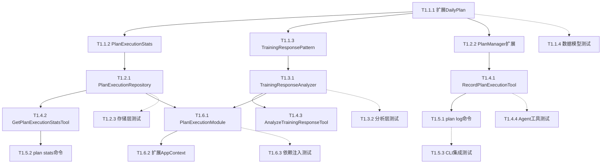
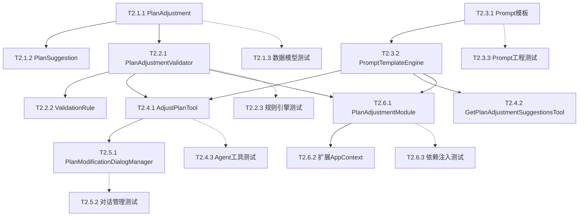
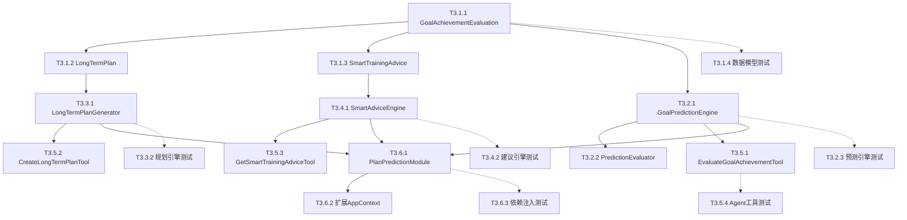
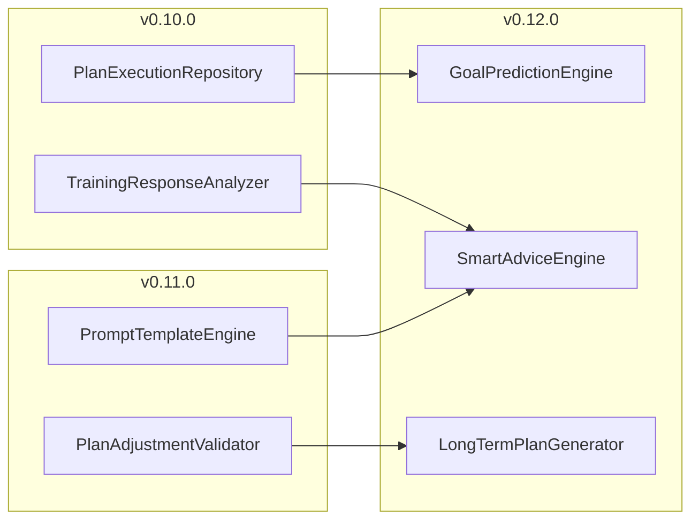

# 智能跑步计划开发任务清单

> **文档版本**: v1.0  
> **创建日期**: 2026-04-18  
> **适用范围**: v0.10.0 - v0.12.0 智能跑步计划功能  
> **任务总数**: 42  
> **总工作量**: 168小时

---

## 1. 任务概览

### 1.1 版本分布

| 版本 | 任务数 | P0任务数 | P1任务数 | P2任务数 | 总工作量 |
|------|--------|---------|---------|---------|---------|
| v0.10.0 | 14 | 10 | 4 | 0 | 56小时 |
| v0.11.0 | 14 | 10 | 4 | 0 | 56小时 |
| v0.12.0 | 14 | 10 | 4 | 0 | 56小时 |

### 1.2 里程碑

| 里程碑 | 日期 | 交付物 |
|--------|------|--------|
| v0.10.0发布 | 2026-05-05 | 数据感知功能完整 |
| v0.11.0发布 | 2026-05-25 | 智能调整功能完整 |
| v0.12.0发布 | 2026-06-15 | 预测规划功能完整 |

---

## 2. v0.10.0 数据感知层任务

### 2.1 数据模型层（P0）

| 任务ID | 任务名称 | 优先级 | 依赖 | 工作量 | 验收标准 |
|--------|---------|--------|------|--------|---------|
| T1.1.1 | 扩展DailyPlan数据模型 | P0 | 无 | 2h | 新增字段：completion_rate, effort_score, feedback_notes，类型注解完整 |
| T1.1.2 | 新增PlanExecutionStats数据类 | P0 | T1.1.1 | 2h | 数据类定义完整，包含所有统计指标，类型注解完整 |
| T1.1.3 | 新增TrainingResponsePattern数据类 | P0 | T1.1.1 | 2h | 数据类定义完整，包含分析维度，类型注解完整 |
| T1.1.4 | 编写数据模型单元测试 | P0 | T1.1.1-T1.1.3 | 4h | 测试覆盖率≥80%，边界条件测试完整 |

### 2.2 存储层（P0）

| 任务ID | 任务名称 | 优先级 | 依赖 | 工作量 | 验收标准 |
|--------|---------|--------|------|--------|---------|
| T1.2.1 | 实现PlanExecutionRepository | P0 | T1.1.2 | 4h | 使用Polars向量化计算，性能达标（<500ms） |
| T1.2.2 | 扩展PlanManager.record_execution() | P0 | T1.1.1 | 2h | 支持记录执行反馈，异常处理完整 |
| T1.2.3 | 编写存储层单元测试 | P0 | T1.2.1-T1.2.2 | 4h | 测试覆盖率≥80%，Mock策略正确 |

### 2.3 分析层（P1）

| 任务ID | 任务名称 | 优先级 | 依赖 | 工作量 | 验收标准 |
|--------|---------|--------|------|--------|---------|
| T1.3.1 | 实现TrainingResponseAnalyzer | P1 | T1.2.1 | 4h | 支持分析训练响应模式，输出结构化报告 |
| T1.3.2 | 编写分析层单元测试 | P1 | T1.3.1 | 3h | 测试覆盖率≥80%，分析结果验证完整 |

### 2.4 Agent工具层（P0）

| 任务ID | 任务名称 | 优先级 | 依赖 | 工作量 | 验收标准 |
|--------|---------|--------|------|--------|---------|
| T1.4.1 | 实现RecordPlanExecutionTool | P0 | T1.2.2 | 3h | 符合OpenAI规范，异常处理完整 |
| T1.4.2 | 实现GetPlanExecutionStatsTool | P0 | T1.2.1 | 2h | 符合OpenAI规范，返回结构化数据 |
| T1.4.3 | 实现AnalyzeTrainingResponseTool | P1 | T1.3.1 | 2h | 符合OpenAI规范，输出分析报告 |
| T1.4.4 | 编写Agent工具单元测试 | P0 | T1.4.1-T1.4.3 | 4h | 测试覆盖率≥70%，Mock LLM调用 |

### 2.5 CLI命令层（P0）

| 任务ID | 任务名称 | 优先级 | 依赖 | 工作量 | 验收标准 |
|--------|---------|--------|------|--------|---------|
| T1.5.1 | 实现plan log命令 | P0 | T1.4.1 | 3h | 支持--interactive和--dry-run参数 |
| T1.5.2 | 实现plan stats命令 | P0 | T1.4.2 | 2h | 输出格式化统计报告 |
| T1.5.3 | 编写CLI集成测试 | P0 | T1.5.1-T1.5.2 | 3h | 测试覆盖率≥60%，端到端测试完整 |

### 2.6 依赖注入层（P0）

| 任务ID | 任务名称 | 优先级 | 依赖 | 工作量 | 验收标准 |
|--------|---------|--------|------|--------|---------|
| T1.6.1 | 实现PlanExecutionModule | P0 | T1.2.1, T1.3.1 | 2h | 模块化封装，支持依赖注入 |
| T1.6.2 | 扩展AppContext | P0 | T1.6.1 | 1h | 新增plan_execution模块，向后兼容 |
| T1.6.3 | 编写依赖注入单元测试 | P0 | T1.6.1-T1.6.2 | 2h | 测试覆盖率≥80%，Mock验证正确 |

---

## 3. v0.11.0 智能调整层任务

### 3.1 数据模型层（P0）

| 任务ID | 任务名称 | 优先级 | 依赖 | 工作量 | 验收标准 |
|--------|---------|--------|------|--------|---------|
| T2.1.1 | 新增PlanAdjustment数据类 | P0 | 无 | 2h | 数据类定义完整，包含调整类型、原因、置信度 |
| T2.1.2 | 新增PlanSuggestion数据类 | P0 | T2.1.1 | 2h | 数据类定义完整，包含建议类型、优先级 |
| T2.1.3 | 编写数据模型单元测试 | P0 | T2.1.1-T2.1.2 | 3h | 测试覆盖率≥80% |

### 3.2 规则引擎层（P0）

| 任务ID | 任务名称 | 优先级 | 依赖 | 工作量 | 验收标准 |
|--------|---------|--------|------|--------|---------|
| T2.2.1 | 实现PlanAdjustmentValidator | P0 | T2.1.1 | 4h | 支持可扩展规则，优先级机制，异常隔离 |
| T2.2.2 | 实现ValidationRule规则类 | P0 | T2.2.1 | 3h | 支持动态添加/移除规则，启用/禁用 |
| T2.2.3 | 编写规则引擎单元测试 | P0 | T2.2.1-T2.2.2 | 4h | 测试覆盖率≥80%，规则冲突测试完整 |

### 3.3 Prompt工程层（P0）

| 任务ID | 任务名称 | 优先级 | 依赖 | 工作量 | 验收标准 |
|--------|---------|--------|------|--------|---------|
| T2.3.1 | 设计ADJUST_PLAN_PROMPT模板 | P0 | 无 | 3h | 包含用户上下文、执行数据、运动科学约束 |
| T2.3.2 | 实现PromptTemplateEngine | P0 | T2.3.1 | 3h | 支持模板渲染，上下文注入 |
| T2.3.3 | 编写Prompt工程单元测试 | P0 | T2.3.1-T2.3.2 | 3h | 测试覆盖率≥80%，模板渲染验证 |

### 3.4 Agent工具层（P0）

| 任务ID | 任务名称 | 优先级 | 依赖 | 工作量 | 验收标准 |
|--------|---------|--------|------|--------|---------|
| T2.4.1 | 实现AdjustPlanTool | P0 | T2.2.1, T2.3.2 | 4h | 支持30秒超时、3次重试、规则引擎降级 |
| T2.4.2 | 实现GetPlanAdjustmentSuggestionsTool | P1 | T2.3.2 | 3h | 返回个性化调整建议 |
| T2.4.3 | 编写Agent工具单元测试 | P0 | T2.4.1-T2.4.2 | 4h | 测试覆盖率≥70%，Mock LLM调用 |

### 3.5 对话管理层（P0）

| 任务ID | 任务名称 | 优先级 | 依赖 | 工作量 | 验收标准 |
|--------|---------|--------|------|--------|---------|
| T2.5.1 | 实现PlanModificationDialogManager | P0 | T2.4.1 | 4h | 支持多轮对话，上下文感知，确认机制 |
| T2.5.2 | 编写对话管理单元测试 | P0 | T2.5.1 | 3h | 测试覆盖率≥80%，对话流程验证 |

### 3.6 依赖注入层（P0）

| 任务ID | 任务名称 | 优先级 | 依赖 | 工作量 | 验收标准 |
|--------|---------|--------|------|--------|---------|
| T2.6.1 | 实现PlanAdjustmentModule | P0 | T2.2.1, T2.3.2 | 2h | 模块化封装，支持依赖注入 |
| T2.6.2 | 扩展AppContext | P0 | T2.6.1 | 1h | 新增plan_adjustment模块 |
| T2.6.3 | 编写依赖注入单元测试 | P0 | T2.6.1-T2.6.2 | 2h | 测试覆盖率≥80% |

---

## 4. v0.12.0 预测规划层任务

### 4.1 数据模型层（P0）

| 任务ID | 任务名称 | 优先级 | 依赖 | 工作量 | 验收标准 |
|--------|---------|--------|------|--------|---------|
| T3.1.1 | 新增GoalAchievementEvaluation数据类 | P0 | 无 | 2h | 包含达成概率、关键风险、改进建议 |
| T3.1.2 | 新增LongTermPlan数据类 | P0 | T3.1.1 | 2h | 包含周期划分、目标描述、训练周期 |
| T3.1.3 | 新增SmartTrainingAdvice数据类 | P0 | T3.1.1 | 2h | 包含建议类型、优先级、上下文 |
| T3.1.4 | 编写数据模型单元测试 | P0 | T3.1.1-T3.1.3 | 3h | 测试覆盖率≥80% |

### 4.2 预测引擎层（P0）

| 任务ID | 任务名称 | 优先级 | 依赖 | 工作量 | 验收标准 |
|--------|---------|--------|------|--------|---------|
| T3.2.1 | 实现GoalPredictionEngine | P0 | T3.1.1 | 4h | 支持目标达成预测，VDOT计算，风险评估 |
| T3.2.2 | 实现PredictionEvaluator | P0 | T3.2.1 | 3h | 支持预测评估，误差计算，指标统计 |
| T3.2.3 | 编写预测引擎单元测试 | P0 | T3.2.1-T3.2.2 | 4h | 测试覆盖率≥80%，预测准确性验证 |

### 4.3 规划引擎层（P1）

| 任务ID | 任务名称 | 优先级 | 依赖 | 工作量 | 验收标准 |
|--------|---------|--------|------|--------|---------|
| T3.3.1 | 实现LongTermPlanGenerator | P1 | T3.1.2 | 4h | 支持年度/赛季/多周期规划 |
| T3.3.2 | 编写规划引擎单元测试 | P1 | T3.3.1 | 3h | 测试覆盖率≥80% |

### 4.4 建议引擎层（P1）

| 任务ID | 任务名称 | 优先级 | 依赖 | 工作量 | 验收标准 |
|--------|---------|--------|------|--------|---------|
| T3.4.1 | 实现SmartAdviceEngine | P1 | T3.1.3 | 4h | 支持训练/恢复/营养/伤病预防建议 |
| T3.4.2 | 编写建议引擎单元测试 | P1 | T3.4.1 | 3h | 测试覆盖率≥80% |

### 4.5 Agent工具层（P0）

| 任务ID | 任务名称 | 优先级 | 依赖 | 工作量 | 验收标准 |
|--------|---------|--------|------|--------|---------|
| T3.5.1 | 实现EvaluateGoalAchievementTool | P0 | T3.2.1 | 3h | 符合OpenAI规范，返回结构化评估 |
| T3.5.2 | 实现CreateLongTermPlanTool | P1 | T3.3.1 | 3h | 符合OpenAI规范，支持多周期规划 |
| T3.5.3 | 实现GetSmartTrainingAdviceTool | P1 | T3.4.1 | 2h | 符合OpenAI规范，返回个性化建议 |
| T3.5.4 | 编写Agent工具单元测试 | P0 | T3.5.1-T3.5.3 | 4h | 测试覆盖率≥70%，Mock LLM调用 |

### 4.6 依赖注入层（P0）

| 任务ID | 任务名称 | 优先级 | 依赖 | 工作量 | 验收标准 |
|--------|---------|--------|------|--------|---------|
| T3.6.1 | 实现PlanPredictionModule | P0 | T3.2.1, T3.3.1, T3.4.1 | 2h | 模块化封装，支持依赖注入 |
| T3.6.2 | 扩展AppContext | P0 | T3.6.1 | 1h | 新增plan_prediction模块 |
| T3.6.3 | 编写依赖注入单元测试 | P0 | T3.6.1-T3.6.2 | 2h | 测试覆盖率≥80% |

---

## 5. 依赖关系图

### 5.1 v0.10.0 依赖关系

### 5.2 v0.11.0 依赖关系

### 5.3 v0.12.0 依赖关系

### 5.4 跨版本依赖关系

---

## 6. 迭代计划

### 6.1 Sprint 1: v0.10.0核心（第1-2周）

**目标**: 完成数据感知层核心功能

**任务列表**:
- T1.1.1 扩展DailyPlan数据模型（2h）
- T1.1.2 新增PlanExecutionStats数据类（2h）
- T1.1.3 新增TrainingResponsePattern数据类（2h）
- T1.2.1 实现PlanExecutionRepository（4h）
- T1.2.2 扩展PlanManager.record_execution()（2h）
- T1.4.1 实现RecordPlanExecutionTool（3h）
- T1.4.2 实现GetPlanExecutionStatsTool（2h）
- T1.5.1 实现plan log命令（3h）
- T1.5.2 实现plan stats命令（2h）

**总工作量**: 22小时

**验收标准**:
- CLI命令功能完整
- Agent工具功能完整
- 测试覆盖率≥80%

### 6.2 Sprint 2: v0.10.0完善 + v0.11.0并行准备（第1-2周）

**目标**: 完成v0.10.0测试和依赖注入，并行准备v0.11.0

**任务列表**:
- T1.1.4 编写数据模型单元测试（4h）
- T1.2.3 编写存储层单元测试（4h）
- T1.3.1 实现TrainingResponseAnalyzer（4h）
- T1.3.2 编写分析层单元测试（3h）
- T1.4.3 实现AnalyzeTrainingResponseTool（2h）
- T1.4.4 编写Agent工具单元测试（4h）
- T1.5.3 编写CLI集成测试（3h）
- T1.6.1 实现PlanExecutionModule（2h）
- T1.6.2 扩展AppContext（1h）
- T1.6.3 编写依赖注入单元测试（2h）

**并行任务（v0.11.0准备）**:
- T2.1.1 新增PlanAdjustment数据类（2h）
- T2.1.2 新增PlanSuggestion数据类（2h）
- T2.3.1 设计ADJUST_PLAN_PROMPT模板（3h）

**总工作量**: 34小时

### 6.3 Sprint 3: v0.11.0核心（第3-5周）

**目标**: 完成智能调整层核心功能

**任务列表**:
- T2.1.3 编写数据模型单元测试（3h）
- T2.2.1 实现PlanAdjustmentValidator（4h）
- T2.2.2 实现ValidationRule规则类（3h）
- T2.2.3 编写规则引擎单元测试（4h）
- T2.3.2 实现PromptTemplateEngine（3h）
- T2.3.3 编写Prompt工程单元测试（3h）
- T2.4.1 实现AdjustPlanTool（4h）
- T2.4.2 实现GetPlanAdjustmentSuggestionsTool（3h）
- T2.4.3 编写Agent工具单元测试（4h）
- T2.5.1 实现PlanModificationDialogManager（4h）
- T2.5.2 编写对话管理单元测试（3h）

**总工作量**: 38小时

### 6.4 Sprint 4: v0.11.0完善 + v0.12.0并行准备（第3-5周）

**目标**: 完成v0.11.0依赖注入，并行准备v0.12.0

**任务列表**:
- T2.6.1 实现PlanAdjustmentModule（2h）
- T2.6.2 扩展AppContext（1h）
- T2.6.3 编写依赖注入单元测试（2h）

**并行任务（v0.12.0准备）**:
- T3.1.1 新增GoalAchievementEvaluation数据类（2h）
- T3.1.2 新增LongTermPlan数据类（2h）
- T3.1.3 新增SmartTrainingAdvice数据类（2h）
- T3.1.4 编写数据模型单元测试（3h）

**总工作量**: 14小时

### 6.5 Sprint 5: v0.12.0核心（第6-8周）

**目标**: 完成预测规划层核心功能

**任务列表**:
- T3.2.1 实现GoalPredictionEngine（4h）
- T3.2.2 实现PredictionEvaluator（3h）
- T3.2.3 编写预测引擎单元测试（4h）
- T3.3.1 实现LongTermPlanGenerator（4h）
- T3.3.2 编写规划引擎单元测试（3h）
- T3.4.1 实现SmartAdviceEngine（4h）
- T3.4.2 编写建议引擎单元测试（3h）
- T3.5.1 实现EvaluateGoalAchievementTool（3h）
- T3.5.2 实现CreateLongTermPlanTool（3h）
- T3.5.3 实现GetSmartTrainingAdviceTool（2h）
- T3.5.4 编写Agent工具单元测试（4h）

**总工作量**: 37小时

### 6.6 Sprint 6: v0.12.0完善（第6-8周）

**目标**: 完成v0.12.0依赖注入和整体测试

**任务列表**:
- T3.6.1 实现PlanPredictionModule（2h）
- T3.6.2 扩展AppContext（1h）
- T3.6.3 编写依赖注入单元测试（2h）

**总工作量**: 5小时

---

## 7. 风险与应对

### 7.1 技术风险

| 风险 | 概率 | 影响 | 应对策略 |
|------|------|------|---------|
| Prompt效果不稳定 | 高 | 高 | 规则引擎兜底 + 结构化输出 + Few-shot学习 |
| LLM响应延迟 | 中 | 中 | 异步处理 + 缓存机制 + 流式输出 |
| 测试覆盖率不达标 | 中 | 高 | 测试驱动开发 + Mock策略 + 测试数据工厂 |
| 依赖关系复杂 | 低 | 中 | 模块化设计 + 依赖注入 + 单元测试隔离 |

### 7.2 进度风险

| 风险 | 概率 | 影响 | 应对策略 |
|------|------|------|---------|
| 任务估算偏差 | 中 | 中 | 预留20%缓冲时间，每日进度跟踪 |
| 跨版本依赖阻塞 | 低 | 高 | 并行开发策略，接口先行 |
| 技术难点延期 | 中 | 中 | 提前技术预研，备选方案准备 |

---

## 8. 验收标准

### 8.1 功能验收

- [ ] 所有P0任务完成率100%
- [ ] 所有P1任务完成率≥80%
- [ ] 所有CLI命令功能正常
- [ ] 所有Agent工具功能正常

### 8.2 质量验收

- [ ] 核心模块测试覆盖率≥80%
- [ ] Agent工具测试覆盖率≥70%
- [ ] CLI命令测试覆盖率≥60%
- [ ] 无P0级别Bug
- [ ] 无P1级别Bug

### 8.3 性能验收

- [ ] PlanExecutionRepository查询响应时间<500ms
- [ ] LLM调用超时控制有效（30秒）
- [ ] CLI命令响应时间<1秒

---

## 9. 变更记录

| 版本 | 日期 | 变更内容 | 作者 |
|------|------|----------|------|
| v1.0 | 2026-04-18 | 初始版本 | 架构师 |

---

*本文档遵循任务拆解规范，定期更新进度*
