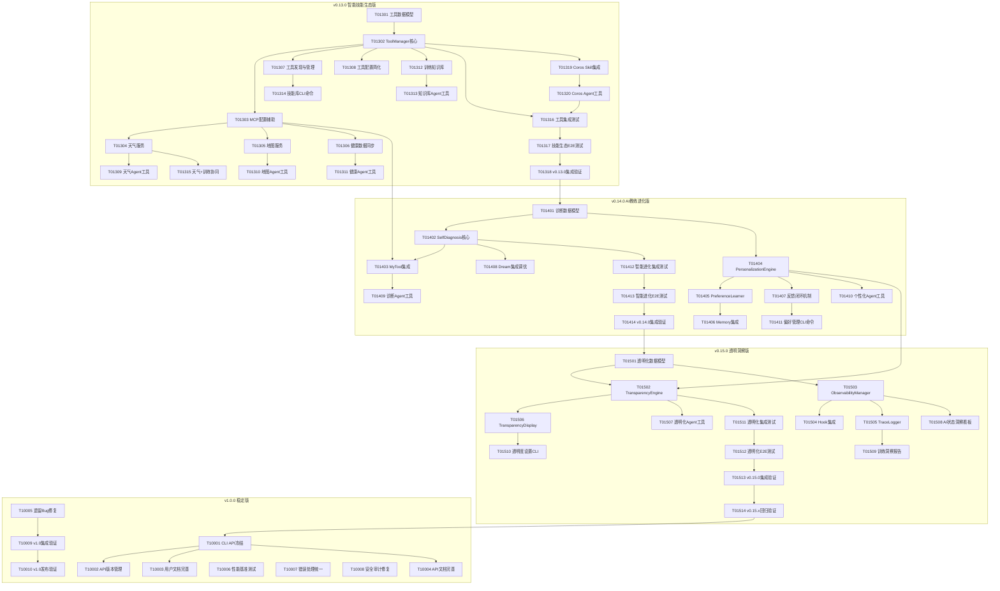

# 开发任务拆解清单

> **文档版本**: v1.2  
> **创建日期**: 2026-04-26  
> **更新日期**: 2026-04-26  
> **适用范围**: v0.13.0 - v1.0.0  
> **架构依据**: 架构设计说明书.md (v3.1.0), 架构设计说明书_v0.13-0.15.md (v6.1)  
> **需求依据**: REQ_需求规格说明书.md (v3.0)  
> **产品依据**: 探索版本产品规划_v0.13-0.15.md (v4.0)

---

## 1. 总览

### 1.1 版本规划概览

| 版本 | 版本名称 | 目标日期 | 核心目标 | 任务数 | 总工时(h) |
|------|---------|---------|---------|--------|----------|
| v0.13.0 | 智能技能生态版 | 2026-05-13 | 工具生态接入 + 智能技能库 | 20 | 136 |
| v0.14.0 | AI教练进化版 | 2026-06-06 | AI自我诊断 + 个性化学习 | 14 | 104 |
| v0.15.0 | 透明洞察版 | 2026-06-24 | 决策透明化 + 全链路可观测 | 14 | 104 |
| v1.0.0 | 稳定版 | 2026-07-31 | API稳定 + 文档完善 + Bug修复 | 10 | 72 |
| **合计** | - | - | - | **58** | **416** |

### 1.2 优先级分布

| 优先级 | 数量 | 说明 |
|--------|------|------|
| P0 | 28 | 核心功能，必须完成 |
| P1 | 22 | 重要功能，版本内完成 |
| P2 | 8 | 增强功能，可延期 |

### 1.3 依赖关系图



---

## 2. v0.13.0 智能技能生态版

> **版本目标**: 让Nanobot Runner拥有可扩展的智能技能库，用户能够按需启用内置技能或导入自定义技能，同时接入丰富的外部工具生态  
> **目标日期**: 2026-05-13  
> **核心策略**: 本地工具优先，云端工具可控，用户自主选择

### 2.1 任务列表

| 任务ID | 任务名称 | 优先级 | 依赖 | 工时(h) | 验收标准 |
|--------|---------|--------|------|---------|---------|
| T01301 | 工具数据模型定义 | P0 | 无 | 6 | ToolInfo/ToolStatus/ToolType数据类定义完成，类型注解完整，mypy零错误 |
| T01302 | ToolManager核心实现 | P0 | T01301 | 8 | list_tools/get_tool_status/enable_tool/disable_tool接口实现，**配置管理而非工具调用**，单元测试覆盖率≥80% |
| T01303 | MCP配置辅助实现 | P0 | T01302 | 8 | MCPConfigHelper实现，load_mcp_servers_config/validate_mcp_config/list_mcp_tools/import_claude_desktop_config接口实现，**工具调用由Nanobot SDK自动处理** |
| T01304 | 天气服务接入 | P0 | T01303 | 10 | **必须通过MCP协议接入**，WeatherService实现，get_weather/get_forecast接口可用，支持≥1个天气数据源，响应时间<3秒，城市级地理位置传输，底座能力集成证明 |
| T01305 | 地图服务接入 | P1 | T01303 | 10 | **必须通过MCP协议接入**，MapService实现，plan_route/analyze_route接口可用，路线数据本地存储，规划响应时间<3秒，底座能力集成证明 |
| T01306 | 健康数据同步 | P1 | T01303 | 8 | **必须通过MCP协议对接**，HealthDataSync实现，支持睡眠/HRV数据同步，数据传输安全性验证通过，底座能力集成证明 |
| T01307 | 工具发现与管理 | P0 | T01302 | 6 | 工具发现、启用/禁用、状态查询功能完成，**配置持久化到config.json**，用户可自主管理 |
| T01308 | 工具配置简化 | P1 | T01302 | 6 | 支持Claude Desktop配置一键导入，环境变量覆盖，配置验证 |
| T01309 | 天气Agent工具 | P0 | T01304 | 6 | 天气查询Agent Tool注册完成，Agent可通过自然语言查询天气，工具调用成功率>95% |
| T01310 | 地图Agent工具 | P1 | T01305 | 6 | 路线规划Agent Tool注册完成，Agent可通过自然语言规划路线 |
| T01311 | 健康Agent工具 | P1 | T01306 | 6 | 健康数据查询Agent Tool注册完成，Agent可查询睡眠/HRV等健康数据 |
| T01312 | 训练知识库接入 | P1 | T01302 | 8 | 训练知识库SKILL定义完成，支持专业训练理论查询，仅查询公开知识库 |
| T01313 | 知识库Agent工具 | P1 | T01312 | 4 | 知识库查询Agent Tool注册完成，Agent可回答训练理论问题 |
| T01314 | 技能库CLI命令 | P0 | T01307 | 8 | nanobotrun skill list/enable/disable/import命令实现，交互式技能库菜单，Rich格式化输出 |
| T01315 | 天气+训练协同 | P1 | T01304 | 6 | AI可同时调用天气和训练数据给出综合建议，多技能协同逻辑完成 |
| T01316 | 工具集成测试 | P0 | T01309,T01310,T01311,T01320 | 8 | 工具配置/发现/状态查询集成测试通过，**Nanobot.from_config()自动加载验证**，Mock测试覆盖所有外部依赖 |
| T01317 | 技能生态E2E测试 | P0 | T01316 | 6 | 完整技能启用→Agent调用→结果返回流程测试通过，成功率>95% |
| T01318 | v0.13.0集成验证 | P0 | T01317 | 6 | 所有P0功能验收通过，测试覆盖率core≥80%/agents≥70%/cli≥60%，ruff+mypy零错误 |
| T01319 | Coros活动数据下载Skill集成 | P1 | T01302 | 6 | **采用Skills接入方式**，Coros活动下载Skill注册完成，支持跑步运动类型(sportType=100)FIT文件下载，labelId去重机制验证通过，底座Skill Loader能力集成证明 |
| T01320 | Coros Agent工具 | P1 | T01319 | 4 | Coros活动下载Agent Tool注册完成，Agent可通过自然语言触发下载，工具调用成功率>90% |

### 2.2 迭代计划

| 迭代 | 时间 | 任务 | 交付目标 |
|------|------|------|---------|
| Sprint 1 | Day 1-5 | T01301, T01302, T01307 | 工具管理核心框架可用 |
| Sprint 2 | Day 6-10 | T01303, T01304, T01308 | MCP配置辅助+天气服务MVP可用 |
| Sprint 3 | Day 11-15 | T01305, T01306, T01309, T01310 | 地图/健康服务+Agent工具 |
| Sprint 4 | Day 16-20 | T01311, T01312, T01313, T01314, T01319, T01320 | 知识库+CLI命令+Coros集成 |
| Sprint 5 | Day 21-28 | T01315, T01316, T01317, T01318 | 协同+测试+集成验证 |

### 2.3 风险标注

| 风险任务 | 风险描述 | 缓解措施 |
|---------|---------|---------|
| T01304 天气服务 | 外部API可能变更或限流 | 预留多数据源切换机制，本地缓存策略 |
| T01305 地图服务 | 地图API可能有使用限制 | 支持离线地图数据，用户可手动绘制路线 |
| T01303 MCP配置辅助 | nanobot-ai MCP配置格式可能变更 | 封装适配层，版本锁定，配置验证机制 |
| T01319 Coros集成 | COROS API或页面结构可能变更 | 封装适配层，Chrome DevTools MCP提供浏览器自动化灵活性 |

---

## 3. v0.14.0 AI教练进化版

> **版本目标**: 让AI教练具备长期记忆能力和人格进化能力，实现真正"越用越懂你"的个性化训练指导  
> **目标日期**: 2026-06-06  
> **核心策略**: 规则引擎优先，数据驱动优化，用户可控学习

### 3.1 任务列表

| 任务ID | 任务名称 | 优先级 | 依赖 | 工时(h) | 验收标准 |
|--------|---------|--------|------|---------|---------|
| T01401 | 诊断与偏好数据模型 | P0 | 无 | 6 | ValidationResult/DiagnosisReport/UserPreferences/PersonalizedSuggestion/FeedbackRecord数据类定义完成 |
| T01402 | SelfDiagnosis核心实现 | P0 | T01401 | 10 | validate_suggestion/diagnose_error/track_execution接口实现，规则引擎覆盖率100%，诊断准确率>85% |
| T01403 | MyTool集成 | P0 | T01402 | 8 | enable_self_reflection/enable_parameter_tuning/get_reflection_report接口实现，自反思能力可用 |
| T01404 | PersonalizationEngine实现 | P0 | T01401 | 10 | personalize_suggestion/adjust_intensity/get_preference_weights接口实现，建议接受率>85% |
| T01405 | PreferenceLearner实现 | P0 | T01404 | 10 | learn_from_feedback/update_preference_model/get_learned_preferences/reset_preferences接口实现 |
| T01406 | Memory系统集成 | P0 | T01405 | 8 | save_preference_to_memory/load_preference_from_memory/update_memory_context接口实现，跨会话记忆连贯 |
| T01407 | 反馈闭环机制 | P1 | T01404 | 8 | 用户反馈收集→偏好更新→效果追踪闭环完成，反馈处理响应时间<500ms |
| T01408 | Dream集成调优 | P0 | T01402 | 8 | 对话历史自动归档、偏好自动提取完成，记忆整理频率可配置，人格进化参数可调 |
| T01409 | 诊断Agent工具 | P0 | T01403 | 6 | 建议质量自检Agent Tool注册完成，错误智能诊断Agent Tool注册完成 |
| T01410 | 个性化Agent工具 | P0 | T01404 | 6 | 个性化建议Agent Tool注册完成，偏好查询Agent Tool注册完成 |
| T01411 | 偏好管理CLI命令 | P1 | T01407 | 6 | nanobotrun preference show/reset/export命令实现，用户可查看/修改/重置偏好 |
| T01412 | 智能进化集成测试 | P0 | T01409,T01410 | 8 | 自我诊断+个性化+偏好学习集成测试通过，Mock测试覆盖LLM调用 |
| T01413 | 智能进化E2E测试 | P0 | T01412 | 6 | 完整反馈→学习→个性化建议流程测试通过，建议接受率>85% |
| T01414 | v0.14.0集成验证 | P0 | T01413 | 6 | 所有P0功能验收通过，测试覆盖率达标，ruff+mypy零错误 |

### 3.2 迭代计划

| 迭代 | 时间 | 任务 | 交付目标 |
|------|------|------|---------|
| Sprint 1 | Day 1-4 | T01401, T01402 | 自我诊断核心可用 |
| Sprint 2 | Day 5-10 | T01403, T01404, T01408 | MyTool+个性化引擎+Dream集成 |
| Sprint 3 | Day 11-16 | T01405, T01406, T01407 | 偏好学习+Memory+反馈闭环 |
| Sprint 4 | Day 17-22 | T01409, T01410, T01411 | Agent工具+CLI命令 |
| Sprint 5 | Day 23-28 | T01412, T01413, T01414 | 测试+集成验证 |

### 3.3 风险标注

| 风险任务 | 风险描述 | 缓解措施 |
|---------|---------|---------|
| T01404 个性化引擎 | 个性化效果可能不达预期 | 设置效果阈值，未达标时调整Dream参数，规则引擎快速验证 |
| T01408 Dream集成 | Dream自动整理可能过度修改记忆 | 提供记忆版本回溯，用户可控整理频率 |
| T01405 偏好学习 | 学习速率过快导致过度拟合 | 渐进式学习，学习速率可配置 |

---

## 4. v0.15.0 透明洞察版

> **版本目标**: 让用户能够清晰了解AI助手的决策过程，建立对AI建议的信任  
> **目标日期**: 2026-06-24  
> **核心策略**: 用户友好，分层展示，可控透明

### 4.1 任务列表

| 任务ID | 任务名称 | 优先级 | 依赖 | 工时(h) | 验收标准 |
|--------|---------|--------|------|---------|---------|
| T01501 | 透明化数据模型 | P0 | 无 | 6 | AIDecision/DecisionExplanation/DataSource/DecisionPath/DetailLevel数据类定义完成 |
| T01502 | TransparencyEngine实现 | P0 | T01501 | 10 | generate_explanation/trace_data_sources/visualize_decision_path接口实现，简洁版+详细版解释生成 |
| T01503 | ObservabilityManager实现 | P0 | T01501 | 10 | start_trace/record_event/end_trace/get_metrics接口实现，全链路追踪可用 |
| T01504 | Hook系统集成 | P0 | T01503 | 8 | register_pre_decision_hook/register_post_decision_hook/register_tool_invocation_hook接口实现 |
| T01505 | TraceLogger实现 | P1 | T01503 | 8 | log_decision/log_tool_invocation/query_logs接口实现，日志持久化，支持回溯查询 |
| T01506 | TransparencyDisplay实现 | P0 | T01502 | 8 | display_brief_explanation/display_detailed_explanation/display_data_sources/display_decision_path接口实现，Rich格式化 |
| T01507 | 透明化Agent工具 | P0 | T01502 | 6 | 思考过程展示/数据来源追溯/决策依据说明Agent Tool注册完成 |
| T01508 | AI状态洞察看板 | P1 | T01503 | 8 | AI进化状态/建议质量/工具可靠性/记忆整理日志展示完成，Rich格式化看板 |
| T01509 | 训练洞察报告 | P1 | T01505 | 8 | 训练模式分析/恢复状态趋势/AI建议效果分析/个性化进化报告生成完成 |
| T01510 | 透明度设置CLI | P1 | T01506 | 6 | nanobotrun transparency show/settings命令实现，简洁/详细/关闭三种模式切换 |
| T01511 | 透明化集成测试 | P0 | T01507,T01504 | 8 | 透明化+可观测性+Hook集成测试通过，追踪数据一致性验证 |
| T01512 | 透明化E2E测试 | P0 | T01511 | 6 | 完整决策→追踪→解释→展示流程测试通过，用户信任度>4.2/5 |
| T01513 | v0.15.0集成验证 | P0 | T01512 | 6 | 所有P0功能验收通过，测试覆盖率达标，ruff+mypy零错误 |
| T01514 | v0.15.x回归验证 | P0 | T01513 | 6 | v0.13.0-v0.15.0全版本回归测试通过，无功能退化 |

### 4.2 迭代计划

| 迭代 | 时间 | 任务 | 交付目标 |
|------|------|------|---------|
| Sprint 1 | Day 1-4 | T01501, T01502, T01503 | 透明化+可观测性核心可用 |
| Sprint 2 | Day 5-10 | T01504, T01505, T01506 | Hook+日志+展示模块 |
| Sprint 3 | Day 11-16 | T01507, T01508, T01509 | Agent工具+状态看板+洞察报告 |
| Sprint 4 | Day 17-21 | T01510, T01511 | CLI命令+集成测试 |
| Sprint 5 | Day 22-28 | T01512, T01513, T01514 | E2E测试+集成验证+回归 |

### 4.3 风险标注

| 风险任务 | 风险描述 | 缓解措施 |
|---------|---------|---------|
| T01502 透明化引擎 | 透明化信息可能过载 | 默认简洁模式，详细模式需用户主动开启 |
| T01503 可观测性 | 追踪数据量可能影响性能 | 懒加载、采样策略、异步处理 |
| T01506 展示模块 | 决策路径可视化复杂度高 | 优先Mermaid文本格式，后续迭代考虑图形化 |

---

## 5. v1.0.0 稳定版

> **版本目标**: API稳定化、文档完善、修复已知问题，为正式发布做准备  
> **目标日期**: 2026-07-31  
> **核心策略**: 向后兼容，质量优先，文档同步

### 5.1 任务列表

| 任务ID | 任务名称 | 优先级 | 依赖 | 工时(h) | 验收标准 |
|--------|---------|--------|------|---------|---------|
| T10001 | CLI API冻结与兼容性 | P0 | 无 | 8 | 所有CLI命令参数稳定，向后兼容，废弃参数标记deprecation warning |
| T10002 | API版本管理机制 | P1 | T10001 | 6 | APIVersion类实现，版本化命令支持，版本迁移指南 |
| T10003 | 用户文档完善 | P0 | T10001 | 8 | 快速开始/初始化配置/数据迁移/配置验证/Workspace配置指南完成 |
| T10004 | API文档完善 | P0 | T10001 | 8 | CLI API/Agent API/数据API参考文档完成，覆盖率100% |
| T10005 | 遗留Bug修复 | P0 | 无 | 8 | v0.12.0-v0.15.x所有已知Bug修复，Bug清零 |
| T10006 | 性能基准测试 | P1 | 无 | 8 | 性能基准测试框架建立，1年数据查询<100ms，内存<500MB，启动<3秒 |
| T10007 | 错误处理统一 | P1 | T10005 | 6 | 统一错误处理中间件，友好错误提示，错误恢复机制 |
| T10008 | 安全审计修复 | P0 | 无 | 6 | 安全扫描通过，无高危漏洞，敏感信息保护验证 |
| T10009 | v1.0集成验证 | P0 | T10005,T10007 | 6 | 全功能集成测试通过，性能指标达标，安全审计通过 |
| T10010 | v1.0发布验证 | P0 | T10009 | 8 | 发布检查清单全部通过，CHANGELOG更新，版本号更新，Git tag创建 |

### 5.2 迭代计划

| 迭代 | 时间 | 任务 | 交付目标 |
|------|------|------|---------|
| Sprint 1 | Day 1-5 | T10001, T10005, T10008 | API冻结+Bug修复+安全审计 |
| Sprint 2 | Day 6-12 | T10002, T10003, T10004 | 版本管理+文档完善 |
| Sprint 3 | Day 13-18 | T10006, T10007 | 性能基准+错误处理 |
| Sprint 4 | Day 19-24 | T10009, T10010 | 集成验证+发布 |

### 5.3 风险标注

| 风险任务 | 风险描述 | 缓解措施 |
|---------|---------|---------|
| T10001 API冻结 | API冻结可能限制后续优化 | 预留扩展点，版本化机制支持渐进式演进 |
| T10005 Bug修复 | 遗留Bug可能涉及架构调整 | 优先修复P0 Bug，P1/P2 Bug评估后决定是否延期 |
| T10006 性能基准 | 大数据量场景性能可能不达标 | 提前建立性能测试，预留优化缓冲时间 |

---

## 6. 跨版本依赖与约束

### 6.1 版本间强依赖

| 依赖关系 | 说明 | 风险等级 |
|---------|------|---------|
| v0.14.0 → v0.13.0 | 个性化建议需要天气/健康等外部数据作为输入 | 高 |
| v0.14.0 → v0.13.0 | AI教练人格进化需要SKILL扩展机制支撑 | 中 |
| v0.15.0 → v0.13.0 | 透明化需要监控外部工具调用 | 中 |
| v0.15.0 → v0.14.0 | 透明化需要展示个性化引擎决策过程 | 高 |
| v1.0.0 → v0.15.0 | 稳定版需基于完整的探索版本功能 | 高 |

### 6.2 关键路径

```
T01301 → T01302 → T01303 → T01304 → T01309 → T01316 → T01317 → T01318
                                                                              ↓
T01401 → T01402 → T01404 → T01405 → T01406 → T01412 → T01413 → T01414
                                                                              ↓
T01501 → T01502 → T01506 → T01511 → T01512 → T01513 → T01514
                                                              ↓
T10001 → T10005 → T10009 → T10010
```

**关键路径总工时**: 约 186 小时（仅关键路径上的任务）

### 6.3 并行任务机会

| 并行组 | 可并行任务 | 前置条件 |
|--------|-----------|---------|
| 并行组1 | T01304(天气) + T01305(地图) + T01306(健康) | T01303完成 |
| 并行组2 | T01309(天气Agent) + T01310(地图Agent) + T01311(健康Agent) | 对应服务完成 |
| 并行组3 | T01402(诊断) + T01404(个性化) | T01401完成 |
| 并行组4 | T01502(透明化) + T01503(可观测性) | T01501完成 |
| 并行组5 | T10003(用户文档) + T10004(API文档) + T10006(性能) | T10001完成 |

---

## 7. 质量门禁

### 7.1 版本准入标准

| 版本 | 准入条件 |
|------|---------|
| v0.13.0 | 架构设计确认 + nanobot-ai MCP能力验证通过 |
| v0.14.0 | v0.13.0发布 + MyTool/Memory能力验证通过 |
| v0.15.0 | v0.14.0发布 + Observability/Hook能力验证通过 |
| v1.0.0 | v0.15.0发布 + 全版本回归测试通过 |

### 7.2 版本准出标准

| 版本 | 准出条件 |
|------|---------|
| v0.13.0 | P0功能100%完成 + 测试覆盖率达标 + 外部工具接入≥3个 + 工具调用成功率>90% |
| v0.14.0 | P0功能100%完成 + 测试覆盖率达标 + 建议接受率>85% + 个性化感知度>4.0/5 |
| v0.15.0 | P0功能100%完成 + 测试覆盖率达标 + 透明化使用率>40% + 信任度>4.2/5 |
| v1.0.0 | 全部P0功能完成 + Bug清零 + 文档覆盖率100% + 性能指标达标 + 安全审计通过 |

### 7.3 通用质量标准

| 检查项 | 标准 | 命令 |
|--------|------|------|
| 代码格式 | ruff format零差异 | `uv run ruff format --check src/ tests/` |
| 代码质量 | ruff check零警告 | `uv run ruff check src/ tests/` |
| 类型检查 | mypy零错误 | `uv run mypy src/` |
| 单元测试 | 通过率100% | `uv run pytest tests/unit/ -v` |
| 覆盖率 | core≥80% agents≥70% cli≥60% | `uv run pytest --cov=src` |

---

## 8. 附录

### 8.1 任务ID命名规范

- 格式: `T{版本号}{序号}`
- 版本号: 013=v0.13.0, 014=v0.14.0, 015=v0.15.0, 100=v1.0.0
- 示例: T01301 = v0.13.0第1个任务

### 8.2 优先级定义

| 优先级 | 定义 | 延期规则 |
|--------|------|---------|
| P0 | 核心功能，版本内必须完成 | 不可延期 |
| P1 | 重要功能，版本内应完成 | 可延期至下一版本 |
| P2 | 增强功能，版本内尽量完成 | 可延期至后续版本 |

### 8.3 工时估算说明

- 工时基于个人开发者场景估算
- 包含开发+单元测试时间
- 不包含集成测试/E2E测试时间（单独任务）
- 预留20%缓冲时间应对风险

### 8.4 变更记录

| 版本 | 日期 | 变更内容 | 作者 |
|------|------|----------|------|
| v1.0 | 2026-04-26 | 初始版本，覆盖v0.13.0-v1.0.0全部任务 | 架构师 |
| v1.1 | 2026-04-26 | 补充MCP协议约束：T01304/T01305/T01306验收标准增加MCP协议强制要求；新增T01319/T01320 Coros活动数据下载任务；更新依赖关系图；更新迭代计划与风险标注 | 架构师 |
| v1.2 | 2026-04-26 | 对齐Python SDK文档：T01302/T01303/T01307验收标准调整，移除工具调用方法，改为配置管理；T01303重命名为"MCP配置辅助实现"；总工时从426h调整为416h | 架构师 |
