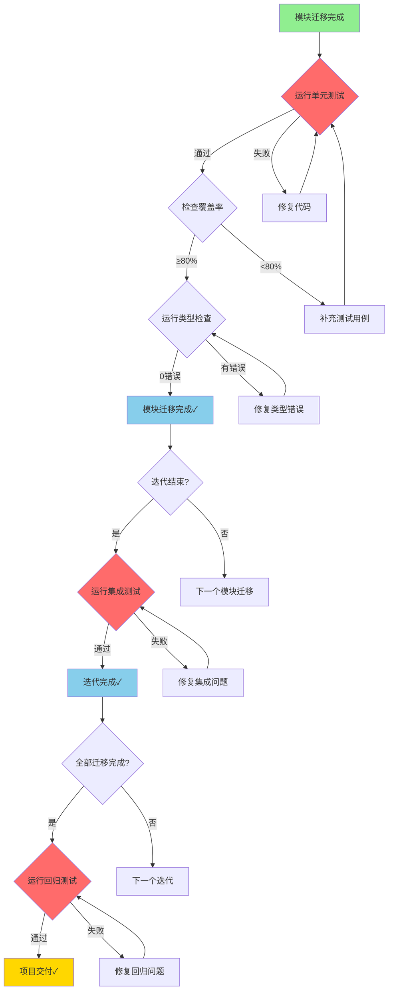

# 开发任务拆解清单 - v0.16.0

> **版本号**: v0.16.0  
> **拆解日期**: 2026-04-28  
> **任务来源**: `docs/architecture/core-module-refactor.md`  
> **架构依据**: `docs/architecture/架构设计说明书.md` (v4.0.0)  
> **更新说明**: 增加测试文件迁移任务，明确测试验收标准；修复所有 bash 脚本兼容性与错误处理问题

---

## 执行说明与环境要求

### 执行方式

本文档中的 bash 命令块设计为**完整的可执行脚本**。每个代码块应：
1. 复制到终端**按顺序执行**，或
2. 保存为 `.sh` 文件后执行（需先设置权限：`chmod +x script_name.sh`）

> **重要**: 每个任务中的多步骤命令需在**同一个 shell 会话中顺序执行**，以确保变量和状态正确传递。

### 环境要求

| 工具 | 最低版本 | 用途 | 检查命令 |
|------|---------|------|---------|
| Python | 3.9+ | 运行时环境 | `python --version` |
| Bash | 4.0+ | 脚本执行环境 | `bash --version` |
| Git | 2.30+ | 文件版本控制 | `git --version` |
| pytest | 7.0+ | 单元测试执行 | `pytest --version` |
| pytest-cov | 4.0+ | 覆盖率统计 | `pytest --cov --help` |
| mypy | 1.0+ | 静态类型检查 | `mypy --version` |
| findutils | - | 文件查找（`find` 命令） | `find --version` |

### 脚本安全头

所有可执行脚本块均遵循以下安全规范：
- `set -euo pipefail`：遇错即停，未定义变量报错，管道错误传递
- 前置条件检查：验证工具可用性和执行目录
- 错误处理：每个关键步骤后检查执行状态

```bash
#!/bin/bash
set -euo pipefail

# 前置检查
command -v pytest >/dev/null 2>&1 || { echo "错误: pytest 未安装"; exit 1; }
command -v mypy >/dev/null 2>&1 || { echo "错误: mypy 未安装"; exit 1; }
command -v git >/dev/null 2>&1 || { echo "错误: git 未安装"; exit 1; }

# 确保在项目根目录执行
if [ ! -f "pyproject.toml" ] && [ ! -f "setup.py" ] && [ ! -f "setup.cfg" ]; then
    echo "错误: 请在项目根目录执行此脚本"
    exit 1
fi
```

---

## 一、项目概述

### 1.1 项目目标

对 `src/core` 目录进行模块化重组，将根目录下散落的 30+ 个文件按职责划分到独立的子模块中，提升代码的可维护性、可测试性和可扩展性。

### 1.2 重构范围

| 模块 | 源文件数 | 测试文件数 | 受影响文件数 | 风险等级 | 优先级 | 预估工时 |
|------|---------|-----------|-------------|---------|--------|---------|
| `base/` | 7 | 7 | 85 | 🔴 高风险 | P0 | 4h |
| `calculators/` | 7 | 14 | 18 | 🟢 低风险 | P0 | 5h |
| `config/` | 6 | 6 | 37 | 🟠 中高风险 | P1 | 4h |
| `storage/` | 5 | 7 | 30 | 🟡 中风险 | P1 | 5h |
| `report/` | 3 | 3 | 8 | 🟢 低风险 | P2 | 2.5h |
| `models/` | 3 | 5 | 60 | 🔴 高风险 | P2 | 6h |

**总计**: 31 个源文件迁移，42 个测试文件迁移，约 120 个受影响文件，预估工时 26.5h

### 1.3 测试策略

#### 测试类型定义与执行时机

| 测试类型 | 定义 | 执行时机 | 通过标准 | 覆盖率要求 | 阻塞级别 |
|---------|------|---------|---------|-----------|---------|
| **单元测试** | 测试单个函数/类的功能正确性 | 每个模块迁移完成后立即执行 | 100% 通过 | ≥ 80% | 🔴 阻塞 |
| **集成测试** | 测试模块间协作是否正常 | 每个迭代完成后执行 | 100% 通过 | - | 🔴 阻塞 |
| **类型检查** | 验证类型注解的正确性 | 每个模块迁移完成后立即执行 | 0 错误 | - | 🟠 警告 |
| **回归测试** | 验证重构后功能无退化 | 全部迁移完成后执行 | 100% 通过 | - | 🔴 阻塞 |

#### 测试执行流程



#### 测试失败处理流程

| 失败场景 | 处理步骤 | 回滚策略 | 责任人 |
|---------|---------|---------|--------|
| **单元测试失败** | 1. 分析失败原因<br>2. 修复代码或测试<br>3. 重新运行测试 | 无需回滚，直接修复 | 开发工程师 |
| **覆盖率不足** | 1. 识别未覆盖代码<br>2. 补充测试用例<br>3. 重新运行测试 | 无需回滚，补充测试 | 开发工程师 |
| **类型检查失败** | 1. 分析类型错误<br>2. 修复类型注解<br>3. 重新运行检查 | 无需回滚，直接修复 | 开发工程师 |
| **集成测试失败** | 1. 定位集成问题<br>2. 修复模块间协作<br>3. 重新运行测试 | 回滚到上一个通过的版本 | 开发工程师 |
| **回归测试失败** | 1. 定位功能退化<br>2. 修复退化问题<br>3. 重新运行测试 | 回滚到重构前版本 | 开发工程师 |

#### 测试文件组织原则

```
tests/
├── unit/                    # 单元测试目录
│   ├── base/                # base 模块单元测试
│   │   ├── __init__.py
│   │   ├── test_logger.py
│   │   ├── test_decorators.py
│   │   ├── test_schema.py
│   │   ├── test_context_v010.py
│   │   ├── test_context_v0110.py
│   │   ├── test_context_v0120.py
│   │   └── test_profile.py
│   ├── calculators/         # calculators 模块单元测试
│   │   ├── __init__.py
│   │   ├── test_vdot_calculator.py
│   │   ├── test_race_prediction.py
│   │   └── ... (共14个测试文件)
│   ├── config/              # config 模块单元测试
│   ├── storage/             # storage 模块单元测试
│   ├── report/              # report 模块单元测试
│   └── models/              # models 模块单元测试
├── integration/             # 集成测试（保持现有结构）
│   ├── module/              # 模块间集成测试
│   └── workflow/            # 工作流集成测试
└── e2e/                     # 端到端测试（保持现有结构）
```

#### 测试报告生成要求

每个模块迁移完成后，必须生成以下测试报告：

1. **单元测试报告**：`pytest tests/unit/{module}/ -v --cov=src/core/{module} --cov-report=html --cov-report=term-missing`
2. **类型检查报告**：`mypy src/core/{module} --strict > reports/mypy_{module}.txt`
3. **覆盖率报告**：保存到 `reports/coverage/{module}/` 目录
4. **集成测试报告**（迭代结束时）：`pytest tests/integration/ -v --html=reports/integration_{iteration}.html`

### 1.4 预期收益

- **可维护性**: 职责清晰，文件定位更快
- **测试隔离**: 每个模块可独立测试
- **依赖管理**: 循环依赖问题更容易发现和解决
- **团队协作**: 不同开发者可并行开发不同模块
- **代码复用**: 计算器模块可被其他项目复用
- **架构清晰**: 分层明确：base → config/storage → calculators → analytics

---

## 二、任务清单

### 2.1 base/ 模块迁移任务（P0优先级）

#### TASK-BASE-001: 创建 base/ 目录结构

| 属性 | 内容 |
|------|------|
| **任务ID** | TASK-BASE-001 |
| **所属模块** | base/ |
| **任务名称** | 创建 base/ 目录结构 |
| **任务描述** | 创建 `src/core/base/` 目录及 `__init__.py` 文件 |
| **前置依赖** | 无 |
| **优先级** | P0 |
| **预估工时** | 0.2h |
| **交付物** | `src/core/base/` 目录及 `__init__.py` |
| **验收标准** | 1. 目录创建成功<br>2. `__init__.py` 文件存在<br>3. 目录结构符合设计规范 |

**执行步骤**:
```bash
mkdir -p src/core/base
touch src/core/base/__init__.py
```

---

#### TASK-BASE-002: 移动基础设施文件到 base/

| 属性 | 内容 |
|------|------|
| **任务ID** | TASK-BASE-002 |
| **所属模块** | base/ |
| **任务名称** | 移动基础设施文件到 base/ |
| **任务描述** | 将 7 个基础设施文件移动到 `src/core/base/` 目录 |
| **前置依赖** | TASK-BASE-001 |
| **优先级** | P0 |
| **预估工时** | 0.5h |
| **交付物** | 7 个文件成功移动到 `base/` 目录 |
| **验收标准** | 1. 所有文件移动成功<br>2. Git 状态显示文件已移动<br>3. 无文件丢失 |

**文件清单**:
```
src/core/exceptions.py → src/core/base/exceptions.py
src/core/logger.py → src/core/base/logger.py
src/core/decorators.py → src/core/base/decorators.py
src/core/result.py → src/core/base/result.py
src/core/schema.py → src/core/base/schema.py
src/core/context.py → src/core/base/context.py
src/core/profile.py → src/core/base/profile.py
```

**执行步骤**:
```bash
git mv src/core/exceptions.py src/core/base/
git mv src/core/logger.py src/core/base/
git mv src/core/decorators.py src/core/base/
git mv src/core/result.py src/core/base/
git mv src/core/schema.py src/core/base/
git mv src/core/context.py src/core/base/
git mv src/core/profile.py src/core/base/
```

---

#### TASK-BASE-003: 更新 base/ 模块导入路径

| 属性 | 内容 |
|------|------|
| **任务ID** | TASK-BASE-003 |
| **所属模块** | base/ |
| **任务名称** | 更新 base/ 模块导入路径 |
| **任务描述** | 全局更新所有文件中对 base 模块的导入路径（85 个受影响文件） |
| **前置依赖** | TASK-BASE-002 |
| **优先级** | P0 |
| **预估工时** | 1.0h |
| **交付物** | 所有导入路径更新完成 |
| **验收标准** | 1. 所有导入路径更新正确<br>2. 无遗漏的导入<br>3. IDE 无导入错误提示 |

**批量替换命令**:
```bash
#!/bin/bash
set -euo pipefail

# 使用 find 命令递归查找所有 .py 文件，确保跨平台兼容性
# exceptions.py
find . -name "*.py" -type f -exec sed -i 's/from src\.core\.exceptions/from src.core.base.exceptions/g' {} +

# logger.py
find . -name "*.py" -type f -exec sed -i 's/from src\.core\.logger/from src.core.base.logger/g' {} +

# decorators.py
find . -name "*.py" -type f -exec sed -i 's/from src\.core\.decorators/from src.core.base.decorators/g' {} +

# result.py
find . -name "*.py" -type f -exec sed -i 's/from src\.core\.result/from src.core.base.result/g' {} +

# schema.py
find . -name "*.py" -type f -exec sed -i 's/from src\.core\.schema/from src.core.base.schema/g' {} +

# context.py
find . -name "*.py" -type f -exec sed -i 's/from src\.core\.context/from src.core.base.context/g' {} +

# profile.py
find . -name "*.py" -type f -exec sed -i 's/from src\.core\.profile/from src.core.base.profile/g' {} +
```

---

#### TASK-BASE-004: 更新 base/ 模块 __init__.py

| 属性 | 内容 |
|------|------|
| **任务ID** | TASK-BASE-004 |
| **所属模块** | base/ |
| **任务名称** | 更新 base/ 模块 __init__.py |
| **任务描述** | 在 `base/__init__.py` 中导出公共接口，保持向后兼容 |
| **前置依赖** | TASK-BASE-003 |
| **优先级** | P0 |
| **预估工时** | 0.3h |
| **交付物** | `base/__init__.py` 文件 |
| **验收标准** | 1. 公共接口导出正确<br>2. 向后兼容性保持<br>3. 无循环导入问题 |

**代码示例**:
```python
from src.core.base.exceptions import *
from src.core.base.logger import get_logger
from src.core.base.decorators import *
from src.core.base.result import *
from src.core.base.schema import *
from src.core.base.context import *
from src.core.base.profile import *
```

---

#### TASK-BASE-005: 创建 base/ 测试目录结构

| 属性 | 内容 |
|------|------|
| **任务ID** | TASK-BASE-005 |
| **所属模块** | base/ |
| **任务名称** | 创建 base/ 测试目录结构 |
| **任务描述** | 创建 `tests/unit/base/` 目录及 `__init__.py` 文件 |
| **前置依赖** | TASK-BASE-004 |
| **优先级** | P0 |
| **预估工时** | 0.2h |
| **交付物** | `tests/unit/base/` 目录及 `__init__.py` |
| **验收标准** | 1. 目录创建成功<br>2. `__init__.py` 文件存在 |

**执行步骤**:
```bash
mkdir -p tests/unit/base
touch tests/unit/base/__init__.py
```

---

#### TASK-BASE-006: 移动 base/ 模块测试文件

| 属性 | 内容 |
|------|------|
| **任务ID** | TASK-BASE-006 |
| **所属模块** | base/ |
| **任务名称** | 移动 base/ 模块测试文件 |
| **任务描述** | 将 7 个测试文件移动到 `tests/unit/base/` 目录 |
| **前置依赖** | TASK-BASE-005 |
| **优先级** | P0 |
| **预估工时** | 0.3h |
| **交付物** | 7 个测试文件成功移动 |
| **验收标准** | 1. 所有测试文件移动成功<br>2. Git 状态显示文件已移动 |

**文件清单**:
```
tests/unit/test_logger.py → tests/unit/base/test_logger.py
tests/unit/test_decorators.py → tests/unit/base/test_decorators.py
tests/unit/test_schema.py → tests/unit/base/test_schema.py
tests/unit/core/test_context_v010.py → tests/unit/base/test_context_v010.py
tests/unit/core/test_context_v0110.py → tests/unit/base/test_context_v0110.py
tests/unit/core/test_context_v0120.py → tests/unit/base/test_context_v0120.py
tests/unit/core/test_profile.py → tests/unit/base/test_profile.py
```

**执行步骤**:
```bash
git mv tests/unit/test_logger.py tests/unit/base/
git mv tests/unit/test_decorators.py tests/unit/base/
git mv tests/unit/test_schema.py tests/unit/base/
git mv tests/unit/core/test_context_v010.py tests/unit/base/
git mv tests/unit/core/test_context_v0110.py tests/unit/base/
git mv tests/unit/core/test_context_v0120.py tests/unit/base/
git mv tests/unit/core/test_profile.py tests/unit/base/
```

---

#### TASK-BASE-007: 更新 base/ 测试文件导入路径

| 属性 | 内容 |
|------|------|
| **任务ID** | TASK-BASE-007 |
| **所属模块** | base/ |
| **任务名称** | 更新 base/ 测试文件导入路径 |
| **任务描述** | 更新测试文件中的导入路径，确保测试可以正常运行 |
| **前置依赖** | TASK-BASE-006 |
| **优先级** | P0 |
| **预估工时** | 0.5h |
| **交付物** | 测试文件导入路径更新完成 |
| **验收标准** | 1. 所有导入路径更新正确<br>2. 测试可以正常运行 |

---

#### TASK-BASE-008: 运行 base/ 模块单元测试

| 属性 | 内容 |
|------|------|
| **任务ID** | TASK-BASE-008 |
| **所属模块** | base/ |
| **任务名称** | 运行 base/ 模块单元测试 |
| **任务描述** | 运行 base/ 模块的所有单元测试，确保测试通过，生成测试报告 |
| **前置依赖** | TASK-BASE-007 |
| **优先级** | P0 |
| **预估工时** | 1.0h |
| **交付物** | 测试报告、覆盖率报告、类型检查报告 |
| **验收标准** | 1. 所有单元测试 100% 通过<br>2. 测试覆盖率 ≥ 80%<br>3. 类型检查 0 错误<br>4. 测试报告已生成 |

**详细执行步骤**:

```bash
#!/bin/bash
set -euo pipefail

# ========== 步骤1：运行单元测试 ==========
echo "==> 步骤1: 运行单元测试..."
pytest tests/unit/base/ -v --cov=src/core/base --cov-report=html:reports/coverage/base --cov-report=term-missing

# pytest 失败时 set -e 会自动退出，以下为显式确认
echo "✅ 单元测试通过"

# ========== 步骤2：检查覆盖率 ==========
echo "==> 步骤2: 检查覆盖率..."
# 将覆盖率报告输出到临时文件，避免重复运行 pytest
pytest tests/unit/base/ --cov=src/core/base --cov-report=term > /tmp/coverage_base.txt 2>&1 || true

# 从报告中提取覆盖率数值
coverage=$(grep "TOTAL" /tmp/coverage_base.txt | awk '{print $4}' | sed 's/%//' || echo "0")

# 验证覆盖率是否达标（处理空值情况）
if [ "${coverage:-0}" -lt 80 ]; then
    echo "⚠️  覆盖率不足: ${coverage}% < 80%"
    echo "请补充测试用例以覆盖以下文件:"
    pytest tests/unit/base/ --cov=src/core/base --cov-report=term-missing | grep -E "^src/core/base.*MISSING" || true
    exit 1
else
    echo "✅ 覆盖率达标: ${coverage}%"
fi

# ========== 步骤3：运行类型检查 ==========
echo "==> 步骤3: 运行类型检查..."
# 使用 if ! command 结构正确捕获命令退出码
if ! mypy src/core/base --strict > reports/mypy_base.txt 2>&1; then
    echo "⚠️  类型检查有错误，请查看 reports/mypy_base.txt"
    cat reports/mypy_base.txt
    # 类型检查失败不阻塞，但需要记录
    type_check_status="⚠️ 有警告"
else
    echo "✅ 类型检查通过"
    type_check_status="✅ 通过"
fi

# ========== 步骤4：生成测试报告 ==========
echo "==> 步骤4: 生成测试报告..."
# 创建报告目录（使用 || 处理已存在的情况）
mkdir -p reports/coverage/base

# 安全移动覆盖率报告（先删除目标目录避免嵌套）
if [ -d "reports/coverage/base/htmlcov" ]; then
    rm -rf reports/coverage/base/htmlcov
fi
mv htmlcov reports/coverage/base/

# 生成测试摘要（使用 printf 避免特殊字符问题）
{
    echo "## Base 模块测试报告"
    echo ""
    echo "- 单元测试状态: ✅ 通过"
    echo "- 测试覆盖率: ${coverage}%"
    echo "- 类型检查: ${type_check_status}"
} > reports/base_test_summary.md

echo "✅ Base 模块测试报告已生成: reports/base_test_summary.md"
```

**测试失败处理流程**:

| 失败场景 | 处理步骤 | 预计耗时 |
|---------|---------|---------|
| **单元测试失败** | 1. 查看失败测试的详细输出<br>2. 分析失败原因（代码问题/测试问题）<br>3. 修复代码或测试<br>4. 重新运行测试 | 0.5-1h |
| **覆盖率不足** | 1. 查看未覆盖的代码行<br>2. 补充测试用例<br>3. 重新运行测试并检查覆盖率 | 0.5-1h |
| **类型检查失败** | 1. 查看类型错误详情<br>2. 修复类型注解<br>3. 重新运行类型检查 | 0.3-0.5h |

**阻塞机制**:
- 🔴 单元测试失败：**阻塞**，必须修复后才能继续下一个模块
- 🔴 覆盖率不足：**阻塞**，必须补充测试用例后才能继续
- 🟠 类型检查失败：**警告**，记录问题但不阻塞，可在后续迭代修复

---

### 2.2 calculators/ 模块迁移任务（P0优先级）

#### TASK-CALC-001: 创建 calculators/ 目录结构

| 属性 | 内容 |
|------|------|
| **任务ID** | TASK-CALC-001 |
| **所属模块** | calculators/ |
| **任务名称** | 创建 calculators/ 目录结构 |
| **任务描述** | 创建 `src/core/calculators/` 目录及 `__init__.py` 文件 |
| **前置依赖** | TASK-BASE-008 |
| **优先级** | P0 |
| **预估工时** | 0.2h |
| **交付物** | `src/core/calculators/` 目录及 `__init__.py` |
| **验收标准** | 1. 目录创建成功<br>2. `__init__.py` 文件存在 |

**执行步骤**:
```bash
mkdir -p src/core/calculators
touch src/core/calculators/__init__.py
```

---

#### TASK-CALC-002: 移动计算器文件到 calculators/

| 属性 | 内容 |
|------|------|
| **任务ID** | TASK-CALC-002 |
| **所属模块** | calculators/ |
| **任务名称** | 移动计算器文件到 calculators/ |
| **任务描述** | 将 7 个计算器文件移动到 `src/core/calculators/` 目录 |
| **前置依赖** | TASK-CALC-001 |
| **优先级** | P0 |
| **预估工时** | 0.5h |
| **交付物** | 7 个文件成功移动到 `calculators/` 目录 |
| **验收标准** | 1. 所有文件移动成功<br>2. Git 状态显示文件已移动 |

**文件清单**:
```
src/core/vdot_calculator.py → src/core/calculators/vdot_calculator.py
src/core/race_prediction.py → src/core/calculators/race_prediction.py
src/core/heart_rate_analyzer.py → src/core/calculators/heart_rate_analyzer.py
src/core/training_load_analyzer.py → src/core/calculators/training_load_analyzer.py
src/core/training_history_analyzer.py → src/core/calculators/training_history_analyzer.py
src/core/injury_risk_analyzer.py → src/core/calculators/injury_risk_analyzer.py
src/core/statistics_aggregator.py → src/core/calculators/statistics_aggregator.py
```

**执行步骤**:
```bash
git mv src/core/vdot_calculator.py src/core/calculators/
git mv src/core/race_prediction.py src/core/calculators/
git mv src/core/heart_rate_analyzer.py src/core/calculators/
git mv src/core/training_load_analyzer.py src/core/calculators/
git mv src/core/training_history_analyzer.py src/core/calculators/
git mv src/core/injury_risk_analyzer.py src/core/calculators/
git mv src/core/statistics_aggregator.py src/core/calculators/
```

---

#### TASK-CALC-003: 更新 calculators/ 模块导入路径

| 属性 | 内容 |
|------|------|
| **任务ID** | TASK-CALC-003 |
| **所属模块** | calculators/ |
| **任务名称** | 更新 calculators/ 模块导入路径 |
| **任务描述** | 全局更新所有文件中对 calculators 模块的导入路径（18 个受影响文件） |
| **前置依赖** | TASK-CALC-002 |
| **优先级** | P0 |
| **预估工时** | 1.0h |
| **交付物** | 所有导入路径更新完成 |
| **验收标准** | 1. 所有导入路径更新正确<br>2. 无遗漏的导入 |

**批量替换命令**:
```bash
#!/bin/bash
set -euo pipefail

# 使用 find 命令递归查找所有 .py 文件，确保跨平台兼容性
find . -name "*.py" -type f -exec sed -i 's/from src\.core\.vdot_calculator/from src.core.calculators.vdot_calculator/g' {} +
find . -name "*.py" -type f -exec sed -i 's/from src\.core\.race_prediction/from src.core.calculators.race_prediction/g' {} +
find . -name "*.py" -type f -exec sed -i 's/from src\.core\.heart_rate_analyzer/from src.core.calculators.heart_rate_analyzer/g' {} +
find . -name "*.py" -type f -exec sed -i 's/from src\.core\.training_load_analyzer/from src.core.calculators.training_load_analyzer/g' {} +
find . -name "*.py" -type f -exec sed -i 's/from src\.core\.training_history_analyzer/from src.core.calculators.training_history_analyzer/g' {} +
find . -name "*.py" -type f -exec sed -i 's/from src\.core\.injury_risk_analyzer/from src.core.calculators.injury_risk_analyzer/g' {} +
find . -name "*.py" -type f -exec sed -i 's/from src\.core\.statistics_aggregator/from src.core.calculators.statistics_aggregator/g' {} +
```

---

#### TASK-CALC-004: 更新 calculators/ 模块 __init__.py

| 属性 | 内容 |
|------|------|
| **任务ID** | TASK-CALC-004 |
| **所属模块** | calculators/ |
| **任务名称** | 更新 calculators/ 模块 __init__.py |
| **任务描述** | 在 `calculators/__init__.py` 中导出公共接口 |
| **前置依赖** | TASK-CALC-003 |
| **优先级** | P0 |
| **预估工时** | 0.3h |
| **交付物** | `calculators/__init__.py` 文件 |
| **验收标准** | 1. 公共接口导出正确<br>2. 无循环导入问题 |

---

#### TASK-CALC-005: 创建 calculators/ 测试目录结构

| 属性 | 内容 |
|------|------|
| **任务ID** | TASK-CALC-005 |
| **所属模块** | calculators/ |
| **任务名称** | 创建 calculators/ 测试目录结构 |
| **任务描述** | 创建 `tests/unit/calculators/` 目录及 `__init__.py` 文件 |
| **前置依赖** | TASK-CALC-004 |
| **优先级** | P0 |
| **预估工时** | 0.2h |
| **交付物** | `tests/unit/calculators/` 目录及 `__init__.py` |
| **验收标准** | 1. 目录创建成功<br>2. `__init__.py` 文件存在 |

**执行步骤**:
```bash
mkdir -p tests/unit/calculators
touch tests/unit/calculators/__init__.py
```

---

#### TASK-CALC-006: 移动 calculators/ 模块测试文件

| 属性 | 内容 |
|------|------|
| **任务ID** | TASK-CALC-006 |
| **所属模块** | calculators/ |
| **任务名称** | 移动 calculators/ 模块测试文件 |
| **任务描述** | 将 14 个测试文件移动到 `tests/unit/calculators/` 目录 |
| **前置依赖** | TASK-CALC-005 |
| **优先级** | P0 |
| **预估工时** | 0.5h |
| **交付物** | 14 个测试文件成功移动 |
| **验收标准** | 1. 所有测试文件移动成功<br>2. Git 状态显示文件已移动 |

**文件清单**:
```
tests/unit/test_vdot_calculator.py → tests/unit/calculators/test_vdot_calculator.py
tests/unit/test_race_prediction.py → tests/unit/calculators/test_race_prediction.py
tests/unit/test_heart_rate_analyzer.py → tests/unit/calculators/test_heart_rate_analyzer.py
tests/unit/test_training_load_analyzer.py → tests/unit/calculators/test_training_load_analyzer.py
tests/unit/test_training_history_analyzer.py → tests/unit/calculators/test_training_history_analyzer.py
tests/unit/test_injury_risk_analyzer.py → tests/unit/calculators/test_injury_risk_analyzer.py
tests/unit/test_statistics_aggregator.py → tests/unit/calculators/test_statistics_aggregator.py
tests/unit/core/test_vdot_calculator.py → tests/unit/calculators/test_vdot_calculator_core.py
tests/unit/core/test_heart_rate_analyzer.py → tests/unit/calculators/test_heart_rate_analyzer_core.py
tests/unit/core/test_training_load_analyzer.py → tests/unit/calculators/test_training_load_analyzer_core.py
tests/unit/core/test_training_history_analyzer.py → tests/unit/calculators/test_training_history_analyzer_core.py
tests/unit/core/test_injury_risk_analyzer.py → tests/unit/calculators/test_injury_risk_analyzer_core.py
tests/unit/core/test_race_prediction.py → tests/unit/calculators/test_race_prediction_core.py
tests/unit/core/test_statistics_aggregator.py → tests/unit/calculators/test_statistics_aggregator_core.py
```

**执行步骤**:
```bash
git mv tests/unit/test_vdot_calculator.py tests/unit/calculators/
git mv tests/unit/test_race_prediction.py tests/unit/calculators/
git mv tests/unit/test_heart_rate_analyzer.py tests/unit/calculators/
git mv tests/unit/test_training_load_analyzer.py tests/unit/calculators/
git mv tests/unit/test_training_history_analyzer.py tests/unit/calculators/
git mv tests/unit/test_injury_risk_analyzer.py tests/unit/calculators/
git mv tests/unit/test_statistics_aggregator.py tests/unit/calculators/
git mv tests/unit/core/test_vdot_calculator.py tests/unit/calculators/test_vdot_calculator_core.py
git mv tests/unit/core/test_heart_rate_analyzer.py tests/unit/calculators/test_heart_rate_analyzer_core.py
git mv tests/unit/core/test_training_load_analyzer.py tests/unit/calculators/test_training_load_analyzer_core.py
git mv tests/unit/core/test_training_history_analyzer.py tests/unit/calculators/test_training_history_analyzer_core.py
git mv tests/unit/core/test_injury_risk_analyzer.py tests/unit/calculators/test_injury_risk_analyzer_core.py
git mv tests/unit/core/test_race_prediction.py tests/unit/calculators/test_race_prediction_core.py
git mv tests/unit/core/test_statistics_aggregator.py tests/unit/calculators/test_statistics_aggregator_core.py
```

---

#### TASK-CALC-007: 更新 calculators/ 测试文件导入路径

| 属性 | 内容 |
|------|------|
| **任务ID** | TASK-CALC-007 |
| **所属模块** | calculators/ |
| **任务名称** | 更新 calculators/ 测试文件导入路径 |
| **任务描述** | 更新测试文件中的导入路径，确保测试可以正常运行 |
| **前置依赖** | TASK-CALC-006 |
| **优先级** | P0 |
| **预估工时** | 0.8h |
| **交付物** | 测试文件导入路径更新完成 |
| **验收标准** | 1. 所有导入路径更新正确<br>2. 测试可以正常运行 |

---

#### TASK-CALC-008: 运行 calculators/ 模块单元测试

| 属性 | 内容 |
|------|------|
| **任务ID** | TASK-CALC-008 |
| **所属模块** | calculators/ |
| **任务名称** | 运行 calculators/ 模块单元测试 |
| **任务描述** | 运行 calculators/ 模块的所有单元测试，确保测试通过，生成测试报告 |
| **前置依赖** | TASK-CALC-007 |
| **优先级** | P0 |
| **预估工时** | 1.5h |
| **交付物** | 测试报告、覆盖率报告、类型检查报告 |
| **验收标准** | 1. 所有单元测试 100% 通过<br>2. 测试覆盖率 ≥ 80%<br>3. 类型检查 0 错误<br>4. 测试报告已生成 |

**详细执行步骤**:

```bash
#!/bin/bash
set -euo pipefail

# ========== 步骤1：运行单元测试 ==========
echo "==> 步骤1: 运行单元测试..."
pytest tests/unit/calculators/ -v --cov=src/core/calculators --cov-report=html:reports/coverage/calculators --cov-report=term-missing

echo "✅ 单元测试通过"

# ========== 步骤2：检查覆盖率 ==========
echo "==> 步骤2: 检查覆盖率..."
pytest tests/unit/calculators/ --cov=src/core/calculators --cov-report=term > /tmp/coverage_calculators.txt 2>&1 || true

coverage=$(grep "TOTAL" /tmp/coverage_calculators.txt | awk '{print $4}' | sed 's/%//' || echo "0")

if [ "${coverage:-0}" -lt 80 ]; then
    echo "⚠️  覆盖率不足: ${coverage}% < 80%"
    echo "请补充测试用例以覆盖以下文件:"
    pytest tests/unit/calculators/ --cov=src/core/calculators --cov-report=term-missing | grep -E "^src/core/calculators.*MISSING" || true
    exit 1
else
    echo "✅ 覆盖率达标: ${coverage}%"
fi

# ========== 步骤3：运行类型检查 ==========
echo "==> 步骤3: 运行类型检查..."
if ! mypy src/core/calculators --strict > reports/mypy_calculators.txt 2>&1; then
    echo "⚠️  类型检查有错误，请查看 reports/mypy_calculators.txt"
    cat reports/mypy_calculators.txt
    type_check_status="⚠️ 有警告"
else
    echo "✅ 类型检查通过"
    type_check_status="✅ 通过"
fi

# ========== 步骤4：生成测试报告 ==========
echo "==> 步骤4: 生成测试报告..."
mkdir -p reports/coverage/calculators

if [ -d "reports/coverage/calculators/htmlcov" ]; then
    rm -rf reports/coverage/calculators/htmlcov
fi
mv htmlcov reports/coverage/calculators/

{
    echo "## Calculators 模块测试报告"
    echo ""
    echo "- 单元测试状态: ✅ 通过"
    echo "- 测试覆盖率: ${coverage}%"
    echo "- 类型检查: ${type_check_status}"
} > reports/calculators_test_summary.md

echo "✅ Calculators 模块测试报告已生成: reports/calculators_test_summary.md"
```

**测试失败处理流程**:

| 失败场景 | 处理步骤 | 预计耗时 |
|---------|---------|---------|
| **单元测试失败** | 1. 查看失败测试的详细输出<br>2. 分析失败原因（代码问题/测试问题）<br>3. 修复代码或测试<br>4. 重新运行测试 | 0.5-1.5h |
| **覆盖率不足** | 1. 查看未覆盖的代码行<br>2. 补充测试用例<br>3. 重新运行测试并检查覆盖率 | 0.5-1h |
| **类型检查失败** | 1. 查看类型错误详情<br>2. 修复类型注解<br>3. 重新运行类型检查 | 0.3-0.5h |

**阻塞机制**:
- 🔴 单元测试失败：**阻塞**，必须修复后才能继续下一个模块
- 🔴 覆盖率不足：**阻塞**，必须补充测试用例后才能继续
- 🟠 类型检查失败：**警告**，记录问题但不阻塞，可在后续迭代修复

---

### 2.3 config/ 模块迁移任务（P1优先级）

#### TASK-CONFIG-001: 创建 config/ 目录结构

| 属性 | 内容 |
|------|------|
| **任务ID** | TASK-CONFIG-001 |
| **所属模块** | config/ |
| **任务名称** | 创建 config/ 目录结构 |
| **任务描述** | 创建 `src/core/config/` 目录及 `__init__.py` 文件 |
| **前置依赖** | TASK-BASE-008 |
| **优先级** | P1 |
| **预估工时** | 0.2h |
| **交付物** | `src/core/config/` 目录及 `__init__.py` |
| **验收标准** | 1. 目录创建成功<br>2. `__init__.py` 文件存在 |

---

#### TASK-CONFIG-002: 移动配置文件到 config/

| 属性 | 内容 |
|------|------|
| **任务ID** | TASK-CONFIG-002 |
| **所属模块** | config/ |
| **任务名称** | 移动配置文件到 config/ |
| **任务描述** | 将 6 个配置文件移动到 `src/core/config/` 目录，部分文件需要重命名 |
| **前置依赖** | TASK-CONFIG-001 |
| **优先级** | P1 |
| **预估工时** | 0.5h |
| **交付物** | 6 个文件成功移动到 `config/` 目录 |
| **验收标准** | 1. 所有文件移动成功<br>2. 文件重命名正确 |

**文件清单**:
```
src/core/config.py → src/core/config/manager.py
src/core/config_schema.py → src/core/config/schema.py
src/core/llm_config.py → src/core/config/llm_config.py
src/core/env_manager.py → src/core/config/env_manager.py
src/core/backup_manager.py → src/core/config/backup_manager.py
src/core/nanobot_config_sync.py → src/core/config/sync.py
```

---

#### TASK-CONFIG-003: 更新 config/ 模块导入路径

| 属性 | 内容 |
|------|------|
| **任务ID** | TASK-CONFIG-003 |
| **所属模块** | config/ |
| **任务名称** | 更新 config/ 模块导入路径 |
| **任务描述** | 全局更新所有文件中对 config 模块的导入路径（37 个受影响文件） |
| **前置依赖** | TASK-CONFIG-002 |
| **优先级** | P1 |
| **预估工时** | 1.0h |
| **交付物** | 所有导入路径更新完成 |
| **验收标准** | 1. 所有导入路径更新正确<br>2. 无遗漏的导入 |

**批量替换命令**:
```bash
sed -i 's/from src\.core\.config import/from src.core.config.manager import/g' **/*.py
sed -i 's/from src\.core\.config_schema/from src.core.config.schema/g' **/*.py
sed -i 's/from src\.core\.llm_config/from src.core.config.llm_config/g' **/*.py
sed -i 's/from src\.core\.env_manager/from src.core.config.env_manager/g' **/*.py
sed -i 's/from src\.core\.backup_manager/from src.core.config.backup_manager/g' **/*.py
sed -i 's/from src\.core\.nanobot_config_sync/from src.core.config.sync/g' **/*.py
```

---

#### TASK-CONFIG-004: 更新 config/ 模块 __init__.py

| 属性 | 内容 |
|------|------|
| **任务ID** | TASK-CONFIG-004 |
| **所属模块** | config/ |
| **任务名称** | 更新 config/ 模块 __init__.py |
| **任务描述** | 在 `config/__init__.py` 中导出公共接口 |
| **前置依赖** | TASK-CONFIG-003 |
| **优先级** | P1 |
| **预估工时** | 0.3h |
| **交付物** | `config/__init__.py` 文件 |
| **验收标准** | 1. 公共接口导出正确<br>2. 无循环导入问题 |

---

#### TASK-CONFIG-005: 创建 config/ 测试目录结构

| 属性 | 内容 |
|------|------|
| **任务ID** | TASK-CONFIG-005 |
| **所属模块** | config/ |
| **任务名称** | 创建 config/ 测试目录结构 |
| **任务描述** | 创建 `tests/unit/config/` 目录及 `__init__.py` 文件 |
| **前置依赖** | TASK-CONFIG-004 |
| **优先级** | P1 |
| **预估工时** | 0.2h |
| **交付物** | `tests/unit/config/` 目录及 `__init__.py` |
| **验收标准** | 1. 目录创建成功<br>2. `__init__.py` 文件存在 |

**执行步骤**:
```bash
mkdir -p tests/unit/config
touch tests/unit/config/__init__.py
```

---

#### TASK-CONFIG-006: 移动 config/ 模块测试文件

| 属性 | 内容 |
|------|------|
| **任务ID** | TASK-CONFIG-006 |
| **所属模块** | config/ |
| **任务名称** | 移动 config/ 模块测试文件 |
| **任务描述** | 将 6 个测试文件移动到 `tests/unit/config/` 目录 |
| **前置依赖** | TASK-CONFIG-005 |
| **优先级** | P1 |
| **预估工时** | 0.3h |
| **交付物** | 6 个测试文件成功移动 |
| **验收标准** | 1. 所有测试文件移动成功<br>2. Git 状态显示文件已移动 |

**文件清单**:
```
tests/unit/test_config.py → tests/unit/config/test_manager.py
tests/unit/test_config_schema.py → tests/unit/config/test_schema.py
tests/unit/core/test_env_manager.py → tests/unit/config/test_env_manager.py
tests/unit/core/test_backup_manager.py → tests/unit/config/test_backup_manager.py
tests/unit/core/test_nanobot_config_sync.py → tests/unit/config/test_sync.py
tests/integration/module/test_config_injection.py → tests/unit/config/test_config_injection.py
```

**执行步骤**:
```bash
git mv tests/unit/test_config.py tests/unit/config/test_manager.py
git mv tests/unit/test_config_schema.py tests/unit/config/test_schema.py
git mv tests/unit/core/test_env_manager.py tests/unit/config/test_env_manager.py
git mv tests/unit/core/test_backup_manager.py tests/unit/config/test_backup_manager.py
git mv tests/unit/core/test_nanobot_config_sync.py tests/unit/config/test_sync.py
git mv tests/integration/module/test_config_injection.py tests/unit/config/test_config_injection.py
```

---

#### TASK-CONFIG-007: 更新 config/ 测试文件导入路径

| 属性 | 内容 |
|------|------|
| **任务ID** | TASK-CONFIG-007 |
| **所属模块** | config/ |
| **任务名称** | 更新 config/ 测试文件导入路径 |
| **任务描述** | 更新测试文件中的导入路径，确保测试可以正常运行 |
| **前置依赖** | TASK-CONFIG-006 |
| **优先级** | P1 |
| **预估工时** | 0.5h |
| **交付物** | 测试文件导入路径更新完成 |
| **验收标准** | 1. 所有导入路径更新正确<br>2. 测试可以正常运行 |

---

#### TASK-CONFIG-008: 运行 config/ 模块单元测试

| 属性 | 内容 |
|------|------|
| **任务ID** | TASK-CONFIG-008 |
| **所属模块** | config/ |
| **任务名称** | 运行 config/ 模块单元测试 |
| **任务描述** | 运行 config/ 模块的所有单元测试，确保测试通过，生成测试报告 |
| **前置依赖** | TASK-CONFIG-007 |
| **优先级** | P1 |
| **预估工时** | 1.0h |
| **交付物** | 测试报告、覆盖率报告、类型检查报告 |
| **验收标准** | 1. 所有单元测试 100% 通过<br>2. 测试覆盖率 ≥ 80%<br>3. 类型检查 0 错误<br>4. 测试报告已生成 |

**详细执行步骤**:
```bash
# 步骤1：运行单元测试并生成覆盖率报告
pytest tests/unit/config/ -v --cov=src/core/config --cov-report=html:reports/coverage/config --cov-report=term-missing

# 步骤2：检查覆盖率
coverage=$(pytest tests/unit/config/ --cov=src/core/config --cov-report=term | grep TOTAL | awk '{print $4}' | sed 's/%//')
if [ $coverage -lt 80 ]; then
    echo "⚠️ 覆盖率不足: ${coverage}% < 80%"
    exit 1
fi

# 步骤3：运行类型检查
mypy src/core/config --strict > reports/mypy_config.txt 2>&1

# 步骤4：生成测试报告
mkdir -p reports/coverage/config
mv htmlcov reports/coverage/config/
echo "## Config 模块测试报告\n- 单元测试状态: ✅ 通过\n- 测试覆盖率: ${coverage}%" > reports/config_test_summary.md
```

**测试失败处理流程**:

| 失败场景 | 处理步骤 | 预计耗时 |
|---------|---------|---------|
| **单元测试失败** | 1. 查看失败测试的详细输出<br>2. 分析失败原因<br>3. 修复代码或测试<br>4. 重新运行测试 | 0.5-1h |
| **覆盖率不足** | 1. 查看未覆盖的代码行<br>2. 补充测试用例<br>3. 重新运行测试并检查覆盖率 | 0.5-1h |
| **类型检查失败** | 1. 查看类型错误详情<br>2. 修复类型注解<br>3. 重新运行类型检查 | 0.3-0.5h |

**阻塞机制**:
- 🔴 单元测试失败：**阻塞**，必须修复后才能继续下一个模块
- 🔴 覆盖率不足：**阻塞**，必须补充测试用例后才能继续
- 🟠 类型检查失败：**警告**，记录问题但不阻塞

---

### 2.4 storage/ 模块迁移任务（P1优先级）

#### TASK-STORAGE-001: 创建 storage/ 目录结构

| 属性 | 内容 |
|------|------|
| **任务ID** | TASK-STORAGE-001 |
| **所属模块** | storage/ |
| **任务名称** | 创建 storage/ 目录结构 |
| **任务描述** | 创建 `src/core/storage/` 目录及 `__init__.py` 文件 |
| **前置依赖** | TASK-BASE-008 |
| **优先级** | P1 |
| **预估工时** | 0.2h |
| **交付物** | `src/core/storage/` 目录及 `__init__.py` |
| **验收标准** | 1. 目录创建成功<br>2. `__init__.py` 文件存在 |

---

#### TASK-STORAGE-002: 移动存储文件到 storage/

| 属性 | 内容 |
|------|------|
| **任务ID** | TASK-STORAGE-002 |
| **所属模块** | storage/ |
| **任务名称** | 移动存储文件到 storage/ |
| **任务描述** | 将 5 个存储文件移动到 `src/core/storage/` 目录，部分文件需要重命名 |
| **前置依赖** | TASK-STORAGE-001 |
| **优先级** | P1 |
| **预估工时** | 0.5h |
| **交付物** | 5 个文件成功移动到 `storage/` 目录 |
| **验收标准** | 1. 所有文件移动成功<br>2. 文件重命名正确 |

**文件清单**:
```
src/core/storage.py → src/core/storage/parquet_manager.py
src/core/session_repository.py → src/core/storage/session_repository.py
src/core/indexer.py → src/core/storage/indexer.py
src/core/parser.py → src/core/storage/parser.py
src/core/importer.py → src/core/storage/importer.py
```

---

#### TASK-STORAGE-003: 更新 storage/ 模块导入路径

| 属性 | 内容 |
|------|------|
| **任务ID** | TASK-STORAGE-003 |
| **所属模块** | storage/ |
| **任务名称** | 更新 storage/ 模块导入路径 |
| **任务描述** | 全局更新所有文件中对 storage 模块的导入路径（30 个受影响文件） |
| **前置依赖** | TASK-STORAGE-002 |
| **优先级** | P1 |
| **预估工时** | 1.0h |
| **交付物** | 所有导入路径更新完成 |
| **验收标准** | 1. 所有导入路径更新正确<br>2. 无遗漏的导入 |

**批量替换命令**:
```bash
#!/bin/bash
set -euo pipefail

# 使用 find 命令递归查找所有 .py 文件，确保跨平台兼容性
find . -name "*.py" -type f -exec sed -i 's/from src\.core\.storage/from src.core.storage.parquet_manager/g' {} +
find . -name "*.py" -type f -exec sed -i 's/from src\.core\.session_repository/from src.core.storage.session_repository/g' {} +
find . -name "*.py" -type f -exec sed -i 's/from src\.core\.indexer/from src.core.storage.indexer/g' {} +
find . -name "*.py" -type f -exec sed -i 's/from src\.core\.parser/from src.core.storage.parser/g' {} +
find . -name "*.py" -type f -exec sed -i 's/from src\.core\.importer/from src.core.storage.importer/g' {} +
```

---

#### TASK-STORAGE-004: 更新 storage/ 模块 __init__.py

| 属性 | 内容 |
|------|------|
| **任务ID** | TASK-STORAGE-004 |
| **所属模块** | storage/ |
| **任务名称** | 更新 storage/ 模块 __init__.py |
| **任务描述** | 在 `storage/__init__.py` 中导出公共接口 |
| **前置依赖** | TASK-STORAGE-003 |
| **优先级** | P1 |
| **预估工时** | 0.3h |
| **交付物** | `storage/__init__.py` 文件 |
| **验收标准** | 1. 公共接口导出正确<br>2. 无循环导入问题 |

---

#### TASK-STORAGE-005: 创建 storage/ 测试目录结构

| 属性 | 内容 |
|------|------|
| **任务ID** | TASK-STORAGE-005 |
| **所属模块** | storage/ |
| **任务名称** | 创建 storage/ 测试目录结构 |
| **任务描述** | 创建 `tests/unit/storage/` 目录及 `__init__.py` 文件 |
| **前置依赖** | TASK-STORAGE-004 |
| **优先级** | P1 |
| **预估工时** | 0.2h |
| **交付物** | `tests/unit/storage/` 目录及 `__init__.py` |
| **验收标准** | 1. 目录创建成功<br>2. `__init__.py` 文件存在 |

**执行步骤**:
```bash
mkdir -p tests/unit/storage
touch tests/unit/storage/__init__.py
```

---

#### TASK-STORAGE-006: 移动 storage/ 模块测试文件

| 属性 | 内容 |
|------|------|
| **任务ID** | TASK-STORAGE-006 |
| **所属模块** | storage/ |
| **任务名称** | 移动 storage/ 模块测试文件 |
| **任务描述** | 将 7 个测试文件移动到 `tests/unit/storage/` 目录 |
| **前置依赖** | TASK-STORAGE-005 |
| **优先级** | P1 |
| **预估工时** | 0.3h |
| **交付物** | 7 个测试文件成功移动 |
| **验收标准** | 1. 所有测试文件移动成功<br>2. Git 状态显示文件已移动 |

**文件清单**:
```
tests/unit/test_storage.py → tests/unit/storage/test_parquet_manager.py
tests/unit/test_indexer.py → tests/unit/storage/test_indexer.py
tests/unit/test_parser.py → tests/unit/storage/test_parser.py
tests/unit/test_importer.py → tests/unit/storage/test_importer.py
tests/unit/core/test_importer.py → tests/unit/storage/test_importer_core.py
tests/unit/core/test_session_repository.py → tests/unit/storage/test_session_repository.py
tests/e2e/v0_9_0/test_session_repository.py → tests/unit/storage/test_session_repository_e2e.py
```

**执行步骤**:
```bash
git mv tests/unit/test_storage.py tests/unit/storage/test_parquet_manager.py
git mv tests/unit/test_indexer.py tests/unit/storage/test_indexer.py
git mv tests/unit/test_parser.py tests/unit/storage/test_parser.py
git mv tests/unit/test_importer.py tests/unit/storage/test_importer.py
git mv tests/unit/core/test_importer.py tests/unit/storage/test_importer_core.py
git mv tests/unit/core/test_session_repository.py tests/unit/storage/test_session_repository.py
git mv tests/e2e/v0_9_0/test_session_repository.py tests/unit/storage/test_session_repository_e2e.py
```

---

#### TASK-STORAGE-007: 更新 storage/ 测试文件导入路径

| 属性 | 内容 |
|------|------|
| **任务ID** | TASK-STORAGE-007 |
| **所属模块** | storage/ |
| **任务名称** | 更新 storage/ 测试文件导入路径 |
| **任务描述** | 更新测试文件中的导入路径，确保测试可以正常运行 |
| **前置依赖** | TASK-STORAGE-006 |
| **优先级** | P1 |
| **预估工时** | 0.5h |
| **交付物** | 测试文件导入路径更新完成 |
| **验收标准** | 1. 所有导入路径更新正确<br>2. 测试可以正常运行 |

---

#### TASK-STORAGE-008: 运行 storage/ 模块单元测试

| 属性 | 内容 |
|------|------|
| **任务ID** | TASK-STORAGE-008 |
| **所属模块** | storage/ |
| **任务名称** | 运行 storage/ 模块单元测试 |
| **任务描述** | 运行 storage/ 模块的所有单元测试，确保测试通过，生成测试报告 |
| **前置依赖** | TASK-STORAGE-007 |
| **优先级** | P1 |
| **预估工时** | 1.5h |
| **交付物** | 测试报告、覆盖率报告、类型检查报告 |
| **验收标准** | 1. 所有单元测试 100% 通过<br>2. 测试覆盖率 ≥ 80%<br>3. 类型检查 0 错误<br>4. 测试报告已生成 |

**详细执行步骤**:
```bash
#!/bin/bash
set -euo pipefail

# ========== 步骤1：运行单元测试 ==========
echo "==> 步骤1: 运行单元测试..."
pytest tests/unit/storage/ -v --cov=src/core/storage --cov-report=html:reports/coverage/storage --cov-report=term-missing

echo "✅ 单元测试通过"

# ========== 步骤2：检查覆盖率 ==========
echo "==> 步骤2: 检查覆盖率..."
pytest tests/unit/storage/ --cov=src/core/storage --cov-report=term > /tmp/coverage_storage.txt 2>&1 || true

coverage=$(grep "TOTAL" /tmp/coverage_storage.txt | awk '{print $4}' | sed 's/%//' || echo "0")

if [ "${coverage:-0}" -lt 80 ]; then
    echo "⚠️  覆盖率不足: ${coverage}% < 80%"
    echo "请补充测试用例以覆盖以下文件:"
    pytest tests/unit/storage/ --cov=src/core/storage --cov-report=term-missing | grep -E "^src/core/storage.*MISSING" || true
    exit 1
else
    echo "✅ 覆盖率达标: ${coverage}%"
fi

# ========== 步骤3：运行类型检查 ==========
echo "==> 步骤3: 运行类型检查..."
if ! mypy src/core/storage --strict > reports/mypy_storage.txt 2>&1; then
    echo "⚠️  类型检查有错误，请查看 reports/mypy_storage.txt"
    cat reports/mypy_storage.txt
    type_check_status="⚠️ 有警告"
else
    echo "✅ 类型检查通过"
    type_check_status="✅ 通过"
fi

# ========== 步骤4：生成测试报告 ==========
echo "==> 步骤4: 生成测试报告..."
mkdir -p reports/coverage/storage

if [ -d "reports/coverage/storage/htmlcov" ]; then
    rm -rf reports/coverage/storage/htmlcov
fi
mv htmlcov reports/coverage/storage/

{
    echo "## Storage 模块测试报告"
    echo ""
    echo "- 单元测试状态: ✅ 通过"
    echo "- 测试覆盖率: ${coverage}%"
    echo "- 类型检查: ${type_check_status}"
} > reports/storage_test_summary.md

echo "✅ Storage 模块测试报告已生成: reports/storage_test_summary.md"
```

**测试失败处理流程**:

| 失败场景 | 处理步骤 | 预计耗时 |
|---------|---------|---------|
| **单元测试失败** | 1. 查看失败测试的详细输出<br>2. 分析失败原因<br>3. 修复代码或测试<br>4. 重新运行测试 | 0.5-1.5h |
| **覆盖率不足** | 1. 查看未覆盖的代码行<br>2. 补充测试用例<br>3. 重新运行测试并检查覆盖率 | 0.5-1h |
| **类型检查失败** | 1. 查看类型错误详情<br>2. 修复类型注解<br>3. 重新运行类型检查 | 0.3-0.5h |

**阻塞机制**:
- 🔴 单元测试失败：**阻塞**，必须修复后才能继续下一个模块
- 🔴 覆盖率不足：**阻塞**，必须补充测试用例后才能继续
- 🟠 类型检查失败：**警告**，记录问题但不阻塞

---

### 2.5 report/ 模块迁移任务（P2优先级）

#### TASK-REPORT-001: 创建 report/ 目录结构

| 属性 | 内容 |
|------|------|
| **任务ID** | TASK-REPORT-001 |
| **所属模块** | report/ |
| **任务名称** | 创建 report/ 目录结构 |
| **任务描述** | 创建 `src/core/report/` 目录及 `__init__.py` 文件 |
| **前置依赖** | TASK-CALC-008, TASK-STORAGE-008 |
| **优先级** | P2 |
| **预估工时** | 0.2h |
| **交付物** | `src/core/report/` 目录及 `__init__.py` |
| **验收标准** | 1. 目录创建成功<br>2. `__init__.py` 文件存在 |

---

#### TASK-REPORT-002: 移动报告文件到 report/

| 属性 | 内容 |
|------|------|
| **任务ID** | TASK-REPORT-002 |
| **所属模块** | report/ |
| **任务名称** | 移动报告文件到 report/ |
| **任务描述** | 将 3 个报告文件移动到 `src/core/report/` 目录，部分文件需要重命名 |
| **前置依赖** | TASK-REPORT-001 |
| **优先级** | P2 |
| **预估工时** | 0.3h |
| **交付物** | 3 个文件成功移动到 `report/` 目录 |
| **验收标准** | 1. 所有文件移动成功<br>2. 文件重命名正确 |

**文件清单**:
```
src/core/report_generator.py → src/core/report/generator.py
src/core/report_service.py → src/core/report/service.py
src/core/anomaly_data_filter.py → src/core/report/anomaly_filter.py
```

---

#### TASK-REPORT-003: 更新 report/ 模块导入路径

| 属性 | 内容 |
|------|------|
| **任务ID** | TASK-REPORT-003 |
| **所属模块** | report/ |
| **任务名称** | 更新 report/ 模块导入路径 |
| **任务描述** | 全局更新所有文件中对 report 模块的导入路径（8 个受影响文件） |
| **前置依赖** | TASK-REPORT-002 |
| **优先级** | P2 |
| **预估工时** | 0.5h |
| **交付物** | 所有导入路径更新完成 |
| **验收标准** | 1. 所有导入路径更新正确<br>2. 无遗漏的导入 |

**批量替换命令**:
```bash
#!/bin/bash
set -euo pipefail

# 使用 find 命令递归查找所有 .py 文件，确保跨平台兼容性
find . -name "*.py" -type f -exec sed -i 's/from src\.core\.report_generator/from src.core.report.generator/g' {} +
find . -name "*.py" -type f -exec sed -i 's/from src\.core\.report_service/from src.core.report.service/g' {} +
find . -name "*.py" -type f -exec sed -i 's/from src\.core\.anomaly_data_filter/from src.core.report.anomaly_filter/g' {} +
```

---

#### TASK-REPORT-004: 更新 report/ 模块 __init__.py

| 属性 | 内容 |
|------|------|
| **任务ID** | TASK-REPORT-004 |
| **所属模块** | report/ |
| **任务名称** | 更新 report/ 模块 __init__.py |
| **任务描述** | 在 `report/__init__.py` 中导出公共接口 |
| **前置依赖** | TASK-REPORT-003 |
| **优先级** | P2 |
| **预估工时** | 0.2h |
| **交付物** | `report/__init__.py` 文件 |
| **验收标准** | 1. 公共接口导出正确<br>2. 无循环导入问题 |

---

#### TASK-REPORT-005: 创建 report/ 测试目录结构

| 属性 | 内容 |
|------|------|
| **任务ID** | TASK-REPORT-005 |
| **所属模块** | report/ |
| **任务名称** | 创建 report/ 测试目录结构 |
| **任务描述** | 创建 `tests/unit/report/` 目录及 `__init__.py` 文件 |
| **前置依赖** | TASK-REPORT-004 |
| **优先级** | P2 |
| **预估工时** | 0.2h |
| **交付物** | `tests/unit/report/` 目录及 `__init__.py` |
| **验收标准** | 1. 目录创建成功<br>2. `__init__.py` 文件存在 |

**执行步骤**:
```bash
mkdir -p tests/unit/report
touch tests/unit/report/__init__.py
```

---

#### TASK-REPORT-006: 移动 report/ 模块测试文件

| 属性 | 内容 |
|------|------|
| **任务ID** | TASK-REPORT-006 |
| **所属模块** | report/ |
| **任务名称** | 移动 report/ 模块测试文件 |
| **任务描述** | 将 3 个测试文件移动到 `tests/unit/report/` 目录 |
| **前置依赖** | TASK-REPORT-005 |
| **优先级** | P2 |
| **预估工时** | 0.2h |
| **交付物** | 3 个测试文件成功移动 |
| **验收标准** | 1. 所有测试文件移动成功<br>2. Git 状态显示文件已移动 |

**文件清单**:
```
tests/unit/test_anomaly_data_filter.py → tests/unit/report/test_anomaly_filter.py
tests/unit/core/test_report_generator.py → tests/unit/report/test_generator.py
tests/unit/core/test_report_service.py → tests/unit/report/test_service.py
```

**执行步骤**:
```bash
git mv tests/unit/test_anomaly_data_filter.py tests/unit/report/test_anomaly_filter.py
git mv tests/unit/core/test_report_generator.py tests/unit/report/test_generator.py
git mv tests/unit/core/test_report_service.py tests/unit/report/test_service.py
```

---

#### TASK-REPORT-007: 更新 report/ 测试文件导入路径

| 属性 | 内容 |
|------|------|
| **任务ID** | TASK-REPORT-007 |
| **所属模块** | report/ |
| **任务名称** | 更新 report/ 测试文件导入路径 |
| **任务描述** | 更新测试文件中的导入路径，确保测试可以正常运行 |
| **前置依赖** | TASK-REPORT-006 |
| **优先级** | P2 |
| **预估工时** | 0.3h |
| **交付物** | 测试文件导入路径更新完成 |
| **验收标准** | 1. 所有导入路径更新正确<br>2. 测试可以正常运行 |

---

#### TASK-REPORT-008: 运行 report/ 模块单元测试

| 属性 | 内容 |
|------|------|
| **任务ID** | TASK-REPORT-008 |
| **所属模块** | report/ |
| **任务名称** | 运行 report/ 模块单元测试 |
| **任务描述** | 运行 report/ 模块的所有单元测试，确保测试通过，生成测试报告 |
| **前置依赖** | TASK-REPORT-007 |
| **优先级** | P2 |
| **预估工时** | 0.6h |
| **交付物** | 测试报告、覆盖率报告、类型检查报告 |
| **验收标准** | 1. 所有单元测试 100% 通过<br>2. 测试覆盖率 ≥ 80%<br>3. 类型检查 0 错误<br>4. 测试报告已生成 |

**详细执行步骤**:
```bash
#!/bin/bash
set -euo pipefail

# ========== 步骤1：运行单元测试 ==========
echo "==> 步骤1: 运行单元测试..."
pytest tests/unit/report/ -v --cov=src/core/report --cov-report=html:reports/coverage/report --cov-report=term-missing

echo "✅ 单元测试通过"

# ========== 步骤2：检查覆盖率 ==========
echo "==> 步骤2: 检查覆盖率..."
pytest tests/unit/report/ --cov=src/core/report --cov-report=term > /tmp/coverage_report.txt 2>&1 || true

coverage=$(grep "TOTAL" /tmp/coverage_report.txt | awk '{print $4}' | sed 's/%//' || echo "0")

if [ "${coverage:-0}" -lt 80 ]; then
    echo "⚠️  覆盖率不足: ${coverage}% < 80%"
    echo "请补充测试用例以覆盖以下文件:"
    pytest tests/unit/report/ --cov=src/core/report --cov-report=term-missing | grep -E "^src/core/report.*MISSING" || true
    exit 1
else
    echo "✅ 覆盖率达标: ${coverage}%"
fi

# ========== 步骤3：运行类型检查 ==========
echo "==> 步骤3: 运行类型检查..."
if ! mypy src/core/report --strict > reports/mypy_report.txt 2>&1; then
    echo "⚠️  类型检查有错误，请查看 reports/mypy_report.txt"
    cat reports/mypy_report.txt
    type_check_status="⚠️ 有警告"
else
    echo "✅ 类型检查通过"
    type_check_status="✅ 通过"
fi

# ========== 步骤4：生成测试报告 ==========
echo "==> 步骤4: 生成测试报告..."
mkdir -p reports/coverage/report

if [ -d "reports/coverage/report/htmlcov" ]; then
    rm -rf reports/coverage/report/htmlcov
fi
mv htmlcov reports/coverage/report/

{
    echo "## Report 模块测试报告"
    echo ""
    echo "- 单元测试状态: ✅ 通过"
    echo "- 测试覆盖率: ${coverage}%"
    echo "- 类型检查: ${type_check_status}"
} > reports/report_test_summary.md

echo "✅ Report 模块测试报告已生成: reports/report_test_summary.md"
```

**测试失败处理流程**:

| 失败场景 | 处理步骤 | 预计耗时 |
|---------|---------|---------|
| **单元测试失败** | 1. 查看失败测试的详细输出<br>2. 分析失败原因<br>3. 修复代码或测试<br>4. 重新运行测试 | 0.3-0.6h |
| **覆盖率不足** | 1. 查看未覆盖的代码行<br>2. 补充测试用例<br>3. 重新运行测试并检查覆盖率 | 0.3-0.5h |
| **类型检查失败** | 1. 查看类型错误详情<br>2. 修复类型注解<br>3. 重新运行类型检查 | 0.2-0.3h |

**阻塞机制**:
- 🔴 单元测试失败：**阻塞**，必须修复后才能继续下一个模块
- 🔴 覆盖率不足：**阻塞**，必须补充测试用例后才能继续
- 🟠 类型检查失败：**警告**，记录问题但不阻塞

---

### 2.6 models/ 模块迁移任务（P2优先级）

#### TASK-MODEL-001: 创建 models/ 目录结构

| 属性 | 内容 |
|------|------|
| **任务ID** | TASK-MODEL-001 |
| **所属模块** | models/ |
| **任务名称** | 创建 models/ 目录结构 |
| **任务描述** | 创建 `src/core/models/` 目录及 `__init__.py` 文件 |
| **前置依赖** | TASK-BASE-008 |
| **优先级** | P2 |
| **预估工时** | 0.2h |
| **交付物** | `src/core/models/` 目录及 `__init__.py` |
| **验收标准** | 1. 目录创建成功<br>2. `__init__.py` 文件存在 |

---

#### TASK-MODEL-002: 拆分 models.py 文件

| 属性 | 内容 |
|------|------|
| **任务ID** | TASK-MODEL-002 |
| **所属模块** | models/ |
| **任务名称** | 拆分 models.py 文件 |
| **任务描述** | 将 `src/core/models.py`（1200+行）按领域拆分为 3 个独立文件 |
| **前置依赖** | TASK-MODEL-001 |
| **优先级** | P2 |
| **预估工时** | 2.0h |
| **交付物** | 3 个拆分后的模型文件 |
| **验收标准** | 1. 文件拆分正确<br>2. 每个文件职责清晰<br>3. 无模型遗漏 |

**拆分方案**:
```
src/core/models.py → 
  ├── src/core/models/training_plan.py  # 训练计划模型
  ├── src/core/models/user_profile.py   # 用户档案模型
  └── src/core/models/analytics.py      # 分析相关模型
```

---

#### TASK-MODEL-003: 更新 models/ 模块导入路径

| 属性 | 内容 |
|------|------|
| **任务ID** | TASK-MODEL-003 |
| **所属模块** | models/ |
| **任务名称** | 更新 models/ 模块导入路径 |
| **任务描述** | 全局更新所有文件中对 models 模块的导入路径（60 个受影响文件） |
| **前置依赖** | TASK-MODEL-002 |
| **优先级** | P2 |
| **预估工时** | 1.5h |
| **交付物** | 所有导入路径更新完成 |
| **验收标准** | 1. 所有导入路径更新正确<br>2. 无遗漏的导入 |

**批量替换命令**:
```bash
#!/bin/bash
set -euo pipefail

# 使用 find 命令递归查找所有 .py 文件，确保跨平台兼容性
# 需要根据实际拆分情况调整以下命令
find . -name "*.py" -type f -exec sed -i 's/from src\.core\.models import TrainingPlan/from src.core.models.training_plan import TrainingPlan/g' {} +
find . -name "*.py" -type f -exec sed -i 's/from src\.core\.models import UserProfile/from src.core.models.user_profile import UserProfile/g' {} +
```

---

#### TASK-MODEL-004: 更新 models/ 模块 __init__.py

| 属性 | 内容 |
|------|------|
| **任务ID** | TASK-MODEL-004 |
| **所属模块** | models/ |
| **任务名称** | 更新 models/ 模块 __init__.py |
| **任务描述** | 在 `models/__init__.py` 中导出公共接口，保持向后兼容 |
| **前置依赖** | TASK-MODEL-003 |
| **优先级** | P2 |
| **预估工时** | 0.3h |
| **交付物** | `models/__init__.py` 文件 |
| **验收标准** | 1. 公共接口导出正确<br>2. 向后兼容性保持<br>3. 无循环导入问题 |

---

#### TASK-MODEL-005: 创建 models/ 测试目录结构

| 属性 | 内容 |
|------|------|
| **任务ID** | TASK-MODEL-005 |
| **所属模块** | models/ |
| **任务名称** | 创建 models/ 测试目录结构 |
| **任务描述** | 创建 `tests/unit/models/` 目录及 `__init__.py` 文件 |
| **前置依赖** | TASK-MODEL-004 |
| **优先级** | P2 |
| **预估工时** | 0.2h |
| **交付物** | `tests/unit/models/` 目录及 `__init__.py` |
| **验收标准** | 1. 目录创建成功<br>2. `__init__.py` 文件存在 |

**执行步骤**:
```bash
mkdir -p tests/unit/models
touch tests/unit/models/__init__.py
```

---

#### TASK-MODEL-006: 创建 models/ 模块测试文件

| 属性 | 内容 |
|------|------|
| **任务ID** | TASK-MODEL-006 |
| **所属模块** | models/ |
| **任务名称** | 创建 models/ 模块测试文件 |
| **任务描述** | 为拆分后的 models 创建对应的测试文件 |
| **前置依赖** | TASK-MODEL-005 |
| **优先级** | P2 |
| **预估工时** | 1.0h |
| **交付物** | 3 个测试文件 |
| **验收标准** | 1. 测试文件创建成功<br>2. 测试覆盖所有模型 |

**文件清单**:
```
tests/unit/models/test_training_plan.py  # 训练计划模型测试
tests/unit/models/test_user_profile.py   # 用户档案模型测试
tests/unit/models/test_analytics.py      # 分析模型测试
```

---

#### TASK-MODEL-007: 更新 models/ 测试文件导入路径

| 属性 | 内容 |
|------|------|
| **任务ID** | TASK-MODEL-007 |
| **所属模块** | models/ |
| **任务名称** | 更新 models/ 测试文件导入路径 |
| **任务描述** | 更新测试文件中的导入路径，确保测试可以正常运行 |
| **前置依赖** | TASK-MODEL-006 |
| **优先级** | P2 |
| **预估工时** | 0.5h |
| **交付物** | 测试文件导入路径更新完成 |
| **验收标准** | 1. 所有导入路径更新正确<br>2. 测试可以正常运行 |

---

#### TASK-MODEL-008: 运行 models/ 模块单元测试

| 属性 | 内容 |
|------|------|
| **任务ID** | TASK-MODEL-008 |
| **所属模块** | models/ |
| **任务名称** | 运行 models/ 模块单元测试 |
| **任务描述** | 运行 models/ 模块的所有单元测试，确保测试通过，生成测试报告 |
| **前置依赖** | TASK-MODEL-007 |
| **优先级** | P2 |
| **预估工时** | 0.3h |
| **交付物** | 测试报告、覆盖率报告、类型检查报告 |
| **验收标准** | 1. 所有单元测试 100% 通过<br>2. 测试覆盖率 ≥ 80%<br>3. 类型检查 0 错误<br>4. 测试报告已生成 |

**详细执行步骤**:
```bash
#!/bin/bash
set -euo pipefail

# ========== 步骤1：运行单元测试 ==========
echo "==> 步骤1: 运行单元测试..."
pytest tests/unit/models/ -v --cov=src/core/models --cov-report=html:reports/coverage/models --cov-report=term-missing

echo "✅ 单元测试通过"

# ========== 步骤2：检查覆盖率 ==========
echo "==> 步骤2: 检查覆盖率..."
pytest tests/unit/models/ --cov=src/core/models --cov-report=term > /tmp/coverage_models.txt 2>&1 || true

coverage=$(grep "TOTAL" /tmp/coverage_models.txt | awk '{print $4}' | sed 's/%//' || echo "0")

if [ "${coverage:-0}" -lt 80 ]; then
    echo "⚠️  覆盖率不足: ${coverage}% < 80%"
    echo "请补充测试用例以覆盖以下文件:"
    pytest tests/unit/models/ --cov=src/core/models --cov-report=term-missing | grep -E "^src/core/models.*MISSING" || true
    exit 1
else
    echo "✅ 覆盖率达标: ${coverage}%"
fi

# ========== 步骤3：运行类型检查 ==========
echo "==> 步骤3: 运行类型检查..."
if ! mypy src/core/models --strict > reports/mypy_models.txt 2>&1; then
    echo "⚠️  类型检查有错误，请查看 reports/mypy_models.txt"
    cat reports/mypy_models.txt
    type_check_status="⚠️ 有警告"
else
    echo "✅ 类型检查通过"
    type_check_status="✅ 通过"
fi

# ========== 步骤4：生成测试报告 ==========
echo "==> 步骤4: 生成测试报告..."
mkdir -p reports/coverage/models

if [ -d "reports/coverage/models/htmlcov" ]; then
    rm -rf reports/coverage/models/htmlcov
fi
mv htmlcov reports/coverage/models/

{
    echo "## Models 模块测试报告"
    echo ""
    echo "- 单元测试状态: ✅ 通过"
    echo "- 测试覆盖率: ${coverage}%"
    echo "- 类型检查: ${type_check_status}"
} > reports/models_test_summary.md

echo "✅ Models 模块测试报告已生成: reports/models_test_summary.md"
```

**测试失败处理流程**:

| 失败场景 | 处理步骤 | 预计耗时 |
|---------|---------|---------|
| **单元测试失败** | 1. 查看失败测试的详细输出<br>2. 分析失败原因<br>3. 修复代码或测试<br>4. 重新运行测试 | 0.2-0.5h |
| **覆盖率不足** | 1. 查看未覆盖的代码行<br>2. 补充测试用例<br>3. 重新运行测试并检查覆盖率 | 0.3-0.5h |
| **类型检查失败** | 1. 查看类型错误详情<br>2. 修复类型注解<br>3. 重新运行类型检查 | 0.2-0.3h |

**阻塞机制**:
- 🔴 单元测试失败：**阻塞**，必须修复后才能继续下一个模块
- 🔴 覆盖率不足：**阻塞**，必须补充测试用例后才能继续
- 🟠 类型检查失败：**警告**，记录问题但不阻塞

---

### 2.7 集成测试与回归测试任务

#### TASK-INTEGRATION-001: 运行全量单元测试

| 属性 | 内容 |
|------|------|
| **任务ID** | TASK-INTEGRATION-001 |
| **所属模块** | 测试 |
| **任务名称** | 运行全量单元测试 |
| **任务描述** | 运行所有单元测试，确保迁移后功能正常，生成汇总测试报告 |
| **前置依赖** | TASK-MODEL-008, TASK-REPORT-008 |
| **优先级** | P0 |
| **预估工时** | 1.5h |
| **交付物** | 全量单元测试报告、汇总覆盖率报告 |
| **验收标准** | 1. 所有单元测试 100% 通过<br>2. 整体覆盖率 ≥ 80%<br>3. 测试报告已生成 |

**详细执行步骤**:

```bash
#!/bin/bash
set -euo pipefail

# ========== 步骤1：运行全量单元测试 ==========
echo "==> 步骤1: 运行全量单元测试..."
pytest tests/unit/ -v --cov=src/core --cov-report=html:reports/coverage/all --cov-report=term-missing

echo "✅ 全量单元测试通过"

# ========== 步骤2：检查整体覆盖率 ==========
echo "==> 步骤2: 检查整体覆盖率..."
pytest tests/unit/ --cov=src/core --cov-report=term > /tmp/coverage_all.txt 2>&1 || true

total_coverage=$(grep "TOTAL" /tmp/coverage_all.txt | awk '{print $4}' | sed 's/%//' || echo "0")

if [ "${total_coverage:-0}" -lt 80 ]; then
    echo "⚠️  整体覆盖率不足: ${total_coverage}% < 80%"
    echo "请检查各模块覆盖率报告，补充测试用例"
    exit 1
else
    echo "✅ 整体覆盖率达标: ${total_coverage}%"
fi

# ========== 步骤3：生成汇总报告 ==========
echo "==> 步骤3: 生成汇总报告..."
mkdir -p reports/summary

# 生成汇总测试报告
{
    echo "# v0.16.0 单元测试汇总报告"
    echo ""
    echo "## 测试概况"
    echo "- 测试状态: ✅ 通过"
    echo "- 整体覆盖率: ${total_coverage}%"
    echo ""
    echo "## 各模块覆盖率"
    echo "| 模块 | 覆盖率 | 状态 |"
    echo "|------|--------|------|"

    # 提取各模块覆盖率
    for module in base calculators config storage report models; do
        if [ -f "reports/${module}_test_summary.md" ]; then
            module_coverage=$(grep "测试覆盖率" "reports/${module}_test_summary.md" | awk '{print $2}' || echo "N/A")
            echo "| ${module} | ${module_coverage} | ✅ |"
        fi
    done
} > reports/summary/unit_test_summary.md

echo "✅ 汇总报告已生成: reports/summary/unit_test_summary.md"
```

**测试失败处理流程**:

| 失败场景 | 处理步骤 | 预计耗时 |
|---------|---------|---------|
| **单元测试失败** | 1. 查看失败测试的详细输出<br>2. 定位失败模块<br>3. 修复代码或测试<br>4. 重新运行全量测试 | 1-2h |
| **整体覆盖率不足** | 1. 查看各模块覆盖率<br>2. 定位覆盖率不足的模块<br>3. 补充测试用例<br>4. 重新运行测试并检查覆盖率 | 1-2h |

**阻塞机制**:
- 🔴 单元测试失败：**阻塞**，必须修复后才能继续集成测试
- 🔴 整体覆盖率不足：**阻塞**，必须补充测试用例后才能继续

---

#### TASK-INTEGRATION-002: 运行集成测试

| 属性 | 内容 |
|------|------|
| **任务ID** | TASK-INTEGRATION-002 |
| **所属模块** | 测试 |
| **任务名称** | 运行集成测试 |
| **任务描述** | 运行所有集成测试，确保模块间协作正常，生成集成测试报告 |
| **前置依赖** | TASK-INTEGRATION-001 |
| **优先级** | P0 |
| **预估工时** | 1.0h |
| **交付物** | 集成测试报告 |
| **验收标准** | 1. 所有集成测试 100% 通过<br>2. 无测试失败或错误<br>3. 集成测试报告已生成 |

**详细执行步骤**:

```bash
#!/bin/bash
set -euo pipefail

# ========== 步骤1：运行集成测试 ==========
echo "==> 步骤1: 运行集成测试..."
pytest tests/integration/ -v --html=reports/integration_test_report.html --self-contained-html

echo "✅ 集成测试通过"

# ========== 步骤2：生成集成测试报告 ==========
echo "==> 步骤2: 生成集成测试报告..."
mkdir -p reports/summary

# 生成集成测试摘要
{
    echo "# v0.16.0 集成测试报告"
    echo ""
    echo "## 测试概况"
    echo "- 测试状态: ✅ 通过"
    echo "- 测试时间: $(date '+%Y-%m-%d %H:%M:%S')"
    echo ""
    echo "## 测试范围"
    echo "- 模块间协作测试"
    echo "- 工作流集成测试"
} > reports/summary/integration_test_summary.md

echo "✅ 集成测试报告已生成: reports/summary/integration_test_summary.md"
```

**测试失败处理流程**:

| 失败场景 | 处理步骤 | 预计耗时 | 回滚策略 |
|---------|---------|---------|---------|
| **模块间协作失败** | 1. 查看失败测试的详细输出<br>2. 定位协作问题的模块<br>3. 修复模块间接口或协作逻辑<br>4. 重新运行集成测试 | 1-2h | 回滚到上一个通过的版本 |
| **工作流集成失败** | 1. 查看失败测试的详细输出<br>2. 定位工作流问题<br>3. 修复工作流逻辑<br>4. 重新运行集成测试 | 1-2h | 回滚到上一个通过的版本 |

**阻塞机制**:
- 🔴 集成测试失败：**阻塞**，必须修复后才能继续类型检查
- 🔴 集成测试失败超过3次：**回滚**，回滚到上一个通过的版本，重新评估迁移方案

---

#### TASK-INTEGRATION-003: 运行类型检查

| 属性 | 内容 |
|------|------|
| **任务ID** | TASK-INTEGRATION-003 |
| **所属模块** | 测试 |
| **任务名称** | 运行类型检查 |
| **任务描述** | 运行 MyPy 类型检查，确保类型安全，生成类型检查报告 |
| **前置依赖** | TASK-INTEGRATION-002 |
| **优先级** | P0 |
| **预估工时** | 0.5h |
| **交付物** | 类型检查报告 |
| **验收标准** | 1. 无类型错误<br>2. 类型检查报告已生成 |

**详细执行步骤**:

```bash
#!/bin/bash
set -euo pipefail

# ========== 步骤1：运行类型检查 ==========
echo "==> 步骤1: 运行类型检查..."
if ! mypy src/core --strict > reports/mypy_all.txt 2>&1; then
    echo "⚠️  类型检查有错误，请查看 reports/mypy_all.txt"
    cat reports/mypy_all.txt
    type_check_passed=false
else
    echo "✅ 类型检查通过"
    type_check_passed=true
fi

# ========== 步骤2：生成类型检查报告 ==========
echo "==> 步骤2: 生成类型检查报告..."
mkdir -p reports/summary

# 统计类型错误数量
error_count=$(grep -c "error:" reports/mypy_all.txt || echo "0")

# 生成类型检查摘要
{
    echo "# v0.16.0 类型检查报告"
    echo ""
    echo "## 检查概况"
    if [ "$error_count" -eq 0 ]; then
        echo "- 检查状态: ✅ 通过"
    else
        echo "- 检查状态: ⚠️ 有警告"
        echo "- 错误数量: ${error_count}"
    fi
} > reports/summary/mypy_summary.md

echo "✅ 类型检查报告已生成: reports/summary/mypy_summary.md"
```

**测试失败处理流程**:

| 失败场景 | 处理步骤 | 预计耗时 |
|---------|---------|---------|
| **类型检查失败** | 1. 查看类型错误详情<br>2. 修复类型注解<br>3. 重新运行类型检查 | 0.5-1h |

**阻塞机制**:
- 🟠 类型检查失败：**警告**，记录问题但不阻塞，可在后续迭代修复

---

#### TASK-INTEGRATION-004: 更新文档

| 属性 | 内容 |
|------|------|
| **任务ID** | TASK-INTEGRATION-004 |
| **所属模块** | 文档 |
| **任务名称** | 更新文档 |
| **任务描述** | 更新 API 文档、架构文档、开发指南中的导入路径说明 |
| **前置依赖** | TASK-INTEGRATION-003 |
| **优先级** | P1 |
| **预估工时** | 1.0h |
| **交付物** | 更新后的文档 |
| **验收标准** | 1. 所有文档中的导入路径已更新<br>2. 文档内容准确 |

---

## 三、任务依赖关系图

```mermaid
graph TD
    START[开始] --> BASE001[TASK-BASE-001: 创建base/目录]
    
    BASE001 --> BASE002[TASK-BASE-002: 移动base文件]
    BASE002 --> BASE003[TASK-BASE-003: 更新base导入路径]
    BASE003 --> BASE004[TASK-BASE-004: 更新base/__init__.py]
    
    BASE004 --> BASE005[TASK-BASE-005: 创建base测试目录]
    BASE005 --> BASE006[TASK-BASE-006: 移动base测试文件]
    BASE006 --> BASE007[TASK-BASE-007: 更新base测试导入]
    BASE007 --> BASE008[TASK-BASE-008: 运行base单元测试]
    
    BASE008 --> CALC001[TASK-CALC-001: 创建calculators/目录]
    BASE008 --> CONFIG001[TASK-CONFIG-001: 创建config/目录]
    BASE008 --> STORAGE001[TASK-STORAGE-001: 创建storage/目录]
    BASE008 --> MODEL001[TASK-MODEL-001: 创建models/目录]
    
    CALC001 --> CALC002[TASK-CALC-002: 移动calculators文件]
    CALC002 --> CALC003[TASK-CALC-003: 更新calculators导入路径]
    CALC003 --> CALC004[TASK-CALC-004: 更新calculators/__init__.py]
    CALC004 --> CALC005[TASK-CALC-005: 创建calculators测试目录]
    CALC005 --> CALC006[TASK-CALC-006: 移动calculators测试文件]
    CALC006 --> CALC007[TASK-CALC-007: 更新calculators测试导入]
    CALC007 --> CALC008[TASK-CALC-008: 运行calculators单元测试]
    
    CONFIG001 --> CONFIG002[TASK-CONFIG-002: 移动config文件]
    CONFIG002 --> CONFIG003[TASK-CONFIG-003: 更新config导入路径]
    CONFIG003 --> CONFIG004[TASK-CONFIG-004: 更新config/__init__.py]
    CONFIG004 --> CONFIG005[TASK-CONFIG-005: 创建config测试目录]
    CONFIG005 --> CONFIG006[TASK-CONFIG-006: 移动config测试文件]
    CONFIG006 --> CONFIG007[TASK-CONFIG-007: 更新config测试导入]
    CONFIG007 --> CONFIG008[TASK-CONFIG-008: 运行config单元测试]
    
    STORAGE001 --> STORAGE002[TASK-STORAGE-002: 移动storage文件]
    STORAGE002 --> STORAGE003[TASK-STORAGE-003: 更新storage导入路径]
    STORAGE003 --> STORAGE004[TASK-STORAGE-004: 更新storage/__init__.py]
    STORAGE004 --> STORAGE005[TASK-STORAGE-005: 创建storage测试目录]
    STORAGE005 --> STORAGE006[TASK-STORAGE-006: 移动storage测试文件]
    STORAGE006 --> STORAGE007[TASK-STORAGE-007: 更新storage测试导入]
    STORAGE007 --> STORAGE008[TASK-STORAGE-008: 运行storage单元测试]
    
    CALC008 --> REPORT001[TASK-REPORT-001: 创建report/目录]
    STORAGE008 --> REPORT001
    
    REPORT001 --> REPORT002[TASK-REPORT-002: 移动report文件]
    REPORT002 --> REPORT003[TASK-REPORT-003: 更新report导入路径]
    REPORT003 --> REPORT004[TASK-REPORT-004: 更新report/__init__.py]
    REPORT004 --> REPORT005[TASK-REPORT-005: 创建report测试目录]
    REPORT005 --> REPORT006[TASK-REPORT-006: 移动report测试文件]
    REPORT006 --> REPORT007[TASK-REPORT-007: 更新report测试导入]
    REPORT007 --> REPORT008[TASK-REPORT-008: 运行report单元测试]
    
    MODEL001 --> MODEL002[TASK-MODEL-002: 拆分models.py]
    MODEL002 --> MODEL003[TASK-MODEL-003: 更新models导入路径]
    MODEL003 --> MODEL004[TASK-MODEL-004: 更新models/__init__.py]
    MODEL004 --> MODEL005[TASK-MODEL-005: 创建models测试目录]
    MODEL005 --> MODEL006[TASK-MODEL-006: 创建models测试文件]
    MODEL006 --> MODEL007[TASK-MODEL-007: 更新models测试导入]
    MODEL007 --> MODEL008[TASK-MODEL-008: 运行models单元测试]
    
    REPORT008 --> INT001[TASK-INTEGRATION-001: 运行全量单元测试]
    MODEL008 --> INT001
    
    INT001 --> INT002[TASK-INTEGRATION-002: 运行集成测试]
    INT002 --> INT003[TASK-INTEGRATION-003: 运行类型检查]
    INT003 --> INT004[TASK-INTEGRATION-004: 更新文档]
    INT004 --> END[完成]
    
    style START fill:#90EE90
    style END fill:#90EE90
    style BASE008 fill:#FFD700
    style CALC008 fill:#FFD700
    style CONFIG008 fill:#FFD700
    style STORAGE008 fill:#FFD700
    style REPORT008 fill:#FFD700
    style MODEL008 fill:#FFD700
    style INT001 fill:#FF6B6B
    style INT002 fill:#FF6B6B
    style INT003 fill:#FF6B6B
```



---

## 四、迭代计划

### 4.1 迭代划分

| 迭代 | 任务范围 | 预估工时 | 交付目标 | 单元测试验收标准 | 集成测试验收标准 |
|------|---------|---------|---------|-----------------|-----------------|
| **迭代1** | base/ 模块迁移（含测试） | 4h | 基础设施模块迁移完成 | 单元测试 100% 通过，覆盖率 ≥ 80% | - |
| **迭代2** | calculators/ 模块迁移（含测试） | 5h | 计算器模块迁移完成 | 单元测试 100% 通过，覆盖率 ≥ 80% | - |
| **迭代3** | config/ + storage/ 模块迁移（含测试） | 9h | 配置和存储模块迁移完成 | 单元测试 100% 通过，覆盖率 ≥ 80% | 集成测试 100% 通过（模块间协作） |
| **迭代4** | report/ + models/ 模块迁移（含测试） | 6.5h | 报告和模型模块迁移完成 | 单元测试 100% 通过，覆盖率 ≥ 80% | - |
| **迭代5** | 集成测试与回归测试 | 4h | 全量测试通过，文档更新完成 | 全量单元测试 100% 通过，覆盖率 ≥ 80% | 全量集成测试 100% 通过，回归测试 100% 通过 |

**总计**: 5 个迭代，28.5h 工时（含测试和文档）

### 4.2 迭代详细说明

#### 迭代1：base/ 模块迁移

**任务范围**: TASK-BASE-001 至 TASK-BASE-008

**开发任务**:
- 创建 base/ 目录结构
- 移动 7 个基础设施文件
- 更新导入路径（85 个受影响文件）
- 更新 __init__.py

**测试任务**:
- 创建测试目录结构
- 移动 7 个测试文件
- 更新测试导入路径
- 运行单元测试并生成报告

**验收标准**:
- ✅ 所有源文件迁移成功
- ✅ 所有测试文件迁移成功
- ✅ 单元测试 100% 通过
- ✅ 测试覆盖率 ≥ 80%
- ✅ 类型检查 0 错误（警告可接受）
- ✅ 测试报告已生成

**阻塞机制**:
- 🔴 单元测试失败或覆盖率不足：**阻塞**，必须修复后才能进入迭代2

---

#### 迭代2：calculators/ 模块迁移

**任务范围**: TASK-CALC-001 至 TASK-CALC-008

**开发任务**:
- 创建 calculators/ 目录结构
- 移动 7 个计算器文件
- 更新导入路径（18 个受影响文件）
- 更新 __init__.py

**测试任务**:
- 创建测试目录结构
- 移动 14 个测试文件
- 更新测试导入路径
- 运行单元测试并生成报告

**验收标准**:
- ✅ 所有源文件迁移成功
- ✅ 所有测试文件迁移成功
- ✅ 单元测试 100% 通过
- ✅ 测试覆盖率 ≥ 80%
- ✅ 类型检查 0 错误（警告可接受）
- ✅ 测试报告已生成

**阻塞机制**:
- 🔴 单元测试失败或覆盖率不足：**阻塞**，必须修复后才能进入迭代3

---

#### 迭代3：config/ + storage/ 模块迁移

**任务范围**: TASK-CONFIG-001 至 TASK-CONFIG-008, TASK-STORAGE-001 至 TASK-STORAGE-008

**开发任务**:
- 创建 config/ 和 storage/ 目录结构
- 移动 6 个配置文件 + 5 个存储文件
- 更新导入路径（37 + 30 个受影响文件）
- 更新 __init__.py

**测试任务**:
- 创建测试目录结构
- 移动 6 个配置测试文件 + 7 个存储测试文件
- 更新测试导入路径
- 运行单元测试并生成报告
- **运行集成测试**（验证 config 和 storage 模块间协作）

**验收标准**:
- ✅ 所有源文件迁移成功
- ✅ 所有测试文件迁移成功
- ✅ 单元测试 100% 通过
- ✅ 测试覆盖率 ≥ 80%
- ✅ **集成测试 100% 通过**（模块间协作正常）
- ✅ 类型检查 0 错误（警告可接受）
- ✅ 测试报告已生成

**阻塞机制**:
- 🔴 单元测试失败或覆盖率不足：**阻塞**，必须修复后才能继续
- 🔴 集成测试失败：**阻塞**，必须修复模块间协作问题后才能进入迭代4

---

#### 迭代4：report/ + models/ 模块迁移

**任务范围**: TASK-REPORT-001 至 TASK-REPORT-008, TASK-MODEL-001 至 TASK-MODEL-008

**开发任务**:
- 创建 report/ 和 models/ 目录结构
- 移动 3 个报告文件 + 拆分 models.py
- 更新导入路径（8 + 60 个受影响文件）
- 更新 __init__.py

**测试任务**:
- 创建测试目录结构
- 移动 3 个报告测试文件 + 创建 3 个模型测试文件
- 更新测试导入路径
- 运行单元测试并生成报告

**验收标准**:
- ✅ 所有源文件迁移成功
- ✅ 所有测试文件迁移成功
- ✅ 单元测试 100% 通过
- ✅ 测试覆盖率 ≥ 80%
- ✅ 类型检查 0 错误（警告可接受）
- ✅ 测试报告已生成

**阻塞机制**:
- 🔴 单元测试失败或覆盖率不足：**阻塞**，必须修复后才能进入迭代5

---

#### 迭代5：集成测试与回归测试

**任务范围**: TASK-INTEGRATION-001 至 TASK-INTEGRATION-004

**测试任务**:
- 运行全量单元测试
- 运行集成测试
- 运行类型检查
- 更新文档

**验收标准**:
- ✅ 全量单元测试 100% 通过
- ✅ 整体覆盖率 ≥ 80%
- ✅ **全量集成测试 100% 通过**
- ✅ **回归测试 100% 通过**（功能无退化）
- ✅ 类型检查 0 错误（警告可接受）
- ✅ 所有测试报告已生成
- ✅ 文档更新完成

**阻塞机制**:
- 🔴 单元测试或集成测试失败：**阻塞**，必须修复后才能交付
- 🔴 回归测试失败：**回滚**，回滚到重构前版本，重新评估迁移方案

### 4.3 里程碑

| 里程碑 | 时间节点 | 单元测试验收标准 | 集成测试验收标准 |
|--------|---------|-----------------|-----------------|
| **M1: 基础层完成** | 迭代1结束 | 单元测试 100% 通过，覆盖率 ≥ 80% | - |
| **M2: 业务层完成** | 迭代2结束 | 单元测试 100% 通过，覆盖率 ≥ 80% | - |
| **M3: 数据层完成** | 迭代3结束 | 单元测试 100% 通过，覆盖率 ≥ 80% | 集成测试 100% 通过 |
| **M4: 全部迁移完成** | 迭代4结束 | 单元测试 100% 通过，覆盖率 ≥ 80% | - |
| **M5: 项目交付** | 迭代5结束 | 全量单元测试 100% 通过，覆盖率 ≥ 80% | 全量集成测试 + 回归测试 100% 通过 |

---

## 五、风险评估

### 5.1 技术风险

| 风险项 | 风险等级 | 影响范围 | 规避方案 |
|--------|---------|---------|---------|
| **循环依赖问题** | 🔴 高 | 全局 | 迁移前使用 `pydeps` 分析依赖图，提前识别循环依赖 |
| **导入路径遗漏** | 🟠 中 | 全局 | 使用 IDE 的重构功能批量更新，迁移后运行全量测试 |
| **测试文件遗漏** | 🟠 中 | 测试 | 每个模块迁移后立即运行单元测试，确保测试文件完整 |
| **类型检查失败** | 🟠 中 | 全局 | 迁移后立即运行 MyPy 类型检查，及时修复类型错误 |
| **测试覆盖下降** | 🟡 低 | 测试 | 每个迭代后运行覆盖率检查，确保覆盖率 ≥ 80% |
| **向后兼容问题** | 🟡 低 | 外部依赖 | 在根目录 `__init__.py` 中保留重导出，逐步废弃 |

### 5.2 进度风险

| 风险项 | 风险等级 | 影响范围 | 规避方案 |
|--------|---------|---------|---------|
| **models.py 拆分复杂度** | 🟠 中 | 迭代4 | 提前分析 models.py 结构，制定详细拆分方案 |
| **测试修复时间超预期** | 🟡 低 | 迭代5 | 预留 20% 缓冲时间，优先修复 P0 级别测试失败 |

### 5.3 质量风险

| 风险项 | 风险等级 | 影响范围 | 规避方案 |
|--------|---------|---------|---------|
| **功能回归** | 🔴 高 | 全局 | 每个迭代结束后运行全量测试，确保功能正常 |
| **性能下降** | 🟡 低 | 运行时 | 迁移后运行性能基准测试，对比迁移前后性能 |

---

## 六、验收标准

### 6.1 功能验收

- [ ] 所有源文件迁移成功，无文件丢失
- [ ] 所有测试文件迁移成功，无文件丢失
- [ ] 所有导入路径更新正确，无遗漏
- [ ] 所有单元测试通过（覆盖率 ≥ 80%）
- [ ] 所有集成测试通过
- [ ] 类型检查无错误、无警告

### 6.2 架构验收

- [ ] 模块职责清晰，符合单一职责原则
- [ ] 模块间依赖关系清晰，无循环依赖
- [ ] 分层架构清晰：base → config/storage → calculators → analytics
- [ ] 向后兼容性保持，外部依赖无影响

### 6.3 测试验收

- [ ] 测试文件组织结构清晰，与源码结构对应
- [ ] 每个模块的单元测试 100% 通过
- [ ] 测试覆盖率 ≥ 80%
- [ ] 集成测试 100% 通过
- [ ] 类型检查 0 错误

### 6.4 文档验收

- [ ] API 文档更新完成
- [ ] 架构文档