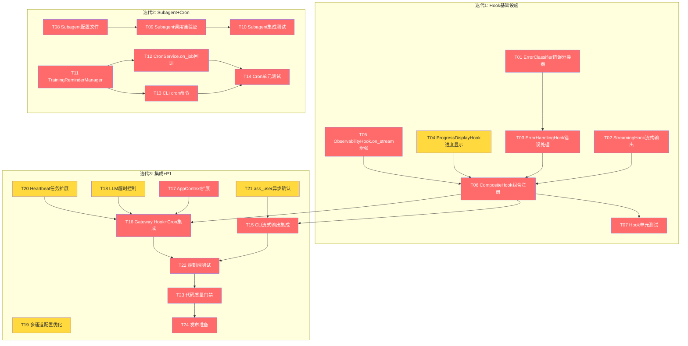

# v0.17.0 开发任务拆解清单 — 底座能力全面激活

> **文档版本**: v1.0
> **创建日期**: 2026-05-02
> **版本基线**: v0.16.1
> **目标版本**: v0.17.0
> **计划周期**: 3 周（2026-05-02 ~ 2026-05-20）
> **需求来源**: [PRD_v0.17.0](../requirements/PRD_v0.17.0_底座能力全面激活.md)
> **架构基线**: [v0.17.0_架构设计说明书 v1.1](../architecture/v0.17.0_架构设计说明书.md)

---

## 1. 任务总览

### 1.1 统计数据

| 指标 | 数值 |
|------|------|
| 任务总数 | 24 |
| P0 任务数 | 14 |
| P1 任务数 | 10 |
| 总工作量估算 | 96 小时 |
| P0 工作量 | 62 小时 |
| P1 工作量 | 34 小时 |

### 1.2 按模块分布

| 模块 | 任务数 | 工作量(h) |
|------|--------|----------|
| Hook 组合系统 | 7 | 28 |
| Subagent 架构 | 3 | 14 |
| Cron 训练提醒 | 5 | 20 |
| CLI/Gateway 集成 | 4 | 16 |
| 配置与超时 | 2 | 6 |
| Heartbeat 扩展 | 1 | 4 |
| ask_user 集成 | 1 | 4 |
| 测试与质量 | 1 | 4 |

---

## 2. 任务依赖关系图

---

## 3. 迭代计划

### 迭代1: Hook 基础设施（05.02 ~ 05.08）

**目标**: 完成 Hook 组合系统全部组件，为 CLI/Gateway 集成奠定基础

| 任务ID | 任务名称 | 优先级 | 工时 | 依赖 |
|--------|---------|--------|------|------|
| T01 | ErrorClassifier 错误分类器 | P0 | 4h | 无 |
| T02 | StreamingHook 流式输出 | P0 | 4h | 无 |
| T03 | ErrorHandlingHook 错误处理 | P0 | 3h | T01 |
| T04 | ProgressDisplayHook 进度显示 | P1 | 3h | 无 |
| T05 | ObservabilityHook.on_stream 增强 | P0 | 2h | 无 |
| T06 | CompositeHook 组合注册 | P0 | 2h | T02,T03,T04,T05 |
| T07 | Hook 单元测试 | P0 | 4h | T06 |

**迭代1准入**: 无（首个迭代）
**迭代1准出**: 4 个 Hook + ErrorClassifier 全部实现，单元测试覆盖率 ≥ 80%

### 迭代2: Subagent + Cron（05.09 ~ 05.15）

**目标**: 完成 Subagent 基础验证和 Cron 训练提醒深度集成

| 任务ID | 任务名称 | 优先级 | 工时 | 依赖 |
|--------|---------|--------|------|------|
| T08 | Subagent 配置文件 | P0 | 2h | 无 |
| T09 | Subagent 调用链验证 | P0 | 6h | T08 |
| T10 | Subagent 集成测试 | P0 | 4h | T09 |
| T11 | TrainingReminderManager | P0 | 6h | 无 |
| T12 | CronService.on_job 回调 | P0 | 3h | T11 |
| T13 | CLI cron 命令 | P0 | 4h | T11 |
| T14 | Cron 单元测试 | P0 | 4h | T12,T13 |

**迭代2准入**: 迭代1准出通过
**迭代2准出**: Subagent 调用链验证通过，Cron 训练提醒功能可用，单元测试覆盖率 ≥ 80%

### 迭代3: 集成 + P1 增强（05.16 ~ 05.20）

**目标**: 完成 CLI/Gateway 集成、P1 功能、端到端测试、发布

| 任务ID | 任务名称 | 优先级 | 工时 | 依赖 |
|--------|---------|--------|------|------|
| T15 | CLI 流式输出集成 | P0 | 4h | T06 |
| T16 | Gateway Hook+Cron 集成 | P0 | 4h | T06,T12,T17,T18 |
| T17 | AppContext 扩展 | P0 | 2h | T11 |
| T18 | LLM 超时控制 | P1 | 3h | 无 |
| T19 | 多通道配置优化 | P1 | 3h | 无 |
| T20 | Heartbeat 任务扩展 | P1 | 4h | 无 |
| T21 | ask_user 异步确认 | P1 | 4h | T15 |
| T22 | 端到端测试 | P0 | 4h | T15,T16 |
| T23 | 代码质量门禁 | P0 | 4h | T22 |
| T24 | 发布准备 | P0 | 2h | T23 |

**迭代3准入**: 迭代2准出通过
**迭代3准出**: P0 功能 100% 实现，P1 功能 ≥ 60%，ruff 零警告，mypy 零错误，无 P0/P1 Bug

---

## 4. 任务详细定义

### T01: ErrorClassifier 错误分类器

| 属性 | 值 |
|------|-----|
| **所属模块** | Hook 组合系统 |
| **需求ID** | REQ-0.17-04 |
| **优先级** | P0 |
| **预估工时** | 4h |
| **前置依赖** | 无 |
| **交付物** | `src/core/transparency/error_classifier.py` |

**任务描述**:

实现错误分类器，将原始异常分类为 6 种标准错误类型（NETWORK/DATA/CONFIG/PERMISSION/TIMEOUT/TOOL/UNKNOWN），生成友好提示和恢复建议。

**验收标准**:
- [ ] `ErrorCategory` 枚举定义 7 种错误类型
- [ ] `FriendlyError` 数据类包含 category/original_error/friendly_message/recovery_suggestion/context_data
- [ ] `classify()` 方法支持 `str | Exception` 输入
- [ ] `ERROR_PATTERNS` 覆盖项目自定义异常类（`src.core.base.exceptions`）
- [ ] 类型注解覆盖率 100%

---

### T02: StreamingHook 流式输出

| 属性 | 值 |
|------|-----|
| **所属模块** | Hook 组合系统 |
| **需求ID** | REQ-0.17-01 |
| **优先级** | P0 |
| **预估工时** | 4h |
| **前置依赖** | 无 |
| **交付物** | `src/core/transparency/streaming_hook.py` |

**任务描述**:

实现 StreamingHook，继承 AgentHook，实现 `wants_streaming()`/`on_stream()`/`on_stream_end()` 方法。支持 CLI（Rich Console.print）和 Gateway（MessageBus.publish_outbound）双通道输出。

**验收标准**:
- [ ] `wants_streaming()` 返回 `True`
- [ ] CLI 通道通过 `Console.print(delta, end="")` 逐片段输出
- [ ] Gateway 通道通过 `MessageBus.publish_outbound()` 推送流式片段
- [ ] 空 delta 过滤，不输出空字符串
- [ ] `on_stream_end` 处理流式结束（换行、状态清理）
- [ ] 构造函数接收 `console`/`bus`/`channel`/`chat_id` 参数

---

### T03: ErrorHandlingHook 错误处理

| 属性 | 值 |
|------|-----|
| **所属模块** | Hook 组合系统 |
| **需求ID** | REQ-0.17-04 |
| **优先级** | P0 |
| **预估工时** | 3h |
| **前置依赖** | T01 |
| **交付物** | `src/core/transparency/error_handling_hook.py` |

**任务描述**:

实现 ErrorHandlingHook，继承 AgentHook，通过 `after_iteration(context)` + `context.error` 捕获工具执行错误，调用 ErrorClassifier 分类并输出友好提示。

**验收标准**:
- [ ] `after_iteration` 检查 `context.error` 非空时触发错误处理
- [ ] 调用 `ErrorClassifier.classify()` 获取 `FriendlyError`
- [ ] 非 verbose 模式显示友好提示 + 恢复建议
- [ ] verbose 模式显示完整异常堆栈
- [ ] 错误上下文记录到 ObservabilityManager
- [ ] 不吞没异常，保留原始异常信息

---

### T04: ProgressDisplayHook 进度显示

| 属性 | 值 |
|------|-----|
| **所属模块** | Hook 组合系统 |
| **需求ID** | REQ-0.17-05 |
| **优先级** | P1 |
| **预估工时** | 3h |
| **前置依赖** | 无 |
| **交付物** | `src/core/transparency/progress_hook.py` |

**任务描述**:

实现 ProgressDisplayHook，在 `before_execute_tools` 显示工具调用开始，在 `after_iteration` 显示工具调用耗时。通过实例变量 `_tool_start_times` 传递计时数据。

**验收标准**:
- [ ] `before_execute_tools` 遍历 `context.tool_calls`，记录 `time.monotonic()` 到 `_tool_start_times`
- [ ] 显示格式: `🔧 正在调用: {tool_name} ...`
- [ ] `after_iteration` 计算耗时并清除 `_tool_start_times` 条目
- [ ] 显示格式: `✅ {tool_name} 完成，耗时 {elapsed}s`
- [ ] 多工具调用时依次显示进度，不互相覆盖

---

### T05: ObservabilityHook.on_stream 增强

| 属性 | 值 |
|------|-----|
| **所属模块** | Hook 组合系统 |
| **需求ID** | REQ-0.17-01 |
| **优先级** | P0 |
| **预估工时** | 2h |
| **前置依赖** | 无 |
| **交付物** | 修改 `src/core/transparency/hook_integration.py` |

**任务描述**:

增强现有 ObservabilityHook 的 `on_stream` 方法，从空实现改为记录流式事件到追踪日志。不改变现有 `before_iteration`/`after_iteration`/`finalize_content` 逻辑。

**验收标准**:
- [ ] `on_stream` 记录流式事件到 ObservabilityManager
- [ ] 事件类型为 `stream_delta`，包含 delta 内容和迭代序号
- [ ] 不影响现有追踪数据完整性
- [ ] `before_iteration`/`after_iteration`/`finalize_content` 逻辑不变

---

### T06: CompositeHook 组合注册

| 属性 | 值 |
|------|-----|
| **所属模块** | Hook 组合系统 |
| **需求ID** | REQ-0.17-01/04/05 |
| **优先级** | P0 |
| **预估工时** | 2h |
| **前置依赖** | T02, T03, T04, T05 |
| **交付物** | 修改 `src/core/transparency/__init__.py` |

**任务描述**:

在 transparency 模块 `__init__.py` 中导出新增 Hook 类，创建 `create_composite_hook()` 工厂函数，统一 Hook 组合注册逻辑。

**验收标准**:
- [ ] `__init__.py` 导出 StreamingHook/ErrorHandlingHook/ProgressDisplayHook/ErrorClassifier/FriendlyError/ErrorCategory
- [ ] `create_composite_hook()` 工厂函数接收 console/bus/observability_manager 等参数
- [ ] Hook 注册顺序: StreamingHook → ErrorHandlingHook → ProgressDisplayHook → ObservabilityHook
- [ ] 工厂函数返回 CompositeHook 实例

---

### T07: Hook 单元测试

| 属性 | 值 |
|------|-----|
| **所属模块** | Hook 组合系统 |
| **需求ID** | REQ-0.17-01/04/05 |
| **优先级** | P0 |
| **预估工时** | 4h |
| **前置依赖** | T06 |
| **交付物** | `tests/unit/test_streaming_hook.py`, `tests/unit/test_error_handling_hook.py`, `tests/unit/test_progress_hook.py`, `tests/unit/test_error_classifier.py` |

**任务描述**:

为 Hook 组合系统的 4 个 Hook + ErrorClassifier 编写单元测试。使用 `unittest.mock.AsyncMock` 模拟 `AgentHookContext`。

**验收标准**:
- [ ] StreamingHook: CLI 通道流式输出、Gateway 通道消息推送、空 delta 过滤
- [ ] ErrorHandlingHook: 各类错误分类、verbose 模式堆栈输出、友好提示生成
- [ ] ProgressDisplayHook: 计时准确性、多工具调用进度显示
- [ ] ErrorClassifier: 7 种错误类型分类、自定义异常识别
- [ ] 覆盖率 ≥ 80%

---

### T08: Subagent 配置文件

| 属性 | 值 |
|------|-----|
| **所属模块** | Subagent 架构 |
| **需求ID** | REQ-0.17-02 |
| **优先级** | P0 |
| **预估工时** | 2h |
| **前置依赖** | 无 |
| **交付物** | `workspace/agents/data_analyst.md`, `workspace/agents/report_writer.md` |

**任务描述**:

创建 DataAnalystAgent 和 ReportWriterAgent 的配置文件，遵循 nanobot-ai Subagent 配置规范。配置文件中明确说明 Subagent 无法直接查询数据库，需基于传入数据上下文工作。

**验收标准**:
- [ ] `data_analyst.md` 定义数据分析专家角色和职责
- [ ] `report_writer.md` 定义报告撰写专家角色和职责
- [ ] 配置文件包含"无法直接查询数据库"的约束说明
- [ ] 配置文件格式符合 nanobot-ai 规范

---

### T09: Subagent 调用链验证

| 属性 | 值 |
|------|-----|
| **所属模块** | Subagent 架构 |
| **需求ID** | REQ-0.17-02 |
| **优先级** | P0 |
| **预估工时** | 6h |
| **前置依赖** | T08 |
| **交付物** | 修改 `src/agents/tools.py` 或新增 Subagent 调用辅助逻辑 |

**任务描述**:

验证主 Agent 通过 SpawnTool 调用 Subagent 的完整调用链。实现"主 Agent 预查询 + 数据上下文传入"模式：主 Agent 在 spawn 前通过 RunnerTools 查询数据，将序列化结果嵌入 task 参数传入 Subagent。

**验收标准**:
- [ ] 主 Agent 能成功调用 DataAnalystAgent 并获取数据分析结果
- [ ] 主 Agent 能成功调用 ReportWriterAgent 并获取报告生成结果
- [ ] 数据上下文传递格式: `{user_request}\n---数据上下文---\n{serialized_data}\n---数据上下文结束---`
- [ ] 数据上下文大小控制: task 参数总长度 ≤ 8000 字符
- [ ] Subagent 调用失败时主 Agent 有降级处理
- [ ] 调用链: 主 Agent → SpawnTool → SubagentManager → 结果注入 → 主 Agent 整合

---

### T10: Subagent 集成测试

| 属性 | 值 |
|------|-----|
| **所属模块** | Subagent 架构 |
| **需求ID** | REQ-0.17-02 |
| **优先级** | P0 |
| **预估工时** | 4h |
| **前置依赖** | T09 |
| **交付物** | `tests/integration/test_subagent.py` |

**任务描述**:

编写 Subagent 集成测试，验证调用链完整性。使用真实底座组件（AgentLoop/SubagentManager），Mock LLM Provider。

**验收标准**:
- [ ] 基础调用链测试: 主 Agent → SpawnTool → SubagentManager → 结果注入
- [ ] 数据上下文传递测试: task 参数中包含预查询数据
- [ ] 降级策略测试: Subagent 超时后主 Agent 降级
- [ ] 配置文件加载测试: workspace/agents/*.md 正确加载
- [ ] 覆盖率 ≥ 70%

---

### T11: TrainingReminderManager

| 属性 | 值 |
|------|-----|
| **所属模块** | Cron 训练提醒 |
| **需求ID** | REQ-0.17-03 |
| **优先级** | P0 |
| **预估工时** | 6h |
| **前置依赖** | 无 |
| **交付物** | `src/core/cron/training_reminder.py`, `src/core/cron/__init__.py` |

**任务描述**:

创建 `src/core/cron/` 模块，实现 TrainingReminderManager，封装训练相关的 Cron 任务管理。支持每日训练提醒、赛前倒计时提醒、周期性报告推送。

**验收标准**:
- [ ] `register_daily_reminder(time_str, timezone)` 注册每日训练提醒
- [ ] `register_race_countdown(race_date, race_name)` 注册赛前 7/3/1 天提醒
- [ ] `register_weekly_report(day_of_week, time_str)` 注册周报推送
- [ ] `register_monthly_report(day_of_month, time_str)` 注册月报推送
- [ ] `list_reminders()` 列出所有训练提醒
- [ ] `remove_reminder(job_id)` 删除指定提醒
- [ ] 并发任务数 ≤ 5

---

### T12: CronService.on_job 回调

| 属性 | 值 |
|------|-----|
| **所属模块** | Cron 训练提醒 |
| **需求ID** | REQ-0.17-03 |
| **优先级** | P0 |
| **预估工时** | 3h |
| **前置依赖** | T11 |
| **交付物** | 修改 `src/cli/commands/gateway.py` |

**任务描述**:

在 Gateway 启动时设置 `cron.on_job` 回调，将 CronService 触发的任务转发给 AgentLoop 处理。回调封装为 `_on_cron_job(job)` 异步函数，调用 `agent.process_direct(job.payload.message)`。

**验收标准**:
- [ ] `_on_cron_job(job)` 异步回调函数实现
- [ ] Gateway 启动时设置 `cron.on_job = _on_cron_job`
- [ ] Cron 任务触发后 Agent 通过 process_direct 执行
- [ ] 并发 Cron 任务争抢 LLM 资源时有日志警告
- [ ] 回调异常不中断其他 Cron 任务

---

### T13: CLI cron 命令

| 属性 | 值 |
|------|-----|
| **所属模块** | Cron 训练提醒 |
| **需求ID** | REQ-0.17-03 |
| **优先级** | P0 |
| **预估工时** | 4h |
| **前置依赖** | T11 |
| **交付物** | `src/cli/commands/cron.py`, 修改 `src/cli/app.py` 和 `src/cli/commands/__init__.py` |

**任务描述**:

创建 CLI cron 命令组，支持查看/添加/删除/启用/禁用 Cron 任务，以及训练提醒和赛前倒计时的快捷命令。

**验收标准**:
- [ ] `nanobotrun cron list [--all]` 查看所有定时任务
- [ ] `nanobotrun cron add --name --message --every/--cron/--at` 添加定时任务
- [ ] `nanobotrun cron remove <job_id>` 删除定时任务
- [ ] `nanobotrun cron enable <job_id>` / `disable <job_id>` 启用/禁用
- [ ] `nanobotrun cron reminder add --time --timezone` 添加训练提醒
- [ ] `nanobotrun cron reminder race --date --name` 添加赛前倒计时
- [ ] `app.py` 注册 cron 命令组

---

### T14: Cron 单元测试

| 属性 | 值 |
|------|-----|
| **所属模块** | Cron 训练提醒 |
| **需求ID** | REQ-0.17-03 |
| **优先级** | P0 |
| **预估工时** | 4h |
| **前置依赖** | T12, T13 |
| **交付物** | `tests/unit/test_training_reminder.py`, `tests/unit/test_cron_commands.py` |

**任务描述**:

为 TrainingReminderManager 和 CLI cron 命令编写单元测试。使用 `croniter` 模拟定时触发，使用 `typer.testing.CliRunner` 测试 CLI 命令。

**验收标准**:
- [ ] TrainingReminderManager: 任务注册幂等性、回调触发、任务持久化
- [ ] CLI cron 命令: add/remove/list/enable/disable 命令测试
- [ ] 覆盖率 ≥ 80%

---

### T15: CLI 流式输出集成

| 属性 | 值 |
|------|-----|
| **所属模块** | CLI/Gateway 集成 |
| **需求ID** | REQ-0.17-01 |
| **优先级** | P0 |
| **预估工时** | 4h |
| **前置依赖** | T06 |
| **交付物** | 修改 `src/cli/commands/agent.py` |

**任务描述**:

修改 CLI agent chat 命令，将 `console.status("思考中...")` 阻塞等待替换为流式输出。传入 `on_stream` 回调到 `process_direct`，注册 CompositeHook 到 AgentLoop。

**验收标准**:
- [ ] 移除 `console.status("思考中...")` 阻塞等待
- [ ] 传入 `on_stream` 回调到 `agent.process_direct()`
- [ ] 注册 CompositeHook 到 AgentLoop（通过 `hooks=[composite]` 参数）
- [ ] 流式输出首字延迟 < 3 秒
- [ ] Ctrl+C 中断时优雅终止，不产生异常堆栈
- [ ] 流式输出与 ObservabilityHook 透明化追踪兼容

---

### T16: Gateway Hook+Cron 集成

| 属性 | 值 |
|------|-----|
| **所属模块** | CLI/Gateway 集成 |
| **需求ID** | REQ-0.17-01/03 |
| **优先级** | P0 |
| **预估工时** | 4h |
| **前置依赖** | T06, T12, T17, T18 |
| **交付物** | 修改 `src/cli/commands/gateway.py` |

**任务描述**:

修改 Gateway 启动流程，注册 CompositeHook 到 AgentLoop，传入 CronService 到 AgentLoop，设置 on_job 回调，集成 HeartbeatService。

**验收标准**:
- [ ] AgentLoop 构造时传入 `hooks=[composite]`
- [ ] AgentLoop 构造时传入 `cron_service=cron`
- [ ] `cron.on_job = _on_cron_job` 回调设置
- [ ] HeartbeatService 的 `on_execute` 回调连接到 AgentLoop
- [ ] 现有功能（MCP 工具、命令路由）不受影响

---

### T17: AppContext 扩展

| 属性 | 值 |
|------|-----|
| **所属模块** | CLI/Gateway 集成 |
| **需求ID** | REQ-0.17-03 |
| **优先级** | P0 |
| **预估工时** | 2h |
| **前置依赖** | T11 |
| **交付物** | 修改 `src/core/base/context.py` |

**任务描述**:

在 AppContext 中增加 TrainingReminderManager 懒加载属性，供 CLI cron 命令和 Gateway 使用。

**验收标准**:
- [ ] AppContext 新增 `training_reminder_manager` 属性
- [ ] 懒加载模式：首次访问时创建实例
- [ ] 使用 `set_extension`/`get_extension` 扩展机制
- [ ] 不破坏现有 AppContext 属性

---

### T18: LLM 超时控制

| 属性 | 值 |
|------|-----|
| **所属模块** | 配置与超时 |
| **需求ID** | REQ-0.17-08 |
| **优先级** | P1 |
| **预估工时** | 3h |
| **前置依赖** | 无 |
| **交付物** | 修改 `src/core/config/manager.py`, `src/core/provider_adapter.py` |

**任务描述**:

在项目配置中暴露 `NANOBOT_LLM_TIMEOUT_S` 和 `NANOBOT_LLM_RETRY_COUNT` 环境变量，设置默认值（60s/2次），在 RunnerProviderAdapter 中应用超时配置。

**验收标准**:
- [ ] `NANOBOT_LLM_TIMEOUT_S` 环境变量生效，默认 60 秒
- [ ] `NANOBOT_LLM_RETRY_COUNT` 环境变量生效，默认 2 次
- [ ] 超时后请求终止
- [ ] 超时后自动重试，最多 2 次
- [ ] 重试全部失败后友好提示

---

### T19: 多通道配置优化

| 属性 | 值 |
|------|-----|
| **所属模块** | 配置与超时 |
| **需求ID** | REQ-0.17-09 |
| **优先级** | P1 |
| **预估工时** | 3h |
| **前置依赖** | 无 |
| **交付物** | 修改 `src/core/init/wizard.py`, `src/cli/commands/system.py` |

**任务描述**:

优化 `nanobotrun system init` 命令，整合通道配置流程，提供配置模板和配置验证。

**验收标准**:
- [ ] `system init` 中整合通道配置
- [ ] 提供常见通道配置模板
- [ ] 启动时自动验证通道配置完整性
- [ ] 配置错误时提供修复建议

---

### T20: Heartbeat 任务扩展

| 属性 | 值 |
|------|-----|
| **所属模块** | Heartbeat 扩展 |
| **需求ID** | REQ-0.17-06 |
| **优先级** | P1 |
| **预估工时** | 4h |
| **前置依赖** | 无 |
| **交付物** | `workspace/HEARTBEAT.md`, 修改 `src/cli/commands/gateway.py` |

**任务描述**:

创建 HEARTBEAT.md 任务模板，将 HeartbeatService 的 `on_execute` 回调连接到 AgentLoop，使心跳检测能触发 Agent 执行任务。

**验收标准**:
- [ ] `workspace/HEARTBEAT.md` 定义每日检查和周期检查任务
- [ ] HeartbeatService `on_execute` 回调连接到 `agent.process_direct()`
- [ ] 任务执行结果通过 MessageBus 推送到已启用通道
- [ ] 首次启动时自动创建默认 HEARTBEAT.md

---

### T21: ask_user 异步确认

| 属性 | 值 |
|------|-----|
| **所属模块** | ask_user 集成 |
| **需求ID** | REQ-0.17-07 |
| **优先级** | P1 |
| **预估工时** | 4h |
| **前置依赖** | T15 |
| **交付物** | 修改 Agent 系统提示词或工具描述 |

**任务描述**:

实现 ask_user 异步确认模式。Agent 通过 `send_message` 工具输出确认提示，用户在下一轮对话中确认。不实现同步阻塞模式（底座不支持）。

**验收标准**:
- [ ] Agent 在训练计划确认场景输出结构化选项 + 确认提示
- [ ] RPE 反馈场景输出 1-10 分选择提示
- [ ] 伤病风险调整场景输出调整建议 + 确认提示
- [ ] CLI 模式下降级为文本输入选择
- [ ] 文档中标注为"实验性功能"

---

### T22: 端到端测试

| 属性 | 值 |
|------|-----|
| **所属模块** | 测试与质量 |
| **需求ID** | REQ-0.17-01/02/03/04 |
| **优先级** | P0 |
| **预估工时** | 4h |
| **前置依赖** | T15, T16 |
| **交付物** | `tests/e2e/test_v017.py` |

**任务描述**:

编写端到端测试，验证 v0.17.0 核心功能的完整用户场景。

**验收标准**:
- [ ] CLI 流式输出场景: 用户消息 → 实时流式显示
- [ ] 错误友好提示场景: 触发网络错误 → 显示友好提示
- [ ] Cron 训练提醒场景: 定时任务到期 → Agent 处理并推送
- [ ] Subagent 数据分析场景: "分析 VDOT 趋势" → 预查询 → Subagent 分析 → 整合输出

---

### T23: 代码质量门禁

| 属性 | 值 |
|------|-----|
| **所属模块** | 测试与质量 |
| **需求ID** | 全部 |
| **优先级** | P0 |
| **预估工时** | 4h |
| **前置依赖** | T22 |
| **交付物** | 质量报告 |

**任务描述**:

执行代码质量检查，确保满足准出标准。

**验收标准**:
- [ ] `ruff check src/ tests/` 零警告
- [ ] `ruff format src/ tests/` 格式统一
- [ ] `mypy src/ --ignore-missing-imports` 零错误
- [ ] 核心模块单元测试覆盖率 ≥ 80%
- [ ] agents 模块覆盖率 ≥ 70%
- [ ] cli 模块覆盖率 ≥ 60%

---

### T24: 发布准备

| 属性 | 值 |
|------|-----|
| **所属模块** | 测试与质量 |
| **需求ID** | 全部 |
| **优先级** | P0 |
| **预估工时** | 2h |
| **前置依赖** | T23 |
| **交付物** | 版本号更新、CHANGELOG |

**任务描述**:

完成发布前的收尾工作：更新版本号、编写 CHANGELOG、确认升级路径。

**验收标准**:
- [ ] 版本号更新为 v0.17.0
- [ ] CHANGELOG 记录所有变更
- [ ] 升级路径文档: `nanobotrun system init` → `nanobotrun agent chat` → `nanobotrun gateway start`
- [ ] 无 P0/P1 级 Bug

---

## 5. 风险标注

| 任务ID | 风险等级 | 风险描述 | 缓解措施 |
|--------|---------|---------|---------|
| T09 | 🔴 高 | Subagent 调用链复杂，底座 API 行为可能与预期不符 | 先用最小示例验证 SpawnTool 调用，再逐步扩展 |
| T12 | 🟡 中 | CronService.on_job 回调行为需验证 | 阅读底座源码确认回调签名和异常处理 |
| T15 | 🟡 中 | 流式输出与 Rich Console Status 冲突 | 移除 console.status，改用纯 console.print |
| T16 | 🟡 中 | Gateway 集成涉及多组件协调 | 逐步集成，每步验证 |
| T21 | 🟡 中 | ask_user 异步模式体验较差 | 标注为实验性功能，预留升级路径 |

---

## 6. 并行任务分析

以下任务之间无依赖关系，可并行执行：

**迭代1并行组**:
- T01（ErrorClassifier）+ T02（StreamingHook）+ T04（ProgressDisplayHook）+ T05（ObservabilityHook增强）

**迭代2并行组**:
- T08/T09/T10（Subagent 链路） ‖ T11/T12/T13/T14（Cron 链路）

**迭代3并行组**:
- T18（LLM超时）+ T19（多通道配置）+ T20（Heartbeat扩展） ‖ T15/T16（集成）

---

*本文档基于 [v0.17.0_架构设计说明书 v1.1](../architecture/v0.17.0_架构设计说明书.md) 拆解，确保任务与架构设计完全一致*
