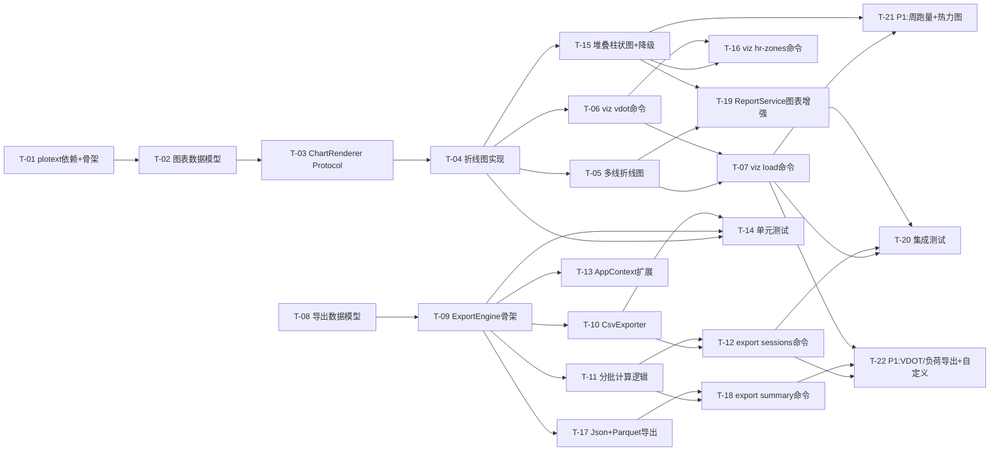

# v0.18.0 开发任务拆解清单

> **文档版本**: v1.0
> **拆解日期**: 2026-05-03
> **版本基线**: v0.17.0
> **需求来源**: [PRD_v0.18.0_数据可视化与导出](../requirements/PRD_v0.18.0_数据可视化与导出.md) v1.1
> **架构基线**: [架构设计_v0.18.0](../architecture/架构设计_v0.18.0_数据可视化与导出.md) v1.1
> **评审基线**: [架构评审报告_v0.18.0](../architecture/review/架构评审报告_v0.18.0.md) v1.0

---

## 1. 任务总览

| 统计项 | 数值 |
|--------|------|
| **任务总数** | 22 |
| **P0 任务数** | 14 |
| **P1 任务数** | 8 |
| **P0 总工时** | 56h |
| **P1 总工时** | 32h |
| **合计工时** | 88h（约 11 人天） |
| **迭代周期** | 2 个 Sprint（每 Sprint 2 周） |

---

## 2. 迭代计划

### Sprint 1（第 1-2 周）：基础设施 + 可视化核心

**交付目标**: visualization 模块骨架 + VDOT/训练负荷图表 + 导出引擎骨架 + 训练记录导出

| 任务ID | 任务名称 | 优先级 | 工时 |
|--------|---------|--------|------|
| T-01 | 新增 plotext 依赖 + visualization 模块骨架 | P0 | 2h |
| T-02 | 图表数据模型（ChartData/ChartConfig/DataSeries） | P0 | 2h |
| T-03 | ChartRenderer Protocol 定义 | P0 | 1h |
| T-04 | PlotextRenderer 折线图实现 | P0 | 4h |
| T-05 | PlotextRenderer 多线折线图实现 | P0 | 3h |
| T-06 | VizHandler + viz vdot 命令 | P0 | 4h |
| T-07 | VizHandler + viz load 命令 | P0 | 4h |
| T-08 | 导出数据模型（ExportConfig/ExportResult） | P0 | 2h |
| T-09 | DataExporter Protocol + ExportEngine 骨架 | P0 | 3h |
| T-10 | CsvExporter 实现 | P0 | 3h |
| T-11 | ExportEngine._prepare_session_data 分批计算 | P0 | 4h |
| T-12 | ExportHandler + export sessions 命令 | P0 | 4h |
| T-13 | AppContext 扩展 + CLI 命令注册 | P0 | 2h |
| T-14 | visualization/export 模块单元测试 | P0 | 6h |

**Sprint 1 工时**: 44h

### Sprint 2（第 3-4 周）：P0 收尾 + P1 功能

**交付目标**: 心率区间图 + 摘要导出 + 报告增强 + P1 功能

| 任务ID | 任务名称 | 优先级 | 工时 |
|--------|---------|--------|------|
| T-15 | PlotextRenderer 堆叠柱状图（含降级） | P0 | 4h |
| T-16 | VizHandler + viz hr-zones 命令 | P0 | 4h |
| T-17 | JsonExporter + ParquetExporter 实现 | P0 | 4h |
| T-18 | ExportEngine._prepare_summary_data + export summary 命令 | P0 | 4h |
| T-19 | ReportService 图表增强改造 | P0 | 6h |
| T-20 | 集成测试 + Windows 终端兼容性验证 | P0 | 6h |
| T-21 | P1 功能：周跑量趋势图 + 配速热力图 | P1 | 8h |
| T-22 | P1 功能：VDOT/负荷导出 + 自定义可视化 | P1 | 10h |

**Sprint 2 工时**: 46h

---

## 3. 任务详细定义

### 3.1 Sprint 1 任务

---

#### T-01: 新增 plotext 依赖 + visualization 模块骨架

| 属性 | 值 |
|------|-----|
| **所属模块** | core/visualization |
| **优先级** | P0 |
| **前置依赖** | 无 |
| **预估工时** | 2h |
| **对应需求** | 基础设施 |

**任务描述**:
- 在 `pyproject.toml` 中添加 `plotext>=5.0` 依赖
- 创建 `src/core/visualization/` 目录及 `__init__.py`
- 验证 plotext 在 Windows Terminal/PowerShell 下的基本渲染能力

**交付物**:
- `pyproject.toml` 更新（新增 plotext 依赖）
- `src/core/visualization/__init__.py`
- plotext 基础渲染验证脚本

**验收标准**:
- [ ] `uv run python -c "import plotext"` 无报错
- [ ] plotext 折线图在 Windows Terminal 下正常渲染
- [ ] visualization 模块可被正常 import

---

#### T-02: 图表数据模型（ChartData/ChartConfig/DataSeries）

| 属性 | 值 |
|------|-----|
| **所属模块** | core/visualization |
| **优先级** | P0 |
| **前置依赖** | T-01 |
| **预估工时** | 2h |
| **对应需求** | REQ-0.18-01/02/03/07 |

**任务描述**:
- 实现 `src/core/visualization/models.py`
- 定义 `DataSeries`、`ChartData`、`ChartConfig` 三个 frozen dataclass
- 严格遵循架构设计 §4.2 的数据模型定义

**交付物**:
- `src/core/visualization/models.py`

**验收标准**:
- [ ] DataSeries/ChartData/ChartConfig 均为 frozen dataclass
- [ ] 类型注解完整，mypy 检查通过
- [ ] ChartData 支持多 series（多线折线图场景）

---

#### T-03: ChartRenderer Protocol 定义

| 属性 | 值 |
|------|-----|
| **所属模块** | core/visualization |
| **优先级** | P0 |
| **前置依赖** | T-02 |
| **预估工时** | 1h |
| **对应需求** | REQ-0.18-01/02/03/07 |

**任务描述**:
- 实现 `src/core/visualization/renderer.py`
- 定义 `ChartRenderer` Protocol（runtime_checkable）
- 包含 `render_line_chart`、`render_multi_line_chart`、`render_bar_chart`、`render_stacked_bar_chart` 四个方法
- `render_stacked_bar_chart` 注释明确降级行为：不应抛异常，应返回 Rich Table 文本

**交付物**:
- `src/core/visualization/renderer.py`

**验收标准**:
- [ ] ChartRenderer 为 `@runtime_checkable` Protocol
- [ ] 四个渲染方法签名与架构设计 §4.1 一致
- [ ] `render_stacked_bar_chart` docstring 包含降级说明

---

#### T-04: PlotextRenderer 折线图实现

| 属性 | 值 |
|------|-----|
| **所属模块** | core/visualization |
| **优先级** | P0 |
| **前置依赖** | T-03 |
| **预估工时** | 4h |
| **对应需求** | REQ-0.18-01 |

**任务描述**:
- 实现 `src/core/visualization/plotext_renderer.py`
- 实现 `render_line_chart` 方法：使用 `plotext.plot()` 渲染单线折线图
- 实现 `render_bar_chart` 方法：使用 `plotext.bar()` 渲染柱状图
- 终端宽度自适应：检测 `shutil.get_terminal_size()`
- 极值标注：最高/最低值标注
- 使用 `plt.build()` 返回字符串，统一通过 Rich Console 输出

**交付物**:
- `src/core/visualization/plotext_renderer.py`

**验收标准**:
- [ ] render_line_chart 返回可被 console.print() 输出的字符串
- [ ] 图表宽度自适应终端（60-120 列范围）
- [ ] 最高/最低值有标注
- [ ] 无数据时返回"暂无数据"文本

---

#### T-05: PlotextRenderer 多线折线图实现

| 属性 | 值 |
|------|-----|
| **所属模块** | core/visualization |
| **优先级** | P0 |
| **前置依赖** | T-04 |
| **预估工时** | 3h |
| **对应需求** | REQ-0.18-02 |

**任务描述**:
- 在 `PlotextRenderer` 中实现 `render_multi_line_chart` 方法
- 多次调用 `plotext.plot()` 绘制多条曲线
- 不同颜色/线型区分各系列
- 图例标注各系列含义

**交付物**:
- `plotext_renderer.py` 新增 `render_multi_line_chart` 方法

**验收标准**:
- [ ] CTL/ATL/TSB 三条曲线颜色可区分（CTL 蓝、ATL 红、TSB 绿）
- [ ] 图例清晰标注各系列含义
- [ ] TSB 正负区域视觉区分（`+`/`-` 符号填充或颜色区分）

---

#### T-06: VizHandler + viz vdot 命令

| 属性 | 值 |
|------|-----|
| **所属模块** | cli/handlers + cli/commands |
| **优先级** | P0 |
| **前置依赖** | T-04 |
| **预估工时** | 4h |
| **对应需求** | REQ-0.18-01 |

**任务描述**:
- 实现 `src/cli/handlers/viz_handler.py`
  - `handle_vdot(days)` 方法：调用 `analytics.get_vdot_trend(days)` 获取数据
  - 将 `List[VdotTrendItem]` 转换为 `ChartData`
  - 调用 `chart_renderer.render_line_chart()` 渲染
  - 实现 `_render_with_fallback()` 降级策略
- 实现 `src/cli/commands/viz.py`
  - `vdot` 命令：支持 `--days 7/30/90/365` 参数
- 通过 `get_context()` 获取 AppContext 依赖注入

**交付物**:
- `src/cli/handlers/viz_handler.py`
- `src/cli/commands/viz.py`

**验收标准**:
- [ ] `viz vdot --days 90` 输出 VDOT 趋势折线图
- [ ] 支持 `--days 7/30/90/365` 参数
- [ ] 渲染失败时降级为纯文字表格
- [ ] 通过 AppContext 获取依赖，不直接实例化核心组件

---

#### T-07: VizHandler + viz load 命令

| 属性 | 值 |
|------|-----|
| **所属模块** | cli/handlers + cli/commands |
| **优先级** | P0 |
| **前置依赖** | T-05, T-06 |
| **预估工时** | 4h |
| **对应需求** | REQ-0.18-02 |

**任务描述**:
- 在 `VizHandler` 中实现 `handle_load(days)` 方法
  - 调用 `analytics.get_training_load_trend(days=days)` 获取数据
  - 将返回的 `dict` 中 `trend_data` 转换为 `ChartData`（CTL/ATL/TSB 三个 DataSeries）
  - 调用 `chart_renderer.render_multi_line_chart()` 渲染
- 在 `viz.py` 中添加 `load` 命令：支持 `--days 30/90/180` 参数

**交付物**:
- `viz_handler.py` 新增 `handle_load` 方法
- `viz.py` 新增 `load` 命令

**验收标准**:
- [ ] `viz load --days 90` 输出 CTL/ATL/TSB 三线折线图
- [ ] 三条曲线颜色可区分
- [ ] 数据点与 `analytics.get_training_load_trend()` 返回结果一致
- [ ] 无数据时显示"该时间段无训练负荷数据"提示

---

#### T-08: 导出数据模型（ExportConfig/ExportResult）

| 属性 | 值 |
|------|-----|
| **所属模块** | core/export |
| **优先级** | P0 |
| **前置依赖** | 无（可与 T-01~T-05 并行） |
| **预估工时** | 2h |
| **对应需求** | REQ-0.18-04/05 |

**任务描述**:
- 创建 `src/core/export/` 目录及 `__init__.py`
- 实现 `src/core/export/models.py`
- 定义 `ExportConfig`、`ExportResult` 两个 frozen dataclass

**交付物**:
- `src/core/export/__init__.py`
- `src/core/export/models.py`

**验收标准**:
- [ ] ExportConfig/ExportResult 均为 frozen dataclass
- [ ] 类型注解完整，mypy 检查通过
- [ ] ExportConfig 包含 output_path/start_date/end_date/include_computed_fields/encoding 字段

---

#### T-09: DataExporter Protocol + ExportEngine 骨架

| 属性 | 值 |
|------|-----|
| **所属模块** | core/export |
| **优先级** | P0 |
| **前置依赖** | T-08 |
| **预估工时** | 3h |
| **对应需求** | REQ-0.18-04/05 |

**任务描述**:
- 实现 `src/core/export/engine.py`
- 定义 `DataExporter` Protocol（runtime_checkable）：`format_name` 属性 + `export()` + `validate_output_path()` 方法
- 实现 `ExportEngine` 类骨架：
  - 构造函数接收 `storage: StorageManager` + `analytics: AnalyticsEngine`
  - `_register_default_exporters()` 注册 CSV/JSON/Parquet 导出器
  - `get_exporter(format_name)` 获取导出器
  - `export_sessions()` / `export_summary()` 方法签名（暂不实现逻辑）
  - `_validate_path()` 路径安全校验

**交付物**:
- `src/core/export/engine.py`

**验收标准**:
- [ ] DataExporter 为 `@runtime_checkable` Protocol
- [ ] ExportEngine 构造函数参数为 `storage` + `analytics`（非 `session_repo`）
- [ ] `_validate_path()` 拒绝 `../` 路径穿越
- [ ] `get_exporter("csv")` 返回 CsvExporter 实例

---

#### T-10: CsvExporter 实现

| 属性 | 值 |
|------|-----|
| **所属模块** | core/export |
| **优先级** | P0 |
| **前置依赖** | T-09 |
| **预估工时** | 3h |
| **对应需求** | REQ-0.18-04 |

**任务描述**:
- 实现 `src/core/export/csv_exporter.py`
- `format_name` 返回 `"csv"`
- `export()`: 将 dict 数据写入 CSV 文件
  - UTF-8 BOM 编码（Excel 兼容）
  - 字段白名单过滤（不导出内部指纹等字段）
  - 文件权限设置（仅当前用户可读写）
- `validate_output_path()`: 校验路径安全性

**交付物**:
- `src/core/export/csv_exporter.py`

**验收标准**:
- [ ] CSV 文件可被 `pandas.read_csv()` 正常读取，无编码问题
- [ ] CSV 使用 UTF-8 BOM 编码
- [ ] 导出文件默认权限仅当前用户可读写
- [ ] 路径穿越攻击被拒绝

---

#### T-11: ExportEngine._prepare_session_data 分批计算

| 属性 | 值 |
|------|-----|
| **所属模块** | core/export |
| **优先级** | P0 |
| **前置依赖** | T-09 |
| **预估工时** | 4h |
| **对应需求** | REQ-0.18-04 |

**任务描述**:
- 实现 `ExportEngine._prepare_session_data()` 方法
- 通过 `self.storage.query_by_date_range(start_date, end_date)` 获取原始 dict 记录
- 保留 Parquet 原始列名（`session_total_distance`/`session_total_timer_time`/`session_avg_heart_rate`）
- 分批计算 TSS/VDOT（BATCH_SIZE=100）
- 实现 `ExportEngine.export_sessions()` 完整逻辑

**交付物**:
- `engine.py` 新增 `_prepare_session_data` + `export_sessions` 实现

**验收标准**:
- [ ] 使用 `self.storage.query_by_date_range()`（非 `self.session_repo`）
- [ ] 分批计算 TSS/VDOT，每批 100 条
- [ ] 日期范围筛选边界正确（包含 start，包含 end 当天）
- [ ] 无数据时返回空列表

---

#### T-12: ExportHandler + export sessions 命令

| 属性 | 值 |
|------|-----|
| **所属模块** | cli/handlers + cli/commands |
| **优先级** | P0 |
| **前置依赖** | T-10, T-11 |
| **预估工时** | 4h |
| **对应需求** | REQ-0.18-04 |

**任务描述**:
- 实现 `src/cli/handlers/export_handler.py`
  - `handle_export_sessions(config)` 方法
  - 调用 `export_engine.export_sessions(config, format_name)`
  - 输出导出结果（成功/失败/记录数/耗时）
- 实现 `src/cli/commands/export.py`
  - `sessions` 命令：支持 `--start`/`--end`/`--format csv|json|parquet`/`--output` 参数

**交付物**:
- `src/cli/handlers/export_handler.py`
- `src/cli/commands/export.py`

**验收标准**:
- [ ] `export sessions --format csv --output ./data.csv` 正常导出
- [ ] 支持 `--start`/`--end` 日期范围筛选
- [ ] 支持 `--format csv/json/parquet` 三种格式
- [ ] `--output` 为必填参数
- [ ] 导出完成后输出记录数和耗时

---

#### T-13: AppContext 扩展 + CLI 命令注册

| 属性 | 值 |
|------|-----|
| **所属模块** | core/base + cli |
| **优先级** | P0 |
| **前置依赖** | T-09 |
| **预估工时** | 2h |
| **对应需求** | 基础设施 |

**任务描述**:
- 在 `context.py` 中新增 `chart_renderer` 和 `export_engine` 两个 `@property` 懒加载属性
- 在 `app.py` 中注册 `viz_app` 和 `export_app`
- 在 `src/cli/commands/__init__.py` 中新增 `viz_app` 和 `export_app` 导出

**交付物**:
- `context.py` 新增两个 property
- `app.py` 新增命令注册
- `__init__.py` 新增导出

**验收标准**:
- [ ] `context.chart_renderer` 返回 PlotextRenderer 实例
- [ ] `context.export_engine` 返回 ExportEngine 实例
- [ ] `nanobotrun viz --help` 和 `nanobotrun export --help` 正常显示
- [ ] 懒加载模式与现有 `training_reminder_manager` 一致

---

#### T-14: visualization/export 模块单元测试

| 属性 | 值 |
|------|-----|
| **所属模块** | tests/unit |
| **优先级** | P0 |
| **前置依赖** | T-04, T-09, T-10 |
| **预估工时** | 6h |
| **对应需求** | 质量门禁 |

**任务描述**:
- 实现 `tests/unit/test_viz_models.py`：ChartData/ChartConfig 数据模型测试
- 实现 `tests/unit/test_renderer.py`：ChartRenderer Protocol 合规性测试
- 实现 `tests/unit/test_plotext_renderer.py`：各图表类型渲染测试
- 实现 `tests/unit/test_export_engine.py`：导出流程/路径校验测试
- 实现 `tests/unit/test_csv_exporter.py`：CSV 格式/编码/BOM 测试
- Mock AnalyticsEngine 和 StorageManager，禁止 Mock ChartRenderer/DataExporter

**交付物**:
- 5 个单元测试文件

**验收标准**:
- [ ] `core/visualization/` 覆盖率 ≥ 80%
- [ ] `core/export/` 覆盖率 ≥ 80%
- [ ] 所有测试通过 `uv run pytest tests/unit/`

---

### 3.2 Sprint 2 任务

---

#### T-15: PlotextRenderer 堆叠柱状图（含降级）

| 属性 | 值 |
|------|-----|
| **所属模块** | core/visualization |
| **优先级** | P0 |
| **前置依赖** | T-04 |
| **预估工时** | 4h |
| **对应需求** | REQ-0.18-03 |

**任务描述**:
- 在 `PlotextRenderer` 中实现 `render_stacked_bar_chart` 方法
- 尝试使用 `plotext.bar()` + 手动堆叠实现
- 若 plotext 不支持，降级为 `_fallback_stacked_bar_as_table()`：使用 Rich Table 百分比展示
- 降级时不应抛出异常，返回 Rich Table 格式文本

**交付物**:
- `plotext_renderer.py` 新增 `render_stacked_bar_chart` + `_fallback_stacked_bar_as_table`

**验收标准**:
- [ ] 堆叠柱状图可渲染（或降级为 Rich Table）
- [ ] 降级时不抛出异常，返回可读文本
- [ ] Z1-Z5 颜色编码一致（Z1 蓝/Z2 绿/Z3 黄/Z4 橙/Z5 红）

---

#### T-16: VizHandler + viz hr-zones 命令

| 属性 | 值 |
|------|-----|
| **所属模块** | cli/handlers + cli/commands |
| **优先级** | P0 |
| **前置依赖** | T-15, T-06 |
| **预估工时** | 4h |
| **对应需求** | REQ-0.18-03 |

**任务描述**:
- 在 `VizHandler` 中实现 `handle_hr_zones(start, end, period)` 方法
  - P0: 调用 `analytics.heart_rate_analyzer.get_heart_rate_zones(age, start, end)` 获取数据
  - 将 `HRZoneResult` 转换为 `ChartData`（Z1-Z5 五个 DataSeries）
  - 调用 `chart_renderer.render_stacked_bar_chart()` 渲染
- 在 `viz.py` 中添加 `hr_zones` 命令
  - P0: 支持 `--start`/`--end` 日期范围
  - P1: 扩展 `--period weekly/monthly` 聚合维度

**交付物**:
- `viz_handler.py` 新增 `handle_hr_zones` 方法
- `viz.py` 新增 `hr_zones` 命令

**验收标准**:
- [ ] `viz hr-zones --start 2024-01-01 --end 2024-01-31` 输出心率区间分布图
- [ ] 各区间百分比之和为 100%（误差 < 1%）
- [ ] 无心率数据时显示"该记录无心率数据"提示
- [ ] 堆叠柱状图降级时输出 Rich Table 百分比

---

#### T-17: JsonExporter + ParquetExporter 实现

| 属性 | 值 |
|------|-----|
| **所属模块** | core/export |
| **优先级** | P0 |
| **前置依赖** | T-09 |
| **预估工时** | 4h |
| **对应需求** | REQ-0.18-04 |

**任务描述**:
- 实现 `src/core/export/json_exporter.py`
  - `format_name` 返回 `"json"`
  - `export()`: 将 dict 数据写入 JSON 文件，UTF-8 编码，结构化清晰
  - 包含元数据（导出时间、记录数）
- 实现 `src/core/export/parquet_exporter.py`
  - `format_name` 返回 `"parquet"`
  - `export()`: 使用 Polars 写入 Parquet 文件
  - Parquet 格式仅导出原始字段，不含计算值（TSS/VDOT）

**交付物**:
- `src/core/export/json_exporter.py`
- `src/core/export/parquet_exporter.py`

**验收标准**:
- [ ] JSON 文件符合标准 JSON 格式，UTF-8 编码
- [ ] JSON 包含元数据（导出时间、记录数）
- [ ] Parquet 文件可被 `polars.read_parquet()` 正常读取
- [ ] Parquet 导出不含 TSS/VDOT 计算字段

---

#### T-18: ExportEngine._prepare_summary_data + export summary 命令

| 属性 | 值 |
|------|-----|
| **所属模块** | core/export + cli |
| **优先级** | P0 |
| **前置依赖** | T-11, T-17 |
| **预估工时** | 4h |
| **对应需求** | REQ-0.18-05 |

**任务描述**:
- 实现 `ExportEngine._prepare_summary_data(config, period)` 方法
  - 通过 `self.storage.query_by_date_range()` 获取原始记录
  - 按 period（yearly/monthly/weekly）分组
  - 调用 `StatisticsAggregator.get_running_summary()` 或 `get_running_stats()` 获取聚合数据
- 实现 `ExportEngine.export_summary()` 完整逻辑
- 在 `ExportHandler` 中实现 `handle_export_summary(config, period, format_name)`
- 在 `export.py` 中添加 `summary` 命令：支持 `--period weekly/monthly/yearly`/`--format csv/json`/`--output`

**交付物**:
- `engine.py` 新增 `_prepare_summary_data` + `export_summary` 实现
- `export_handler.py` 新增 `handle_export_summary`
- `export.py` 新增 `summary` 命令

**验收标准**:
- [ ] `export summary --period monthly --format csv --output ./stats.csv` 正常导出
- [ ] 聚合指标与 `data stats` 命令输出一致
- [ ] 周聚合按 ISO 周计算，月聚合按自然月计算
- [ ] CSV 可被 Excel 正常打开，无乱码

---

#### T-19: ReportService 图表增强改造

| 属性 | 值 |
|------|-----|
| **所属模块** | core/report |
| **优先级** | P0 |
| **前置依赖** | T-05, T-15 |
| **预估工时** | 6h |
| **对应需求** | REQ-0.18-06 |

**任务描述**:
- 在 `ReportService` 中新增 `_generate_report_with_charts()` 方法
  - 参数：`report_data: DailyReportData | WeeklyReportData | MonthlyReportData`、`report_type: ReportType`、`console: Console`
  - 先输出文字报告（复用现有逻辑），再追加图表
- 实现 `_render_and_append_charts()` 方法
  - 仅对 WeeklyReportData/MonthlyReportData 渲染图表
  - DailyReportData 跳过图表渲染
  - 图表渲染失败时静默降级，不抛出异常
- 实现 `_build_vdot_chart()` 和 `_build_load_chart()` 辅助方法
- 修改现有报告命令调用链，接入图表增强

**交付物**:
- `service.py` 新增图表增强方法

**验收标准**:
- [ ] 周报输出包含 VDOT 趋势小图和训练负荷状态图
- [ ] 月报输出包含跑量趋势小图和心率区间分布图
- [ ] 图表数据与报告文字数据完全一致
- [ ] 现有报告命令参数和输出格式向后兼容
- [ ] 图表渲染失败时降级为纯文字报告，不阻塞报告生成

---

#### T-20: 集成测试 + Windows 终端兼容性验证

| 属性 | 值 |
|------|-----|
| **所属模块** | tests/integration |
| **优先级** | P0 |
| **前置依赖** | T-07, T-12, T-19 |
| **预估工时** | 6h |
| **对应需求** | 质量门禁 |

**任务描述**:
- 实现 `tests/integration/test_viz_e2e.py`：CLI→Handler→Renderer→输出 端到端测试
- 实现 `tests/integration/test_export_e2e.py`：CLI→Handler→Engine→文件 端到端测试
- 实现 `tests/integration/test_report_charts.py`：报告输出含图表测试
- Windows 终端兼容性验证：PowerShell/CMD/Windows Terminal
- 性能验证：图表渲染 < 1s，CSV 导出 < 3s（1 年数据量）

**交付物**:
- 3 个集成测试文件
- 兼容性验证报告

**验收标准**:
- [ ] 所有集成测试通过
- [ ] Windows Terminal/PowerShell 下图表正常渲染
- [ ] 图表渲染时间 < 1s（1 年数据量）
- [ ] CSV 导出时间 < 3s（1 年数据量）
- [ ] 导出文件可被 Pandas/Polars 正常读取

---

#### T-21: P1 功能：周跑量趋势图 + 配速热力图

| 属性 | 值 |
|------|-----|
| **所属模块** | cli + core/visualization |
| **优先级** | P1 |
| **前置依赖** | T-07, T-15 |
| **预估工时** | 8h |
| **对应需求** | REQ-0.18-07, REQ-0.18-08 |

**任务描述**:
- REQ-0.18-07 周跑量趋势图：
  - 在 VizHandler 中实现 `handle_weekly_volume(weeks)` 方法
  - 在 viz.py 中添加 `weekly-volume` 命令：支持 `--weeks 12/24/52` 参数
  - 使用 `render_bar_chart()` 渲染柱状图
  - 标注最高/最低周跑量
- REQ-0.18-08 配速分布热力图：
  - 在 VizHandler 中实现 `handle_pace_heatmap()` 方法
  - 在 viz.py 中添加 `pace-heatmap` 命令
  - plotext 无原生热力图支持，使用 Rich Table + 颜色编码模拟
  - X 轴为时段（早/午/晚/夜），Y 轴为星期

**交付物**:
- `viz_handler.py` 新增两个方法
- `viz.py` 新增两个命令

**验收标准**:
- [ ] `viz weekly-volume --weeks 24` 输出周跑量柱状图
- [ ] 最高/最低周跑量有标注
- [ ] `viz pace-heatmap` 输出配速分布矩阵
- [ ] 热力图颜色深浅表示配速快慢

---

#### T-22: P1 功能：VDOT/负荷导出 + 自定义可视化

| 属性 | 值 |
|------|-----|
| **所属模块** | cli + core/export + core/visualization |
| **优先级** | P1 |
| **前置依赖** | T-12, T-18, T-07 |
| **预估工时** | 10h |
| **对应需求** | REQ-0.18-09, REQ-0.18-10, REQ-0.18-11 |

**任务描述**:
- REQ-0.18-09 VDOT 历史导出：
  - 在 ExportHandler 中实现 `handle_export_vdot_history(config, format_name)` 方法
  - 在 export.py 中添加 `vdot-history` 命令
  - 导出包含计算日期、距离、配速、VDOT 值
- REQ-0.18-10 负荷数据导出：
  - 在 ExportHandler 中实现 `handle_export_load(config, granularity)` 方法
  - 在 export.py 中添加 `load` 命令：支持 `--granularity daily/weekly`
  - 导出包含日期、CTL、ATL、TSB 四列
- REQ-0.18-11 自定义可视化：
  - 在 VizHandler 中实现 `handle_custom(metrics, days)` 方法
  - 在 viz.py 中添加 `custom` 命令：支持 `--metrics vdot,ctl,atl`/`--days 90` 参数
  - 支持 2-4 个指标同屏对比

**交付物**:
- `export_handler.py` 新增两个方法
- `viz_handler.py` 新增 `handle_custom` 方法
- `export.py` 新增 `vdot-history`/`load` 命令
- `viz.py` 新增 `custom` 命令

**验收标准**:
- [ ] `export vdot-history --format csv --output ./vdot.csv` 正常导出
- [ ] `export load --granularity daily --output ./load.csv` 正常导出
- [ ] `viz custom --metrics vdot,ctl,atl --days 90` 输出多指标对比图
- [ ] 自定义可视化支持 2-4 个指标

---

## 4. 依赖关系图

---

## 5. 依赖闭环检查

| 检查项 | 结果 |
|--------|------|
| 依赖关系是否有闭环 | ✅ 无闭环（DAG 验证通过） |
| 关键路径 | T-01 → T-02 → T-03 → T-04 → T-05 → T-07 → T-20（最长链路 7 节点） |
| 可并行任务组 | {T-01~T-05, T-08} 可并行；{T-10, T-11} 可并行；{T-15, T-17} 可并行 |

---

## 6. 风险标注

| 任务ID | 风险等级 | 风险描述 | 规避方案 |
|--------|---------|---------|---------|
| T-15 | 🔴 高 | plotext 堆叠柱状图可能不支持 | 降级为 Rich Table 百分比展示，已在架构设计中定义降级策略 |
| T-20 | 🟡 中 | Windows CMD 兼容性不确定 | 优先测试 Windows Terminal/PowerShell；备选 Rich 原生图表 |
| T-11 | 🟡 中 | 大数据量分批计算性能 | BATCH_SIZE=100 + 进度显示；Parquet 格式不含计算值 |
| T-19 | 🟡 中 | ReportService 改造影响现有报告 | 最小化修改策略：仅追加图表，不修改现有逻辑；降级容错 |

---

## 7. 准入准出标准

### 7.1 准入标准

- [x] v0.17.0 已发布且稳定运行
- [x] 架构设计文档 v1.1 已通过评审
- [x] 核心计算模块（VDOT/TSS/CTL/ATL/TSB/心率区间）测试通过
- [x] SessionRepository / StorageManager 查询接口稳定

### 7.2 准出标准

- [ ] P0 功能 100% 实现且测试通过
- [ ] 新增模块单元测试覆盖率 ≥ 80%（visualization/export）
- [ ] 图表渲染时间 < 1s（1 年数据量）
- [ ] CSV 导出时间 < 3s（1 年数据量）
- [ ] 导出文件可被 Pandas/Polars 正常读取
- [ ] Windows 终端兼容性验证通过
- [ ] 无 P0/P1 Bug 遗留

---

## 8. 变更记录

| 版本 | 日期 | 变更内容 | 作者 |
|------|------|---------|------|
| v1.0 | 2026-05-03 | 初始版本，完成 v0.18.0 开发任务拆解 | 架构师 |
