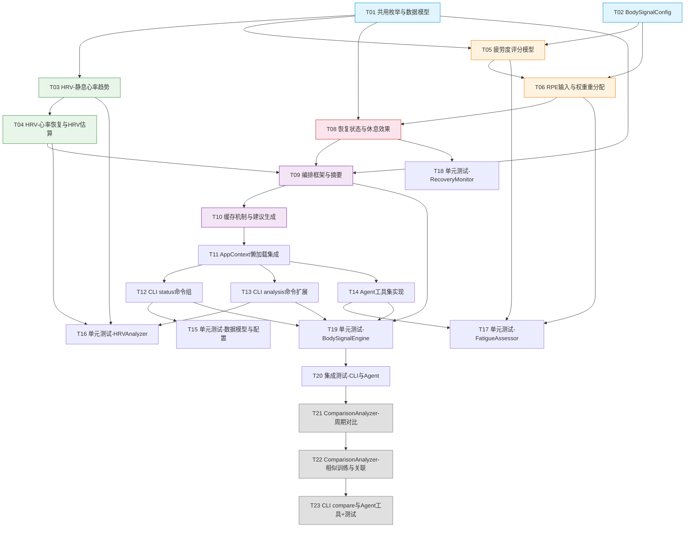

# 开发任务拆解清单 - v0.19.0

> **版本**: v0.19.0 让身体信号"会说话"
> **拆解日期**: 2026-05-05
> **架构依据**: [架构设计说明书 v5.1.0](../architecture/架构设计说明书.md)
> **需求依据**: [需求规格说明书 v5.0](../requirements/REQ_需求规格说明书.md)
> **产品规划**: [产品规划方案 v6.0](../product/产品规划方案.md)

---

## 1. 版本概览

| 维度 | 说明 |
|------|------|
| **版本主题** | 让身体信号"会说话" |
| **核心目标** | HRV分析、疲劳度评估、身体信号解读 |
| **P0任务数** | 19 |
| **P1任务数** | 4 |
| **P0总工时** | ~78小时 |
| **P1总工时** | ~18小时 |
| **迭代周期** | 3个迭代（每迭代约5个工作日） |

---

## 2. 任务总览

### 2.1 按模块分布

| 模块 | 任务数 | 工时 | 优先级 |
|------|--------|------|--------|
| 数据模型与配置 | 2 | 7h | P0 |
| HRVAnalyzer | 2 | 12h | P0 |
| FatigueAssessor | 2 | 10h | P0 |
| RecoveryMonitor | 1 | 6h | P0 |
| BodySignalEngine | 2 | 10h | P0 |
| AppContext集成 | 1 | 3h | P0 |
| CLI命令 | 2 | 10h | P0 |
| Agent工具 | 1 | 6h | P0 |
| 单元测试 | 5 | 22h | P0 |
| 集成测试 | 1 | 5h | P0 |
| ComparisonAnalyzer(P1) | 2 | 10h | P1 |
| CLI+Agent对比(P1) | 1 | 4h | P1 |
| 对比测试(P1) | 1 | 4h | P1 |

### 2.2 按迭代计划

| 迭代 | 周期 | 任务范围 | 核心交付 |
|------|------|----------|----------|
| **迭代1** | Day1-Day5 | T01-T07 | 数据模型+核心分析器(HRV+疲劳度) |
| **迭代2** | Day6-Day10 | T08-T14 | 恢复监控+编排引擎+AppContext+CLI |
| **迭代3** | Day11-Day15 | T15-T19 | Agent工具+全量测试+缺陷修复 |
| **P1迭代** | Day16-Day20 | T20-T23 | 深度对比分析+测试 |

---

## 3. 任务依赖关系图



---

## 4. P0 任务详细清单

### T01: 共用枚举与数据模型定义

| 属性 | 值 |
|------|-----|
| **所属模块** | core/models + core/body_signal |
| **优先级** | P0 |
| **预估工时** | 4h |
| **前置依赖** | 无 |
| **交付物** | `src/core/models/recovery.py`, `src/core/body_signal/models.py`, `src/core/body_signal/__init__.py` |

**任务描述**:
创建v0.19.0所有共用数据模型，包括：
1. `src/core/models/recovery.py` — RecoveryStatus、DataQuality、HRVDataSource共用枚举
2. `src/core/body_signal/models.py` — 所有frozen dataclass数据模型
3. `src/core/body_signal/__init__.py` — 模块初始化与导出

**数据模型清单**:
- `RecoveryStatus(StrEnum)`: GREEN/YELLOW/RED
- `DataQuality(StrEnum)`: SUFFICIENT/INSUFFICIENT/EMPTY
- `HRVDataSource(StrEnum)`: RR_INTERVAL/HR_ESTIMATE
- `RestingHRPoint`: date, resting_hr, deviation_pct
- `HRVAnalysisResult`: resting_hr_trend, hr_recovery_1min/3min, estimated_rmssd/sdnn, drift_alert, assessment, data_quality, data_source
- `HRRecoveryResult`: session_id, hr_end, hr_1min/3min, recovery_rate_1min/3min, data_quality
- `FatigueBreakdown`: atl_component, hr_deviation_component, consecutive_component, subjective_component
- `FatigueAssessment`: fatigue_score, recovery_status, consecutive_hard_days, rest_day_effect, breakdown, recommendation, data_quality
- `RecoveryAssessment`: recovery_status, rest_day_effect, recovery_trend, data_quality
- `RecoveryPoint`: date, tsb, resting_hr
- `RestDayEffect`: resting_hr_change_pct, tsb_change, effect_level
- `BodySignalAlert`: alert_type, severity, message, related_metrics
- `BodySignalSummary`: date, recovery_status, fatigue_score, alerts, daily_summary, recommendation, data_quality
- `PeriodComparison`: period_a_label, period_b_label, metrics_diff, data_quality

**验收标准**:
- [ ] 所有枚举继承StrEnum，值与架构设计说明书完全一致
- [ ] 所有dataclass使用frozen=True，字段类型与架构设计说明书完全一致
- [ ] RecoveryStatus定义于`models/recovery.py`（共用模块），供body_signal和InjuryRiskAnalyzer共同引用
- [ ] 每个dataclass包含`to_dict()`方法用于Agent工具JSON序列化
- [ ] mypy类型检查通过，ruff检查通过

---

### T02: BodySignalConfig配置Schema

| 属性 | 值 |
|------|-----|
| **所属模块** | core/config |
| **优先级** | P0 |
| **预估工时** | 3h |
| **前置依赖** | T01(需RecoveryStatus枚举) |
| **交付物** | `src/core/config/body_signal_config.py` |

**任务描述**:
创建身体信号模块的配置Schema，定义疲劳度各维度权重、预警阈值、缓存策略等可配置项。

**配置项清单**:
```python
@dataclass
class BodySignalConfig:
    fatigue_weight_atl: float = 40.0
    fatigue_weight_hr: float = 20.0
    fatigue_weight_consecutive: float = 20.0
    fatigue_weight_subjective: float = 20.0
    hard_training_tss_threshold: float = 80.0
    hr_spike_threshold_pct: float = 10.0
    overtraining_tsb_threshold: float = -20.0
    overtraining_consecutive_days: int = 3
    fatigue_rising_consecutive_days: int = 3
    rest_hr_improvement_pct: float = 5.0
    rest_tsb_improvement: float = 10.0
    tsb_cap: float = 50.0
```

**校验规则**:
- `__post_init__()`中校验权重之和=100%，否则抛出ValueError
- 各阈值范围校验（如tss_threshold > 0, spike_threshold > 0）

**验收标准**:
- [ ] 权重之和≠100%时抛出ValueError
- [ ] 所有阈值参数有合理默认值
- [ ] 配置可通过Pydantic-Settings环境变量覆盖
- [ ] mypy类型检查通过

---

### T03: HRVAnalyzer - 静息心率趋势计算

| 属性 | 值 |
|------|-----|
| **所属模块** | core/body_signal |
| **优先级** | P0 |
| **预估工时** | 6h |
| **前置依赖** | T01 |
| **交付物** | `src/core/body_signal/hrv_analyzer.py` |

**任务描述**:
实现HRVAnalyzer的核心方法——静息心率趋势计算，包括数据查询、计算逻辑、数据质量降级。

**核心方法**:
- `__init__(session_repo, config)`: 初始化，注入SessionRepository和BodySignalConfig
- `analyze_hrv(days) -> HRVAnalysisResult`: 综合HRV分析入口
- `get_resting_hr_trend(days) -> list[RestingHRPoint]`: 静息心率趋势

**计算逻辑**:
- 静息心率 = 活动最低10%心率区间均值
- deviation_pct = (当日静息HR - 30天均值) / 30天均值 × 100%
- 数据质量判定：心率数据≥7天且最近3天有记录=SUFFICIENT，<7天=INSUFFICIENT，无数据=EMPTY

**数据质量降级**:
- EMPTY: `HRVAnalysisResult(resting_hr_trend=[], ..., data_quality=EMPTY)`
- INSUFFICIENT: 趋势仅含已有数据点，`data_quality=INSUFFICIENT`
- 单点数据: deviation_pct返回0.0，CLI提示"数据不足，无法判断趋势"

**复用关系**: 查询Parquet心率数据复用SessionRepository

**验收标准**:
- [ ] 静息心率计算逻辑：活动最低10%心率区间均值
- [ ] deviation_pct计算正确，与30天均值对比
- [ ] 支持7/30/90天趋势查看
- [ ] 数据质量降级策略完整实现（SUFFICIENT/INSUFFICIENT/EMPTY）
- [ ] 单点数据时deviation_pct返回0.0
- [ ] 使用Polars LazyFrame查询，仅在最终输出时collect()
- [ ] 类型注解覆盖率100%

---

### T04: HRVAnalyzer - 心率恢复率与HRV估算

| 属性 | 值 |
|------|-----|
| **所属模块** | core/body_signal |
| **优先级** | P0 |
| **预估工时** | 6h |
| **前置依赖** | T01, T03 |
| **交付物** | `src/core/body_signal/hrv_analyzer.py`(扩展) |

**任务描述**:
扩展HRVAnalyzer，实现心率恢复率计算和HRV估算功能。

**核心方法**:
- `analyze_hr_recovery(session_id) -> HRRecoveryResult`: 心率恢复分析
- `check_hr_drift(session_id) -> HRDriftAlert`: 心率漂移检测（复用HeartRateAnalyzer）
- HRV估算逻辑（RMSSD/SDNN）

**计算逻辑**:
- 恢复率 = (运动末HR - N分钟后HR) / (运动末HR - 静息HR) × 100%
- RMSSD/SDNN基于心率数据估算，data_source字段区分RR_INTERVAL/HR_ESTIMATE
- 漂移检测复用`HeartRateAnalyzer.analyze_hr_drift()`，漂移>10%时预警

**数据来源检测**:
- 检测FIT数据中是否存在RR间期数据
- 存在: `data_source=RR_INTERVAL`，直接计算RMSSD/SDNN
- 不存在: `data_source=HR_ESTIMATE`，RMSSD/SDNN返回None，标注"非医疗级精度"

**验收标准**:
- [ ] 恢复率计算公式正确（1分钟/3分钟）
- [ ] RR间期数据存在时data_source=RR_INTERVAL
- [ ] RR间期缺失时data_source=HR_ESTIMATE，RMSSD/SDNN返回None
- [ ] 漂移>10%时drift_alert=True，预警文案"有氧能力不足，建议降低配速"
- [ ] HRRecoveryResult的empty_state正确
- [ ] 复用HeartRateAnalyzer.analyze_hr_drift()而非重新实现

---

### T05: FatigueAssessor - 疲劳度评分模型

| 属性 | 值 |
|------|-----|
| **所属模块** | core/body_signal |
| **优先级** | P0 |
| **预估工时** | 6h |
| **前置依赖** | T01, T02 |
| **交付物** | `src/core/body_signal/fatigue_assessor.py` |

**任务描述**:
实现疲劳度评估器，包含加权评分模型、恢复状态判定、连续高强度训练监控。

**核心方法**:
- `__init__(session_repo, training_load_analyzer, config)`: 注入依赖
- `assess_fatigue() -> FatigueAssessment`: 综合疲劳度评估
- `get_consecutive_hard_days() -> int`: 7天内高强度训练天数

**评分模型**:
```
fatigue_score = ATL权重(40%) × ATL维度分
              + 心率偏差权重(20%) × 心率偏差维度分
              + 连续训练权重(20%) × 连续训练维度分
              + 主观疲劳权重(20%) × 主观疲劳维度分
```

**恢复状态判定**:
- GREEN: TSB>10 且 疲劳度<30
- YELLOW: TSB 0~10 或 疲劳度30-60
- RED: TSB<0 或 疲劳度>60

**边界条件**:
- TSB值截断：TSB>50时按50计算，避免评分失真
- 7天内高强度训练≥4次时提示"连续高强度训练过多，建议安排恢复日"
- 权重从BodySignalConfig读取

**复用关系**: 消费TrainingLoadAnalyzer的TSS/ATL/CTL/TSB计算结果

**验收标准**:
- [ ] 疲劳度评分0-100分，各维度权重可配置
- [ ] 恢复状态三色判定逻辑正确（GREEN/YELLOW/RED）
- [ ] TSB截断逻辑：>50时按50计算
- [ ] 7天内高强度训练≥4次时输出提示
- [ ] FatigueAssessment的empty_state正确（fatigue_score=0.0, recovery_status=GREEN, data_quality=EMPTY）
- [ ] FatigueBreakdown各维度得分明细正确

---

### T06: FatigueAssessor - RPE输入与权重重分配

| 属性 | 值 |
|------|-----|
| **所属模块** | core/body_signal |
| **优先级** | P0 |
| **预估工时** | 4h |
| **前置依赖** | T02, T05 |
| **交付物** | `src/core/body_signal/fatigue_assessor.py`(扩展) |

**任务描述**:
扩展FatigueAssessor，实现RPE主观疲劳度输入路径和权重自动重分配机制。

**RPE输入路径**:
1. CLI参数: `nanobotrun analysis fatigue --rpe 6`
2. FIT数据: 从训练记录中读取RPE字段
3. 降级: 无RPE数据时，主观疲劳维度权重按比例重分配到其他三个维度

**权重重分配算法**:
```python
def _redistribute_rpe_weight(config):
    total_other = config.fatigue_weight_atl + config.fatigue_weight_hr + config.fatigue_weight_consecutive
    scale = (total_other + config.fatigue_weight_subjective) / total_other
    return (
        config.fatigue_weight_atl * scale,
        config.fatigue_weight_hr * scale,
        config.fatigue_weight_consecutive * scale,
    )
```

**验收标准**:
- [ ] RPE值范围1-10，超出范围抛出ValueError
- [ ] 无RPE时权重自动重分配，重分配后权重之和仍=100%
- [ ] CLI支持`--rpe`参数传入
- [ ] FIT数据中RPE字段缺失时自动降级，无报错
- [ ] 重分配后FatigueBreakdown中subjective_component=0

---

### T07: RecoveryMonitor - 恢复状态与休息效果评估

| 属性 | 值 |
|------|-----|
| **所属模块** | core/body_signal |
| **优先级** | P0 |
| **预估工时** | 6h |
| **前置依赖** | T01, T05 |
| **交付物** | `src/core/body_signal/recovery_monitor.py` |

**任务描述**:
实现恢复监控器，包含恢复状态评估、休息日效果评估、恢复趋势追踪。

**核心方法**:
- `__init__(session_repo, training_load_analyzer, hrv_analyzer, config)`: 注入依赖
- `get_recovery_status() -> RecoveryAssessment`: 当前恢复状态
- `check_rest_day_effect() -> RestDayEffect`: 休息日效果评估
- `get_recovery_trend(days) -> list[RecoveryPoint]`: 恢复趋势

**休息日效果评估**:
- 静息心率下降>5% → effect_level="good"，提示"休息效果良好"
- TSB上升>10 → effect_level="good"，提示"体能恢复明显"
- 其他 → effect_level="moderate"或"minimal"

**恢复趋势**:
- 返回指定天数的RecoveryPoint列表（date, tsb, resting_hr）
- 数据不足时返回已有数据点 + data_quality=INSUFFICIENT

**验收标准**:
- [ ] 恢复状态判定与FatigueAssessor一致（GREEN/YELLOW/RED）
- [ ] 休息日效果评估逻辑正确（good/moderate/minimal）
- [ ] 静息心率下降>5%判定为good
- [ ] TSB上升>10判定为good
- [ ] RecoveryAssessment的empty_state正确
- [ ] 恢复趋势数据点按日期排序

---

### T08: BodySignalEngine - 编排框架与摘要生成

| 属性 | 值 |
|------|-----|
| **所属模块** | core/body_signal |
| **优先级** | P0 |
| **预估工时** | 6h |
| **前置依赖** | T01, T04, T05, T07 |
| **交付物** | `src/core/body_signal/body_signal_engine.py` |

**任务描述**:
实现身体信号引擎编排层，编排HRV/疲劳度/恢复状态，生成异常预警和每日/每周摘要。

**核心方法**:
- `__init__(hrv_analyzer, fatigue_assessor, recovery_monitor, advice_engine, config)`: 注入子分析器
- `get_daily_summary() -> BodySignalSummary`: 每日身体信号摘要
- `get_weekly_summary() -> BodySignalSummary`: 每周身体信号摘要
- `check_alerts() -> list[BodySignalAlert]`: 异常信号预警

**预警规则**:
| 预警类型 | 触发条件 | 严重度 | 消息 |
|----------|----------|--------|------|
| hr_spike | 静息心率较7天均值>10% | warning | "静息心率异常升高，可能未充分恢复" |
| overtraining | TSB连续3天<-20 | critical | "持续过度训练状态，建议立即减量" |
| fatigue_rising | 连续3天疲劳度递增 | warning | "疲劳度持续上升，建议安排恢复日" |

**每日摘要格式**:
"今日状态：🟢体能充沛 | 静息心率55bpm(正常) | 建议可安排质量课"

**每周摘要增强**: 输出增加与上周的对比摘要，如"静息心率较上周↓2bpm，恢复趋势向好"

**降级策略**: 子分析器返回空结果时引擎仍可输出降级摘要，data_quality=INSUFFICIENT/EMPTY

**验收标准**:
- [ ] 编排流程正确：HRV→疲劳度→恢复状态→预警→建议
- [ ] 三条预警规则触发条件与消息文案与架构设计一致
- [ ] 每日摘要格式包含三色灯+静息心率+建议
- [ ] 每周摘要包含与上周对比
- [ ] 降级策略：子分析器返回空结果时引擎仍可输出
- [ ] BodySignalSummary的empty_state正确

---

### T09: BodySignalEngine - 缓存机制与建议生成

| 属性 | 值 |
|------|-----|
| **所属模块** | core/body_signal |
| **优先级** | P0 |
| **预估工时** | 4h |
| **前置依赖** | T08 |
| **交付物** | `src/core/body_signal/body_signal_engine.py`(扩展) |

**任务描述**:
扩展BodySignalEngine，实现同日缓存机制和训练建议生成。

**缓存机制**:
- 同一自然日内多次查询复用计算结果
- 缓存失效：日期变更时自动失效
- `status today`与`analysis fatigue`共享同一引擎实例，同日内仅计算一次

**建议生成**:
- 复用SmartAdviceEngine生成训练建议
- 建议具体可执行（如"今天适合轻松跑，配速建议5:30-6:00/km，时长30-40分钟"）
- 基于恢复状态+疲劳度+预警综合生成

**验收标准**:
- [ ] 同日多次查询返回缓存结果，不重复计算
- [ ] 日期变更时缓存自动失效
- [ ] 训练建议具体可执行，包含配速/时长建议
- [ ] 建议内容基于恢复状态+疲劳度+预警综合生成
- [ ] SmartAdviceEngine集成正确

---

### T10: AppContext懒加载集成

| 属性 | 值 |
|------|-----|
| **所属模块** | core/base |
| **优先级** | P0 |
| **预估工时** | 3h |
| **前置依赖** | T08, T09 |
| **交付物** | `src/core/base/context.py`(修改) |

**任务描述**:
在AppContext中添加5个新的懒加载property，遵循现有`training_response_analyzer`等属性的懒加载模式。

**新增property**:
- `hrv_analyzer -> HRVAnalyzer`
- `fatigue_assessor -> FatigueAssessor`
- `recovery_monitor -> RecoveryMonitor`
- `body_signal_engine -> BodySignalEngine`
- `comparison_analyzer -> ComparisonAnalyzer`（P1骨架，返回NotImplementedError或空实现）

**懒加载模式**: 首次访问时创建实例并缓存到`_extensions`

**验收标准**:
- [ ] 5个property遵循现有懒加载模式（get_extension/set_extension）
- [ ] 首次访问创建实例，后续访问返回缓存实例
- [ ] 依赖注入正确：HRVAnalyzer需要session_repo，FatigueAssessor需要training_load_analyzer等
- [ ] comparison_analyzer预留P1骨架
- [ ] 不影响现有AppContext功能

---

### T11: CLI status命令组

| 属性 | 值 |
|------|-----|
| **所属模块** | cli/commands + cli/handlers |
| **优先级** | P0 |
| **预估工时** | 5h |
| **前置依赖** | T10 |
| **交付物** | `src/cli/commands/status.py`, `src/cli/handlers/status_handler.py` |

**任务描述**:
新增status命令组，提供身体状态快速查看功能。定位为"快速摘要，一眼看懂"，响应时间<500ms。

**命令定义**:
- `status today`: 今日身体状态摘要（一句话+三色灯）
- `status weekly`: 本周身体状态摘要（含与上周对比）

**CLI Help文案**:
- `status`: "快速查看身体状态（一句话+三色灯）"

**输出格式**:
- today: "今日状态：🟢体能充沛 | 静息心率55bpm(正常) | 建议可安排质量课"
- weekly: 周摘要 + 与上周对比（如"静息心率较上周↓2bpm"）

**Handler设计**:
- `StatusHandler.__init__(context)`: 注入AppContext
- `StatusHandler.get_today_status() -> BodySignalSummary`
- `StatusHandler.get_weekly_status() -> BodySignalSummary`

**注册到app.py**: 在主CLI应用中注册status命令组

**验收标准**:
- [ ] `status today`输出一句话摘要+三色灯状态
- [ ] `status weekly`输出周摘要+与上周对比
- [ ] 响应时间<500ms
- [ ] 无数据时展示"暂无数据，请先导入训练记录"
- [ ] 命令注册到主CLI应用
- [ ] Rich格式化输出（Panel/Table）

---

### T12: CLI analysis命令扩展

| 属性 | 值 |
|------|-----|
| **所属模块** | cli/commands + cli/handlers |
| **优先级** | P0 |
| **预估工时** | 5h |
| **前置依赖** | T10 |
| **交付物** | `src/cli/commands/analysis.py`(修改), `src/cli/handlers/analysis_handler.py`(修改) |

**任务描述**:
扩展analysis命令组，新增5个子命令。定位为"深度分析，详细数据"，响应时间<2s。

**新增命令**:
- `analysis hrv --days 30`: HRV分析（静息心率趋势+HRV指标）
- `analysis hr-recovery`: 心率恢复分析（最近训练的恢复率）
- `analysis fatigue [--rpe 6]`: 疲劳度评估（评分+各维度明细）
- `analysis recovery`: 恢复状态评估（三色灯+休息效果+趋势）
- `analysis compare --period this_year:last_year`（P1骨架）

**Handler扩展**:
- `AnalysisHandler.get_hrv_analysis(days) -> HRVAnalysisResult`
- `AnalysisHandler.get_hr_recovery() -> HRRecoveryResult`
- `AnalysisHandler.get_fatigue_assessment(rpe) -> FatigueAssessment`
- `AnalysisHandler.get_recovery_status() -> RecoveryAssessment`

**输出格式**: 完整数据表 + 趋势图 + 详细建议（Rich Panel/Table）

**验收标准**:
- [ ] 4个新命令正确注册到analysis命令组
- [ ] `analysis hrv --days 30`输出静息心率趋势表+HRV指标
- [ ] `analysis hr-recovery`输出最近训练的恢复率
- [ ] `analysis fatigue`输出疲劳度评分+各维度明细，支持`--rpe`参数
- [ ] `analysis recovery`输出恢复状态+休息效果+趋势
- [ ] 数据不足时标注"数据不足，仅供参考"
- [ ] Rich格式化输出

---

### T13: Agent工具集实现

| 属性 | 值 |
|------|-----|
| **所属模块** | agents |
| **优先级** | P0 |
| **预估工时** | 6h |
| **前置依赖** | T10 |
| **交付物** | `src/agents/tools.py`(修改) |

**任务描述**:
在RunnerTools中新增6个Agent工具方法，并创建对应的BaseTool子类注册到nanobot-ai框架。

**新增工具**:

| 工具名 | RunnerTools方法 | 核心模块 | 输入 | 输出 |
|--------|----------------|----------|------|------|
| `get_hrv_analysis` | `get_hrv_analysis(days)` | HRVAnalyzer | days: int | HRVAnalysisResult |
| `get_hr_recovery` | `get_hr_recovery()` | RecoveryMonitor | 无 | HRRecoveryResult |
| `get_fatigue_score` | `get_fatigue_score(rpe)` | FatigueAssessor | rpe: int|None | FatigueAssessment |
| `get_recovery_status` | `get_recovery_status()` | RecoveryMonitor | 无 | RecoveryAssessment |
| `get_body_signal_summary` | `get_body_signal_summary(period)` | BodySignalEngine | period: str | BodySignalSummary |
| `compare_training_periods` | `compare_training_periods(period_a, period_b)` | ComparisonAnalyzer | period_a, period_b | PeriodComparison |

**实现要求**:
- 每个工具继承BaseTool，实现name/description/parameters/execute
- RunnerTools方法通过`get_context()`获取body_signal组件
- 返回格式: `{success: true, data: {...}}` 或 `{success: false, error: "..."}`
- 更新TOOL_DESCRIPTIONS字典

**验收标准**:
- [ ] 6个工具类正确继承BaseTool
- [ ] 每个工具的name/description/parameters定义完整
- [ ] RunnerTools方法通过AppContext获取body_signal组件
- [ ] 返回JSON格式包含success/data或error
- [ ] TOOL_DESCRIPTIONS字典已更新
- [ ] 工具注册到nanobot-ai框架

---

### T14: 单元测试 - 数据模型与配置

| 属性 | 值 |
|------|-----|
| **所属模块** | tests/unit/core |
| **优先级** | P0 |
| **预估工时** | 4h |
| **前置依赖** | T01, T02 |
| **交付物** | `tests/unit/core/body_signal/test_models.py`, `tests/unit/core/config/test_body_signal_config.py` |

**任务描述**:
为数据模型和配置编写单元测试。

**测试覆盖**:
- 枚举值正确性（RecoveryStatus/DataQuality/HRVDataSource）
- frozen dataclass不可变性
- to_dict()序列化正确性
- BodySignalConfig权重校验（权重之和≠100%抛出ValueError）
- BodySignalConfig阈值范围校验
- empty_state返回值正确性

**验收标准**:
- [ ] 覆盖率≥85%
- [ ] 所有用例通过
- [ ] Mock策略：无外部依赖，纯数据模型测试

---

### T15: 单元测试 - HRVAnalyzer

| 属性 | 值 |
|------|-----|
| **所属模块** | tests/unit/core/body_signal |
| **优先级** | P0 |
| **预估工时** | 5h |
| **前置依赖** | T03, T04 |
| **交付物** | `tests/unit/core/body_signal/test_hrv_analyzer.py` |

**任务描述**:
为HRVAnalyzer编写单元测试，覆盖静息心率计算、HRV估算、心率恢复率、漂移检测。

**测试覆盖**:
- 静息心率趋势计算（7/30/90天）
- deviation_pct计算正确性
- 心率恢复率计算（1分钟/3分钟）
- RMSSD/SDNN估算（RR间期存在/缺失）
- data_source标识正确性
- 心率漂移检测（>10%预警）
- 数据质量降级（SUFFICIENT/INSUFFICIENT/EMPTY）
- 单点数据处理
- empty_state返回值

**Mock策略**: Mock SessionRepository返回测试数据

**验收标准**:
- [ ] 覆盖率≥85%
- [ ] 所有用例通过
- [ ] 边界条件全覆盖（空数据/单点/极端值）

---

### T16: 单元测试 - FatigueAssessor

| 属性 | 值 |
|------|-----|
| **所属模块** | tests/unit/core/body_signal |
| **优先级** | P0 |
| **预估工时** | 5h |
| **前置依赖** | T05, T06 |
| **交付物** | `tests/unit/core/body_signal/test_fatigue_assessor.py` |

**任务描述**:
为FatigueAssessor编写单元测试，覆盖疲劳度评分、权重分配、RPE降级、TSB截断。

**测试覆盖**:
- 疲劳度评分计算（各维度权重正确性）
- 恢复状态判定（GREEN/YELLOW/RED边界值）
- TSB截断逻辑（>50按50计算）
- RPE输入路径（CLI参数/FIT数据/降级）
- 权重重分配算法（重分配后权重之和=100%）
- 连续高强度训练天数统计
- 数据质量降级
- empty_state返回值

**Mock策略**: Mock TrainingLoadAnalyzer和SessionRepository

**验收标准**:
- [ ] 覆盖率≥85%
- [ ] 所有用例通过
- [ ] 权重重分配后权重之和=100%验证

---

### T17: 单元测试 - RecoveryMonitor

| 属性 | 值 |
|------|-----|
| **所属模块** | tests/unit/core/body_signal |
| **优先级** | P0 |
| **预估工时** | 4h |
| **前置依赖** | T07 |
| **交付物** | `tests/unit/core/body_signal/test_recovery_monitor.py` |

**任务描述**:
为RecoveryMonitor编写单元测试，覆盖恢复状态判定、休息日效果、恢复趋势。

**测试覆盖**:
- 恢复状态判定（GREEN/YELLOW/RED）
- 休息日效果评估（good/moderate/minimal）
- 静息心率下降>5%判定为good
- TSB上升>10判定为good
- 恢复趋势数据点按日期排序
- 数据质量降级
- empty_state返回值

**Mock策略**: Mock SessionRepository和TrainingLoadAnalyzer

**验收标准**:
- [ ] 覆盖率≥85%
- [ ] 所有用例通过

---

### T18: 单元测试 - BodySignalEngine

| 属性 | 值 |
|------|-----|
| **所属模块** | tests/unit/core/body_signal |
| **优先级** | P0 |
| **预估工时** | 5h |
| **前置依赖** | T08, T09 |
| **交付物** | `tests/unit/core/body_signal/test_body_signal_engine.py` |

**任务描述**:
为BodySignalEngine编写单元测试，覆盖编排流程、预警规则触发、降级摘要生成、缓存机制。

**测试覆盖**:
- 编排流程正确性（HRV→疲劳度→恢复→预警→建议）
- 三条预警规则触发条件与消息
- 每日摘要格式（三色灯+静息心率+建议）
- 每周摘要（含与上周对比）
- 降级策略（子分析器返回空结果时引擎仍可输出）
- 缓存机制（同日复用/日期变更失效）
- empty_state返回值

**Mock策略**: Mock HRVAnalyzer、FatigueAssessor、RecoveryMonitor、SmartAdviceEngine

**验收标准**:
- [ ] 覆盖率≥80%
- [ ] 所有用例通过
- [ ] 预警规则触发条件全覆盖

---

### T19: 集成测试 - CLI与Agent工具

| 属性 | 值 |
|------|-----|
| **所属模块** | tests/integration |
| **优先级** | P0 |
| **预估工时** | 5h |
| **前置依赖** | T11, T12, T13, T18 |
| **交付物** | `tests/integration/test_body_signal_integration.py` |

**任务描述**:
编写集成测试，验证CLI命令和Agent工具的端到端流程。

**测试场景**:
1. BodySignalEngine端到端：从Parquet读取到生成BodySignalSummary
2. CLI命令集成：`status today`/`analysis hrv`命令正确调用Handler
3. Agent工具集成：6个Agent工具正确调用核心模块并返回JSON
4. 数据缺失场景：无数据/数据不足时的降级展示
5. 缓存验证：同日多次查询不重复计算

**验收标准**:
- [ ] 5个集成测试场景全部通过
- [ ] CLI命令输出格式正确
- [ ] Agent工具返回JSON格式正确
- [ ] 数据缺失降级展示正确

---

## 5. P1 任务详细清单

### T20: ComparisonAnalyzer - 周期对比

| 属性 | 值 |
|------|-----|
| **所属模块** | core/body_signal |
| **优先级** | P1 |
| **预估工时** | 5h |
| **前置依赖** | T01, T19 |
| **交付物** | `src/core/body_signal/comparison_analyzer.py` |

**任务描述**:
实现深度对比分析器的周期对比功能。

**核心方法**:
- `compare_periods(period_a, period_b) -> PeriodComparison`: 周期对比
- 对比指标：距离/时长/VDOT/TSS/ATL/CTL/TSB

**计算逻辑**:
- 按时间段筛选数据，使用Polars聚合计算各指标
- metrics_diff存储各指标的差值和变化百分比
- 数据不足时data_quality=INSUFFICIENT

**验收标准**:
- [ ] 支持"今年vs去年"同期对比
- [ ] 输出距离/时长/VDOT/训练负荷对比表
- [ ] 数据不足时正确降级
- [ ] PeriodComparison的empty_state正确

---

### T21: ComparisonAnalyzer - 相似训练与负荷表现关联

| 属性 | 值 |
|------|-----|
| **所属模块** | core/body_signal |
| **优先级** | P1 |
| **预估工时** | 5h |
| **前置依赖** | T20 |
| **交付物** | `src/core/body_signal/comparison_analyzer.py`(扩展) |

**任务描述**:
扩展ComparisonAnalyzer，实现相似训练对比和训练负荷-表现关联分析。

**核心方法**:
- `find_similar_sessions(distance, pace) -> list[SessionComparison]`: 相似训练对比
- `analyze_load_performance() -> LoadPerformanceCorrelation`: 负荷-表现关联

**计算逻辑**:
- 相似训练：距离±10%和配速±5%筛选
- 负荷-表现关联：CTL vs VDOT散点图数据

**验收标准**:
- [ ] 相似训练按距离±10%和配速±5%筛选
- [ ] 对比心率/疲劳度/恢复情况
- [ ] CTL vs VDOT散点数据正确
- [ ] 数据不足时正确降级

---

### T22: CLI compare命令与Agent工具 + 测试

| 属性 | 值 |
|------|-----|
| **所属模块** | cli + agents + tests |
| **优先级** | P1 |
| **预估工时** | 4h |
| **前置依赖** | T21 |
| **交付物** | `src/cli/commands/analysis.py`(修改), `src/agents/tools.py`(修改), `tests/unit/core/body_signal/test_comparison_analyzer.py` |

**任务描述**:
实现CLI compare命令、Agent对比工具，并编写单元测试。

**CLI命令**:
- `analysis compare --period this_year:last_year`

**Agent工具**:
- `compare_training_periods(period_a, period_b)`

**测试覆盖**:
- 周期对比计算正确性
- 相似训练筛选逻辑
- 负荷-表现关联数据
- 数据质量降级

**验收标准**:
- [ ] CLI命令正确注册并输出对比表
- [ ] Agent工具返回JSON格式正确
- [ ] 单元测试覆盖率≥80%

---

## 6. 风险任务标注

| 任务ID | 风险等级 | 风险说明 | 缓解措施 |
|--------|---------|----------|----------|
| T04 | 🔴高 | HRV估算准确性依赖FIT数据质量 | data_source字段区分精度等级，RMSSD/SDNN缺失时返回None |
| T05 | 🟡中 | 疲劳度加权模型普适性有限 | 权重可配置(BodySignalConfig)，未来提供校准模式 |
| T06 | 🟡中 | RPE数据来源不稳定(FIT可能无RPE字段) | 自动降级+权重重分配，无RPE时不报错 |
| T08 | 🟡中 | 编排层依赖链长，任一子分析器延期影响引擎 | 松耦合设计，子分析器返回空结果时引擎仍可输出降级摘要 |
| T11 | 🟡中 | status命令响应时间<500ms可能难保证 | 依赖缓存机制(T09)，同日仅计算一次 |

---

## 7. 目录结构变更汇总

```
新增文件:
src/core/body_signal/__init__.py              # T01
src/core/body_signal/models.py                # T01
src/core/body_signal/hrv_analyzer.py          # T03, T04
src/core/body_signal/fatigue_assessor.py      # T05, T06
src/core/body_signal/recovery_monitor.py      # T07
src/core/body_signal/body_signal_engine.py    # T08, T09
src/core/body_signal/comparison_analyzer.py   # T20, T21
src/core/models/recovery.py                   # T01
src/core/config/body_signal_config.py         # T02
src/cli/commands/status.py                    # T11
src/cli/handlers/status_handler.py            # T11
tests/unit/core/body_signal/__init__.py       # T14
tests/unit/core/body_signal/test_models.py    # T14
tests/unit/core/body_signal/test_hrv_analyzer.py       # T15
tests/unit/core/body_signal/test_fatigue_assessor.py   # T16
tests/unit/core/body_signal/test_recovery_monitor.py   # T17
tests/unit/core/body_signal/test_body_signal_engine.py # T18
tests/unit/core/body_signal/test_comparison_analyzer.py # T22
tests/integration/test_body_signal_integration.py       # T19

修改文件:
src/core/base/context.py                      # T10: 新增5个懒加载property
src/core/models/__init__.py                   # T01: 导出RecoveryStatus/DataQuality
src/core/config/__init__.py                   # T02: 导出BodySignalConfig
src/cli/commands/analysis.py                  # T12: 新增4个子命令
src/cli/handlers/analysis_handler.py          # T12: 新增4个Handler方法
src/cli/app.py                                # T11: 注册status命令组
src/agents/tools.py                           # T13: 新增6个工具类+TOOL_DESCRIPTIONS
```

---

## 8. 准入准出标准

### 迭代准入

| 迭代 | 准入条件 |
|------|----------|
| 迭代1 | 架构设计评审通过、需求确认完成 |
| 迭代2 | 迭代1所有P0任务完成、单元测试通过 |
| 迭代3 | 迭代2所有P0任务完成、单元测试通过 |
| P1迭代 | 迭代3完成、P0功能100%验收通过 |

### 版本准出

| 维度 | 标准 |
|------|------|
| 功能完成 | P0功能100%实现，P1功能实现≥60% |
| 测试覆盖 | body_signal模块≥80%，cli≥60% |
| 代码质量 | ruff零警告，mypy零错误 |
| 性能要求 | 身体状态查询<2秒，status命令<500ms |
| 预警准确 | 异常信号预警准确率≥80% |

---

## 9. 变更记录

| 版本 | 日期 | 变更内容 |
|------|------|----------|
| v1.0 | 2026-05-05 | 初始版本，v0.19.0任务拆解 |
