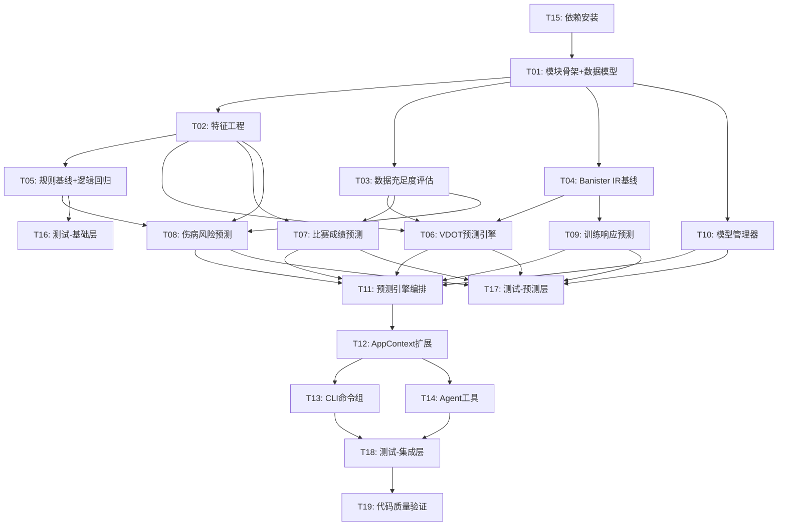

# 开发任务拆解清单 — v0.20.0 ML增强预测

> **文档版本**: v1.0
> **创建日期**: 2026-05-08
> **当前基线**: v0.19.0
> **目标版本**: v0.20.0
> **对齐文档**:
>
> - [需求规格说明书 v8.1](../requirements/REQ_需求规格说明书.md)
> - [架构设计说明书 v7.1.0](../architecture/架构设计说明书.md)
> - [产品规划方案 v9.0](../product/产品规划方案.md)

***

## 1. 版本概览

### 1.1 版本目标

**主题**: ML增强预测 —— 为数据充足用户提供更精准的未来洞察
**核心目标**: 基于18个月+历史数据，用ML模型替代简单线性回归，显著提升预测准确度
**目标用户**: 数据充足的高级用户（18个月+跑步数据，500+条记录）

### 1.2 需求覆盖

| 需求ID        | 需求名称          | 优先级 | 覆盖任务                        |
| ----------- | ------------- | --- | --------------------------- |
| REQ-0.20-01 | ML-VDOT趋势预测引擎 | P0  | T01-T06, T11-T14            |
| REQ-0.20-02 | 个人化比赛成绩预测     | P0  | T01, T02, T07, T11-T14      |
| REQ-0.20-03 | ML伤病风险预测      | P0  | T01, T02, T05, T08, T11-T14 |
| REQ-0.20-04 | 模型管理与校准       | P1  | T01, T10, T13               |
| REQ-0.20-05 | 数据充足度评估       | P1  | T01, T03, T13               |
| REQ-0.20-06 | 训练响应预测        | P1  | T09, T11-T14                |
| REQ-0.20-07 | 伤病报告提交        | P1  | T08, T11, T14               |

### 1.3 任务统计

| 维度    | 数量             |
| ----- | -------------- |
| 任务总数  | 19             |
| P0任务数 | 13             |
| P1任务数 | 6              |
| 总工作量  | 154小时（约19.3人天） |
| 基础层任务 | 5（T01-T05）     |
| 预测层任务 | 5（T06-T10）     |
| 编排层任务 | 2（T11-T12）     |
| 集成层任务 | 3（T13-T15）     |
| 测试层任务 | 4（T16-T19）     |

***

## 2. 任务列表

### 2.1 基础层（Foundation）

***

#### T01: prediction模块骨架与数据模型

| 属性       | 值                                                                |
| -------- | ---------------------------------------------------------------- |
| **任务ID** | T01                                                              |
| **所属模块** | `src/core/prediction/`                                           |
| **优先级**  | P0                                                               |
| **前置依赖** | 无                                                                |
| **预估工时** | 8小时（1天）                                                          |
| **交付物**  | `models.py`, `config.py`, `__init__.py`, `baselines/__init__.py` |

**任务描述**:

创建prediction模块目录结构，定义所有frozen dataclass数据模型和PredictionConfig配置类。这是整个v0.20.0的基础，所有后续任务均依赖此任务。

**具体工作**:

1. 创建 `src/core/prediction/` 目录及子目录 `baselines/`
2. 创建 `models.py`，定义以下frozen dataclass：
   - `VDOTPrediction`, `VDOTFactor`, `MLPredictionInfo`
   - `RacePredictionResult`, `PersonalizationInfo`, `PaceStrategy`, `PaceSplit`
   - `InjuryRiskPrediction`, `RiskTimePoint`, `RiskFactor`
   - `AcuteLoadRisk`, `ChronicRisk`, `BodySignalRisk`
   - `PredictionRecord`, `TrainingResponse`, `InjuryReportResult`, `InjuryLabel`
   - `DataSufficiencyReport`, `SufficiencyDimension`, `PredictionStatusReport`
   - `ModelMetadata`, `ModelTrainingResult`, `ModelManagementResult`
3. 创建 `config.py`，定义 `PredictionConfig` frozen dataclass，包含所有配置项及 `__post_init__` 校验
4. 创建 `__init__.py` 导出核心类

**验收标准**:

- [ ] `src/core/prediction/` 目录结构完整，包含 `baselines/` 子目录
- [ ] 所有数据模型为 `frozen=True` dataclass，字段类型注解完整
- [ ] `PredictionConfig.__post_init__` 对所有配置项执行边界校验
- [ ] `mypy src/core/prediction/models.py --ignore-missing-imports` 无错误
- [ ] 数据模型字段与架构设计说明书6.6节完全一致

***

#### T02: 特征工程模块

| 属性       | 值                                       |
| -------- | --------------------------------------- |
| **任务ID** | T02                                     |
| **所属模块** | `src/core/prediction/feature_engine.py` |
| **优先级**  | P0                                      |
| **前置依赖** | T01                                     |
| **预估工时** | 16小时（2天）                                |
| **交付物**  | `feature_engine.py`                     |

**任务描述**:

实现FeatureEngine，从历史训练数据中提取ML模型所需的特征矩阵。复用已有模块（TrainingLoadAnalyzer、HRVAnalyzer、BodySignalEngine、SessionRepository、VDOTCalculator）的计算结果，不重复实现计算逻辑。

**具体工作**:

1. 实现 `FeatureEngine.__init__`，注入 session\_repo、training\_load\_analyzer、hrv\_analyzer、body\_signal\_engine、vdot\_calculator
2. 实现 `extract_vdot_features(days)` — VDOT预测特征矩阵（≥5类，≥11个特征）：
   - 训练周期特征：weekly\_volume\_km, volume\_change\_rate
   - 季节性特征：month\_sin, month\_cos
   - 身体适应特征：ctl\_value, tsb\_value
   - 负荷变化率特征：atl\_ctl\_ratio, load\_ramp\_rate
   - 强度分布特征：high\_intensity\_pct, avg\_intensity\_factor
   - 身体信号特征：fatigue\_score, resting\_hr\_deviation
3. 实现 `extract_injury_features(days)` — 伤病风险特征矩阵（≥4类，≥8个特征）：
   - 负荷变化率特征：atl\_ctl\_ratio, weekly\_load\_change\_pct
   - TSB趋势特征：tsb\_consecutive\_low\_days, tsb\_trend\_slope
   - 静息心率偏移特征：resting\_hr\_deviation\_pct, resting\_hr\_7d\_trend
   - HRV变化特征：hrv\_rmssd\_trend, hrv\_sdnn\_deviation
4. 实现 `extract_race_features()` — 比赛预测特征
5. 实现 `get_feature_names(feature_type)` — 获取特征名称列表
6. 实现特征矩阵缓存机制（同日缓存，日期变更失效）

**验收标准**:

- [ ] VDOT特征提取≥5类，每类≥2个具体特征
- [ ] 伤病风险特征提取≥4类，每类≥2个具体特征
- [ ] 所有特征计算复用已有模块，不重复实现计算逻辑
- [ ] 特征缺失时跳过缺失特征，记录warning，不阻塞预测
- [ ] 同日缓存机制生效，日期变更自动失效
- [ ] 特征提取耗时<3秒

***

#### T03: 数据充足度评估器

| 属性       | 值                                      |
| -------- | -------------------------------------- |
| **任务ID** | T03                                    |
| **所属模块** | `src/core/prediction/data_assessor.py` |
| **优先级**  | P0                                     |
| **前置依赖** | T01                                    |
| **预估工时** | 8小时（1天）                                |
| **交付物**  | `data_assessor.py`                     |

**任务描述**:

实现DataAssessor，评估当前数据是否满足ML预测要求，提供数据质量报告和积累建议。支持三种预测类型（vdot/race/injury）的独立评估。

**具体工作**:

1. 实现 `DataAssessor.__init__`，注入 session\_repo
2. 实现 `assess_sufficiency(prediction_type)` — 评估指定预测类型的数据充足性：
   - vdot: 时间跨度(18月+)、记录数量(400+/200+)、训练频率(每周≥3次)
   - race: 比赛记录(3次+)、距离覆盖
   - injury: 时间跨度(18月+)、心率完整度(>80%)、身体信号数据可用性
3. 实现 `get_full_status()` — 获取所有预测类型的完整状态
4. 实现 `get_accumulation_advice(prediction_type)` — 获取数据积累建议
5. 返回 `DataSufficiencyReport`，包含各维度进度百分比

**验收标准**:

- [ ] 三种预测类型的数据充足性评估逻辑完整
- [ ] 返回 `DataSufficiencyReport`，包含 `is_sufficient`、`overall_progress_pct`、`dimensions`、`advice`
- [ ] 每个维度包含 `current_value`、`target_value`、`is_met`、`progress_pct`
- [ ] 数据不足时提供明确的积累建议
- [ ] 评估耗时<1秒

***

#### T04: Banister IR参数化基线模型

| 属性       | 值                                              |
| -------- | ---------------------------------------------- |
| **任务ID** | T04                                            |
| **所属模块** | `src/core/prediction/baselines/banister_ir.py` |
| **优先级**  | P0                                             |
| **前置依赖** | T01                                            |
| **预估工时** | 16小时（2天）                                       |
| **交付物**  | `banister_ir.py`                               |

**任务描述**:

实现Banister Impulse-Response (IR) 参数化模型，作为VDOT预测的冷启动方案。数据200-400条时使用此模型，数据400+条时自动升级为ML增强预测。

**具体工作**:

1. 实现 `BanisterIRModel.__init__`，初始化默认参数（τ\_fitness=42, τ\_fatigue=10, k1=0.0038, k2=0.043）
2. 实现 `fit(training_history, vdot_history)` — 使用 `scipy.optimize.minimize`（L-BFGS-B）拟合参数：
   - 目标函数：预测VDOT与实际VDOT的MSE
   - 参数约束范围：τ\_fitness \[30,55], τ\_fatigue \[7,14], k1 \[0.0027,0.0049], k2 \[0.030,0.056]
3. 实现 `predict(days, current_state)` — 基于拟合参数预测未来VDOT趋势
4. 实现 `calculate_trimp(session)` — 计算训练刺激量（TRIMP）
5. 实现 `predict_training_impulse(session, current_state)` — 预测单次训练对体能的影响
6. 实现参数持久化（JSON格式保存拟合参数）

**验收标准**:

- [ ] 默认参数与架构设计说明书ADR-004一致
- [ ] `scipy.optimize.minimize` 拟合参数在约束范围内
- [ ] 200+条数据时拟合耗时<1秒
- [ ] 预测结果返回 `prediction_type="parametric"`
- [ ] 参数持久化到 `~/.nanobot-runner/models/vdot_predictor_banister/params_v1.json`

***

#### T05: 规则基线与逻辑回归伤病模型

| 属性       | 值                                            |
| -------- | -------------------------------------------- |
| **任务ID** | T05                                          |
| **所属模块** | `src/core/prediction/baselines/`             |
| **优先级**  | P0                                           |
| **前置依赖** | T01, T02                                     |
| **预估工时** | 12小时（1.5天）                                   |
| **交付物**  | `rule_based_injury.py`, `logistic_injury.py` |

**任务描述**:

实现伤病风险预测的两层基线模型：规则基线（冷启动兜底）和逻辑回归层（数据≥100条时启用）。

**具体工作**:

1. 实现 `RuleBasedInjuryBaseline`：
   - ACWR > 1.5 → 高风险
   - 训练单调性 > 2.0 → 中风险
   - 连续高强度训练 > 3天 → 中风险
   - 静息心率偏差 > 10% → 中风险
   - 返回 `InjuryRiskPrediction(prediction_type="basic")`
2. 实现 `LogisticInjuryModel`：
   - 8维核心特征：acwr, training\_monotony, training\_strain, consecutive\_hard\_days, fatigue\_score, resting\_hr\_deviation\_pct, weekly\_volume\_change\_pct, hrv\_deviation\_pct
   - `LogisticRegression(penalty='l2', C=0.1, class_weight='balanced', max_iter=1000)`
   - `CalibratedClassifierCV(model, method='isotonic', cv=3)` 校准概率
   - 返回 `InjuryRiskPrediction(prediction_type="parametric")`
3. 实现模型持久化（joblib格式）

**验收标准**:

- [ ] 规则基线4条规则全部实现，无需训练数据即可运行
- [ ] 逻辑回归模型8维特征完整，CalibratedClassifierCV校准概率
- [ ] 规则基线返回 `prediction_type="basic"`，逻辑回归返回 `prediction_type="parametric"`
- [ ] 逻辑回归模型可持久化和加载
- [ ] 数据<100条时自动降级为规则基线

***

### 2.2 预测层（Predictor）

***

#### T06: VDOT趋势预测引擎

| 属性       | 值                                       |
| -------- | --------------------------------------- |
| **任务ID** | T06                                     |
| **所属模块** | `src/core/prediction/vdot_predictor.py` |
| **优先级**  | P0                                      |
| **前置依赖** | T01, T02, T03, T04                      |
| **预估工时** | 16小时（2天）                                |
| **交付物**  | `vdot_predictor.py`                     |

**任务描述**:

实现VDOTPredictor，支持三层降级策略：ML增强预测(400+条) → Banister IR参数化基线(200-400条) → 基础线性回归(<200条)。ML层使用GradientBoosting + 分位数回归 + SHAP特征重要性。

**具体工作**:

1. 实现 `VDOTPredictor.__init__`，注入 feature\_engine、data\_assessor、model\_manager、race\_engine、banister\_model
2. 实现 `predict(days)` — 三层降级预测：
   - 数据充足(400+条)：提取特征 → 加载/训练ML模型 → 分位数回归预测(p10/p50/p90) → SHAP分析
   - 数据中等(200-400条)：BanisterIRModel预测
   - 数据不足(<200条)：RacePredictionEngine.predict\_vdot\_at\_race()降级
3. 实现 `train_model()` — 训练3个分位数模型(p10/p50/p90)：
   - `GradientBoostingRegressor(loss='quantile', alpha=0.1/0.5/0.9, n_estimators=100, max_depth=5)`
   - 时间序列交叉验证（避免数据泄露）
   - 模型持久化 + 元数据记录
4. 实现 `get_feature_importance()` — SHAP特征重要性分析：
   - 采样近似（max\_evals=100）
   - 超时降级为sklearn内置feature\_importances\_
   - 输出Top3关键特征（name, weight, direction）
5. 实现异常处理：模型文件损坏自动重训、特征缺失跳过、SHAP超时降级

**验收标准**:

- [ ] 三层降级策略完整实现，prediction\_type标注正确
- [ ] 分位数回归输出(p10, p50, p90)置信区间
- [ ] SHAP分析输出Top3关键特征，含name/weight/direction
- [ ] 数据充足时ML预测误差<5%（对比基础预测8%）
- [ ] 首次预测自动训练模型，Rich进度条提示
- [ ] ML预测推理<2秒，SHAP分析<5秒
- [ ] 模型文件损坏时自动重训，不阻塞用户

***

#### T07: 个人化比赛成绩预测

| 属性       | 值                                       |
| -------- | --------------------------------------- |
| **任务ID** | T07                                     |
| **所属模块** | `src/core/prediction/race_predictor.py` |
| **优先级**  | P0                                      |
| **前置依赖** | T01, T02, T03                           |
| **预估工时** | 16小时（2天）                                |
| **交付物**  | `race_predictor.py`                     |

**任务描述**:

实现RacePredictor，基于个人历史比赛数据训练个人化修正模型。数据充足(3次+比赛)时使用个人化预测，数据不足时降级为基础Jack Daniels公式。

**具体工作**:

1. 实现 `RacePredictor.__init__`，注入 feature\_engine、data\_assessor、model\_manager、race\_engine、body\_signal\_engine
2. 实现 `predict(distance_km, race_date)` — 两层降级：
   - 比赛记录≥3次：个人化预测
   - 比赛记录<3次：RacePredictionEngine.predict()降级
3. 实现 `fit_riegel_curve()` — 个人化Riegel曲线拟合：
   - `scipy.optimize.curve_fit` 拟合个人化指数α
   - 标准值1.06，个人偏差范围0.95-1.15
4. 实现 `learn_personalization()` — 学习个人修正系数：
   - 基于历史比赛数据识别"耐力型/速度型/均衡型"
   - 输出runner\_type + correction\_factor
5. 实现赛前状态修正 — 集成BodySignalEngine：
   - 疲劳度高时预测成绩下调
   - 恢复状态好时预测成绩上调
6. 实现 `record_prediction(record)` — 记录预测结果用于校准
7. 实现配速策略建议 — 全马输出每5km分段配速

**验收标准**:

- [ ] 数据充足时(3次+比赛)，全马预测误差<8分钟
- [ ] 输出个人类型标签（耐力型/速度型/均衡型）及修正系数
- [ ] Riegel曲线拟合输出个人化指数（偏差范围0.95-1.15）
- [ ] 赛前状态修正集成BodySignalEngine
- [ ] 全马预测输出包含配速策略建议（每5km分段配速）
- [ ] 预测历史记录保存到predictions.parquet
- [ ] 数据不足时降级为基础Jack Daniels公式，输出提示

***

#### T08: ML伤病风险预测

| 属性       | 值                                         |
| -------- | ----------------------------------------- |
| **任务ID** | T08                                       |
| **所属模块** | `src/core/prediction/injury_predictor.py` |
| **优先级**  | P0                                        |
| **前置依赖** | T01, T02, T03, T05                        |
| **预估工时** | 16小时（2天）                                  |
| **交付物**  | `injury_predictor.py`                     |

**任务描述**:

实现InjuryPredictor，支持三层降级：ML增强(LR+GBDT集成, 300+条) → 逻辑回归参数化基线(100-300条) → 规则基线(<100条)。包含风险时间线预测、SHAP风险因子分析和伤病标签管理。

**具体工作**:

1. 实现 `InjuryPredictor.__init__`，注入 feature\_engine、data\_assessor、model\_manager、injury\_analyzer、rule\_baseline、logistic\_model
2. 实现 `predict(days)` — 三层降级预测：
   - 数据充足(300+条)：提取特征 → LR+GBDT集成预测 → 风险时间线 → SHAP分析
   - 数据中等(100-300条)：LogisticInjuryModel预测
   - 数据不足(<100条)：RuleBasedInjuryBaseline + InjuryRiskAnalyzer降级
3. 实现GBDT增强层：
   - `GradientBoostingClassifier(n_estimators=50, max_depth=3, learning_rate=0.05, min_samples_leaf=30)`
   - 集成策略：逻辑回归概率×0.4 + GBDT概率×0.6
4. 实现风险时间线预测 — 输出未来7/14/21天伤病概率曲线
5. 实现SHAP风险因子分析 — 输出Top3触发因子及贡献度
6. 实现伤病标签管理 — confirmed/suspected/unconfirmed三级标签
7. 实现 `report_injury(injury_type, severity, date)` — 伤病报告提交

**验收标准**:

- [ ] 三层降级策略完整实现，prediction\_type标注正确
- [ ] 数据充足时3周前置预警召回率>75%
- [ ] 风险时间线输出7/14/21天概率曲线，概率>60%触发预警
- [ ] Top3风险因子含贡献度（SHAP绝对值均值/所有因子SHAP绝对值均值之和）
- [ ] 伤病标签三级体系完整，confirmed标签持久化到 `~/.nanobot-runner/injury_labels/`
- [ ] report\_injury工具返回InjuryReportResult

***

#### T09: 训练响应预测

| 属性       | 值                                                    |
| -------- | ---------------------------------------------------- |
| **任务ID** | T09                                                  |
| **所属模块** | `src/core/prediction/training_response_predictor.py` |
| **优先级**  | P1                                                   |
| **前置依赖** | T01, T04                                             |
| **预估工时** | 8小时（1天）                                              |
| **交付物**  | `training_response_predictor.py`                     |

**任务描述**:

实现TrainingResponsePredictor，基于Banister IR模型预测单次训练对体能的影响。纯参数化模型，无需ML训练。

**具体工作**:

1. 实现 `TrainingResponsePredictor.__init__`，注入 banister\_model
2. 实现 `predict(session_type, duration_min, intensity)` — 预测训练响应：
   - predicted\_vdot\_impact: 体能变化量
   - predicted\_fatigue\_impact: 疲劳变化量
   - predicted\_recovery\_hours: 预计恢复时间
   - predicted\_injury\_risk\_delta: 伤病风险变化
   - banister\_fitness\_delta / banister\_fatigue\_delta: Banister模型分量
3. 实现 TRIMP计算 — 基于训练类型和强度估算训练刺激量
4. 实现恢复时间估算 — 基于训练强度和当前状态

**验收标准**:

- [ ] 返回 `TrainingResponse` 数据结构，所有字段完整
- [ ] prediction\_type为"parametric"或"basic"
- [ ] 基于Banister IR模型计算，参数有生理学意义
- [ ] 恢复时间估算合理（轻松跑<12h, 节奏跑24-48h, 间歇跑48-72h）

***

#### T10: 模型管理器

| 属性       | 值                                      |
| -------- | -------------------------------------- |
| **任务ID** | T10                                    |
| **所属模块** | `src/core/prediction/model_manager.py` |
| **优先级**  | P1                                     |
| **前置依赖** | T01                                    |
| **预估工时** | 12小时（1.5天）                             |
| **交付物**  | `model_manager.py`                     |

**任务描述**:

实现ModelManager，管理个人ML预测模型的生命周期，包括模型存储/加载、版本管理、增量学习触发和模型回滚。

**具体工作**:

1. 实现 `ModelManager.__init__`，初始化models\_dir路径
2. 实现 `save_model(model_type, model, metadata)` — 模型持久化：
   - sklearn模型使用joblib格式
   - 元数据使用JSON格式（含sklearn版本、训练样本数、验证误差等）
   - 按模型类型+版本组织目录结构
3. 实现 `load_model(model_type)` — 模型加载：
   - sklearn版本兼容性校验
   - 模型文件CRC校验（损坏时抛出异常）
   - 加载失败返回None，由调用方触发重训
4. 实现 `get_model_status(model_type)` — 查看模型状态
5. 实现 `train_model(model_type)` — 手动触发训练（委托给对应Predictor）
6. 实现 `rollback_model(model_type, version)` — 回滚到指定版本
7. 实现 `check_auto_update()` — 检查是否需要增量学习：
   - 新增数据≥50条
   - 距上次训练>30天
   - 预测误差超过阈值
8. 实现predictions.parquet管理 — 预测历史记录存储与查询

**验收标准**:

- [ ] 模型文件按 `~/.nanobot-runner/models/{model_type}/` 组织
- [ ] 元数据JSON包含：version, trained\_at, training\_samples, feature\_count, validation\_error, sklearn\_version
- [ ] sklearn版本不兼容时自动触发重训
- [ ] 增量学习触发条件：新增≥50条 / 距上次>30天 / 误差超阈值
- [ ] predictions.parquet按年分片，Schema与架构设计说明书一致
- [ ] 模型训练耗时<60秒

***

### 2.3 编排层（Orchestration）

***

#### T11: 预测引擎编排层

| 属性       | 值                                          |
| -------- | ------------------------------------------ |
| **任务ID** | T11                                        |
| **所属模块** | `src/core/prediction/prediction_engine.py` |
| **优先级**  | P0                                         |
| **前置依赖** | T06, T07, T08, T09, T10                    |
| **预估工时** | 8小时（1天）                                    |
| **交付物**  | `prediction_engine.py`                     |

**任务描述**:

实现PredictionEngine，作为预测模块的统一入口，编排所有预测器实例和降级逻辑。实现同日缓存机制。

**具体工作**:

1. 实现 `PredictionEngine.__init__`，注入所有预测器和data\_assessor、model\_manager
2. 实现 `predict_vdot_trend(days)` — 委托给VDOTPredictor
3. 实现 `predict_race_result(distance_km, race_date)` — 委托给RacePredictor
4. 实现 `predict_injury_risk(days)` — 委托给InjuryPredictor
5. 实现 `predict_training_response(session_type, duration_min, intensity)` — 委托给TrainingResponsePredictor
6. 实现 `report_injury(injury_type, severity, date)` — 委托给InjuryPredictor
7. 实现 `check_prediction_status()` — 委托给DataAssessor
8. 实现 `manage_model(action, model_type)` — 委托给ModelManager
9. 实现同日缓存机制：
   - `_cache_date` 标识缓存日期
   - 按预测类型+参数缓存结果
   - 日期变更、新数据导入、模型重训、配置变更时失效

**验收标准**:

- [ ] 7个公共方法完整实现，委托逻辑正确
- [ ] 同日缓存机制生效，日期变更自动失效
- [ ] 缓存失效策略完整：日期变更/新数据导入/模型重训/配置变更
- [ ] 所有方法返回对应frozen dataclass类型
- [ ] 异常不外泄，降级策略在Predictor层处理

***

#### T12: AppContext扩展与依赖注入

| 属性       | 值                          |
| -------- | -------------------------- |
| **任务ID** | T12                        |
| **所属模块** | `src/core/base/context.py` |
| **优先级**  | P0                         |
| **前置依赖** | T11                        |
| **预估工时** | 8小时（1天）                    |
| **交付物**  | 修改后的 `context.py`          |

**任务描述**:

扩展AppContext，新增prediction\_engine延迟属性，以及暴露v0.20.0需要复用的已有组件属性。严格遵循依赖注入规范，所有组件通过AppContext属性获取。

**具体工作**:

1. 新增 `training_load_analyzer` 属性 — 暴露TrainingLoadAnalyzer
2. 新增 `vdot_calculator` 属性 — 暴露VDOTCalculator
3. 新增 `race_prediction_engine` 属性 — 暴露RacePredictionEngine
4. 新增 `injury_risk_analyzer` 属性 — 暴露InjuryRiskAnalyzer
5. 新增 `prediction_engine` 属性 — 延迟初始化PredictionEngine：
   - 按架构设计说明书6.8节的完整依赖注入链创建
   - FeatureEngine → DataAssessor → ModelManager → BanisterIRModel → RuleBasedInjuryBaseline → LogisticInjuryModel → VDOTPredictor → RacePredictor → InjuryPredictor → TrainingResponsePredictor → PredictionEngine
   - 所有核心组件通过 `self.xxx` 属性注入
6. 确保所有新增属性使用 `get_extension/set_extension` 模式

**验收标准**:

- [ ] 5个新增属性完整实现，使用get\_extension/set\_extension模式
- [ ] prediction\_engine依赖注入链完整，与架构设计说明书6.8节一致
- [ ] 所有核心组件通过AppContext属性注入，禁止直接实例化
- [ ] 现有功能不受影响，回归测试通过
- [ ] `mypy src/core/base/context.py --ignore-missing-imports` 无错误

***

### 2.4 集成层（Integration）

***

#### T13: CLI predict命令组

| 属性       | 值                                                                    |
| -------- | -------------------------------------------------------------------- |
| **任务ID** | T13                                                                  |
| **所属模块** | `src/cli/commands/predict.py`, `src/cli/handlers/predict_handler.py` |
| **优先级**  | P0                                                                   |
| **前置依赖** | T12                                                                  |
| **预估工时** | 12小时（1.5天）                                                           |
| **交付物**  | `predict.py`, `predict_handler.py`                                   |

**任务描述**:

新增predict CLI命令组，实现所有预测相关命令。遵循现有CLI分层架构（commands → handlers → core），使用Rich格式化输出。

**具体工作**:

1. 创建 `src/cli/commands/predict.py` — predict命令组：
   - `predict status` — 数据充足度检查
   - `predict vdot --days 30` — VDOT趋势预测
   - `predict race --distance marathon --date 2024-12-01` — 比赛成绩预测
   - `predict injury-risk --days 21` — 伤病风险预测
   - `predict model status --type all` — 模型状态查看
   - `predict model train --type vdot` — 模型训练
2. 创建 `src/cli/handlers/predict_handler.py` — 业务逻辑调用层：
   - 每个命令对应一个handler函数
   - 通过 `get_context().prediction_engine` 调用预测引擎
   - 异常处理与用户友好提示
3. Rich格式化输出：
   - VDOT预测：当前VDOT → 预测VDOT，置信区间，关键因素
   - 比赛预测：预测成绩，配速策略表格，个人类型标签
   - 伤病风险：风险等级（🟢/🟡/🔴），风险时间线，Top3风险因子
   - 数据充足度：各预测类型解锁进度条
   - 模型训练：Rich进度条
4. 注册predict命令组到app.py
5. 每个命令包含Description + Arguments + Examples三段式帮助信息

**验收标准**:

- [ ] 6个CLI命令完整实现，参数与架构设计说明书6.9节一致
- [ ] Rich格式化输出美观、信息完整
- [ ] 数据充足时输出标注"🧠 ML增强预测 | 模型置信度: 高/中/低"
- [ ] 数据中等时输出标注"📊 参数化模型预测"
- [ ] 数据不足时输出提示"当前数据量XX，建议积累更多数据"
- [ ] 每个命令包含--help三段式帮助信息
- [ ] predict命令组注册到app.py，`nanobotrun predict --help` 可用

***

#### T14: Agent工具集成

| 属性       | 值                     |
| -------- | --------------------- |
| **任务ID** | T14                   |
| **所属模块** | `src/agents/tools.py` |
| **优先级**  | P0                    |
| **前置依赖** | T12                   |
| **预估工时** | 12小时（1.5天）            |
| **交付物**  | 修改后的 `tools.py`       |

**任务描述**:

新增7个Agent工具到tools.py，通过prediction\_engine提供预测能力。遵循现有Agent工具定义规范。

**具体工作**:

1. 实现 `predict_vdot_trend` — VDOT趋势预测工具
2. 实现 `predict_race_result` — 比赛成绩预测工具
3. 实现 `predict_injury_risk` — 伤病风险预测工具
4. 实现 `check_prediction_status` — 数据充足度评估工具
5. 实现 `manage_prediction_model` — 模型管理工具
6. 实现 `report_injury` — 伤病报告提交工具
7. 实现 `predict_training_response` — 训练响应预测工具
8. 每个工具：
   - 定义清晰的输入参数Schema
   - 通过 `get_context().prediction_engine` 调用
   - 返回JSON格式（含success/data/message）
   - 异常捕获与友好错误消息

**验收标准**:

- [ ] 7个Agent工具完整实现，与架构设计说明书6.10节一致
- [ ] 每个工具返回JSON格式（含success/data/message）
- [ ] 工具描述清晰，LLM可理解工具用途和参数
- [ ] 异常不外泄，返回友好错误消息
- [ ] TOOL\_DESCRIPTIONS更新，包含7个新工具

***

#### T15: 依赖安装与项目配置

| 属性       | 值                     |
| -------- | --------------------- |
| **任务ID** | T15                   |
| **所属模块** | 项目根目录                 |
| **优先级**  | P0                    |
| **前置依赖** | 无（可与T01并行）            |
| **预估工时** | 4小时（0.5天）             |
| **交付物**  | 修改后的 `pyproject.toml` |

**任务描述**:

添加v0.20.0新增依赖到项目配置，确保开发环境可正常导入sklearn/scipy/shap/joblib。

**具体工作**:

1. 在 `pyproject.toml` 添加依赖：
   - `scikit-learn>=1.5.0`
   - `scipy>=1.10.0`
   - `shap>=0.48.0`
   - `joblib>=1.3.0`（通常随sklearn安装，显式声明）
2. 执行 `uv sync` 验证依赖安装
3. 验证 `import sklearn; import scipy; import shap; import joblib` 无错误
4. 更新AGENTS.md技术栈版本表

**验收标准**:

- [ ] `pyproject.toml` 包含4个新增依赖及版本约束
- [ ] `uv sync` 执行成功
- [ ] Python可正常导入sklearn/scipy/shap/joblib
- [ ] AGENTS.md技术栈版本表更新

***

### 2.5 测试层（Testing）

***

#### T16: 单元测试 — 基础层

| 属性       | 值                             |
| -------- | ----------------------------- |
| **任务ID** | T16                           |
| **所属模块** | `tests/unit/core/prediction/` |
| **优先级**  | P0                            |
| **前置依赖** | T01, T02, T03, T04, T05       |
| **预估工时** | 12小时（1.5天）                    |
| **交付物**  | 基础层单元测试文件                     |

**任务描述**:

为prediction模块基础层编写单元测试，覆盖数据模型、配置、特征工程、数据评估和参数化基线模型。

**具体工作**:

1. `test_models.py` — 测试所有frozen dataclass：
   - 字段类型正确
   - frozen=True不可变
   - 必填字段缺失时抛出异常
2. `test_config.py` — 测试PredictionConfig：
   - 默认值正确
   - `__post_init__` 边界校验
   - 环境变量覆盖
3. `test_feature_engine.py` — 测试FeatureEngine：
   - VDOT特征提取≥5类
   - 伤病风险特征提取≥4类
   - 特征缺失时跳过不阻塞
   - 缓存机制生效
4. `test_data_assessor.py` — 测试DataAssessor：
   - 三种预测类型评估逻辑
   - 数据不足时返回正确建议
5. `test_banister_ir.py` — 测试BanisterIRModel：
   - 默认参数正确
   - fit()参数拟合在约束范围内
   - predict()输出合理
6. `test_rule_based_injury.py` / `test_logistic_injury.py` — 测试伤病基线模型

**验收标准**:

- [ ] 测试覆盖所有基础层模块
- [ ] Mock外部依赖（SessionRepository、TrainingLoadAnalyzer等）
- [ ] 使用脱敏测试数据
- [ ] `pytest tests/unit/prediction/` 全部通过

***

#### T17: 单元测试 — 预测层

| 属性       | 值                        |
| -------- | ------------------------ |
| **任务ID** | T17                      |
| **所属模块** | `tests/unit/prediction/` |
| **优先级**  | P0                       |
| **前置依赖** | T06, T07, T08, T09, T10  |
| **预估工时** | 16小时（2天）                 |
| **交付物**  | 预测层单元测试文件                |

**任务描述**:

为prediction模块预测层编写单元测试，覆盖三个核心预测器、训练响应预测和模型管理器。

**具体工作**:

1. `test_vdot_predictor.py` — 测试VDOTPredictor：
   - 三层降级策略：ML → Banister IR → basic
   - 分位数回归输出(p10, p50, p90)
   - SHAP特征重要性分析
   - 异常处理（模型损坏、特征缺失、SHAP超时）
2. `test_race_predictor.py` — 测试RacePredictor：
   - 两层降级：personalized → standard
   - Riegel曲线拟合
   - 个人类型识别
   - 赛前状态修正
3. `test_injury_predictor.py` — 测试InjuryPredictor：
   - 三层降级：ML(LR+GBDT) → LR → rule baseline
   - 风险时间线预测
   - 伤病标签管理
   - report\_injury功能
4. `test_training_response_predictor.py` — 测试TrainingResponsePredictor
5. `test_model_manager.py` — 测试ModelManager：
   - 模型保存/加载
   - 版本管理
   - 增量学习触发
   - sklearn版本兼容性

**验收标准**:

- [ ] 测试覆盖所有预测层模块
- [ ] 每个预测器的降级策略有独立测试用例
- [ ] Mock ML模型训练（使用小数据集快速测试）
- [ ] `pytest tests/unit/prediction/` 全部通过

***

#### T18: 单元测试 — 编排与集成层

| 属性       | 值                                              |
| -------- | ---------------------------------------------- |
| **任务ID** | T18                                            |
| **所属模块** | `tests/unit/prediction/`, `tests/integration/` |
| **优先级**  | P1                                             |
| **前置依赖** | T11, T12, T13, T14                             |
| **预估工时** | 8小时（1天）                                        |
| **交付物**  | 编排层与集成层测试文件                                    |

**任务描述**:

为编排层和集成层编写单元测试和集成测试，验证端到端预测流程和CLI/Agent工具集成。

**具体工作**:

1. `test_prediction_engine.py` — 测试PredictionEngine：
   - 7个公共方法委托正确
   - 同日缓存机制
   - 缓存失效策略
2. `test_context_extension.py` — 测试AppContext扩展：
   - prediction\_engine延迟初始化
   - 依赖注入链完整
3. 集成测试 — CLI命令端到端：
   - `predict status` 输出格式
   - `predict vdot --days 30` 完整流程
   - `predict race --distance marathon` 完整流程
   - `predict injury-risk --days 21` 完整流程
4. 集成测试 — Agent工具端到端
5. 降级策略端到端测试 — 模拟不同数据量场景

**验收标准**:

- [ ] PredictionEngine 7个方法测试覆盖
- [ ] AppContext扩展测试覆盖
- [ ] CLI命令端到端测试通过
- [ ] 降级策略端到端测试通过
- [ ] `pytest tests/` 全部通过

***

#### T19: 代码质量与回归验证

| 属性       | 值          |
| -------- | ---------- |
| **任务ID** | T19        |
| **所属模块** | 全项目        |
| **优先级**  | P1         |
| **前置依赖** | T18        |
| **预估工时** | 6小时（0.75天） |
| **交付物**  | 代码质量报告     |

**任务描述**:

执行全项目代码质量检查和回归验证，确保v0.20.0新增代码不破坏现有功能。

**具体工作**:

1. 执行 `ruff format src/ tests/` — 代码格式化
2. 执行 `ruff check src/ tests/` — 代码规范检查，修复所有问题
3. 执行 `mypy src/ --ignore-missing-imports` — 类型检查，修复所有错误
4. 执行 `pytest tests/` — 全量测试，确保无回归
5. 验证现有CLI命令不受影响
6. 验证现有Agent工具不受影响

**验收标准**:

- [ ] `ruff check` 无错误
- [ ] `mypy` 无错误
- [ ] `pytest` 全部通过，无回归
- [ ] 现有CLI命令和Agent工具功能正常

***

## 3. 依赖关系图



***

## 4. 迭代计划

### 4.1 迭代划分

| 迭代           | 周期      | 任务                 | 交付目标                               | 准入标准       | 准出标准              |
| ------------ | ------- | ------------------ | ---------------------------------- | ---------- | ----------------- |
| **Sprint 1** | 第1-3天   | T15, T01, T02, T03 | 基础设施就绪：模块骨架+特征工程+数据评估              | 架构设计确认     | 特征提取可运行，数据评估可运行   |
| **Sprint 2** | 第4-6天   | T04, T05, T10      | 参数化基线就绪：Banister IR+规则基线+逻辑回归+模型管理 | Sprint 1完成 | 参数化基线预测可运行        |
| **Sprint 3** | 第7-11天  | T06, T07, T08, T09 | 核心预测器就绪：VDOT+比赛+伤病+训练响应            | Sprint 2完成 | 三层降级策略可运行         |
| **Sprint 4** | 第12-14天 | T11, T12, T13, T14 | 集成就绪：编排层+AppContext+CLI+Agent      | Sprint 3完成 | CLI和Agent工具可端到端运行 |
| **Sprint 5** | 第15-19天 | T16, T17, T18, T19 | 质量就绪：全量测试+代码质量验证                   | Sprint 4完成 | 全量测试通过，代码质量达标     |

### 4.2 并行任务识别

| 并行组 | 可并行任务                                    | 条件                                 |
| --- | ---------------------------------------- | ---------------------------------- |
| P1  | T15(依赖安装) ∥ T01(模块骨架)                    | T15只需添加pyproject.toml依赖，T01创建目录和模型 |
| P2  | T02(特征工程) ∥ T03(数据评估) ∥ T04(Banister IR) | 三者均只依赖T01，无相互依赖                    |
| P3  | T06(VDOT) ∥ T07(比赛) ∥ T09(训练响应)          | 三者依赖不同基线，无相互依赖（T08依赖T05）           |
| P4  | T13(CLI) ∥ T14(Agent)                    | 两者均只依赖T12，无相互依赖                    |

### 4.3 关键路径

```
T01 → T02 → T06 → T11 → T12 → T13 → T18 → T19
```

关键路径总工时：8+16+16+8+8+12+8+6 = 82小时（约10.3天）

***

## 5. 风险与缓解

| 风险                     | 等级   | 影响任务     | 缓解措施                                                      |
| ---------------------- | ---- | -------- | --------------------------------------------------------- |
| sklearn/scipy/shap依赖冲突 | 🟡 中 | T15      | 提前在Sprint 1验证依赖安装，锁定版本                                    |
| ML模型过拟合                | 🔴 高 | T06, T08 | 设置最小数据门槛(400条)、正则化配置、交叉验证、冷启动使用基础预测                       |
| 特征工程复杂度超预期             | 🟡 中 | T02      | 先实现核心特征，非核心特征降级为P1                                        |
| SHAP计算耗时               | 🟡 中 | T06, T08 | 采样近似(max\_evals=100)、超时降级为sklearn内置feature\_importances\_ |
| 首次训练阻塞CLI              | 🟡 中 | T06      | Rich进度条提示、异步训练(P1增量学习)                                    |
| AppContext扩展影响现有功能     | 🔴 高 | T12      | 回归测试覆盖、新增属性使用get\_extension/set\_extension模式              |
| 伤病标签数据稀少               | 🟡 中 | T08      | 三层降级策略、suspected标签自动检测、规则基线兜底                             |

***

## 6. 版本成功标准

| 维度       | 标准                      | 测量方式       |
| -------- | ----------------------- | ---------- |
| 功能完成     | P0功能100%实现              | 功能清单核对     |
| VDOT预测准确 | ML预测误差<5%               | 与实际VDOT对比  |
| 比赛预测准确   | 全马预测误差<8分钟              | 与实测成绩对比    |
| 伤病预警有效   | 3周前置预警召回率>75%           | 与实际伤病关联    |
| 模型可用率    | 数据充足用户ML预测使用率>80%       | 使用统计       |
| 性能要求     | ML预测响应<5秒               | 性能测试       |
| 代码质量     | ruff/mypy/pytest全通过     | CI检查       |
| 测试覆盖     | prediction模块单元测试覆盖率≥80% | pytest-cov |

