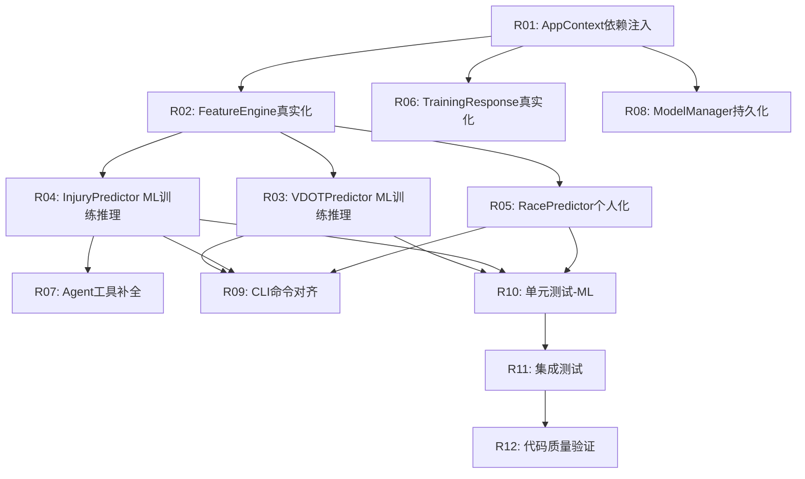

# 开发任务拆解清单 — v0.20.1 ML核心修复

> **文档版本**: v1.0
> **创建日期**: 2026-05-10
> **当前基线**: v0.20.0
> **目标版本**: v0.20.1
> **对齐文档**:
>
> - [需求规格说明书 v8.2](../requirements/REQ_需求规格说明书.md)
> - [架构设计说明书 v7.1.0](../architecture/架构设计说明书.md)
> - [产品规划方案 v9.1](../product/产品规划方案.md)
> - [v0.20.0 开发任务清单 v1.0](./task_list_v0.20.0.md)

***

## 1. 版本概览

### 1.1 版本目标

**主题**: ML核心修复 —— 补全v0.20.0未实现的ML训练与推理核心能力
**核心目标**: 让ML增强预测从"架构完整但核心空心的壳"变为"真正可训练、可推理、可交付"的功能
**问题根因**: v0.20.0开发过程中，自底向上实现了数据模型/CLI/Agent工具/降级策略等"壳"，但ML模型训练(GradientBoosting的fit)和基于真实特征的推理从未实现，导致整个系统实际运行在基础预测模式

### 1.2 问题清单与修复方案

| 编号 | 问题 | 严重度 | 根因 | 修复方案 |
|------|------|--------|------|----------|
| BUG-01 | VDOTPredictor.train_model() 是占位函数，training_samples=0 | 🔴 CRITICAL | 未实现sklearn GradientBoosting训练 | 实现真正的3个分位数模型训练+持久化 |
| BUG-02 | VDOTPredictor._run_ml_inference() 永远走不到 | 🔴 CRITICAL | train_model()不训练→load_model()返回None→降级 | 修复训练后，推理路径自然可达 |
| BUG-03 | FeatureEngine 所有特征值=0 | 🔴 CRITICAL | AppContext缺少4个依赖注入属性 | 补全AppContext依赖注入链 |
| BUG-04 | VDOTPredictor._predict_parametric() 使用硬编码假数据 | 🟡 HIGH | 未从SessionRepo获取真实训练负荷 | 从SessionRepo查询真实TSS序列 |
| BUG-05 | InjuryPredictor._run_ml_inference() 风险值硬编码 | 🟡 HIGH | ML推理代码存在但使用硬编码值 | 实现LR+GBDT集成训练+真实推理 |
| BUG-06 | InjuryPredictor.report_injury() 无持久化 | 🟡 HIGH | 只返回内存结果，不写文件 | 实现injury_labels/目录持久化 |
| BUG-07 | RacePredictor 跑者分类永远"balanced" | 🟡 HIGH | _classify_runner_type()硬编码返回 | 基于历史比赛数据实现真实分类 |
| BUG-08 | 缺少 report_injury Agent工具 | 🟡 HIGH | PredictionEngine已实现但Agent层未对接 | 新增ReportInjuryTool |
| BUG-09 | 缺少 manage_prediction_model Agent工具 | 🟡 HIGH | PredictionEngine已实现但Agent层未对接 | 新增ManagePredictionModelTool |
| BUG-10 | PredictionEngine.manage_model() 未暴露rollback操作 | 🟠 MEDIUM | 只实现了status/train，缺rollback | 补充rollback分支 |
| BUG-11 | predictions.parquet 预测历史存储未实现 | 🟠 MEDIUM | 数据模型存在但无存储逻辑 | ModelManager中实现记录存储与查询 |
| BUG-12 | ModelManager.check_auto_update() 无调用方 | 🟠 MEDIUM | 方法存在但从未被触发 | 在data import后触发检查 |

### 1.3 需求覆盖

| 需求ID | 需求名称 | 优先级 | 覆盖任务 |
|--------|---------|--------|----------|
| REQ-0.20-01 | ML-VDOT趋势预测引擎 | P0 | R01, R02, R03, R04 |
| REQ-0.20-02 | 个人化比赛成绩预测 | P0 | R01, R05 |
| REQ-0.20-03 | ML伤病风险预测 | P0 | R01, R02, R06 |
| REQ-0.20-04 | 伤病报告工具 | P1 | R07 |
| REQ-0.20-05 | 训练响应预测 | P1 | R01, R08 |
| REQ-0.20-06 | 模型管理与校准 | P1 | R09, R10 |
| REQ-0.20-07 | 数据充足度评估 | P1 | R01 (已实现，依赖注入修复后自动生效) |

### 1.4 任务统计

| 维度 | 数量 |
|------|------|
| 任务总数 | 12 |
| P0任务数 | 5 |
| P1任务数 | 5 |
| P2任务数 | 2 |
| 基础层任务 | 2（R01, R02） |
| 预测层任务 | 4（R03, R05, R06, R08） |
| 集成层任务 | 3（R04, R07, R09） |
| 质量层任务 | 3（R10, R11, R12） |

***

## 2. 任务列表

### 2.1 基础层（Foundation）

***

#### R01: AppContext依赖注入链修复

| 属性 | 值 |
|------|------|
| **任务ID** | R01 |
| **所属模块** | `src/core/base/context.py` |
| **优先级** | P0 |
| **前置依赖** | 无 |
| **预估工时** | 6小时 |
| **交付物** | 修改后的 `context.py` |

**任务描述**:

补全架构设计说明书6.8节要求的5个AppContext属性，当前只实现了1个（prediction_engine），缺少4个。这是所有后续ML功能修复的前置条件——没有这些属性，FeatureEngine的所有特征值=0，所有预测器无法获取真实数据。

**具体工作**:

1. 新增 `training_load_analyzer` 延迟属性 — 暴露TrainingLoadAnalyzer
2. 新增 `vdot_calculator` 延迟属性 — 暴露VDOTCalculator
3. 新增 `race_prediction_engine` 延迟属性 — 暴露RacePredictionEngine
4. 新增 `injury_risk_analyzer` 延迟属性 — 暴露InjuryRiskAnalyzer
5. 修改 `prediction_engine` 属性中的依赖注入链 — 按架构设计6.8节精确规范，将4个新属性注入到FeatureEngine/VDOTPredictor/RacePredictor/InjuryPredictor
6. 所有新增属性使用 `get_extension/set_extension` 模式

**验收标准**:

- [ ] 4个新增属性完整实现，使用get_extension/set_extension模式
- [ ] prediction_engine依赖注入链与架构设计6.8节完全一致
- [ ] FeatureEngine接收全部5个依赖：session_repo + training_load_analyzer + hrv_analyzer + body_signal_engine + vdot_calculator
- [ ] VDOTPredictor接收race_engine参数
- [ ] RacePredictor接收race_engine + body_signal_engine参数
- [ ] InjuryPredictor接收injury_analyzer参数
- [ ] `mypy src/core/base/context.py --ignore-missing-imports` 无错误
- [ ] 现有功能回归测试通过

***

#### R02: FeatureEngine特征提取真实化

| 属性 | 值 |
|------|------|
| **任务ID** | R02 |
| **所属模块** | `src/core/prediction/feature_engine.py` |
| **优先级** | P0 |
| **前置依赖** | R01 |
| **预估工时** | 12小时 |
| **交付物** | 修改后的 `feature_engine.py` |

**任务描述**:

当前FeatureEngine因依赖注入缺失，所有特征值=0。R01修复注入链后，需要确保每个特征真正从对应模块获取真实值，而非返回0.0的默认值。

**具体工作**:

1. 修复 `extract_vdot_features()` — 12个特征全部从真实数据源获取：
   - weekly_volume_km: 从session_repo查询最近7天总距离
   - volume_change_rate: 对比本周与上周跑量变化率
   - month_sin/cos: 基于当前月份计算（已正确）
   - ctl_value: 从training_load_analyzer.calculate_ctl()获取
   - tsb_value: 从training_load_analyzer.calculate_tsb()获取
   - atl_ctl_ratio: ATL/CTL比值
   - load_ramp_rate: 从training_load_analyzer获取
   - high_intensity_pct: 从session_repo统计高强度训练占比
   - avg_intensity_factor: 从session_repo统计平均强度因子
   - fatigue_score: 从body_signal_engine.get_fatigue_score()获取
   - resting_hr_deviation: 从hrv_analyzer获取
2. 修复 `extract_injury_features()` — 8个特征全部从真实数据源获取
3. 修复 `extract_race_features()` — 5个特征全部从真实数据源获取
4. 确保特征缺失时（如无心率数据）跳过该特征并记录warning，不阻塞预测
5. 验证同日缓存机制在真实数据下正常工作

**验收标准**:

- [ ] VDOT特征12个全部从真实数据源获取，非零值（有数据时）
- [ ] 伤病风险特征8个全部从真实数据源获取
- [ ] 比赛特征5个全部从真实数据源获取
- [ ] 特征缺失时跳过并记录warning，不抛异常
- [ ] 同日缓存机制生效，日期变更自动失效
- [ ] 特征提取耗时<3秒

***

### 2.2 预测层（Predictor）

***

#### R03: VDOTPredictor ML训练与推理实现

| 属性 | 值 |
|------|------|
| **任务ID** | R03 |
| **所属模块** | `src/core/prediction/vdot_predictor.py` |
| **优先级** | P0 |
| **前置依赖** | R01, R02 |
| **预估工时** | 16小时 |
| **交付物** | 修改后的 `vdot_predictor.py` |

**任务描述**:

这是v0.20.0最核心的缺失——VDOTPredictor.train_model()当前是占位函数（training_samples=0），_run_ml_inference()永远走不到。需要实现真正的GradientBoostingRegressor + 分位数回归训练，以及基于训练模型的推理。

**具体工作**:

1. 重写 `train_model()` — 实现真正的ML训练：
   - 从FeatureEngine获取历史特征矩阵
   - 从SessionRepo获取历史VDOT序列作为标签
   - 训练3个分位数模型(p10/p50/p90)：
     ```python
     GradientBoostingRegressor(
         loss='quantile', alpha=0.1/0.5/0.9,
         n_estimators=100, max_depth=5,
         learning_rate=0.1, random_state=42
     )
     ```
   - 使用TimeSeriesSplit时间序列交叉验证
   - 计算验证误差(MAE/R²)
   - 通过ModelManager持久化模型+元数据
   - 返回真实的ModelTrainingResult
2. 重写 `_run_ml_inference()` — 基于已训练模型推理：
   - 加载3个分位数模型
   - 提取当前特征向量
   - 分别预测p10/p50/p90
   - 构建置信区间(p10, p90)
   - 计算置信度
3. 实现 `get_feature_importance()` — SHAP特征重要性：
   - 使用shap.TreeExplainer
   - 采样近似(max_evals=100)
   - 超时降级为sklearn内置feature_importances_
   - 输出Top3关键特征(name, weight, direction)
4. 修复 `_predict_parametric()` — 使用真实训练负荷：
   - 从SessionRepo查询最近30天TSS序列
   - 传入BanisterIRModel.predict()
   - 不再使用np.full(30, 50.0)硬编码
5. 实现首次预测自动训练流程（冷启动策略）：
   - 数据充足但无模型文件时，自动触发训练
   - Rich进度条提示

**验收标准**:

- [ ] train_model()训练3个GradientBoostingRegressor分位数模型
- [ ] 训练后模型通过ModelManager持久化到~/.nanobot-runner/models/
- [ ] _run_ml_inference()可正常加载模型并推理
- [ ] 分位数回归输出(p10, p50, p90)置信区间
- [ ] SHAP分析输出Top3关键特征，含name/weight/direction
- [ ] SHAP超时降级为sklearn内置feature_importances_
- [ ] _predict_parametric()使用真实TSS序列
- [ ] 首次预测自动训练，Rich进度条提示
- [ ] ML预测推理<2秒，SHAP分析<5秒
- [ ] 模型文件损坏时自动重训，不阻塞用户

***

#### R04: InjuryPredictor ML训练与推理实现

| 属性 | 值 |
|------|------|
| **任务ID** | R04 |
| **优先级** | P0 |
| **前置依赖** | R01, R02 |
| **预估工时** | 16小时 |
| **所属模块** | `src/core/prediction/injury_predictor.py` |

**任务描述**:

InjuryPredictor._run_ml_inference()中所有风险值都是硬编码，需要实现LR+GBDT集成训练和真实推理。

**具体工作**:

1. 实现 `train_model()` — LR+GBDT集成训练：
   - LogisticRegression(penalty='l2', C=0.1, class_weight='balanced', max_iter=1000)
   - CalibratedClassifierCV(lr, method='isotonic', cv=3) 校准概率
   - GradientBoostingClassifier(n_estimators=50, max_depth=3, learning_rate=0.05, min_samples_leaf=30)
   - 集成策略：LR概率×0.4 + GBDT概率×0.6
   - 伤病标签从~/.nanobot-runner/injury_labels/读取作为训练标签
   - 无伤病标签时使用规则基线生成的伪标签
   - 通过ModelManager持久化
2. 重写 `_run_ml_inference()` — 基于已训练模型推理：
   - 加载LR+GBDT集成模型
   - 提取当前伤病特征向量
   - 计算集成概率
   - 生成风险时间线(7/14/21天)
   - SHAP风险因子分析 → Top3触发因子
   - 从特征值计算AcuteLoadRisk/ChronicRisk/BodySignalRisk（非硬编码）
3. 实现 `report_injury()` 持久化：
   - 伤病记录写入~/.nanobot-runner/injury_labels/{injury_id}.json
   - 支持confirmed/suspected/unconfirmed三级标签
   - 返回InjuryReportResult
4. 实现 `load_injury_labels()` — 加载已有伤病标签用于模型训练

**验收标准**:

- [ ] train_model()训练LR+GBDT集成模型，集成权重0.4/0.6
- [ ] CalibratedClassifierCV校准概率
- [ ] _run_ml_inference()使用真实模型推理，非硬编码
- [ ] 风险时间线输出7/14/21天概率曲线
- [ ] Top3风险因子含贡献度（SHAP绝对值均值归一化）
- [ ] AcuteLoadRisk/ChronicRisk/BodySignalRisk从特征值计算
- [ ] report_injury()持久化到~/.nanobot-runner/injury_labels/
- [ ] 伤病标签三级体系完整
- [ ] 三层降级策略完整：ML→LR→规则基线

***

#### R05: RacePredictor个人化实现

| 属性 | 值 |
|------|------|
| **任务ID** | R05 |
| **所属模块** | `src/core/prediction/race_predictor.py` |
| **优先级** | P1 |
| **前置依赖** | R01, R02 |
| **预估工时** | 12小时 |
| **交付物** | 修改后的 `race_predictor.py` |

**任务描述**:

RacePredictor的跑者分类永远返回"balanced"，修正因子永远1.0，Riegel指数永远1.06。需要基于真实历史比赛数据实现个人化。

**具体工作**:

1. 重写 `_classify_runner_type()` — 基于历史比赛数据分类：
   - 短距离(5k/10k)成绩相对好 → "speed"
   - 长距离(半马/全马)成绩相对好 → "endurance"
   - 差异不大 → "balanced"
   - 使用Jack Daniels VDOT等值表判断
2. 重写 `_estimate_correction_factor()` — 基于历史偏差估算修正因子
3. 完善 `fit_riegel_curve()` — 已有scipy.curve_fit实现，需确保从SessionRepo获取真实比赛数据
4. 实现赛前状态修正 — 集成BodySignalEngine：
   - 疲劳度高时预测成绩下调2-5%
   - 恢复状态好时预测成绩上调1-3%
5. 完善配速策略 — 全马输出每5km分段配速（已有框架，需确保基于真实预测时间计算）
6. 实现预测历史记录 — 保存到predictions.parquet

**验收标准**:

- [ ] 跑者分类基于历史比赛数据，非硬编码"balanced"
- [ ] 修正因子基于历史偏差计算，非硬编码1.0
- [ ] Riegel指数从真实比赛数据拟合
- [ ] 赛前状态修正集成BodySignalEngine
- [ ] 全马预测输出包含配速策略建议（每5km分段配速）
- [ ] 预测历史记录保存到predictions.parquet

***

#### R06: TrainingResponsePredictor真实化

| 属性 | 值 |
|------|------|
| **任务ID** | R06 |
| **所属模块** | `src/core/prediction/training_response_predictor.py` |
| **优先级** | P1 |
| **前置依赖** | R01 |
| **预估工时** | 6小时 |
| **交付物** | 修改后的 `training_response_predictor.py` |

**任务描述**:

TrainingResponsePredictor基于BanisterIRModel，当前实现可能使用硬编码参数。需确保使用真实训练状态计算。

**具体工作**:

1. 确保TRIMP计算基于训练类型和强度估算
2. 确保恢复时间估算合理（轻松跑<12h, 节奏跑24-48h, 间歇跑48-72h）
3. 确保banister_fitness_delta/banister_fatigue_delta基于BanisterIRModel计算
4. 验证prediction_type为"parametric"或"basic"

**验收标准**:

- [ ] 返回TrainingResponse数据结构，所有字段完整
- [ ] 基于Banister IR模型计算，参数有生理学意义
- [ ] 恢复时间估算合理（轻松跑<12h, 节奏跑24-48h, 间歇跑48-72h）

***

### 2.3 集成层（Integration）

***

#### R07: Agent工具补全（report_injury + manage_prediction_model）

| 属性 | 值 |
|------|------|
| **任务ID** | R07 |
| **所属模块** | `src/agents/tools.py` |
| **优先级** | P1 |
| **前置依赖** | R04 |
| **预估工时** | 8小时 |
| **交付物** | 修改后的 `tools.py` |

**任务描述**:

PredictionEngine已实现7个方法，但Agent工具层只对接了5个，缺少report_injury和manage_prediction_model。

**具体工作**:

1. 新增 `ReportInjuryTool` — 伤病报告提交工具：
   - 输入参数：injury_type(str), severity(str), date(str)
   - 通过get_context().prediction_engine.report_injury()调用
   - 返回JSON格式（含success/data/message）
2. 新增 `ManagePredictionModelTool` — 模型管理工具：
   - 输入参数：action(str: status/train/rollback), model_type(str), version(str, 可选)
   - 通过get_context().prediction_engine.manage_model()调用
   - 返回JSON格式（含success/data/message）
3. 补充PredictionEngine.manage_model()的rollback分支
4. 更新TOOL_DESCRIPTIONS，包含2个新工具的描述

**验收标准**:

- [ ] ReportInjuryTool完整实现，返回JSON格式
- [ ] ManagePredictionModelTool完整实现，支持status/train/rollback操作
- [ ] PredictionEngine.manage_model()支持rollback操作
- [ ] TOOL_DESCRIPTIONS更新，包含7个预测工具
- [ ] 工具描述清晰，LLM可理解工具用途和参数

***

#### R08: ModelManager数据持久化补全

| 属性 | 值 |
|------|------|
| **任务ID** | R08 |
| **所属模块** | `src/core/prediction/model_manager.py` |
| **优先级** | P1 |
| **前置依赖** | R01 |
| **预估工时** | 8小时 |
| **交付物** | 修改后的 `model_manager.py` |

**任务描述**:

ModelManager缺少predictions.parquet预测历史存储和增量学习自动触发。

**具体工作**:

1. 实现 `record_prediction(record: PredictionRecord)` — 预测历史记录存储：
   - 写入predictions.parquet（按年分片）
   - Schema与架构设计说明书6.6节一致
2. 实现 `query_predictions(prediction_type, start_date, end_date)` — 预测历史查询
3. 实现 `check_and_update_actual(prediction_type)` — 当实际结果可用时回填偏差
4. 实现 `trigger_auto_update_if_needed()` — 增量学习自动触发：
   - 新增数据≥50条
   - 距上次训练>30天
   - 预测误差超过阈值
   - 在data import命令后调用
5. 确保sklearn版本兼容性校验在load_model()中执行

**验收标准**:

- [ ] predictions.parquet按年分片存储，Schema与架构设计一致
- [ ] 预测历史查询支持按类型和日期范围筛选
- [ ] 实际结果回填后自动计算偏差
- [ ] 增量学习触发条件：新增≥50条 / 距上次>30天 / 误差超阈值
- [ ] sklearn版本不兼容时自动触发重训
- [ ] data import后自动检查是否需要增量学习

***

#### R09: CLI命令对齐架构设计

| 属性 | 值 |
|------|------|
| **任务ID** | R09 |
| **所属模块** | `src/cli/commands/prediction.py`, `src/cli/handlers/prediction_handler.py` |
| **优先级** | P2 |
| **前置依赖** | R03, R04, R05 |
| **预估工时** | 6小时 |
| **交付物** | 修改后的CLI文件 |

**任务描述**:

CLI命令功能基本可用，但与架构设计6.9节存在偏差，需要修正。

**具体工作**:

1. 修正 `predict model` 子命令为Typer子命令组：
   - `predict model status --type all` (当前: `predict model status vdot_predictor`)
   - `predict model train --type vdot` (当前: `predict model train vdot_predictor`)
2. 补充CLI命令--help三段式帮助信息（Description + Arguments + Examples）
3. 修正输出格式对齐架构设计6.21节：
   - VDOT预测输出标注"🧠 ML增强预测 | 模型置信度: 高/中/低"
   - 数据中等时输出标注"📊 参数化模型预测"
   - 数据不足时输出提示"当前数据量XX，建议积累更多数据"
4. 训练命令增加Rich进度条

**验收标准**:

- [ ] predict model子命令组与架构设计6.9节一致
- [ ] 每个命令包含--help三段式帮助信息
- [ ] 输出格式与架构设计6.21节一致
- [ ] 模型训练显示Rich进度条

***

### 2.4 质量层（Quality）

***

#### R10: 单元测试 — ML训练与推理

| 属性 | 值 |
|------|------|
| **任务ID** | R10 |
| **所属模块** | `tests/unit/core/prediction/` |
| **优先级** | P0 |
| **前置依赖** | R03, R04, R05 |
| **预估工时** | 12小时 |
| **交付物** | 修改后的测试文件 |

**任务描述**:

现有单元测试覆盖了降级策略和数据模型，但未覆盖ML训练和推理的真实流程。需要新增/修改测试用例。

**具体工作**:

1. `test_vdot_predictor.py` — 新增ML训练与推理测试：
   - test_train_model_with_sufficient_data: 训练3个分位数模型
   - test_train_model_persistence: 训练后模型可持久化和加载
   - test_ml_inference_with_trained_model: 加载模型后推理
   - test_shap_feature_importance: SHAP分析输出Top3
   - test_shap_timeout_fallback: SHAP超时降级
   - test_auto_train_on_first_predict: 首次预测自动训练
   - test_model_corruption_auto_retrain: 模型损坏自动重训
2. `test_injury_predictor.py` — 新增ML训练与推理测试：
   - test_train_lr_gbdt_ensemble: LR+GBDT集成训练
   - test_ensemble_weights: 集成权重0.4/0.6
   - test_injury_label_persistence: 伤病标签持久化
   - test_report_injury_saves_file: report_injury写文件
3. `test_race_predictor.py` — 新增个人化测试：
   - test_classify_runner_type_speed: 速度型分类
   - test_classify_runner_type_endurance: 耐力型分类
   - test_riegel_curve_fit_with_real_data: Riegel拟合
   - test_pre_race_adjustment: 赛前状态修正
4. `test_feature_engine.py` — 修改为使用Mock依赖：
   - Mock TrainingLoadAnalyzer/HRVAnalyzer/BodySignalEngine/VDOTCalculator
   - 验证每个特征从正确依赖获取

**验收标准**:

- [ ] ML训练流程有独立测试用例
- [ ] ML推理流程有独立测试用例
- [ ] SHAP分析有独立测试用例
- [ ] 伤病标签持久化有独立测试用例
- [ ] 跑者分类有独立测试用例
- [ ] 所有测试使用Mock，不依赖真实数据
- [ ] `pytest tests/unit/core/prediction/` 全部通过

***

#### R11: 集成测试 — 端到端ML预测流程

| 属性 | 值 |
|------|------|
| **任务ID** | R11 |
| **所属模块** | `tests/integration/` |
| **优先级** | P1 |
| **前置依赖** | R10 |
| **预估工时** | 8小时 |
| **交付物** | 集成测试文件 |

**任务描述**:

验证从数据查询到ML预测输出的端到端流程。

**具体工作**:

1. 端到端VDOT预测流程：数据充足 → 特征提取 → 模型训练 → ML推理 → SHAP分析
2. 端到端伤病风险预测流程：数据充足 → 特征提取 → LR+GBDT训练 → 集成推理 → 风险时间线
3. 端到端比赛预测流程：比赛记录≥3 → Riegel拟合 → 个人化预测 → 配速策略
4. 降级流程端到端：数据不足 → 基础预测 → 提示信息
5. 跨模块集成测试（架构设计6.19.3节）：
   - CROSS-01: 新数据导入后预测缓存失效
   - CROSS-02: BodySignalEngine → InjuryPredictor数据流
   - CROSS-03: CLI predict → PredictionEngine → 降级链路
   - CROSS-04: Agent工具 → PredictionEngine → 超时处理

**验收标准**:

- [ ] VDOT预测端到端测试通过
- [ ] 伤病风险预测端到端测试通过
- [ ] 比赛预测端到端测试通过
- [ ] 降级流程端到端测试通过
- [ ] 4个跨模块集成测试场景覆盖
- [ ] `pytest tests/integration/` 全部通过

***

#### R12: 代码质量与回归验证

| 属性 | 值 |
|------|------|
| **任务ID** | R12 |
| **所属模块** | 全项目 |
| **优先级** | P2 |
| **前置依赖** | R11 |
| **预估工时** | 4小时 |
| **交付物** | 代码质量报告 |

**任务描述**:

执行全项目代码质量检查和回归验证。

**具体工作**:

1. `ruff format src/ tests/`
2. `ruff check src/ tests/`
3. `mypy src/ --ignore-missing-imports`
4. `pytest tests/` — 全量测试
5. 验证现有CLI命令不受影响
6. 验证现有Agent工具不受影响

**验收标准**:

- [ ] `ruff check` 无错误
- [ ] `mypy` 无错误
- [ ] `pytest` 全部通过，无回归
- [ ] 现有CLI命令和Agent工具功能正常

***

## 3. 依赖关系图



***

## 4. 迭代计划

### 4.1 迭代划分

| 迭代 | 周期 | 任务 | 交付目标 | 准入标准 | 准出标准 |
|------|------|------|----------|----------|----------|
| **Sprint 1** | 第1-2天 | R01, R06 | 基础设施修复：依赖注入链+训练响应真实化 | 无 | FeatureEngine可获取真实特征值 |
| **Sprint 2** | 第3-5天 | R02, R08 | 数据层修复：特征提取真实化+持久化补全 | Sprint 1完成 | 特征值非零，预测历史可存储 |
| **Sprint 3** | 第6-9天 | R03, R04, R05 | 核心预测器修复：VDOT/伤病/比赛ML训练推理 | Sprint 2完成 | ML训练可执行，推理可返回真实结果 |
| **Sprint 4** | 第10-11天 | R07, R09 | 集成层修复：Agent工具+CLI对齐 | Sprint 3完成 | 7个Agent工具+CLI命令全部可用 |
| **Sprint 5** | 第12-14天 | R10, R11, R12 | 质量保障：单元测试+集成测试+代码质量 | Sprint 4完成 | 全量测试通过，代码质量达标 |

### 4.2 并行任务识别

| 并行组 | 可并行任务 | 条件 |
|--------|-----------|------|
| P1 | R06(训练响应) ∥ R02(特征工程) | 两者均只依赖R01 |
| P2 | R03(VDOT) ∥ R04(伤病) ∥ R05(比赛) | 三者均依赖R02，无相互依赖 |
| P3 | R07(Agent) ∥ R09(CLI) | R07依赖R04，R09依赖R03/R04/R05 |

### 4.3 关键路径

```
R01 → R02 → R03 → R10 → R11 → R12
```

关键路径总工时：6+12+16+12+8+4 = 58小时（约7.3天）

***

## 5. 风险与缓解

| 风险 | 等级 | 影响任务 | 缓解措施 |
|------|------|----------|----------|
| sklearn训练在少量数据下过拟合 | 🔴 高 | R03, R04 | 设置最小数据门槛(400条)、正则化、交叉验证、冷启动使用基础预测 |
| 伤病标签数据稀少导致模型欠拟合 | 🟡 中 | R04 | 规则基线生成伪标签、强正则化、类别权重平衡 |
| SHAP计算耗时 | 🟡 中 | R03, R04 | 采样近似(max_evals=100)、超时降级 |
| AppContext扩展影响现有功能 | 🔴 高 | R01 | 回归测试覆盖、新增属性使用get_extension/set_extension模式 |
| FeatureEngine依赖模块接口不匹配 | 🟡 中 | R02 | 先检查各模块实际API，必要时适配 |

***

## 6. 版本成功标准

| 维度 | 标准 | 测量方式 |
|------|------|----------|
| 功能完成 | P0任务100%完成 | 任务清单核对 |
| ML训练可用 | 数据充足时train_model()返回success=True | 单元测试 |
| ML推理可用 | 数据充足时prediction_type="ml_enhanced" | 端到端测试 |
| 特征非零 | 有数据时FeatureEngine特征值≠0 | 单元测试 |
| 代码质量 | ruff/mypy/pytest全通过 | CI检查 |
| 无回归 | 现有CLI和Agent工具功能正常 | 回归测试 |
