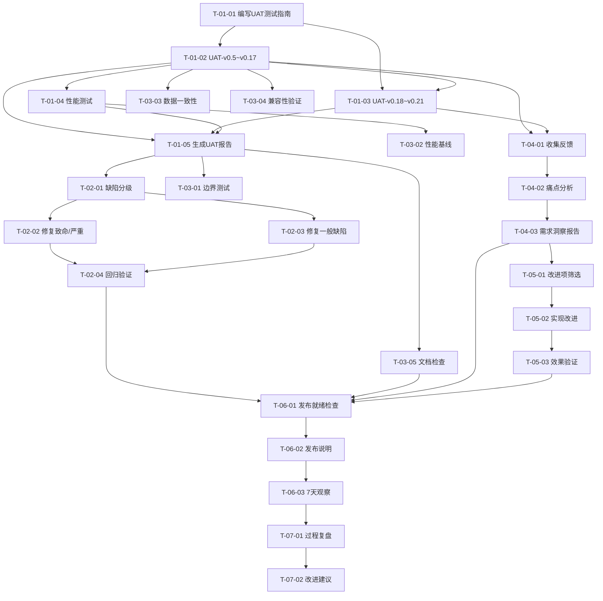

# 开发任务拆解清单 — v0.22.0 质量收口版本

> **文档版本**: v1.0
> **创建日期**: 2026-05-14
> **当前基线**: v0.21.0
> **版本目标**: v0.22.0 质量收口版本（UAT验证/缺陷收敛/质量兜底/需求洞察）
> **需求来源**: REQ_需求规格说明书.md (v9.0) Section 3.3
> **架构依据**: 架构设计说明书.md (v9.0.0) Section 8
> **产品规划**: 产品规划方案.md (v9.5) Section 3.3

***

## 1. 版本概述

### 1.1 版本定位

**版本主题**: 质量收口 + 需求洞察 —— 全量功能稳定性验证 + 用户痛点挖掘与反馈驱动改进

**核心目标**:
1. 通过系统化UAT验证v0.5-v0.21全版本功能稳定性，修复缺陷
2. 基于UAT反馈挖掘用户使用痛点，形成新用户需求
3. 建立反馈驱动的产品改进机制

**架构影响**: v0.22无新模块/新CLI命令/新Agent工具，聚焦质量保障

### 1.2 需求-任务映射总览

| 需求ID | 需求描述 | 优先级 | 任务数 | 总工时(h) |
|--------|---------|--------|--------|-----------|
| REQ-0.22-01 | UAT验证 | P0 | 5 | 40 |
| REQ-0.22-02 | 缺陷收敛 | P0 | 4 | 24 |
| REQ-0.22-03 | 质量兜底 | P0 | 5 | 32 |
| REQ-0.22-04 | 需求洞察 | P1 | 3 | 16 |
| REQ-0.22-05 | 反馈驱动改进 | P1 | 3 | 16 |
| REQ-0.22-06 | 发布准备与观察 | P1 | 3 | 12 |
| REQ-0.22-07 | 过程改进 | P2 | 2 | 6 |
| **合计** | | | **25** | **146** |

***

## 2. 任务清单

### 2.1 P0 任务（REQ-0.22-01：UAT验证）

| 任务ID | 任务名称 | 任务描述 | 前置依赖 | 工时(h) | 验收标准 |
|--------|---------|---------|---------|---------|----------|
| T-01-01 | 编写UAT测试指南 | 基于需求规格REQ-0.22-01，编写覆盖v0.5-v0.21全版本功能的用户验收测试指南，包含测试用例、操作步骤、预期结果 | 无 | 8 | 测试指南覆盖全部7个版本模块，用例数≥27组，每个用例含操作步骤+预期结果 |
| T-01-02 | 执行UAT-v0.5~v0.17模块验证 | 按UAT测试指南执行v0.5+(数据导入/查询/分析)、v0.10+(计划/报告)、v0.17(MCP/Gateway/Cron/透明化/偏好/技能)模块的UAT测试 | T-01-01 | 12 | 按版本模块逐项执行，记录测试结果，输出测试记录表（通过/失败/阻塞） |
| T-01-03 | 执行UAT-v0.18~v0.21模块验证 | 按UAT测试指南执行v0.18(可视化/导出)、v0.19(身体信号)、v0.20(预测模块)、v0.21(数字孪生)模块的UAT测试 | T-01-01 | 8 | 按版本模块逐项执行，记录测试结果，输出测试记录表（通过/失败/阻塞） |
| T-01-04 | 执行UAT-性能测试 | 验证关键操作响应时间：ML预测<5秒、推演<10秒、状态聚合<3秒、批量导入性能 | T-01-02 | 4 | 性能测试报告，所有指标符合v0.21基线 |
| T-01-05 | 生成UAT测试报告 | 汇总全部UAT测试结果，按模块/版本统计通过率，分级缺陷清单，风险评估 | T-01-02, T-01-03, T-01-04 | 8 | P0用例100%通过，P1用例≥90%通过；报告含模块/版本维度汇总+缺陷清单+风险评估 |

### 2.2 P0 任务（REQ-0.22-02：缺陷收敛）

| 任务ID | 任务名称 | 任务描述 | 前置依赖 | 工时(h) | 验收标准 |
|--------|---------|---------|---------|---------|----------|
| T-02-01 | 缺陷分级与分配 | 对UAT发现的缺陷按致命/严重/一般/轻微四级分级，分配修复优先级和责任人 | T-01-05 | 2 | 缺陷清单含分级标注，致命/严重缺陷100%分配修复 |
| T-02-02 | 修复致命/严重缺陷 | 修复UAT发现的所有致命和严重级别缺陷 | T-02-01 | 8 | 致命/严重缺陷100%修复，每个修复通过单元测试验证 |
| T-02-03 | 修复一般缺陷 | 修复UAT发现的一般级别缺陷，修复率≥80% | T-02-01 | 8 | 一般缺陷修复率≥80%，每个修复通过单元测试验证 |
| T-02-04 | 缺陷回归验证 | 对所有已修复缺陷执行回归测试，确认修复有效且无引入新问题 | T-02-02, T-02-03 | 6 | 每个修复的缺陷通过回归测试验证；生成缺陷修复报告含修复清单+回归结果 |

### 2.3 P0 任务（REQ-0.22-03：质量兜底）

| 任务ID | 任务名称 | 任务描述 | 前置依赖 | 工时(h) | 验收标准 |
|--------|---------|---------|---------|---------|----------|
| T-03-01 | 边界测试补充 | 补充核心接口的异常输入、边界值测试用例并执行 | T-01-05 | 8 | 核心接口边界覆盖100%；新增边界测试用例全部通过 |
| T-03-02 | 性能基线建立 | 建立关键操作性能基准数据，作为后续版本性能退化检测依据 | T-01-04 | 4 | 性能基线文档含ML预测/推演/聚合/导入等关键操作基准值 |
| T-03-03 | 数据一致性验证 | 验证VDOT/TSS/CTL/ATL/TSB等核心指标计算结果与v0.21一致 | T-01-02 | 8 | 核心指标计算结果与v0.21完全一致；不一致项有根因分析 |
| T-03-04 | 历史数据兼容性验证 | 验证v0.19及之前的历史数据可正常加载和使用 | T-01-02 | 4 | v0.19及之前数据正常迁移和使用，无兼容性问题 |
| T-03-05 | 文档完整性检查 | 检查所有功能是否有对应文档说明（用户文档+API文档） | T-01-05 | 8 | 100%功能有对应文档说明；缺失文档补充完成；生成质量兜底报告 |

### 2.4 P1 任务（REQ-0.22-04：需求洞察）

| 任务ID | 任务名称 | 任务描述 | 前置依赖 | 工时(h) | 验收标准 |
|--------|---------|---------|---------|---------|----------|
| T-04-01 | 收集UAT反馈与痛点 | 在UAT执行过程中同步收集用户体验反馈，识别使用痛点 | T-01-02, T-01-03 | 4 | 痛点清单含分类（功能性/易用性/性能/文档）和原始反馈 |
| T-04-02 | 痛点分析与需求转化 | 对痛点进行根因分析、优先级排序（影响范围×解决价值），转化为具体需求条目 | T-04-01 | 8 | 识别≥3个有效痛点；形成≥2个新需求条目纳入需求池 |
| T-04-03 | 输出需求洞察报告 | 汇总痛点分析、优先级排序、新需求条目，输出需求洞察报告 | T-04-02 | 4 | 需求洞察报告含痛点分析+优先级排序+新需求条目 |

### 2.5 P1 任务（REQ-0.22-05：反馈驱动改进）

| 任务ID | 任务名称 | 任务描述 | 前置依赖 | 工时(h) | 验收标准 |
|--------|---------|---------|---------|---------|----------|
| T-05-01 | 改进项筛选与排期 | 基于需求洞察报告，筛选高优先级改进项，评估实现成本，制定排期 | T-04-03 | 4 | 改进项清单含优先级+工时估算+排期 |
| T-05-02 | 实现高优先级改进项 | 按排期实现高优先级改进项 | T-05-01 | 8 | 高优先级改进项完成率≥80% |
| T-05-03 | 改进效果验证 | 用户验证改进效果，确认改进有效 | T-05-02 | 4 | 改进项经过验证确认；生成改进实现报告 |

### 2.6 P1 任务（REQ-0.22-06：发布准备与观察）

| 任务ID | 任务名称 | 任务描述 | 前置依赖 | 工时(h) | 验收标准 |
|--------|---------|---------|---------|---------|----------|
| T-06-01 | 发布就绪检查 | 按发布就绪检查单逐项确认：UAT通过/需求洞察完成/改进完成/缺陷清零/性能通过/文档更新/发布说明/回滚方案 | T-02-04, T-03-05, T-04-03, T-05-03 | 4 | 发布就绪检查单所有项满足 |
| T-06-02 | 发布说明与文档更新 | 编写v0.22发布说明（变更摘要/升级指南/已知问题），更新用户文档 | T-06-01 | 4 | 发布说明完成；用户文档更新完成 |
| T-06-03 | 发布后7天观察 | 发布后7天内监控反馈渠道、跟踪关键指标、持续收集反馈、快速响应问题 | T-06-02 | 4 | 发布后7天内无P0级问题；生成发布后观察报告 |

### 2.7 P2 任务（REQ-0.22-07：过程改进）

| 任务ID | 任务名称 | 任务描述 | 前置依赖 | 工时(h) | 验收标准 |
|--------|---------|---------|---------|---------|----------|
| T-07-01 | v0.22过程复盘 | 复盘v0.22质量收口全过程，识别可改进点 | T-06-03 | 4 | 识别并记录≥3个可改进点 |
| T-07-02 | 输出过程改进建议 | 基于复盘结果，输出过程改进建议供后续版本参考 | T-07-01 | 2 | 过程改进建议文档完成 |

***

## 3. 任务依赖关系图

***

## 4. 迭代计划

### 4.1 迭代划分

| 迭代 | 周期 | 任务范围 | 交付目标 | 准入条件 | 准出条件 |
|------|------|----------|----------|----------|----------|
| **Sprint 1** | 第1-2周 | T-01-01 ~ T-01-05 | UAT测试完成，缺陷清单输出 | 架构设计v9.0.0已确认 | UAT报告输出，P0用例100%记录 |
| **Sprint 2** | 第3-4周 | T-02-01 ~ T-02-04, T-03-01 ~ T-03-05 | 缺陷收敛+质量兜底完成 | Sprint 1准出通过 | 致命/严重缺陷清零；质量兜底报告输出 |
| **Sprint 3** | 第5-6周 | T-04-01 ~ T-04-03, T-05-01 ~ T-05-03 | 需求洞察+反馈改进完成 | Sprint 2准出通过 | 需求洞察报告+改进实现报告输出 |
| **Sprint 4** | 第7-9周 | T-06-01 ~ T-06-03, T-07-01 ~ T-07-02 | 发布+观察+复盘 | Sprint 3准出通过 | 发布后观察报告+过程改进建议输出 |

### 4.2 关键里程碑

| 里程碑 | 日期 | 交付物 | 验收标准 |
|--------|------|--------|----------|
| M1: UAT完成 | 第2周末 | UAT测试报告 | P0用例100%通过，P1用例≥90%通过 |
| M2: 缺陷收敛 | 第4周末 | 缺陷修复报告+质量兜底报告 | 致命/严重100%修复，一般≥80% |
| M3: 需求洞察 | 第6周末 | 需求洞察报告+改进实现报告 | ≥3个痛点，≥2个新需求 |
| M4: 发布就绪 | 第7周末 | 发布就绪检查单 | 所有检查项满足 |
| M5: 观察完成 | 第9周末 | 发布后观察报告 | 7天内无P0问题 |

### 4.3 并行任务识别

| 并行组 | 可并行任务 | 前提条件 |
|--------|-----------|----------|
| 并行组A | T-01-02(UAT-v0.5~v0.17) ∥ T-01-03(UAT-v0.18~v0.21) | T-01-01完成 |
| 并行组B | T-02-02(修复致命/严重) ∥ T-02-03(修复一般) | T-02-01完成 |
| 并行组C | T-03-01(边界测试) ∥ T-03-02(性能基线) ∥ T-03-03(数据一致性) ∥ T-03-04(兼容性) | 各自前置依赖满足 |
| 并行组D | T-04-01(收集反馈) ∥ T-03-01~T-03-04(质量兜底) | T-01-02/T-01-03完成 |

***

## 5. 风险与缓解

| 风险 | 等级 | 影响 | 缓解措施 |
|------|------|------|----------|
| UAT测试范围过大 | 中 | Sprint 1延期 | 按模块优先级分层测试，P0模块优先 |
| 缺陷修复引入新缺陷 | 中 | 回归风险 | 每个修复必须通过回归测试(T-02-04) |
| 历史版本兼容性问题 | 中 | 用户数据迁移失败 | 兼容性测试覆盖v0.5+(T-03-04) |
| 需求洞察质量不足 | 低 | 痛点识别不充分 | 多渠道收集反馈，AI辅助分析(T-04-01) |
| 改进项范围蔓延 | 中 | Sprint 3超期 | 明确改进项准入标准，高优先级才纳入(T-05-01) |
| 发布后问题响应延迟 | 低 | 观察期问题处理不及时 | 建立发布后值班机制，P0问题2小时内响应 |

***

## 6. 版本成功标准

| 维度 | 标准 | 测量方式 |
|------|------|----------|
| UAT通过率 | P0用例100%，P1用例≥90% | UAT测试报告 |
| 缺陷修复率 | 致命/严重100%，一般≥80% | 缺陷跟踪报告 |
| 需求洞察 | 识别≥3个有效痛点，形成≥2个新需求 | 需求洞察报告 |
| 反馈改进 | 高优先级改进项完成率≥80% | 改进实现报告 |
| 发布质量 | 发布后7天内无P0级问题 | 发布后观察报告 |
| 文档完整度 | 100%功能有对应文档 | 文档检查清单 |
