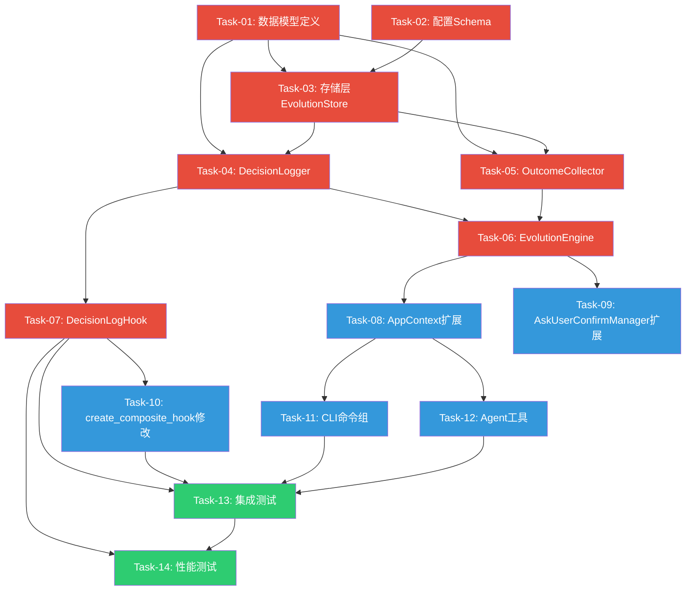

# 任务清单 - v0.23.0 决策追踪模块

> **版本**: v0.23.0
> **创建日期**: 2026-05-20
> **架构依据**: 架构设计说明书 v10.1.0 Section 8.2
> **评审依据**: 架构评审报告_v0.23.0.md（二次评审通过，附带NP-01/NP-02条件）
> **需求依据**: 需求规格说明书 v9.0 Section 4.1（REQ-0.23-01/REQ-0.23-02）

---

## 1. 任务总览

| 指标 | 数值 |
|------|------|
| 任务总数 | 14 |
| P0任务数 | 7 |
| P1任务数 | 5 |
| P2任务数 | 2 |
| 预计总工时 | 68h |

### 任务分层概览

| 层级 | 任务编号 | 说明 |
|------|---------|------|
| 第一层：基础设施 | Task-01~03 | 数据模型、配置Schema、存储层（无外部依赖） |
| 第二层：核心业务逻辑 | Task-04~06 | DecisionLogger、OutcomeCollector、EvolutionEngine |
| 第三层：集成接入 | Task-07~10 | DecisionLogHook、AppContext扩展、AskUserConfirmManager扩展、create_composite_hook修改 |
| 第四层：用户交互 | Task-11~12 | CLI命令组、Agent工具 |
| 第五层：端到端验证 | Task-13~14 | 集成测试、性能测试 |

### 评审遗留问题处理映射

| 评审问题 | 处理任务 | 处理方式 |
|---------|---------|---------|
| NP-01: check_prediction_accuracy()返回类型需调整 | Task-05 | 新增PredictionAccuracyStats dataclass，方法返回tuple[OutcomeRecord, PredictionAccuracyStats] |
| NP-02: TOOL_DESCRIPTIONS中intensity_deviation需移除 | Task-12 | 移除check_plan_execution输出中的intensity_deviation字段，与简化后fidelity公式对齐 |
| NP-03: 字段命名不一致(error_direction vs prediction_direction) | Task-12 | 统一以OutcomeRecord数据模型为准，工具输出中predicted_value/actual_value标注为computed fields |
| NP-04: Hook配置获取路径 | Task-07 | 采用方案A：Hook通过decision_logger间接获取配置 |

---

## 2. 任务列表

### Task-01: 数据模型定义（DecisionLog + OutcomeRecord + PredictionAccuracyStats）

- **优先级**: P0
- **依赖**: 无
- **预计工时**: 4h
- **所属模块**: `src/core/evolution/models.py`
- **描述**: 定义决策追踪模块的三个核心数据模型。DecisionLog和OutcomeRecord为frozen dataclass，PredictionAccuracyStats为新增dataclass（解决NP-01评审问题）。包含to_dict()序列化方法和from_dict()反序列化方法。OutcomeRecord新增prediction_direction字段（overestimate/underestimate/accurate/None）。execution_status统一为5种状态（pending/executed/skipped/modified/failed）。
- **验收标准**:
  - [ ] AC-01: DecisionLog为frozen dataclass，包含全部10个字段（decision_id/timestamp/runner_state/decision_type/tool_call_chain/prediction_snapshot/recommendation_text/execution_status/recommendation_accepted/session_key）
  - [ ] AC-02: OutcomeRecord为frozen dataclass，包含全部11个字段（outcome_id/decision_id/outcome_timestamp/actual_vdot/actual_injury/execution_fidelity/user_feedback_score/user_feedback_text/prediction_error/prediction_direction/session_id）
  - [ ] AC-03: PredictionAccuracyStats为新增dataclass，包含mae/total_pairs/overestimate_rate/underestimate_rate字段
  - [ ] AC-04: DecisionLog.execution_status支持5种状态值（pending/executed/skipped/modified/failed）
  - [ ] AC-05: OutcomeRecord.prediction_direction支持4种值（overestimate/underestimate/accurate/None）
  - [ ] AC-06: to_dict()方法正确序列化所有字段，runner_state/tool_call_chain/prediction_snapshot使用json.dumps
  - [ ] AC-07: from_dict()方法正确反序列化，DecisionType从字符串还原为枚举
  - [ ] AC-08: frozen约束验证：尝试修改字段值抛出FrozenInstanceError
- **TDD要点**:
  - 先写测试：DecisionLog/OutcomeRecord/PredictionAccuracyStats的构造、frozen约束、to_dict序列化、from_dict反序列化、字段校验（execution_status 5种值、prediction_direction 4种值）
  - 后写实现：三个dataclass定义+序列化/反序列化方法

---

### Task-02: 配置Schema定义（EvolutionConfig）

- **优先级**: P0
- **依赖**: 无
- **预计工时**: 2h
- **所属模块**: `src/core/evolution/config.py`
- **描述**: 定义决策追踪模块的配置Schema，遵循项目Pydantic-Settings配置驱动原则，与v0.20 PredictionConfig模式一致。7个配置项：data_dir/async_write_enabled/async_write_queue_size/async_write_max_retries/async_write_retry_backoff/feedback_prompt_frequency/runner_state_fields。支持环境变量覆盖（NANOBOT_EVOLUTION_前缀）。
- **验收标准**:
  - [ ] AC-01: EvolutionConfig继承BaseModel，包含7个配置项，默认值与架构设计一致
  - [ ] AC-02: data_dir默认值为"~/.nanobot-runner"
  - [ ] AC-03: async_write_enabled默认值为False（同步写入优先保证可靠性）
  - [ ] AC-04: runner_state_fields默认值为["vdot", "ctl", "atl", "tsb", "fatigue_score"]
  - [ ] AC-05: 支持环境变量覆盖（NANOBOT_EVOLUTION_前缀）
  - [ ] AC-06: 字段校验：feedback_prompt_frequency > 0，async_write_queue_size > 0，async_write_max_retries >= 0
- **TDD要点**:
  - 先写测试：默认值验证、环境变量覆盖、字段校验（非法值抛出ValidationError）
  - 后写实现：EvolutionConfig类定义

---

### Task-03: 存储层实现（EvolutionStore）

- **优先级**: P0
- **依赖**: Task-01, Task-02
- **预计工时**: 8h
- **所属模块**: `src/core/evolution/evolution_store.py`
- **描述**: 实现EvolutionStore，统一管理决策日志和结果记录的Parquet读写。按月分片存储，路径为`~/.nanobot-runner/decisions/YYYY-MM/decisions_YYYY-MM.parquet`和`~/.nanobot-runner/outcomes/YYYY-MM/outcomes_YYYY-MM.parquet`。默认同步写入，异步写入需配套错误恢复机制（队列+重试+降级+WAL）。新增get_decision_outcome_pairs()方法为v0.24提供便捷查询接口。
- **验收标准**:
  - [ ] AC-01: save_decision()正确写入决策日志到按月分片Parquet文件
  - [ ] AC-02: save_outcome()正确写入结果记录到按月分片Parquet文件
  - [ ] AC-03: query_decisions()支持按日期范围、决策类型过滤，返回list[DecisionLog]
  - [ ] AC-04: query_outcomes()支持按decision_id列表查询，返回list[OutcomeRecord]
  - [ ] AC-05: get_decision_by_id()按ID精确查询单条决策
  - [ ] AC-06: get_decision_outcome_pairs()返回DecisionLog+OutcomeRecord配对数据
  - [ ] AC-07: 目录不存在时自动创建（mkdir -p语义）
  - [ ] AC-08: Parquet文件不存在时创建新文件，存在时追加写入
  - [ ] AC-09: 跨月查询自动扫描多个月份文件，LazyFrame合并过滤
  - [ ] AC-10: 同步写入模式（默认）：直接写入Parquet，保证100%落盘
  - [ ] AC-11: 异步写入模式：写入队列(asyncio.Queue, maxsize=100) + 重试机制(3次, 指数退避) + 降级策略(3次重试失败后同步写入) + WAL日志
  - [ ] AC-12: 空文件处理：查询空Parquet文件不报错，返回空列表
- **TDD要点**:
  - 先写测试：使用tmp_path临时目录；写入+读取验证、跨月查询、空文件处理、同步写入模式、追加写入模式、get_decision_outcome_pairs配对逻辑
  - 后写实现：EvolutionStore类，Polars LazyFrame读写

---

### Task-04: 决策日志记录器（DecisionLogger）

- **优先级**: P0
- **依赖**: Task-01, Task-03
- **预计工时**: 6h
- **所属模块**: `src/core/evolution/decision_logger.py`
- **描述**: 实现DecisionLogger，在Agent迭代生命周期中自动记录决策日志。关键方法：log_decision()创建并持久化决策日志、update_execution_status()更新决策执行状态、get_decision_history()查询决策历史、get_decision_by_id()按ID查询。runner_state仅存储5个字段摘要dict。所有方法通过EvolutionStore持久化，不持有内存缓存。
- **验收标准**:
  - [ ] AC-01: log_decision()创建DecisionLog并调用EvolutionStore.save_decision()持久化
  - [ ] AC-02: update_execution_status()更新execution_status和recommendation_accepted字段，通过save_decision()覆盖更新
  - [ ] AC-03: get_decision_history()支持按日期范围、决策类型过滤，支持limit限制
  - [ ] AC-04: get_decision_by_id()按ID精确查询，返回DecisionLog | None
  - [ ] AC-05: runner_state仅存储5个字段摘要（vdot/ctl/atl/tsb/fatigue_score），不存储完整状态向量
  - [ ] AC-06: tool_call_chain每项仅保留name/arguments摘要/result_summary，不存储完整工具返回
  - [ ] AC-07: DecisionLogger通过构造函数注入EvolutionStore，不持有内存缓存
- **TDD要点**:
  - 先写测试：使用Mock EvolutionStore验证调用正确性；log_decision参数传递验证、update_execution_status状态更新验证、get_decision_history过滤逻辑验证
  - 后写实现：DecisionLogger类

---

### Task-05: 结果回填收集器（OutcomeCollector + PlanExecutionDataAdapter）

- **优先级**: P0
- **依赖**: Task-01, Task-03
- **预计工时**: 10h
- **所属模块**: `src/core/evolution/outcome_collector.py`
- **描述**: 实现OutcomeCollector和PlanExecutionDataAdapter。OutcomeCollector负责结果回填收集，包含check_plan_execution()、check_prediction_accuracy()、record_feedback()、get_outcome_by_decision_id()四个关键方法。PlanExecutionDataAdapter封装PlanManager+PlanExecutionRepository调用，将DailyPlan的actual_distance_km/actual_duration_min/completion_rate映射为忠实度计算所需的体积/时间数据。check_prediction_accuracy()返回类型调整为tuple[OutcomeRecord, PredictionAccuracyStats]（解决NP-01）。fidelity简化公式为体积0.55+时间0.45（强度偏差延后v0.24）。
- **验收标准**:
  - [ ] AC-01: check_plan_execution()通过PlanExecutionDataAdapter获取执行数据，计算fidelity=1-(0.55*体积偏差+0.45*时间偏差)
  - [ ] AC-02: check_prediction_accuracy()返回tuple[OutcomeRecord, PredictionAccuracyStats]，PredictionAccuracyStats包含mae/total_pairs/overestimate_rate/underestimate_rate
  - [ ] AC-03: check_prediction_accuracy()计算prediction_error和prediction_direction（overestimate/underestimate/accurate）
  - [ ] AC-04: check_prediction_accuracy()通过EvolutionStore.get_decision_outcome_pairs()获取配对数据计算MAE
  - [ ] AC-05: record_feedback()创建OutcomeRecord并持久化，支持评分(1-5)/文本/是否采纳
  - [ ] AC-06: get_outcome_by_decision_id()按决策ID查询结果记录
  - [ ] AC-07: PlanExecutionDataAdapter.get_execution_data()封装PlanManager+PlanExecutionRepository调用
  - [ ] AC-08: PlanExecutionDataAdapter返回PlanExecutionData | None，无关联计划时返回None
  - [ ] AC-09: 体积偏差=|实际跑量-推荐跑量|/推荐跑量，时间偏差=|实际时长-推荐时长|/推荐时长
  - [ ] AC-10: 偏差方向判定：predicted > actual*1.05为overestimate，predicted < actual*0.95为underestimate，否则accurate
- **TDD要点**:
  - 先写测试：Mock PlanManager/PlanExecutionRepository/PredictionEngine；fidelity计算公式验证、prediction_error+prediction_direction计算验证、MAE统计验证、PlanExecutionDataAdapter映射验证、record_feedback参数验证
  - 后写实现：OutcomeCollector类 + PlanExecutionDataAdapter类 + PlanExecutionData数据类

---

### Task-06: 薄编排层实现（EvolutionEngine）

- **优先级**: P0
- **依赖**: Task-04, Task-05
- **预计工时**: 4h
- **所属模块**: `src/core/evolution/evolution_engine.py`
- **描述**: 实现EvolutionEngine薄编排层，统一入口委托DecisionLogger和OutcomeCollector执行具体逻辑。关键方法：log_decision/check_plan_execution/check_prediction_accuracy/record_feedback/get_decision_history/get_evolution_status/generate_feedback_prompt。EvolutionStore创建单一实例，DecisionLogger和OutcomeCollector共享。
- **验收标准**:
  - [ ] AC-01: log_decision()委托DecisionLogger.log_decision()
  - [ ] AC-02: check_plan_execution()委托OutcomeCollector.check_plan_execution()，返回tuple[OutcomeRecord, PredictionAccuracyStats]或OutcomeRecord
  - [ ] AC-03: check_prediction_accuracy()委托OutcomeCollector.check_prediction_accuracy()，返回tuple[OutcomeRecord, PredictionAccuracyStats]
  - [ ] AC-04: record_feedback()委托OutcomeCollector.record_feedback()
  - [ ] AC-05: get_decision_history()委托DecisionLogger.get_decision_history()
  - [ ] AC-06: get_evolution_status()返回决策追踪整体状态（总决策数/回填率/平均忠实度/平均预测误差/反馈收集率/数据质量指标）
  - [ ] AC-07: generate_feedback_prompt()复用AskUserConfirmManager生成反馈收集提示
  - [ ] AC-08: DecisionLogger和OutcomeCollector共享同一EvolutionStore实例
- **TDD要点**:
  - 先写测试：Mock DecisionLogger/OutcomeCollector/AskUserConfirmManager；委托调用正确性验证、get_evolution_status指标计算验证、generate_feedback_prompt生成验证
  - 后写实现：EvolutionEngine类

---

### Task-07: DecisionLogHook实现

- **优先级**: P0
- **依赖**: Task-04
- **预计工时**: 8h
- **所属模块**: `src/core/evolution/decision_log_hook.py`
- **描述**: 实现DecisionLogHook，直接继承AgentHook（非ObservabilityHook），作为独立Hook注册。实现before_iteration/before_execute_tools/finalize_content三个钩子方法。状态管理策略：每次对话一条DecisionLog，before_iteration重置状态，finalize_content完成后清理，异常不产生不完整记录。决策类型推断按6级优先级规则。runner_state字段列表通过decision_logger间接获取配置（解决NP-04）。
- **验收标准**:
  - [ ] AC-01: DecisionLogHook直接继承AgentHook（非ObservabilityHook）
  - [ ] AC-02: before_iteration()重置状态（_current_decision_id/_tool_call_chain/_runner_state_snapshot）-> 捕获runner_state摘要(5字段) -> 生成decision_id
  - [ ] AC-03: before_execute_tools()记录工具调用到tool_call_chain（name/arguments摘要/result_summary）
  - [ ] AC-04: finalize_content()推断decision_type(按6级优先级) -> 提取recommendation_text -> 调用DecisionLogger.log_decision() -> 清理状态 -> 返回content原样
  - [ ] AC-05: 决策类型推断优先级：PLAN_ADJUSTMENT(1) > RECOVERY_SUGGESTION(2) > TRAINING_ADVICE(3) > WEATHER_ADVICE(4) > DATA_QUERY(5) > GENERAL(6)
  - [ ] AC-06: 状态管理：每次对话一条DecisionLog，异常场景不产生不完整记录
  - [ ] AC-07: runner_state字段列表通过decision_logger间接获取配置（decision_logger -> store -> config）
  - [ ] AC-08: 与ObservabilityHook独立触发，无状态竞争
- **TDD要点**:
  - 先写测试：Mock AgentHookContext；before_iteration状态重置验证、before_execute_tools工具记录验证、finalize_content决策类型推断优先级验证（含多工具混合场景）、异常场景不产生记录验证、runner_state字段提取验证
  - 后写实现：DecisionLogHook类

---

### Task-08: AppContext扩展（evolution_engine属性）

- **优先级**: P1
- **依赖**: Task-06
- **预计工时**: 3h
- **所属模块**: `src/core/base/context.py`
- **描述**: 在AppContext中新增evolution_engine属性，遵循现有扩展属性模式（get_extension/set_extension延迟初始化）。创建EvolutionConfig、单一EvolutionStore实例、DecisionLogger、OutcomeCollector（含PlanExecutionDataAdapter）、EvolutionEngine。确保EvolutionStore共享实例（P-10修复）。
- **验收标准**:
  - [ ] AC-01: AppContext.evolution_engine属性返回EvolutionEngine实例
  - [ ] AC-02: 延迟初始化：首次访问时创建，后续访问返回缓存实例
  - [ ] AC-03: EvolutionStore创建单一实例，DecisionLogger和OutcomeCollector共享
  - [ ] AC-04: EvolutionConfig从全局配置派生data_dir
  - [ ] AC-05: OutcomeCollector注入prediction_engine和plan_execution_adapter
  - [ ] AC-06: EvolutionEngine注入ask_user_confirm_manager
  - [ ] AC-07: TYPE_CHECKING中添加EvolutionEngine的import
- **TDD要点**:
  - 先写测试：使用AppContextFactory.create_for_testing()创建测试上下文；验证evolution_engine属性延迟初始化、EvolutionStore共享实例、依赖注入正确性
  - 后写实现：AppContext新增evolution_engine property

---

### Task-09: AskUserConfirmManager扩展（DECISION_FEEDBACK场景）

- **优先级**: P1
- **依赖**: Task-06
- **预计工时**: 3h
- **所属模块**: `src/core/plan/ask_user_confirm.py`
- **描述**: 在ConfirmScenario枚举中新增DECISION_FEEDBACK场景，在AskUserConfirmManager中新增create_decision_feedback_prompt()方法。反馈提示包含决策摘要、评分选项(1-5)、文本反馈输入、是否采纳选项。
- **验收标准**:
  - [ ] AC-01: ConfirmScenario枚举新增DECISION_FEEDBACK = "decision_feedback"
  - [ ] AC-02: create_decision_feedback_prompt()接受decision_id和decision_summary参数
  - [ ] AC-03: 反馈提示包含评分选项(1-5星)、文本反馈说明、是否采纳选项
  - [ ] AC-04: ConfirmPrompt的scenario为DECISION_FEEDBACK
  - [ ] AC-05: 不影响现有ConfirmScenario枚举值和现有方法
- **TDD要点**:
  - 先写测试：ConfirmScenario.DECISION_FEEDBACK枚举值验证、create_decision_feedback_prompt返回值结构验证、ConfirmPrompt字段验证
  - 后写实现：枚举扩展 + 新增方法

---

### Task-10: create_composite_hook()修改

- **优先级**: P1
- **依赖**: Task-07
- **预计工时**: 3h
- **所属模块**: `src/core/transparency/__init__.py`
- **描述**: 修改create_composite_hook()工厂函数，新增可选参数decision_logger: DecisionLogger | None = None。仅在decision_logger非None时延迟import DecisionLogHook并注册。transparency模块不反向import evolution模块，避免循环依赖。
- **验收标准**:
  - [ ] AC-01: create_composite_hook()新增可选参数decision_logger: DecisionLogger | None = None
  - [ ] AC-02: decision_logger为None时不注册DecisionLogHook（向后兼容）
  - [ ] AC-03: decision_logger非None时延迟import DecisionLogHook并注册
  - [ ] AC-04: transparency模块不反向import evolution模块（无循环依赖）
  - [ ] AC-05: 现有调用方无需修改（新增可选参数，默认None）
  - [ ] AC-06: 验证无循环依赖：python -c "from src.core.evolution import EvolutionEngine" 正常
- **TDD要点**:
  - 先写测试：decision_logger=None时Hook列表不变、decision_logger非None时Hook列表包含DecisionLogHook、循环依赖验证
  - 后写实现：create_composite_hook()签名变更 + 条件注册逻辑

---

### Task-11: CLI命令组（evolution命令）

- **优先级**: P1
- **依赖**: Task-08
- **预计工时**: 6h
- **所属模块**: `src/cli/commands/evolution.py` + `src/cli/handlers/evolution_handler.py`
- **描述**: 新增evolution CLI命令组，包含5个命令：history/feedback/accuracy/fidelity/status。遵循现有CLI命令注册模式（创建evolution_app -> 在__init__.py导入 -> 在app.py注册）。创建EvolutionHandler封装业务逻辑调用层。
- **验收标准**:
  - [ ] AC-01: evolution history [--start YYYY-MM-DD] [--end YYYY-MM-DD] [--type TYPE] 查询决策历史
  - [ ] AC-02: evolution feedback <decision_id> --score 4 [--text "很好"] [--accepted] 记录用户反馈
  - [ ] AC-03: evolution accuracy [--days 30] 查看预测准确度统计（含MAE和偏差方向）
  - [ ] AC-04: evolution fidelity [--days 30] 查看执行忠实度统计
  - [ ] AC-05: evolution status 查看决策追踪整体状态
  - [ ] AC-06: CLI命令注册：__init__.py导入evolution_app，app.py注册add_typer
  - [ ] AC-07: EvolutionHandler通过AppContext.evolution_engine调用业务逻辑
  - [ ] AC-08: Rich格式化输出，与现有CLI风格一致
- **TDD要点**:
  - 先写测试：EvolutionHandler各方法调用验证、CLI命令参数解析验证（使用typer.testing.CliRunner）
  - 后写实现：evolution.py命令定义 + evolution_handler.py业务逻辑

---

### Task-12: Agent工具（4个决策追踪工具）

- **优先级**: P1
- **依赖**: Task-08
- **预计工时**: 6h
- **所属模块**: `src/agents/tools_evolution.py` + `src/agents/tools.py`
- **描述**: 新增4个Agent工具：record_feedback/check_plan_execution/check_prediction_accuracy/get_decision_history。遵循现有工具注册模式（继承BaseTool -> 在RunnerTools中添加业务方法 -> 在create_tools()中注册 -> 在TOOL_DESCRIPTIONS中添加描述）。处理评审遗留问题：移除check_plan_execution输出中的intensity_deviation（NP-02），统一字段命名为prediction_direction（NP-03）。
- **验收标准**:
  - [ ] AC-01: RecordFeedbackTool实现：decision_id + score(1-5) + text? + accepted? -> OutcomeRecord
  - [ ] AC-02: CheckPlanExecutionTool实现：decision_id -> OutcomeRecord（输出含execution_fidelity/volume_deviation/time_deviation，不含intensity_deviation）
  - [ ] AC-03: CheckPredictionAccuracyTool实现：decision_id -> tuple[OutcomeRecord, PredictionAccuracyStats]（输出含prediction_error/prediction_direction/mae，不含error_direction）
  - [ ] AC-04: GetDecisionHistoryTool实现：start_date? + end_date? + type? + limit? -> list[DecisionLog]
  - [ ] AC-05: RunnerTools新增4个业务方法，调用AppContext.evolution_engine
  - [ ] AC-06: TOOL_DESCRIPTIONS新增4个工具描述，字段命名与OutcomeRecord一致
  - [ ] AC-07: check_plan_execution输出移除intensity_deviation（NP-02修复）
  - [ ] AC-08: 字段命名统一为prediction_direction（非error_direction），predicted_value/actual_value标注为computed fields（NP-03修复）
  - [ ] AC-09: 工具输出格式：JSON含success/data/message
- **TDD要点**:
  - 先写测试：4个工具类的execute方法验证、RunnerTools业务方法验证、TOOL_DESCRIPTIONS格式验证
  - 后写实现：4个Tool类 + RunnerTools方法 + TOOL_DESCRIPTIONS更新

---

### Task-13: 集成测试

- **优先级**: P2
- **依赖**: Task-07, Task-10, Task-11, Task-12
- **预计工时**: 4h
- **所属模块**: `tests/integration/test_evolution_integration.py`
- **描述**: 端到端集成测试，验证决策追踪模块从Hook触发到Parquet落盘的完整流程。关键场景：DecisionLogHook与ObservabilityHook独立触发无冲突、Agent完整对话后检查Parquet文件内容、check_plan_execution从PlanExecutionDataAdapter获取数据到OutcomeRecord落盘、CLI命令端到端调用。
- **验收标准**:
  - [ ] AC-01: Hook触发到Parquet落盘端到端流程：模拟Agent对话 -> 检查decisions/目录Parquet文件包含正确DecisionLog
  - [ ] AC-02: DecisionLogHook与ObservabilityHook独立触发无冲突：双Hook并行触发，各自输出独立完整
  - [ ] AC-03: check_plan_execution端到端：创建决策 -> 回填结果 -> 检查outcomes/目录Parquet文件
  - [ ] AC-04: CLI命令端到端：evolution history/status命令调用返回正确数据
  - [ ] AC-05: DecisionLog与OutcomeRecord通过decision_id正确关联
- **TDD要点**:
  - 使用tmp_path临时目录；模拟Agent对话流程（构造AgentHookContext）；验证Parquet文件内容；禁止Mock EvolutionStore（保持Parquet读写真实性）

---

### Task-14: 性能测试

- **优先级**: P2
- **依赖**: Task-07, Task-13
- **预计工时**: 4h
- **所属模块**: `tests/performance/test_evolution_performance.py`
- **描述**: 验证Hook接入对主流程延迟的影响，以及EvolutionStore的读写性能。关键指标：Hook接入延迟<100ms、同步写入延迟<50ms、1年范围查询<2秒。
- **验收标准**:
  - [ ] AC-01: before_iteration延迟<50ms（runner_state摘要O(1)提取）
  - [ ] AC-02: before_execute_tools延迟<10ms（内存追加操作）
  - [ ] AC-03: finalize_content延迟<100ms（含log_decision同步写入）
  - [ ] AC-04: 同步写入延迟<50ms（单条DecisionLog写入Parquet）
  - [ ] AC-05: 1年范围查询<2秒（~500条记录）
  - [ ] AC-06: 对比有/无DecisionLogHook的finalize_content耗时差异<100ms
- **TDD要点**:
  - 使用time.perf_counter()测量耗时；多次运行取中位数；构造不同数据量场景（10/100/500/1000条）

---

## 3. 依赖关系图



> 图例：红色=P0核心功能，蓝色=P1集成功能，绿色=P2验证功能

---

## 4. 迭代计划

| 迭代 | 任务 | 预计工时 | 交付目标 |
|------|------|---------|---------|
| 迭代1（Day 1-2） | Task-01, Task-02 | 6h | 数据模型+配置Schema完成，单元测试通过 |
| 迭代2（Day 3-5） | Task-03 | 8h | EvolutionStore存储层完成，Parquet读写+按月分片+同步写入测试通过 |
| 迭代3（Day 5-7） | Task-04, Task-05 | 16h | DecisionLogger+OutcomeCollector核心业务逻辑完成，单元测试通过 |
| 迭代4（Day 8-9） | Task-06, Task-07 | 12h | EvolutionEngine薄编排层+DecisionLogHook完成，Hook接入测试通过 |
| 迭代5（Day 10-11） | Task-08, Task-09, Task-10 | 9h | AppContext扩展+AskUserConfirmManager扩展+create_composite_hook修改完成 |
| 迭代6（Day 12-14） | Task-11, Task-12 | 12h | CLI命令组+Agent工具完成，用户交互层可用 |
| 迭代7（Day 15-16） | Task-13, Task-14 | 8h | 集成测试+性能测试通过，全部验收标准达成 |

**总预计工时**: 68h（约8.5个工作日）

### 里程碑检查点

| 里程碑 | 检查点 | 通过标准 |
|--------|--------|---------|
| M1: 基础设施就绪 | 迭代1-2完成 | `pytest tests/unit/core/evolution/test_models.py tests/unit/core/evolution/test_config.py tests/unit/core/evolution/test_evolution_store.py` 全部通过 |
| M2: 核心逻辑就绪 | 迭代3-4完成 | `pytest tests/unit/core/evolution/` 全部通过；DecisionLogHook可独立触发 |
| M3: 集成接入就绪 | 迭代5完成 | AppContext.evolution_engine可正常获取；create_composite_hook()可选注册DecisionLogHook |
| M4: 用户交互就绪 | 迭代6完成 | `uv run nanobotrun evolution status` 可正常执行；Agent工具可调用 |
| M5: 发布就绪 | 迭代7完成 | 集成测试+性能测试通过；Hook延迟<100ms；同步写入<50ms |

---

## 5. 风险与缓解

| 风险 | 等级 | 影响范围 | 缓解措施 | 关联任务 |
|------|------|---------|---------|---------|
| DecisionLogHook与ObservabilityHook状态竞争 | HIGH | 决策记录完整性 | DecisionLogHook独立继承AgentHook（P-01已修复），集成测试验证独立性 | Task-07, Task-13 |
| PlanManager缺少批量执行数据接口 | HIGH | REQ-0.23-02交付 | PlanExecutionDataAdapter封装PlanManager+PlanExecutionRepository调用（P-02已修复） | Task-05 |
| 异步写入失败导致决策日志丢失 | MEDIUM | 决策记录完整性 | 默认同步写入（P-04已修复），异步需配套队列+重试+降级+WAL | Task-03 |
| runner_state摘要字段与v0.24不一致 | MEDIUM | v0.24个性化学习 | 明确5字段定义（P-02已修复），EvolutionConfig.runner_state_fields可配置 | Task-02, Task-07 |
| Hook注册方式变更影响现有Agent启动流程 | MEDIUM | CLI/Gateway启动 | create_composite_hook()可选参数注入（P-06已修复），不改变现有签名 | Task-10 |
| 强度分布数据缺失导致忠实度不完整 | LOW | 执行忠实度准确性 | fidelity简化为体积+时间偏差（P-09已修复），强度偏差延后v0.24 | Task-05 |
| Parquet按月分片跨月查询性能 | LOW | 大范围查询体验 | EvolutionStore自动扫描多月份文件，LazyFrame合并过滤；个人场景~500条/年 | Task-03 |
| 反馈收集率低于30% | LOW | 反馈数据质量 | 复用AskUserConfirmManager已有交互模式；Agent主动触发反馈提示 | Task-09 |

---

## 6. 文件交付清单

### 新增文件

| 文件路径 | 所属任务 | 说明 |
|---------|---------|------|
| `src/core/evolution/__init__.py` | Task-01 | 模块导出 |
| `src/core/evolution/models.py` | Task-01 | DecisionLog + OutcomeRecord + PredictionAccuracyStats |
| `src/core/evolution/config.py` | Task-02 | EvolutionConfig配置Schema |
| `src/core/evolution/evolution_store.py` | Task-03 | EvolutionStore Parquet按月分片存储 |
| `src/core/evolution/decision_logger.py` | Task-04 | DecisionLogger决策日志记录器 |
| `src/core/evolution/outcome_collector.py` | Task-05 | OutcomeCollector + PlanExecutionDataAdapter |
| `src/core/evolution/evolution_engine.py` | Task-06 | EvolutionEngine薄编排层 |
| `src/core/evolution/decision_log_hook.py` | Task-07 | DecisionLogHook独立Hook |
| `src/cli/commands/evolution.py` | Task-11 | evolution CLI命令组 |
| `src/cli/handlers/evolution_handler.py` | Task-11 | evolution业务逻辑调用层 |
| `src/agents/tools_evolution.py` | Task-12 | 4个决策追踪Agent工具类 |
| `tests/unit/core/evolution/__init__.py` | Task-01 | 测试包初始化 |
| `tests/unit/core/evolution/test_models.py` | Task-01 | 数据模型单元测试 |
| `tests/unit/core/evolution/test_config.py` | Task-02 | 配置Schema单元测试 |
| `tests/unit/core/evolution/test_evolution_store.py` | Task-03 | 存储层单元测试 |
| `tests/unit/core/evolution/test_decision_logger.py` | Task-04 | DecisionLogger单元测试 |
| `tests/unit/core/evolution/test_outcome_collector.py` | Task-05 | OutcomeCollector单元测试 |
| `tests/unit/core/evolution/test_evolution_engine.py` | Task-06 | EvolutionEngine单元测试 |
| `tests/unit/core/evolution/test_decision_log_hook.py` | Task-07 | DecisionLogHook单元测试 |
| `tests/integration/test_evolution_integration.py` | Task-13 | 集成测试 |
| `tests/performance/test_evolution_performance.py` | Task-14 | 性能测试 |

### 修改文件

| 文件路径 | 所属任务 | 修改内容 |
|---------|---------|---------|
| `src/core/base/context.py` | Task-08 | AppContext新增evolution_engine property |
| `src/core/plan/ask_user_confirm.py` | Task-09 | ConfirmScenario新增DECISION_FEEDBACK + create_decision_feedback_prompt()方法 |
| `src/core/transparency/__init__.py` | Task-10 | create_composite_hook()新增decision_logger可选参数 |
| `src/cli/commands/__init__.py` | Task-11 | 导入evolution_app |
| `src/cli/app.py` | Task-11 | 注册evolution_app |
| `src/agents/tools.py` | Task-12 | RunnerTools新增4个业务方法 + TOOL_DESCRIPTIONS更新 |

---

## 7. 验证检查清单

每个任务完成后，开发工程师必须执行以下验证：

```bash
# 1. 单元测试
uv run pytest tests/unit/core/evolution/ -v

# 2. 代码规范
uv run ruff check src/core/evolution/ src/agents/tools_evolution.py src/cli/commands/evolution.py src/cli/handlers/evolution_handler.py

# 3. 类型检查
uv run mypy src/core/evolution/ --ignore-missing-imports

# 4. 循环依赖检查
python -c "from src.core.evolution import EvolutionEngine; print('OK')"

# 5. 全量回归
uv run pytest tests/ -v --timeout=60
```
