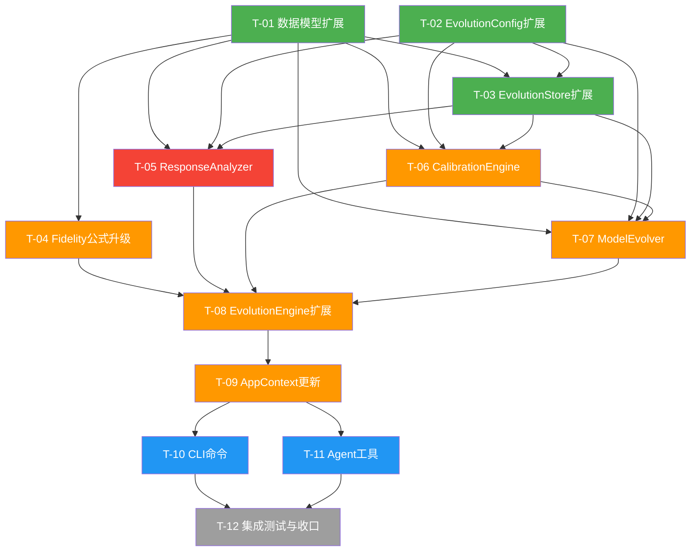

# 开发任务拆解清单 - v0.24.0 个性化学习

> **文档版本**: v1.0
> **创建日期**: 2026-05-20
> **架构基线**: 架构设计说明书 v11.1.0 (评审通过版)
> **需求基线**: REQ_需求规格说明书 v10.0 Section 4.2
> **评审基线**: 架构评审报告_v0.24.0 (4 HIGH + 4 MEDIUM 已在v11.1.0修复)
> **代码基线**: v0.23.0 (feature-0.24.0 worktree)

---

## 1. 版本概述

### 1.1 版本目标

v0.24.0 个性化学习 —— 让系统理解"这个跑者对什么训练响应最好"，并校准预测偏差。

### 1.2 核心交付

| 需求ID | 需求描述 | 优先级 | 核心组件 |
|--------|---------|--------|----------|
| REQ-0.24-01 | 训练响应性分析 | P0 | ResponseAnalyzer |
| REQ-0.24-02 | 预测校准层 | P1 | CalibrationEngine |
| REQ-0.24-03 | 个人化模型进化 | P1 | ModelEvolver |
| P-09遗留 | Fidelity公式升级为三维度 | P1 | OutcomeCollector |

### 1.3 排除范围

| 排除项 | 理由 | 计划版本 |
|--------|------|----------|
| REQ-0.24-04 最佳训练窗口预测 | P2优先级，CTL-VDOT关联分析需>=6个月数据 | v0.25+ |
| 自动校准触发 | 校准需用户手动触发 | v0.25 |
| PredictionEngine内部修改 | 遵循无侵入原则 | 不计划 |

---

## 2. 任务总览

### 2.1 任务统计

| 统计项 | 数值 |
|--------|------|
| 总任务数 | 12 |
| P0任务 | 3 |
| P1任务 | 8 |
| P2任务 | 1 |
| 新增文件 | 5 |
| 修改文件 | 8 |
| 预估总工时 | 9-15天 |

### 2.2 任务依赖关系图



### 2.3 并行执行策略

```mermaid
gantt
    title v0.24.0 任务执行甘特图
    dateFormat X
    axisFormat %s

    section 基础层
    T-01 数据模型扩展       :a1, 0, 1
    T-02 EvolutionConfig扩展 :a2, 0, 1

    section 存储层
    T-03 EvolutionStore扩展  :b1, after a1, 2

    section 核心逻辑层(可并行)
    T-04 Fidelity公式升级    :c1, after a1, 2
    T-05 ResponseAnalyzer    :c2, after b1, 3
    T-06 CalibrationEngine   :c3, after b1, 3

    section 核心逻辑层(串行)
    T-07 ModelEvolver        :d1, after c3, 2

    section 集成层
    T-08 EvolutionEngine扩展 :e1, after c1 c2 c3 d1, 2
    T-09 AppContext更新       :e2, after e1, 1

    section 表现层(可并行)
    T-10 CLI命令             :f1, after e2, 2
    T-11 Agent工具           :f2, after e2, 2

    section 收口
    T-12 集成测试与收口       :g1, after f1 f2, 2
```



**并行窗口说明**:

| 并行组 | 可并行任务 | 前置依赖 | 说明 |
|--------|-----------|----------|------|
| 基础层 | T-01 + T-02 | 无 | 数据模型与配置互不依赖 |
| 核心逻辑层 | T-04 + T-05 + T-06 | T-01/T-02/T-03 | Fidelity升级/RA/CE三者互不依赖 |
| 表现层 | T-10 + T-11 | T-09 | CLI与Agent工具互不依赖 |

---

## 3. 任务详细清单

---

### T-01: v0.24数据模型扩展

| 属性 | 值 |
|------|-----|
| 任务ID | T-01 |
| 优先级 | P0 |
| 依赖任务 | 无 |
| 预估复杂度 | M (1天) |
| 涉及文件 | `src/core/evolution/models.py`, `src/core/evolution/__init__.py` |

**任务描述**:

在现有 `models.py` 中追加v0.24新增的6个frozen dataclass，更新 `__init__.py` 导出列表。

**新增数据模型**:

1. `TrainingTypeResponse` — 单训练类型响应数据
2. `TrainingResponseReport` — 训练响应性分析报告
3. `CalibrationProfile` — 校准配置(含 `from_dict()`/`default()` 类方法)
4. `CalibrationReport` — 校准报告(含 `from_dict()` 类方法，标注"输出专用")
5. `ParameterChange` — 参数变化记录
6. `ModelEvolutionResult` — 模型进化结果(含 `from_dict()` 类方法，标注"输出专用")

**验收标准**:

- [ ] AC-01: 6个frozen dataclass定义完整，字段与架构设计Section 8.3.4一致
- [ ] AC-02: 所有dataclass包含 `to_dict()` 方法
- [ ] AC-03: CalibrationProfile包含 `from_dict()` 和 `default()` 类方法
- [ ] AC-04: CalibrationReport和ModelEvolutionResult包含 `from_dict()` 类方法(LOW-1整改)
- [ ] AC-05: CalibrationProfile移除bias字段(MEDIUM-1整改: 仅scale修正)
- [ ] AC-06: CalibrationReport移除bias_before/bias_after字段(MEDIUM-1整改)
- [ ] AC-07: `__init__.py` 更新 `__all__` 导出列表包含6个新类
- [ ] AC-08: 单元测试覆盖所有dataclass的to_dict/from_dict/default方法

**测试要求**:

- 新增/扩展 `tests/unit/core/evolution/test_models.py`
- 测试每个dataclass的构造、to_dict、from_dict、边界值
- 测试CalibrationProfile.default()返回scale=1.0
- 测试frozen dataclass不可变性

---

### T-02: EvolutionConfig校准配置扩展

| 属性 | 值 |
|------|-----|
| 任务ID | T-02 |
| 优先级 | P0 |
| 依赖任务 | 无 |
| 预估复杂度 | S (0.5天) |
| 涉及文件 | `src/core/evolution/config.py` |

**任务描述**:

在现有 `EvolutionConfig` 中追加6个校准相关配置项，保持frozen dataclass不可变性。

**新增配置项**:

```python
calibration_alpha: float = 0.7              # EMA更新系数
calibration_max_amplitude: float = 0.10     # 校准幅度上限 (±10%)
calibration_min_samples: int = 10           # 校准触发最低样本数
response_min_fidelity: float = 0.7          # 响应分析最低fidelity门槛
response_min_samples_per_type: int = 5      # 每训练类型最低样本数
window_min_months: int = 6                  # 训练窗口分析最低月数
```

**验收标准**:

- [ ] AC-01: 6个新配置项追加至EvolutionConfig，默认值与架构设计一致
- [ ] AC-02: `__post_init__` 增加新配置项的合法性校验(alpha在0-1之间, amplitude在0-1之间, min_samples>=1等)
- [ ] AC-03: `to_dict()` 包含新配置项输出
- [ ] AC-04: `from_dict()` 兼容旧配置(无新字段时使用默认值)
- [ ] AC-05: 单元测试覆盖新配置项的默认值、合法性校验、序列化/反序列化

**测试要求**:

- 扩展 `tests/unit/core/evolution/test_config.py`
- 测试默认值正确性
- 测试非法参数校验(alpha<0, alpha>1, amplitude<0等)
- 测试from_dict兼容旧配置(无新key时使用默认值)

---

### T-03: EvolutionStore校准/参数持久化方法扩展

| 属性 | 值 |
|------|-----|
| 任务ID | T-03 |
| 优先级 | P0 |
| 依赖任务 | T-01, T-02 |
| 预估复杂度 | M (1.5天) |
| 涉及文件 | `src/core/evolution/evolution_store.py` |

**任务描述**:

在现有EvolutionStore中新增5个方法，支持校准配置JSON读写、预测-实际配对数据提取、模型参数持久化。

**新增方法**:

1. `save_calibration_profile(profile: CalibrationProfile) -> None` — 保存校准配置到JSON
2. `load_calibration_profile(model_type: str) -> CalibrationProfile | None` — 加载校准配置
3. `get_prediction_actual_pairs(model_type: str, min_count: int = 10) -> list[tuple[float, float]]` — 获取预测-实际配对数据
4. `save_model_params(model_type: str, params: dict) -> None` — 保存模型进化参数覆盖值
5. `load_model_params(model_type: str) -> dict | None` — 加载模型进化参数覆盖值

**关键实现要点**:

- calibrations/目录由EvolutionStore在首次写入时自动创建(`mkdir(parents=True, exist_ok=True)`) — MEDIUM-3整改
- 存储路径: `{data_dir}/calibrations/{model_type}_calibration.json` 和 `{data_dir}/calibrations/{model_type}_params.json`
- `get_prediction_actual_pairs()` 实现逻辑(HIGH-2整改):
  - 从DecisionLog.prediction_snapshot提取predicted值，从OutcomeRecord提取actual值
  - prediction_snapshot标准Schema:
    - VDOT: `{"predicted_vdot": float, "model_type": "vdot", ...}`
    - 伤病: `{"injury_risk_probability": float, "model_type": "injury", ...}`
    - 训练响应: `{"predicted_vdot_impact": float, "model_type": "training_response", ...}`
  - 过滤: 仅返回predicted和actual均非None的配对; 配对数 < min_count时返回空列表

**验收标准**:

- [ ] AC-01: save/load_calibration_profile正确读写JSON文件
- [ ] AC-02: calibrations/目录在首次写入时自动创建
- [ ] AC-03: get_prediction_actual_pairs按model_type正确提取predicted和actual值
- [ ] AC-04: get_prediction_actual_pairs在配对数 < min_count时返回空列表
- [ ] AC-05: save/load_model_params正确读写JSON文件
- [ ] AC-06: load方法在文件不存在时返回None(不抛异常)
- [ ] AC-07: 单元测试覆盖所有新增方法，含边界条件(空数据/文件不存在/格式错误)

**测试要求**:

- 扩展 `tests/unit/core/evolution/test_evolution_store.py`
- 使用tmp_path临时目录进行文件读写测试
- 测试get_prediction_actual_pairs的三种model_type提取逻辑
- 测试目录自动创建
- 测试文件不存在时的优雅降级

---

### T-04: Fidelity公式升级为三维度

| 属性 | 值 |
|------|-----|
| 任务ID | T-04 |
| 优先级 | P1 |
| 依赖任务 | T-01 |
| 预估复杂度 | M (1.5天) |
| 涉及文件 | `src/core/evolution/outcome_collector.py` |

**任务描述**:

将fidelity公式从v0.23的双维度(体积0.55+时间0.45)升级为v0.24的三维度(体积0.40+强度0.30+时间0.30)，完成P-09遗留项。

**修改内容**:

1. PlanExecutionData新增2个字段:
   - `planned_intensity_factor: float` — 计划强度因子(TSS/min)
   - `actual_intensity_factor: float` — 实际强度因子(TSS/min)

2. calculate_fidelity()函数升级:
   - 新公式: `1 - (0.40 * 体积偏差 + 0.30 * 强度偏差 + 0.30 * 时间偏差)`
   - 强度偏差: `abs(actual_intensity_factor - planned_intensity_factor) / planned_intensity_factor`
   - 向后兼容: 若planned_intensity_factor为0(旧数据无强度信息)，回退到v0.23双维度公式

3. PlanExecutionDataAdapter扩展:
   - 新增TrainingLoadAnalyzer依赖(用于计算session的TSS值)
   - actual_intensity_factor计算路径(MEDIUM-2整改):
     - 优先: 从关联session的TSS和duration计算: `TSS / duration_min`
     - 次选: 从session_type查表获取参考值
     - 兜底: 若无法获取，planned_intensity_factor设为0，回退双维度公式

4. 强度因子查表规则(MEDIUM-2整改):

| session_type | planned_intensity_factor (TSS/min) |
|-------------|-----------------------------------|
| interval | 1.1 |
| threshold | 0.9 |
| long | 0.65 |
| recovery | 0.45 |
| easy | 0.50 |

**验收标准**:

- [ ] AC-01: PlanExecutionData新增强度因子字段，默认值为0.0
- [ ] AC-02: calculate_fidelity()使用三维度公式计算
- [ ] AC-03: planned_intensity_factor为0时回退到v0.23双维度公式(向后兼容)
- [ ] AC-04: 强度因子查表规则5种session_type参考值正确
- [ ] AC-05: actual_intensity_factor计算路径: TSS/duration > 查表 > 兜底0
- [ ] AC-06: PlanExecutionDataAdapter可选注入TrainingLoadAnalyzer
- [ ] AC-07: 单元测试覆盖三维度计算、回退兼容、查表规则、边界值

**测试要求**:

- 扩展 `tests/unit/core/evolution/test_outcome_collector.py`
- 测试三维度fidelity计算(正常值、边界值、零值)
- 测试向后兼容(planned_intensity_factor=0时回退双维度)
- 测试强度因子查表规则
- 测试actual_intensity_factor计算路径优先级

---

### T-05: ResponseAnalyzer训练响应性分析器

| 属性 | 值 |
|------|-----|
| 任务ID | T-05 |
| 优先级 | P0 |
| 依赖任务 | T-01, T-02, T-03 |
| 预估复杂度 | L (2天) |
| 涉及文件 | `src/core/evolution/response_analyzer.py` (新建) |

**任务描述**:

实现训练响应性分析器，分析用户对不同训练刺激的反应，识别最有效的训练类型，输出个人训练响应画像。

**核心方法**:

| 方法 | 输入 | 输出 | 说明 |
|------|------|------|------|
| `analyze()` | months(默认6) | TrainingResponseReport | 执行完整响应性分析 |
| `_get_eligible_pairs()` | months | list[tuple[DecisionLog, OutcomeRecord]] | 获取fidelity>=0.7的配对 |
| `_infer_training_type()` | DecisionLog | str | 从推荐文本/工具链推断训练类型 |
| `_calculate_response_score()` | avg_vdot_delta, avg_fidelity | float | 计算响应性评分(0-1) |
| `_build_profile_summary()` | responses | str | 生成画像摘要文本 |

**关键实现要点**:

1. **依赖注入**: `__init__(self, store: EvolutionStore, config: EvolutionConfig | None = None)` — 移除session_repo依赖(HIGH-1整改)

2. **训练类型推断规则**(三级优先级, HIGH-4整改):
   - 优先级1: 从tool_call_chain提取结构化数据(predict_training_response的session_type参数直接映射)
   - 优先级2: 从recommendation_text关键词匹配(interval/threshold/long/recovery/easy)
   - 优先级3: 兜底返回"unknown"
   - 关键词冲突解决: recovery优先于easy; 多类型同时匹配按interval > threshold > long > recovery > easy

3. **VDOT变化量计算**(HIGH-1整改):
   - 训练前VDOT: `decision.runner_state.get("vdot", 0)`
   - 训练后VDOT: `outcome.actual_vdot`
   - 若actual_vdot为None，该配对不参与VDOT变化量计算

4. **响应性评分公式**: `response_score = normalize(avg_vdot_delta) * 0.6 + normalize(avg_fidelity) * 0.4`

5. **数据不足处理**: 每训练类型样本数 < response_min_samples_per_type(5)时标记data_insufficient

**验收标准**:

- [ ] AC-01: analyze()返回TrainingResponseReport，包含各训练类型响应数据排名
- [ ] AC-02: _get_eligible_pairs()仅筛选fidelity>=0.7的配对
- [ ] AC-03: _infer_training_type()按三级优先级推断训练类型
- [ ] AC-04: 关键词冲突解决: recovery优先于easy
- [ ] AC-05: VDOT变化量从DecisionLog.runner_state.vdot和OutcomeRecord.actual_vdot计算(无session_repo依赖)
- [ ] AC-06: 数据不足时data_sufficient=False，对应类型不参与排名
- [ ] AC-07: best_type/worst_type正确指向响应性最高/最低的训练类型
- [ ] AC-08: profile_summary生成有意义的画像摘要文本
- [ ] AC-09: 单元测试覆盖率>=85%

**测试要求**:

- 新建 `tests/unit/core/evolution/test_response_analyzer.py`
- Mock EvolutionStore
- 测试训练类型推断(结构化数据/关键词/冲突/兜底)
- 测试响应性评分计算
- 测试数据不足处理
- 测试画像摘要生成
- 测试VDOT变化量计算(actual_vdot为None的配对)

---

### T-06: CalibrationEngine校准引擎

| 属性 | 值 |
|------|-----|
| 任务ID | T-06 |
| 优先级 | P1 |
| 依赖任务 | T-01, T-02, T-03 |
| 预估复杂度 | L (2天) |
| 涉及文件 | `src/core/evolution/calibration_engine.py` (新建) |

**任务描述**:

实现校准引擎，检测预测系统性偏差，通过scale线性修正校准预测输出，EMA更新保证稳定性。

**核心方法**:

| 方法 | 输入 | 输出 | 说明 |
|------|------|------|------|
| `run_calibration()` | model_type | CalibrationReport | 执行校准并返回报告 |
| `apply_calibration()` | model_type, raw_value | float | 对原始预测值应用校准修正 |
| `get_profile()` | model_type | CalibrationProfile | 获取校准配置 |
| `reset_calibration()` | model_type | CalibrationProfile | 重置为默认值(scale=1.0) |
| `_detect_bias()` | pairs | tuple[str, float] | 检测偏差方向和幅度 |
| `_update_params_ema()` | current_scale, new_scale | float | EMA更新scale |
| `_enforce_amplitude_limit()` | scale | float | 强制±10%幅度限制 |

**关键实现要点**:

1. **依赖注入**: `__init__(self, store: EvolutionStore, config: EvolutionConfig | None = None)`

2. **校准公式简化**(MEDIUM-1整改): `corrected = raw * scale` (仅scale修正，移除bias项)

3. **校准流程**(MEDIUM-4整改):
   - 从EvolutionStore获取prediction-actual配对数据
   - 检查样本数 >= calibration_min_samples(10)
   - 计算系统性偏差: mean_error = clamp(mean(predicted - actual) / mean(actual), -0.5, 0.5)
   - 计算新scale: new_scale = mean(actual) / mean(predicted) (直接比例修正，更稳健)
   - EMA更新: scale = alpha * new_scale + (1-alpha) * current_scale
   - 幅度限制: scale = clamp(scale, 0.9, 1.1)
   - 保存CalibrationProfile到calibrations/目录
   - 计算校准前后MAE对比
   - 返回CalibrationReport

4. **偏差方向判定**: mean_error > 0.05 → overestimate; < -0.05 → underestimate; 否则 → none

**验收标准**:

- [ ] AC-01: run_calibration()检测偏差方向(overestimate/underestimate/none)和幅度
- [ ] AC-02: apply_calibration()正确应用scale修正: corrected = raw * scale
- [ ] AC-03: 校准触发条件: 配对数 >= calibration_min_samples(10)
- [ ] AC-04: EMA更新(alpha=0.7)正确计算新scale
- [ ] AC-05: 幅度限制±10%: scale被clamp到[0.9, 1.1]
- [ ] AC-06: reset_calibration()重置scale=1.0
- [ ] AC-07: CalibrationProfile持久化到JSON文件
- [ ] AC-08: 校准报告包含MAE前后对比和改善百分比
- [ ] AC-09: mean_error范围检查clamp(-0.5, 0.5)(MEDIUM-4整改)
- [ ] AC-10: new_scale使用mean(actual)/mean(predicted)公式(MEDIUM-4整改)
- [ ] AC-11: 单元测试覆盖率>=85%

**测试要求**:

- 新建 `tests/unit/core/evolution/test_calibration_engine.py`
- Mock EvolutionStore
- 测试EMA更新逻辑
- 测试幅度限制边界
- 测试偏差检测(高估/低估/无偏差)
- 测试JSON读写
- 测试reset功能
- 测试样本不足时不触发校准
- 测试mean_error极端值处理

---

### T-07: ModelEvolver模型进化器

| 属性 | 值 |
|------|-----|
| 任务ID | T-07 |
| 优先级 | P1 |
| 依赖任务 | T-01, T-02, T-03, T-06 |
| 预估复杂度 | M (1.5天) |
| 涉及文件 | `src/core/evolution/model_evolver.py` (新建) |

**任务描述**:

实现模型进化器，基于校准结果调整预测模型参数(Banister IR参数和风险阈值)，实现模型个体化进化。

**核心方法**:

| 方法 | 输入 | 输出 | 说明 |
|------|------|------|------|
| `evolve_vdot_model()` | 无 | ModelEvolutionResult | VDOT预测模型进化 |
| `evolve_injury_model()` | 无 | ModelEvolutionResult | 伤病风险模型进化 |
| `evolve_training_response_model()` | 无 | ModelEvolutionResult | 训练响应模型进化(Banister IR参数) |
| `_adjust_banister_params()` | CalibrationProfile | list[ParameterChange] | 调整Banister IR参数 |

**关键实现要点**:

1. **依赖注入**: `__init__(self, calibration_engine: CalibrationEngine, store: EvolutionStore, prediction_config: PredictionConfig | None = None, config: EvolutionConfig | None = None)` — 新增EvolutionStore依赖(HIGH-3整改)

2. **Banister IR参数调整规则**:
   - 持续高估: tau_fitness += 2.0, k1 *= 0.95
   - 持续低估: tau_fitness -= 2.0, k1 *= 1.05
   - 单次调整不超过参数值5%

3. **参数持久化机制**(HIGH-3整改):
   - 即时生效: 进化后直接修改BanisterIRModel实例属性
   - 持久化存储: 保存参数覆盖值到EvolutionStore.save_model_params()
   - 存储格式: `{model_type, banister_tau_fitness, banister_tau_fatigue, banister_k1, banister_k2, risk_warning_threshold, last_updated}`

**验收标准**:

- [ ] AC-01: evolve_vdot_model()基于校准结果调整Banister IR参数
- [ ] AC-02: evolve_injury_model()基于校准结果调整风险阈值
- [ ] AC-03: evolve_training_response_model()调整tau_fitness/tau_fatigue
- [ ] AC-04: 参数调整幅度不超过参数值5%
- [ ] AC-05: 进化结果持久化到EvolutionStore.save_model_params()
- [ ] AC-06: ModelEvolutionResult包含完整的参数变化列表
- [ ] AC-07: 校准数据不足时(无CalibrationProfile)返回合理的默认结果
- [ ] AC-08: 单元测试覆盖率>=85%

**测试要求**:

- 新建 `tests/unit/core/evolution/test_model_evolver.py`
- Mock CalibrationEngine和EvolutionStore
- 测试Banister参数调整规则(高估/低估/无偏差)
- 测试参数调整幅度5%限制
- 测试参数持久化(save_model_params调用)
- 测试ModelEvolutionResult输出完整性
- 测试校准数据不足时的降级处理

---

### T-08: EvolutionEngine v0.24编排方法扩展

| 属性 | 值 |
|------|-----|
| 任务ID | T-08 |
| 优先级 | P1 |
| 依赖任务 | T-04, T-05, T-06, T-07 |
| 预估复杂度 | M (1.5天) |
| 涉及文件 | `src/core/evolution/evolution_engine.py` |

**任务描述**:

扩展EvolutionEngine，新增v0.24编排方法，将ResponseAnalyzer/CalibrationEngine/ModelEvolver注入Engine，提供统一入口。

**修改内容**:

1. **构造函数扩展**: 新增3个可选参数(response_analyzer/calibration_engine/model_evolver)，保持向后兼容

2. **新增方法**:

| 方法 | 输入 | 输出 | 说明 |
|------|------|------|------|
| `analyze_training_response()` | months(默认6) | TrainingResponseReport | 训练响应性分析 |
| `run_calibration()` | model_type | CalibrationReport | 执行校准 |
| `get_calibration_status()` | model_type(可选) | CalibrationProfile或dict | 查看校准配置与效果 |
| `evolve_model()` | model_type | ModelEvolutionResult | 执行模型进化 |
| `apply_calibration_to_prediction()` | model_type, raw_value | float | 对预测值应用校准修正 |

3. **未注入时行为**: 对应方法抛出RuntimeError提示"请先初始化v0.24组件"

4. **get_evolution_status()扩展**: 返回值新增校准状态信息

**验收标准**:

- [ ] AC-01: 构造函数新增3个可选参数，向后兼容(未注入时不影响v0.23功能)
- [ ] AC-02: 5个新增方法正确委托给子组件
- [ ] AC-03: 子组件未注入时调用对应方法抛出RuntimeError
- [ ] AC-04: apply_calibration_to_prediction()正确调用CalibrationEngine.apply_calibration()
- [ ] AC-05: get_calibration_status()不指定model_type时返回全部校准配置
- [ ] AC-06: get_evolution_status()返回值包含校准状态信息
- [ ] AC-07: 单元测试覆盖所有新增方法和异常路径

**测试要求**:

- 扩展 `tests/unit/core/evolution/test_evolution_engine.py`
- 测试构造函数向后兼容(仅注入v0.23组件)
- 测试v0.24方法委托正确性
- 测试子组件未注入时RuntimeError
- 测试apply_calibration_to_prediction端到端

---

### T-09: AppContext v0.24组件注入更新

| 属性 | 值 |
|------|-----|
| 任务ID | T-09 |
| 优先级 | P1 |
| 依赖任务 | T-08 |
| 预估复杂度 | M (1天) |
| 涉及文件 | `src/core/base/context.py` |

**任务描述**:

更新AppContext，新增response_analyzer/calibration_engine属性，更新EvolutionEngine构建逻辑注入v0.24子组件，更新PredictionEngine构建逻辑加载进化参数。

**修改内容**:

1. **新增属性**:
   - `response_analyzer` — 训练响应性分析器(懒加载)
   - `calibration_engine` — 校准引擎(懒加载)

2. **EvolutionEngine构建更新** (context.py L452-498):
   - 在构建EvolutionEngine时注入v0.24子组件
   - 复用共享EvolutionStore实例
   - 构建顺序: store → config → RA → CE → ME → Engine

3. **PredictionEngine构建更新** (加载进化参数):
   - 构建PredictionEngine时先从EvolutionStore.load_model_params("vdot")加载已保存的参数
   - 使用dataclasses.replace()覆盖默认值
   - 用覆盖后的config构建BanisterIRModel

**验收标准**:

- [ ] AC-01: response_analyzer属性正确返回ResponseAnalyzer实例
- [ ] AC-02: calibration_engine属性正确返回CalibrationEngine实例
- [ ] AC-03: EvolutionEngine构建时注入RA/CE/ME三个子组件
- [ ] AC-04: 共享EvolutionStore实例(不重复创建)
- [ ] AC-05: PredictionEngine构建时加载已保存的model_params覆盖默认值(HIGH-3整改)
- [ ] AC-06: 无已保存参数时使用默认PredictionConfig(向后兼容)
- [ ] AC-07: 扩展 `tests/unit/core/evolution/test_context_extension.py`

**测试要求**:

- 扩展 `tests/unit/core/evolution/test_context_extension.py`
- 测试response_analyzer/calibration_engine属性注入
- 测试EvolutionEngine包含v0.24子组件
- 测试PredictionEngine加载model_params
- 测试无已保存参数时的默认行为

---

### T-10: CLI新增calibration/response命令

| 属性 | 值 |
|------|-----|
| 任务ID | T-10 |
| 优先级 | P1 |
| 依赖任务 | T-09 |
| 预估复杂度 | M (1天) |
| 涉及文件 | `src/cli/commands/evolution.py`, `src/cli/handlers/evolution_handler.py` |

**任务描述**:

在evolution命令组新增2个CLI命令，提供校准和响应性分析的命令行入口。

**新增命令**:

1. `evolution calibration [--model-type TYPE]` — 执行预测校准并输出报告
   - --model-type: 指定校准模型类型(vdot/injury/training_response)，不指定则校准全部类型
   - 输出: 校准报告面板(偏差方向/幅度/修正前后对比/MAE改善)

2. `evolution response [--months 6]` — 分析训练响应性
   - --months: 分析覆盖月数，默认6
   - 输出: 训练响应报告面板(各类型效果排名/画像摘要/数据充足性)

**Handler新增方法**:

1. `run_calibration(model_type: str | None) -> dict` — 执行校准
2. `analyze_response(months: int) -> dict` — 分析训练响应性

**验收标准**:

- [ ] AC-01: `evolution calibration` 命令正确调用EvolutionEngine.run_calibration()
- [ ] AC-02: `evolution calibration --model-type vdot` 仅校准VDOT模型
- [ ] AC-03: `evolution calibration` 不指定model-type时校准全部类型
- [ ] AC-04: 校准报告面板包含偏差方向/幅度/修正前后scale/MAE改善/样本数
- [ ] AC-05: `evolution response` 命令正确调用EvolutionEngine.analyze_training_response()
- [ ] AC-06: `evolution response --months 3` 正确传递月数参数
- [ ] AC-07: 响应报告面板包含各类型效果排名/画像摘要/数据充足性
- [ ] AC-08: 数据不足时显示友好提示而非报错

**测试要求**:

- CLI命令测试通过手动验证或集成测试
- Handler方法应有单元测试

---

### T-11: Agent工具新增analyze_training_response/get_calibration_status

| 属性 | 值 |
|------|-----|
| 任务ID | T-11 |
| 优先级 | P1 |
| 依赖任务 | T-09 |
| 预估复杂度 | S (0.5天) |
| 涉及文件 | `src/agents/tools_evolution.py` |

**任务描述**:

在tools_evolution.py中新增2个Agent工具，提供训练响应性分析和校准状态查询的Agent交互入口。

**新增工具**:

1. `analyze_training_response` — 训练响应性分析工具
   - 输入: months?(默认6, 最少3)
   - 输出: TrainingResponseReport (JSON, {success: true, data: {...}})

2. `get_calibration_status` — 校准状态查询工具
   - 输入: model_type?(vdot/injury/training_response, 不指定返回全部)
   - 输出: CalibrationProfile (JSON, {success: true, data: {...}})

**验收标准**:

- [ ] AC-01: AnalyzeTrainingResponseTool.name == "analyze_training_response"
- [ ] AC-02: GetCalibrationStatusTool.name == "get_calibration_status"
- [ ] AC-03: 工具description清晰描述使用场景
- [ ] AC-04: parameters定义符合JSON Schema规范
- [ ] AC-05: execute()正确调用EvolutionEngine对应方法
- [ ] AC-06: 返回JSON格式: {success: true, data: {...}}
- [ ] AC-07: 工具在Agent工具列表中正确注册

**测试要求**:

- 扩展Agent工具测试文件
- 测试工具参数定义
- 测试execute()调用正确性

---

### T-12: 集成测试与收口

| 属性 | 值 |
|------|-----|
| 任务ID | T-12 |
| 优先级 | P2 |
| 依赖任务 | T-10, T-11 |
| 预估复杂度 | M (1.5天) |
| 涉及文件 | `tests/integration/` (新建目录或扩展), `src/core/evolution/__init__.py` |

**任务描述**:

编写集成测试验证v0.24端到端流程，更新模块导出，确保所有组件协同工作。

**集成测试场景**:

1. **端到端训练响应性分析**: 创建决策-结果配对数据 → 调用analyze_training_response() → 验证TrainingResponseReport输出
2. **端到端校准流程**: 创建prediction-actual配对数据 → 调用run_calibration() → 验证CalibrationProfile持久化 → 调用apply_calibration() → 验证修正值
3. **端到端模型进化**: 校准 → 进化 → 验证参数持久化 → 重启后加载参数
4. **AppContext扩展验证**: 真实AppContext → 验证response_analyzer/calibration_engine属性 → 验证EvolutionEngine包含v0.24组件
5. **Fidelity三维度端到端**: 创建含强度因子的执行数据 → 计算fidelity → 验证三维度公式

**收口检查项**:

- [ ] `__init__.py` 导出列表包含所有v0.24新增类
- [ ] 所有单元测试通过
- [ ] 所有集成测试通过
- [ ] 核心模块测试覆盖率 >= 85%
- [ ] mypy类型检查通过
- [ ] ruff格式检查通过
- [ ] PredictionEngine代码零修改(无侵入验证)

**验收标准**:

- [ ] AC-01: 5个集成测试场景全部通过
- [ ] AC-02: 核心模块(RA/CE/ME)测试覆盖率 >= 85%
- [ ] AC-03: mypy src/core/evolution/ --ignore-missing-imports 无错误
- [ ] AC-04: ruff check src/core/evolution/ 无错误
- [ ] AC-05: PredictionEngine源码无任何修改(无侵入验证)
- [ ] AC-06: __init__.py导出列表完整

---

## 4. 需求覆盖验证矩阵

### 4.1 REQ-0.24-01 (P0): 训练响应性分析

| AC | 验收标准 | 覆盖任务 | 验证 |
|----|---------|----------|------|
| AC-01 | 输出不同训练类型对VDOT的提升效果排名 | T-05 | OK |
| AC-02 | 基于fidelity>=0.7的决策-结果配对数据 | T-05 | OK |
| AC-03 | 输出个人训练响应画像 | T-05 | OK |
| AC-04 | 分析结果可被LLM引用 | T-11 | OK |
| AC-05 | 最低样本数门槛(每组>=5) | T-02, T-05 | OK |

### 4.2 REQ-0.24-02 (P1): 预测校准层

| AC | 验收标准 | 覆盖任务 | 验证 |
|----|---------|----------|------|
| AC-01 | 检测系统性偏差(高估/低估) | T-06 | OK |
| AC-02 | 校准结果自动修正预测值 | T-06, T-08 | OK |
| AC-03 | 触发条件>=10条配对 | T-02, T-06 | OK |
| AC-04 | 输出校准报告(修正前后对比) | T-01, T-06 | OK |
| AC-05 | EMA更新(alpha=0.7) | T-06 | OK |
| AC-06 | 校准幅度上限+-10% | T-06 | OK |

### 4.3 REQ-0.24-03 (P1): 个人化模型进化

| AC | 验收标准 | 覆盖任务 | 验证 |
|----|---------|----------|------|
| AC-01 | VDOT预测校准基于预测误差调整模型偏差 | T-07 | OK |
| AC-02 | 伤病风险校准基于实际伤病事件调整风险阈值 | T-07 | OK |
| AC-03 | 训练响应校准调整Banister IR参数 | T-07 | OK |
| AC-04 | 输出校准报告含参数变化对比 | T-01, T-07 | OK |

### 4.4 P-09遗留: Fidelity公式升级

| 项目 | 覆盖任务 | 验证 |
|------|----------|------|
| 公式升级为三维度 | T-04 | OK |
| 向后兼容(强度为0回退) | T-04 | OK |
| 强度因子查表规则 | T-04 | OK |

### 4.5 评审整改覆盖

| 问题编号 | 整改内容 | 覆盖任务 | 验证 |
|----------|---------|----------|------|
| HIGH-1 | RA移除session_repo依赖 | T-05 | OK |
| HIGH-2 | prediction_snapshot Schema + get_prediction_actual_pairs() | T-03 | OK |
| HIGH-3 | ModelEvolver参数持久化 | T-03, T-07, T-09 | OK |
| HIGH-4 | 训练类型推断三级优先级 | T-05 | OK |
| MEDIUM-1 | 校准公式简化为仅scale | T-01, T-06 | OK |
| MEDIUM-2 | 强度因子查表规则 | T-04 | OK |
| MEDIUM-3 | calibrations/目录创建责任 | T-03 | OK |
| MEDIUM-4 | new_scale稳健公式 | T-06 | OK |
| LOW-1 | from_dict()补充 | T-01 | OK |

---

## 5. 架构文件覆盖验证

| 文件 | 架构设计操作 | 覆盖任务 | 验证 |
|------|-------------|----------|------|
| `evolution/__init__.py` | 扩展(新增导出) | T-01, T-12 | OK |
| `evolution/models.py` | 扩展(新增6个dataclass) | T-01 | OK |
| `evolution/config.py` | 扩展(新增6个配置项) | T-02 | OK |
| `evolution/decision_logger.py` | 不修改 | - | OK |
| `evolution/outcome_collector.py` | 扩展(fidelity公式升级) | T-04 | OK |
| `evolution/evolution_store.py` | 扩展(新增5个方法) | T-03 | OK |
| `evolution/evolution_engine.py` | 扩展(新增5个方法+构造函数) | T-08 | OK |
| `evolution/decision_log_hook.py` | 不修改 | - | OK |
| `evolution/response_analyzer.py` | 新增 | T-05 | OK |
| `evolution/calibration_engine.py` | 新增 | T-06 | OK |
| `evolution/model_evolver.py` | 新增 | T-07 | OK |
| `agents/tools_evolution.py` | 扩展(新增2个工具) | T-11 | OK |
| `cli/commands/evolution.py` | 扩展(新增2个命令) | T-10 | OK |
| `cli/handlers/evolution_handler.py` | 扩展(新增2个handler方法) | T-10 | OK |
| `core/base/context.py` | 扩展(AppContext更新) | T-09 | OK |

---

## 6. 风险与注意事项

### 6.1 开发风险

| 风险 | 等级 | 影响 | 缓解措施 |
|------|------|------|----------|
| VDOT变化量数据稀疏 | 高 | RA可用配对极少，分析结果不可靠 | 利用runner_state.vdot(自动采集)替代actual_vdot(需手动触发) |
| prediction_snapshot结构不统一 | 高 | CE无法可靠提取预测值 | T-03中定义标准Schema并严格执行 |
| 校准与进化循环依赖 | 中 | CE依赖Store，ME依赖CE | 依赖链单向: Store -> CE -> ME，无循环 |
| Banister参数调整过度 | 中 | 模型进化后预测偏差更大 | 5%调整幅度限制 + MAE验证 + 可回退 |
| 用户反馈稀疏 | 高 | 校准和进化数据不足 | 复用AskUserConfirmManager轻量反馈 + 隐式反馈自动记录 |

### 6.2 开发注意事项

1. **TDD铁律**: 每个任务必须先写失败测试，再写最少实现，最后重构
2. **无侵入原则**: PredictionEngine代码零修改，校准通过EvolutionEngine.apply_calibration_to_prediction()外层包装
3. **向后兼容**: EvolutionEngine构造函数新增参数为可选注入，未注入时v0.23功能不受影响
4. **frozen dataclass**: 所有新增数据模型必须为frozen，不可变
5. **LazyFrame优先**: EvolutionStore查询仅在最终输出时collect()
6. **类型注解**: 核心模块类型注解覆盖率 >= 80%，禁止使用 `# type: ignore`
7. **自定义异常**: 禁止使用裸Exception，使用项目统一的NanobotRunnerError体系

---

## 7. 成功标准

| 维度 | 标准 | 验证方法 |
|------|------|----------|
| 响应性分析 | 训练类型效果排名与用户主观感受一致率>70% | 用户调研/对比验证 |
| 模型进化 | 校准后VDOT预测MAE降低>=15% | 自动统计: 校准前后MAE对比 |
| 预测校准 | 校准后预测误差降低>=10% | 自动统计: 校准前后误差对比 |
| 性能 | 响应性分析<3秒，校准计算<1秒 | 性能基准测试 |
| 无侵入 | PredictionEngine代码零修改 | 代码审查 |
| 测试覆盖 | 核心模块(RA/CE/ME) >= 85% | pytest --cov |
