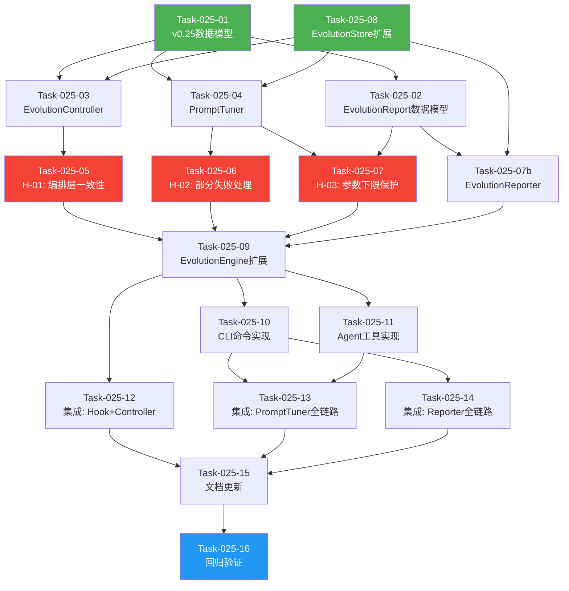

# 任务清单 v0.25.0

> **版本**: v0.25.0 自适应进化引擎
> **创建日期**: 2026-05-22
> **架构基线**: 架构设计说明书 v12.0.2
> **评审基线**: 架构评审报告 v0.25.0
> **需求基线**: 需求规格说明书 v10.0

---

## 1. 任务总览

### 1.1 任务统计

| 维度 | 数量 |
|------|------|
| 任务总数 | 17 |
| P0 任务 | 8 |
| P1 任务 | 6 |
| P2 任务 | 3 |
| 评审整改任务 | 3 (H-01/H-02/H-03) |
| 预估总工时 | 96 小时 (~12 人天) |

### 1.2 任务分类

| 类型 | 任务数 | 任务ID |
|------|--------|--------|
| 数据模型 | 2 | Task-025-01, Task-025-02 |
| 核心逻辑 | 6 | Task-025-03, Task-025-04, Task-025-07b, Task-025-05, Task-025-06, Task-025-07 |
| 存储层 | 1 | Task-025-08 |
| CLI命令 | 2 | Task-025-09, Task-025-10 |
| Agent工具 | 1 | Task-025-11 |
| 集成测试 | 3 | Task-025-12, Task-025-13, Task-025-14 |
| 评审整改 | 3 | Task-025-05, Task-025-06, Task-025-07 |
| 文档更新 | 1 | Task-025-15 |
| 回归验证 | 1 | Task-025-16 |

### 1.3 需求覆盖矩阵

| 需求ID | 需求描述 | 优先级 | 覆盖任务 |
|--------|---------|--------|----------|
| REQ-0.25-01 | 自动化进化触发器 | P0 | Task-025-01, 03, 05, 08, 12 |
| REQ-0.25-02 | LLM提示策略优化 | P1 | Task-025-01, 04, 06, 08, 13 |
| REQ-0.25-03 | 进化仪表盘 | P2 | Task-025-02, 07b, 07, 09, 10, 14 |
| H-01 | 编排层一致性 | P0(整改) | Task-025-05 |
| H-02 | 部分失败处理 | P0(整改) | Task-025-06 |
| H-03 | 参数下限保护 | P0(整改) | Task-025-07 |

---

## 2. 任务依赖图

**关键路径**: T01 -> T03 -> T05 -> T09 -> T10 -> T13 -> T15 -> T16

**并行机会**:
- T01 与 T08 可并行（数据模型与存储层扩展无依赖）
- T03 与 T04 可并行（Controller与Tuner互相独立）
- T05、T06、T07 可并行（三个整改项互相独立）
- T10、T11、T12 可并行（CLI/Agent/集成测试互相独立）

---

## 3. 任务详情

### Task-025-01: v0.25数据模型定义（EvolutionAction/TriggerCheckResult/PromptTuningParams）

- **描述**: 在 `models.py` 中新增3个 frozen dataclass 数据模型：EvolutionAction（进化动作）、TriggerCheckResult（触发检查结果）、PromptTuningParams（提示调优参数）。每个模型需提供 to_dict()/from_dict() 序列化方法。PromptTuningParams 需提供 default() 工厂方法和 with_updates() 不可变更新方法（clamp到[0.0, 1.0]）。
- **优先级**: P0
- **依赖**: 无
- **复杂度**: 中
- **预估工时**: 6h
- **验收标准**:
  - [ ] EvolutionAction 包含 action_id/action_type/trigger_reason/trigger_condition/target_model_type/priority/created_at/executed/executed_at/execution_result 全部字段
  - [ ] TriggerCheckResult 包含 checked_at/triggered_actions/skipped_conditions 全部字段
  - [ ] PromptTuningParams 包含 tone_intensity/detail_level_score/recommendation_aggressiveness/data_driven_weight/last_updated/update_count 全部字段，默认值均为0.5
  - [ ] PromptTuningParams.with_updates() 将参数 clamp 到 [0.0, 1.0]，update_count 自增
  - [ ] PromptTuningParams.default() 返回全部0.5的中性参数
  - [ ] 所有模型均提供 to_dict()/from_dict() 方法
  - [ ] 单元测试覆盖率 >= 90%
- **涉及文件**:
  - `src/core/evolution/models.py` (扩展)
  - `tests/unit/core/evolution/test_models.py` (扩展)

---

### Task-025-02: EvolutionReport数据模型定义

- **描述**: 在 `models.py` 中新增 EvolutionReport frozen dataclass，包含月度进化报告的全部字段（report_id/month/generated_at/total_decisions/prediction_accuracy_trend/decision_acceptance_rate/model_versions/personalization_degree/evolution_actions_count/last_evolution_time/calibration_summary/prompt_tuning_summary/recommendations）。提供 to_dict()/from_dict() 序列化方法。
- **优先级**: P2
- **依赖**: 无
- **复杂度**: 低
- **预估工时**: 3h
- **验收标准**:
  - [ ] EvolutionReport 包含上述全部字段
  - [ ] 提供 to_dict()/from_dict() 方法
  - [ ] prediction_accuracy_trend 类型为 list[dict[str, Any]]（后续可优化为结构化类型，当前保持与架构设计一致）
  - [ ] 单元测试覆盖率 >= 90%
- **涉及文件**:
  - `src/core/evolution/models.py` (扩展)
  - `tests/unit/core/evolution/test_models.py` (扩展)

---

### Task-025-03: EvolutionController核心实现

- **描述**: 新增 `evolution_controller.py`，实现进化控制器。包含4种触发条件检测（VDOT误差/连续拒绝/新数据积累/月度复盘）、触发条件检查(check_triggers)、动作执行(execute_action，先持久化后生效)、待执行动作批量执行(execute_pending_actions)。触发检查性能预算<50ms，使用 days=90 限制查询范围，使用 trigger_state.json 缓存避免全量扫描。
- **优先级**: P0
- **依赖**: Task-025-01, Task-025-08
- **复杂度**: 高
- **预估工时**: 12h
- **验收标准**:
  - [ ] check_triggers() 返回 TriggerCheckResult，包含4种触发条件检测结果
  - [ ] _check_vdot_error_trigger(): 连续3次VDOT误差>5%时触发，使用 get_prediction_actual_pairs("vdot", days=90)
  - [ ] _check_rejection_trigger(): 连续2次拒绝推荐时触发，使用 get_decision_outcome_pairs(days=90)
  - [ ] _check_new_data_trigger(): 新数据>=50条时触发，使用 count_decisions() + trigger_state缓存
  - [ ] _check_monthly_review_trigger(): 当月未生成报告时触发
  - [ ] execute_action(): 先持久化后生效（C-01整改），持久化失败不修改实例属性
  - [ ] execute_action(): retrain_model/incremental_learn 动作先 save_model_params() 再 apply_params_to_instance()
  - [ ] execute_action(): incremental_learn 完成后更新 trigger_state
  - [ ] _load_last_incremental_count(): 从 trigger_state.json 加载上次增量学习记录数
  - [ ] check_triggers() 性能预算 <50ms，超50ms输出warning日志
  - [ ] 单元测试覆盖率 >= 85%，Mock EvolutionStore/CalibrationEngine/ModelEvolver/PromptTuner
- **涉及文件**:
  - `src/core/evolution/evolution_controller.py` (新增)
  - `tests/unit/core/evolution/test_evolution_controller.py` (新增)

---

### Task-025-04: PromptTuner核心实现

- **描述**: 新增 `prompt_tuner.py`，实现提示调优器。管理4维连续参数空间（语气/信息密度/推荐激进程度/数据驱动权重），提供手动更新(update_params)、基于反馈自动微调(auto_adjust_on_feedback)、连续拒绝时降低激进程度(auto_adjust_on_rejection)、重置为默认值(reset_to_default)等方法。参数持久化到JSON文件，加载时若文件不存在则返回默认参数。
- **优先级**: P1
- **依赖**: Task-025-01, Task-025-08
- **复杂度**: 中
- **预估工时**: 8h
- **验收标准**:
  - [ ] get_params() 返回当前 PromptTuningParams，首次调用时从JSON加载或返回默认值
  - [ ] update_params() 手动更新参数，调用 with_updates() + _save_params()
  - [ ] auto_adjust_on_feedback(): 基于avg_score和acceptance_rate调整4维参数，步长0.05，最大0.1
  - [ ] auto_adjust_on_rejection(): 降低aggressive和data_driven，步长0.05和0.025
  - [ ] reset_to_default(): 重置为全部0.5，持久化并返回
  - [ ] _save_params()/_load_params(): 通过 EvolutionStore 读写 prompt_params.json
  - [ ] 单元测试覆盖率 >= 85%，Mock EvolutionStore
- **涉及文件**:
  - `src/core/evolution/prompt_tuner.py` (新增)
  - `tests/unit/core/evolution/test_prompt_tuner.py` (新增)

---

### Task-025-05: [H-01整改] 编排层一致性 -- DecisionLogHook持有EvolutionEngine引用

- **描述**: 修正架构设计中 DecisionLogHook 持有 EvolutionController 的设计，改为持有 EvolutionEngine 引用。DecisionLogHook.after_iteration() 通过 EvolutionEngine.check_evolution_triggers() 间接调用 EvolutionController，确保所有进化操作通过编排层进行。EvolutionEngine 可感知全部进化动作。
- **优先级**: P0 (评审整改)
- **依赖**: Task-025-03
- **复杂度**: 中
- **预估工时**: 6h
- **验收标准**:
  - [ ] DecisionLogHook 构造函数参数从 evolution_controller 改为 evolution_engine
  - [ ] DecisionLogHook.after_iteration() 调用 self._evolution_engine.check_evolution_triggers()（而非 self._evolution_controller.check_triggers()）
  - [ ] 异步执行线程调用 self._evolution_engine.execute_evolution_action()（而非 self._evolution_controller.execute_pending_actions()）
  - [ ] EvolutionEngine.check_evolution_triggers() 委托给 EvolutionController.check_triggers()
  - [ ] EvolutionEngine.execute_evolution_action() 委托给 EvolutionController.execute_action()
  - [ ] EvolutionEngine 可感知全部进化动作（get_evolution_status() 统计准确）
  - [ ] 性能监控逻辑保留：check_triggers() 超50ms输出warning
  - [ ] 单元测试覆盖：验证 DecisionLogHook 通过 EvolutionEngine 间接调用
- **涉及文件**:
  - `src/core/evolution/decision_log_hook.py` (修改)
  - `src/core/evolution/evolution_engine.py` (扩展)
  - `tests/unit/core/evolution/test_decision_log_hook.py` (扩展)
  - `tests/unit/core/evolution/test_evolution_engine.py` (扩展)

---

### Task-025-06: [H-02整改] 部分失败处理 -- IncrementalLearnResult结构化

- **描述**: 新增 IncrementalLearnResult frozen dataclass（model_type/success/mae_before/mae_after/error），将 EvolutionAction.execution_result 从字符串改为结构化数据。incremental_learn 动作遍历3种模型时，每个模型独立记录成功/失败，部分失败时 action 标记为 executed=True 但 execution_result 包含详细的部分成功/失败信息。
- **优先级**: P0 (评审整改)
- **依赖**: Task-025-04
- **复杂度**: 中
- **预估工时**: 6h
- **验收标准**:
  - [ ] IncrementalLearnResult 为 frozen dataclass，包含 model_type: str / success: bool / mae_before: float | None / mae_after: float | None / error: str | None
  - [ ] IncrementalLearnResult 提供 to_dict() 方法
  - [ ] EvolutionController.execute_action() 的 incremental_learn 分支使用 IncrementalLearnResult 记录逐模型结果
  - [ ] EvolutionAction.execution_result 类型从 str | None 改为 str | dict[str, Any] | None（向后兼容，字符串用于简单动作，字典用于增量学习）
  - [ ] 部分失败时 action.executed=True，execution_result 包含每个模型的 IncrementalLearnResult
  - [ ] 单元测试：验证 incremental_learn 部分失败场景（如 vdot成功、injury数据不足、training_response异常）
- **涉及文件**:
  - `src/core/evolution/models.py` (扩展: 新增 IncrementalLearnResult)
  - `src/core/evolution/evolution_controller.py` (修改: incremental_learn分支)
  - `tests/unit/core/evolution/test_evolution_controller.py` (扩展)
  - `tests/unit/core/evolution/test_models.py` (扩展)

---

### Task-025-07: [H-03整改] 参数下限保护 -- PromptTuner下限+反弹机制

- **描述**: 为 PromptTuner.auto_adjust_on_rejection() 添加参数下限保护：aggressive 最低0.1，data_driven 最低0.2。接近下限时输出warning日志。添加反弹机制：auto_adjust_on_feedback() 中接受推荐时，aggressive 的恢复步长(0.08)大于降低步长(0.05)，确保参数可从低值自然恢复。PromptTuningParams.with_updates() 需扩展支持下限参数。
- **优先级**: P0 (评审整改)
- **依赖**: Task-025-04, Task-025-02
- **复杂度**: 中
- **预估工时**: 6h
- **验收标准**:
  - [ ] auto_adjust_on_rejection() 中 aggressive 不低于0.1，data_driven 不低于0.2
  - [ ] 接近下限时（aggressive < 0.15 或 data_driven < 0.25）输出 logger.warning()
  - [ ] auto_adjust_on_feedback() 中接受推荐时 aggressive 恢复步长为0.08（>降低步长0.05）
  - [ ] PromptTuningParams.with_updates() 支持可选的 min_bounds 参数，默认无下限（保持向后兼容）
  - [ ] 连续10次拒绝后，aggressive 不低于0.1，data_driven 不低于0.2
  - [ ] 单元测试：验证连续拒绝场景下参数下限保护生效
  - [ ] 单元测试：验证反弹机制（接受推荐后参数恢复速度大于降低速度）
- **涉及文件**:
  - `src/core/evolution/prompt_tuner.py` (修改)
  - `src/core/evolution/models.py` (修改: with_updates扩展)
  - `tests/unit/core/evolution/test_prompt_tuner.py` (扩展)

---

### Task-025-07b: EvolutionReporter核心实现

- **描述**: 新增 `evolution_reporter.py`，实现进化报告器。包含月度进化报告生成(generate_report)、个性化程度计算(_get_personalization_degree)、预测准确率趋势生成(_get_prediction_accuracy_trend)、决策接受率计算(_get_decision_acceptance_rate)、校准摘要生成(_get_calibration_summary)、提示调优摘要生成(_get_prompt_tuning_summary)等方法。报告数据从EvolutionStore/CalibrationEngine/PromptTuner聚合。
- **优先级**: P1
- **依赖**: Task-025-02, Task-025-08
- **复杂度**: 中
- **预估工时**: 8h
- **验收标准**:
  - [ ] generate_report(month) 返回 EvolutionReport，包含全部字段
  - [ ] _get_personalization_degree() 计算正确：校准偏离0.4 + 调优偏离0.3 + 进化次数0.3
  - [ ] _get_prediction_accuracy_trend() 返回月度MAE趋势数据
  - [ ] _get_decision_acceptance_rate() 从EvolutionStore查询接受率
  - [ ] _get_calibration_summary() 从CalibrationEngine获取校准状态
  - [ ] _get_prompt_tuning_summary() 从PromptTuner获取当前参数
  - [ ] 数据不足时graceful降级，不抛出异常
  - [ ] 单元测试覆盖率 >= 85%，Mock EvolutionStore/CalibrationEngine/PromptTuner
- **涉及文件**:
  - `src/core/evolution/evolution_reporter.py` (新增)
  - `tests/unit/core/evolution/test_evolution_reporter.py` (新增)

---

### Task-025-08: EvolutionStore扩展 -- v0.25存储方法

- **描述**: 在 EvolutionStore 中新增5个方法：save_prompt_tuning_params()/load_prompt_tuning_params()（提示调优参数JSON读写）、save_trigger_state()/load_trigger_state()（触发器状态JSON读写）、count_decisions()（轻量计数）。扩展现有2个方法参数：get_decision_outcome_pairs(days=90)/get_prediction_actual_pairs(days=90) 添加 days 参数限制查询范围。tuning/ 目录在首次写入时自动创建。
- **优先级**: P0
- **依赖**: 无
- **复杂度**: 中
- **预估工时**: 8h
- **验收标准**:
  - [ ] save_prompt_tuning_params()/load_prompt_tuning_params(): 读写 data_dir/tuning/prompt_params.json
  - [ ] save_trigger_state()/load_trigger_state(): 读写 data_dir/tuning/trigger_state.json，Schema: {"last_incremental_count": int, "last_monthly_report": str}
  - [ ] count_decisions(): 轻量计数，不加载全量Parquet数据
  - [ ] get_decision_outcome_pairs(days=90): 新增days参数，默认90天，限制Parquet扫描范围
  - [ ] get_prediction_actual_pairs(days=90): 新增days参数，默认90天，限制Parquet扫描范围
  - [ ] days参数向后兼容：不传时默认90天，现有调用无需修改
  - [ ] tuning/ 目录首次写入时 mkdir(parents=True, exist_ok=True) 自动创建
  - [ ] 单元测试覆盖率 >= 85%
- **涉及文件**:
  - `src/core/evolution/evolution_store.py` (扩展)
  - `tests/unit/core/evolution/test_evolution_store.py` (扩展)

---

### Task-025-09: EvolutionEngine v0.25编排层扩展

- **描述**: 在 EvolutionEngine 中新增6个v0.25编排方法（check_evolution_triggers/execute_evolution_action/get_evolution_report/adjust_prompt_params/get_prompt_tuning_params/reset_prompt_tuning），扩展构造函数注入3个v0.25子组件（evolution_controller/prompt_tuner/evolution_reporter，可选注入），扩展 get_evolution_status() 输出v0.25进化状态字段。更新 AppContext 构建 EvolutionEngine 的逻辑，按 prompt_tuner -> evolution_reporter -> evolution_controller 顺序创建并注入。
- **优先级**: P0
- **依赖**: Task-025-05, Task-025-06, Task-025-07
- **复杂度**: 高
- **预估工时**: 10h
- **验收标准**:
  - [ ] EvolutionEngine 构造函数新增3个可选参数：evolution_controller/prompt_tuner/evolution_reporter
  - [ ] check_evolution_triggers() 委托给 EvolutionController.check_triggers()，未注入时抛出 RuntimeError
  - [ ] execute_evolution_action() 委托给 EvolutionController.execute_action()，未注入时抛出 RuntimeError
  - [ ] get_evolution_report() 委托给 EvolutionReporter.generate_report()，未注入时抛出 RuntimeError
  - [ ] adjust_prompt_params()/get_prompt_tuning_params()/reset_prompt_tuning() 委托给 PromptTuner
  - [ ] get_evolution_status() 新增 evolution_status 嵌套字段（last_evolution_time/evolution_actions_count/prompt_tuning/personalization_degree）
  - [ ] AppContext 构建 EvolutionEngine 时按正确顺序创建并注入v0.25子组件
  - [ ] AppContext 新增 evolution_controller/prompt_tuner/prompt_tuner_params 属性
  - [ ] v0.25子组件未注入时对应方法抛出 RuntimeError("请先初始化v0.25组件")
  - [ ] 单元测试覆盖率 >= 85%
- **涉及文件**:
  - `src/core/evolution/evolution_engine.py` (扩展)
  - `src/core/context.py` (扩展: AppContext)
  - `tests/unit/core/evolution/test_evolution_engine.py` (扩展)
  - `tests/unit/core/evolution/test_context_extension.py` (扩展)

---

### Task-025-10: CLI命令实现（evolution triggers/report/tune）

- **描述**: 在 evolution 命令组中新增3个CLI命令：evolution triggers（检查进化触发条件）、evolution report --month（生成月度进化报告）、evolution tune --tone --detail --aggressive --data-driven（手动调整提示参数）。在 evolution_handler.py 中新增3个handler方法。增强现有 evolution status 命令输出v0.25进化状态。所有输出使用 Rich 面板格式化。
- **优先级**: P1
- **依赖**: Task-025-09
- **复杂度**: 中
- **预估工时**: 8h
- **验收标准**:
  - [ ] `evolution triggers` 命令：调用 EvolutionEngine.check_evolution_triggers()，Rich面板输出已触发动作列表和跳过条件
  - [ ] `evolution report --month YYYY-MM` 命令：调用 EvolutionEngine.get_evolution_report()，Rich面板输出月度进化报告
  - [ ] `evolution tune --tone --detail --aggressive --data-driven` 命令：调用 EvolutionEngine.adjust_prompt_params()，Rich面板输出调整后参数
  - [ ] `evolution status` 命令增强：输出v0.25进化状态（个性化程度/上次进化时间/进化动作数/提示调优参数）
  - [ ] CLI参数类型校验：tone/detail/aggressive/data_driven 范围0.0-1.0
  - [ ] 错误处理：v0.25组件未初始化时友好提示
  - [ ] 所有命令返回JSON格式: {success: bool, data: ..., message: str}
- **涉及文件**:
  - `src/cli/commands/evolution.py` (扩展)
  - `src/cli/handlers/evolution_handler.py` (扩展)

---

### Task-025-11: Agent工具实现（check_evolution_triggers/get_evolution_report/adjust_prompt_params）

- **描述**: 在 tools_evolution.py 中新增3个Agent工具：CheckEvolutionTriggersTool、GetEvolutionReportTool、AdjustPromptParamsTool。每个工具通过 get_context() 获取 EvolutionEngine，调用对应编排方法，返回标准JSON格式 {success: true, data: {...}}。
- **优先级**: P1
- **依赖**: Task-025-09
- **复杂度**: 低
- **预估工时**: 4h
- **验收标准**:
  - [ ] check_evolution_triggers 工具：无输入参数，返回 list[EvolutionAction] JSON
  - [ ] get_evolution_report 工具：输入 month?(str)，返回 EvolutionReport JSON
  - [ ] adjust_prompt_params 工具：输入 tone?/detail?/aggressive?/data_driven?(float)，返回 PromptTuningParams JSON
  - [ ] 所有工具返回 {success: true, data: {...}} 标准格式
  - [ ] 工具描述包含使用场景说明（如"当用户询问'系统是否需要进化'时使用"）
  - [ ] v0.25组件未初始化时返回 {success: false, message: "请先初始化v0.25组件"}
- **涉及文件**:
  - `src/agents/tools_evolution.py` (扩展)

---

### Task-025-12: 集成测试 -- DecisionLogHook + EvolutionController闭环

- **描述**: 编写集成测试验证 DecisionLogHook.after_iteration() 通过 EvolutionEngine 触发进化检查的完整闭环。使用真实 EvolutionStore + 临时目录，验证触发条件检测、异步动作执行、trigger_state更新、性能预算达标。
- **优先级**: P0
- **依赖**: Task-025-09
- **复杂度**: 中
- **预估工时**: 6h
- **验收标准**:
  - [ ] 测试 after_iteration() 回调触发 check_evolution_triggers()（通过EvolutionEngine间接调用）
  - [ ] 测试触发条件满足时 EvolutionAction 被创建并异步执行
  - [ ] 测试异步执行不阻塞主流程（验证线程为daemon线程）
  - [ ] 测试 trigger_state.json 在增量学习后被正确更新
  - [ ] 测试 check_triggers() 在1000条决策数据下延迟<50ms
  - [ ] 测试 v0.25组件未注入时 after_iteration() 不报错（graceful降级）
  - [ ] 测试先持久化后生效：模拟持久化失败时实例属性不被修改
- **涉及文件**:
  - `tests/integration/` (新增: test_evolution_trigger_integration.py)

---

### Task-025-13: 集成测试 -- PromptTuner全链路

- **描述**: 编写集成测试验证 PromptTuner 从参数初始化、手动调整、自动微调、持久化、加载、重置的完整链路。使用真实 EvolutionStore + 临时目录，验证JSON文件读写正确、参数下限保护生效、反弹机制有效。
- **优先级**: P1
- **依赖**: Task-025-10, Task-025-11
- **复杂度**: 低
- **预估工时**: 4h
- **验收标准**:
  - [ ] 测试 PromptTuner 首次调用 get_params() 返回默认值（JSON文件不存在时）
  - [ ] 测试 update_params() 后 prompt_params.json 文件正确写入
  - [ ] 测试 auto_adjust_on_rejection() 参数下限保护：连续10次拒绝后 aggressive>=0.1, data_driven>=0.2
  - [ ] 测试 auto_adjust_on_feedback() 反弹机制：接受推荐后 aggressive 恢复步长>降低步长
  - [ ] 测试 reset_to_default() 后参数恢复为0.5
  - [ ] 测试 CLI `evolution tune` 命令端到端调用
  - [ ] 测试 Agent adjust_prompt_params 工具端到端调用
- **涉及文件**:
  - `tests/integration/` (新增: test_prompt_tuner_integration.py)

---

### Task-025-14: 集成测试 -- EvolutionReporter全链路

- **描述**: 编写集成测试验证 EvolutionReporter 月度报告生成的完整链路。使用真实 EvolutionStore + CalibrationEngine + PromptTuner + 临时目录，验证报告字段完整性、个性化程度计算正确性、准确率趋势生成。
- **优先级**: P2
- **依赖**: Task-025-10
- **复杂度**: 低
- **预估工时**: 4h
- **验收标准**:
  - [ ] 测试 generate_report() 返回完整 EvolutionReport（全部字段非空）
  - [ ] 测试 _get_personalization_degree() 计算正确（校准偏离0.4 + 调优偏离0.3 + 进化次数0.3）
  - [ ] 测试 _get_prediction_accuracy_trend() 返回月度趋势数据
  - [ ] 测试 _get_decision_acceptance_rate() 返回正确接受率
  - [ ] 测试 CLI `evolution report` 命令端到端调用
  - [ ] 测试月度复盘触发条件（当月未生成报告时触发）
- **涉及文件**:
  - `tests/integration/` (新增: test_evolution_reporter_integration.py)

---

### Task-025-15: 文档更新与版本对齐

- **描述**: 更新项目文档，确保v0.25.0版本交付物与文档一致。更新 AGENTS.md（新增v0.25模块/命令/工具）、架构设计说明书（标注v0.25已完成）、需求规格说明书（标注v0.25需求已实现）。
- **优先级**: P2
- **依赖**: Task-025-12, Task-025-13, Task-025-14
- **复杂度**: 低
- **预估工时**: 3h
- **验收标准**:
  - [ ] AGENTS.md 新增 v0.25 模块说明（evolution_controller/prompt_tuner/evolution_reporter）
  - [ ] AGENTS.md 新增 v0.25 CLI命令（evolution triggers/report/tune）
  - [ ] AGENTS.md 新增 v0.25 Agent工具（check_evolution_triggers/get_evolution_report/adjust_prompt_params）
  - [ ] 架构设计说明书 Section 8.4 状态标注为"已完成"
  - [ ] 需求规格说明书 REQ-0.25-01/02/03 标注为"已实现"
- **涉及文件**:
  - `AGENTS.md` (更新)
  - `docs/architecture/架构设计说明书.md` (更新)
  - `docs/requirements/REQ_需求规格说明书.md` (更新)

---

### Task-025-16: 回归验证与版本发布

- **描述**: 执行全量回归测试，验证v0.25新增功能不影响v0.23/v0.24已有功能。运行全部单元测试+集成测试，验证CLI命令可用性、Agent工具可用性、性能基准达标。确认架构评审整改项全部落地。
- **优先级**: P0
- **依赖**: Task-025-15
- **复杂度**: 中
- **预估工时**: 4h
- **验收标准**:
  - [ ] 全部单元测试通过（含v0.23/v0.24/v0.25）
  - [ ] 全部集成测试通过
  - [ ] mypy 类型检查通过
  - [ ] ruff lint 通过
  - [ ] v0.23 CLI命令（evolution history/feedback/accuracy/fidelity/status）功能正常
  - [ ] v0.24 CLI命令（evolution calibration/response）功能正常
  - [ ] v0.25 CLI命令（evolution triggers/report/tune）功能正常
  - [ ] check_triggers() 性能基准 <50ms（1000条数据）
  - [ ] Hook接入延迟 <100ms
  - [ ] 架构评审整改项 H-01/H-02/H-03 全部验收通过
  - [ ] 核心模块测试覆盖率 >= 85%
- **涉及文件**:
  - 无新增文件（验证性任务）

---

## 4. 里程碑

### 里程碑 M1: 基础设施就绪（预计第1-2天）

**目标**: 完成数据模型定义和存储层扩展，为后续核心逻辑开发提供基础。

| 任务 | 预估工时 | 并行度 |
|------|---------|--------|
| Task-025-01: v0.25数据模型 | 6h | 与T08并行 |
| Task-025-02: EvolutionReport数据模型 | 3h | 与T01/T08并行 |
| Task-025-08: EvolutionStore扩展 | 8h | 与T01/T02并行 |

**准入条件**: 架构设计评审通过，开发环境就绪
**准出标准**: 所有数据模型和存储方法单元测试通过

---

### 里程碑 M2: 核心逻辑完成（预计第3-6天）

**目标**: 完成3个核心子组件（Controller/Tuner/Reporter）和3个评审整改项。

| 任务 | 预估工时 | 并行度 |
|------|---------|--------|
| Task-025-03: EvolutionController | 12h | 与T04/T07b并行 |
| Task-025-04: PromptTuner | 8h | 与T03/T07b并行 |
| Task-025-07b: EvolutionReporter | 8h | 与T03/T04并行 |
| Task-025-05: H-01 编排层一致性 | 6h | 依赖T03，与T06/T07并行 |
| Task-025-06: H-02 部分失败处理 | 6h | 依赖T04，与T05/T07并行 |
| Task-025-07: H-03 参数下限保护 | 6h | 依赖T04，与T05/T06并行 |

**准入条件**: M1全部完成
**准出标准**: 3个核心子组件和3个整改项单元测试通过

---

### 里程碑 M3: 编排层与接入层完成（预计第6-7天）

**目标**: 完成 EvolutionEngine 编排层扩展、CLI命令、Agent工具。

| 任务 | 预估工时 | 并行度 |
|------|---------|--------|
| Task-025-09: EvolutionEngine扩展 | 10h | 依赖M2全部完成 |
| Task-025-10: CLI命令实现 | 8h | 依赖T09，与T11并行 |
| Task-025-11: Agent工具实现 | 4h | 依赖T09，与T10并行 |

**准入条件**: M2全部完成
**准出标准**: CLI命令和Agent工具可端到端调用

---

### 里程碑 M4: 集成验证与交付（预计第8-10天）

**目标**: 完成集成测试、文档更新、回归验证。

| 任务 | 预估工时 | 并行度 |
|------|---------|--------|
| Task-025-12: 集成测试 Hook+Controller | 6h | 依赖T09，与T13/T14并行 |
| Task-025-13: 集成测试 PromptTuner | 4h | 依赖T10/T11，与T12/T14并行 |
| Task-025-14: 集成测试 Reporter | 4h | 依赖T10，与T12/T13并行 |
| Task-025-15: 文档更新 | 3h | 依赖T12/T13/T14 |
| Task-025-16: 回归验证 | 4h | 依赖T15 |

**准入条件**: M3全部完成
**准出标准**: 全部测试通过，文档与代码版本一致，评审整改项全部验收

---

## 5. 风险与缓解

| 风险 | 等级 | 影响任务 | 缓解措施 |
|------|------|---------|----------|
| check_triggers() 性能不达标 | 高 | Task-025-03, Task-025-12 | 提前准备性能基准测试数据；若不达标，优先优化 get_decision_outcome_pairs() 查询 |
| daemon线程数据一致性 | 高 | Task-025-03 | C-01整改方案"先持久化后生效"已在架构设计中明确；集成测试需覆盖主进程退出场景 |
| IncrementalLearnResult 改动影响现有代码 | 中 | Task-025-06 | execution_result 类型兼容设计（str \| dict \| None），现有字符串用法不受影响 |
| EvolutionEngine扩展构造函数破坏v0.23/v0.24兼容 | 中 | Task-025-09 | 新增参数均为可选注入（默认None），未注入时行为不变 |
| PromptTuner参数下限保护影响with_updates()接口 | 低 | Task-025-07 | with_updates() 新增 min_bounds 可选参数，默认无下限，保持向后兼容 |

---

## 6. 评审整改项追踪

| 整改编号 | 整改内容 | 对应任务 | 状态 | 验收标准 |
|---------|---------|---------|------|---------|
| C-01 | daemon线程数据一致性 | Task-025-03 (架构设计已整改) | 架构已整改，开发中落地 | 先持久化后生效，持久化失败不修改实例属性 |
| C-02 | check_triggers性能预算 | Task-025-03 (架构设计已整改) | 架构已整改，开发中落地 | 1000条数据下<50ms |
| M-03 | trigger_state持久化定义 | Task-025-03 (架构设计已整改) | 架构已整改，开发中落地 | trigger_state.json Schema明确 |
| H-01 | 编排层一致性 | Task-025-05 | 待开发 | DecisionLogHook持有EvolutionEngine引用 |
| H-02 | 部分失败处理 | Task-025-06 | 待开发 | IncrementalLearnResult可追溯每个模型进化结果 |
| H-03 | 参数下限保护 | Task-025-07 | 待开发 | aggressive>=0.1, data_driven>=0.2 |
