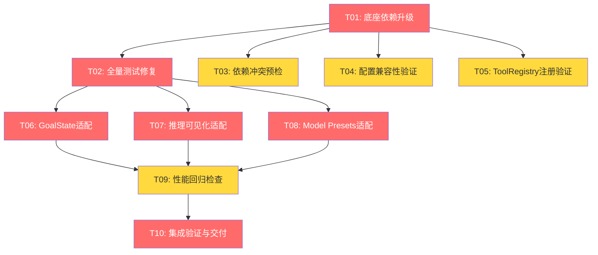

# v0.26.0 开发任务拆解清单

> **版本**: v0.26.0
> **主题**: 底座升级 + 新特性适配
> **创建日期**: 2026-05-24
> **架构依据**: 架构设计说明书 v14.0.0 §9
> **需求依据**: 需求规格说明书 v12.0 §5.2

---

## 1. 任务总览

| 统计项 | 数值 |
|--------|------|
| 任务总数 | 10 |
| P0 任务数 | 6 |
| P1 任务数 | 4 |
| 预估总工时 | 38h |
| 迭代周期 | v0.26.0 |

---

## 2. 任务依赖关系图

**关键路径**：T01 → T02 → T06/T07/T08 → T09 → T10

**并行机会**：
- T03/T04/T05 可在 T01 完成后并行执行
- T06/T07/T08 可在 T02 完成后并行执行

---

## 3. 任务详情

### T01: 底座依赖升级

| 属性 | 值 |
|------|-----|
| 任务ID | T01 |
| 所属模块 | 基础设施 |
| 优先级 | P0 |
| 前置依赖 | 无 |
| 预估工时 | 2h |
| 对应需求 | REQ-D-01, REQ-D-02 |

**任务描述**：
将 `pyproject.toml` 中 `nanobot-ai>=0.1.5.post2` 升级为 `nanobot-ai>=0.2.0`，执行 `uv sync` 安装新版本依赖。

**验收标准**：
1. `pyproject.toml` 依赖版本已更新
2. `uv sync` 成功，无依赖冲突
3. `uv run python -c "import nanobot; print(nanobot.__version__)"` 输出 ≥ 0.2.0

**交付物**：更新后的 `pyproject.toml` + `uv.lock`

---

### T02: 全量测试修复

| 属性 | 值 |
|------|-----|
| 任务ID | T02 |
| 所属模块 | 基础设施 |
| 优先级 | P0 |
| 前置依赖 | T01 |
| 预估工时 | 6h |
| 对应需求 | REQ-D-02, REQ-D-03 |

**任务描述**：
运行全量测试套件，修复因 nanobot-ai 0.2.0 API 变更导致的失败用例。确保 ruff 和 mypy 检查通过。

**验收标准**：
1. `uv run pytest tests/` 全量通过
2. `uv run ruff check src/` 无新增错误
3. `uv run mypy src/ --ignore-missing-imports` 无新增错误
4. DecisionLogHook 作为 AgentHook 子类可无缝兼容

**交付物**：修复后的测试代码 + 测试通过报告

**风险提示**：nanobot-ai 0.2.0 对 AgentHook 接口纯增量扩展，预期无破坏性变更，但需验证间接影响（如内部行为变化）

---

### T03: 依赖冲突预检

| 属性 | 值 |
|------|-----|
| 任务ID | T03 |
| 所属模块 | 基础设施 |
| 优先级 | P1 |
| 前置依赖 | T01 |
| 预估工时 | 2h |
| 对应需求 | REQ-D-05 |

**任务描述**：
检查 nanobot-ai 0.2.0 间接依赖是否与 RunFlowAgent 现有依赖冲突，特别关注 pydantic 版本要求。

**验收标准**：
1. `uv pip install --dry-run` 无依赖冲突
2. nanobot-ai 0.2.0 间接依赖与现有依赖无冲突
3. 若发现冲突，记录冲突详情和解决方案

**交付物**：依赖冲突预检报告

---

### T04: 配置兼容性验证

| 属性 | 值 |
|------|-----|
| 任务ID | T04 |
| 所属模块 | 基础设施 |
| 优先级 | P1 |
| 前置依赖 | T01 |
| 预估工时 | 2h |
| 对应需求 | REQ-D-04 |

**任务描述**：
用 nanobot-ai 0.2.0 的 Config loader 测试加载现有 config.json，确认新增字段不破坏旧配置。

**验收标准**：
1. 现有 config.json 可被 0.2.0 Config loader 正常加载
2. 新增字段（ModelPresetConfig 等）均有默认值，不影响旧配置
3. 若发现不兼容，记录详情和迁移方案

**交付物**：配置兼容性验证报告

---

### T05: ToolRegistry 注册验证

| 属性 | 值 |
|------|-----|
| 任务ID | T05 |
| 所属模块 | 基础设施 |
| 优先级 | P1 |
| 前置依赖 | T01 |
| 预估工时 | 2h |
| 对应需求 | REQ-D-06 |

**任务描述**：
检查 `tools.py` 和 `tools_evolution.py` 中的工具注册 API 是否有变更，验证所有工具正常注册。

**验收标准**：
1. `tools.py` 和 `tools_evolution.py` 中的工具注册 API 无变更
2. 所有工具在升级后正常注册
3. Agent 可正常调用所有工具

**交付物**：ToolRegistry 注册验证报告

---

### T06: GoalState 适配

| 属性 | 值 |
|------|-----|
| 任务ID | T06 |
| 所属模块 | evolution |
| 优先级 | P0 |
| 前置依赖 | T02 |
| 预估工时 | 6h |
| 对应需求 | REQ-D-07 |
| 架构决策 | ADR-012 |

**任务描述**：
适配 nanobot-ai 0.2.0 GoalState 持久化目标系统，实现跨对话目标追踪。

**子任务**：
1. DecisionLog 数据模型新增 `goal_state: str | None` 可选字段
2. DecisionLogHook 的 `after_iteration()` 中通过 `goal_state_raw(context.metadata)` 读取当前活跃目标
3. SOUL.md 新增 GoalState 使用指导段落
4. EvolutionController 月度复盘新增 GoalState 检查
5. 编写单元测试

**验收标准**：
1. DecisionLog 新增 goal_state 字段，默认 None
2. DecisionLogHook.after_iteration() 可读取 goal_state_raw
3. SOUL.md 包含 GoalState 使用指导
4. 创建训练计划后 Agent 在新对话中能回忆当前计划目标
5. 单元测试通过

**交付物**：修改后的 models.py + decision_log_hook.py + evolution_controller.py + SOUL.md + 测试代码

---

### T07: 推理可见化适配

| 属性 | 值 |
|------|-----|
| 任务ID | T07 |
| 所属模块 | evolution |
| 优先级 | P0 |
| 前置依赖 | T02 |
| 预估工时 | 6h |
| 对应需求 | REQ-D-08 |
| 架构决策 | ADR-013 |

**任务描述**：
适配 nanobot-ai 0.2.0 推理可见化能力，在 DecisionLogHook 中重写 emit_reasoning() 方法。

**子任务**：
1. DecisionLogHook 新增 `_reasoning_buffer: list[str]` 实例属性
2. 重写 `emit_reasoning()` 方法，将推理片段追加到缓冲区
3. 重写 `emit_reasoning_end()` 方法，标记推理结束
4. 修改 `finalize_content()` 将推理缓冲区内容写入 DecisionLog 上下文快照
5. 确保 `show_reasoning: true` 配置生效
6. 编写单元测试

**验收标准**：
1. DecisionLogHook.emit_reasoning() 正确追加推理片段
2. finalize_content() 将推理内容写入 DecisionLog
3. 飞书对话中可见 Agent 推理过程
4. 推理内容与最终建议逻辑一致
5. 推理可见化不增加 Agent 响应延迟 >50ms
6. 单元测试通过

**交付物**：修改后的 decision_log_hook.py + 测试代码

---

### T08: Model Presets 适配

| 属性 | 值 |
|------|-----|
| 任务ID | T08 |
| 所属模块 | CLI / 配置 |
| 优先级 | P0 |
| 前置依赖 | T02 |
| 预估工时 | 4h |
| 对应需求 | REQ-D-09 |
| 架构决策 | ADR-014 |

**任务描述**：
适配 nanobot-ai 0.2.0 Model Presets 预设管理，支持配置多个模型预设并通过 CLI 查看。

**子任务**：
1. config.json 新增 `model_presets` 配置段
2. 新增 `src/cli/commands/model.py` 命令模块（`nanobotrun model list`）
3. 新增 `src/cli/handlers/model_handler.py` 处理模块
4. 在 CLI app 中注册 model 命令组
5. 编写单元测试

**验收标准**：
1. config.json 可配置多个 Model Presets（名称+Provider+参数）
2. `nanobotrun model list` 可查看当前预设列表
3. 飞书/WebUI 中可通过 `/model <preset>` 切换预设（nanobot-ai 内置命令）
4. 单元测试通过

**交付物**：新增 model.py + model_handler.py + 配置示例 + 测试代码

---

### T09: 性能回归检查

| 属性 | 值 |
|------|-----|
| 任务ID | T09 |
| 所属模块 | 基础设施 |
| 优先级 | P1 |
| 前置依赖 | T06, T07, T08 |
| 预估工时 | 4h |
| 对应需求 | REQ-D-10 |

**任务描述**：
对核心 CLI 命令进行性能基准测试，与 v0.25.0 基线对比，确保无性能退化。

**验收标准**：
1. 核心 CLI 命令（data import、analysis vdot、plan create、evolution status）响应时间不退化 >20%
2. DecisionLogHook 接入延迟 <100ms
3. 性能基准数据已记录

**交付物**：性能回归检查报告

---

### T10: 集成验证与交付

| 属性 | 值 |
|------|-----|
| 任务ID | T10 |
| 所属模块 | 基础设施 |
| 优先级 | P0 |
| 前置依赖 | T09 |
| 预估工时 | 4h |
| 对应需求 | REQ-D-01~REQ-D-10 全量 |

**任务描述**：
执行全量集成验证，确保所有功能正常工作，输出交付报告。

**验收标准**：
1. `uv run pytest tests/` 全量通过
2. `uv run ruff check src/` 无新增错误
3. `uv run mypy src/ --ignore-missing-imports` 无新增错误
4. CLI 核心命令功能正常
5. GoalState 跨对话目标追踪正常
6. 推理可见化在飞书渠道正常展示
7. Model Presets 配置和查看正常
8. 交付报告已输出

**交付物**：交付报告 + 全量验证证据

---

## 4. 迭代计划

### 4.1 阶段划分

| 阶段 | 任务 | 预估工时 | 说明 |
|------|------|----------|------|
| **阶段1：底座升级** | T01, T02 | 8h | 升级依赖 + 修复测试，确保零回归 |
| **阶段2：预检验证** | T03, T04, T05 | 6h | 依赖冲突/配置兼容/工具注册验证（可与阶段1部分并行） |
| **阶段3：新特性适配** | T06, T07, T08 | 16h | GoalState/推理可见化/Model Presets（可并行） |
| **阶段4：验证交付** | T09, T10 | 8h | 性能回归 + 集成验证 + 交付报告 |

### 4.2 高风险任务标注

| 任务 | 风险等级 | 风险说明 | 缓解措施 |
|------|----------|----------|----------|
| T02 | 中 | nanobot-ai 0.2.0 可能有未文档化的行为变更 | API 兼容性分析已确认纯增量扩展；预留缓冲时间 |
| T06 | 低 | GoalState 机制依赖 LLM 遵循 SOUL.md 指导 | SOUL.md 指导需明确具体；提供示例对话 |
| T07 | 低 | 推理缓冲区可能影响内存 | 推理内容通常较短；finalize 后清空缓冲区 |

---

## 5. 变更记录

| 版本 | 日期 | 变更内容 |
|------|------|----------|
| v1.0 | 2026-05-24 | 初始版本：10项任务，预估38h |
