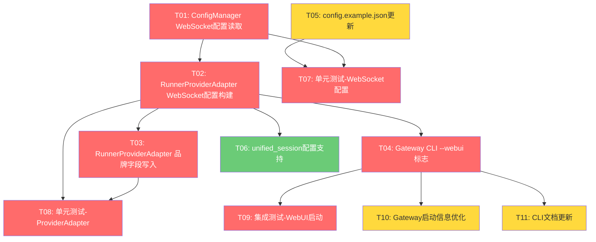

# v0.27.0 开发任务拆解清单

> **版本**: v0.27.0
> **主题**: WebUI 基础 — 配置驱动启用 nanobot-ai 内置 WebUI
> **创建日期**: 2026-05-26
> **架构依据**: 架构设计说明书 v16.0.0 §10
> **需求依据**: 需求规格说明书 v12.1 §5.3
> **评审依据**: v0.27.0 架构评审报告（3项修正已落实）

---

## 1. 任务总览

| 统计项 | 数值 |
|--------|------|
| 任务总数 | 11 |
| P0 任务数 | 7 |
| P1 任务数 | 3 |
| P2 任务数 | 1 |
| 预估总工时 | 31h |
| 迭代周期 | v0.27.0 |

---

## 2. 任务依赖关系图

**关键路径**：T01 → T02 → T04 → T09

**并行机会**：
- T05 可与 T01 并行执行
- T03 与 T04 可在 T02 完成后并行执行
- T07/T08 可在各自依赖完成后并行执行
- T10/T11 可在 T04 完成后并行执行

---

## 3. 任务详情

### T01: ConfigManager WebSocket 配置读取

| 属性 | 值 |
|------|-----|
| 任务ID | T01 |
| 所属模块 | 配置模块 |
| 优先级 | P0 |
| 前置依赖 | 无 |
| 预估工时 | 2h |
| 对应需求 | REQ-D-17 |

**任务描述**：
在 `ConfigManager` 中新增 `get_websocket_config() -> dict[str, Any]` 方法，读取 config.json 中的 `websocket` 配置节，支持环境变量覆盖（`NANOBOT_WS_*`）。

**验收标准**：
1. `get_websocket_config()` 方法可正确读取 config.json 中的 `websocket` 配置节
2. 配置节不存在时返回空 dict
3. 环境变量 `NANOBOT_WS_ENABLED/HOST/PORT/TOKEN/TOKEN_SECRET` 可覆盖配置文件值
4. 类型注解完整，mypy 检查通过

**交付物**：更新后的 `src/core/config/manager.py`

---

### T02: RunnerProviderAdapter WebSocket 配置构建

| 属性 | 值 |
|------|-----|
| 任务ID | T02 |
| 所属模块 | 配置注入层 |
| 优先级 | P0 |
| 前置依赖 | T01 |
| 预估工时 | 4h |
| 对应需求 | REQ-D-11, REQ-D-17, REQ-D-18, REQ-D-19 |

**任务描述**：
1. `RunnerProviderAdapter.__init__` 新增 `webui_enabled: bool = False` 参数
2. `_build_nanobot_config_from_runner()` 新增 WebSocket 通道配置构建逻辑
3. 当 `webui_enabled=True` 或 config.json `websocket.enabled=True` 时，在 channels dict 中添加 `websocket` 配置
4. WebSocket 配置项从 `ConfigManager.get_websocket_config()` 读取，缺失项使用默认值

**验收标准**：
1. `webui_enabled=True` 时，构建的 nanobot Config 包含 `channels.websocket` 配置
2. `webui_enabled=False` 且 config.json 未启用时，不包含 WebSocket 配置
3. WebSocket 配置项（host/port/token/streaming 等）正确映射到 nanobot WebSocketConfig
4. 不影响现有飞书通道配置构建
5. 类型注解完整，mypy 检查通过

**交付物**：更新后的 `src/core/provider_adapter.py`

---

### T03: RunnerProviderAdapter 品牌字段写入

| 属性 | 值 |
|------|-----|
| 任务ID | T03 |
| 所属模块 | 配置注入层 |
| 优先级 | P0 |
| 前置依赖 | T02 |
| 预估工时 | 1h |
| 对应需求 | REQ-D-16, REQ-D-20 |

**任务描述**：
在 `_build_nanobot_config_from_runner()` 中，将 `bot_name`/`bot_icon`/`unified_session` 写入 `AgentsConfig(defaults={...})` dict。品牌字段从 config.json 读取或使用默认值。

**验收标准**：
1. `AgentsConfig.defaults` 包含 `bot_name="Nanobot-Runner"` 和 `bot_icon="🏃‍♂️"`
2. `unified_session` 默认为 False，可从 config.json 覆盖
3. WebUI 中可见品牌标识
4. 不修改项目 `AgentDefaults` dataclass

**交付物**：更新后的 `src/core/provider_adapter.py`（与 T02 合并提交）

---

### T04: Gateway CLI --webui 标志

| 属性 | 值 |
|------|-----|
| 任务ID | T04 |
| 所属模块 | CLI 模块 |
| 优先级 | P0 |
| 前置依赖 | T02 |
| 预估工时 | 3h |
| 对应需求 | REQ-D-11, REQ-D-19 |

**任务描述**：
1. `gateway start` 命令新增 `--webui` 标志（`typer.Option(False, "--webui", help="启用WebUI（WebSocket通道）")`）
2. 创建 `RunnerProviderAdapter` 时传入 `webui_enabled=webui`
3. WebSocket 通道启用时，显示 WebUI 访问地址（`http://{host}:{port}`）
4. 更新命令帮助文档

**验收标准**：
1. `nanobotrun gateway start --webui` 启动后 WebSocket 通道可用
2. 不加 `--webui` 时行为与 v0.26.0 一致
3. 启动信息显示 WebUI 访问地址
4. 命令帮助文档包含 `--webui` 说明

**交付物**：更新后的 `src/cli/commands/gateway.py`

---

### T05: config.example.json 更新

| 属性 | 值 |
|------|-----|
| 任务ID | T05 |
| 所属模块 | 配置模块 |
| 优先级 | P0 |
| 前置依赖 | 无 |
| 预估工时 | 1h |
| 对应需求 | REQ-D-17 |

**任务描述**：
在 `config.example.json` 中新增 `websocket` 配置节示例，包含所有配置项和默认值，附带中文注释说明。

**验收标准**：
1. `websocket` 配置节包含所有 WebSocketConfig 字段
2. 每个字段有合理的默认值
3. 配置节默认 `enabled: false`
4. JSON 格式正确

**交付物**：更新后的 `config.example.json`

---

### T06: unified_session 配置支持

| 属性 | 值 |
|------|-----|
| 任务ID | T06 |
| 所属模块 | 配置注入层 |
| 优先级 | P2 |
| 前置依赖 | T02 |
| 预估工时 | 1h |
| 对应需求 | REQ-D-20 |

**任务描述**：
支持从 config.json 读取 `unified_session` 配置，传递到 nanobot `AgentsConfig.defaults`。默认关闭。

**验收标准**：
1. config.json 中 `websocket.unified_session` 可配置
2. 默认值为 False
3. 启用后 CLI/飞书/WebUI 共享同一会话

**交付物**：更新后的 `src/core/provider_adapter.py`（与 T03 合并）

---

### T07: 单元测试 — WebSocket 配置读取

| 属性 | 值 |
|------|-----|
| 任务ID | T07 |
| 所属模块 | 测试 |
| 优先级 | P0 |
| 前置依赖 | T01, T05 |
| 预估工时 | 2h |
| 对应需求 | REQ-D-17 |

**任务描述**：
为 `ConfigManager.get_websocket_config()` 编写单元测试，覆盖默认值、配置文件读取、环境变量覆盖等场景。

**验收标准**：
1. 测试配置节存在时正确读取
2. 测试配置节不存在时返回空 dict
3. 测试环境变量覆盖（NANOBOT_WS_ENABLED/HOST/PORT/TOKEN/TOKEN_SECRET）
4. 测试覆盖所有配置项的默认值
5. `uv run pytest tests/unit/config/test_websocket_config.py` 通过

**交付物**：新增 `tests/unit/config/test_websocket_config.py`

---

### T08: 单元测试 — ProviderAdapter WebSocket 配置构建

| 属性 | 值 |
|------|-----|
| 任务ID | T08 |
| 所属模块 | 测试 |
| 优先级 | P0 |
| 前置依赖 | T02, T03 |
| 预估工时 | 3h |
| 对应需求 | REQ-D-11, REQ-D-16, REQ-D-17, REQ-D-18 |

**任务描述**：
为 `RunnerProviderAdapter` 的 WebSocket 配置构建逻辑编写单元测试，覆盖 `webui_enabled` 参数、品牌字段、安全配置等场景。

**验收标准**：
1. 测试 `webui_enabled=True` 时 WebSocket 通道配置正确构建
2. 测试 `webui_enabled=False` 时无 WebSocket 配置
3. 测试品牌字段（bot_name/bot_icon）正确写入 agents.defaults
4. 测试安全配置（token/requires_token）正确传递
5. 测试不影响现有飞书通道配置
6. `uv run pytest tests/unit/test_provider_adapter.py` 通过

**交付物**：更新后的 `tests/unit/test_provider_adapter.py`

---

### T09: 集成测试 — WebUI 启动端到端验证

| 属性 | 值 |
|------|-----|
| 任务ID | T09 |
| 所属模块 | 测试 |
| 优先级 | P0 |
| 前置依赖 | T04 |
| 预估工时 | 3h |
| 对应需求 | REQ-D-11, REQ-D-12, REQ-D-13 |

**任务描述**：
端到端验证 `gateway start --webui` 启动后 WebSocket 通道可用、WebUI 页面可加载、Agent 可对话。

**验收标准**：
1. 启动后 ChannelManager 包含 WebSocket 通道
2. WebSocket 服务在配置端口监听
3. HTTP GET 请求返回 WebUI SPA 页面
4. WebSocket 连接可建立（含 token 认证）
5. Agent 可通过 WebSocket 通道响应消息
6. `uv run pytest tests/integration/test_webui_startup.py` 通过

**交付物**：新增 `tests/integration/test_webui_startup.py`

---

### T10: Gateway 启动信息优化

| 属性 | 值 |
|------|-----|
| 任务ID | T10 |
| 所属模块 | CLI 模块 |
| 优先级 | P1 |
| 前置依赖 | T04 |
| 预估工时 | 2h |
| 对应需求 | REQ-D-11, REQ-D-18 |

**任务描述**：
优化 `gateway start --webui` 的启动信息显示，包括 WebUI 访问地址、token 获取方式、安全提示等。

**验收标准**：
1. 启动信息显示 WebUI 访问 URL
2. 启动信息显示 token 获取方式（如 `curl http://127.0.0.1:8765/token`）
3. 非本地访问时显示安全警告
4. 信息格式与现有飞书通道信息风格一致

**交付物**：更新后的 `src/cli/commands/gateway.py`

---

### T11: CLI 文档更新

| 属性 | 值 |
|------|-----|
| 任务ID | T11 |
| 所属模块 | 文档 |
| 优先级 | P1 |
| 前置依赖 | T04 |
| 预估工时 | 1h |
| 对应需求 | REQ-D-19 |

**任务描述**：
更新 CLI 使用指南，新增 `--webui` 标志文档和 WebUI 使用说明。

**验收标准**：
1. CLI 使用指南包含 `--webui` 标志说明
2. 包含 WebUI 启动和访问步骤
3. 包含 WebSocket 配置说明
4. 包含安全认证说明

**交付物**：更新后的 `docs/guides/cli_usage.md`

---

## 4. 迭代计划

### Phase 1: 配置层（T01 + T05）— 预估 3h

并行执行 T01 和 T05，完成配置读取和示例配置更新。

### Phase 2: 核心实现（T02 + T03 + T06）— 预估 6h

串行执行 T02 → T03，T06 可与 T03 并行。完成 WebSocket 配置构建和品牌字段写入。

### Phase 3: CLI 集成（T04）— 预估 3h

完成 Gateway CLI 的 `--webui` 标志集成。

### Phase 4: 测试验证（T07 + T08 + T09）— 预估 8h

T07 和 T08 可并行，T09 依赖 T04 完成后执行。

### Phase 5: 收尾优化（T10 + T11）— 预估 3h

T10 和 T11 可并行执行。

---

## 5. 风险标注

| 任务 | 风险等级 | 风险描述 | 缓解措施 |
|------|---------|---------|---------|
| T02 | 中 | Pydantic dict→ChannelsConfig 转换可能失败 | 已验证 `extra="allow"` 配置，转换可行 |
| T04 | 中 | `--webui` 标志传递链路可能断裂 | 通过构造参数显式传递，避免隐式依赖 |
| T09 | 中 | 集成测试需要真实 WebSocket 连接 | Mock WebSocket 服务端或使用测试端口 |
| T06 | 低 | unified_session 可能导致会话上下文混淆 | 默认关闭，P2 级别按需启用 |

---

## 6. 准入准出标准

### 准入标准

- [x] 需求规格说明书 v12.1 已确认
- [x] 架构设计说明书 v16.0.0 已确认
- [x] 架构评审 3 项修正已落实
- [x] v0.26.0 已发布，当前基线为 v0.26.0

### 准出标准

- [ ] 所有 P0 任务完成
- [ ] 所有单元测试通过（`uv run pytest tests/unit/`）
- [ ] 集成测试通过（`uv run pytest tests/integration/`）
- [ ] mypy 类型检查通过（`uv run mypy src/ --ignore-missing-imports`）
- [ ] ruff 检查通过（`uv run ruff check src/ tests/`）
- [ ] `nanobotrun gateway start --webui` 可正常启动 WebUI
- [ ] 浏览器访问 WebUI 可正常对话
