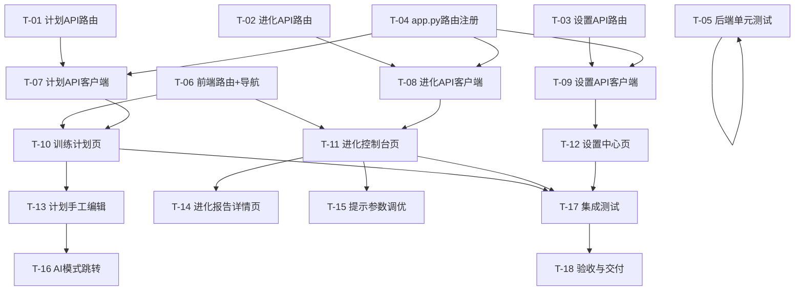

# v0.29.0 WebUI管理控制台 开发任务拆解清单

> **版本**: v1.0.0
> **基线**: v0.28.0
> **目标版本**: v0.29.0
> **创建日期**: 2026-06-09
> **架构依据**: 架构设计说明书 v21.0.0 §12
> **需求依据**: REQ_需求规格说明书 v16.0 §5.5

---

## 一、迭代规划

### 迭代划分

| 迭代 | 目标 | 包含任务 | 准入条件 | 准出条件 |
|------|------|----------|----------|----------|
| **Sprint 1** | 后端API层 | T-01~T-06 | 架构评审通过 | 12个API端点全部可调用+单元测试通过 |
| **Sprint 2** | 前端P0页面 | T-07~T-11 | Sprint 1完成 | 训练计划页+进化控制台页可交互 |
| **Sprint 3** | 前端P1/P2+集成 | T-12~T-17 | Sprint 2完成 | 全部4个页面可用+端到端集成测试通过 |

### 依赖关系图

---

## 二、任务清单

### Sprint 1: 后端API层

#### T-01: 训练计划API路由

| 属性 | 值 |
|------|-----|
| **任务ID** | T-01 |
| **所属模块** | 后端/routes |
| **优先级** | P0 |
| **预估工时** | 6h |
| **前置依赖** | 无 |
| **需求映射** | REQ-D-37, REQ-D-38, REQ-D-39, REQ-D-41 |

**任务描述**：创建 `src/core/webui/routes/plan.py`，实现5个训练计划API端点。

**交付物**：
- `src/core/webui/routes/plan.py` — 计划API路由模块

**验收标准**：
1. `GET /api/webui/plan/list` 返回计划列表，调用 `PlanManager.list_plans()`
2. `GET /api/webui/plan/calendar` 返回日历数据，调用 `PlanManager.get_active_plan()` 并格式化
3. `GET /api/webui/plan/{plan_id}` 返回计划详情，调用 `PlanManager.get_plan()`
4. `GET /api/webui/plan/progress/{plan_id}` 返回执行进度，调用 `PlanManager.get_plan()` + `EvolutionStore.get_decision_outcome_pairs()`
5. `PUT /api/webui/plan/daily/{plan_id}/{date}` 更新单日训练，调用 `PlanManager.record_execution()`
6. 所有端点通过Token认证
7. 同步方法通过 `run_in_threadpool` 包装
8. 错误响应使用 `HTTPException`，404返回"计划不存在"

---

#### T-02: 进化引擎API路由

| 属性 | 值 |
|------|-----|
| **任务ID** | T-02 |
| **所属模块** | 后端/routes |
| **优先级** | P0 |
| **预估工时** | 6h |
| **前置依赖** | 无 |
| **需求映射** | REQ-D-42, REQ-D-43, REQ-D-44 |

**任务描述**：创建 `src/core/webui/routes/evolution.py`，实现5个进化引擎API端点。

**交付物**：
- `src/core/webui/routes/evolution.py` — 进化引擎API路由模块

**验收标准**：
1. `GET /api/webui/evolution/status` 返回进化状态（**只读，不触发动作**），调用 `EvolutionController.check_triggers()`，docstring明确只读语义
2. `GET /api/webui/evolution/tuning` 返回当前调优参数，调用 `PromptTuner.get_params()`
3. `PUT /api/webui/evolution/tuning` 更新调优参数，调用 `PromptTuner.update_params()`
4. `GET /api/webui/evolution/reports` 返回可用报告月份列表，扫描 `data_dir/decisions/` 目录
5. `GET /api/webui/evolution/reports/{month}` 返回指定月份报告，调用 `EvolutionReporter.generate_report(month)`
6. 所有端点通过Token认证
7. 同步方法通过 `run_in_threadpool` 包装

---

#### T-03: 设置中心API路由

| 属性 | 值 |
|------|-----|
| **任务ID** | T-03 |
| **所属模块** | 后端/routes |
| **优先级** | P1 |
| **预估工时** | 3h |
| **前置依赖** | 无 |
| **需求映射** | REQ-D-45, REQ-D-46 |

**任务描述**：创建 `src/core/webui/routes/settings.py`，实现3个设置中心API端点。

**交付物**：
- `src/core/webui/routes/settings.py` — 设置中心API路由模块

**验收标准**：
1. `GET /api/webui/settings/profile` 返回个人信息，从 `ConfigManager.load_config()` 提取profile节
2. `PUT /api/webui/settings/profile` 更新个人信息，调用 `ConfigManager.save_config()`
3. `GET /api/webui/settings/system` 返回系统配置（只读），从 `ConfigManager.load_config()` 提取system节
4. PUT端点校验输入字段（age>0, max_heart_rate范围等）
5. 所有端点通过Token认证

---

#### T-04: app.py路由注册

| 属性 | 值 |
|------|-----|
| **任务ID** | T-04 |
| **所属模块** | 后端/app |
| **优先级** | P0 |
| **预估工时** | 1h |
| **前置依赖** | T-01, T-02, T-03 |

**任务描述**：修改 `src/core/webui/app.py`，注册3个新路由。

**交付物**：
- `src/core/webui/app.py` — 新增3行include_router

**验收标准**：
1. plan/evolution/settings三个路由模块正确注册
2. 现有5个路由模块不受影响
3. `/docs` 页面可看到新增端点

---

#### T-05: 后端单元测试

| 属性 | 值 |
|------|-----|
| **任务ID** | T-05 |
| **所属模块** | 测试 |
| **优先级** | P0 |
| **预估工时** | 6h |
| **前置依赖** | T-04 |

**任务描述**：为3个新路由模块编写单元测试，Mock核心模块调用。

**交付物**：
- `tests/unit/webui/test_plan_routes.py`
- `tests/unit/webui/test_evolution_routes.py`
- `tests/unit/webui/test_settings_routes.py`

**验收标准**：
1. 每个API端点至少1个正常用例+1个异常用例
2. Mock核心模块（PlanManager/EvolutionController/PromptTuner/EvolutionReporter/ConfigManager）
3. 验证Token认证拦截未认证请求
4. 验证错误响应格式（HTTPException）
5. `uv run pytest tests/unit/webui/` 全部通过

---

#### T-06: 前端路由与导航扩展

| 属性 | 值 |
|------|-----|
| **任务ID** | T-06 |
| **所属模块** | 前端/路由 |
| **优先级** | P0 |
| **预估工时** | 2h |
| **前置依赖** | 无 |

**任务描述**：在App.tsx中新增4个路由，在Sidebar中新增3个导航项。

**交付物**：
- `webui/src/App.tsx` — 新增4个路由
- `webui/src/components/layout/Sidebar.tsx` — 新增3个导航项

**验收标准**：
1. `/plan`、`/evolution`、`/evolution/reports/:month`、`/settings` 路由可访问
2. Sidebar显示"训练计划"、"进化控制台"、"设置"三个新导航项
3. 现有6个页面路由不受影响
4. 新页面暂显示占位内容（"开发中"）

---

### Sprint 2: 前端P0页面

#### T-07: 计划API客户端

| 属性 | 值 |
|------|-----|
| **任务ID** | T-07 |
| **所属模块** | 前端/api |
| **优先级** | P0 |
| **预估工时** | 2h |
| **前置依赖** | T-04 |

**任务描述**：创建 `webui/src/api/plan.ts`，封装5个计划API调用。

**交付物**：
- `webui/src/api/plan.ts` — 计划API客户端

**验收标准**：
1. `fetchPlanList()` 调用 `GET /api/webui/plan/list`
2. `fetchPlanCalendar()` 调用 `GET /api/webui/plan/calendar`
3. `fetchPlanDetail(planId)` 调用 `GET /api/webui/plan/{plan_id}`
4. `fetchPlanProgress(planId)` 调用 `GET /api/webui/plan/progress/{plan_id}`
5. `updateDailyPlan(planId, date, data)` 调用 `PUT /api/webui/plan/daily/{plan_id}/{date}`
6. 复用 `webui/src/api/client.ts` 的认证和错误处理

---

#### T-08: 进化API客户端

| 属性 | 值 |
|------|-----|
| **任务ID** | T-08 |
| **所属模块** | 前端/api |
| **优先级** | P0 |
| **预估工时** | 2h |
| **前置依赖** | T-04 |

**任务描述**：创建 `webui/src/api/evolution.ts`，封装5个进化API调用。

**交付物**：
- `webui/src/api/evolution.ts` — 进化API客户端

**验收标准**：
1. `fetchEvolutionStatus()` 调用 `GET /api/webui/evolution/status`
2. `fetchTuningParams()` 调用 `GET /api/webui/evolution/tuning`
3. `updateTuningParams(params)` 调用 `PUT /api/webui/evolution/tuning`
4. `fetchReportMonths()` 调用 `GET /api/webui/evolution/reports`
5. `fetchReport(month)` 调用 `GET /api/webui/evolution/reports/{month}`
6. 复用 `webui/src/api/client.ts` 的认证和错误处理

---

#### T-09: 设置API客户端

| 属性 | 值 |
|------|-----|
| **任务ID** | T-09 |
| **所属模块** | 前端/api |
| **优先级** | P1 |
| **预估工时** | 1h |
| **前置依赖** | T-04 |

**任务描述**：创建 `webui/src/api/settings.ts`，封装3个设置API调用。

**交付物**：
- `webui/src/api/settings.ts` — 设置API客户端

**验收标准**：
1. `fetchProfile()` 调用 `GET /api/webui/settings/profile`
2. `updateProfile(data)` 调用 `PUT /api/webui/settings/profile`
3. `fetchSystemConfig()` 调用 `GET /api/webui/settings/system`
4. 复用 `webui/src/api/client.ts` 的认证和错误处理

---

#### T-10: 训练计划页面

| 属性 | 值 |
|------|-----|
| **任务ID** | T-10 |
| **所属模块** | 前端/pages+components |
| **优先级** | P0 |
| **预估工时** | 8h |
| **前置依赖** | T-06, T-07 |

**任务描述**：实现训练计划页面，包含日历视图、列表视图、进度展示三个核心组件。

**交付物**：
- `webui/src/pages/PlanPage.tsx` — 训练计划页面
- `webui/src/components/plan/PlanCalendar.tsx` — 日历视图（CSS Grid自建）
- `webui/src/components/plan/PlanList.tsx` — 列表视图
- `webui/src/components/plan/PlanProgress.tsx` — 进度环形图
- `webui/src/components/plan/DailyPlanCard.tsx` — 训练日卡片

**验收标准**：
1. 日历视图正确渲染当前活跃计划的所有训练日（REQ-D-37）
2. 每日卡片显示 workout_type.label / distance_km / target_pace（REQ-D-37）
3. 支持周视图/月视图切换（REQ-D-37）
4. 无计划时显示空状态提示（REQ-D-37）
5. 列表视图展示所有计划，活跃计划高亮（REQ-D-38）
6. 完成率环形图 + 忠实度指标展示（REQ-D-39）
7. 按周汇总完成率/实际vs计划距离对比（REQ-D-39）

---

#### T-11: 进化控制台页面

| 属性 | 值 |
|------|-----|
| **任务ID** | T-11 |
| **所属模块** | 前端/pages+components |
| **优先级** | P0 |
| **预估工时** | 6h |
| **前置依赖** | T-06, T-08 |

**任务描述**：实现进化控制台页面，包含状态面板和触发条件卡片。

**交付物**：
- `webui/src/pages/EvolutionPage.tsx` — 进化控制台页面
- `webui/src/components/evolution/EvolutionStatusPanel.tsx` — 进化状态面板
- `webui/src/components/evolution/TriggerConditionCard.tsx` — 触发条件卡片

**验收标准**：
1. 状态卡片显示进化引擎运行状态（REQ-D-42）
2. 4条触发条件各显示当前值vs阈值（REQ-D-42）
3. 最近5条进化动作按时间倒序展示（REQ-D-42）
4. 手动刷新按钮（ADR-025）
5. 无数据时显示空状态提示

---

### Sprint 3: 前端P1/P2功能+集成

#### T-12: 设置中心页面

| 属性 | 值 |
|------|-----|
| **任务ID** | T-12 |
| **所属模块** | 前端/pages+components |
| **优先级** | P1 |
| **预估工时** | 4h |
| **前置依赖** | T-06, T-09 |

**任务描述**：实现设置中心页面，包含个人信息编辑和系统配置展示。

**交付物**：
- `webui/src/pages/SettingsPage.tsx` — 设置中心页面
- `webui/src/components/settings/ProfileSection.tsx` — 个人信息编辑
- `webui/src/components/settings/SystemSection.tsx` — 系统配置展示

**验收标准**：
1. 个人信息表单展示当前配置（REQ-D-45）
2. 编辑后保存调用PUT API（REQ-D-45）
3. 系统配置只读展示（REQ-D-46）
4. 输入校验（age>0, max_heart_rate范围）

---

#### T-13: 计划手工编辑功能

| 属性 | 值 |
|------|-----|
| **任务ID** | T-13 |
| **所属模块** | 前端/components |
| **优先级** | P1 |
| **预估工时** | 4h |
| **前置依赖** | T-10 |

**任务描述**：实现训练日手工编辑表单，支持修改距离/配速/类型等。

**交付物**：
- `webui/src/components/plan/DailyPlanEditor.tsx` — 手工编辑表单

**验收标准**：
1. 支持编辑 DailyPlan 的 distance_km / duration_min / target_pace / workout_type / notes（REQ-D-41）
2. 编辑后调用 PUT API 持久化（REQ-D-41）
3. 输入校验（距离>0、时长>0）（REQ-D-41）
4. 保存成功后页面自动刷新（REQ-D-41）

---

#### T-14: 进化报告详情页

| 属性 | 值 |
|------|-----|
| **任务ID** | T-14 |
| **所属模块** | 前端/pages+components |
| **优先级** | P1 |
| **预估工时** | 6h |
| **前置依赖** | T-11 |

**任务描述**：实现进化报告列表和详情页，复用v0.28.0图表组件。

**交付物**：
- `webui/src/pages/EvolutionReportPage.tsx` — 报告详情页
- `webui/src/components/evolution/EvolutionReportList.tsx` — 报告列表

**验收标准**：
1. 报告列表按月份倒序展示（REQ-D-44）
2. 点击进入报告详情页（REQ-D-44）
3. 详情页展示决策统计/准确率趋势/校准摘要/调优摘要/建议列表（REQ-D-44）
4. 复用v0.28.0 Recharts图表组件

---

#### T-15: 提示参数调优功能

| 属性 | 值 |
|------|-----|
| **任务ID** | T-15 |
| **所属模块** | 前端/components |
| **优先级** | P1 |
| **预估工时** | 3h |
| **前置依赖** | T-11 |

**任务描述**：实现4维参数滑块调整组件。

**交付物**：
- `webui/src/components/evolution/PromptTuningSliders.tsx` — 提示参数调优滑块

**验收标准**：
1. 4个滑块对应 tone/detail/aggressive/data_driven，范围0.0-1.0，步长0.05（REQ-D-43）
2. 滑块值与当前持久化参数同步（REQ-D-43）
3. "保存"按钮调用 PUT API 持久化（REQ-D-43）
4. "恢复默认"按钮重置为0.5（REQ-D-43）

---

#### T-16: AI模式跳转

| 属性 | 值 |
|------|-----|
| **任务ID** | T-16 |
| **所属模块** | 前端/components |
| **优先级** | P1 |
| **预估工时** | 1h |
| **前置依赖** | T-10 |

**任务描述**：在训练计划页添加"AI调整"按钮，跳转到8765端口。

**交付物**：
- 修改 `PlanPage.tsx` — 新增AI调整按钮

**验收标准**：
1. 点击"AI调整"按钮跳转到 `http://127.0.0.1:8765`（REQ-D-40，ADR-023）
2. URL参数注入当前plan_id（REQ-D-40）
3. 跳转前检查8765服务是否可用，不可用时提示用户

---

#### T-17: 集成测试

| 属性 | 值 |
|------|-----|
| **任务ID** | T-17 |
| **所属模块** | 测试 |
| **优先级** | P0 |
| **预估工时** | 6h |
| **前置依赖** | T-10, T-11, T-12 |

**任务描述**：编写端到端集成测试，覆盖12个新API端点+4个前端页面。

**交付物**：
- `tests/integration/test_webui_plan_api.py`
- `tests/integration/test_webui_evolution_api.py`
- `tests/integration/test_webui_settings_api.py`

**验收标准**：
1. 12个API端点全部有集成测试覆盖
2. 使用TestClient模拟HTTP请求
3. 验证完整请求-响应流程（含Token认证）
4. 验证数据与CLI命令输出一致性
5. `uv run pytest tests/integration/test_webui_*.py` 全部通过

---

#### T-18: 验收与交付

| 属性 | 值 |
|------|-----|
| **任务ID** | T-18 |
| **所属模块** | 交付 |
| **优先级** | P0 |
| **预估工时** | 2h |
| **前置依赖** | T-17 |

**任务描述**：执行验收检查，更新文档，输出交付报告。

**交付物**：
- 更新AGENTS.md版本信息
- 更新架构设计说明书状态标记
- 输出v0.29.0交付报告

**验收标准**：
1. 所有P0需求验收标准通过
2. 所有P1需求验收标准通过
3. 单元测试+集成测试全部通过
4. 文档与代码一致

---

## 三、工作量汇总

| Sprint | 任务数 | P0任务数 | 总工时 |
|--------|--------|----------|--------|
| Sprint 1 | 6 | 4 | 24h |
| Sprint 2 | 5 | 3 | 19h |
| Sprint 3 | 6 | 2 | 22h |
| **合计** | **17** | **9** | **65h** |

## 四、高风险任务标注

| 任务 | 风险点 | 缓解措施 |
|------|--------|----------|
| T-02 进化API路由 | `check_triggers()`语义需严格只读 | F-01已修正：docstring+注释保护 |
| T-02 进化API路由 | 报告列表数据源需扫描目录 | F-02已修正：扫描decisions目录月份分片 |
| T-10 训练计划页面 | 日历组件自建复杂度 | ADR-024：CSS Grid+date-fns，训练场景简单 |
| T-14 进化报告详情页 | 报告数据结构复杂 | 复用v0.28.0 Recharts组件，降低开发量 |

## 五、技术约束

1. **TDD**：每个任务必须先写失败测试，再写实现（RED→GREEN→REFACTOR）
2. **不修改v0.28.0现有模块**：纯增量扩展
3. **API层薄封装**：业务逻辑全部委托核心模块
4. **并发安全**：同步方法通过`run_in_threadpool`包装
5. **统一错误响应**：使用FastAPI HTTPException
