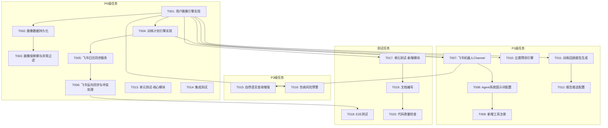

# 迭代开发任务清单 v0.4.0

## 📋 文档信息

| 项目 | 内容 |
|------|------|
| **版本号** | v0.4.0-task-v1.0 |
| **迭代主题** | 智能个性化 + 飞书深度集成 |
| **基线版本** | v0.3.1 |
| **创建日期** | 2026-03-18 |
| **文档状态** | 已发布 |
| **关联文档** | [迭代需求规格说明书](../requirement/0.4.0/迭代需求规格说明书.md) \| [迭代架构设计说明书](../architecture/0.4.0/迭代架构设计说明书.md) |

---

## 1. 任务分解总览

### 1.1 任务统计

| 优先级 | 任务数量 | 预估工时 | 占比 |
|--------|---------|---------|------|
| P0 | 8 | 44h | 50% |
| P1 | 6 | 24h | 27% |
| P3 | 3 | 14h | 16% |
| 测试 | 3 | 6h | 7% |
| **合计** | **20** | **88h** | **100%** |

### 1.2 里程碑规划

| 里程碑 | 时间节点 | 交付物 | 任务范围 |
|--------|---------|--------|---------|
| M1: 画像系统实现 | Day 3 | 用户画像引擎 + 持久化 + 保鲜期机制 | T001-T003 |
| M2: 训练计划实现 | Day 7 | 训练计划引擎 + 日历同步（含反向同步） | T004-T006 |
| M3: 飞书集成完成 | Day 9 | 机器人 Channel + Agent 提示词配置 | T007-T009 |
| M4: 增强功能完成 | Day 10 | 预测（公式拟合） + 报告 | T010-T012 |
| M5: 测试与发布 | Day 11 | 测试通过 + 文档完善 | T013-T020 |

### 1.3 任务依赖关系图



---

## 2. 详细任务清单

### 2.1 P0 级任务

#### T001: 用户画像引擎实现

| 属性 | 内容 |
|------|------|
| **任务ID** | T001 |
| **任务名称** | 用户画像引擎实现 |
| **优先级** | P0 |
| **预估工时** | 8h |
| **前置依赖** | 无 |
| **负责模块** | core/profile.py |

**任务描述**:
实现 `RunnerProfileEngine` 类，支持多维度用户画像构建。

**详细子任务**:
1. 定义画像数据结构 (`RunnerProfile`, `FitnessLevel`, `TrainingPattern` 等)
2. 实现 `build_profile()` 方法
3. 实现 `get_fitness_level()` 方法
4. 实现 `get_training_pattern()` 方法
5. 实现 `calculate_injury_risk()` 方法

**验收标准**:
- [ ] 画像数据结构完整定义
- [ ] `build_profile()` 可基于历史数据生成画像
- [ ] 各维度计算方法实现完整
- [ ] 代码通过 mypy 类型检查
- [ ] 单元测试覆盖率 >= 80%

**输出产物**:
- `src/core/profile.py`

---

#### T002: 画像数据持久化

| 属性 | 内容 |
|------|------|
| **任务ID** | T002 |
| **任务名称** | 画像数据持久化 |
| **优先级** | P0 |
| **预估工时** | 4h |
| **前置依赖** | T001 |
| **负责模块** | core/profile.py |

**任务描述**:
实现画像数据的 JSON 持久化存储。

**详细子任务**:
1. 实现 `save_profile()` 方法
2. 实现 `load_profile()` 方法
3. 定义存储路径 (`~/.nanobot-runner/data/profile.json`)
4. 实现版本兼容性检查

**验收标准**:
- [ ] 画像数据可正确保存为 JSON
- [ ] 画像数据可正确加载
- [ ] 支持版本兼容性检查
- [ ] 异常情况有完整处理

**输出产物**:
- `src/core/profile.py` (扩展)

---

#### T003: 画像保鲜期与异常过滤

| 属性 | 内容 |
|------|------|
| **任务ID** | T003 |
| **任务名称** | 画像保鲜期与异常过滤 |
| **优先级** | P0 |
| **预估工时** | 4h |
| **前置依赖** | T002 |
| **负责模块** | core/profile.py |

**任务描述**:
实现画像保鲜期机制和异常数据过滤规则。

**详细子任务**:
1. 实现 `check_freshness()` 方法
2. 定义 `ProfileStaleStatus` 数据结构
3. 定义 `ANOMALY_FILTER_RULES` 异常过滤规则
4. 实现 `filter_anomaly_data()` 方法

**验收标准**:
- [ ] 保鲜期检查正确（7天阈值）
- [ ] 异常数据过滤规则完整
- [ ] 过滤后的数据不影响画像准确性

**输出产物**:
- `src/core/profile.py` (扩展)

---

#### T004: 训练计划引擎实现

| 属性 | 内容 |
|------|------|
| **任务ID** | T004 |
| **任务名称** | 训练计划引擎实现 |
| **优先级** | P0 |
| **预估工时** | 12h |
| **前置依赖** | T001 |
| **负责模块** | core/training_plan.py |

**任务描述**:
实现 `TrainingPlanEngine` 类，支持周期化训练计划生成和动态调整。

**详细子任务**:
1. 定义训练计划数据结构 (`TrainingPlan`, `WeeklySchedule`, `DailyPlan`)
2. 实现 `generate_plan()` 方法
3. 实现 `adjust_plan()` 方法（含心率漂移/主观疲劳度参数）
4. 实现 `get_daily_workout()` 方法
5. 实现 `get_phase_config_by_fitness_level()` 动态阶段配置
6. 定义 `PHASE_CONFIG` 阶段划分配置

**验收标准**:
- [ ] 训练计划数据结构完整定义
- [ ] 计划生成符合运动科学原理
- [ ] 动态调整算法支持多维度参数
- [ ] 阶段配置支持体能水平动态调整
- [ ] 单元测试覆盖率 >= 80%

**输出产物**:
- `src/core/training_plan.py`

---

#### T005: 飞书日历同步服务

| 属性 | 内容 |
|------|------|
| **任务ID** | T005 |
| **任务名称** | 飞书日历同步服务 |
| **优先级** | P0 |
| **预估工时** | 8h |
| **前置依赖** | T004 |
| **负责模块** | notify/feishu_calendar.py |

**任务描述**:
实现飞书日历同步服务，支持训练计划同步到飞书日历。

**详细子任务**:
1. 实现 `FeishuCalendarSync` 类
2. 实现 `sync_plan()` 方法
3. 实现 `sync_daily_workout()` 方法
4. 实现 `build_calendar_event()` 日历事件构建
5. 封装飞书日历 API 调用

**验收标准**:
- [ ] 训练计划可同步到飞书日历
- [ ] 日历事件格式正确
- [ ] 同步成功率 >= 99%
- [ ] 同步失败有详细日志

**输出产物**:
- `src/notify/feishu_calendar.py`

---

#### T006: 飞书反向同步与冲突处理

| 属性 | 内容 |
|------|------|
| **任务ID** | T006 |
| **任务名称** | 飞书反向同步与冲突处理 |
| **优先级** | P0 |
| **预估工时** | 8h |
| **前置依赖** | T005 |
| **负责模块** | notify/feishu_calendar.py |

**任务描述**:
实现飞书日历反向同步和冲突处理策略。

**详细子任务**:
1. 实现 `FeishuCalendarWebhookHandler` 类
2. 实现 `handle_calendar_event_update()` 方法
3. 实现 `resolve_calendar_conflict()` 冲突处理
4. 实现 `build_conflict_resolution_card()` 询问卡片构建
5. 定义 `ConflictResolutionStrategy` 枚举

**验收标准**:
- [ ] 飞书日历变更可同步到本地
- [ ] 冲突检测正确
- [ ] 冲突处理策略完整（自动顺延/询问用户）
- [ ] 卡片消息格式正确

**输出产物**:
- `src/notify/feishu_calendar.py` (扩展)

---

#### T013: 单元测试-核心模块

| 属性 | 内容 |
|------|------|
| **任务ID** | T013 |
| **任务名称** | 单元测试-核心模块 |
| **优先级** | P0 |
| **预估工时** | 4h |
| **前置依赖** | T001-T006 |
| **负责模块** | tests/unit/ |

**任务描述**:
为核心模块编写单元测试。

**详细子任务**:
1. 编写 `test_profile.py` 画像引擎测试
2. 编写 `test_training_plan.py` 训练计划测试
3. 编写 `test_feishu_calendar.py` 日历同步测试

**验收标准**:
- [ ] 核心模块覆盖率 >= 80%
- [ ] 所有测试用例通过
- [ ] 边界场景覆盖

**输出产物**:
- `tests/unit/test_profile.py`
- `tests/unit/test_training_plan.py`
- `tests/unit/test_feishu_calendar.py`

---

#### T014: 集成测试

| 属性 | 内容 |
|------|------|
| **任务ID** | T014 |
| **任务名称** | 集成测试 |
| **优先级** | P0 |
| **预估工时** | 4h |
| **前置依赖** | T001-T006 |
| **负责模块** | tests/integration/ |

**任务描述**:
编写集成测试，验证模块间协作。

**详细子任务**:
1. 编写画像-计划集成测试
2. 编写计划-日历集成测试
3. 编写端到端场景测试

**验收标准**:
- [ ] 模块间协作正确
- [ ] 数据流完整
- [ ] 集成测试通过率 100%

**输出产物**:
- `tests/integration/test_profile_plan_integration.py`
- `tests/integration/test_plan_calendar_integration.py`

---

### 2.2 P1 级任务

#### T007: 飞书机器人Channel

| 属性 | 内容 |
|------|------|
| **任务ID** | T007 |
| **任务名称** | 飞书机器人Channel |
| **优先级** | P1 |
| **预估工时** | 6h |
| **前置依赖** | T001, T004 |
| **负责模块** | notify/feishu_bot.py |

**任务描述**:
实现飞书机器人通道，仅做协议转换。

**详细子任务**:
1. 实现 `FeishuBotChannel` 类
2. 实现 `handle_message()` 方法
3. 实现 `_extract_content()` 方法
4. 实现 `_convert_to_feishu_response()` 方法
5. 定义 `BotResponse` 数据结构

**验收标准**:
- [ ] 消息接收正确
- [ ] 协议转换正确
- [ ] 不直接调用工具
- [ ] 所有消息统一转发 Agent

**输出产物**:
- `src/notify/feishu_bot.py`

---

#### T008: Agent系统提示词配置

| 属性 | 内容 |
|------|------|
| **任务ID** | T008 |
| **任务名称** | Agent系统提示词配置 |
| **优先级** | P1 |
| **预估工时** | 2h |
| **前置依赖** | T007 |
| **负责模块** | agents/prompts.py |

**任务描述**:
配置 Agent 系统提示词，包括快捷指令映射和画像上下文。

**详细子任务**:
1. 定义 `AGENT_SYSTEM_PROMPT` 模板
2. 定义快捷指令映射规则
3. 实现画像上下文注入
4. 实现提示词模板渲染

**验收标准**:
- [ ] 快捷指令映射正确
- [ ] 画像上下文正确注入
- [ ] 提示词模板可配置

**输出产物**:
- `src/agents/prompts.py`

---

#### T009: 新增工具注册

| 属性 | 内容 |
|------|------|
| **任务ID** | T009 |
| **任务名称** | 新增工具注册 |
| **优先级** | P1 |
| **预估工时** | 4h |
| **前置依赖** | T008 |
| **负责模块** | agents/tools_v2.py |

**任务描述**:
实现新增工具类并注册到 ToolRegistry。

**详细子任务**:
1. 实现 `GetProfileTool`
2. 实现 `GetTrainingPlanTool`
3. 实现 `CreateTrainingPlanTool`
4. 实现 `AdjustTrainingPlanTool`
5. 实现 `PredictRaceTimeTool`
6. 实现 `GetWeeklyReportTool`
7. 实现 `GetMonthlyReportTool`
8. 实现 `CheckInjuryRiskTool`
9. 实现 `create_tools_v2()` 工厂函数

**验收标准**:
- [ ] 所有工具类实现完整
- [ ] 工具 schema 格式正确
- [ ] 工具可正确注册到 ToolRegistry

**输出产物**:
- `src/agents/tools_v2.py`

---

#### T010: 比赛预测引擎

| 属性 | 内容 |
|------|------|
| **任务ID** | T010 |
| **任务名称** | 比赛预测引擎 |
| **优先级** | P1 |
| **预估工时** | 6h |
| **前置依赖** | T001 |
| **负责模块** | core/prediction.py |

**任务描述**:
实现比赛成绩预测引擎，使用公式拟合算法。

**详细子任务**:
1. 实现 `PredictionEngine` 类
2. 实现 `vdot_to_time_by_formula()` 公式拟合算法
3. 实现 `time_to_vdot()` 反向计算
4. 实现 `predict()` 方法
5. 实现 `calculate_confidence()` 置信度计算

**验收标准**:
- [ ] 公式拟合算法覆盖 VDOT 20-85
- [ ] 支持任意距离计算
- [ ] 预测误差在合理范围内
- [ ] 置信度计算正确

**输出产物**:
- `src/core/prediction.py`

---

#### T011: 训练回顾报告生成

| 属性 | 内容 |
|------|------|
| **任务ID** | T011 |
| **任务名称** | 训练回顾报告生成 |
| **优先级** | P1 |
| **预估工时** | 6h |
| **前置依赖** | T001 |
| **负责模块** | report/ |

**任务描述**:
实现训练回顾报告生成器。

**详细子任务**:
1. 实现 `ReportGenerator` 类
2. 实现 `generate_weekly_report()` 方法
3. 实现 `generate_monthly_report()` 方法
4. 实现 `identify_highlights()` 方法
5. 实现 `identify_concerns()` 方法
6. 实现 `generate_recommendations()` 方法

**验收标准**:
- [ ] 报告内容准确完整
- [ ] 报告生成时间 < 3 秒
- [ ] 支持周报和月报

**输出产物**:
- `src/report/__init__.py`
- `src/report/generator.py`
- `src/report/weekly_report.py`
- `src/report/monthly_report.py`

---

#### T012: 报告推送配置

| 属性 | 内容 |
|------|------|
| **任务ID** | T012 |
| **任务名称** | 报告推送配置 |
| **优先级** | P1 |
| **预估工时** | 4h |
| **前置依赖** | T011 |
| **负责模块** | core/report_service.py |

**任务描述**:
扩展报告服务，支持周报和月报推送。

**详细子任务**:
1. 扩展 `ReportService` 类
2. 实现周报定时推送配置
3. 实现月报定时推送配置
4. 集成飞书推送

**验收标准**:
- [ ] 定时推送配置正确
- [ ] 飞书推送成功
- [ ] 支持本地保存

**输出产物**:
- `src/core/report_service.py` (扩展)

---

### 2.3 P3 级任务

#### T015: 自然语言查询增强

| 属性 | 内容 |
|------|------|
| **任务ID** | T015 |
| **任务名称** | 自然语言查询增强 |
| **优先级** | P3 |
| **预估工时** | 6h |
| **前置依赖** | T007, T008 |
| **负责模块** | agents/tools_v2.py |

**任务描述**:
增强自然语言查询能力，支持复杂查询场景。

**详细子任务**:
1. 定义 `QUERY_INTENTS` 意图映射
2. 实现对比分析查询处理
3. 实现趋势分析查询处理
4. 实现建议查询处理
5. 实现预测查询处理

**验收标准**:
- [ ] 意图识别准确率 >= 90%
- [ ] 响应时间 < 3 秒
- [ ] 支持上下文理解

**输出产物**:
- `src/agents/tools_v2.py` (扩展)

---

#### T016: 伤病风险预警

| 属性 | 内容 |
|------|------|
| **任务ID** | T016 |
| **任务名称** | 伤病风险预警 |
| **优先级** | P3 |
| **预估工时** | 4h |
| **前置依赖** | T001 |
| **负责模块** | core/profile.py |

**任务描述**:
实现伤病风险监测和预警功能。

**详细子任务**:
1. 定义 `INJURY_RISK_INDICATORS` 预警指标
2. 实现 `InjuryRiskMonitor` 类
3. 实现 `assess_risk()` 方法
4. 实现 `generate_warning()` 方法

**验收标准**:
- [ ] 风险判定准确
- [ ] 预警及时推送
- [ ] 提供具体建议

**输出产物**:
- `src/core/profile.py` (扩展)

---

### 2.4 测试任务

#### T017: 单元测试-新增模块

| 属性 | 内容 |
|------|------|
| **任务ID** | T017 |
| **任务名称** | 单元测试-新增模块 |
| **优先级** | P1 |
| **预估工时** | 4h |
| **前置依赖** | T001-T016 |
| **负责模块** | tests/unit/ |

**任务描述**:
为新增模块补充单元测试。

**详细子任务**:
1. 编写 `test_prediction.py` 预测引擎测试
2. 编写 `test_feishu_bot.py` 机器人通道测试
3. 编写 `test_report.py` 报告生成测试

**验收标准**:
- [ ] 新增模块覆盖率 >= 80%
- [ ] 所有测试用例通过

**输出产物**:
- `tests/unit/test_prediction.py`
- `tests/unit/test_feishu_bot.py`
- `tests/unit/test_report.py`

---

#### T018: E2E测试

| 属性 | 内容 |
|------|------|
| **任务ID** | T018 |
| **任务名称** | E2E测试 |
| **优先级** | P1 |
| **预估工时** | 4h |
| **前置依赖** | T006, T017 |
| **负责模块** | tests/e2e/ |

**任务描述**:
编写端到端测试，验证完整业务流程。

**详细子任务**:
1. 编写画像查询 E2E 测试
2. 编写训练计划创建 E2E 测试
3. 编写飞书交互 E2E 测试

**验收标准**:
- [ ] E2E 测试覆盖核心业务流程
- [ ] 所有 E2E 测试通过

**输出产物**:
- `tests/e2e/test_profile_e2e.py`
- `tests/e2e/test_plan_e2e.py`
- `tests/e2e/test_feishu_e2e.py`

---

#### T019: 文档编写

| 属性 | 内容 |
|------|------|
| **任务ID** | T019 |
| **任务名称** | 文档编写 |
| **优先级** | P1 |
| **预估工时** | 4h |
| **前置依赖** | T017 |
| **负责模块** | docs/ |

**任务描述**:
编写开发文档和用户文档。

**详细子任务**:
1. 更新 README.md
2. 编写 API 文档
3. 编写用户使用指南
4. 编写开发者指南

**验收标准**:
- [ ] 文档完整准确
- [ ] 示例代码可运行

**输出产物**:
- `README.md` (更新)
- `docs/api/`
- `docs/user_guide/`

---

#### T020: 代码质量检查

| 属性 | 内容 |
|------|------|
| **任务ID** | T020 |
| **任务名称** | 代码质量检查 |
| **优先级** | P1 |
| **预估工时** | 2h |
| **前置依赖** | T019 |
| **负责模块** | 全项目 |

**任务描述**:
执行代码质量检查，确保符合规范。

**详细子任务**:
1. 执行 black 格式化
2. 执行 isort 导入排序
3. 执行 mypy 类型检查
4. 执行 bandit 安全扫描
5. 修复所有问题

**验收标准**:
- [ ] black 检查通过
- [ ] isort 检查通过
- [ ] mypy 检查通过
- [ ] bandit 无高危漏洞

**输出产物**:
- 代码质量报告

---

## 3. 任务依赖关系

### 3.1 依赖矩阵

| 任务 | 前置依赖 | 后续任务 |
|------|---------|---------|
| T001 | - | T002, T004, T007, T010, T011, T016 |
| T002 | T001 | T003 |
| T003 | T002 | T013 |
| T004 | T001 | T005, T007 |
| T005 | T004 | T006 |
| T006 | T005 | T014, T018 |
| T007 | T001, T004 | T008, T015 |
| T008 | T007 | T009 |
| T009 | T008 | T017 |
| T010 | T001 | T017 |
| T011 | T001 | T012 |
| T012 | T011 | T017 |
| T013 | T001-T006 | T014 |
| T014 | T001-T006, T013 | T017 |
| T015 | T007, T008 | T017 |
| T016 | T001 | T017 |
| T017 | T001-T016 | T019 |
| T018 | T006, T017 | - |
| T019 | T017 | T020 |
| T020 | T019 | - |

### 3.2 关键路径

```
T001 → T002 → T003 → T013 → T014 → T017 → T019 → T020
(最长路径，约 11 个工作日)
```

---

## 4. 验收标准汇总

### 4.1 功能验收

| 需求编号 | 需求名称 | 验收标准 | 对应任务 |
|---------|---------|---------|---------|
| FR-001 | 用户画像系统 | 画像数据准确、保鲜期机制、异常过滤 | T001-T003 |
| FR-002 | 训练计划生成 | 计划科学、动态调整、阶段配置 | T004 |
| FR-003 | 飞书日历同步 | 双向同步、冲突处理 | T005-T006 |
| FR-004 | 飞书机器人交互 | 协议转换正确、Agent统一处理 | T007-T009 |
| FR-005 | 比赛成绩预测 | 公式拟合、置信度计算 | T010 |
| FR-006 | 智能训练回顾 | 报告准确、推送配置 | T011-T012 |
| FR-007 | 自然语言查询增强 | 意图识别 >= 90% | T015 |
| FR-008 | 伤病风险预警 | 风险判定准确 | T016 |

### 4.2 质量验收

| 指标 | 要求 | 测量工具 |
|------|------|---------|
| 单元测试覆盖率 | >= 80% | pytest-cov |
| 类型检查通过率 | 100% | mypy |
| 代码格式化 | 100% | black, isort |
| 安全扫描 | 无高危漏洞 | bandit |

### 4.3 性能验收

| 指标 | 要求 |
|------|------|
| 画像生成 | < 3 秒 |
| 画像更新 | < 2 秒 |
| 训练计划生成 | < 5 秒 |
| 日历同步 | < 2 秒/事件 |
| 查询响应 | < 3 秒 |

---

## 5. 风险识别

| 风险项 | 可能性 | 影响 | 应对策略 |
|--------|--------|------|---------|
| 架构设计与现有代码冲突 | 低 | 高 | 充分分析现有代码结构 |
| 任务拆解粒度过大 | 中 | 中 | 参考迭代需求规格说明书的任务分解 |
| 依赖关系遗漏 | 低 | 中 | 多轮检查依赖关系 |
| 飞书 API 权限限制 | 中 | 高 | 使用企业自建应用，提前申请权限 |
| 测试覆盖率不达标 | 中 | 中 | 开发过程中同步编写测试 |

---

## 6. 变更历史

| 版本 | 日期 | 变更内容 | 作者 |
|------|------|---------|------|
| v1.0 | 2026-03-18 | 初始版本 | 架构师智能体 |

---

**文档状态**: 已发布  
**发布版本**: v0.4.0-task-v1.0  
**关联文档**: [迭代需求规格说明书](../requirement/0.4.0/迭代需求规格说明书.md) \| [迭代架构设计说明书](../architecture/0.4.0/迭代架构设计说明书.md)
