# 开发任务拆解清单

## 训练计划制定与飞书日历同步功能

***

| 文档信息     | 内容                                                     |
| -------- | ------------------------------------------------------ |
| **文档版本** | v0.6.0                                                 |
| **创建日期** | 2026-04-01                                             |
| **最后更新** | 2026-04-01                                             |
| **维护者**  | Architecture Agent                                     |
| **关联需求** | PRD_训练计划制定与飞书日历同步.md (v1.3.0)                       |
| **架构设计** | 训练计划功能架构设计.md (v1.1.0)                              |

***

## 1. 任务概览

### 1.1 迭代计划

| 迭代 | 版本 | 目标 | 预计工期 | 状态 |
|------|------|------|---------|------|
| Sprint 1 | v0.6.0 | MVP核心功能（意图解析、计划生成、硬性校验、计划分析） | 48小时 | 待开始 |
| Sprint 2 | v0.7.0 | 日历同步与计划管理 | 24小时 | 待开始 |
| Sprint 3 | v0.8.0 | 训练提醒与优化 | 16小时 | 待开始 |

### 1.2 任务统计

| 指标 | 数量 |
|------|------|
| **任务总数** | 23个 |
| **P0任务** | 15个 |
| **P1任务** | 8个 |
| **总工作量** | 88小时 |
| **预计工期** | 11个工作日 |

***

## 2. 任务清单

### 2.1 Sprint 1: MVP核心功能 (v0.6.0)

#### 2.1.1 基础设施任务

| 任务ID | 任务名称 | 优先级 | 工作量 | 依赖 | 验收标准 |
|--------|---------|--------|--------|------|---------|
| T001 | 定义数据模型 | P0 | 4h | - | 所有数据模型定义完成，类型注解完整，通过mypy检查 |
| T002 | 创建模块目录结构 | P0 | 1h | T001 | 目录结构符合架构设计，__init__.py文件创建完成 |
| T003 | 编写单元测试框架 | P0 | 2h | T002 | 测试框架搭建完成，测试覆盖率统计工具配置完成 |

#### 2.1.2 M1: IntentParser（意图解析器）

| 任务ID | 任务名称 | 优先级 | 工作量 | 依赖 | 验收标准 |
|--------|---------|--------|--------|------|---------|
| T004 | 实现IntentParser核心类 | P0 | 4h | T001 | 核心类实现完成，支持parse方法 |
| T005 | 实现自然语言解析 | P0 | 3h | T004 | 支持自然语言输入解析，提取意图和参数 |
| T006 | 实现斜杠命令解析 | P0 | 2h | T004 | 支持斜杠命令解析，提取意图和参数 |
| T007 | 编写IntentParser单元测试 | P0 | 2h | T004-T006 | 单元测试覆盖率≥80%，所有测试用例通过 |

#### 2.1.3 M2: PlanGenerator（训练计划生成器）

| 任务ID | 任务名称 | 优先级 | 工作量 | 依赖 | 验收标准 |
|--------|---------|--------|--------|------|---------|
| T008 | 实现PlanGenerator核心类 | P0 | 4h | T001 | 核心类实现完成，支持generate方法 |
| T009 | 实现提示词模板构建 | P0 | 4h | T008 | 提示词模板构建完成，包含用户信息、目标信息、硬性约束 |
| T010 | 实现LLM响应解析 | P0 | 3h | T008 | LLM响应解析完成，输出TrainingPlan数据结构 |
| T011 | 编写PlanGenerator单元测试 | P0 | 3h | T008-T010 | 单元测试覆盖率≥80%，所有测试用例通过 |

#### 2.1.4 M3: HardValidator（硬性规则校验器）

| 任务ID | 任务名称 | 优先级 | 工作量 | 依赖 | 验收标准 |
|--------|---------|--------|--------|------|---------|
| T012 | 实现HardValidator核心类 | P0 | 3h | T001 | 核心类实现完成，支持validate方法 |
| T013 | 实现6条硬性校验规则 | P0 | 5h | T012 | 6条校验规则实现完成，每条规则有明确的校验逻辑和错误处理 |
| T014 | 实现LLM重试机制 | P0 | 2h | T012-T013 | LLM重试机制实现完成，支持最多3次重试 |
| T015 | 编写HardValidator单元测试 | P0 | 2h | T012-T014 | 单元测试覆盖率≥80%，所有测试用例通过 |

#### 2.1.5 M4: PlanAnalyzer（计划分析器）

| 任务ID | 任务名称 | 优先级 | 工作量 | 依赖 | 验收标准 |
|--------|---------|--------|--------|------|---------|
| T016 | 实现PlanAnalyzer核心类 | P0 | 3h | T001 | 核心类实现完成，支持analyze方法 |
| T017 | 实现4维度分析逻辑 | P0 | 5h | T016 | 4个分析维度实现完成，每个维度有明确的指标和评分逻辑 |
| T018 | 实现分析报告生成 | P0 | 2h | T016-T017 | 分析报告生成完成，包含总体评分、维度结果、改进建议、风险警告、医疗免责声明 |
| T019 | 编写PlanAnalyzer单元测试 | P0 | 2h | T016-T018 | 单元测试覆盖率≥80%，所有测试用例通过 |

### 2.2 Sprint 2: 日历同步与计划管理 (v0.7.0)

#### 2.2.1 M5: CalendarTool（日历同步工具）

| 任务ID | 任务名称 | 优先级 | 工作量 | 依赖 | 验收标准 |
|--------|---------|--------|--------|------|---------|
| T020 | 扩展FeishuCalendarSync | P0 | 4h | T001 | 扩展现有FeishuCalendarSync，支持完整的增删改生命周期管理 |
| T021 | 实现预同步检查 | P0 | 2h | T020 | 预同步检查实现完成，支持健康检测 |
| T022 | 实现乐观更新机制 | P0 | 3h | T020 | 乐观更新机制实现完成，支持预分配event_id和回滚 |
| T023 | 实现批量同步 | P0 | 3h | T020 | 批量同步实现完成，支持分批处理和断点续传 |
| T024 | 编写CalendarTool单元测试 | P0 | 4h | T020-T023 | 单元测试覆盖率≥80%，所有测试用例通过 |

#### 2.2.2 M7: PlanManager（训练计划管理器）

| 任务ID | 任务名称 | 优先级 | 工作量 | 依赖 | 验收标准 |
|--------|---------|--------|--------|------|---------|
| T025 | 实现PlanManager核心类 | P1 | 3h | T001 | 核心类实现完成，支持CRUD操作 |
| T026 | 实现计划状态管理 | P1 | 2h | T025 | 计划状态管理实现完成，支持状态转换验证 |
| T027 | 编写PlanManager单元测试 | P1 | 3h | T025-T026 | 单元测试覆盖率≥80%，所有测试用例通过 |

### 2.3 Sprint 3: 训练提醒与优化 (v0.8.0)

#### 2.3.1 M6: NotifyTool（通知提醒工具）

| 任务ID | 任务名称 | 优先级 | 工作量 | 依赖 | 验收标准 |
|--------|---------|--------|--------|------|---------|
| T028 | 实现NotifyTool核心类 | P1 | 3h | T001 | 核心类实现完成，支持send_reminder方法 |
| T029 | 实现智能免打扰逻辑 | P1 | 3h | T028 | 智能免打扰逻辑实现完成，支持4条免打扰规则 |
| T030 | 集成天气服务API | P1 | 2h | T028 | 天气服务API集成完成，支持获取天气信息和极端天气预警 |
| T031 | 编写NotifyTool单元测试 | P1 | 2h | T028-T030 | 单元测试覆盖率≥80%，所有测试用例通过 |

#### 2.3.2 集成与优化

| 任务ID | 任务名称 | 优先级 | 工作量 | 依赖 | 验收标准 |
|--------|---------|--------|--------|------|---------|
| T032 | Agent工具集成 | P0 | 4h | T007,T011,T015,T019,T024,T027,T031 | 所有模块集成到Agent工具集，支持OpenAI Function Calling规范 |
| T033 | 端到端测试 | P0 | 4h | T032 | 端到端测试完成，覆盖核心业务流程 |
| T034 | 性能优化 | P1 | 4h | T033 | 性能优化完成，响应时间≤5秒，内存占用≤500MB |
| T035 | 文档更新 | P1 | 2h | T033 | API文档、用户手册、开发指南更新完成 |

***

## 3. 依赖关系图

```mermaid
graph TB
    T001[T001: 定义数据模型] --> T002[T002: 创建模块目录结构]
    T001 --> T004[T004: 实现IntentParser核心类]
    T001 --> T008[T008: 实现PlanGenerator核心类]
    T001 --> T012[T012: 实现HardValidator核心类]
    T001 --> T016[T016: 实现PlanAnalyzer核心类]
    T001 --> T020[T020: 扩展FeishuCalendarSync]
    T001 --> T025[T025: 实现PlanManager核心类]
    T001 --> T028[T028: 实现NotifyTool核心类]
    
    T002 --> T003[T003: 编写单元测试框架]
    
    T004 --> T005[T005: 实现自然语言解析]
    T004 --> T006[T006: 实现斜杠命令解析]
    T004 --> T007[T007: 编写IntentParser单元测试]
    
    T008 --> T009[T009: 实现提示词模板构建]
    T008 --> T010[T010: 实现LLM响应解析]
    T008 --> T011[T011: 编写PlanGenerator单元测试]
    
    T012 --> T013[T013: 实现6条硬性校验规则]
    T012 --> T014[T014: 实现LLM重试机制]
    T012 --> T015[T015: 编写HardValidator单元测试]
    
    T016 --> T017[T017: 实现4维度分析逻辑]
    T016 --> T018[T018: 实现分析报告生成]
    T016 --> T019[T019: 编写PlanAnalyzer单元测试]
    
    T020 --> T021[T021: 实现预同步检查]
    T020 --> T022[T022: 实现乐观更新机制]
    T020 --> T023[T023: 实现批量同步]
    T020 --> T024[T024: 编写CalendarTool单元测试]
    
    T025 --> T026[T026: 实现计划状态管理]
    T025 --> T027[T027: 编写PlanManager单元测试]
    
    T028 --> T029[T029: 实现智能免打扰逻辑]
    T028 --> T030[T030: 集成天气服务API]
    T028 --> T031[T031: 编写NotifyTool单元测试]
    
    T007 --> T032[T032: Agent工具集成]
    T011 --> T032
    T015 --> T032
    T019 --> T032
    T024 --> T032
    T027 --> T032
    T031 --> T032
    
    T032 --> T033[T033: 端到端测试]
    T033 --> T034[T034: 性能优化]
    T033 --> T035[T035: 文档更新]
```

***

## 4. 任务详细说明

### 4.1 T001: 定义数据模型

**任务描述**：
定义训练计划功能所需的所有数据模型，包括IntentResult、TrainingPlan、UserProfile、UserContext、ValidationResult、AnalysisReport等。

**实现要点**：
- 使用Python dataclass定义数据模型
- 所有字段必须有类型注解
- 添加详细的文档字符串
- 确保数据模型与架构设计文档一致

**验收标准**：
- [ ] 所有数据模型定义完成
- [ ] 类型注解完整
- [ ] 通过mypy类型检查
- [ ] 文档字符串完整

**工作量估算**：4小时

---

### 4.2 T004: 实现IntentParser核心类

**任务描述**：
实现IntentParser核心类，支持解析用户输入，识别训练计划相关意图和参数。

**实现要点**：
- 实现parse方法，支持自然语言和斜杠命令两种输入类型
- 使用nanobot-ai NLU进行意图识别
- 返回IntentResult数据结构

**验收标准**：
- [ ] 核心类实现完成
- [ ] 支持parse方法
- [ ] 支持4种意图类型（generate_plan、adjust_plan、query_plan、cancel_plan）
- [ ] 返回IntentResult数据结构

**工作量估算**：4小时

---

### 4.3 T008: 实现PlanGenerator核心类

**任务描述**：
实现PlanGenerator核心类，整合用户画像、历史数据，调用LLM生成个性化训练计划。

**实现要点**：
- 实现generate方法，接收IntentResult和UserContext，返回TrainingPlan
- 实现提示词模板构建，包含用户信息、目标信息、硬性约束
- 实现LLM响应解析，输出TrainingPlan数据结构

**验收标准**：
- [ ] 核心类实现完成
- [ ] 支持generate方法
- [ ] 提示词模板构建完整
- [ ] LLM响应解析正确

**工作量估算**：4小时

---

### 4.4 T012: 实现HardValidator核心类

**任务描述**：
实现HardValidator核心类，对LLM生成的训练计划进行硬性规则校验，防止反人类计划。

**实现要点**：
- 实现validate方法，接收TrainingPlan和UserContext，返回ValidationResult
- 实现6条硬性校验规则（配速边界、单次跑量边界、周跑量增长边界、恢复日最低要求、间歇跑配速合理性、长距离跑比例）
- 实现LLM重试机制，支持最多3次重试

**验收标准**：
- [ ] 核心类实现完成
- [ ] 支持validate方法
- [ ] 6条校验规则实现完成
- [ ] LLM重试机制实现完成

**工作量估算**：3小时

---

### 4.5 T016: 实现PlanAnalyzer核心类

**任务描述**：
实现PlanAnalyzer核心类，从多维度分析训练计划的合理性，提供可视化分析报告。

**实现要点**：
- 实现analyze方法，接收TrainingPlan和UserContext，返回AnalysisReport
- 实现4个分析维度（体能匹配度、负荷递进性、伤病风险、目标可达性）
- 实现分析报告生成，包含总体评分、维度结果、改进建议、风险警告、医疗免责声明

**验收标准**：
- [ ] 核心类实现完成
- [ ] 支持analyze方法
- [ ] 4个分析维度实现完成
- [ ] 分析报告生成完整

**工作量估算**：3小时

---

### 4.6 T020: 扩展FeishuCalendarSync

**任务描述**：
扩展现有的FeishuCalendarSync，支持完整的增删改生命周期管理。

**实现要点**：
- 扩展现有FeishuCalendarSync类，支持create、update、delete操作
- 实现预同步检查，支持健康检测
- 实现乐观更新机制，支持预分配event_id和回滚
- 实现批量同步，支持分批处理和断点续传

**验收标准**：
- [ ] 扩展现有FeishuCalendarSync完成
- [ ] 支持完整的增删改生命周期管理
- [ ] 预同步检查实现完成
- [ ] 乐观更新机制实现完成
- [ ] 批量同步实现完成

**工作量估算**：4小时

---

### 4.7 T032: Agent工具集成

**任务描述**：
将所有模块集成到Agent工具集，支持OpenAI Function Calling规范。

**实现要点**：
- 定义Agent工具接口，遵循OpenAI Function Calling规范
- 实现generate_training_plan、sync_to_calendar、adjust_training_plan等工具
- 确保所有工具返回JSON格式字符串

**验收标准**：
- [ ] 所有模块集成到Agent工具集
- [ ] 支持OpenAI Function Calling规范
- [ ] 工具接口定义完整
- [ ] 返回JSON格式字符串

**工作量估算**：4小时

---

## 5. 风险与应对

### 5.1 技术风险

| 风险 | 影响 | 应对措施 |
|------|------|---------|
| LLM调用不稳定 | 计划生成失败 | 实现重试机制和降级方案 |
| 飞书API限流 | 日历同步失败 | 实现预同步检查和乐观更新 |
| 数据模型变更 | 影响多个模块 | 提前定义数据模型，确保一致性 |

### 5.2 进度风险

| 风险 | 影响 | 应对措施 |
|------|------|---------|
| 任务依赖阻塞 | 进度延误 | 优先完成基础设施任务，并行开发独立模块 |
| 测试覆盖率不足 | 质量问题 | 每个模块开发完成后立即编写单元测试 |
| 集成问题 | 功能异常 | 提前定义接口规范，使用Mock进行集成测试 |

***

## 6. 质量门禁

### 6.1 代码质量

| 检查项 | 工具 | 门禁要求 |
|--------|------|----------|
| 代码格式化 | black | 零警告 |
| 导入排序 | isort | 零警告 |
| 类型检查 | mypy | 无新增错误 |
| 安全扫描 | bandit | 高危漏洞=0 |

### 6.2 测试质量

| 检查项 | 工具 | 门禁要求 |
|--------|------|----------|
| 单元测试覆盖率 | pytest-cov | core≥80%, agents≥70% |
| 单元测试通过率 | pytest | 100% |
| 端到端测试通过率 | pytest | 100% |

### 6.3 文档质量

| 检查项 | 门禁要求 |
|--------|----------|
| API文档 | 所有接口有文档字符串 |
| 用户手册 | 功能说明完整 |
| 开发指南 | 更新Polars规范、异常处理、类型注解 |

***

## 7. 交付物清单

### 7.1 代码交付物

| 模块 | 文件路径 | 说明 |
|------|---------|------|
| IntentParser | src/core/intent_parser.py | 意图解析器 |
| PlanGenerator | src/core/plan_generator.py | 训练计划生成器 |
| HardValidator | src/core/hard_validator.py | 硬性规则校验器 |
| PlanAnalyzer | src/core/plan_analyzer.py | 计划分析器 |
| CalendarTool | src/core/calendar_tool.py | 日历同步工具 |
| NotifyTool | src/core/notify_tool.py | 通知提醒工具 |
| PlanManager | src/core/plan_manager.py | 训练计划管理器 |
| 数据模型 | src/core/models.py | 数据模型定义 |
| Agent工具 | src/agents/tools.py | Agent工具集扩展 |

### 7.2 测试交付物

| 模块 | 文件路径 | 说明 |
|------|---------|------|
| 单元测试 | tests/unit/test_intent_parser.py | IntentParser单元测试 |
| 单元测试 | tests/unit/test_plan_generator.py | PlanGenerator单元测试 |
| 单元测试 | tests/unit/test_hard_validator.py | HardValidator单元测试 |
| 单元测试 | tests/unit/test_plan_analyzer.py | PlanAnalyzer单元测试 |
| 单元测试 | tests/unit/test_calendar_tool.py | CalendarTool单元测试 |
| 单元测试 | tests/unit/test_notify_tool.py | NotifyTool单元测试 |
| 单元测试 | tests/unit/test_plan_manager.py | PlanManager单元测试 |
| 端到端测试 | tests/e2e/test_training_plan_e2e.py | 端到端测试 |

### 7.3 文档交付物

| 文档 | 文件路径 | 说明 |
|------|---------|------|
| API文档 | docs/api/api_reference.md | API参考文档更新 |
| 用户手册 | docs/guides/cli_usage.md | CLI使用指南更新 |
| 开发指南 | docs/guides/development_guide.md | 开发指南更新 |

***

## 8. 相关文档

| 文档 | 内容 |
|------|------|
| [架构设计说明书.md](../architecture/架构设计说明书.md) | 系统整体架构、技术栈选型、数据存储、部署架构 |
| [训练计划功能架构设计.md](../architecture/训练计划功能架构设计.md) | 训练计划功能详细架构设计 |
| [PRD_训练计划制定与飞书日历同步.md](../requirements/PRD_训练计划制定与飞书日历同步.md) | 需求规格说明书 |
| [开发指南](../guides/development_guide.md) | Polars规范、异常处理、类型注解 |
| [测试指南](../guides/testing_guide.md) | Mock策略、测试数据、隐私红线 |

---

*文档版本: v0.6.0*
*更新时间: 2026-04-01*
*更新说明: 初始版本，拆解训练计划功能开发任务*
