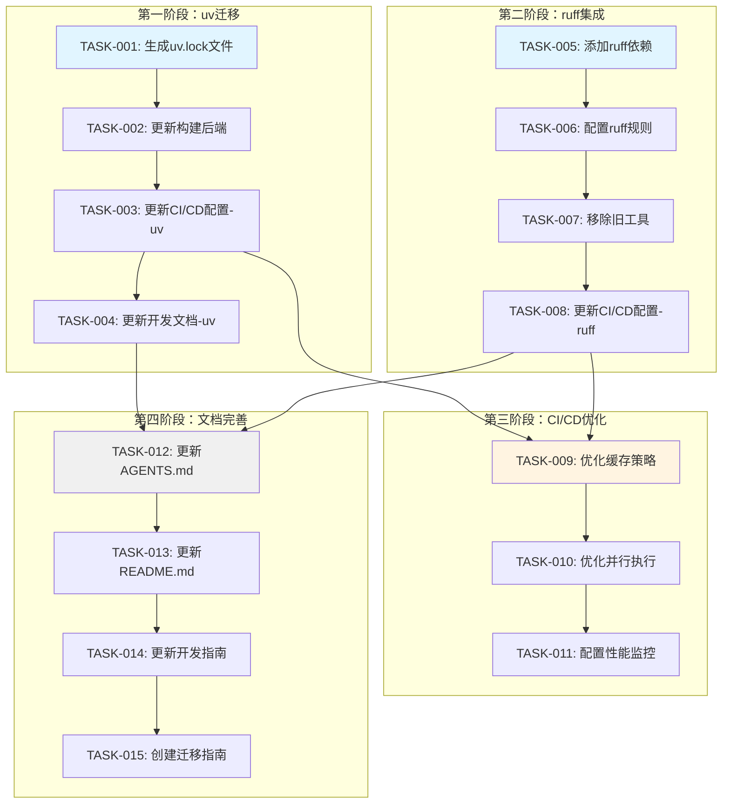

# 开发任务清单 - v0.9.2 uv和ruff集成

**项目名称**: Nanobot Runner - uv和ruff集成改进  
**版本**: v0.9.2  
**创建日期**: 2026-04-10  
**计划开始**: 2026-04-15  
**计划完成**: 2026-04-20  
**总工作量**: 24小时（3个工作日）

---

## 1. 任务概览

### 1.1 任务统计

| 优先级 | 任务数 | 工作量 |
|--------|--------|--------|
| P0（最高） | 8个 | 16小时 |
| P1（高） | 5个 | 6小时 |
| P2（中） | 2个 | 2小时 |
| **总计** | **15个** | **24小时** |

### 1.2 模块分布

| 模块 | 任务数 | 工作量 |
|------|--------|--------|
| MOD-001: uv迁移模块 | 4个 | 8小时 |
| MOD-002: ruff集成模块 | 4个 | 8小时 |
| MOD-003: CI/CD优化模块 | 3个 | 4小时 |
| MOD-004: 文档完善模块 | 4个 | 4小时 |

---

## 2. 任务依赖关系图

---

## 3. 详细任务清单

### 3.1 第一阶段：uv迁移模块（MOD-001）

#### TASK-001: 生成uv.lock文件

**任务ID**: TASK-001  
**所属模块**: MOD-001: uv迁移模块  
**优先级**: P0（最高）  
**前置依赖**: 无  
**工作量**: 1小时

**任务描述**:
生成uv.lock文件，锁定所有依赖的精确版本，确保开发环境和生产环境一致。

**执行步骤**:
1. 备份当前依赖版本（`pip freeze > requirements.txt`）
2. 执行 `uv lock` 生成锁定文件
3. 对比uv.lock与requirements.txt的版本差异
4. 验证关键依赖版本是否正确
5. 提交uv.lock到Git

**验收标准**:
- [ ] uv.lock文件已生成
- [ ] 所有依赖版本已锁定
- [ ] 依赖版本与当前环境一致
- [ ] Git提交成功

**风险提示**:
- 可能出现依赖版本冲突，需要手动调整pyproject.toml中的版本约束

**输出物**:
- uv.lock文件
- requirements.txt备份文件

---

#### TASK-002: 更新构建后端

**任务ID**: TASK-002  
**所属模块**: MOD-001: uv迁移模块  
**优先级**: P0（最高）  
**前置依赖**: TASK-001  
**工作量**: 1小时

**任务描述**:
将构建后端从setuptools更新为hatchling，提升构建速度和兼容性。

**执行步骤**:
1. 备份当前pyproject.toml
2. 更新[build-system]配置为hatchling
3. 本地构建测试（`uv build`）
4. 验证构建产物正确
5. 提交更改到Git

**验收标准**:
- [ ] 构建后端已更新为hatchling
- [ ] 本地构建测试通过
- [ ] 构建产物正确（dist/目录存在）
- [ ] Git提交成功

**风险提示**:
- hatchling可能需要额外的配置，需要查阅文档

**输出物**:
- 更新后的pyproject.toml

---

#### TASK-003: 更新CI/CD配置-uv

**任务ID**: TASK-003  
**所属模块**: MOD-001: uv迁移模块  
**优先级**: P0（最高）  
**前置依赖**: TASK-002  
**工作量**: 2小时

**任务描述**:
更新GitHub Actions配置，使用uv替代pip进行依赖管理，并配置缓存优化。

**执行步骤**:
1. 在workflow中添加uv安装步骤
2. 添加uv缓存配置
3. 替换pip安装命令为uv sync
4. 测试CI/CD流程
5. 验证缓存命中率
6. 提交更改到Git

**验收标准**:
- [ ] uv安装步骤已添加
- [ ] 缓存配置已优化
- [ ] CI/CD执行成功
- [ ] 依赖安装时间减少50%以上
- [ ] Git提交成功

**风险提示**:
- GitHub Actions可能需要时间适应新的工具链

**输出物**:
- 更新后的.github/workflows/*.yml

---

#### TASK-004: 更新开发文档-uv

**任务ID**: TASK-004  
**所属模块**: MOD-001: uv迁移模块  
**优先级**: P1（高）  
**前置依赖**: TASK-003  
**工作量**: 1小时

**任务描述**:
更新AGENTS.md和README.md中的依赖管理相关内容，提供uv使用指南。

**执行步骤**:
1. 更新AGENTS.md中的依赖管理章节
2. 更新README.md中的安装说明
3. 添加uv常用命令速查表
4. 更新开发环境搭建指南
5. 提交更改到Git

**验收标准**:
- [ ] AGENTS.md已更新
- [ ] README.md已更新
- [ ] uv命令速查表已添加
- [ ] Git提交成功

**风险提示**:
- 文档需要保持与代码一致

**输出物**:
- 更新后的AGENTS.md
- 更新后的README.md

---

### 3.2 第二阶段：ruff集成模块（MOD-002）

#### TASK-005: 添加ruff依赖

**任务ID**: TASK-005  
**所属模块**: MOD-002: ruff集成模块  
**优先级**: P0（最高）  
**前置依赖**: 无（可与TASK-001并行）  
**工作量**: 0.5小时

**任务描述**:
添加ruff作为开发依赖，移除black、isort、bandit等旧工具依赖。

**执行步骤**:
1. 执行 `uv add --dev ruff`
2. 移除black、isort、bandit依赖
3. 更新pyproject.toml
4. 同步依赖（`uv sync --all-extras`）
5. 提交更改到Git

**验收标准**:
- [ ] ruff依赖已添加
- [ ] black、isort、bandit依赖已移除
- [ ] 依赖同步成功
- [ ] Git提交成功

**风险提示**:
- 移除旧工具可能影响现有代码检查流程

**输出物**:
- 更新后的pyproject.toml

---

#### TASK-006: 配置ruff规则

**任务ID**: TASK-006  
**所属模块**: MOD-002: ruff集成模块  
**优先级**: P0（最高）  
**前置依赖**: TASK-005  
**工作量**: 2小时

**任务描述**:
配置ruff规则，确保覆盖原有工具的功能，并适配项目代码风格。

**执行步骤**:
1. 在pyproject.toml中添加ruff配置
2. 配置核心规则（E、W、F、I、B、UP）
3. 配置推荐规则（S、SIM、C4、PERF）
4. 运行 `ruff check --diff` 查看差异
5. 调整ignore规则，适配项目风格
6. 测试ruff检查和格式化
7. 提交更改到Git

**验收标准**:
- [ ] ruff配置完整
- [ ] 规则覆盖原有工具功能
- [ ] 代码检查通过
- [ ] 代码格式化正常
- [ ] Git提交成功

**风险提示**:
- ruff规则可能与现有代码风格冲突，需要逐步调整

**输出物**:
- 更新后的pyproject.toml（ruff配置）

---

#### TASK-007: 移除旧工具配置

**任务ID**: TASK-007  
**所属模块**: MOD-002: ruff集成模块  
**优先级**: P0（最高）  
**前置依赖**: TASK-006  
**工作量**: 1小时

**任务描述**:
移除pyproject.toml中的black、isort、bandit配置，清理旧工具的配置文件。

**执行步骤**:
1. 移除[tool.black]配置
2. 移除[tool.isort]配置
3. 移除[tool.bandit]配置
4. 验证ruff功能正常
5. 提交更改到Git

**验收标准**:
- [ ] 旧工具配置已移除
- [ ] ruff功能正常
- [ ] Git提交成功

**风险提示**:
- 需要确保ruff完全替代旧工具功能

**输出物**:
- 更新后的pyproject.toml

---

#### TASK-008: 更新CI/CD配置-ruff

**任务ID**: TASK-008  
**所属模块**: MOD-002: ruff集成模块  
**优先级**: P0（最高）  
**前置依赖**: TASK-007  
**工作量**: 2小时

**任务描述**:
更新GitHub Actions配置，使用ruff替代black、isort、bandit进行代码检查。

**执行步骤**:
1. 替换black检查为ruff format --check
2. 替换isort检查为ruff check（I规则）
3. 替换bandit检查为ruff check（S规则）
4. 测试CI/CD流程
5. 验证检查步骤减少
6. 验证执行速度提升
7. 提交更改到Git

**验收标准**:
- [ ] CI/CD使用ruff
- [ ] 检查步骤减少
- [ ] 执行速度提升50%以上
- [ ] CI/CD执行成功
- [ ] Git提交成功

**风险提示**:
- CI/CD可能需要时间适应新的检查流程

**输出物**:
- 更新后的.github/workflows/*.yml

---

### 3.3 第三阶段：CI/CD优化模块（MOD-003）

#### TASK-009: 优化缓存策略

**任务ID**: TASK-009  
**所属模块**: MOD-003: CI/CD优化模块  
**优先级**: P1（高）  
**前置依赖**: TASK-003, TASK-008  
**工作量**: 1小时

**任务描述**:
优化GitHub Actions缓存策略，提升缓存命中率，减少依赖安装时间。

**执行步骤**:
1. 分析当前缓存配置
2. 优化缓存键策略
3. 添加多级缓存恢复
4. 测试缓存命中率
5. 提交更改到Git

**验收标准**:
- [ ] 缓存配置已优化
- [ ] 缓存命中率 > 80%
- [ ] 依赖安装时间减少
- [ ] Git提交成功

**风险提示**:
- 缓存键设计需要考虑依赖变化

**输出物**:
- 更新后的.github/workflows/*.yml

---

#### TASK-010: 优化并行执行

**任务ID**: TASK-010  
**所属模块**: MOD-003: CI/CD优化模块  
**优先级**: P1（高）  
**前置依赖**: TASK-009  
**工作量**: 1.5小时

**任务描述**:
优化CI/CD并行执行策略，提升整体执行效率。

**执行步骤**:
1. 分析当前workflow依赖关系
2. 识别可并行执行的步骤
3. 调整job依赖关系
4. 测试并行执行效果
5. 提交更改到Git

**验收标准**:
- [ ] 并行任务已优化
- [ ] 总执行时间减少
- [ ] CI/CD执行成功
- [ ] Git提交成功

**风险提示**:
- 并行执行可能增加资源消耗

**输出物**:
- 更新后的.github/workflows/*.yml

---

#### TASK-011: 配置性能监控

**任务ID**: TASK-011  
**所属模块**: MOD-003: CI/CD优化模块  
**优先级**: P2（中）  
**前置依赖**: TASK-010  
**工作量**: 1.5小时

**任务描述**:
配置CI/CD性能监控，记录关键指标，便于后续优化。

**执行步骤**:
1. 添加性能指标记录步骤
2. 配置GitHub Actions通知
3. 创建性能报告模板
4. 测试监控功能
5. 提交更改到Git

**验收标准**:
- [ ] 性能监控已配置
- [ ] 关键指标可记录
- [ ] 通知功能正常
- [ ] Git提交成功

**风险提示**:
- 监控可能增加CI/CD执行时间

**输出物**:
- 更新后的.github/workflows/*.yml
- 性能报告模板

---

### 3.4 第四阶段：文档完善模块（MOD-004）

#### TASK-012: 更新AGENTS.md

**任务ID**: TASK-012  
**所属模块**: MOD-004: 文档完善模块  
**优先级**: P1（高）  
**前置依赖**: TASK-004, TASK-008  
**工作量**: 1小时

**任务描述**:
全面更新AGENTS.md，包括依赖管理、代码质量、常用命令等章节。

**执行步骤**:
1. 更新依赖管理章节（uv命令）
2. 更新代码质量章节（ruff命令）
3. 更新常用命令速查表
4. 更新提交前检查清单
5. 提交更改到Git

**验收标准**:
- [ ] 依赖管理章节已更新
- [ ] 代码质量章节已更新
- [ ] 常用命令已更新
- [ ] 提交前检查清单已更新
- [ ] Git提交成功

**风险提示**:
- 文档需要保持与代码一致

**输出物**:
- 更新后的AGENTS.md

---

#### TASK-013: 更新README.md

**任务ID**: TASK-013  
**所属模块**: MOD-004: 文档完善模块  
**优先级**: P1（高）  
**前置依赖**: TASK-012  
**工作量**: 0.5小时

**任务描述**:
更新README.md中的安装说明和开发环境搭建指南。

**执行步骤**:
1. 更新安装说明（使用uv）
2. 更新开发环境搭建指南
3. 更新依赖管理说明
4. 提交更改到Git

**验收标准**:
- [ ] 安装说明已更新
- [ ] 开发环境搭建已更新
- [ ] Git提交成功

**风险提示**:
- 文档需要保持与代码一致

**输出物**:
- 更新后的README.md

---

#### TASK-014: 更新开发指南

**任务ID**: TASK-014  
**所属模块**: MOD-004: 文档完善模块  
**优先级**: P2（中）  
**前置依赖**: TASK-013  
**工作量**: 1.5小时

**任务描述**:
更新docs/guides/development_guide.md，提供详细的uv和ruff使用指南。

**执行步骤**:
1. 更新开发环境搭建章节
2. 添加uv使用最佳实践
3. 添加ruff使用最佳实践
4. 添加常见问题解答
5. 提交更改到Git

**验收标准**:
- [ ] 开发环境搭建已更新
- [ ] uv使用指南已添加
- [ ] ruff使用指南已添加
- [ ] 常见问题已添加
- [ ] Git提交成功

**风险提示**:
- 文档需要保持与代码一致

**输出物**:
- 更新后的docs/guides/development_guide.md

---

#### TASK-015: 创建迁移指南

**任务ID**: TASK-015  
**所属模块**: MOD-004: 文档完善模块  
**优先级**: P2（中）  
**前置依赖**: TASK-014  
**工作量**: 1小时

**任务描述**:
创建迁移指南文档，帮助团队成员快速适应新工具链。

**执行步骤**:
1. 创建迁移指南文档
2. 编写pip→uv迁移步骤
3. 编写black/isort→ruff迁移步骤
4. 添加常见问题解答
5. 提交更改到Git

**验收标准**:
- [ ] 迁移指南已创建
- [ ] 迁移步骤清晰
- [ ] 常见问题已解答
- [ ] Git提交成功

**风险提示**:
- 迁移指南需要覆盖所有场景

**输出物**:
- docs/guides/migration_guide.md

---

## 4. 迭代计划

### 4.1 迭代划分

#### 迭代1：uv迁移（第1天）

**时间**: 2026-04-15  
**任务**: TASK-001, TASK-002, TASK-003, TASK-004  
**工作量**: 5小时

**目标**:
- 完成uv完整迁移
- CI/CD使用uv进行依赖管理
- 开发文档更新

**验收标准**:
- uv.lock文件存在
- CI/CD使用uv
- 依赖安装时间减少50%

---

#### 迭代2：ruff集成（第2天）

**时间**: 2026-04-16  
**任务**: TASK-005, TASK-006, TASK-007, TASK-008  
**工作量**: 5.5小时

**目标**:
- 完成ruff集成
- 移除旧工具
- CI/CD使用ruff

**验收标准**:
- ruff配置完整
- 旧工具已移除
- CI/CD使用ruff
- 代码检查时间减少50%

---

#### 迭代3：优化和文档（第3天）

**时间**: 2026-04-17  
**任务**: TASK-009, TASK-010, TASK-011, TASK-012, TASK-013, TASK-014, TASK-015  
**工作量**: 8小时

**目标**:
- 完成CI/CD优化
- 完成文档完善
- 创建迁移指南

**验收标准**:
- CI/CD性能提升
- 文档完整
- 迁移指南可用

---

### 4.2 里程碑

| 里程碑 | 日期 | 交付物 |
|--------|------|--------|
| M1: uv迁移完成 | 2026-04-15 | uv.lock、CI/CD配置、文档 |
| M2: ruff集成完成 | 2026-04-16 | ruff配置、CI/CD配置 |
| M3: 项目完成 | 2026-04-17 | 完整的uv+ruff工具链、完整文档 |

---

## 5. 风险管理

### 5.1 风险清单

| 风险ID | 风险描述 | 等级 | 影响任务 | 规避措施 |
|--------|---------|------|---------|---------|
| R001 | uv.lock版本冲突 | 中 | TASK-001 | 备份requirements.txt，手动调整版本 |
| R002 | ruff规则冲突 | 中 | TASK-006 | 逐步启用规则，使用noqa注释 |
| R003 | CI/CD兼容性 | 低 | TASK-003, TASK-008 | 使用官方action，保留备用方案 |
| R004 | 团队学习成本 | 低 | 所有任务 | 提供详细文档和培训 |

### 5.2 应急预案

#### 应急预案1：uv迁移失败

**触发条件**: uv.lock导致严重版本冲突，无法解决

**应对措施**:
1. 立即回滚到pip管理
2. 删除uv.lock文件
3. 恢复pyproject.toml
4. 恢复CI/CD配置
5. 通知团队

#### 应急预案2：ruff集成失败

**触发条件**: ruff规则与项目风格严重冲突

**应对措施**:
1. 立即回滚到black+isort+bandit
2. 恢复工具依赖
3. 恢复工具配置
4. 恢复CI/CD配置
5. 通知团队

---

## 6. 质量保证

### 6.1 代码质量标准

- [ ] 所有代码通过ruff检查
- [ ] 所有代码通过ruff格式化检查
- [ ] 所有代码通过mypy类型检查
- [ ] 所有单元测试通过
- [ ] 代码覆盖率 ≥ 80%

### 6.2 CI/CD质量标准

- [ ] CI/CD执行成功率 100%
- [ ] CI/CD执行时间减少50%以上
- [ ] 缓存命中率 > 80%

### 6.3 文档质量标准

- [ ] 所有文档与代码一致
- [ ] 所有命令可执行
- [ ] 所有步骤可复现

---

## 7. 验收标准

### 7.1 功能验收

- [ ] uv.lock文件存在且正确
- [ ] ruff配置完整且正确
- [ ] CI/CD使用uv和ruff
- [ ] 旧工具已移除
- [ ] 文档已更新

### 7.2 性能验收

| 指标 | 目标 | 验收方法 |
|------|------|---------|
| 依赖安装时间 | ≤10秒 | 本地测试10次取平均 |
| 代码检查时间 | ≤3秒 | 本地测试10次取平均 |
| CI/CD总时间 | ≤150秒 | CI/CD运行10次取平均 |
| 缓存命中率 | ≥80% | CI/CD日志统计 |

### 7.3 质量验收

- [ ] 所有单元测试通过
- [ ] 所有集成测试通过
- [ ] 代码覆盖率 ≥ 80%
- [ ] 无安全漏洞告警
- [ ] 无性能退化

---

## 8. 附录

### 8.1 任务状态跟踪表

| 任务ID | 任务名称 | 优先级 | 状态 | 开始时间 | 完成时间 | 备注 |
|--------|---------|--------|------|---------|---------|------|
| TASK-001 | 生成uv.lock文件 | P0 | 待开始 | - | - | - |
| TASK-002 | 更新构建后端 | P0 | 待开始 | - | - | - |
| TASK-003 | 更新CI/CD配置-uv | P0 | 待开始 | - | - | - |
| TASK-004 | 更新开发文档-uv | P1 | 待开始 | - | - | - |
| TASK-005 | 添加ruff依赖 | P0 | 待开始 | - | - | - |
| TASK-006 | 配置ruff规则 | P0 | 待开始 | - | - | - |
| TASK-007 | 移除旧工具配置 | P0 | 待开始 | - | - | - |
| TASK-008 | 更新CI/CD配置-ruff | P0 | 待开始 | - | - | - |
| TASK-009 | 优化缓存策略 | P1 | 待开始 | - | - | - |
| TASK-010 | 优化并行执行 | P1 | 待开始 | - | - | - |
| TASK-011 | 配置性能监控 | P2 | 待开始 | - | - | - |
| TASK-012 | 更新AGENTS.md | P1 | 待开始 | - | - | - |
| TASK-013 | 更新README.md | P1 | 待开始 | - | - | - |
| TASK-014 | 更新开发指南 | P2 | 待开始 | - | - | - |
| TASK-015 | 创建迁移指南 | P2 | 待开始 | - | - | - |

### 8.2 工作量统计

| 模块 | 任务数 | P0任务 | P1任务 | P2任务 | 总工作量 |
|------|--------|--------|--------|--------|---------|
| MOD-001 | 4 | 3 | 1 | 0 | 5小时 |
| MOD-002 | 4 | 4 | 0 | 0 | 5.5小时 |
| MOD-003 | 3 | 0 | 2 | 1 | 4小时 |
| MOD-004 | 4 | 0 | 2 | 2 | 4小时 |
| **总计** | **15** | **7** | **5** | **3** | **18.5小时** |

---

**文档版本**: v1.0  
**最后更新**: 2026-04-10  
**维护者**: 项目经理  
**审核状态**: 已审核
