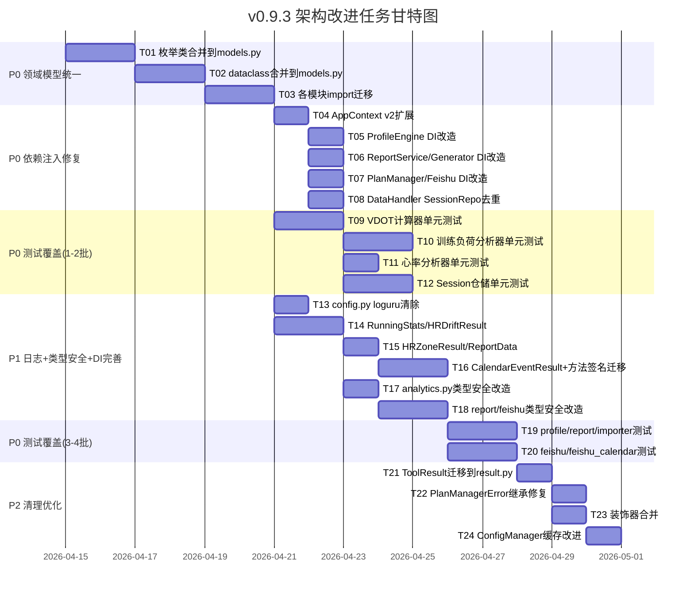

# 开发任务拆解清单 — v0.9.3 架构改进

> **文档版本**: v1.0
> **创建日期**: 2026-04-14
> **来源架构**: `docs/architecture/架构设计说明书_v0.9.3.md`
> **来源需求**: `docs/requirements/PRD_架构改进_v0.9.3.md`
> **任务状态**: 待执行

---

## 1. 任务总览

| 维度 | 数据 |
|------|------|
| 任务总数 | 24 |
| P0 任务数 | 9 |
| P1 任务数 | 9 |
| P2 任务数 | 6 |
| 总工时 | 154h |
| alpha 迭代工时 | 72h |
| beta 迭代工时 | 64h |
| 正式版迭代工时 | 18h |

---

## 2. 任务依赖关系图



---

## 3. P0 任务清单（阻塞发布）

### T01：枚举类合并到 models.py

| 属性 | 值 |
|------|---|
| **任务ID** | T01 |
| **所属模块** | core/models |
| **需求来源** | REQ-P0-01 |
| **优先级** | 🔴 P0 |
| **预估工时** | 16h |
| **前置依赖** | 无 |
| **迭代** | alpha |

**任务描述**：

将分散在多个文件中的枚举类统一合并到 `src/core/models.py`，使用 `StrEnum` 替代 `Enum`。

**具体操作**：

1. `models.py` 中将 `PlanStatus` 从 `Enum` 改为 `StrEnum`
2. `models.py` 中新增 `FitnessLevel(StrEnum)`，含 `label` 属性（中文映射）
3. `models.py` 中新增 `TrainingType(StrEnum)`，合并 `WorkoutType`
4. `models.py` 中新增 `ReportType(StrEnum)`，合并两处定义
5. `models.py` 中新增 `TrainingPattern(StrEnum)`
6. `models.py` 中新增 `InjuryRiskLevel(StrEnum)`
7. 删除 `training_plan.py` 中的 `PlanType`、`WorkoutType`、`FitnessLevel`
8. 删除 `plan_manager.py` 中的 `PlanStatus`
9. 删除 `user_profile_manager.py` 中的 `FitnessLevel`、`TrainingPattern`、`InjuryRiskLevel`
10. 删除 `report_generator.py` 中的 `ReportType`
11. 删除 `report_service.py` 中的 `ReportType`
12. 所有删除位置改为 `from src.core.models import ...`

**验收标准**：

- [ ] `grep -r "class PlanStatus" src/` 仅返回 `models.py`
- [ ] `grep -r "class FitnessLevel" src/` 仅返回 `models.py`
- [ ] `grep -r "class ReportType" src/` 仅返回 `models.py`
- [ ] `grep -r "class TrainingType" src/` 仅返回 `models.py`
- [ ] `uv run mypy src/` 零错误
- [ ] `uv run pytest tests/unit/` 通过率 100%

---

### T02：dataclass 合并到 models.py

| 属性 | 值 |
|------|---|
| **任务ID** | T02 |
| **所属模块** | core/models |
| **需求来源** | REQ-P0-01 |
| **优先级** | 🔴 P0 |
| **预估工时** | 16h |
| **前置依赖** | T01 |
| **迭代** | alpha |

**任务描述**：

将分散在 `training_plan.py` 中的 `DailyPlan`、`WeeklySchedule`、`TrainingPlan` 合并到 `models.py`，取字段并集。

**具体操作**：

1. `models.py` 中 `DailyPlan` 增加字段：`actual_distance_km`、`actual_duration_min`、`actual_avg_hr`、`rpe`、`hr_drift`
2. `models.py` 中 `WeeklySchedule` 增加字段：对比两版本差异并合并
3. `models.py` 中 `TrainingPlan` 对比两版本差异并合并
4. 删除 `training_plan.py` 中的 `DailyPlan`、`WeeklySchedule`、`TrainingPlan`
5. `training_plan.py` 保留业务逻辑方法，改为 `from src.core.models import DailyPlan, WeeklySchedule, TrainingPlan`
6. 处理 `ProfileStorageManager` 重复：保留 `user_profile_manager.py` 版本，删除 `profile.py` 中的重复定义

**验收标准**：

- [ ] `grep -r "class DailyPlan" src/` 仅返回 `models.py`
- [ ] `grep -r "class WeeklySchedule" src/` 仅返回 `models.py`
- [ ] `grep -r "class TrainingPlan" src/` 仅返回 `models.py`
- [ ] `grep -r "class ProfileStorageManager" src/` 仅返回 `user_profile_manager.py`
- [ ] `uv run mypy src/` 零错误
- [ ] `uv run pytest tests/unit/` 通过率 100%

---

### T03：各模块 import 迁移与全量验证

| 属性 | 值 |
|------|---|
| **任务ID** | T03 |
| **所属模块** | core (全局) |
| **需求来源** | REQ-P0-01 |
| **优先级** | 🔴 P0 |
| **预估工时** | 8h |
| **前置依赖** | T02 |
| **迭代** | alpha |

**任务描述**：

完成所有模块的 import 路径迁移，确保无遗漏引用，运行全量验证。

**具体操作**：

1. 全局搜索所有 `from src.core.training_plan import` 和 `from src.core.plan.plan_manager import PlanStatus`，替换为 `from src.core.models import`
2. 全局搜索所有 `from src.core.user_profile_manager import FitnessLevel` 等，替换为 `from src.core.models import`
3. 全局搜索所有 `from src.core.profile import ProfileStorageManager`，替换为 `from src.core.user_profile_manager import ProfileStorageManager`
4. 更新 `context.py` 中 `ProfileStorageManager` 的 import 路径
5. 运行 `ruff check`、`mypy`、`pytest` 全量验证

**验收标准**：

- [ ] `grep -rn "from src.core.training_plan import.*PlanType\|WorkoutType\|FitnessLevel\|DailyPlan\|WeeklySchedule" src/` 返回 0 行
- [ ] `grep -rn "from src.core.plan.plan_manager import PlanStatus" src/` 返回 0 行
- [ ] `uv run ruff check src/` 零警告
- [ ] `uv run mypy src/` 零错误
- [ ] `uv run pytest tests/unit/` 通过率 100%

---

### T04：AppContext v2 扩展

| 属性 | 值 |
|------|---|
| **任务ID** | T04 |
| **所属模块** | core/context |
| **需求来源** | REQ-P0-02, REQ-P1-06 |
| **优先级** | 🔴 P0 |
| **预估工时** | 8h |
| **前置依赖** | T03 |
| **迭代** | alpha |

**任务描述**：

扩展 `AppContext` 和 `AppContextFactory`，新增 `session_repo`、`report_service`、`plan_manager` 三个组件。

**具体操作**：

1. `AppContext` 新增字段：`session_repo: SessionRepository`、`report_service: ReportService`、`plan_manager: PlanManager`
2. `AppContextFactory.create()` 新增创建逻辑：`SessionRepository(storage)`、`ReportService(context)`、`PlanManager(context)`
3. `AppContextFactory.create_for_testing()` 新增对应可选参数
4. 处理循环依赖：`ReportService` 和 `PlanManager` 需要 `AppContext`，但 `AppContext` 创建它们时自身尚未完成 → 采用两阶段初始化或延迟绑定

**验收标准**：

- [ ] `AppContext` 包含 `session_repo`、`report_service`、`plan_manager` 字段
- [ ] `AppContextFactory.create()` 自动创建所有新增组件
- [ ] `AppContextFactory.create_for_testing()` 支持注入 Mock
- [ ] `uv run mypy src/core/context.py` 零错误
- [ ] `uv run pytest tests/unit/` 通过率 100%

---

### T05：ProfileEngine DI 改造

| 属性 | 值 |
|------|---|
| **任务ID** | T05 |
| **所属模块** | core/profile |
| **需求来源** | REQ-P0-02 (DI-02/03) |
| **优先级** | 🔴 P0 |
| **预估工时** | 8h |
| **前置依赖** | T04 |
| **迭代** | alpha |

**任务描述**：

将 `ProfileEngine` 的构造函数从接收 `StorageManager` 改为接收 `AppContext`，消除内部 `AnalyticsEngine(self.storage)` 直接实例化。

**具体操作**：

1. `ProfileEngine.__init__(self, storage)` → `ProfileEngine.__init__(self, context: AppContext)`
2. 内部 `AnalyticsEngine(self.storage)` → `self._analytics = context.analytics`
3. 更新 `AppContextFactory.create()` 中 `ProfileEngine` 的创建方式
4. 更新所有使用 `ProfileEngine` 的测试

**验收标准**：

- [ ] `grep -n "AnalyticsEngine(" src/core/profile.py` 返回 0 行
- [ ] `ProfileEngine.__init__` 接收 `AppContext` 参数
- [ ] `uv run mypy src/core/profile.py` 零错误
- [ ] `uv run pytest tests/unit/` 通过率 100%

---

### T06：ReportService/ReportGenerator DI 改造

| 属性 | 值 |
|------|---|
| **任务ID** | T06 |
| **所属模块** | core/report |
| **需求来源** | REQ-P0-02 (DI-04/05) |
| **优先级** | 🔴 P0 |
| **预估工时** | 8h |
| **前置依赖** | T04 |
| **迭代** | alpha |

**任务描述**：

将 `ReportGenerator` 和 `ReportService` 的构造函数改为接收 `AppContext`，消除内部直接实例化。

**具体操作**：

1. `ReportGenerator` 新增 `__init__(self, context: AppContext)`，内部 `AnalyticsEngine(self.storage)` → `context.analytics`
2. `ReportService.__init__` 从多参数改为 `__init__(self, context: AppContext)`，内部 `ConfigManager()` → `context.config`，`StorageManager()` → `context.storage`，`AnalyticsEngine(self.storage)` → `context.analytics`
3. 更新 `AppContextFactory.create()` 中 `ReportService` 的创建方式
4. 更新所有相关测试

**验收标准**：

- [ ] `grep -n "AnalyticsEngine(" src/core/report_generator.py` 返回 0 行
- [ ] `grep -n "AnalyticsEngine(" src/core/report_service.py` 返回 0 行
- [ ] `grep -n "ConfigManager()" src/core/report_service.py` 返回 0 行
- [ ] `uv run mypy src/core/report_service.py` 零错误
- [ ] `uv run pytest tests/unit/` 通过率 100%

---

### T07：PlanManager/Feishu DI 改造

| 属性 | 值 |
|------|---|
| **任务ID** | T07 |
| **所属模块** | core/plan, notify |
| **需求来源** | REQ-P0-02 (DI-06/07/08/09) |
| **优先级** | 🔴 P0 |
| **预估工时** | 8h |
| **前置依赖** | T04 |
| **迭代** | alpha |

**任务描述**：

修复 `PlanManager`、`FeishuBot`、`FeishuCalendar`、`ImportService` 的 DI 违规。

**具体操作**：

1. `PlanManager.__init__(self, data_dir)` → `PlanManager.__init__(self, context: AppContext)`，内部 `ConfigManager()` → `context.config`
2. `FeishuBot.__init__` 改为接收 `ConfigManager` 参数，不再内部创建
3. `FeishuCalendar.__init__` 改为接收 `ConfigManager` 参数，不再内部创建
4. `ImportService` 中 `StorageManager()` → 通过构造函数注入或 `AppContext`
5. 更新 `AppContextFactory.create()` 中相关创建逻辑
6. 更新所有相关测试

**验收标准**：

- [ ] `grep -n "ConfigManager()" src/core/plan/plan_manager.py` 返回 0 行
- [ ] `grep -n "ConfigManager()" src/notify/feishu.py` 返回 0 行
- [ ] `grep -n "ConfigManager()" src/notify/feishu_calendar.py` 返回 0 行
- [ ] `grep -n "StorageManager()" src/core/importer.py | grep -v "context.py"` 返回 0 行
- [ ] `uv run pytest tests/unit/` 通过率 100%

---

### T08：DataHandler SessionRepo 去重

| 属性 | 值 |
|------|---|
| **任务ID** | T08 |
| **所属模块** | cli/handlers |
| **需求来源** | REQ-P1-06 |
| **优先级** | 🔴 P0 |
| **预估工时** | 8h |
| **前置依赖** | T04 |
| **迭代** | alpha |

**任务描述**：

将 `DataHandler.get_recent_runs()` 中重复的 session 聚合逻辑委托给 `SessionRepository`。

**具体操作**：

1. `DataHandler.__init__` 新增 `self.session_repo = context.session_repo`
2. `DataHandler.get_recent_runs()` 内部改为调用 `self.session_repo.get_recent_sessions()`
3. 删除 `DataHandler` 中自行实现的 session 聚合代码（约 40 行）
4. `DataHandler.get_stats()` 中 `AnalyticsEngine(self.storage)` → `self.context.analytics`

**验收标准**：

- [ ] `DataHandler` 持有 `session_repo` 属性
- [ ] `get_recent_runs()` 内部调用 `self.session_repo` 方法
- [ ] `grep -n "AnalyticsEngine(" src/cli/handlers/data_handler.py` 返回 0 行
- [ ] `uv run pytest tests/unit/` 通过率 100%

---

### T09：VDOT 计算器单元测试

| 属性 | 值 |
|------|---|
| **任务ID** | T09 |
| **所属模块** | tests/unit |
| **需求来源** | REQ-P0-03 (第一批) |
| **优先级** | 🔴 P0 |
| **预估工时** | 8h |
| **前置依赖** | T03 |
| **迭代** | alpha |

**任务描述**：

为 `vdot_calculator.py` 编写单元测试，覆盖率 ≥ 80%。

**具体操作**：

1. 创建 `tests/unit/core/test_vdot_calculator.py`
2. 编写测试用例：标准距离 VDOT 计算（5K/10K/HM/M）
3. 编写边界用例：距离 < 1500m 不计算、异常心率、零距离
4. 编写趋势分析用例：历史 VDOT 序列、空数据
5. 无需 Mock（纯计算逻辑）

**验收标准**：

- [ ] `vdot_calculator.py` 覆盖率 ≥ 80%
- [ ] `uv run pytest tests/unit/core/test_vdot_calculator.py` 通过率 100%
- [ ] 无真实文件/网络依赖

---

### T10：训练负荷分析器单元测试

| 属性 | 值 |
|------|---|
| **任务ID** | T10 |
| **所属模块** | tests/unit |
| **需求来源** | REQ-P0-03 (第一批) |
| **优先级** | 🔴 P0 |
| **预估工时** | 8h |
| **前置依赖** | T03 |
| **迭代** | alpha |

**任务描述**：

为 `training_load_analyzer.py` 编写单元测试，覆盖率 ≥ 80%。

**具体操作**：

1. 创建 `tests/unit/core/test_training_load_analyzer.py`
2. 编写测试用例：ATL/CTL/TSB 计算（EWMA 公式验证）
3. 编写边界用例：空数据、单次训练、长期无训练
4. 编写 TSS 计算用例：不同 IF 值、时长组合
5. Mock `StorageManager.read_parquet()` 返回测试 LazyFrame

**验收标准**：

- [ ] `training_load_analyzer.py` 覆盖率 ≥ 80%
- [ ] `uv run pytest tests/unit/core/test_training_load_analyzer.py` 通过率 100%

---

### T11：心率分析器单元测试

| 属性 | 值 |
|------|---|
| **任务ID** | T11 |
| **所属模块** | tests/unit |
| **需求来源** | REQ-P0-03 (第一批) |
| **优先级** | 🔴 P0 |
| **预估工时** | 8h |
| **前置依赖** | T03 |
| **迭代** | alpha |

**任务描述**：

为 `heart_rate_analyzer.py` 编写单元测试，覆盖率 ≥ 80%。

**具体操作**：

1. 创建 `tests/unit/core/test_heart_rate_analyzer.py`
2. 编写测试用例：心率区间计算、心率漂移检测（相关性 < -0.7）
3. 编写边界用例：无心率数据、恒定心率、极端漂移
4. Mock `StorageManager.read_parquet()` 返回测试 LazyFrame

**验收标准**：

- [ ] `heart_rate_analyzer.py` 覆盖率 ≥ 80%
- [ ] `uv run pytest tests/unit/core/test_heart_rate_analyzer.py` 通过率 100%

---

### T12：Session 仓储单元测试

| 属性 | 值 |
|------|---|
| **任务ID** | T12 |
| **所属模块** | tests/unit |
| **需求来源** | REQ-P0-03 (第二批) |
| **优先级** | 🔴 P0 |
| **预估工时** | 8h |
| **前置依赖** | T04, T08 |
| **迭代** | alpha |

**任务描述**：

为 `session_repository.py` 编写单元测试，覆盖率 ≥ 80%。

**具体操作**：

1. 创建 `tests/unit/core/test_session_repository.py`
2. 编写测试用例：session 聚合查询、日期范围过滤、距离过滤
3. 编写边界用例：空 Parquet、单条记录、跨年查询
4. 编写 `SessionSummary`/`SessionDetail`/`SessionVdot` 数据类验证
5. Mock `StorageManager.read_parquet()` 返回测试 LazyFrame

**验收标准**：

- [ ] `session_repository.py` 覆盖率 ≥ 80%
- [ ] `uv run pytest tests/unit/core/test_session_repository.py` 通过率 100%
- [ ] LazyFrame 链式操作正确，仅在最终输出时 `collect()`

---

## 4. P1 任务清单（重要需求）

### T13：config.py loguru 清除

| 属性 | 值 |
|------|---|
| **任务ID** | T13 |
| **所属模块** | core/config |
| **需求来源** | REQ-P1-04 |
| **优先级** | 🟠 P1 |
| **预估工时** | 4h |
| **前置依赖** | T03 |
| **迭代** | beta |

**任务描述**：

将 `config.py` 中的 `loguru.logger` 调用替换为 `get_logger(__name__)`。

**具体操作**：

1. `import loguru` → `from src.core.logger import get_logger`
2. `loguru.logger.debug(...)` → `logger = get_logger(__name__); logger.debug(...)`
3. 全局搜索 `loguru` 确认无其他引用

**验收标准**：

- [ ] `grep -rn "loguru" src/` 返回 0 行
- [ ] `uv run mypy src/core/config.py` 零错误
- [ ] `uv run pytest tests/unit/` 通过率 100%

---

### T14：RunningStats/HRDriftResult dataclass 定义

| 属性 | 值 |
|------|---|
| **任务ID** | T14 |
| **所属模块** | core/models |
| **需求来源** | REQ-P1-05 |
| **优先级** | 🟠 P1 |
| **预估工时** | 8h |
| **前置依赖** | T03 |
| **迭代** | beta |

**任务描述**：

在 `models.py` 中新增 `RunningStats` 和 `HRDriftResult` frozen dataclass，并迁移 `analytics.py` 中对应方法的返回类型。

**具体操作**：

1. `models.py` 新增 `RunningStats(frozen=True)`，含 `to_dict()` 方法
2. `models.py` 新增 `HRDriftResult(frozen=True)`，含 `to_dict()` 方法
3. `analytics.py` 中 `get_running_stats()` 返回类型从 `Dict[str, Any]` 改为 `RunningStats`
4. `analytics.py` 中 `analyze_hr_drift()` 返回类型从 `Dict[str, Any]` 改为 `HRDriftResult`
5. 更新所有调用方的类型注解

**验收标准**：

- [ ] `grep -n "Dict\[str, Any\]" src/core/analytics.py | grep "running_stats\|hr_drift"` 返回 0 行
- [ ] `RunningStats` 和 `HRDriftResult` 使用 `frozen=True`
- [ ] `uv run mypy src/` 零错误
- [ ] `uv run pytest tests/unit/` 通过率 100%

---

### T15：HRZoneResult/ReportData dataclass 定义

| 属性 | 值 |
|------|---|
| **任务ID** | T15 |
| **所属模块** | core/models |
| **需求来源** | REQ-P1-05 |
| **优先级** | 🟠 P1 |
| **预估工时** | 8h |
| **前置依赖** | T14 |
| **迭代** | beta |

**任务描述**：

在 `models.py` 中新增 `HRZoneResult` 和 `ReportData` frozen dataclass，并迁移对应方法的返回类型。

**具体操作**：

1. `models.py` 新增 `HRZoneResult(frozen=True)`
2. `models.py` 新增 `ReportData(frozen=True)`
3. `heart_rate_analyzer.py` 中 `get_hr_zones()` 返回类型改为 `HRZoneResult`
4. `report_generator.py` 中 `generate_report()` 返回类型改为 `ReportData`
5. 更新所有调用方

**验收标准**：

- [ ] `grep -n "Dict\[str, Any\]" src/core/heart_rate_analyzer.py` 返回 0 行
- [ ] `grep -n "Dict\[str, Any\]" src/core/report_generator.py` 返回 0 行
- [ ] `uv run mypy src/` 零错误
- [ ] `uv run pytest tests/unit/` 通过率 100%

---

### T16：CalendarEventResult + 剩余方法签名迁移

| 属性 | 值 |
|------|---|
| **任务ID** | T16 |
| **所属模块** | core/models, notify |
| **需求来源** | REQ-P1-05 |
| **优先级** | 🟠 P1 |
| **预估工时** | 8h |
| **前置依赖** | T15 |
| **迭代** | beta |

**任务描述**：

新增 `CalendarEventResult` dataclass，迁移 `feishu_calendar.py` 和 `hard_validator.py` 的 `Dict[str, Any]` 返回类型。

**具体操作**：

1. `models.py` 新增 `CalendarEventResult(frozen=True)`
2. `feishu_calendar.py` 中 `create_event()` 等方法返回类型改为 `CalendarEventResult`
3. `hard_validator.py` 中 `validate_*()` 方法返回类型改为 `ValidationResult`（已存在于 `models.py`）
4. 更新所有调用方

**验收标准**：

- [ ] `grep -n "Dict\[str, Any\]" src/notify/feishu_calendar.py` 返回 0 行
- [ ] `uv run mypy src/` 零错误
- [ ] `uv run pytest tests/unit/` 通过率 100%

---

### T17：analytics.py 类型安全改造

| 属性 | 值 |
|------|---|
| **任务ID** | T17 |
| **所属模块** | core/analytics |
| **需求来源** | REQ-P1-05 |
| **优先级** | 🟠 P1 |
| **预估工时** | 8h |
| **前置依赖** | T14 |
| **迭代** | beta |

**任务描述**：

将 `analytics.py` 中剩余的 `Dict[str, Any]` 返回类型替换为类型安全的 dataclass。

**具体操作**：

1. 搜索 `analytics.py` 中所有 `Dict[str, Any]` 返回类型
2. 为每个方法创建对应的 frozen dataclass（如 `TrainingLoadResult`、`PaceAnalysisResult`）
3. 迁移方法签名和内部实现
4. 确保 `to_dict()` 兼容 Agent Tools 输出

**验收标准**：

- [ ] `grep -n "Dict\[str, Any\]" src/core/analytics.py` 返回 0 行
- [ ] `uv run mypy src/` 零错误
- [ ] `uv run pytest tests/unit/` 通过率 100%

---

### T18：report/feishu 类型安全改造

| 属性 | 值 |
|------|---|
| **任务ID** | T18 |
| **所属模块** | core/report, notify |
| **需求来源** | REQ-P1-05 |
| **优先级** | 🟠 P1 |
| **预估工时** | 8h |
| **前置依赖** | T15 |
| **迭代** | beta |

**任务描述**：

将 `report_service.py` 和 `feishu.py` 中的 `Dict[str, Any]` 返回类型替换为类型安全的 dataclass。

**具体操作**：

1. `report_service.py` 中 `generate_report()` 返回类型改造
2. `feishu.py` 中消息发送方法返回类型改造
3. 为新增返回类型创建 frozen dataclass

**验收标准**：

- [ ] `grep -n "Dict\[str, Any\]" src/core/report_service.py` 返回 0 行
- [ ] `grep -n "Dict\[str, Any\]" src/notify/feishu.py` 返回 0 行
- [ ] `uv run mypy src/` 零错误
- [ ] `uv run pytest tests/unit/` 通过率 100%

---

### T19：profile/report/importer 单元测试

| 属性 | 值 |
|------|---|
| **任务ID** | T19 |
| **所属模块** | tests/unit |
| **需求来源** | REQ-P0-03 (第三批) |
| **优先级** | 🟠 P1 |
| **预估工时** | 16h |
| **前置依赖** | T18 |
| **迭代** | beta |

**任务描述**：

为 `profile.py`、`report_generator.py`、`importer.py` 编写单元测试，覆盖率 ≥ 80%。

**具体操作**：

1. 创建 `tests/unit/core/test_profile.py`：画像构建、画像更新、异常数据过滤
2. 创建 `tests/unit/core/test_report_generator.py`：周报/月报生成、模板渲染
3. 创建 `tests/unit/core/test_importer.py`：文件导入、去重、批量导入
4. Mock `AppContext` 多组件：`storage`、`analytics`、`config`

**验收标准**：

- [ ] `profile.py` 覆盖率 ≥ 80%
- [ ] `report_generator.py` 覆盖率 ≥ 80%
- [ ] `importer.py` 覆盖率 ≥ 80%
- [ ] `uv run pytest tests/unit/` 通过率 100%

---

### T20：feishu/feishu_calendar 单元测试

| 属性 | 值 |
|------|---|
| **任务ID** | T20 |
| **所属模块** | tests/unit |
| **需求来源** | REQ-P0-03 (第四批) |
| **优先级** | 🟠 P1 |
| **预估工时** | 8h |
| **前置依赖** | T18 |
| **迭代** | beta |

**任务描述**：

为 `feishu.py` 和 `feishu_calendar.py` 编写单元测试，覆盖率 ≥ 70%。

**具体操作**：

1. 创建 `tests/unit/notify/test_feishu.py`：消息发送、Token 获取、错误处理
2. 创建 `tests/unit/notify/test_feishu_calendar.py`：日历事件创建/更新/删除
3. Mock HTTP 请求：`unittest.mock.patch("requests.post")`
4. Mock `ConfigManager` 提供测试配置

**验收标准**：

- [ ] `feishu.py` 覆盖率 ≥ 70%
- [ ] `feishu_calendar.py` 覆盖率 ≥ 70%
- [ ] 无真实 HTTP 请求
- [ ] `uv run pytest tests/unit/` 通过率 100%

---

### T21：storage/statistics 单元测试

| 属性 | 值 |
|------|---|
| **任务ID** | T21 |
| **所属模块** | tests/unit |
| **需求来源** | REQ-P0-03 (第二批) |
| **优先级** | 🟠 P1 |
| **预估工时** | 8h |
| **前置依赖** | T04 |
| **迭代** | beta |

**任务描述**：

为 `storage.py` 和 `statistics_aggregator.py` 编写单元测试，覆盖率 ≥ 80%。

**具体操作**：

1. 创建 `tests/unit/core/test_storage.py`：Parquet 读写、按年分片、Schema 验证
2. 创建 `tests/unit/core/test_statistics_aggregator.py`：统计聚合、日期范围查询
3. 使用 `tmp_path` fixture 创建临时 Parquet 文件

**验收标准**：

- [ ] `storage.py` 覆盖率 ≥ 80%
- [ ] `statistics_aggregator.py` 覆盖率 ≥ 80%
- [ ] `uv run pytest tests/unit/` 通过率 100%

---

## 5. P2 任务清单（次要需求）

### T22：ToolResult 迁移到 result.py

| 属性 | 值 |
|------|---|
| **任务ID** | T22 |
| **所属模块** | core/result |
| **需求来源** | REQ-P2-07 |
| **优先级** | 🟡 P2 |
| **预估工时** | 4h |
| **前置依赖** | T20 |
| **迭代** | 正式版 |

**任务描述**：

将 `ToolResult` 从 `exceptions.py` 移至新建的 `result.py`，更新所有 import 路径。

**具体操作**：

1. 创建 `src/core/result.py`，将 `ToolResult` 类迁入
2. `exceptions.py` 删除 `ToolResult` 类
3. 全局替换 `from src.core.exceptions import ToolResult` → `from src.core.result import ToolResult`
4. 更新 `decorators.py` 和 `agents/tools.py` 的 import

**验收标准**：

- [ ] `src/core/exceptions.py` 不包含 `ToolResult`
- [ ] `src/core/result.py` 包含 `ToolResult`
- [ ] `grep -rn "from src.core.exceptions import ToolResult" src/` 返回 0 行
- [ ] `uv run pytest tests/unit/` 通过率 100%

---

### T23：PlanManagerError 继承修复

| 属性 | 值 |
|------|---|
| **任务ID** | T23 |
| **所属模块** | core/plan |
| **需求来源** | REQ-P2-08 |
| **优先级** | 🟡 P2 |
| **预估工时** | 4h |
| **前置依赖** | T22 |
| **迭代** | 正式版 |

**任务描述**：

将 `PlanManagerError` 的基类从 `Exception` 改为 `NanobotRunnerError`。

**具体操作**：

1. `plan_manager.py` 中 `class PlanManagerError(Exception)` → `class PlanManagerError(NanobotRunnerError)`
2. 新增 `error_code` 和 `recovery_suggestion` 字段
3. 更新所有 `raise PlanManagerError(...)` 调用以适配新签名

**验收标准**：

- [ ] `PlanManagerError` 继承 `NanobotRunnerError`
- [ ] `PlanManagerError` 包含 `error_code` 和 `recovery_suggestion`
- [ ] `uv run pytest tests/unit/` 通过率 100%

---

### T24：装饰器合并

| 属性 | 值 |
|------|---|
| **任务ID** | T24 |
| **所属模块** | core/decorators |
| **需求来源** | REQ-P2-09 |
| **优先级** | 🟡 P2 |
| **预估工时** | 4h |
| **前置依赖** | T22 |
| **迭代** | 正式版 |

**任务描述**：

合并 `tool_wrapper` 和 `handle_tool_errors` 为 `tool_handler` 装饰器。

**具体操作**：

1. `decorators.py` 中新增 `tool_handler(return_format, default_response, error_message)`
2. 迁移 `@tool_wrapper` → `@tool_handler(return_format="json")`
3. 迁移 `@handle_tool_errors()` → `@tool_handler(return_format="dict")`
4. 删除 `tool_wrapper` 和 `handle_tool_errors` 函数
5. 更新 `agents/tools.py` 中的装饰器引用

**验收标准**：

- [ ] `decorators.py` 中仅保留 `tool_handler` 一个工具异常处理装饰器
- [ ] `grep -rn "tool_wrapper\|handle_tool_errors" src/` 返回 0 行
- [ ] `uv run pytest tests/unit/test_decorators.py` 通过率 100%

---

### T25：ConfigManager 缓存改进

| 属性 | 值 |
|------|---|
| **任务ID** | T25 |
| **所属模块** | core/config |
| **需求来源** | REQ-P2-10 |
| **优先级** | 🟡 P2 |
| **预估工时** | 4h |
| **前置依赖** | T23 |
| **迭代** | 正式版 |

**任务描述**：

将 `ConfigManager._cache` 和 `_cache_time` 从类变量改为实例变量，新增 `reset_cache()` 方法。

**具体操作**：

1. `_cache` 和 `_cache_time` 从类变量移到 `__init__` 中初始化
2. 新增 `@classmethod reset_cache(cls)` 方法（遍历所有实例重置缓存，或简单清空）
3. 测试 fixture 中添加 `ConfigManager.reset_cache()` 调用
4. 验证所有测试无状态泄漏

**验收标准**：

- [ ] `_cache` 和 `_cache_time` 为实例变量
- [ ] `ConfigManager` 包含 `reset_cache()` 类方法
- [ ] 测试 fixture 中调用 `reset_cache()`
- [ ] `uv run pytest tests/unit/` 通过率 100%

---

## 6. 迭代计划

### v0.9.3-alpha（P0 核心）

| 任务 | 工时 | 可并行 |
|------|------|--------|
| T01 枚举类合并 | 16h | — |
| T02 dataclass合并 | 16h | — |
| T03 import迁移验证 | 8h | — |
| T04 AppContext v2 | 8h | — |
| T05 ProfileEngine DI | 8h | 与 T06/T07 并行 |
| T06 Report DI | 8h | 与 T05/T07 并行 |
| T07 Plan/Feishu DI | 8h | 与 T05/T06 并行 |
| T08 DataHandler去重 | 8h | 与 T05/T06/T07 并行 |
| T09 VDOT测试 | 8h | 与 T04+ 并行 |
| T10 训练负荷测试 | 8h | 与 T04+ 并行 |
| T11 心率测试 | 8h | 与 T04+ 并行 |
| T12 SessionRepo测试 | 8h | 依赖 T04+T08 |

**准入标准**：架构设计已评审通过
**准出标准**：P0 全部 AC 通过 + core 覆盖率 ≥ 60% + `pytest` 100% 通过

### v0.9.3-beta（P1 完善）

| 任务 | 工时 | 可并行 |
|------|------|--------|
| T13 loguru清除 | 4h | — |
| T14 RunningStats/HRDrift | 8h | 与 T13 并行 |
| T15 HRZone/ReportData | 8h | 依赖 T14 |
| T16 CalendarEvent+签名 | 8h | 依赖 T15 |
| T17 analytics类型安全 | 8h | 依赖 T14 |
| T18 report/feishu类型安全 | 8h | 依赖 T15 |
| T19 profile/report/importer测试 | 16h | 依赖 T18 |
| T20 feishu测试 | 8h | 依赖 T18 |
| T21 storage/statistics测试 | 8h | 与 T19 并行 |

**准入标准**：alpha 准出通过
**准出标准**：P1 全部 AC 通过 + core 覆盖率 ≥ 80% + agents 覆盖率 ≥ 70%

### v0.9.3 正式版（P2 清理）

| 任务 | 工时 | 可并行 |
|------|------|--------|
| T22 ToolResult迁移 | 4h | — |
| T23 PlanManagerError修复 | 4h | 与 T24 并行 |
| T24 装饰器合并 | 4h | 与 T23 并行 |
| T25 ConfigManager缓存 | 4h | 依赖 T23 |

**准入标准**：beta 准出通过
**准出标准**：全部 AC 通过 + `ruff check` 零警告 + `mypy` 零错误 + 重新评审通过

---

## 7. 依赖关系验证

### 7.1 依赖链（无闭环）

```
T01 → T02 → T03 → T04 → {T05, T06, T07, T08}
                        T04 → T12
T03 → {T09, T10, T11}  (与 T04+ 并行)
T03 → T13
T03 → T14 → T15 → T16
T14 → T17
T15 → T18 → {T19, T20}
T04 → T21
T20 → T22 → {T23, T24}
T23 → T25
```

### 7.2 关键路径

```
T01 → T02 → T03 → T04 → T08 → T12 (最长串行链，56h)
```

### 7.3 并行机会

| 时间窗口 | 可并行任务 |
|---------|-----------|
| T01-T03 完成后 | T04 + T09/T10/T11 |
| T04 完成后 | T05 + T06 + T07 + T08 |
| T14 完成后 | T15 + T17 |
| T18 完成后 | T19 + T20 + T21 |

---

## 8. 风险标注

| 任务 | 风险 | 规避方案 |
|------|------|---------|
| T01 | FitnessLevel 枚举值合并语义冲突 | 逐一比对三处使用场景，确认映射关系 |
| T04 | AppContext 两阶段初始化复杂度 | 采用延迟绑定或 Builder 模式 |
| T05/T06/T07 | 构造函数签名变更导致测试大面积失败 | 先补充测试再改签名 |
| T14-T18 | Dict→dataclass 破坏 JSON 序列化兼容性 | 所有 dataclass 提供 `to_dict()` |
| T19/T20 | Mock 编写复杂度高 | 使用 `AppContextFactory.create_for_testing()` 简化 Mock |

---

**文档编写**: 架构师智能体
**编写日期**: 2026-04-14
