# v0.9.4 开发任务拆解清单

> **文档版本**: v1.0.0  
> **创建日期**: 2026-04-17  
> **版本目标**: 优化用户初始化流程和数据迁移体验  
> **架构依据**: v0.9.4架构设计说明书

---

## 1. 任务总览

### 1.1 任务统计

| 优先级 | 任务数量 | 总工作量（小时） |
|--------|---------|----------------|
| P0（核心功能） | 20 | 80 |
| P1（重要功能） | 6 | 18 |
| P2（可选功能） | 2 | 4 |
| **总计** | **28** | **102** |

### 1.2 模块分布

| 模块 | 任务数量 | 总工作量（小时） |
|------|---------|----------------|
| 基础设施层 | 8 | 28 |
| 初始化向导模块 | 4 | 16 |
| 数据迁移模块 | 6 | 24 |
| 配置验证模块 | 3 | 10 |
| Workspace位置管理模块 | 3 | 10 |
| CLI集成 | 2 | 6 |
| 测试 | 2 | 8 |

---

## 2. 任务详细清单

### 2.1 基础设施层任务

#### T001: ConfigManager扩展 - 支持环境变量覆盖

**任务描述**: 扩展现有ConfigManager类，支持环境变量覆盖配置值，实现配置加载优先级（环境变量 > 配置文件 > 默认值）。

**优先级**: P0

**依赖关系**: 无

**工作量估算**: 4小时

**验收标准**:
- [ ] 实现`load_config_with_env_override()`方法
- [ ] 实现`get_config_source(field)`方法
- [ ] 实现`validate_config_consistency()`方法
- [ ] 配置加载优先级正确：环境变量 > 配置文件 > 默认值
- [ ] 单元测试覆盖率≥80%

**交付物**:
- `src/core/config.py`（扩展）
- `tests/unit/test_config.py`（扩展）

---

#### T002: ConfigManager扩展 - 无配置模式支持

**任务描述**: 扩展ConfigManager类，支持"无配置模式"，允许在配置文件不存在时使用默认配置，解决Bootstrap问题。

**优先级**: P0

**依赖关系**: T001

**工作量估算**: 2小时

**验收标准**:
- [ ] 实现`allow_default`参数
- [ ] 配置文件不存在时返回默认配置
- [ ] 默认配置符合nanobot-ai规范
- [ ] 单元测试覆盖率≥80%

**交付物**:
- `src/core/config.py`（扩展）
- `tests/unit/test_config.py`（扩展）

---

#### T003: EnvManager实现 - 环境变量管理

**任务描述**: 实现EnvManager类，提供环境变量的加载、读取、设置和持久化功能。

**优先级**: P0

**依赖关系**: 无

**工作量估算**: 4小时

**验收标准**:
- [ ] 实现`load_env()`方法
- [ ] 实现`get_env()`方法
- [ ] 实现`set_env()`方法
- [ ] 实现`save_env_file()`方法
- [ ] 实现`generate_env_template()`方法
- [ ] 支持`.env.local`文件格式
- [ ] 单元测试覆盖率≥80%

**交付物**:
- `src/core/env_manager.py`（新增）
- `tests/unit/test_env_manager.py`（新增）

---

#### T004: BackupManager实现 - 备份和恢复管理

**任务描述**: 实现BackupManager类，提供配置和数据的备份、恢复、验证功能。

**优先级**: P0

**依赖关系**: 无

**工作量估算**: 4小时

**验收标准**:
- [ ] 实现`create_backup()`方法
- [ ] 实现`restore_backup()`方法
- [ ] 实现`verify_backup()`方法
- [ ] 实现`list_backups()`方法
- [ ] 实现`cleanup_old_backups()`方法
- [ ] 支持压缩备份
- [ ] 单元测试覆盖率≥80%

**交付物**:
- `src/core/backup_manager.py`（新增）
- `tests/unit/test_backup_manager.py`（新增）

---

#### T005: VerifyManager实现 - 数据完整性校验

**任务描述**: 实现VerifyManager类，提供文件和配置的完整性校验功能。

**优先级**: P0

**依赖关系**: 无

**工作量估算**: 4小时

**验收标准**:
- [ ] 实现`verify_files()`方法
- [ ] 实现`verify_config()`方法
- [ ] 实现`generate_report()`方法
- [ ] 支持Parquet文件校验
- [ ] 单元测试覆盖率≥80%

**交付物**:
- `src/core/verify_manager.py`（新增）
- `tests/unit/test_verify_manager.py`（新增）

---

#### T006: AppContext扩展 - 集成新组件

**任务描述**: 扩展AppContext类，集成EnvManager、BackupManager、VerifyManager组件（通过构造函数注入，不加入AppContext）。

**优先级**: P0

**依赖关系**: T003, T004, T005

**工作量估算**: 2小时

**验收标准**:
- [ ] AppContext不直接持有EnvManager、BackupManager、VerifyManager
- [ ] 通过构造函数注入依赖
- [ ] AppContextFactory支持创建带新组件的上下文
- [ ] 单元测试覆盖率≥80%

**交付物**:
- `src/core/context.py`（扩展）
- `tests/unit/test_context.py`（扩展）

---

#### T007: 数据结构定义 - 初始化模块

**任务描述**: 定义初始化向导模块的数据结构，包括InitMode、EnvironmentInfo、InitResult、ValidationResult等。

**优先级**: P0

**依赖关系**: 无

**工作量估算**: 2小时

**验收标准**:
- [ ] 定义`InitMode`枚举
- [ ] 定义`EnvironmentInfo`数据类
- [ ] 定义`InitResult`数据类
- [ ] 定义`ValidationResult`数据类
- [ ] 类型注解完整
- [ ] 符合项目编码规范

**交付物**:
- `src/core/init/models.py`（新增）

---

#### T008: 数据结构定义 - 迁移模块

**任务描述**: 定义数据迁移模块的数据结构，包括VersionInfo、BackupInfo、MigrationResult、RollbackResult等。

**优先级**: P0

**依赖关系**: 无

**工作量估算**: 2小时

**验收标准**:
- [ ] 定义`VersionInfo`数据类
- [ ] 定义`BackupInfo`数据类
- [ ] 定义`MigrationResult`数据类
- [ ] 定义`RollbackResult`数据类
- [ ] 类型注解完整
- [ ] 符合项目编码规范

**交付物**:
- `src/core/migrate/models.py`（新增）

---

### 2.2 初始化向导模块任务

#### T009: InitWizard实现 - 核心流程

**任务描述**: 实现InitWizard类，提供初始化向导的核心流程，包括环境检测、目录创建、配置引导、配置验证、配置文件生成。

**优先级**: P0

**依赖关系**: T001, T002, T003, T007

**工作量估算**: 8小时

**验收标准**:
- [ ] 实现`run()`方法
- [ ] 实现`detect_environment()`方法
- [ ] 实现`create_directories()`方法
- [ ] 实现`guide_config()`方法
- [ ] 实现`validate_config()`方法
- [ ] 实现`generate_config_files()`方法
- [ ] 支持首次安装和升级迁移两种场景
- [ ] 单元测试覆盖率≥80%

**交付物**:
- `src/core/init/wizard.py`（新增）
- `tests/unit/test_init_wizard.py`（新增）

---

#### T010: ConfigGenerator实现 - 配置文件生成

**任务描述**: 实现ConfigGenerator类，根据用户输入生成config.json、.env.local、AGENTS.md等配置文件。

**优先级**: P0

**依赖关系**: T003, T007

**工作量估算**: 4小时

**验收标准**:
- [ ] 实现`generate_config_json()`方法
- [ ] 实现`generate_env_local()`方法
- [ ] 实现`generate_agents_md()`方法
- [ ] 生成的配置文件符合nanobot-ai规范
- [ ] 单元测试覆盖率≥80%

**交付物**:
- `src/core/init/generator.py`（新增）
- `tests/unit/test_config_generator.py`（新增）

---

#### T011: 交互式向导实现 - Questionary集成

**任务描述**: 使用Questionary库实现交互式CLI向导，引导用户填写配置信息。

**优先级**: P0

**依赖关系**: T009

**工作量估算**: 4小时

**验收标准**:
- [ ] 实现LLM Provider配置向导
- [ ] 实现业务参数配置向导
- [ ] 实现飞书通知配置向导（可选）
- [ ] 支持默认值和跳过可选项
- [ ] 实时验证用户输入
- [ ] 单元测试覆盖率≥80%

**交付物**:
- `src/core/init/prompts.py`（新增）
- `tests/unit/test_init_prompts.py`（新增）

---

### 2.3 数据迁移模块任务

#### T012: MigrationEngine实现 - 核心流程

**任务描述**: 实现MigrationEngine类，提供数据迁移的核心流程，包括版本检测、备份创建、迁移执行、迁移验证、回滚。

**优先级**: P0

**依赖关系**: T004, T005, T008

**工作量估算**: 8小时

**验收标准**:
- [ ] 实现`detect_old_version()`方法
- [ ] 实现`create_backup()`方法
- [ ] 实现`migrate()`方法
- [ ] 实现`rollback()`方法
- [ ] 实现`verify_migration()`方法
- [ ] 支持多版本迁移策略
- [ ] 单元测试覆盖率≥80%

**交付物**:
- `src/core/migrate/engine.py`（新增）
- `tests/unit/test_migration_engine.py`（新增）

---

#### T013: MigrationStrategy抽象类实现

**任务描述**: 实现MigrationStrategy抽象基类，定义迁移策略的接口规范。

**优先级**: P0

**依赖关系**: T008

**工作量估算**: 2小时

**验收标准**:
- [ ] 定义`get_source_path()`抽象方法
- [ ] 定义`get_target_path()`抽象方法
- [ ] 定义`migrate_config()`抽象方法
- [ ] 定义`migrate_data()`抽象方法
- [ ] 定义`update_paths()`抽象方法
- [ ] 类型注解完整

**交付物**:
- `src/core/migrate/strategy.py`（新增）

---

#### T014: V08xMigrationStrategy实现

**任务描述**: 实现V08xMigrationStrategy类，提供从v0.8.x版本迁移到v0.9.4的策略。

**优先级**: P0

**依赖关系**: T013

**工作量估算**: 4小时

**验收标准**:
- [ ] 实现`get_source_path()`方法
- [ ] 实现`get_target_path()`方法
- [ ] 实现`migrate_config()`方法
- [ ] 实现`migrate_data()`方法
- [ ] 实现`update_paths()`方法
- [ ] 支持v0.8.x版本配置迁移
- [ ] 单元测试覆盖率≥80%

**交付物**:
- `src/core/migrate/strategy.py`（扩展）
- `tests/unit/test_v08x_strategy.py`（新增）

---

#### T015: V09xMigrationStrategy实现

**任务描述**: 实现V09xMigrationStrategy类，提供从v0.9.x版本迁移到v0.9.4的策略。

**优先级**: P0

**依赖关系**: T013

**工作量估算**: 4小时

**验收标准**:
- [ ] 实现`get_source_path()`方法
- [ ] 实现`get_target_path()`方法
- [ ] 实现`migrate_config()`方法
- [ ] 实现`migrate_data()`方法
- [ ] 实现`update_paths()`方法
- [ ] 支持v0.9.x版本配置迁移
- [ ] 单元测试覆盖率≥80%

**交付物**:
- `src/core/migrate/strategy.py`（扩展）
- `tests/unit/test_v09x_strategy.py`（新增）

---

#### T016: MigrationStrategyFactory实现

**任务描述**: 实现MigrationStrategyFactory类，根据检测到的版本自动选择合适的迁移策略。

**优先级**: P0

**依赖关系**: T013, T014, T015

**工作量估算**: 2小时

**验收标准**:
- [ ] 实现`create_strategy(version_info)`方法
- [ ] 支持v0.8.x和v0.9.x版本识别
- [ ] 单元测试覆盖率≥80%

**交付物**:
- `src/core/migrate/strategy.py`（扩展）
- `tests/unit/test_strategy_factory.py`（新增）

---

### 2.4 配置验证模块任务

#### T017: ConfigValidator实现 - 核心流程

**任务描述**: 实现ConfigValidator类，提供配置验证的核心流程，包括格式验证、完整性验证、有效性验证、一致性验证、API连通性测试。

**优先级**: P0

**依赖关系**: T001, T003

**工作量估算**: 6小时

**验收标准**:
- [ ] 实现`validate_all()`方法
- [ ] 实现`validate_format()`方法
- [ ] 实现`validate_completeness()`方法
- [ ] 实现`validate_validity()`方法
- [ ] 实现`validate_consistency()`方法
- [ ] 实现`test_api_connectivity()`方法
- [ ] 单元测试覆盖率≥80%

**交付物**:
- `src/core/validate/validator.py`（新增）
- `tests/unit/test_config_validator.py`（新增）

---

#### T018: 数据结构定义 - 验证模块

**任务描述**: 定义配置验证模块的数据结构，包括ErrorLevel、ValidationError、ValidationReport、ConnectivityResult等。

**优先级**: P0

**依赖关系**: 无

**工作量估算**: 2小时

**验收标准**:
- [ ] 定义`ErrorLevel`枚举
- [ ] 定义`ValidationError`数据类
- [ ] 定义`ValidationReport`数据类
- [ ] 定义`ConnectivityResult`数据类
- [ ] 类型注解完整
- [ ] 符合项目编码规范

**交付物**:
- `src/core/validate/models.py`（新增）

---

### 2.5 Workspace位置管理模块任务

#### T019: WorkspaceManager实现 - 核心流程

**任务描述**: 实现WorkspaceManager类，提供workspace位置管理的核心功能，包括路径解析、目录创建、路径验证。

**优先级**: P0

**依赖关系**: T001

**工作量估算**: 4小时

**验收标准**:
- [ ] 实现`resolve_workspace_path()`方法
- [ ] 实现`create_workspace()`方法
- [ ] 实现`validate_path()`方法
- [ ] 实现`get_workspace_info()`方法
- [ ] 支持环境变量、配置文件、默认值三种配置方式
- [ ] 跨平台兼容性（Windows/macOS/Linux）
- [ ] 单元测试覆盖率≥80%

**交付物**:
- `src/core/workspace/manager.py`（新增）
- `tests/unit/test_workspace_manager.py`（新增）

---

#### T020: 数据结构定义 - Workspace模块

**任务描述**: 定义Workspace位置管理模块的数据结构，包括WorkspaceInfo、WorkspaceValidationResult等。

**优先级**: P0

**依赖关系**: 无

**工作量估算**: 2小时

**验收标准**:
- [ ] 定义`WorkspaceInfo`数据类
- [ ] 定义`WorkspaceValidationResult`数据类
- [ ] 类型注解完整
- [ ] 符合项目编码规范

**交付物**:
- `src/core/workspace/models.py`（新增）

---

### 2.6 CLI集成任务

#### T021: CLI命令实现 - init命令

**任务描述**: 实现`nanobotrun system init`命令，集成InitWizard，提供初始化向导的CLI入口。

**优先级**: P0

**依赖关系**: T009, T010, T011

**工作量估算**: 3小时

**验收标准**:
- [ ] 实现`init`命令
- [ ] 支持`--force`参数
- [ ] 支持`--skip-optional`参数
- [ ] 支持`--workspace-dir`参数
- [ ] 命令响应时间≤1秒
- [ ] 单元测试覆盖率≥80%

**交付物**:
- `src/cli/commands/system.py`（新增）
- `tests/unit/test_init_command.py`（新增）

---

#### T022: CLI命令实现 - migrate和validate命令

**任务描述**: 实现`nanobotrun system migrate`和`nanobotrun system validate`命令，集成MigrationEngine和ConfigValidator。

**优先级**: P0

**依赖关系**: T012, T017

**工作量估算**: 3小时

**验收标准**:
- [ ] 实现`migrate`命令
- [ ] 实现`validate`命令
- [ ] 支持各命令的参数
- [ ] 命令响应时间≤1秒
- [ ] 单元测试覆盖率≥80%

**交付物**:
- `src/cli/commands/system.py`（扩展）
- `tests/unit/test_migrate_command.py`（新增）
- `tests/unit/test_validate_command.py`（新增）

---

### 2.7 测试任务

#### T023: 单元测试 - 核心模块

**任务描述**: 为所有核心模块编写单元测试，确保代码质量和功能正确性。

**优先级**: P0

**依赖关系**: T001-T022

**工作量估算**: 4小时

**验收标准**:
- [ ] 核心模块单元测试覆盖率≥80%
- [ ] 所有测试用例通过
- [ ] 测试代码符合项目规范

**交付物**:
- `tests/unit/`目录下的测试文件

---

#### T024: 集成测试 - 核心流程

**任务描述**: 为初始化流程、迁移流程、验证流程编写集成测试，确保模块间交互正确。

**优先级**: P0

**依赖关系**: T023

**工作量估算**: 4小时

**验收标准**:
- [ ] 初始化流程集成测试通过
- [ ] 迁移流程集成测试通过
- [ ] 验证流程集成测试通过
- [ ] 测试代码符合项目规范

**交付物**:
- `tests/integration/test_init_flow.py`（新增）
- `tests/integration/test_migrate_flow.py`（新增）
- `tests/integration/test_validate_flow.py`（新增）

---

### 2.8 文档任务

#### T025: 用户文档更新 - 初始化指南

**任务描述**: 更新用户文档，添加初始化向导使用指南。

**优先级**: P1

**依赖关系**: T021

**工作量估算**: 3小时

**验收标准**:
- [ ] 编写初始化向导使用指南
- [ ] 包含使用示例和常见问题
- [ ] 文档格式符合项目规范

**交付物**:
- `docs/guides/init_guide.md`（新增）

---

#### T026: 用户文档更新 - 迁移指南

**任务描述**: 更新用户文档，添加数据迁移使用指南。

**优先级**: P1

**依赖关系**: T022

**工作量估算**: 3小时

**验收标准**:
- [ ] 编写数据迁移使用指南
- [ ] 包含迁移步骤和回滚操作
- [ ] 文档格式符合项目规范

**交付物**:
- `docs/guides/migrate_guide.md`（新增）

---

#### T027: 用户文档更新 - 验证指南

**任务描述**: 更新用户文档，添加配置验证使用指南。

**优先级**: P1

**依赖关系**: T022

**工作量估算**: 2小时

**验收标准**:
- [ ] 编写配置验证使用指南
- [ ] 包含验证项说明和错误修复建议
- [ ] 文档格式符合项目规范

**交付物**:
- `docs/guides/validate_guide.md`（新增）

---

#### T028: 用户文档更新 - Workspace配置指南

**任务描述**: 更新用户文档，添加Workspace位置配置指南。

**优先级**: P1

**依赖关系**: T019

**工作量估算**: 2小时

**验收标准**:
- [ ] 编写Workspace位置配置指南
- [ ] 包含环境变量、配置文件、默认值三种配置方式
- [ ] 包含跨平台路径说明
- [ ] 文档格式符合项目规范

**交付物**:
- `docs/guides/workspace_guide.md`（新增）

---

#### T029: API文档更新 - 核心接口

**任务描述**: 更新API文档，添加新增核心接口的说明。

**优先级**: P1

**依赖关系**: T001-T022

**工作量估算**: 4小时

**验收标准**:
- [ ] 更新API参考文档
- [ ] 包含所有新增接口的说明
- [ ] 包含使用示例
- [ ] 文档格式符合项目规范

**交付物**:
- `docs/api/api_reference.md`（扩展）

---

#### T030: CHANGELOG更新

**任务描述**: 更新CHANGELOG，记录v0.9.4版本的变更内容。

**优先级**: P1

**依赖关系**: T001-T029

**工作量估算**: 2小时

**验收标准**:
- [ ] 记录所有新增功能
- [ ] 记录所有改进内容
- [ ] 记录所有修复内容
- [ ] 格式符合Keep a Changelog规范

**交付物**:
- `CHANGELOG.md`（更新）

---

### 2.9 可选任务

#### T031: 配置模板文件生成

**任务描述**: 生成配置模板文件（config.example.json、.env.example），方便用户参考。

**优先级**: P2

**依赖关系**: T010

**工作量估算**: 2小时

**验收标准**:
- [ ] 生成config.example.json
- [ ] 生成.env.example
- [ ] 模板文件包含详细注释
- [ ] 模板文件符合nanobot-ai规范

**交付物**:
- `config.example.json`（新增）
- `.env.example`（新增）

---

#### T032: 配置迁移工具 - 可视化进度

**任务描述**: 为迁移过程添加可视化进度显示，提升用户体验。

**优先级**: P2

**依赖关系**: T012

**工作量估算**: 2小时

**验收标准**:
- [ ] 使用Rich Progress显示迁移进度
- [ ] 显示预计剩余时间
- [ ] 显示当前迁移文件
- [ ] 单元测试覆盖率≥80%

**交付物**:
- `src/core/migrate/progress.py`（新增）
- `tests/unit/test_migrate_progress.py`（新增）

---

## 3. 依赖关系图

```mermaid
graph TB
    T001[T001: ConfigManager扩展-环境变量覆盖]
    T002[T002: ConfigManager扩展-无配置模式]
    T003[T003: EnvManager实现]
    T004[T004: BackupManager实现]
    T005[T005: VerifyManager实现]
    T006[T006: AppContext扩展]
    T007[T007: 数据结构定义-初始化模块]
    T008[T008: 数据结构定义-迁移模块]
    T009[T009: InitWizard实现]
    T010[T010: ConfigGenerator实现]
    T011[T011: 交互式向导实现]
    T012[T012: MigrationEngine实现]
    T013[T013: MigrationStrategy抽象类]
    T014[T014: V08xMigrationStrategy]
    T015[T015: V09xMigrationStrategy]
    T016[T016: MigrationStrategyFactory]
    T017[T017: ConfigValidator实现]
    T018[T018: 数据结构定义-验证模块]
    T019[T019: WorkspaceManager实现]
    T020[T020: 数据结构定义-Workspace模块]
    T021[T021: CLI命令-init]
    T022[T022: CLI命令-migrate/validate]
    T023[T023: 单元测试]
    T024[T024: 集成测试]
    T025[T025: 文档-初始化指南]
    T026[T026: 文档-迁移指南]
    T027[T027: 文档-验证指南]
    T028[T028: 文档-Workspace配置指南]
    T029[T029: API文档更新]
    T030[T030: CHANGELOG更新]
    T031[T031: 配置模板文件生成]
    T032[T032: 配置迁移工具-可视化进度]

    T002 --> T001
    T006 --> T003
    T006 --> T004
    T006 --> T005
    T009 --> T001
    T009 --> T002
    T009 --> T003
    T009 --> T007
    T010 --> T003
    T010 --> T007
    T011 --> T009
    T012 --> T004
    T012 --> T005
    T012 --> T008
    T014 --> T013
    T015 --> T013
    T016 --> T013
    T016 --> T014
    T016 --> T015
    T017 --> T001
    T017 --> T003
    T019 --> T001
    T021 --> T009
    T021 --> T010
    T021 --> T011
    T022 --> T012
    T022 --> T017
    T023 --> T001
    T023 --> T002
    T023 --> T003
    T023 --> T004
    T023 --> T005
    T023 --> T006
    T023 --> T009
    T023 --> T010
    T023 --> T011
    T023 --> T012
    T023 --> T014
    T023 --> T015
    T023 --> T016
    T023 --> T017
    T023 --> T019
    T023 --> T021
    T023 --> T022
    T024 --> T023
    T025 --> T021
    T026 --> T022
    T027 --> T022
    T028 --> T019
    T029 --> T001
    T029 --> T002
    T029 --> T003
    T029 --> T004
    T029 --> T005
    T029 --> T009
    T029 --> T012
    T029 --> T017
    T029 --> T019
    T030 --> T001
    T030 --> T002
    T030 --> T003
    T030 --> T004
    T030 --> T005
    T030 --> T009
    T030 --> T012
    T030 --> T017
    T030 --> T019
    T030 --> T025
    T030 --> T026
    T030 --> T027
    T030 --> T028
    T030 --> T029
    T031 --> T010
    T032 --> T012
```

---

## 4. 迭代计划

### 4.1 迭代一：基础设施层（第1-2周）

**目标**: 完成基础设施层任务，为后续模块开发奠定基础。

**任务列表**:
- T001: ConfigManager扩展 - 支持环境变量覆盖
- T002: ConfigManager扩展 - 无配置模式支持
- T003: EnvManager实现
- T004: BackupManager实现
- T005: VerifyManager实现
- T006: AppContext扩展
- T007: 数据结构定义 - 初始化模块
- T008: 数据结构定义 - 迁移模块

**验收标准**:
- 所有基础设施层任务完成
- 单元测试覆盖率≥80%
- 所有测试通过

---

### 4.2 迭代二：核心模块（第3-4周）

**目标**: 完成核心模块开发，实现核心业务逻辑。

**任务列表**:
- T009: InitWizard实现
- T010: ConfigGenerator实现
- T011: 交互式向导实现
- T012: MigrationEngine实现
- T013: MigrationStrategy抽象类实现
- T014: V08xMigrationStrategy实现
- T015: V09xMigrationStrategy实现
- T016: MigrationStrategyFactory实现
- T017: ConfigValidator实现
- T018: 数据结构定义 - 验证模块
- T019: WorkspaceManager实现
- T020: 数据结构定义 - Workspace模块

**验收标准**:
- 所有核心模块任务完成
- 单元测试覆盖率≥80%
- 所有测试通过

---

### 4.3 迭代三：CLI集成与测试（第5周）

**目标**: 完成CLI集成和测试，确保功能完整性和稳定性。

**任务列表**:
- T021: CLI命令实现 - init命令
- T022: CLI命令实现 - migrate和validate命令
- T023: 单元测试 - 核心模块
- T024: 集成测试 - 核心流程

**验收标准**:
- 所有CLI集成任务完成
- 单元测试覆盖率≥80%
- 集成测试通过
- 所有测试通过

---

### 4.4 迭代四：文档与发布准备（第6周）

**目标**: 完成文档更新和发布准备。

**任务列表**:
- T025: 用户文档更新 - 初始化指南
- T026: 用户文档更新 - 迁移指南
- T027: 用户文档更新 - 验证指南
- T028: 用户文档更新 - Workspace配置指南
- T029: API文档更新
- T030: CHANGELOG更新
- T031: 配置模板文件生成（可选）
- T032: 配置迁移工具 - 可视化进度（可选）

**验收标准**:
- 所有文档任务完成
- 文档格式符合项目规范
- CHANGELOG更新完整

---

## 5. 风险评估

### 5.1 技术风险

| 风险ID | 风险描述 | 风险等级 | 影响范围 | 缓解措施 |
|--------|---------|---------|---------|---------|
| R1 | 多版本迁移策略实现复杂度高 | 高 | 数据迁移模块 | 提前进行技术预研，设计可扩展的迁移策略框架 |
| R2 | 跨平台路径兼容性问题 | 中 | Workspace位置管理模块 | 使用pathlib进行路径操作，增加跨平台测试 |
| R3 | 交互式向导用户体验不佳 | 中 | 初始化向导模块 | 提供手动配置选项，支持跳过向导 |
| R4 | API连通性测试失败率高 | 中 | 配置验证模块 | 增加重试机制，提供详细错误信息 |

### 5.2 进度风险

| 风险ID | 风险描述 | 风险等级 | 影响范围 | 缓解措施 |
|--------|---------|---------|---------|---------|
| R5 | MVP功能开发周期超出预期 | 中 | 项目进度 | 优先实现P0功能，P1/P2功能可延后 |
| R6 | 测试覆盖率不达标 | 中 | 质量保障 | 提前编写测试用例，持续集成测试 |

---

## 6. 验收标准

### 6.1 功能验收

- [ ] 所有P0任务完成
- [ ] 所有P1任务完成（或明确延后）
- [ ] 所有单元测试通过
- [ ] 所有集成测试通过
- [ ] 核心模块单元测试覆盖率≥80%

### 6.2 质量验收

- [ ] 代码符合项目编码规范
- [ ] 无严重代码质量问题（ruff check通过）
- [ ] 无类型错误（mypy通过）
- [ ] 文档完整且格式规范

### 6.3 用户体验验收

- [ ] 初始化向导流程顺畅，用户可在5分钟内完成配置
- [ ] 数据迁移过程安全可靠，支持回滚
- [ ] 配置验证结果清晰，错误提示友好
- [ ] Workspace位置配置灵活，跨平台兼容

---

## 7. 后续建议

完成本任务清单后，建议执行以下步骤：

1. **功能开发**: 调用[功能开发]技能，开始实施任务
2. **代码评审**: 开发完成后，调用[代码评审]技能进行代码质量检查
3. **测试执行**: 代码评审通过后，调用[测试执行]技能进行测试验证
4. **发布准备**: 测试通过后，调用[单人自动化发布]技能进行版本发布

---

**文档版本**: v1.0.0  
**创建日期**: 2026-04-17  
**最后更新**: 2026-04-17
