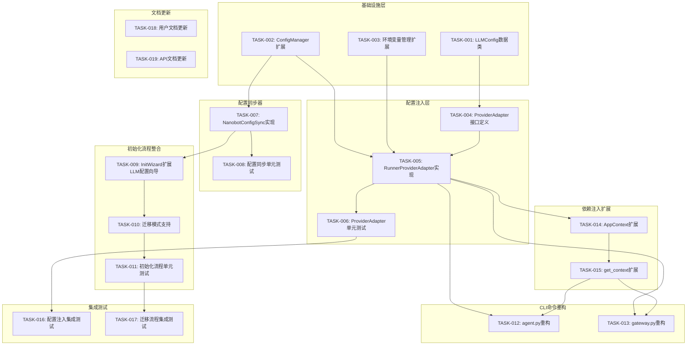

# v0.9.5 开发任务拆解清单

> **文档版本**: v1.0  
> **创建日期**: 2026-04-19  
> **版本目标**: 架构解耦与初始化流程整合  
> **需求来源**: `docs/requirements/REQ_需求规格说明书.md` (v2.1)  
> **架构设计**: `docs/architecture/v0_9_5_架构改进设计说明书.md`

---

## 1. 任务概览

### 1.1 版本目标

| 目标 | 描述 | 优先级 |
|------|------|--------|
| **架构解耦** | 消除对nanobot框架级配置的强依赖，核心业务逻辑仅依赖项目自身配置 | P0 |
| **初始化整合** | system init时触发nanobot完整初始化，整合配置数据到项目系统 | P0 |
| **用户体验优化** | 减少用户配置困惑，提供清晰的配置路径和使用指引 | P1 |

### 1.2 核心策略

**全面使用nanobot-ai提供的所有模块能力，不重复造轮子，仅替换配置管理层。**

### 1.3 任务统计

| 指标 | 数量 |
|------|------|
| **任务总数** | 19 |
| **P0任务** | 12 |
| **P1任务** | 5 |
| **P2任务** | 2 |
| **预估总工时** | 32小时 |

---

## 2. 任务依赖关系图



---

## 3. 任务详细清单

### 3.1 基础设施层（P0）

#### TASK-001: LLMConfig数据类定义

| 属性 | 值 |
|------|------|
| **任务ID** | TASK-001 |
| **所属模块** | 基础设施层 |
| **任务名称** | LLMConfig数据类定义 |
| **优先级** | P0 |
| **预估工时** | 1小时 |
| **前置依赖** | 无 |

**任务描述**：
定义LLMConfig数据类，用于类型安全的LLM配置传递。

**交付物**：
- `src/core/llm_config.py` - LLMConfig数据类

**验收标准**：
- [ ] LLMConfig包含provider、model、api_key、base_url等字段
- [ ] 类型注解完整，mypy零错误
- [ ] 提供默认值和工厂方法

**实现要点**：
```python
@dataclass
class LLMConfig:
    provider: str
    model: str
    api_key: str | None = None
    base_url: str | None = None
    max_iterations: int = 10
    context_window_tokens: int = 128000
```

---

#### TASK-002: ConfigManager扩展LLM配置项

| 属性 | 值 |
|------|------|
| **任务ID** | TASK-002 |
| **所属模块** | 基础设施层 |
| **任务名称** | ConfigManager扩展LLM配置项 |
| **优先级** | P0 |
| **预估工时** | 2小时 |
| **前置依赖** | 无 |

**任务描述**：
扩展ConfigManager，支持LLM相关配置项的读取和保存。

**交付物**：
- `src/core/config.py` - 扩展get_llm_config()和save_llm_config()方法

**验收标准**：
- [ ] 支持llm_provider、llm_model、llm_base_url配置项
- [ ] API Key从环境变量读取（NANOBOT_LLM_API_KEY）
- [ ] 支持save_llm_config()保存到config.json和.env.local
- [ ] 单元测试覆盖率≥80%

**实现要点**：
```python
def get_llm_config(self) -> dict[str, Any]:
    config = self.load_config()
    return {
        "provider": config.get("llm_provider") or os.getenv("NANOBOT_LLM_PROVIDER"),
        "model": config.get("llm_model") or os.getenv("NANOBOT_LLM_MODEL"),
        "api_key": os.getenv("NANOBOT_LLM_API_KEY"),
        "base_url": config.get("llm_base_url"),
    }
```

---

#### TASK-003: 环境变量管理扩展

| 属性 | 值 |
|------|------|
| **任务ID** | TASK-003 |
| **所属模块** | 基础设施层 |
| **任务名称** | 环境变量管理扩展 |
| **优先级** | P0 |
| **预估工时** | 1小时 |
| **前置依赖** | 无 |

**任务描述**：
扩展EnvManager，支持LLM相关环境变量的管理。

**交付物**：
- `src/core/env_manager.py` - 扩展LLM环境变量支持

**验收标准**：
- [ ] 支持NANOBOT_LLM_API_KEY、NANOBOT_LLM_PROVIDER、NANOBOT_LLM_MODEL环境变量
- [ ] 支持从.env.local读取和写入
- [ ] 单元测试覆盖率≥80%

---

### 3.2 配置注入层（P0）

#### TASK-004: ProviderAdapter接口定义

| 属性 | 值 |
|------|------|
| **任务ID** | TASK-004 |
| **所属模块** | 配置注入层 |
| **任务名称** | ProviderAdapter接口定义 |
| **优先级** | P0 |
| **预估工时** | 1小时 |
| **前置依赖** | TASK-001 |

**任务描述**：
定义ProviderAdapter协议接口，统一配置访问规范。

**交付物**：
- `src/core/provider_adapter.py` - ProviderAdapter协议定义

**验收标准**：
- [ ] 定义get_llm_config()、get_provider_instance()、get_agent_defaults()、is_available()、close()方法
- [ ] 使用Protocol定义接口
- [ ] 类型注解完整

**实现要点**：
```python
class ProviderAdapter(Protocol):
    def get_llm_config(self) -> LLMConfig: ...
    def get_provider_instance(self) -> Any: ...
    def get_agent_defaults(self) -> "AgentDefaults": ...
    def is_available(self) -> bool: ...
    def close(self) -> None: ...
```

---

#### TASK-005: RunnerProviderAdapter实现

| 属性 | 值 |
|------|------|
| **任务ID** | TASK-005 |
| **所属模块** | 配置注入层 |
| **任务名称** | RunnerProviderAdapter实现 |
| **优先级** | P0 |
| **预估工时** | 3小时 |
| **前置依赖** | TASK-002, TASK-003, TASK-004 |

**任务描述**：
实现RunnerProviderAdapter，从项目配置读取LLM配置并注入到nanobot模块。

**交付物**：
- `src/core/provider_adapter.py` - RunnerProviderAdapter实现

**验收标准**：
- [ ] 从项目配置读取LLM配置
- [ ] 使用nanobot.providers.factory.create_provider()创建Provider实例
- [ ] 支持回退到nanobot配置（兼容已安装用户）
- [ ] 配置不可用时提供清晰的错误提示
- [ ] 单元测试覆盖率≥80%

**实现要点**：
```python
class RunnerProviderAdapter:
    def __init__(self, runner_config: "ConfigManager") -> None:
        self._runner_config = runner_config
        self._nanobot_config: Any | None = None
    
    def get_llm_config(self) -> LLMConfig:
        if self._has_runner_llm_config():
            return self._from_runner_config()
        if self._try_load_nanobot_config():
            return self._from_nanobot_config()
        raise ValueError("未配置LLM，请运行 'nanobotrun system init'")
```

---

#### TASK-006: ProviderAdapter单元测试

| 属性 | 值 |
|------|------|
| **任务ID** | TASK-006 |
| **所属模块** | 配置注入层 |
| **任务名称** | ProviderAdapter单元测试 |
| **优先级** | P0 |
| **预估工时** | 2小时 |
| **前置依赖** | TASK-005 |

**任务描述**：
为ProviderAdapter编写完整的单元测试。

**交付物**：
- `tests/unit/core/test_provider_adapter.py` - 单元测试文件

**验收标准**：
- [ ] 测试从项目配置读取LLM配置
- [ ] 测试回退到nanobot配置
- [ ] 测试配置不可用时的错误处理
- [ ] 测试Provider实例创建
- [ ] 测试覆盖率≥80%

---

### 3.3 配置同步器（P1）

#### TASK-007: NanobotConfigSync实现

| 属性 | 值 |
|------|------|
| **任务ID** | TASK-007 |
| **所属模块** | 配置同步器 |
| **任务名称** | NanobotConfigSync实现 |
| **优先级** | P1 |
| **预估工时** | 2小时 |
| **前置依赖** | TASK-002 |

**任务描述**：
实现NanobotConfigSync，单向同步项目配置到nanobot配置。

**交付物**：
- `src/core/nanobot_config_sync.py` - NanobotConfigSync实现

**验收标准**：
- [ ] 单向同步项目配置到~/.nanobot/config.json
- [ ] 检查nanobot是否已安装
- [ ] 同步失败时返回详细的错误信息
- [ ] 单元测试覆盖率≥80%

**实现要点**：
```python
class NanobotConfigSync:
    def sync_to_nanobot(self) -> SyncResult:
        if not self._has_runner_llm_config():
            return SyncResult(success=False, errors=["项目配置中未找到LLM配置"])
        # 构建并写入nanobot配置
```

---

#### TASK-008: 配置同步单元测试

| 属性 | 值 |
|------|------|
| **任务ID** | TASK-008 |
| **所属模块** | 配置同步器 |
| **任务名称** | 配置同步单元测试 |
| **优先级** | P1 |
| **预估工时** | 1小时 |
| **前置依赖** | TASK-007 |

**任务描述**：
为NanobotConfigSync编写完整的单元测试。

**交付物**：
- `tests/unit/core/test_nanobot_config_sync.py` - 单元测试文件

**验收标准**：
- [ ] 测试单向同步成功场景
- [ ] 测试项目配置缺失场景
- [ ] 测试nanobot未安装场景
- [ ] 测试覆盖率≥80%

---

### 3.4 初始化流程整合（P0）

#### TASK-009: InitWizard扩展LLM配置向导

| 属性 | 值 |
|------|------|
| **任务ID** | TASK-009 |
| **所属模块** | 初始化流程整合 |
| **任务名称** | InitWizard扩展LLM配置向导 |
| **优先级** | P0 |
| **预估工时** | 3小时 |
| **前置依赖** | TASK-007 |

**任务描述**：
扩展InitWizard，支持LLM配置向导和nanobot配置同步。

**交付物**：
- `src/core/init/wizard.py` - 扩展LLM配置向导
- `src/core/init/prompts.py` - 扩展LLM配置提示

**验收标准**：
- [ ] 支持agent_mode参数控制是否配置LLM
- [ ] 配置LLM后自动同步到nanobot配置
- [ ] 支持跳过LLM配置（数据模式）
- [ ] 单元测试覆盖率≥80%

**实现要点**：
```python
def run(self, mode: InitMode = InitMode.FRESH, agent_mode: bool = True) -> InitResult:
    if agent_mode:
        llm_result = self._configure_llm()
        if llm_result.success:
            sync_result = self._sync_to_nanobot(llm_result.config)
```

---

#### TASK-010: 迁移模式支持

| 属性 | 值 |
|------|------|
| **任务ID** | TASK-010 |
| **所属模块** | 初始化流程整合 |
| **任务名称** | 迁移模式支持 |
| **优先级** | P0 |
| **预估工时** | 2小时 |
| **前置依赖** | TASK-009 |

**任务描述**：
支持从nanobot配置迁移到项目配置的迁移模式。

**交付物**：
- `src/core/init/wizard.py` - 迁移模式支持
- `src/core/init/migrate.py` - 迁移逻辑实现

**验收标准**：
- [ ] 支持--mode migrate参数
- [ ] 自动读取~/.nanobot/config.json并迁移
- [ ] API Key迁移到.env.local
- [ ] 迁移后验证配置完整性
- [ ] 单元测试覆盖率≥80%

**用户场景**：
```bash
nanobotrun system init --mode migrate
```

---

#### TASK-011: 初始化流程单元测试

| 属性 | 值 |
|------|------|
| **任务ID** | TASK-011 |
| **所属模块** | 初始化流程整合 |
| **任务名称** | 初始化流程单元测试 |
| **优先级** | P0 |
| **预估工时** | 2小时 |
| **前置依赖** | TASK-010 |

**任务描述**：
为初始化流程编写完整的单元测试。

**交付物**：
- `tests/unit/core/init/test_wizard_extended.py` - 扩展测试文件

**验收标准**：
- [ ] 测试新用户初始化流程
- [ ] 测试迁移模式流程
- [ ] 测试数据模式流程
- [ ] 测试配置验证失败场景
- [ ] 测试覆盖率≥80%

---

### 3.5 CLI命令重构（P0）

#### TASK-012: agent.py重构

| 属性 | 值 |
|------|------|
| **任务ID** | TASK-012 |
| **所属模块** | CLI命令重构 |
| **任务名称** | agent.py重构 |
| **优先级** | P0 |
| **预估工时** | 2小时 |
| **前置依赖** | TASK-005, TASK-015 |

**任务描述**：
重构agent.py，通过ProviderAdapter获取配置，消除对nanobot.config.loader的直接依赖。

**交付物**：
- `src/cli/commands/agent.py` - 重构后的文件

**验收标准**：
- [ ] 消除对nanobot.config.loader的直接导入
- [ ] 通过ProviderAdapter获取LLM配置
- [ ] 配置不可用时提供清晰的错误提示
- [ ] Agent功能正常运行
- [ ] 单元测试覆盖率≥70%

**实现要点**：
```python
async def _run_chat() -> None:
    from src.core.context import get_context
    from src.core.provider_adapter import RunnerProviderAdapter
    
    context = get_context()
    adapter = RunnerProviderAdapter(context.config)
    
    if not adapter.is_available():
        console.print("[red]错误: Agent功能需要配置LLM[/red]")
        return
    
    provider = adapter.get_provider_instance()
    agent_defaults = adapter.get_agent_defaults()
```

---

#### TASK-013: gateway.py重构

| 属性 | 值 |
|------|------|
| **任务ID** | TASK-013 |
| **所属模块** | CLI命令重构 |
| **任务名称** | gateway.py重构 |
| **优先级** | P0 |
| **预估工时** | 2小时 |
| **前置依赖** | TASK-005, TASK-015 |

**任务描述**：
重构gateway.py，通过ProviderAdapter获取配置，消除对nanobot.config.loader的直接依赖。

**交付物**：
- `src/cli/commands/gateway.py` - 重构后的文件

**验收标准**：
- [ ] 消除对nanobot.config.loader的直接导入
- [ ] 通过ProviderAdapter获取LLM配置
- [ ] Gateway服务正常运行
- [ ] 单元测试覆盖率≥70%

---

### 3.6 依赖注入扩展（P0）

#### TASK-014: AppContext扩展

| 属性 | 值 |
|------|------|
| **任务ID** | TASK-014 |
| **所属模块** | 依赖注入扩展 |
| **任务名称** | AppContext扩展 |
| **优先级** | P0 |
| **预估工时** | 1小时 |
| **前置依赖** | TASK-005 |

**任务描述**：
扩展AppContext，支持ProviderAdapter的依赖注入。

**交付物**：
- `src/core/context.py` - 扩展AppContext

**验收标准**：
- [ ] AppContext新增provider_adapter属性
- [ ] AppContextFactory支持创建ProviderAdapter
- [ ] 类型注解完整
- [ ] 单元测试覆盖率≥80%

**实现要点**：
```python
@dataclass
class AppContext:
    # ... 现有属性 ...
    provider_adapter: "ProviderAdapter"
```

---

#### TASK-015: get_context扩展

| 属性 | 值 |
|------|------|
| **任务ID** | TASK-015 |
| **所属模块** | 依赖注入扩展 |
| **任务名称** | get_context扩展 |
| **优先级** | P0 |
| **预估工时** | 1小时 |
| **前置依赖** | TASK-014 |

**任务描述**：
扩展get_context()函数，支持ProviderAdapter的创建和注入。

**交付物**：
- `src/core/context.py` - 扩展get_context()

**验收标准**：
- [ ] get_context()返回包含provider_adapter的AppContext
- [ ] 支持测试时注入Mock对象
- [ ] 单元测试覆盖率≥80%

---

### 3.7 集成测试（P1）

#### TASK-016: 配置注入集成测试

| 属性 | 值 |
|------|------|
| **任务ID** | TASK-016 |
| **所属模块** | 集成测试 |
| **任务名称** | 配置注入集成测试 |
| **优先级** | P1 |
| **预估工时** | 2小时 |
| **前置依赖** | TASK-006 |

**任务描述**：
编写配置注入的集成测试，验证端到端的配置注入流程。

**交付物**：
- `tests/integration/test_provider_adapter_integration.py` - 集成测试文件

**验收标准**：
- [ ] 测试从项目配置到AgentLoop的完整流程
- [ ] 测试配置变更后的热更新
- [ ] 测试多Provider切换场景
- [ ] 测试覆盖率≥70%

---

#### TASK-017: 迁移流程集成测试

| 属性 | 值 |
|------|------|
| **任务ID** | TASK-017 |
| **所属模块** | 集成测试 |
| **任务名称** | 迁移流程集成测试 |
| **优先级** | P1 |
| **预估工时** | 2小时 |
| **前置依赖** | TASK-011 |

**任务描述**：
编写迁移流程的集成测试，验证端到端的迁移流程。

**交付物**：
- `tests/integration/test_migration_integration.py` - 集成测试文件

**验收标准**：
- [ ] 测试三种用户场景的完整迁移流程
- [ ] 测试迁移后配置完整性
- [ ] 测试回滚机制
- [ ] 测试覆盖率≥70%

---

### 3.8 文档更新（P2）

#### TASK-018: 用户文档更新

| 属性 | 值 |
|------|------|
| **任务ID** | TASK-018 |
| **所属模块** | 文档更新 |
| **任务名称** | 用户文档更新 |
| **优先级** | P2 |
| **预估工时** | 1小时 |
| **前置依赖** | TASK-012, TASK-013 |

**任务描述**：
更新用户文档，说明新的配置方式和迁移路径。

**交付物**：
- `docs/guides/cli_usage.md` - 更新CLI使用指南
- `docs/guides/agent_config_guide.md` - 更新Agent配置指南

**验收标准**：
- [ ] 说明三种用户场景的配置方式
- [ ] 说明迁移命令和步骤
- [ ] 说明配置文件位置和格式

---

#### TASK-019: API文档更新

| 属性 | 值 |
|------|------|
| **任务ID** | TASK-019 |
| **所属模块** | 文档更新 |
| **任务名称** | API文档更新 |
| **优先级** | P2 |
| **预估工时** | 1小时 |
| **前置依赖** | TASK-005, TASK-007 |

**任务描述**：
更新API文档，说明新增的接口和方法。

**交付物**：
- `docs/api/api_reference.md` - 更新API参考文档

**验收标准**：
- [ ] 记录ProviderAdapter接口
- [ ] 记录NanobotConfigSync接口
- [ ] 记录ConfigManager扩展方法

---

## 4. 迭代计划

### 4.1 迭代划分

| 迭代 | 周期 | 任务 | 目标 |
|------|------|------|------|
| **迭代1** | Day 1-2 | TASK-001 ~ TASK-006 | 完成基础设施层和配置注入层 |
| **迭代2** | Day 3-4 | TASK-007 ~ TASK-011 | 完成配置同步器和初始化流程整合 |
| **迭代3** | Day 5-6 | TASK-012 ~ TASK-015 | 完成CLI命令重构和依赖注入扩展 |
| **迭代4** | Day 7-8 | TASK-016 ~ TASK-019 | 完成集成测试和文档更新 |

### 4.2 关键里程碑

| 里程碑 | 日期 | 交付物 |
|--------|------|--------|
| **M1: 配置注入层完成** | Day 2 | ProviderAdapter可用 |
| **M2: 初始化流程完成** | Day 4 | 三种用户场景可用 |
| **M3: CLI重构完成** | Day 6 | Agent/Gateway功能正常 |
| **M4: 版本发布** | Day 8 | v0.9.5发布 |

---

## 5. 风险与应对

### 5.1 技术风险

| 风险 | 可能性 | 影响 | 应对措施 |
|------|--------|------|----------|
| nanobot-ai API变更 | 中 | 高 | 版本锁定，适配层隔离 |
| 配置注入兼容性 | 中 | 中 | 充分测试，保留回退机制 |
| 迁移数据丢失 | 低 | 高 | 迁移前备份，提供回滚机制 |

### 5.2 进度风险

| 风险 | 可能性 | 影响 | 应对措施 |
|------|--------|------|----------|
| 任务估时不准 | 中 | 中 | 预留缓冲时间，优先P0任务 |
| 依赖阻塞 | 低 | 高 | 并行开发，Mock接口 |

---

## 6. 验收标准

### 6.1 功能验收

- [ ] 所有P0任务完成
- [ ] 测试覆盖率达标（core≥80%, agents≥70%, cli≥60%）
- [ ] 三种用户场景可用
- [ ] Agent/Gateway功能正常

### 6.2 质量门禁

- [ ] `uv run ruff format --check src/ tests/` 零警告
- [ ] `uv run ruff check src/ tests/` 零警告
- [ ] `uv run mypy src/` 零错误
- [ ] `uv run pytest tests/unit/` 通过率100%

### 6.3 文档验收

- [ ] 用户文档更新完成
- [ ] API文档更新完成
- [ ] 变更记录完整

---

## 7. 附录

### 7.1 参考文档

- [需求规格说明书](../requirements/REQ_需求规格说明书.md)
- [架构设计说明书](../architecture/v0_9_5_架构改进设计说明书.md)
- [架构评审报告](../architecture/v0_9_5_架构评审报告.md)
- [AGENTS.md](../../AGENTS.md) - 开发指南

### 7.2 变更记录

| 版本 | 日期 | 变更内容 | 作者 |
|------|------|----------|------|
| v1.0 | 2026-04-19 | 初始版本 | 架构师 |

---

*本文档遵循任务拆解规范，定期 review 和更新*
