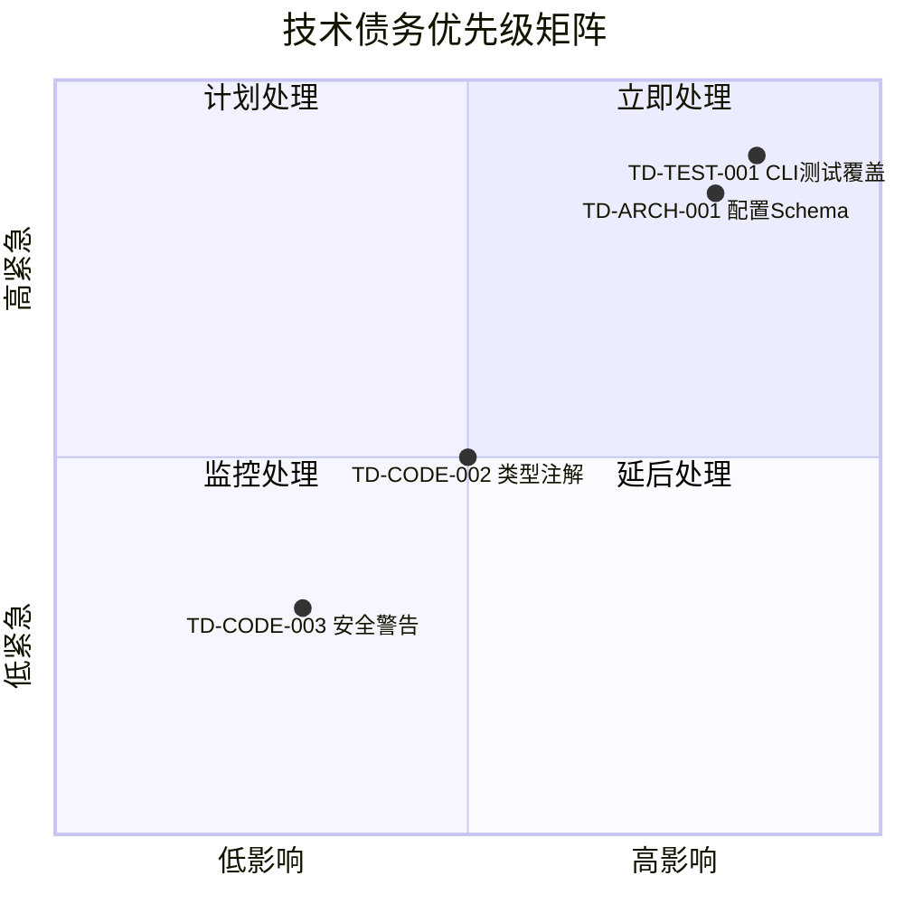
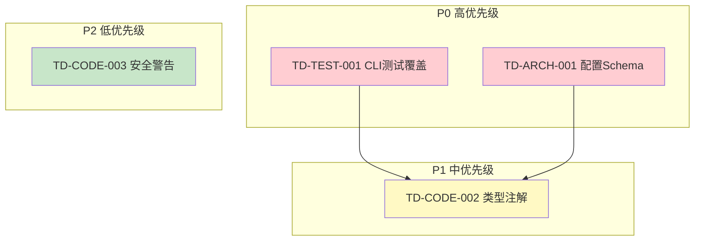

# v0.4.3 技术债偿还任务规划

**版本**: v0.4.3  
**规划日期**: 2026-03-30  
**规划人**: 架构师智能体  
**目标**: 系统性偿还已识别技术债务，提升代码质量和系统可维护性

---

## 1. 执行摘要

### 1.1 规划背景

基于v0.4.1风险复盘分析报告和架构治理指南，识别出以下技术债务需要偿还：

| 债务类型 | 数量 | 风险等级 | 影响范围 |
|---------|------|---------|---------|
| 测试覆盖不足 | 1项 | 🔴 高 | 质量风险 |
| 代码质量 | 2项 | 🟡 中 | 维护性 |
| 架构设计 | 1项 | 🔴 高 | 稳定性 |

### 1.2 核心目标

1. **测试覆盖率达标**: CLI模块≥60%
2. **代码质量提升**: 类型注解覆盖率≥80%
3. **架构健壮性**: 实现配置Schema验证机制
4. **安全合规**: 处理bandit安全警告

### 1.3 预期成果

- ✅ CLI模块测试覆盖率从34%提升至60%
- ✅ 核心模块类型注解覆盖率≥80%
- ✅ 配置Schema验证机制上线
- ✅ bandit安全扫描无高危警告

---

## 2. 技术债务详细清单

### 2.1 测试覆盖不足（TD-TEST）

#### TD-TEST-001: CLI模块测试覆盖率不足 🔴 高优先级

| 属性 | 内容 |
|------|------|
| **当前状态** | 覆盖率34%（770行代码，506行未覆盖） |
| **目标状态** | 覆盖率≥60% |
| **影响范围** | 质量风险、重构信心 |
| **根本原因** | CLI模块开发时未同步编写测试 |
| **关联风险** | R-007 数据量增长导致性能下降 |

**未覆盖关键函数**:
- `import_command()` - 导入功能入口
- `stats_command()` - 统计功能入口
- `chat_command()` - Agent交互入口
- `report_command()` - 报告生成入口

---

### 2.2 代码质量问题（TD-CODE）

#### TD-CODE-002: 类型注解不完整 🟡 中优先级

| 属性 | 内容 |
|------|------|
| **当前状态** | mypy配置宽松（disallow_untyped_defs=false） |
| **目标状态** | 核心模块类型注解覆盖率≥80% |
| **影响范围** | IDE智能提示、重构安全性 |
| **涉及模块** | cli.py, notify/*.py |

#### TD-CODE-003: bandit安全警告 🟢 低优先级

| 属性 | 内容 |
|------|------|
| **当前状态** | 5个B105警告（硬编码空密码字符串） |
| **位置** | `config.py:57`, `feishu_webhook.py:892-897` |
| **影响范围** | 安全扫描报告 |
| **处理方式** | 添加nosec注释或重构配置 |

---

### 2.3 架构设计问题（TD-ARCH）

#### TD-ARCH-001: 配置管理无Schema验证 🔴 高优先级

| 属性 | 内容 |
|------|------|
| **当前状态** | 配置加载无验证，直接硬编码默认值 |
| **目标状态** | 配置Schema定义+自动验证 |
| **影响范围** | 配置错误导致运行时异常 |
| **关联风险** | R-011 配置管理架构缺陷 |

**架构缺陷**:
- ❌ 无配置Schema验证
- ❌ 无配置项类型检查
- ❌ 无必填项校验
- ❌ 无配置版本兼容性检查

---

## 3. 任务分解与优先级排序

### 3.1 优先级矩阵



### 3.2 任务依赖关系



---

## 4. 详细实施计划

### 4.1 第一阶段：基础建设（Day 1-4）

#### 任务1: CLI模块测试覆盖率提升

**任务ID**: TD-TEST-001  
**负责人**: 开发工程师  
**预估工时**: 16小时  
**计划周期**: Day 1-3

**实施步骤**:

| 步骤 | 内容 | 工时 | 交付物 |
|------|------|------|--------|
| 1.1 | 分析CLI模块未覆盖代码 | 2h | 未覆盖函数清单 |
| 1.2 | 编写import_command测试 | 4h | test_cli_import.py |
| 1.3 | 编写stats_command测试 | 3h | test_cli_stats.py |
| 1.4 | 编写chat_command测试 | 3h | test_cli_chat.py |
| 1.5 | 编写report_command测试 | 2h | test_cli_report.py |
| 1.6 | 覆盖率验证和补充 | 2h | 覆盖率报告≥60% |

**验收标准**:
- [ ] CLI模块测试覆盖率≥60%
- [ ] 所有新增测试通过
- [ ] 无测试警告

**风险评估**:
| 风险 | 概率 | 影响 | 应对措施 |
|------|------|------|---------|
| CLI命令依赖外部服务 | 中 | 高 | Mock外部依赖 |
| 测试数据准备困难 | 低 | 中 | 使用fixtures |

---

#### 任务2: 配置Schema验证机制

**任务ID**: TD-ARCH-001  
**负责人**: 开发工程师  
**预估工时**: 12小时  
**计划周期**: Day 2-4

**实施步骤**:

| 步骤 | 内容 | 工时 | 交付物 |
|------|------|------|--------|
| 2.1 | 定义配置Schema数据类 | 2h | config_schema.py |
| 2.2 | 实现配置验证逻辑 | 3h | validate()方法 |
| 2.3 | 集成到ConfigManager | 2h | 配置加载自动验证 |
| 2.4 | 编写单元测试 | 3h | test_config_schema.py |
| 2.5 | 更新文档 | 2h | 配置管理最佳实践.md |

**验收标准**:
- [ ] 所有配置项有Schema定义
- [ ] 配置加载时自动验证
- [ ] 验证失败有明确错误提示
- [ ] 测试覆盖率≥90%

**代码示例**:
```python
@dataclass
class AppConfig:
    """应用配置Schema"""
    version: str
    data_dir: str
    auto_push_feishu: bool = False
    feishu_app_id: Optional[str] = None
    feishu_app_secret: Optional[str] = None
    
    REQUIRED_FIELDS = ["version", "data_dir"]
    
    @classmethod
    def validate(cls, config: dict) -> tuple[bool, list[str]]:
        """验证配置是否符合Schema"""
        errors = []
        for field in cls.REQUIRED_FIELDS:
            if field not in config:
                errors.append(f"缺少必填字段: {field}")
        return len(errors) == 0, errors
```

---

### 4.2 第二阶段：质量提升（Day 5-8）

#### 任务3: 类型注解完善

**任务ID**: TD-CODE-002  
**负责人**: 开发工程师  
**预估工时**: 12小时  
**计划周期**: Day 5-7

**实施步骤**:

| 步骤 | 内容 | 工时 | 交付物 |
|------|------|------|--------|
| 3.1 | 扫描缺失类型注解的函数 | 2h | 函数清单 |
| 3.2 | 补充cli.py类型注解 | 4h | 类型注解完成 |
| 3.3 | 补充notify模块类型注解 | 4h | 类型注解完成 |
| 3.4 | mypy验证 | 2h | mypy检查通过 |

**验收标准**:
- [ ] 核心模块类型注解覆盖率≥80%
- [ ] mypy检查零错误
- [ ] IDE智能提示正常

**类型注解规范**:
```python
# 函数类型注解
def calculate_vdot(distance_m: float, time_s: float) -> float:
    """计算VDOT值"""
    ...

# 类方法类型注解
class StorageManager:
    def read_parquet(
        self, 
        year: int, 
        columns: Optional[list[str]] = None
    ) -> pl.LazyFrame:
        """读取Parquet文件"""
        ...

# 复杂类型别名
ActivityRecord: TypeAlias = dict[str, Union[str, int, float, datetime]]
```

---

#### 任务4: 安全警告处理

**任务ID**: TD-CODE-003  
**负责人**: 开发工程师  
**预估工时**: 2小时  
**计划周期**: Day 8

**实施步骤**:

| 步骤 | 内容 | 工时 | 交付物 |
|------|------|------|--------|
| 4.1 | 分析B105警告 | 0.5h | 警告分析报告 |
| 4.2 | 处理config.py警告 | 0.5h | 添加nosec注释 |
| 4.3 | 处理feishu_webhook.py警告 | 0.5h | 添加nosec注释 |
| 4.4 | 验证bandit扫描 | 0.5h | bandit检查通过 |

**验收标准**:
- [ ] bandit扫描无高危警告
- [ ] 安全文档更新

---

#### 任务5: 文档同步更新

**任务ID**: TD-DOC-001  
**负责人**: 架构师  
**预估工时**: 4小时  
**计划周期**: Day 8

**实施步骤**:

| 步骤 | 内容 | 工时 | 交付物 |
|------|------|------|--------|
| 5.1 | 更新技术债务登记册 | 1h | TECH_DEBT.md |
| 5.2 | 更新架构设计文档 | 1h | ARC_架构设计.md |
| 5.3 | 更新AGENTS.md | 1h | AGENTS.md |
| 5.4 | 更新CHANGELOG | 1h | CHANGELOG.md |

**验收标准**:
- [ ] 文档与代码同步
- [ ] 技术债务登记册更新

---

## 5. 资源分配

### 5.1 人力资源

| 角色 | 人员 | 投入工时 | 主要职责 |
|------|------|---------|---------|
| 架构师 | 架构师智能体 | 6h | 规划、评审、文档 |
| 开发工程师 | 开发工程师智能体 | 40h | 代码开发、测试编写 |
| 测试工程师 | 测试工程师智能体 | 4h | 测试评审、覆盖率验证 |
| 代码审查员 | ts-code-reviewer | 4h | 代码审查、质量把关 |

### 5.2 时间资源

| 阶段 | 周期 | 工时 | 关键里程碑 |
|------|------|------|-----------|
| 第一阶段 | Day 1-4 | 28h | CLI测试≥60%, 配置Schema完成 |
| 第二阶段 | Day 5-8 | 18h | 类型注解≥80%, 安全警告处理, 文档更新 |

---

## 6. 风险评估与应对

### 6.1 风险识别

| 风险ID | 风险描述 | 概率 | 影响 | 等级 |
|--------|---------|------|------|------|
| R-TD-001 | CLI测试依赖外部服务Mock困难 | 中 | 高 | 🟡 中 |
| R-TD-002 | 配置Schema变更导致兼容性问题 | 低 | 高 | 🟡 中 |
| R-TD-003 | 类型注解工作量大超预期 | 中 | 中 | 🟡 中 |
| R-TD-004 | 测试覆盖率目标无法达成 | 低 | 高 | 🟡 中 |

### 6.2 应对措施

#### R-TD-001: CLI测试Mock困难

**应对策略**:
1. 使用pytest-mock创建统一Mock fixtures
2. 建立Mock数据工厂模式
3. 优先测试核心逻辑，外部依赖用Mock

**预案**:
- 若Mock成本过高，调整覆盖率目标至50%
- 标记外部依赖测试为集成测试

#### R-TD-002: 配置兼容性问题

**应对策略**:
1. 实现配置版本兼容性检查
2. 提供配置迁移工具
3. 保留向后兼容的默认值

**预案**:
- 发布配置迁移指南
- 提供配置验证脚本

#### R-TD-003: 类型注解超期

**应对策略**:
1. 优先处理核心模块
2. 使用渐进式类型注解
3. 非关键模块延后处理

**预案**:
- 调整目标覆盖率至70%
- 创建后续版本任务

---

## 7. 验收标准

### 7.1 代码质量门禁

| 检查项 | 目标值 | 验证方式 |
|--------|--------|---------|
| CLI模块测试覆盖率 | ≥60% | pytest --cov |
| 整体测试覆盖率 | ≥82% | pytest --cov |
| mypy类型检查 | 零错误 | mypy src/ |
| bandit安全扫描 | 无高危 | bandit -r src/ |

### 7.2 功能验收标准

| 功能 | 验收标准 | 验证方式 |
|------|---------|---------|
| 配置Schema验证 | 验证失败有提示 | 单元测试 |
| 类型注解 | IDE智能提示正常 | mypy检查 |

### 7.3 文档验收标准

| 文档 | 验收标准 |
|------|---------|
| TECH_DEBT.md | 债务状态更新 |
| ARC_架构设计.md | 架构变更记录 |
| AGENTS.md | 规范更新 |
| CHANGELOG.md | 变更记录完整 |

---

## 8. 监控与报告

### 8.1 进度监控指标

| 指标 | 目标 | 监控频率 | 负责人 |
|------|------|---------|--------|
| 任务完成率 | 100% | 每日 | 开发工程师 |
| 测试覆盖率 | ≥82% | 每次提交 | 测试工程师 |
| 代码审查通过率 | 100% | 每次PR | 代码审查员 |
| 文档更新率 | 100% | 任务完成时 | 架构师 |

### 8.2 质量监控指标

| 指标 | 目标 | 监控频率 |
|------|------|---------|
| 单元测试通过率 | 100% | 每次提交 |
| mypy检查通过 | 是 | 每次提交 |
| bandit扫描通过 | 是 | 每次提交 |
| 代码复杂度 | <15 | 每次PR |

### 8.3 进度报告模板

```markdown
# v0.4.3 技术债偿还进度报告 - Day X

## 今日完成
- [ ] 任务1: xxx
- [ ] 任务2: xxx

## 明日计划
- [ ] 任务3: xxx

## 风险与问题
- 问题1: xxx
  - 状态: 处理中/已解决
  - 影响: xxx

## 指标看板
| 指标 | 当前值 | 目标值 | 状态 |
|------|--------|--------|------|
| CLI覆盖率 | XX% | 60% | 🟢/🟡/🔴 |
| 类型注解覆盖率 | XX% | 80% | 🟢/🟡/🔴 |
```

---

## 9. 交付物清单

### 9.1 代码交付物

| 交付物 | 路径 | 负责人 |
|--------|------|--------|
| CLI测试代码 | tests/unit/test_cli_*.py | 开发工程师 |
| 配置Schema | src/core/config_schema.py | 开发工程师 |
| 类型注解更新 | src/cli.py, src/notify/*.py | 开发工程师 |

### 9.2 文档交付物

| 交付物 | 路径 | 负责人 |
|--------|------|--------|
| 技术债务登记册 | docs/project/TECH_DEBT.md | 架构师 |
| 架构设计更新 | docs/architecture/ARC_架构设计.md | 架构师 |
| 配置最佳实践 | docs/architecture/配置管理最佳实践.md | 架构师 |
| 变更日志 | CHANGELOG.md | 架构师 |

---

## 10. v0.4.4预规划任务

以下任务将在v0.4.4版本中完成（notify模块完善后）：

| ID | 描述 | 优先级 | 预估工时 |
|----|------|--------|---------|
| TD-TEST-002 | notify模块测试覆盖率提升至85% | 🟡 中 | 8h |
| TD-CODE-001 | 实现TODO标记的功能（3处） | 🟡 中 | 8h |
| TD-ARCH-002 | 飞书配置统一管理 | 🟡 中 | 6h |

---

## 11. 附录

### 11.1 参考文档

- [v0.4.1风险复盘分析报告](./architecture/review/ARC_v0.4.1_风险复盘分析报告.md)
- [架构治理指南](./architecture/架构治理指南.md)
- [项目风险登记册](./project/RISK_风险登记册.md)
- [AGENTS.md](../AGENTS.md)

---

**文档版本**: 1.1  
**创建日期**: 2026-03-30  
**最后更新**: 2026-03-30  
**下次评审**: v0.4.3版本发布前
