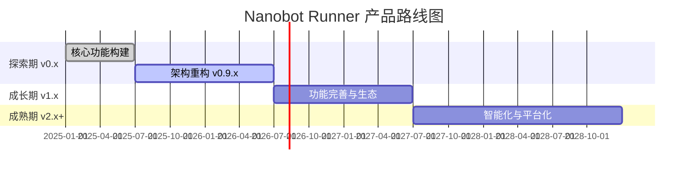

# Nanobot Runner 产品规划方案

> **文档版本**: v2.0
> **创建日期**: 2026-04-14
> **最后更新**: 2026-04-22
> **文档状态**: 正式发布
> **适用范围**: 个人开发者/一人公司场景

---

## 1. 产品愿景与定位

### 1.1 产品愿景

**成为技术型跑者首选的本地化 AI 跑步数据分析工具**

Nanobot Runner 致力于解决数据隐私与深度分析的矛盾，通过本地化的数据存储和 AI 分析能力，让用户完全掌控自己的运动数据，同时享受专业级数据分析体验。

### 1.2 核心价值主张

| 维度 | 价值主张 |
|------|----------|
| **隐私优先** | 本地存储，零外联设计，数据完全用户可控 |
| **专业分析** | 基于运动科学的专业指标（VDOT、TSS、心率漂移等） |
| **AI 赋能** | 自然语言交互，智能训练建议 |
| **高性能** | Polars + Parquet，查询性能提升 >= 20% |
| **开发者友好** | 完善的 CLI 工具、API 文档和扩展能力 |

### 1.3 产品定位

**目标市场**: 个人跑步数据管理工具（细分市场）

**差异化定位**:
- 与 Garmin Connect / Strava 对比：数据本地化，隐私可控
- 与 TrainingPeaks 对比：免费开源，可定制性强
- 与一般跑步 App 对比：专业分析深度，AI 交互能力

### 1.4 目标用户画像

#### 主要用户：技术型严肃跑者

| 属性 | 描述 |
|------|------|
| **年龄段** | 25-45 岁 |
| **职业背景** | 程序员、工程师、数据分析师等技术从业者 |
| **跑步经验** | 规律跑步 2 年以上，有马拉松参赛经历 |
| **数据意识** | 习惯佩戴心率带、功率计等专业设备 |
| **核心痛点** | 担心云端数据隐私，需要更专业的数据分析 |
| **技术能力** | 熟悉命令行操作，具备一定编程基础 |

#### 次要用户：跑步数据分析师

| 属性 | 描述 |
|------|------|
| **使用场景** | 分析运动员训练数据，制定训练计划 |
| **核心需求** | 批量数据处理、自定义分析脚本、报告生成 |
| **技术能力** | Python 数据分析能力，熟悉 Pandas/Polars |

---

## 2. 产品路线图

### 2.1 发展阶段规划

### 2.2 阶段目标与里程碑

#### 探索期（2025.01 - 2026.06）- 当前阶段

**阶段目标**: 验证产品核心价值，构建稳定的技术底座

| 里程碑 | 目标日期 | 关键成果 | 状态 |
|--------|----------|----------|------|
| v0.5 MVP | 2025-03 | FIT 解析 + 基础存储 + CLI | 已完成 |
| v0.8 核心功能 | 2025-06 | VDOT/TSS/心率漂移分析 | 已完成 |
| v0.9.0 架构重构 | 2026-04 | 依赖注入 + 类型安全 + CLI分层 | 已完成 |
| v0.9.4 配置管理 | 2026-04 | 配置管理 + 工作区 + 初始化向导 | 已完成 |
| v0.9.5 架构解耦 | 2026-04 | nanobot-ai SDK化 + 配置注入 | 已完成 |
| v0.10.0~v0.12.0 智能跑步计划 | 2026-04~2026-06 | 三层架构（数据感知+智能调整+预测规划） | 进行中 |
| v1.0 稳定版 | 2026-06 | API 稳定 + 文档完善 | 计划中 |

#### 成长期（2026.07 - 2027.06）

**阶段目标**: 完善功能矩阵，构建用户生态

| 里程碑 | 目标日期 | 关键成果 |
|--------|----------|----------|
| v1.1 训练计划 | 2026-08 | 个性化训练计划生成 |
| v1.2 数据可视化 | 2026-10 | 图表报告 + Web 预览 |
| v1.3 生态扩展 | 2026-12 | 插件系统 + 社区共享 |
| v1.5 移动端 | 2027-03 | 移动端数据同步 |
| v1.8 智能教练 | 2027-06 | AI 训练建议 + 伤病预警 |

#### 成熟期（2027.07 - 2028.12）

**阶段目标**: 智能化升级，探索平台化可能

| 里程碑 | 目标日期 | 关键成果 |
|--------|----------|----------|
| v2.0 智能平台 | 2027-09 | 多模态 AI + 语音交互 |
| v2.5 社区版 | 2028-03 | 开源社区治理 + 贡献者生态 |
| v3.0 企业版 | 2028-12 | 教练团队版 + 数据看板 |

---

## 3. 版本迭代计划

### 3.1 当前版本：v0.9.x 架构改进

**版本目标**: 技术债务清理，架构规范化，SDK化改造

| 版本 | 发布日期 | 核心功能 | 优先级 | 状态 |
|------|----------|----------|--------|------|
| v0.9.0 | 2026-04-09 | 依赖注入 + 类型安全 + CLI分层 | P0 | 已完成 |
| v0.9.3 | 2026-04-15 | 领域模型统一、测试覆盖提升 | P0 | 已完成 |
| v0.9.4 | 2026-04-16 | 配置管理 + 工作区 + 初始化向导 | P0 | 已完成 |
| v0.9.5 | 2026-04-20 | nanobot-ai SDK化 + 配置注入 + 初始化整合 | P0 | 已完成 |
| v0.10.0 | 2026-04-22 | 智能跑步计划 - 数据感知层 | P0 | 进行中 |
| v0.11.0 | 2026-05 | 智能跑步计划 - 智能调整层 | P0 | 计划中 |
| v0.12.0 | 2026-06 | 智能跑步计划 - 预测规划层 | P0 | 计划中 |
| v1.0 | 2026-06-30 | API 稳定 + 文档完善 | P0 | 计划中 |

#### v0.9.5 版本定位

**版本主题**: 架构解耦与初始化流程整合

**核心策略**: 全面使用nanobot-ai提供的所有模块能力，不重复造轮子，仅替换配置管理层。

**技术收益**:
- 用户无需单独安装nanobot，降低使用门槛
- 配置统一管理，消除双配置系统困惑
- 初始化流程整合，提升用户体验
- 向后兼容已使用nanobot的用户

**关键交付物**:
- ProviderAdapter配置注入层
- NanobotConfigSync单向同步器
- 初始化流程整合（三种用户场景）
- 用户迁移路径文档

#### v0.10.0~v0.12.0 智能跑步计划

**版本主题**: 智能跑步计划三层架构

**核心策略**: 基于训练科学和AI能力，构建从数据感知到智能调整再到预测规划的完整训练计划管理体系。

**三层架构**:
- **数据感知层（v0.10.0）**: 收集训练反馈，跟踪计划完成度，分析训练响应
- **智能调整层（v0.11.0）**: LLM驱动计划调整，自然语言修改，硬性/软性规则校验
- **预测规划层（v0.12.0）**: 目标达成评估，长期周期规划，智能建议生成

**关键交付物**:
- PlanManager / PlanGenerator / PlanAnalyzer
- PlanExecutionRepository / TrainingResponseAnalyzer
- PlanAdjustmentValidator / PromptTemplateEngine / PlanModificationDialogManager
- GoalPredictionEngine / LongTermPlanGenerator / SmartAdviceEngine

### 3.2 近期版本：v1.0 稳定版

**版本目标**: API 稳定化，文档完善，可正式发布

| 版本 | 发布日期 | 核心功能 | 优先级 |
|------|----------|----------|--------|
| v1.0-alpha | 2026-06-01 | API 冻结、文档完善、Bug 修复 | P0 |
| v1.0-beta | 2026-06-15 | 社区测试、反馈收集 | P0 |
| v1.0.0 | 2026-06-30 | 正式发布 | P0 |

**关键交付物**:
- 稳定的 CLI API
- 完善的用户文档
- 一键安装脚本
- 示例数据集

### 3.3 功能优先级矩阵

#### P0 - 核心功能（必须完成）

| 功能 | 版本 | 业务价值 | 技术难度 | 状态 |
|------|------|----------|----------|------|
| FIT 文件解析 | v0.5 | 高 | 中 | 完成 |
| Parquet 存储 | v0.5 | 高 | 中 | 完成 |
| SHA256 去重 | v0.5 | 高 | 中 | 完成 |
| VDOT 计算 | v0.8 | 高 | 中 | 完成 |
| TSS/ATL/CTL 计算 | v0.8 | 高 | 中 | 完成 |
| 心率漂移分析 | v0.8 | 高 | 中 | 完成 |
| Agent 自然语言交互 | v0.8 | 高 | 高 | 完成 |
| 依赖注入架构 | v0.9.0 | 高 | 中 | 完成 |
| 核心模块测试覆盖 | v0.9.3 | 高 | 中 | 完成 |
| 配置管理 + 初始化向导 | v0.9.4 | 高 | 中 | 完成 |
| nanobot-ai SDK化 | v0.9.5 | 高 | 高 | 完成 |
| 配置注入层 | v0.9.5 | 高 | 中 | 完成 |
| 智能跑步计划 - 数据感知层 | v0.10.0 | 高 | 高 | 进行中 |
| 智能跑步计划 - 智能调整层 | v0.11.0 | 高 | 高 | 计划中 |
| 智能跑步计划 - 预测规划层 | v0.12.0 | 高 | 高 | 计划中 |

#### P1 - 重要功能（计划实现）

| 功能 | 版本 | 业务价值 | 技术难度 | 状态 |
|------|------|----------|----------|------|
| 训练计划生成 | v1.1 | 高 | 高 | 计划中 |
| 周报/月报自动推送 | v1.0 | 高 | 低 | 完成 |
| 数据可视化图表 | v1.2 | 高 | 中 | 计划中 |
| 用户画像管理 | v0.9.4 | 中 | 低 | 完成 |
| 多设备数据同步 | v1.2 | 中 | 中 | 计划中 |

#### P2 - 增强功能（未来考虑）

| 功能 | 版本 | 业务价值 | 技术难度 | 状态 |
|------|------|----------|----------|------|
| 插件系统 | v1.3 | 高 | 高 | 规划中 |
| Web UI 预览 | v1.2 | 中 | 高 | 规划中 |
| 移动端同步 | v1.5 | 高 | 高 | 规划中 |
| AI 训练建议 | v1.8 | 高 | 高 | 规划中 |
| 伤病风险预警 | v1.8 | 高 | 高 | 规划中 |
| 社区数据共享 | v1.3 | 中 | 中 | 规划中 |

---

## 4. 资源需求评估

### 4.1 人力资源（个人开发者场景）

| 角色 | 投入比例 | 职责 |
|------|----------|------|
| 产品经理 | 20% | 需求管理、版本规划、用户反馈 |
| 架构师 | 15% | 技术决策、代码评审、架构演进 |
| 开发工程师 | 50% | 功能开发、Bug 修复、性能优化 |
| 测试工程师 | 10% | 测试策略、自动化测试、质量把控 |
| 运维工程师 | 5% | 发布管理、CI/CD、文档维护 |

**估算工时**: 每周约 20-30 小时投入

### 4.2 技术资源

| 资源类型 | 需求 | 成本 |
|----------|------|------|
| 开发设备 | 个人电脑 | 已具备 |
| 测试数据 | 脱敏 FIT 文件 | 已具备 |
| 代码托管 | GitHub 免费版 | 免费 |
| CI/CD | GitHub Actions | 免费 |
| 文档托管 | GitHub Pages | 免费 |
| AI API | OpenAI/Claude | 按需付费 |

### 4.3 时间估算

| 阶段 | 预计工期 | 关键依赖 |
|------|----------|----------|
| v0.9.3 架构改进 | 6 周 | 测试覆盖率达标 |
| v0.10.0 数据感知层 | 2 周 | 计划模型设计完成 |
| v0.11.0 智能调整层 | 2 周 | LLM Prompt调优 |
| v0.12.0 预测规划层 | 2 周 | 历史数据积累 |
| v1.0 稳定版 | 4 周 | 社区反馈 |
| v1.1 训练计划 | 6 周 | AI 模型调优 |
| v1.2 数据可视化 | 8 周 | 前端技术选型 |

---

## 5. 风险评估与应对策略

### 5.1 技术风险

| 风险 | 概率 | 影响 | 应对策略 |
|------|------|------|----------|
| 测试覆盖率不达标 | 低 | 高 | 已完成核心模块覆盖，持续维护 |
| 类型注解迁移困难 | 低 | 中 | 已完成迁移，mypy零错误 |
| 依赖注入改造复杂 | 低 | 高 | 已完成DI架构，运行稳定 |
| Polars API 变更 | 低 | 中 | 锁定版本，关注官方迁移指南 |
| nanobot-ai API变更 | 中 | 高 | 版本锁定，适配层隔离 |
| 配置注入兼容性 | 中 | 中 | 充分测试，保留回退机制 |
| 智能计划LLM幻觉 | 中 | 高 | 硬性规则校验，人工确认关键调整 |

### 5.2 产品风险

| 风险 | 概率 | 影响 | 应对策略 |
|------|------|------|----------|
| 用户需求不明确 | 中 | 高 | 建立用户反馈渠道，快速迭代验证 |
| 竞品功能领先 | 中 | 中 | 聚焦差异化（隐私+本地化），避免功能堆砌 |
| 用户增长缓慢 | 高 | 中 | 专注技术社区推广，建立口碑传播 |

### 5.3 资源风险

| 风险 | 概率 | 影响 | 应对策略 |
|------|------|------|----------|
| 个人时间不足 | 高 | 高 | 合理规划里程碑，接受延期；优先核心功能 |
| 技术债务累积 | 中 | 高 | 定期重构，预留技术债务清理时间 |
| 开源维护压力 | 中 | 中 | 建立清晰的贡献指南，培养社区贡献者 |

---

## 6. 成功指标

### 6.1 技术指标

| 指标 | 当前值 | 目标值 | 达成时间 |
|------|--------|--------|----------|
| 核心模块测试覆盖率 | 80% | >= 80% | v0.9.3 |
| mypy 类型错误 | 0 | 0 | v0.9.3 |
| ruff 代码质量警告 | 0 | 0 | v0.9.3 |
| 查询性能（1年数据） | 100ms | < 100ms | v1.0 |
| nanobot-ai SDK化 | - | 完成 | v0.9.5 |
| 配置注入层 | - | 完成 | v0.9.5 |
| 智能跑步计划三层架构 | - | 完成 | v0.12.0 |

### 6.2 产品指标

| 指标 | 目标值 | 达成时间 |
|------|--------|----------|
| GitHub Stars | 100+ | v1.0 发布后 3 个月 |
| 社区贡献者 | 5+ | v1.5 发布前 |
| 用户满意度 | >= 4.0/5 | v1.0 发布后 3 个月 |

---

## 7. 附录

### 7.1 参考文档

- [需求规格说明书](../requirements/REQ_需求规格说明书.md)
- [架构设计说明书](../architecture/架构设计说明书.md)
- [智能跑步计划架构设计](../architecture/智能跑步计划架构设计.md)
- [开发任务清单](../planning/task_list_v0.9.3.md)
- [AGENTS.md](../../AGENTS.md) - 开发指南

### 7.2 变更记录

| 版本 | 日期 | 变更内容 | 作者 |
|------|------|----------|------|
| v1.0 | 2026-04-14 | 初始版本 | 产品经理 |
| v1.1 | 2026-04-19 | 补充v0.9.5版本定位，更新迭代计划 | 架构师 |
| v2.0 | 2026-04-22 | 全面更新：补充v0.10.0~v0.12.0智能跑步计划，修正状态标记，优化术语一致性，删除不符合基线内容 | 产品经理 |

---

*本文档遵循产品规划规范，定期 review 和更新*
