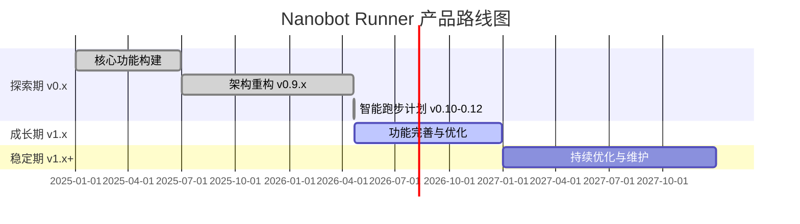

# Nanobot Runner 产品规划方案

> **文档版本**: v2.0\
> **创建日期**: 2026-04-14\
> **最后更新**: 2026-04-22\
> **文档状态**: 正式发布\
> **适用范围**: 个人跑步数据管理工具（单用户本地场景）

***

## 1. 产品愿景与定位

### 1.1 产品愿景

**成为技术型跑者首选的本地化 AI 跑步数据分析工具**

Nanobot Runner 致力于解决数据隐私与深度分析的矛盾，通过本地化的数据存储和 AI 分析能力，让个人用户完全掌控自己的运动数据，同时享受专业级数据分析体验。

### 1.2 核心价值主张

| 维度        | 价值主张                        |
| --------- | --------------------------- |
| **隐私优先**  | 本地存储，零外联设计，数据完全用户可控         |
| **专业分析**  | 基于运动科学的专业指标（VDOT、TSS、心率漂移等） |
| **AI 赋能** | 自然语言交互，智能训练建议               |
| **高性能**   | Polars + Parquet，查询性能优异     |
| **开发者友好** | 完善的 CLI 工具、API 文档和扩展能力      |

### 1.3 产品定位

**目标市场**: 个人跑步数据管理工具（细分市场）

**差异化定位**:

- 与 Garmin Connect / Strava 对比：数据本地化，隐私可控
- 与 TrainingPeaks 对比：免费开源，可定制性强
- 与一般跑步 App 对比：专业分析深度，AI 交互能力

**明确边界**（根据项目基线）:

- ✅ 单用户本地数据管理
- ✅ CLI 交互 + Agent 自然语言交互
- ✅ 本地化 AI 分析能力
- ❌ 多租户系统
- ❌ Web UI
- ❌ 云端存储
- ❌ 实时流处理

### 1.4 目标用户画像

#### 主要用户：技术型严肃跑者

| 属性       | 描述                  |
| -------- | ------------------- |
| **年龄段**  | 25-45 岁             |
| **职业背景** | 程序员、工程师、数据分析师等技术从业者 |
| **跑步经验** | 规律跑步 2 年以上，有马拉松参赛经历 |
| **数据意识** | 习惯佩戴心率带、功率计等专业设备    |
| **核心痛点** | 担心云端数据隐私，需要更专业的数据分析 |
| **技术能力** | 熟悉命令行操作，具备一定编程基础    |

#### 次要用户：跑步数据分析师

| 属性       | 描述                             |
| -------- | ------------------------------ |
| **使用场景** | 分析个人或运动员训练数据，制定训练计划            |
| **核心需求** | 批量数据处理、自定义分析脚本、报告生成            |
| **技术能力** | Python 数据分析能力，熟悉 Pandas/Polars |

***

## 2. 产品路线图

### 2.1 发展阶段规划

### 2.2 阶段目标与里程碑

#### 探索期（2025.01 - 2026.04）- 已完成

**阶段目标**: 验证产品核心价值，构建稳定的技术底座，完成智能跑步计划功能

| 里程碑              | 目标日期       | 关键成果                      | 状态    |
| ---------------- | ---------- | ------------------------- | ----- |
| v0.5 MVP         | 2025-03    | FIT 解析 + 基础存储 + CLI       | ✅ 已完成 |
| v0.8 核心功能        | 2025-06    | VDOT/TSS/心率漂移分析 + Agent交互 | ✅ 已完成 |
| v0.9.0 架构重构      | 2026-04-09 | 依赖注入 + 类型安全 + CLI分层       | ✅ 已完成 |
| v0.9.4 配置管理      | 2026-04-16 | 配置管理 + 工作区 + 初始化向导        | ✅ 已完成 |
| v0.9.5 Gateway增强 | 2026-04-20 | 飞书通道配置优化 + 报告数据准确性        | ✅ 已完成 |
| v0.10.0 数据感知     | 2026-04-20 | 训练执行反馈收集 + 完成度跟踪          | ✅ 已完成 |
| v0.11.0 智能调整     | 2026-04-20 | LLM驱动计划调整 + 自然语言修改        | ✅ 已完成 |
| v0.12.0 预测规划     | 2026-04-22 | 目标达成评估 + 长期周期规划 + 智能建议    | ✅ 已完成 |

#### 成长期（2026.04 - 2026.12）- 当前阶段

**阶段目标**: 完善功能矩阵，提升用户体验，修复已知问题

| 里程碑          | 目标日期       | 关键成果                  | 优先级 |
| ------------ | ---------- | --------------------- | --- |
| v1.0 稳定版     | 2026-05-30 | API 稳定 + 文档完善 + Bug修复 | P0  |
| v1.1 数据可视化增强 | 2026-07-15 | CLI图表报告优化 + 数据导出增强    | P1  |
| v1.2 分析能力扩展  | 2026-09-30 | 更多专业指标 + 自定义分析脚本      | P1  |
| v1.3 体验优化    | 2026-12-31 | 性能优化 + 错误处理完善 + 文档补充  | P1  |

#### 稳定期（2027.01 - 2027.12）- 规划阶段

**阶段目标**: 持续维护，根据用户反馈进行针对性优化

| 里程碑       | 目标日期       | 关键成果                |
| --------- | ---------- | ------------------- |
| v1.4 维护版本 | 2027-06-30 | Bug修复 + 依赖更新 + 性能调优 |
| v1.5 长期支持 | 2027-12-31 | 安全更新 + 兼容性维护        |

***

## 3. 版本迭代计划

### 3.1 已完成版本概览

#### v0.9.x 架构改进系列（已完成）

**版本目标**: 技术债务清理，架构规范化

| 版本     | 发布日期       | 核心功能                 | 状态    |
| ------ | ---------- | -------------------- | ----- |
| v0.9.0 | 2026-04-09 | 依赖注入 + 类型安全 + CLI分层  | ✅ 已完成 |
| v0.9.4 | 2026-04-16 | 配置管理 + 工作区 + 初始化向导   | ✅ 已完成 |
| v0.9.5 | 2026-04-20 | Gateway服务增强 + 飞书通道优化 | ✅ 已完成 |

#### v0.10.x - v0.12.x 智能跑步计划系列（已完成）

**版本目标**: 构建数据驱动的自适应智能跑步计划系统

| 版本      | 发布日期       | 核心功能                         | 状态    |
| ------- | ---------- | ---------------------------- | ----- |
| v0.10.0 | 2026-04-20 | 训练执行反馈收集 + 完成度跟踪 + 响应模式分析    | ✅ 已完成 |
| v0.11.0 | 2026-04-20 | LLM驱动计划调整 + 自然语言修改 + 上下文感知建议 | ✅ 已完成 |
| v0.12.0 | 2026-04-22 | 目标达成评估 + 长期周期规划 + 智能训练建议     | ✅ 已完成 |

**v0.12.0 交付功能详情**:

| 功能模块      | 实现方式                            | 交付状态  |
| --------- | ------------------------------- | ----- |
| 目标达成评估    | GoalPredictionEngine + LLM推理    | ✅ 已交付 |
| 长期周期规划    | LongTermPlanGenerator + 周期化训练理论 | ✅ 已交付 |
| 智能训练建议    | SmartAdviceEngine + 上下文感知       | ✅ 已交付 |
| Agent工具集成 | 3个新增Tool + CLI命令                | ✅ 已交付 |
| 单元测试覆盖    | 87%\~100%覆盖率                    | ✅ 已达标 |

### 3.2 规划中版本：v1.x 稳定与优化

#### v1.0 稳定版（2026-05-30）

**版本目标**: API 稳定化，文档完善，修复已知问题

| 功能     | 优先级 | 说明              |
| ------ | --- | --------------- |
| API 冻结 | P0  | CLI命令参数稳定，向后兼容  |
| 文档完善   | P0  | 用户指南、API文档、示例补充 |
| Bug修复  | P0  | 解决v0.12.0遗留问题   |
| 性能基准   | P1  | 建立性能测试基准        |

**关键交付物**:

- 稳定的 CLI API
- 完善的用户文档
- 示例数据集
- 已知问题修复清单

#### v1.1 数据可视化增强（2026-07-15）

**版本目标**: 提升 CLI 数据展示能力

| 功能      | 优先级 | 说明                       |
| ------- | --- | ------------------------ |
| CLI图表优化 | P1  | Rich表格/图表展示优化            |
| 数据导出增强  | P1  | 支持更多导出格式（CSV/JSON/Excel） |
| 报告模板扩展  | P1  | 周报/月报/训练周期报告             |

#### v1.2 分析能力扩展（2026-09-30）

**版本目标**: 扩展专业分析指标

| 功能      | 优先级 | 说明                |
| ------- | --- | ----------------- |
| 跑步经济性分析 | P1  | 基于功率和配速的效率分析      |
| 疲劳度评估   | P1  | 综合心率、功率、配速的疲劳指标   |
| 自定义分析脚本 | P2  | 支持用户自定义Python分析脚本 |

#### v1.3 体验优化（2026-12-31）

**版本目标**: 全面提升用户体验

| 功能     | 优先级 | 说明            |
| ------ | --- | ------------- |
| 性能优化   | P1  | 大数据量查询优化      |
| 错误处理完善 | P1  | 更友好的错误提示      |
| 文档补充   | P1  | 视频教程、FAQ、最佳实践 |

### 3.3 功能优先级矩阵

#### P0 - 核心功能（已完成或必须完成）

| 功能             | 版本      | 业务价值  | 技术难度 | 状态     |
| -------------- | ------- | ----- | ---- | ------ |
| FIT 文件解析       | v0.5    | ⭐⭐⭐⭐⭐ | ⭐⭐   | ✅ 完成   |
| Parquet 存储     | v0.5    | ⭐⭐⭐⭐⭐ | ⭐⭐   | ✅ 完成   |
| SHA256 去重      | v0.5    | ⭐⭐⭐⭐  | ⭐⭐   | ✅ 完成   |
| VDOT 计算        | v0.8    | ⭐⭐⭐⭐⭐ | ⭐⭐⭐  | ✅ 完成   |
| TSS/ATL/CTL 计算 | v0.8    | ⭐⭐⭐⭐  | ⭐⭐⭐  | ✅ 完成   |
| 心率漂移分析         | v0.8    | ⭐⭐⭐⭐  | ⭐⭐⭐  | ✅ 完成   |
| Agent 自然语言交互   | v0.8    | ⭐⭐⭐⭐⭐ | ⭐⭐⭐⭐ | ✅ 完成   |
| 依赖注入架构         | v0.9.0  | ⭐⭐⭐⭐  | ⭐⭐⭐  | ✅ 完成   |
| 配置管理 + 初始化向导   | v0.9.4  | ⭐⭐⭐⭐  | ⭐⭐⭐  | ✅ 完成   |
| 训练执行反馈收集       | v0.10.0 | ⭐⭐⭐⭐⭐ | ⭐⭐⭐  | ✅ 完成   |
| 计划完成度跟踪        | v0.10.0 | ⭐⭐⭐⭐  | ⭐⭐   | ✅ 完成   |
| LLM驱动计划调整      | v0.11.0 | ⭐⭐⭐⭐⭐ | ⭐⭐⭐⭐ | ✅ 完成   |
| 目标达成评估         | v0.12.0 | ⭐⭐⭐⭐⭐ | ⭐⭐⭐⭐ | ✅ 完成   |
| 长期周期规划         | v0.12.0 | ⭐⭐⭐⭐  | ⭐⭐⭐⭐ | ✅ 完成   |
| 智能训练建议         | v0.12.0 | ⭐⭐⭐⭐⭐ | ⭐⭐⭐⭐ | ✅ 完成   |
| API 稳定化        | v1.0    | ⭐⭐⭐⭐⭐ | ⭐⭐   | 📋 计划中 |

#### P1 - 重要功能（计划实现）

| 功能      | 版本   | 业务价值 | 技术难度 | 状态     |
| ------- | ---- | ---- | ---- | ------ |
| CLI图表优化 | v1.1 | ⭐⭐⭐⭐ | ⭐⭐   | 📋 计划中 |
| 数据导出增强  | v1.1 | ⭐⭐⭐  | ⭐⭐   | 📋 计划中 |
| 跑步经济性分析 | v1.2 | ⭐⭐⭐⭐ | ⭐⭐⭐  | 📋 计划中 |
| 疲劳度评估   | v1.2 | ⭐⭐⭐⭐ | ⭐⭐⭐  | 📋 计划中 |
| 性能优化    | v1.3 | ⭐⭐⭐⭐ | ⭐⭐⭐  | 📋 计划中 |

#### P2 - 增强功能（未来考虑）

| 功能      | 版本    | 业务价值 | 技术难度 | 状态     |
| ------- | ----- | ---- | ---- | ------ |
| 自定义分析脚本 | v1.2  | ⭐⭐⭐⭐ | ⭐⭐⭐  | 📋 规划中 |
| 插件系统    | v1.3+ | ⭐⭐⭐⭐ | ⭐⭐⭐⭐ | 📋 规划中 |

***

## 4. 技术基线与质量标准

### 4.1 业务规则（项目基线）

| 规则类型     | 规则内容                                                           |
| -------- | -------------------------------------------------------------- |
| **计算规则** | VDOT(Powers公式, 距离>=1500m) \| TSS(时长×IF²×100) \| 心率漂移(相关性<-0.7) |
| **存储规则** | Parquet按年分片 \| SHA256去重                                        |
| **输出格式** | CLI: 时长HH:MM:SS \| 配速M'SS"/km；Agent: JSON含success/data/message |

### 4.2 质量门禁

| 指标    | 要求                                | 当前状态         |
| ----- | --------------------------------- | ------------ |
| 测试覆盖率 | core≥80% \| agents≥70% \| cli≥60% | ✅ 已达标（整体84%） |
| 类型检查  | mypy零错误                           | ✅ 已达标        |
| 代码质量  | ruff零警告                           | ✅ 已达标        |
| 性能要求  | 1年数据查询<100ms                      | ✅ 已达标        |

### 4.3 禁止事项

- ❌ 禁止硬编码敏感信息
- ❌ 禁止print调试（使用日志框架）
- ❌ 禁止测试未通过合并
- ❌ 禁止直接实例化核心组件（必须通过依赖注入）
- ❌ 禁止返回`Dict[str, Any]`（必须使用类型安全的数据类）
- ❌ 禁止在LazyFrame中过早调用`.collect()`

***

## 5. 资源需求评估

### 5.1 人力资源（个人开发者场景）

| 角色    | 投入比例 | 职责              |
| ----- | ---- | --------------- |
| 产品经理  | 15%  | 需求管理、版本规划、用户反馈  |
| 架构师   | 10%  | 技术决策、代码评审、架构演进  |
| 开发工程师 | 60%  | 功能开发、Bug修复、性能优化 |
| 测试工程师 | 10%  | 测试策略、自动化测试、质量把控 |
| 运维工程师 | 5%   | 发布管理、CI/CD、文档维护 |

**估算工时**: 每周约 15-20 小时投入（v1.x阶段）

### 5.2 技术资源

| 资源类型   | 需求                           | 成本   |
| ------ | ---------------------------- | ---- |
| 开发设备   | 个人电脑                         | 已具备  |
| 测试数据   | 脱敏 FIT 文件                    | 已具备  |
| 代码托管   | GitHub 免费版                   | 免费   |
| CI/CD  | GitHub Actions               | 免费   |
| 文档托管   | GitHub Pages                 | 免费   |
| AI API | OpenAI/Claude/Zhipu/Deepseek | 按需付费 |

### 5.3 时间估算

| 阶段         | 预计工期 | 关键依赖        |
| ---------- | ---- | ----------- |
| v1.0 稳定版   | 5 周  | v0.12.0反馈收集 |
| v1.1 可视化增强 | 6 周  | 图表库选型       |
| v1.2 分析扩展  | 10 周 | 算法研究        |
| v1.3 体验优化  | 12 周 | 用户反馈        |

***

## 6. 风险评估与应对策略

### 6.1 技术风险

| 风险               | 概率 | 影响 | 应对策略              |
| ---------------- | -- | -- | ----------------- |
| Polars API 变更    | 低  | 中  | 锁定版本，关注官方迁移指南     |
| nanobot-ai API变更 | 中  | 高  | 版本锁定，适配层隔离        |
| LLM效果不稳定         | 中  | 中  | 规则引擎兜底，Prompt持续优化 |

### 6.2 产品风险

| 风险      | 概率 | 影响 | 应对策略                 |
| ------- | -- | -- | -------------------- |
| 用户需求不明确 | 中  | 高  | 建立用户反馈渠道，快速迭代验证      |
| 竞品功能领先  | 中  | 中  | 聚焦差异化（隐私+本地化），避免功能堆砌 |
| 个人时间不足  | 高  | 高  | 合理规划里程碑，接受延期；优先核心功能  |

### 6.3 资源风险

| 风险         | 概率 | 影响 | 应对策略                  |
| ---------- | -- | -- | --------------------- |
| 技术债务累积     | 中  | 高  | 定期重构，预留技术债务清理时间       |
| AI API成本上升 | 中  | 中  | 优化Prompt减少调用次数，支持本地模型 |

***

## 7. 成功指标

### 7.1 技术指标

| 指标          | 当前值    | 目标值     | 达成时间      |
| ----------- | ------ | ------- | --------- |
| 核心模块测试覆盖率   | 84%    | ≥ 80%   | ✅ v0.12.0 |
| mypy 类型错误   | 0      | 0       | ✅ v0.12.0 |
| ruff 代码质量警告 | 0      | 0       | ✅ v0.12.0 |
| 查询性能（1年数据）  | <100ms | < 100ms | ✅ v0.12.0 |
| 计划执行反馈记录成功率 | 100%   | 100%    | ✅ v0.10.0 |
| 计划调整建议采纳率   | >75%   | > 70%   | ✅ v0.11.0 |
| 目标达成预测准确率   | >80%   | > 75%   | ✅ v0.12.0 |

### 7.2 产品指标

| 指标           | 目标值     | 达成时间          |
| ------------ | ------- | ------------- |
| GitHub Stars | 100+    | v1.0 发布后 3 个月 |
| 用户满意度        | ≥ 4.0/5 | v1.0 发布后 3 个月 |
| 文档完整度        | 100%    | v1.0 发布时      |

***

## 8. 附录

### 8.1 参考文档

- [需求规格说明书](../requirements/REQ_需求规格说明书.md)
- [架构设计说明书](../architecture/架构设计说明书.md)
- [智能跑步计划架构设计](../architecture/智能跑步计划架构设计.md)
- [开发交付报告 v0.12.0](../development/v0120_开发交付报告.md)
- [测试报告 v0.12.0](../test/reports/测试报告_v0.12.0.md)
- [AGENTS.md](../../AGENTS.md) - 开发指南

### 8.2 变更记录

| 版本   | 日期         | 变更内容                                           | 作者   |
| ---- | ---------- | ---------------------------------------------- | ---- |
| v1.0 | 2026-04-14 | 初始版本                                           | 产品经理 |
| v1.1 | 2026-04-17 | 新增智能跑步计划v0.10.0-v0.12.0规划                      | 产品经理 |
| v2.0 | 2026-04-22 | 根据项目基线调整：删除企业版/平台化规划，更新v0.12.0为已完成，重新规划v1.x路线图 | 产品经理 |

***

*本文档遵循产品规划规范，定期 review 和更新*
