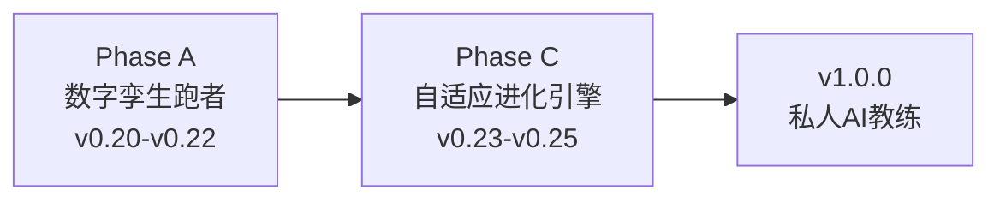

# Nanobot Runner 产品规划方案 v9.5

> **文档版本**: v9.5
> **最后更新**: 2026-05-14
> **当前基线**: v0.21.0
> **规划周期**: v0.22.0 → v0.25.0 → v1.0.0
> **对齐文档**:
> - [需求规格说明书 v8.0](../requirements/REQ_需求规格说明书.md)
> - [架构设计说明书 v7.0.0](../architecture/架构设计说明书.md)
> - [产品演进设计 v1.0](../requirements/2026-05-07-product-evolution-design.md)
> - [多智能体架构分析](../architecture/multiagents.md)

---

## 1. 产品愿景

### 1.1 核心价值主张

让拥有2年+跑步数据的资深跑者，拥有一个**真正懂自己、能预测未来、会自我进化**的 AI 训练科学家。

**三阶段愿景叙事**：

| 阶段 | 口号 | 核心能力 | 对应版本 |
|------|------|----------|----------|
| **记录跑步** | "你的跑步数据管家" | FIT解析、数据存储、基础统计 | v0.5-v0.19 |
| **预测跑步** | "你的数字孪生跑者" | ML增强预测、What-If推演、风险预警 | v0.20-v0.22 |
| **进化跑步** | "越用越懂你的私人教练" | 决策追踪、自适应学习、个性化进化 | v0.23-v0.25 |

### 1.2 战略维度

| 战略维度 | 用户价值 |
|----------|----------|
| **隐私可控** | 跑者的数据只属于自己，不上传、不泄露 |
| **专业可信** | 基于运动科学的分析，AI建议可追溯、可验证 |
| **预测未来** | 基于2年+数据，预测伤病风险、VDOT趋势、比赛成绩 |
| **自我进化** | 系统从每次训练和反馈中学习，越来越懂个人特点 |

### 1.3 目标用户分层

| 用户层级 | 数据量 | 可用预测能力 | 产品体验 |
|----------|--------|--------------|----------|
| **初级** | <6个月 | 基础统计、简单趋势 | 感受"数据被记录" |
| **中级** | 6-18个月 | 线性回归预测、Jack Daniels公式 | 感受"数据在说话" |
| **高级** | **18个月+** | **ML增强预测（v0.20.0）** | 感受"数据懂自己" |
| **资深** | **24个月+** | **数字孪生推演 + 自适应进化（v0.21+）** | 感受"系统在进化" |

---

## 2. 主题化路线图

### 2.1 总体路线图

| 版本 | 主题 | 核心交付 | 状态 |
|------|------|----------|------|
| v0.18 | 数据可视化与导出 | 终端图表、多格式导出 | 已完成 |
| v0.19 | 身体信号分析 | HRV、疲劳度、恢复评估 | 已发布 |
| v0.20 | 预测智能模块 | ML-VDOT/成绩/伤病预测 + 模型管理 | 已发布 |
| v0.21 | 数字孪生引擎 | 跑者状态向量、What-If推演、计划对比 | 已发布 |
| **v0.22** | **质量收口版本** | **UAT验证、缺陷修复、需求洞察、反馈改进、质量兜底、发布准备** | **当前规划** |
| **v0.23** | **决策-结果追踪** | **决策日志、结果回填、预测校准** | **规划中** |
| **v0.24** | **个性化学习** | **训练响应性分析、个人化模型进化** | **规划中** |
| **v0.25** | **自适应进化引擎** | **提示策略优化、自动进化触发** | **规划中** |
| v1.0.0 | 私人 AI 教练 | API稳定、性能优化、完整文档 | 待规划 |

### 2.2 阶段划分



**Phase A：数字孪生跑者（v0.20-v0.22）**
- 核心目标：构建可推演的生理模型，实现"预测未来"
- 关键产出：预测引擎、数字孪生引擎、质量收口验证
- 成功标准：VDOT预测误差<5%、全马预测误差<8分钟、伤病3周预警召回率>75%、v0.22质量验收100%通过

**Phase C：自适应进化引擎（v0.23-v0.25）**
- 核心目标：让系统从用户反馈和训练结果中学习优化
- 关键产出：决策追踪系统、个性化学习、自适应进化
- 成功标准：预测误差持续下降、用户主观满意度提升、系统推荐采纳率>60%

**Phase C 基线测量计划**（在 v0.22 发布后、v0.23 启动前执行）：

| 指标 | 基线值（v0.22 结束时） | 测量方法 | 量化下降/提升标准 |
|------|------------------------|----------|-------------------|
| VDOT 预测误差（MAE） | 以 `PredictionRecord` 中最近 30 天记录计算 | 自动统计：`abs(预测VDOT - 实际VDOT) / 实际VDOT`，取均值 | 每版本下降 ≥ 5%（相对值），连续 2 个版本 |
| 全马成绩预测误差 | 以 `PredictionRecord` 中最近 3 次比赛预测计算 | 自动统计：`abs(预测成绩 - 实际成绩)`，取均值 | 每版本下降 ≥ 5%（相对值），连续 2 个版本 |
| 用户主观满意度 | 初始基线：无（v0.22 首次收集） | `RecordFeedbackTool` 收集，每次 Agent 交互后弹出 1-5 星评分 + 可选文本反馈 | 平均分 ≥ 4.0/5.0，且每版本提升 ≥ 0.1 分 |
| 系统推荐采纳率 | 初始基线：无（v0.22 首次收集） | 追踪 `DecisionLog` 中 `recommendation_accepted` 字段（用户明确接受/拒绝/忽略） | 采纳率 > 60%，且每版本提升 ≥ 3%（绝对值） |
| 伤病预警召回率 | 以 v0.20-v0.22 实际伤病事件回溯计算 | 对比 `InjuryRiskPrediction` 与 `InjuryReport` 时间戳，计算 3 周内预警命中比例 | 维持 ≥ 75%，误报率每版本下降 ≥ 3% |

> **测量执行责任人**：产品经理发起基线测量，开发工程师提供 `PredictionRecord` / `DecisionLog` 数据导出脚本，测试工程师验证数据准确性。
> **基线报告输出**：v0.23 启动前必须输出《Phase C 基线测量报告》，作为 v0.23-v0.25 迭代效果对比的依据。

---

## 3. Phase A：数字孪生跑者（v0.20-v0.22）

### 3.1 v0.20：预测智能模块

#### 3.1.1 版本定位

**版本主题**: ML增强预测 —— 为数据充足用户提供更精准的未来洞察
**核心目标**: 基于18个月+历史数据，用ML模型替代简单线性回归，显著提升预测准确度
**目标用户**: 数据充足的高级用户（18个月+跑步数据，500+条记录）

**与原有预测能力的关系**：

| 预测类型 | v0.19及之前（基础预测） | v0.20.0冷启动（参数化基线） | v0.20.0升级（ML增强预测，数据充足时） |
|----------|------------------------|---------------------------|---------------------------------------|
| VDOT趋势 | 简单线性回归 | **Banister IR参数化模型**（数据200-400条） | **ML时间序列模型**（sklearn + 时序特征工程，数据400+条） |
| 比赛成绩 | Jack Daniels公式+固定系数 | — | **个人化修正模型**（基于历史比赛数据训练） |
| 伤病风险 | 多因子阈值判断 | **规则基线+逻辑回归**（数据100-300条） | **ML分类模型**（LR+GBDT集成，集成身体信号时序特征） |

#### 3.1.2 版本成功标准

| 维度 | 标准 | 测量方式 | 对比基础预测 |
|------|------|----------|--------------|
| 功能完成 | P0功能100%实现 | 功能清单核对 | - |
| VDOT预测准确 | ML预测误差<5% | 与实际VDOT对比 | 基础预测8%→ML预测5% |
| 比赛预测准确 | 全马预测误差<8分钟 | 与实测成绩对比 | 基础预测15分钟→ML预测8分钟 |
| 伤病预警有效 | 3周前置预警召回率>75% | 与实际伤病关联 | 基础预测1周→ML预测3周 |
| 模型可用率 | 数据充足用户ML预测使用率>80% | 使用统计 | - |
| 性能要求 | ML预测响应<5秒 | 性能测试 | - |

---

### 3.2 v0.21：数字孪生引擎

#### 3.2.1 版本定位

**版本主题**: 数字孪生引擎 —— 构建可推演的跑者生理模型
**核心目标**: 实现 What-If 推演能力，让用户"在训练前看到训练后的自己"
**目标用户**: 有明确训练目标的高级用户（计划参加比赛的跑者）

#### 3.2.2 核心功能摘要

> **设计决策**：基于用户澄清，v0.21 采用最小可用设计（MVP Twin），仅实现核心推演能力。

- **跑者状态向量**：5维度（体能/负荷/身体信号/风险/训练模式）统一状态封装
- **What-If 推演引擎**：`simulate_plan()`、`compare_plans()`，仅支持系统计划输入
- **新增CLI命令**：`twin status/simulate/compare`
- **技术依赖**：依赖 v0.20 预测引擎 + v0.19 身体信号引擎，新增 `src/core/twin/` 模块

---

### 3.3 v0.22：质量收口版本（Hardening Release）

#### 3.3.1 版本定位

**版本主题**: 质量收口 + 需求洞察 —— 全量功能稳定性验证 + 用户痛点挖掘与反馈驱动改进
**核心目标**: 
1. 通过系统化UAT验证v0.5-v0.21全版本功能稳定性，修复缺陷
2. 基于UAT反馈挖掘用户使用痛点，形成新用户需求
3. 建立反馈驱动的产品改进机制
**目标用户**: 所有使用产品的用户（覆盖全版本功能使用者）

#### 3.3.2 版本背景与决策

**决策变更说明**：
原规划的「多视角决策验证（Coach/Doctor双视角）」版本因以下原因调整为「质量收口版本」：
1. v0.20-v0.21引入了ML预测、数字孪生等复杂功能，需要充分验证稳定性
2. 多视角决策验证依赖nanobot Subagent能力，当前底座支持尚不成熟
3. 优先保障现有功能的质量基线，为后续v0.23-v0.25自适应进化奠定稳定基础

#### 3.3.3 核心交付内容

| 阶段 | 任务 | 交付物 | 验收标准 |
|------|------|--------|----------|
| **UAT验证** | 执行用户验收测试（覆盖v0.5-v0.21） | UAT测试报告 | P0用例100%通过，P1用例≥90%通过 |
| **需求洞察** | 收集UAT反馈，挖掘用户痛点 | 用户需求清单 | 识别≥3个有效痛点，形成≥2个新需求 |
| **缺陷收敛** | 缺陷修复与验证 | 缺陷修复报告 | 致命/严重缺陷清零，一般缺陷修复率≥80% |
| **反馈改进** | 基于用户反馈优化功能 | 改进实现报告 | 高优先级改进项完成率≥80% |
| **质量兜底** | 补充测试与边界验证 | 质量兜底报告 | 核心流程覆盖率≥95%，边界场景无遗漏 |
| **发布准备** | 发布检查与文档完善 | 发布就绪检查单 | 所有发布前置条件满足 |
| **发布后观察** | 线上监控与问题响应 | 发布后观察报告 | 发布后7天内无P0级问题 |
| **过程改进** | 复盘与流程优化 | 过程改进建议 | 识别并记录可改进点 |

#### 3.3.4 UAT验证流程

**测试范围**：覆盖v0.5-v0.21全版本功能

| 版本 | 模块 | 测试重点 | 用例来源 |
|------|------|----------|----------|
| v0.5+ | 数据导入 | 单文件/批量导入、去重、异常处理 | UAT-001 ~ UAT-005 |
| v0.5+ | 数据查询 | 统计信息、年份/日期范围过滤 | UAT-006 ~ UAT-008 |
| v0.5+ | 数据分析 | VDOT趋势、训练负荷、心率漂移 | UAT-009 ~ UAT-014 |
| v0.5+ | 训练计划 | 智能建议、目标评估、长期规划 | UAT-015 ~ UAT-017 |
| v0.5+ | 报告生成 | 周报、月报、报告导出 | UAT-018 ~ UAT-020 |
| v0.5+ | 系统管理 | 配置验证、数据迁移 | UAT-021 ~ UAT-022 |
| v0.5+ | Agent交互 | 自然语言对话、数据查询 | UAT-023 ~ UAT-024 |
| v0.5+ | 性能测试 | 批量导入性能、查询性能 | UAT-025 ~ UAT-027 |
| v0.17 | MCP工具管理 | 工具列表、启用/禁用、配置导入 | UAT-028 ~ UAT-034 |
| v0.17 | Agent工具集成 | 天气/地图/健康数据工具 | UAT-035 ~ UAT-037 |
| v0.17 | Gateway服务 | 飞书通道、命令路由、消息推送 | UAT-038 ~ UAT-042 |
| v0.17 | Cron训练提醒 | 状态查看、启用/禁用、手动触发 | UAT-043 ~ UAT-047 |
| v0.17 | AI透明化 | 决策追踪、状态看板、训练洞察 | UAT-048 ~ UAT-051 |
| v0.17 | 偏好管理 | 查看/设置/重置偏好、反馈统计 | UAT-052 ~ UAT-055 |
| v0.17 | 技能管理 | 技能列表、启用/禁用、导入 | UAT-056 ~ UAT-060 |
| v0.18 | 数据可视化 | VDOT趋势图、训练负荷曲线、心率区间 | UAT-061 ~ UAT-065 |
| v0.18 | 数据导出 | CSV/JSON/Parquet导出、日期筛选 | UAT-066 ~ UAT-070 |
| v0.19 | 身体信号 | HRV分析、疲劳度评估、恢复评估 | 新增v0.19专项用例 |
| v0.20 | 预测模块 | ML-VDOT预测、比赛成绩预测、伤病预警 | 新增v0.20专项用例 |
| v0.21 | 数字孪生 | 状态向量构建、What-If推演、计划对比 | 新增v0.21专项用例 |

**AI辅助UAT执行**：
1. AI Agent根据[用户验收测试指南](../test/用户验收测试指南.md)辅助执行测试
2. 自动汇总测试结果，按严重程度分级（致命/严重/一般/轻微）
3. 生成UAT反馈报告，包含缺陷清单、修复建议、风险评估
4. **同步收集用户体验反馈，识别使用痛点**

#### 3.3.5 缺陷收敛策略

**缺陷分级与修复优先级**：

| 级别 | 定义 | 修复时限 | 验收标准 |
|------|------|----------|----------|
| **致命** | 导致系统崩溃、数据丢失、核心功能不可用 | 24小时内 | 100%修复 |
| **严重** | 主要功能异常、性能严重下降 | 3天内 | 100%修复 |
| **一般** | 次要功能异常、用户体验问题 | 1周内 | 修复率≥80% |
| **轻微** | 界面瑕疵、文案问题 | 可选修复 | 记录待后续优化 |

**缺陷收敛流程**：
```
UAT发现缺陷 → 分级定级 → 分配修复 → 修复验证 → 回归测试 → 缺陷关闭
     ↑                                                              |
     └──────────────── 未通过验证，重新打开 ────────────────────────┘
```

#### 3.3.6 质量兜底措施

| 兜底项 | 措施 | 完成标准 |
|--------|------|----------|
| 边界测试 | 补充异常输入、边界值测试 | 核心接口边界覆盖100% |
| 性能基线 | 建立性能基准，防止退化 | 关键操作响应时间符合v0.20基线 |
| 数据一致性 | 验证数据计算准确性 | VDOT/TSS/CTL等核心指标计算正确 |
| 兼容性 | 验证历史数据兼容性 | v0.19及之前数据正常迁移 |
| 文档完整性 | 检查用户文档、API文档 | 所有功能有对应文档说明 |

#### 3.3.7 需求洞察与反馈驱动改进

**用户痛点挖掘流程**：

```
UAT执行过程中
    ↓
收集用户反馈（体验问题、功能建议、使用障碍）
    ↓
痛点分析分类（功能性/易用性/性能/文档）
    ↓
痛点优先级排序（影响范围 × 解决价值）
    ↓
形成新用户需求 → 纳入需求池
    ↓
高优先级改进项在v0.22内实现
```

**反馈收集渠道**：

| 渠道 | 收集方式 | 负责人 |
|------|----------|--------|
| UAT测试反馈 | AI Agent辅助收集测试过程中的体验问题 | 测试工程师 |
| 用户主动反馈 | 内置反馈命令、Issue模板 | 产品经理 |
| 使用数据分析 | 分析高频操作路径、异常退出点 | 开发工程师 |
| 社区讨论 | 监控用户社区、讨论区 | 产品经理 |

**反馈处理流程**：

| 阶段 | 动作 | 输出 |
|------|------|------|
| 收集 | 多渠道汇总用户反馈 | 原始反馈列表 |
| 分类 | 按功能模块、问题类型分类 | 分类反馈清单 |
| 分析 | 识别共性痛点、根因分析 | 痛点分析报告 |
| 转化 | 将痛点转化为具体需求 | 新需求条目 |
| 优先级 | 评估业务价值、实现成本 | 优先级排序列表 |
| 实现 | 高优先级改进项开发 | 改进实现报告 |
| 验证 | 用户验证改进效果 | 验证确认 |

#### 3.3.8 发布准备与观察

**发布就绪检查单**：

| 检查项 | 状态 | 负责人 |
|--------|------|--------|
| UAT测试通过 | ⬜ | 测试工程师 |
| 需求洞察报告完成 | ⬜ | 产品经理 |
| 高优先级改进项完成 | ⬜ | 开发工程师 |
| 致命/严重缺陷清零 | ⬜ | 开发工程师 |
| 性能测试通过 | ⬜ | 测试工程师 |
| 文档更新完成 | ⬜ | 产品经理 |
| 发布说明编写完成 | ⬜ | 产品经理 |
| 回滚方案准备就绪 | ⬜ | 运维工程师 |

**发布后观察期（7天）**：
- 监控用户反馈渠道（Issue、社区）
- 跟踪关键指标（错误率、性能指标）
- 持续收集用户反馈，补充需求洞察
- 快速响应并修复发现的问题

#### 3.3.9 版本成功标准

| 维度 | 标准 | 测量方式 |
|------|------|----------|
| UAT通过率 | P0用例100%，P1用例≥90% | UAT测试报告 |
| 缺陷修复率 | 致命/严重100%，一般≥80% | 缺陷跟踪报告 |
| 需求洞察 | 识别≥3个有效痛点，形成≥2个新需求 | 需求洞察报告 |
| 反馈改进 | 高优先级改进项完成率≥80% | 改进实现报告 |
| 发布质量 | 发布后7天内无P0级问题 | 发布后观察报告 |
| 用户满意度 | 无重大质量投诉 | 用户反馈汇总 |
| 文档完整度 | 100%功能有对应文档 | 文档检查清单 |

---

## 4. Phase C：自适应进化引擎（v0.23-v0.25）

### 4.1 总体目标

让系统从用户的训练结果和反馈中持续学习，实现"越用越懂你"的个性化进化。

```
进化引擎 ──依赖──→ 孪生引擎 ──依赖──→ 预测引擎 ──依赖──→ 确定性计算层
    │                  │                  │
    │                  │                  └──→ ModelStore
    │                  └──→ RunnerStateVector
    └──→ DecisionLog
```

### 4.2 v0.23：决策-结果追踪系统

#### 4.2.1 核心功能

**1. 决策日志（DecisionLog）**

记录每次 AI 决策的完整上下文：

| 字段 | 说明 |
|------|------|
| 决策ID | 唯一标识 |
| 时间戳 | 决策发生时间 |
| 跑者状态 | 决策时的 RunnerStateVector |
| 决策类型 | 训练计划生成、预测查询、风险评估 |
| 工具调用链 | 本次决策调用的所有工具及参数 |
| 预测快照 | 决策时做出的预测（如有） |
| 执行状态 | 是否被执行、执行忠实度 |
| 实际结果 | 训练后的实际 outcome |
| 用户反馈 | 用户主观评价 |
| 预测误差 | 预测vs实际的偏差 |

**2. 追踪接入方式**

通过现有 Hook 系统无侵入接入，不修改核心 Agent 逻辑。

**3. 结果回填机制**

| 功能 | 说明 |
|------|------|
| `check_plan_execution()` | 对比计划训练 vs 实际训练，计算执行忠实度 |
| `check_prediction_accuracy()` | 对比预测 VDOT vs 实际 VDOT |
| `generate_feedback_prompt()` | 主动询问用户反馈 |

**4. 存储设计**

```
~/.nanobot-runner/
├── decisions/                     # 新增：决策日志
│   └── 2026-05/
│       ├── 2026-05-07_decisions.parquet
│       └── ...
├── outcomes/                      # 新增：结果记录
│   └── 2026-05/
```

### 4.3 v0.24：个性化学习

#### 4.3.1 核心功能

**1. 训练响应性分析**

分析用户对不同训练刺激的反应，回答："间歇训练对我提升大，还是阈值训练对我提升大？"

**2. 个人化模型进化**

基于决策日志和结果记录，持续校准预测模型：

| 校准维度 | 方法 |
|----------|------|
| VDOT预测校准 | 基于预测误差调整模型偏差 |
| 伤病风险校准 | 基于实际伤病事件调整风险阈值 |
| 训练响应校准 | 基于实际训练效果调整 Banister IR 参数 |

**3. 最佳训练窗口预测**

基于 CTL-VDOT 关联分析，输出："未来2-4周是突破VDOT的最佳窗口"

### 4.4 v0.25：自适应进化引擎

#### 4.4.1 核心功能

**1. 提示策略优化**

基于用户反馈和决策效果，自动优化 LLM 提示词：

| 优化维度 | 说明 |
|----------|------|
| 个性化语气 | 根据用户偏好调整建议风格（严厉/温和/数据驱动） |
| 信息密度 | 根据用户反馈调整输出详细程度 |
| 推荐策略 | 根据采纳率调整推荐激进程度 |

**2. 进化触发器**

| 触发条件 | 动作 |
|----------|------|
| 预测误差连续3次>阈值 | 自动重训练对应模型 |
| 用户连续2次拒绝推荐 | 调整推荐策略 |
| 新数据积累≥50条 | 触发增量学习 |
| 月度复盘 | 生成个性化进化报告 |

---

## 5. v1.0.0 展望

**主题**："你的私人 AI 教练"

- API冻结、向后兼容承诺
- 性能优化：大数据量查询优化
- 稳定性：异常处理完善、数据完整性校验
- 完整文档、快速入门指南、用户手册
- 社区就绪：Issue模板、贡献指南

---

## 6. 风险与缓解

### 6.1 Phase A 风险

| 风险 | 等级 | 影响 | 缓解措施 |
|------|------|------|----------|
| 数据门槛过高 | 高 | 大部分用户无法使用ML功能 | 明确分层，基础预测继续可用；提供数据积累指导 |
| 模型过拟合 | 高 | 个人数据少导致模型过拟合 | 使用正则化；设置最小数据门槛；冷启动用参数化基线 |
| 训练耗时 | 中 | 本地ML训练可能耗时较长 | 异步训练；增量更新而非全量重训；提供训练进度提示 |
| 模型解释性差 | 中 | 用户不理解ML预测逻辑 | 使用scikit-learn + SHAP提供特征重要性展示 |
| 技术选型冲突 | 中 | 演进设计推荐LightGBM与架构师选型冲突 | **产品规划统一采用scikit-learn，删除LightGBM引用** |

### 6.2 Phase C 风险

| 风险 | 等级 | 影响 | 缓解措施 |
|------|------|------|----------|
| 决策日志数据膨胀 | 中 | 长期运行后日志过大 | Parquet按月分片；自动归档旧数据 |
| 用户反馈稀疏 | 高 | 缺乏足够反馈驱动进化 | 设计轻量反馈机制（ thumbs up/down ）；主动询问 |
| 进化方向偏差 | 中 | 系统学习到的偏好与真实目标偏离 | 保留人工覆盖机制；定期review进化报告 |

### 6.3 v0.22 质量收口风险

| 风险 | 等级 | 影响 | 缓解措施 |
|------|------|------|----------|
| UAT覆盖不全 | 高 | 遗漏历史版本功能缺陷 | 严格按UAT-001~070矩阵执行，AI辅助全量覆盖 |
| 缺陷修复引入新问题 | 中 | 修复过程中产生回归缺陷 | 每个修复必须伴随回归测试，关键路径自动化 |
| 用户反馈收集不足 | 中 | 痛点识别不全面 | 多渠道收集（UAT+主动反馈+数据分析+社区） |
| 改进项范围蔓延 | 中 | 反馈改进超出版本边界 | 明确v0.22改进项准入标准，高优先级才纳入 |
| 发布后问题响应延迟 | 低 | 发布后7天内问题处理不及时 | 建立发布后值班机制，P0问题2小时内响应 |

---

## 7. 附录

### 7.1 变更记录

| 版本 | 日期 | 变更内容 |
|------|------|----------|
| v9.5 | 2026-05-14 | **v0.22版本增强**：基于用户反馈完善v0.22规划——①扩展版本主题为「质量收口 + 需求洞察」；②明确UAT验证范围为v0.5-v0.21全版本功能；③新增需求洞察与反馈驱动改进章节，包含痛点挖掘流程、反馈收集渠道、反馈处理流程；④核心交付内容新增「需求洞察」和「反馈改进」阶段；⑤版本成功标准新增需求洞察和反馈改进指标；⑥更新发布就绪检查单包含需求洞察相关检查项；⑦修正路线图v0.22核心交付描述；⑧删除6.2节过时风险项，更新6.3节为v0.22质量收口风险；⑨术语表更新为Hardening Release定义 |
| v9.2 | 2026-05-11 | **v0.21.0需求澄清修订**：基于用户澄清决策调整v0.21规划——①明确采用MVP Twin最小可用设计；②计划输入仅支持系统计划（plan_id引用），移除手动构建；③`find_optimal_plan()`延后到v0.22+评估；④补充RunnerStateVector缓存策略（TTL=24h）；⑤补充CLI命令设计（twin status/simulate/compare） |
| v9.1 | 2026-05-08 | **评审修订**：修复三文档综合评审报告（v0.20.0）中产品规划相关意见——①补充v0.22 Go/No-Go决策机制（决策时间点/量化标准/责任人）；②补充Phase C基线测量计划（5项指标基线值/测量方法/量化下降标准）；③补充v0.20新增CLI命令的--help输出预期（6个命令的Description+Arguments+Examples） |
| v9.0 | 2026-05-08 | **重大升级**：吸收产品演进设计，扩展路线图至v0.25；明确Phase A/C两阶段；统一技术选型为scikit-learn；标注v0.22为条件性版本；补充多智能体架构约束分析 |
| v8.1 | 2026-05-07 | 修复CRITICAL-1：技术选型统一为scikit-learn+scipy+shap |
| v8.0 | 2026-05-07 | 重新定义v0.20.0为ML增强预测升级 |
| v7.0 | 2026-05-07 | v0.19.0已发布，新增v0.20.0详细规划 |

### 7.2 术语表

| 术语 | 定义 |
|------|------|
| **ML增强预测** | 使用机器学习模型替代简单统计模型的预测能力 |
| **数据充足** | 满足ML模型训练最低数据量要求的状态 |
| **基础预测** | v0.19及之前版本的简单线性回归/公式预测 |
| **个人化模型** | 基于用户个人数据训练的专属预测模型 |
| **冷启动** | 新用户或数据不足时使用参数化基线模型的阶段 |
| **增量学习** | 用新数据更新现有模型而非重新训练 |
| **数字孪生** | 基于数据构建的、可推演的跑者生理模型 |
| **What-If推演** | 模拟不同训练方案下的状态演变 |
| **Hardening Release** | 质量收口版本，聚焦UAT验证、缺陷修复、需求洞察与反馈改进的专项版本 |

### 7.3 参考文档索引

| 文档 | 路径 | 内容 |
|------|------|------|
| 需求规格说明书 | `docs/requirements/REQ_需求规格说明书.md` | v0.20-v0.25详细需求、验收标准、数据模型 |
| 架构设计说明书 | `docs/architecture/架构设计说明书.md` | 系统架构、模块设计、技术选型 |
| 产品演进设计 | `docs/requirements/2026-05-07-product-evolution-design.md` | v0.20-v0.25演进路径、数字孪生、自适应进化 |
| 多智能体架构分析 | `docs/architecture/multiagents.md` | nanobot/LangGraph/AutoGen对比、架构约束 |
| v0.21数字孪生设计规格 | `docs/superpowers/specs/2026-05-10-v0.21-digital-twin-design.md` | v0.21详细设计、数据模型、接口定义 |
