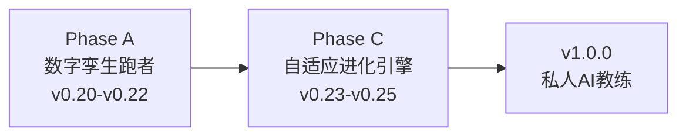

# Nanobot Runner 产品规划方案 v9.1

> **文档版本**: v9.1
> **最后更新**: 2026-05-08
> **当前基线**: v0.19.0
> **规划周期**: v0.20.0 → v0.25.0 → v1.0.0
> **对齐文档**:
> - [需求规格说明书 v8.0](../requirements/REQ_需求规格说明书.md)
> - [架构设计说明书 v7.0.0](../architecture/架构设计说明书.md)
> - [产品演进设计 v1.0](../requirements/2026-05-07-product-evolution-design.md)
> - [多智能体架构分析](../architecture/multiagents.md)

---

## 1. 产品愿景

### 1.1 核心价值主张

让拥有2年+跑步数据的资深跑者，拥有一个**真正懂自己、能预测未来、会自我进化**的 AI 训练科学家。

**三阶段愿景叙事**：

| 阶段 | 口号 | 核心能力 | 对应版本 |
|------|------|----------|----------|
| **记录跑步** | "你的跑步数据管家" | FIT解析、数据存储、基础统计 | v0.5-v0.19 |
| **预测跑步** | "你的数字孪生跑者" | ML增强预测、What-If推演、风险预警 | v0.20-v0.22 |
| **进化跑步** | "越用越懂你的私人教练" | 决策追踪、自适应学习、个性化进化 | v0.23-v0.25 |

### 1.2 战略维度

| 战略维度 | 用户价值 |
|----------|----------|
| **隐私可控** | 跑者的数据只属于自己，不上传、不泄露 |
| **专业可信** | 基于运动科学的分析，AI建议可追溯、可验证 |
| **预测未来** | 基于2年+数据，预测伤病风险、VDOT趋势、比赛成绩 |
| **自我进化** | 系统从每次训练和反馈中学习，越来越懂个人特点 |

### 1.3 目标用户分层

| 用户层级 | 数据量 | 可用预测能力 | 产品体验 |
|----------|--------|--------------|----------|
| **初级** | <6个月 | 基础统计、简单趋势 | 感受"数据被记录" |
| **中级** | 6-18个月 | 线性回归预测、Jack Daniels公式 | 感受"数据在说话" |
| **高级** | **18个月+** | **ML增强预测（v0.20.0）** | 感受"数据懂自己" |
| **资深** | **24个月+** | **数字孪生推演 + 自适应进化（v0.21+）** | 感受"系统在进化" |

---

## 2. 主题化路线图

### 2.1 总体路线图

| 版本 | 主题 | 核心交付 | 状态 |
|------|------|----------|------|
| v0.18 | 数据可视化与导出 | 终端图表、多格式导出 | 已完成 |
| v0.19 | 身体信号分析 | HRV、疲劳度、恢复评估 | 已发布 |
| **v0.20** | **预测智能模块** | **ML-VDOT/成绩/伤病预测 + 模型管理** | **当前规划** |
| **v0.21** | **数字孪生引擎** | **跑者状态向量、What-If推演、计划对比** | **规划中** |
| **v0.22** | **多视角决策验证** | **Coach/Doctor双视角审查（条件性）** | **规划中** |
| **v0.23** | **决策-结果追踪** | **决策日志、结果回填、预测校准** | **规划中** |
| **v0.24** | **个性化学习** | **训练响应性分析、个人化模型进化** | **规划中** |
| **v0.25** | **自适应进化引擎** | **提示策略优化、自动进化触发** | **规划中** |
| v1.0.0 | 私人 AI 教练 | API稳定、性能优化、完整文档 | 待规划 |

### 2.2 阶段划分



**Phase A：数字孪生跑者（v0.20-v0.22）**
- 核心目标：构建可推演的生理模型，实现"预测未来"
- 关键产出：预测引擎、数字孪生引擎、条件性多视角验证
- 成功标准：VDOT预测误差<5%、全马预测误差<8分钟、伤病3周预警召回率>75%

**Phase C：自适应进化引擎（v0.23-v0.25）**
- 核心目标：让系统从用户反馈和训练结果中学习优化
- 关键产出：决策追踪系统、个性化学习、自适应进化
- 成功标准：预测误差持续下降、用户主观满意度提升、系统推荐采纳率>60%

**Phase C 基线测量计划**（在 v0.22 发布后、v0.23 启动前执行）：

| 指标 | 基线值（v0.22 结束时） | 测量方法 | 量化下降/提升标准 |
|------|------------------------|----------|-------------------|
| VDOT 预测误差（MAE） | 以 `PredictionRecord` 中最近 30 天记录计算 | 自动统计：`abs(预测VDOT - 实际VDOT) / 实际VDOT`，取均值 | 每版本下降 ≥ 5%（相对值），连续 2 个版本 |
| 全马成绩预测误差 | 以 `PredictionRecord` 中最近 3 次比赛预测计算 | 自动统计：`abs(预测成绩 - 实际成绩)`，取均值 | 每版本下降 ≥ 5%（相对值），连续 2 个版本 |
| 用户主观满意度 | 初始基线：无（v0.22 首次收集） | `RecordFeedbackTool` 收集，每次 Agent 交互后弹出 1-5 星评分 + 可选文本反馈 | 平均分 ≥ 4.0/5.0，且每版本提升 ≥ 0.1 分 |
| 系统推荐采纳率 | 初始基线：无（v0.22 首次收集） | 追踪 `DecisionLog` 中 `recommendation_accepted` 字段（用户明确接受/拒绝/忽略） | 采纳率 > 60%，且每版本提升 ≥ 3%（绝对值） |
| 伤病预警召回率 | 以 v0.20-v0.22 实际伤病事件回溯计算 | 对比 `InjuryRiskPrediction` 与 `InjuryReport` 时间戳，计算 3 周内预警命中比例 | 维持 ≥ 75%，误报率每版本下降 ≥ 3% |

> **测量执行责任人**：产品经理发起基线测量，开发工程师提供 `PredictionRecord` / `DecisionLog` 数据导出脚本，测试工程师验证数据准确性。
> **基线报告输出**：v0.23 启动前必须输出《Phase C 基线测量报告》，作为 v0.23-v0.25 迭代效果对比的依据。

---

## 3. Phase A：数字孪生跑者（v0.20-v0.22）

### 3.1 v0.20：预测智能模块

#### 3.1.1 版本定位

**版本主题**: ML增强预测 —— 为数据充足用户提供更精准的未来洞察
**核心目标**: 基于18个月+历史数据，用ML模型替代简单线性回归，显著提升预测准确度
**目标用户**: 数据充足的高级用户（18个月+跑步数据，500+条记录）

**与原有预测能力的关系**：

| 预测类型 | v0.19及之前（基础预测） | v0.20.0冷启动（参数化基线） | v0.20.0升级（ML增强预测，数据充足时） |
|----------|------------------------|---------------------------|---------------------------------------|
| VDOT趋势 | 简单线性回归 | **Banister IR参数化模型**（数据200-400条） | **ML时间序列模型**（sklearn + 时序特征工程，数据400+条） |
| 比赛成绩 | Jack Daniels公式+固定系数 | — | **个人化修正模型**（基于历史比赛数据训练） |
| 伤病风险 | 多因子阈值判断 | **规则基线+逻辑回归**（数据100-300条） | **ML分类模型**（LR+GBDT集成，集成身体信号时序特征） |

#### 3.1.2 数据门槛与分层策略

**核心设计原则**: 数据充足时自动启用ML增强预测，数据中等时使用参数化基线，数据不足时降级为基础预测，绝不阻塞用户使用。

**数据充足标准**：

| 预测类型 | L1 ML增强最低要求 | L2 参数化基线最低要求 | L3 基础预测 | 理想数据量 |
|----------|-------------------|---------------------|-------------|-----------|
| VDOT趋势ML预测 | 18月+，400+条 | 200-400条 | <200条 | 24月+，600+条 |
| 比赛成绩个人化 | 3次+实测比赛 | — | <3次 | 5次+不同距离 |
| 伤病风险ML预测 | 18月+，300+条 | 100-300条 | <100条 | 24月+，心率>80% |

**降级策略**：

```
用户请求预测
    ↓
检查数据充足性
    ↓
数据充足 ──→ 使用ML增强预测（v0.20.0）→ 输出标注: 🧠 ML增强预测
    ↓ 数据中等
使用参数化基线预测（Banister IR / 逻辑回归）→ 输出标注: 📊 参数化模型预测
    ↓ 数据不足
使用基础预测（v0.19及之前）→ 提示用户："当前数据量XX，建议积累更多数据后可解锁ML增强预测"
```

#### 3.1.3 P0 功能：ML增强核心

**1. ML-VDOT趋势预测引擎**

| 功能项 | 说明 | ML优势 | 数据需求 |
|--------|------|--------|----------|
| 时序特征工程 | 提取训练周期、季节性、身体适应特征 | 识别非线性趋势和周期性 | 18个月+数据 |
| 多因子ML模型 | 整合周跑量、强度分布、身体信号预测VDOT | 捕捉复杂交互效应 | v0.19身体信号数据 |
| 预测置信区间 | 基于模型不确定性估计 | 更科学的区间估计 | 模型内置 |
| 特征重要性 | 展示影响VDOT的关键特征 | 可解释ML洞察 | SHAP值分析 |

**验收标准**：
- 数据充足时(18个月+/400+条)，ML预测VDOT误差<5%（对比基础预测8%）
- 数据不足时自动降级为基础预测，输出明确提示
- 时序特征工程提取≥5类特征
- 预测置信区间输出(下限, 上限)和置信度(0-1)
- 特征重要性通过SHAP值分析，输出Top3关键特征

**2. 个人化比赛成绩预测**

| 功能项 | 说明 | ML优势 | 数据需求 |
|--------|------|--------|----------|
| 个人修正系数学习 | 基于历史比赛数据学习个人特点 | 识别"耐力型"还是"速度型" | 3次+实测比赛 |
| 距离-成绩曲线拟合 | 个人化的Riegel曲线拟合 | 更准确的距离间成绩推算 | 多距离比赛数据 |
| 赛前状态修正 | 结合赛前身体信号调整预测 | 考虑赛前疲劳/恢复状态 | v0.19身体信号 |
| 预测历史验证 | 对比历史预测与实际成绩 | 持续校准模型 | 历史预测记录 |

**验收标准**：
- 数据充足时(3次+实测比赛)，全马预测误差<8分钟（对比基础预测15分钟）
- 输出个人类型标签（耐力型/速度型/均衡型）及修正系数
- Riegel曲线拟合输出个人化指数（标准值1.06，个人偏差范围0.95-1.15）
- 赛前状态修正集成BodySignalEngine

**3. ML伤病风险预测**

| 功能项 | 说明 | ML优势 | 数据需求 |
|--------|------|--------|----------|
| 时序特征提取 | 提取ATL/CTL/TSB/静息心率时序变化特征 | 识别渐进式过度训练模式 | 18个月+负荷数据 |
| 多模态融合 | 融合训练负荷+身体信号+HRV | 综合判断，减少误报 | v0.19全量数据 |
| 风险时间线预测 | 预测未来3周伤病概率变化 | 前置预警窗口 | 时序预测模型 |
| 可解释风险因子 | 展示触发风险的关键因子 | 指导针对性调整 | 特征归因分析 |

**验收标准**：
- 数据充足时(18个月+/心率完整度>80%)，3周前置预警召回率>75%（对比基础预测1周）
- 时序特征提取≥4类特征
- 风险时间线输出未来7/14/21天伤病概率曲线
- 可解释风险因子输出Top3触发因子及其贡献度

#### 3.1.4 P1 功能：模型管理与数据评估

**4. 模型管理与校准**

| 功能项 | 说明 | 用户价值 |
|--------|------|----------|
| 个人模型训练 | 基于用户数据训练专属预测模型 | 模型越用越准 |
| 模型版本管理 | 保存历史模型版本，支持回滚 | 避免模型退化 |
| 预测准确性追踪 | 记录预测vs实际，持续评估模型 | 量化模型表现 |
| 增量学习 | 新数据自动更新模型 | 持续优化 |

**5. 数据充足度评估**

| 功能项 | 说明 | 用户价值 |
|--------|------|----------|
| 数据质量报告 | 评估当前数据是否满足ML预测要求 | 明确差距 |
| 数据积累建议 | 建议还需要积累哪些数据 | 有目标地记录 |
| 解锁进度提示 | 显示距离解锁ML预测还有多远 | 激励持续记录 |

#### 3.1.5 技术选型决策

| 决策项 | 选型 | 说明 |
|--------|------|------|
| **ML框架** | scikit-learn（GradientBoosting + 时序特征工程） | 轻量、可解释、本地运行无GPU依赖，与架构师选型对齐 |
| **科学计算** | scipy | 统计检验、曲线拟合（Riegel）、置信区间估计 |
| **模型解释** | shap | 特征重要性归因、模型决策可追溯 |
| **模型存储** | ~/.nanobot-runner/models/ | 与项目数据目录一致，按模型类型+版本组织 |
| **冷启动策略** | 参数化基线模型（Banister IR） | 数据不足时使用确定性模型，数据充足后切换ML |

> **注意**：产品演进设计文档中提及的 LightGBM 方案因与架构师统一选型冲突，**不采用**。全量使用 scikit-learn 生态确保技术栈一致性。

#### 3.1.6 用户交互设计

**新增CLI命令**：

```bash
# 数据充足度检查
uv run nanobotrun predict status

# VDOT趋势预测（自动选择ML/基础模型）
uv run nanobotrun predict vdot --days 30
# 输出标注: "🧠 ML增强预测 | 模型置信度: 高/中/低"

# 比赛成绩预测（个人化模型）
uv run nanobotrun predict race --distance marathon --date 2024-12-01
# 输出标注: "🎯 基于N次历史比赛数据个人化校准"

# 伤病风险预测（ML模型）
uv run nanobotrun predict injury-risk --days 21
# 输出: 未来3周风险概率曲线

# 模型管理
uv run nanobotrun predict model status
uv run nanobotrun predict model train --type vdot
```

**CLI --help 输出预期**：

每个新增命令必须包含 Description + Arguments + Examples 三段式帮助信息，示例如下：

**`predict status --help`**

```
Usage: nanobotrun predict status [OPTIONS]

  检查当前数据是否满足ML预测要求，并展示预测能力解锁进度。

  根据数据量自动判断可用预测层级：
  - ML增强预测（数据充足）
  - 参数化基线预测（数据中等）
  - 基础预测（数据不足）

Arguments:
  --json    以JSON格式输出数据充足度报告

Examples:
  $ nanobotrun predict status
  $ nanobotrun predict status --json
```

**`predict vdot --help`**

```
Usage: nanobotrun predict vdot [OPTIONS]

  预测未来指定天数的VDOT趋势。

  自动选择最优预测模型：数据充足时使用ML增强预测，
  数据中等时使用Banister IR参数化模型，数据不足时使用基础线性回归。

Arguments:
  --days INTEGER RANGE  预测未来天数 [default: 30; x>=7, x<=90]
  --json                以JSON格式输出预测结果

Examples:
  $ nanobotrun predict vdot --days 30
  $ nanobotrun predict vdot --days 14 --json
```

**`predict race --help`**

```
Usage: nanobotrun predict race [OPTIONS]

  基于历史比赛数据和个人化模型，预测指定距离的比赛成绩。

  需要至少3次实测比赛数据方可启用个人化修正。
  输出包含个人类型标签（耐力型/速度型/均衡型）及配速策略建议。

Arguments:
  --distance TEXT  比赛距离（如 marathon, half, 10k, 5k）[required]
  --date TEXT      比赛日期（YYYY-MM-DD），用于赛前状态修正 [default: 今天+30天]
  --json           以JSON格式输出预测结果

Examples:
  $ nanobotrun predict race --distance marathon --date 2024-12-01
  $ nanobotrun predict race --distance 10k --json
```

**`predict injury-risk --help`**

```
Usage: nanobotrun predict injury-risk [OPTIONS]

  预测未来指定天数的伤病风险概率变化。

  融合训练负荷、身体信号和HRV时序特征，输出未来7/14/21天
  的风险概率曲线及Top3触发因子。

Arguments:
  --days INTEGER RANGE  预测未来天数 [default: 21; x>=7, x<=28]
  --json                以JSON格式输出预测结果

Examples:
  $ nanobotrun predict injury-risk --days 21
  $ nanobotrun predict injury-risk --days 14 --json
```

**`predict model status --help`**

```
Usage: nanobotrun predict model status [OPTIONS]

  查看当前预测模型的状态信息。

  展示已训练模型列表、模型版本、训练时间、准确率指标
  及数据充足度评估结果。

Arguments:
  --json    以JSON格式输出模型状态

Examples:
  $ nanobotrun predict model status
  $ nanobotrun predict model status --json
```

**`predict model train --help`**

```
Usage: nanobotrun predict model train [OPTIONS]

  手动触发指定类型的预测模型训练。

  训练过程异步执行，可通过 model status 查看进度。
  数据不足时会提示需要积累的数据量。

Arguments:
  --type TEXT  模型类型（vdot / race / injury-risk）[required]
  --force      强制重新训练，忽略已有模型缓存

Examples:
  $ nanobotrun predict model train --type vdot
  $ nanobotrun predict model train --type race --force
```

**新增Agent工具**：

| 工具名 | 功能 | 输入 | 输出 |
|--------|------|------|------|
| `predict_vdot_trend` | VDOT趋势预测 | days | VDOTPrediction |
| `predict_race_result` | 比赛成绩预测 | distance, date | RacePredictionResult |
| `predict_injury_risk` | 伤病风险预测 | days | InjuryRiskPrediction |
| `check_prediction_status` | 数据充足度评估 | 无 | PredictionStatusReport |
| `manage_prediction_model` | 模型管理 | action, model_type | ModelManagementResult |
| `report_injury` ⭐v7.0 | 伤病报告提交 | injury_type, severity, date | InjuryReportResult |
| `predict_training_response` ⭐v7.0 | 训练响应预测 | session_type, duration_min, intensity | TrainingResponse |

#### 3.1.7 版本成功标准

| 维度 | 标准 | 测量方式 | 对比基础预测 |
|------|------|----------|--------------|
| 功能完成 | P0功能100%实现 | 功能清单核对 | - |
| VDOT预测准确 | ML预测误差<5% | 与实际VDOT对比 | 基础预测8%→ML预测5% |
| 比赛预测准确 | 全马预测误差<8分钟 | 与实测成绩对比 | 基础预测15分钟→ML预测8分钟 |
| 伤病预警有效 | 3周前置预警召回率>75% | 与实际伤病关联 | 基础预测1周→ML预测3周 |
| 模型可用率 | 数据充足用户ML预测使用率>80% | 使用统计 | - |
| 性能要求 | ML预测响应<5秒 | 性能测试 | - |

---

### 3.2 v0.21：数字孪生引擎

#### 3.2.1 版本定位

**版本主题**: 数字孪生引擎 —— 构建可推演的跑者生理模型
**核心目标**: 实现 What-If 推演能力，让用户"在训练前看到训练后的自己"
**目标用户**: 有明确训练目标的高级用户（计划参加比赛的跑者）

#### 3.2.2 核心功能（MVP Twin 精简版）

> **设计决策**：基于用户澄清，v0.21 采用最小可用设计（MVP Twin），仅实现核心推演能力，手动计划输入和自动寻优延后评估。

**1. 跑者状态向量（RunnerStateVector）**

统一封装跑者当前全部生理状态，计算结果缓存到 `~/.nanobot-runner/twin/state_vector.json`，TTL=24h：

| 维度 | 指标 |
|------|------|
| 体能维度 | VDOT、VDOT趋势、VO2max估算 |
| 负荷维度 | CTL、ATL、TSB、ACWR |
| 身体信号维度 | 疲劳评分、恢复状态、静息心率、HRV-RMSSD |
| 风险维度 | 7天伤病风险、28天伤病风险、过度训练风险 |
| 训练模式维度 | 周跑量、强度分布、长距离频率 |

**2. What-If 推演引擎**

| 功能 | 说明 | 用户价值 |
|------|------|----------|
| `simulate_plan()` | 模拟执行系统训练计划后的状态演变 | "如果我按这个计划练4周，VDOT能到多少？" |
| `compare_plans()` | 比较多个系统训练计划的预测效果 | "计划A和计划B哪个更适合我？" |
| ~~`find_optimal_plan()`~~ | ~~搜索满足约束的最优训练计划~~ | **延后到 v0.22+ 评估** |

**计划输入限制（v0.21）**：
- ✅ 仅支持系统生成的计划（通过 `plan_id` 引用 PlanManager 中的计划）
- ❌ 不支持用户手动构建计划（延后评估）

**推演输出示例**：

```
计划对比（4周推演）：
┌──────────┬──────────┬──────────┬──────────┐
│ 指标      │ 计划A     │ 计划B     │ 计划C     │
├──────────┼──────────┼──────────┼──────────┤
│ VDOT预测  │ 42.3→43.1│ 42.3→42.8│ 42.3→43.3│
│ 伤病风险  │ 12%      │ 8%       │ 18%      │
│ 过度训练  │ 低       │ 极低      │ 中       │
│ 恢复余量  │ 充足     │ 充足      │ 紧张     │
│ 综合推荐  │ ⭐⭐⭐   │ ⭐⭐     │ ⭐       │
└──────────┴──────────┴──────────┴──────────┘
```

**3. 新增Agent工具**

| 工具名 | 功能 | 输入 | 输出 |
|--------|------|------|------|
| `get_runner_state` | 获取当前跑者状态向量 | use_cache: bool | RunnerStateVector |
| `simulate_plan` | 模拟训练计划效果 | plan_id: str, weeks: int | SimulationResult |
| `compare_plans` | 对比多个计划 | plan_ids: list[str] | PlanComparison |

**4. 新增CLI命令**

```bash
# 查看当前跑者状态向量
nanobotrun twin status [--json]

# 模拟训练计划效果（仅支持系统计划）
nanobotrun twin simulate --plan-id <plan_id> --weeks <N> [--json]

# 对比多个训练计划（仅支持系统计划）
nanobotrun twin compare --plan-ids <id1,id2,id3> [--json]
```

#### 3.2.3 技术依赖

- 依赖 v0.20 的预测引擎（PerformancePredictor、InjuryRiskPredictor）
- 依赖 v0.19 的身体信号引擎（BodySignalEngine）
- 新增模块：`src/core/twin/`（数字孪生引擎）
- 存储扩展：`~/.nanobot-runner/twin/`（状态向量缓存）

---

### 3.3 v0.22：多视角决策验证（条件性版本）

#### 3.3.1 版本定位

**版本主题**: 多视角决策验证 —— 从教练和医生两个角度交叉验证训练计划
**核心目标**: 减少单视角决策偏差，提升训练计划的安全性和有效性
**目标用户**: 使用数字孪生引擎制定训练计划的高级用户

#### 3.3.2 架构约束分析

根据 [多智能体架构分析](../architecture/multiagents.md)，nanobot 的多智能体能力存在以下限制：

| 能力 | nanobot支持情况 | 对v0.22的影响 |
|------|----------------|---------------|
| Agent间协作 | ❌ 不支持 | 无法真正实现Coach Agent与Doctor Agent协作 |
| 状态共享 | ❌ 不支持 | 两个视角无法共享中间推理状态 |
| 任务编排 | ❌ 不支持 | 无中央编排器分配任务 |
| 后台子代理 | ✅ 支持 | 仅支持独立后台任务，结果单向回传 |

#### 3.3.3 条件性交付策略

**触发条件**：nanobot-ai 的 SubagentManager 支持稳定的后台执行 + 结果回注

| 条件 | 方案 | 交付内容 |
|------|------|----------|
| **底座支持多Agent** | 实现 Coach Agent + Doctor Agent 双视角审查 | 真正的多视角交叉验证 |
| **底座不支持** | 单 Agent 内实现"角色切换" | LLM先以教练视角生成计划，再以医生视角审查，最后综合结论 |
| **角色切换效果不佳** | **跳过 v0.22**，直接进入 v0.23 | v0.23的决策追踪系统不依赖 v0.22 的多视角能力 |

**Go/No-Go 决策机制**：

| 维度 | 定义 |
|------|------|
| **决策时间点** | v0.21 功能开发完成、进入集成测试前（预计 v0.21 开发周期第 3 周） |
| **决策责任人** | 架构师（技术可行性裁决） + 产品经理（业务价值权衡） |
| **决策标准** | 需同时满足以下 3 项量化指标方可 Go： |

**量化决策标准**：

| 指标 | 阈值 | 验证方法 |
|------|------|----------|
| Subagent 后台任务成功率 | > 95% | 连续执行 20 次标准任务（模拟 Coach/Doctor 双视角分析），统计成功次数 |
| 结果回注延迟 | < 2 秒 | 从子代理任务完成到主代理收到结果的时间差，取 20 次平均值 |
| 内存稳定性 | 无内存泄漏 | 连续运行 1 小时（模拟 100 次任务调度），进程 RSS 增长 < 10% |

**决策流程**：

```
v0.21 开发周期第 3 周（集成测试前）
    ↓
【Go/No-Go 评审会】架构师 + 产品经理
    ↓
nanobot Subagent 是否满足全部 3 项量化标准？
    ↓ 是（Go）
实现 Coach Agent + Doctor Agent 双视角
    ↓ 否（No-Go）
验证单 Agent 角色切换方案效果
    ↓ 效果可接受
交付角色切换方案
    ↓ 效果不佳
跳过 v0.22，直接进入 v0.23
```

> **注**：若 v0.21 开发周期第 3 周未完成技术验证，决策点顺延至第 4 周（最迟不得晚于 v0.21 发布前 1 周）。若选择跳过 v0.22，需在 v0.21 发布说明中明确告知用户该版本的多视角验证能力将延后至 v0.23 以单 Agent 角色切换方式实现。

#### 3.3.4 双视角审查设计（如底座支持）

| 视角 | 关注点 | 审查输出 |
|------|--------|----------|
| **Coach Agent** | 训练效果最大化 | VDOT提升潜力、比赛 readiness、周期化安排合理性 |
| **Doctor Agent** | 健康风险最小化 | 伤病风险、过度训练信号、恢复充足性 |
| **仲裁者（LLM）** | 权衡双方论据 | 综合推荐、冲突点解释、调整建议 |

---

## 4. Phase C：自适应进化引擎（v0.23-v0.25）

### 4.1 总体目标

让系统从用户的训练结果和反馈中持续学习，实现"越用越懂你"的个性化进化。

```
进化引擎 ──依赖──→ 孪生引擎 ──依赖──→ 预测引擎 ──依赖──→ 确定性计算层
    │                  │                  │
    │                  │                  └──→ ModelStore
    │                  └──→ RunnerStateVector
    └──→ DecisionLog
```

### 4.2 v0.23：决策-结果追踪系统

#### 4.2.1 核心功能

**1. 决策日志（DecisionLog）**

记录每次 AI 决策的完整上下文：

| 字段 | 说明 |
|------|------|
| 决策ID | 唯一标识 |
| 时间戳 | 决策发生时间 |
| 跑者状态 | 决策时的 RunnerStateVector |
| 决策类型 | 训练计划生成、预测查询、风险评估 |
| 工具调用链 | 本次决策调用的所有工具及参数 |
| 预测快照 | 决策时做出的预测（如有） |
| 执行状态 | 是否被执行、执行忠实度 |
| 实际结果 | 训练后的实际 outcome |
| 用户反馈 | 用户主观评价 |
| 预测误差 | 预测vs实际的偏差 |

**2. 追踪接入方式**

通过现有 Hook 系统无侵入接入，不修改核心 Agent 逻辑。

**3. 结果回填机制**

| 功能 | 说明 |
|------|------|
| `check_plan_execution()` | 对比计划训练 vs 实际训练，计算执行忠实度 |
| `check_prediction_accuracy()` | 对比预测 VDOT vs 实际 VDOT |
| `generate_feedback_prompt()` | 主动询问用户反馈 |

**4. 存储设计**

```
~/.nanobot-runner/
├── decisions/                     # 新增：决策日志
│   └── 2026-05/
│       ├── 2026-05-07_decisions.parquet
│       └── ...
├── outcomes/                      # 新增：结果记录
│   └── 2026-05/
```

### 4.3 v0.24：个性化学习

#### 4.3.1 核心功能

**1. 训练响应性分析**

分析用户对不同训练刺激的反应，回答："间歇训练对我提升大，还是阈值训练对我提升大？"

**2. 个人化模型进化**

基于决策日志和结果记录，持续校准预测模型：

| 校准维度 | 方法 |
|----------|------|
| VDOT预测校准 | 基于预测误差调整模型偏差 |
| 伤病风险校准 | 基于实际伤病事件调整风险阈值 |
| 训练响应校准 | 基于实际训练效果调整 Banister IR 参数 |

**3. 最佳训练窗口预测**

基于 CTL-VDOT 关联分析，输出："未来2-4周是突破VDOT的最佳窗口"

### 4.4 v0.25：自适应进化引擎

#### 4.4.1 核心功能

**1. 提示策略优化**

基于用户反馈和决策效果，自动优化 LLM 提示词：

| 优化维度 | 说明 |
|----------|------|
| 个性化语气 | 根据用户偏好调整建议风格（严厉/温和/数据驱动） |
| 信息密度 | 根据用户反馈调整输出详细程度 |
| 推荐策略 | 根据采纳率调整推荐激进程度 |

**2. 进化触发器**

| 触发条件 | 动作 |
|----------|------|
| 预测误差连续3次>阈值 | 自动重训练对应模型 |
| 用户连续2次拒绝推荐 | 调整推荐策略 |
| 新数据积累≥50条 | 触发增量学习 |
| 月度复盘 | 生成个性化进化报告 |

---

## 5. v1.0.0 展望

**主题**："你的私人 AI 教练"

- API冻结、向后兼容承诺
- 性能优化：大数据量查询优化
- 稳定性：异常处理完善、数据完整性校验
- 完整文档、快速入门指南、用户手册
- 社区就绪：Issue模板、贡献指南

---

## 6. 风险与缓解

### 6.1 Phase A 风险

| 风险 | 等级 | 影响 | 缓解措施 |
|------|------|------|----------|
| 数据门槛过高 | 高 | 大部分用户无法使用ML功能 | 明确分层，基础预测继续可用；提供数据积累指导 |
| 模型过拟合 | 高 | 个人数据少导致模型过拟合 | 使用正则化；设置最小数据门槛；冷启动用参数化基线 |
| 训练耗时 | 中 | 本地ML训练可能耗时较长 | 异步训练；增量更新而非全量重训；提供训练进度提示 |
| 模型解释性差 | 中 | 用户不理解ML预测逻辑 | 使用scikit-learn + SHAP提供特征重要性展示 |
| 技术选型冲突 | 中 | 演进设计推荐LightGBM与架构师选型冲突 | **产品规划统一采用scikit-learn，删除LightGBM引用** |

### 6.2 Phase C 风险

| 风险 | 等级 | 影响 | 缓解措施 |
|------|------|------|----------|
| 决策日志数据膨胀 | 中 | 长期运行后日志过大 | Parquet按月分片；自动归档旧数据 |
| 用户反馈稀疏 | 高 | 缺乏足够反馈驱动进化 | 设计轻量反馈机制（ thumbs up/down ）；主动询问 |
| 进化方向偏差 | 中 | 系统学习到的偏好与真实目标偏离 | 保留人工覆盖机制；定期review进化报告 |
| v0.22条件性跳过 | 低 | 多视角验证能力缺失 | 单Agent角色切换作为降级方案；不影响v0.23+ |

### 6.3 多智能体架构约束应对

| 约束 | 影响版本 | 应对策略 |
|------|----------|----------|
| nanobot不支持Agent间协作 | v0.22 | 条件性版本；底座不支持时采用角色切换或跳过 |
| nanobot子代理无共享状态 | v0.22 | 不依赖共享状态的设计；各视角独立分析后由LLM综合 |
| nanobot子代理不能嵌套 | v0.22 | 仅使用单层子代理；避免复杂嵌套 |

---

## 7. 附录

### 7.1 变更记录

| 版本 | 日期 | 变更内容 |
|------|------|----------|
| v9.2 | 2026-05-11 | **v0.21.0需求澄清修订**：基于用户澄清决策调整v0.21规划——①明确采用MVP Twin最小可用设计；②计划输入仅支持系统计划（plan_id引用），移除手动构建；③`find_optimal_plan()`延后到v0.22+评估；④补充RunnerStateVector缓存策略（TTL=24h）；⑤补充CLI命令设计（twin status/simulate/compare） |
| v9.1 | 2026-05-08 | **评审修订**：修复三文档综合评审报告（v0.20.0）中产品规划相关意见——①补充v0.22 Go/No-Go决策机制（决策时间点/量化标准/责任人）；②补充Phase C基线测量计划（5项指标基线值/测量方法/量化下降标准）；③补充v0.20新增CLI命令的--help输出预期（6个命令的Description+Arguments+Examples） |
| v9.0 | 2026-05-08 | **重大升级**：吸收产品演进设计，扩展路线图至v0.25；明确Phase A/C两阶段；统一技术选型为scikit-learn；标注v0.22为条件性版本；补充多智能体架构约束分析 |
| v8.1 | 2026-05-07 | 修复CRITICAL-1：技术选型统一为scikit-learn+scipy+shap |
| v8.0 | 2026-05-07 | 重新定义v0.20.0为ML增强预测升级 |
| v7.0 | 2026-05-07 | v0.19.0已发布，新增v0.20.0详细规划 |

### 7.2 术语表

| 术语 | 定义 |
|------|------|
| **ML增强预测** | 使用机器学习模型替代简单统计模型的预测能力 |
| **数据充足** | 满足ML模型训练最低数据量要求的状态 |
| **基础预测** | v0.19及之前版本的简单线性回归/公式预测 |
| **个人化模型** | 基于用户个人数据训练的专属预测模型 |
| **冷启动** | 新用户或数据不足时使用参数化基线模型的阶段 |
| **增量学习** | 用新数据更新现有模型而非重新训练 |
| **数字孪生** | 基于数据构建的、可推演的跑者生理模型 |
| **What-If推演** | 模拟不同训练方案下的状态演变 |
| **条件性版本** | 依赖底座能力是否支持的版本，如不支持可跳过 |

### 7.3 参考文档索引

| 文档 | 路径 | 内容 |
|------|------|------|
| 需求规格说明书 | `docs/requirements/REQ_需求规格说明书.md` | v0.20-v0.25详细需求、验收标准、数据模型 |
| 架构设计说明书 | `docs/architecture/架构设计说明书.md` | 系统架构、模块设计、技术选型 |
| 产品演进设计 | `docs/requirements/2026-05-07-product-evolution-design.md` | v0.20-v0.25演进路径、数字孪生、自适应进化 |
| 多智能体架构分析 | `docs/architecture/multiagents.md` | nanobot/LangGraph/AutoGen对比、架构约束 |
| v0.21数字孪生设计规格 | `docs/superpowers/specs/2026-05-10-v0.21-digital-twin-design.md` | v0.21详细设计、数据模型、接口定义 |
