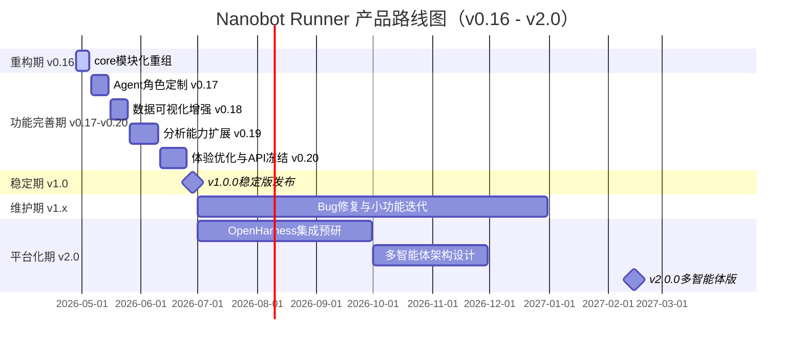

# Nanobot Runner 产品规划方案（v0.16.0 - v1.0.0 - v2.0.0）

> **文档版本**: v3.0  
> **创建日期**: 2026-04-28  
> **最后更新**: 2026-04-28  
> **文档状态**: 正式发布  
> **适用范围**: 个人跑步数据管理工具（单用户本地场景 → 多智能体扩展）

***

## 1. 规划背景与调整说明

### 1.1 当前基线（v0.15.0）

v0.15.0「透明洞察版」已完成交付，核心能力包括：

| 能力域 | 交付内容 | 状态 |
|--------|----------|------|
| AI决策透明化 | 决策解释、数据来源追溯、决策路径可视化 | ✅ 已交付 |
| 可观测性 | 链路追踪、日志记录、AI状态看板 | ✅ 已交付 |
| 训练洞察报告 | 训练模式分析、恢复趋势、AI建议效果评估 | ✅ 已交付 |
| Agent工具 | `explain_decision`、`trace_data`、`get_observability_status` | ✅ 已交付 |
| CLI命令 | `transparency show`、`transparency settings` | ✅ 已交付 |
| 测试质量 | 73个用例100%通过，核心模块覆盖率≥80% | ✅ 已达标 |

### 1.2 规划调整原则

基于项目发展方向和指导意见，本次规划做出以下关键调整：

| 调整项 | 原规划 | 新规划 | 理由 |
|--------|--------|--------|------|
| **v1.0.0定位** | 仅API稳定+文档完善+Bug修复 | **单Agent版本稳定版**，包含原v1.1-v1.3核心功能 | 1.0.0必须是功能完整、可独立使用的稳定版本 |
| **功能前置** | v1.1（可视化）、v1.2（分析扩展）、v1.3（体验优化）分阶段实施 | **全部前置到v1.0.0之前** | 避免稳定版功能残缺，提升首版用户价值 |
| **技术债务** | 未明确规划 | **v0.16.0独立版本**完成`src/core`模块化重组 | 还技术债，为后续多智能体奠定工程基础 |
| **多智能体** | 未规划 | **v2.0.0**引入HKUDS/OpenHarness，支持多智能体协作 | 明确第二阶段的工程化升级路径 |
| **单Agent定制** | 未明确 | **v0.17.0-v0.18.0**支持基于`templates`+`workshop`的角色定制 | 1.0.0的核心差异化能力 |

### 1.3 版本命名规则

```
v0.16.0  →  架构重构版（还技术债）
v0.17.0  →  Agent角色定制版
cv0.18.0  →  数据可视化增强版
v0.19.0  →  分析能力扩展版
v0.20.0  →  体验优化与API冻结版
v1.0.0   →  单Agent稳定版（里程碑）
v1.x     →  维护迭代（Bug修复、小功能增强）
v2.0.0   →  多智能体版（OpenHarness集成）
```

***

## 2. 产品愿景与定位（更新）

### 2.1 产品愿景

**成为技术型跑者首选的本地化 AI 跑步数据分析工具**

> v2.0.0愿景升级：**成为技术型跑者首选的本地化多智能体跑步数据管理与训练协作平台**

### 2.2 核心价值主张

| 维度 | v1.0.0价值主张 | v2.0.0价值主张 |
|------|----------------|----------------|
| **隐私优先** | 本地存储，零外联设计，数据完全用户可控 | 同左，多智能体间本地协作 |
| **专业分析** | 基于运动科学的专业指标（VDOT、TSS、心率漂移等） | 同左，多维度交叉分析 |
| **AI 赋能** | 自然语言交互，智能训练建议，**可定制角色** | **多智能体协作**，专业分工 |
| **高性能** | Polars + Parquet，查询性能优异 | 同左 |
| **开发者友好** | 完善的 CLI 工具、API 文档和扩展能力 | OpenHarness标准化接入 |

### 2.3 产品定位演进

```
阶段一（v0.5 - v0.15）: 个人跑步数据管理工具（验证核心能力）
阶段二（v1.0.0）     : 可定制角色的单Agent跑步教练（稳定可用）
阶段三（v2.0.0）     : 多智能体跑步训练协作平台（工程化落地）
```

**明确边界（v1.0.0）**:

- ✅ 单用户本地数据管理
- ✅ CLI 交互 + Agent 自然语言交互
- ✅ **基于模板和手工配置的角色定制**
- ✅ 本地化 AI 分析能力
- ❌ 多租户系统
- ❌ Web UI
- ❌ 云端存储

**明确边界（v2.0.0）**:

- ✅ 多智能体本地协作
- ✅ OpenHarness/HKUDS 工程化框架
- ❌ 云端多租户
- ❌ Web UI（仍保持CLI为主）

***

## 3. 产品路线图（2026.04 - 2027.12）

### 3.1 发展阶段规划



### 3.2 阶段目标与里程碑

#### 重构期（2026.04.28 - 2026.05.05）

**阶段目标**: 偿还技术债务，完成`src/core`模块化重组，提升工程可维护性

| 里程碑 | 目标日期 | 关键成果 | 优先级 |
|--------|----------|----------|--------|
| v0.16.0 架构重构版 | 2026-05-05 | `src/core`模块化重组完成，测试全量通过 | P0 |

#### 功能完善期（2026.05.06 - 2026.06.25）

**阶段目标**: 将原v1.1-v1.3功能全部前置完成，实现功能完整的单Agent版本

| 里程碑 | 目标日期 | 关键成果 | 优先级 |
|--------|----------|----------|--------|
| v0.17.0 Agent角色定制 | 2026-05-15 | 支持基于`templates`+`workshop`的多角色Agent定制 | P0 |
| v0.18.0 数据可视化增强 | 2026-05-25 | CLI图表优化、数据导出增强（CSV/JSON/Excel） | P0 |
| v0.19.0 分析能力扩展 | 2026-06-10 | 跑步经济性分析、疲劳度评估、自定义分析脚本 | P1 |
| v0.20.0 体验优化与API冻结 | 2026-06-25 | 性能优化、错误处理完善、API冻结、文档补齐 | P0 |

#### 稳定期（2026.06.26 - 2026.06.30）

**阶段目标**: 发布v1.0.0单Agent稳定版

| 里程碑 | 目标日期 | 关键成果 | 优先级 |
|--------|----------|----------|--------|
| v1.0.0 稳定版发布 | 2026-06-30 | 功能完整、API稳定、文档完善的单Agent版本 | P0 |

#### 维护期（2026.07.01 - 2026.12.31）

**阶段目标**: 维护迭代，修复Bug，积累用户反馈，为v2.0.0做准备

| 里程碑 | 目标日期 | 关键成果 | 优先级 |
|--------|----------|----------|--------|
| v1.1.0 维护版本 | 2026-08-15 | Bug修复、依赖更新、用户反馈响应 | P1 |
| v1.2.0 维护版本 | 2026-10-15 | 小功能增强、性能调优 | P1 |
| v1.3.0 维护版本 | 2026-12-31 | 兼容性维护、安全更新 | P1 |

#### 平台化期（2027.01.01 - 2027.03.31）

**阶段目标**: 引入OpenHarness/HKUDS，实现多智能体协作

| 里程碑 | 目标日期 | 关键成果 | 优先级 |
|--------|----------|----------|--------|
| v2.0.0-alpha | 2027-01-31 | OpenHarness集成、多智能体架构原型 | P0 |
| v2.0.0-beta | 2027-02-28 | 多智能体协作链路跑通、内部测试 | P0 |
| v2.0.0 正式发布 | 2027-03-31 | 多智能体跑步训练协作平台 | P0 |

***

## 4. 版本迭代计划（详细）

### 4.1 v0.16.0 架构重构版（2026.05.05）

**版本目标**: 完成`src/core`模块化重组，偿还技术债务

| 功能模块 | 具体内容 | 优先级 | 预估工时 |
|----------|----------|--------|----------|
| `base/`基础设施模块 | 迁移`exceptions.py`、`logger.py`、`decorators.py`、`result.py`、`schema.py`、`context.py`、`profile.py` | P0 | 2h |
| `calculators/`计算器模块 | 迁移7个分析计算文件，纯计算逻辑聚合 | P0 | 3h |
| `config/`配置管理模块 | 迁移6个配置文件，集中配置管理 | P1 | 2h |
| `storage/`存储层模块 | 迁移5个存储相关文件 | P1 | 3h |
| `report/`报告模块 | 迁移3个报告相关文件 | P2 | 1.5h |
| `models/`数据模型模块 | 拆分`models.py`（1200+行）为领域子模块 | P2 | 4h |
| 导入路径全局更新 | 更新约120个受影响文件的导入路径 | P0 | 4h |
| 测试验证 | 全量测试通过，覆盖率不下降 | P0 | 2h |
| 文档更新 | 更新架构说明、API引用、开发指南 | P1 | 2h |

**关键交付物**:

- 重组后的`src/core`目录结构
- 全量测试通过报告
- 迁移影响评估报告
- 更新后的架构文档

**风险与规避**:

| 风险 | 规避方案 |
|------|----------|
| 导入路径变更导致大量修改 | 使用IDE重构功能批量更新，配合sed脚本 |
| 循环依赖暴露 | 迁移前使用`pydeps`分析依赖图 |
| 测试覆盖下降 | 迁移后立即运行全量测试，覆盖率门禁≥80% |

---

### 4.2 v0.17.0 Agent角色定制版（2026.05.15）

**版本目标**: 支持基于`templates`和`workshop`的单Agent角色定制

**背景**: 当前`templates/`目录已包含：

- `AGENTS.md`：AI跑步教练指令（角色行为定义）
- `SOUL.md`：灵魂设定（性格、价值观、沟通风格）
- `USER.md`：跑者档案（用户画像、目标、设备）
- `TOOLS.md`：工具定义（可用工具集）
- `HEARTBEAT.md`：周期性任务定义
- `memory/`：记忆存储

用户初始化后，这些模板文件复制到`workshop/`目录，用户可手工调整。

| 功能模块 | 具体内容 | 优先级 | 预估工时 |
|----------|----------|--------|----------|
| 角色模板扩展 | 预置多种角色模板：「严肃教练」、「陪伴型朋友」、「数据分析师」、「康复顾问」 | P0 | 8h |
| 模板选择CLI | `nanobot init --role <role_name>`初始化时选择角色 | P0 | 4h |
| 角色切换机制 | `nanobot config role switch <role_name>`运行时切换角色 | P1 | 4h |
| 角色隔离存储 | 不同角色的记忆、配置独立存储 | P1 | 4h |
| 角色能力差异 | 不同角色拥有不同的工具集和决策策略 | P2 | 6h |
| 自定义角色入口 | 支持用户基于模板创建自定义角色 | P2 | 6h |

**关键交付物**:

- 4+预置角色模板
- 角色选择/切换CLI命令
- 角色隔离存储机制
- 角色定制开发指南

**验收标准**:

- 初始化时可选择角色，workshop下生成对应配置
- 角色切换后Agent行为、语气、建议策略发生明显变化
- 不同角色的记忆和配置相互隔离

---

### 4.3 v0.18.0 数据可视化增强版（2026.05.25）

**版本目标**: 提升CLI数据展示能力，支持多格式数据导出

| 功能模块 | 具体内容 | 优先级 | 预估工时 |
|----------|----------|--------|----------|
| Rich图表优化 | 训练负荷趋势图、心率区间分布图、配速分布直方图 | P0 | 8h |
| 周报/月报模板 | 预置周报、月报、训练周期报告模板 | P0 | 6h |
| CSV导出 | `nanobot export --format csv`支持CSV格式导出 | P0 | 4h |
| JSON导出 | `nanobot export --format json`支持结构化JSON导出 | P0 | 4h |
| Excel导出 | `nanobot export --format excel`支持Excel导出 | P1 | 4h |
| 报告自定义 | 支持用户自定义报告字段和排序 | P1 | 6h |
| 图表导出 | 支持将CLI图表导出为PNG/SVG | P2 | 6h |

**关键交付物**:

- 增强的Rich图表展示
- 多格式数据导出CLI
- 报告模板系统

---

### 4.4 v0.19.0 分析能力扩展版（2026.06.10）

**版本目标**: 扩展专业分析指标，支持自定义分析

| 功能模块 | 具体内容 | 优先级 | 预估工时 |
|----------|----------|--------|----------|
| 跑步经济性分析 | 基于功率和配速的效率分析（RE = Speed/Power） | P1 | 8h |
| 疲劳度评估 | 综合心率、功率、配速的疲劳指标（Acute Load / Chronic Load比值） | P1 | 8h |
| 恢复状态预测 | 基于HRV和睡眠数据的恢复状态预测 | P1 | 8h |
| 自定义分析脚本 | 支持用户编写Python分析脚本并注册为CLI子命令 | P2 | 10h |
| 分析插件接口 | 定义分析插件的标准接口和生命周期 | P2 | 6h |
| 对比分析 | 支持两段时期的数据对比分析 | P2 | 6h |

**关键交付物**:

- 跑步经济性分析模块
- 疲劳度评估模块
- 自定义分析脚本框架

---

### 4.5 v0.20.0 体验优化与API冻结版（2026.06.25）

**版本目标**: 全面优化用户体验，冻结CLI API，补齐文档

| 功能模块 | 具体内容 | 优先级 | 预估工时 |
|----------|----------|--------|----------|
| CLI错误处理优化 | 更友好的错误提示、建议修复方案、错误码体系 | P0 | 6h |
| 性能优化 | 大数据量查询优化、LazyFrame使用审查、缓存机制 | P0 | 8h |
| 配置校验增强 | 启动时配置完整性检查、缺失配置自动引导 | P0 | 4h |
| CLI命令补全 | Bash/Zsh命令自动补全支持 | P1 | 4h |
| 用户指南完善 | 快速开始、常见问题、最佳实践 | P0 | 8h |
| API文档补齐 | 所有CLI命令的完整文档和示例 | P0 | 6h |
| 示例数据集 | 提供脱敏示例数据供新用户快速体验 | P1 | 4h |
| API冻结声明 | 发布API兼容性承诺，定义废弃策略 | P0 | 2h |

**关键交付物**:

- 冻结的CLI API
- 完善的用户文档和API文档
- 示例数据集
- 性能基准测试报告

---

### 4.6 v1.0.0 单Agent稳定版（2026.06.30）

**版本目标**: 发布功能完整、API稳定、文档完善的单Agent稳定版

**v1.0.0功能全景**:

```
数据管理: FIT解析 + Parquet存储 + SHA256去重
专业分析: VDOT + TSS/ATL/CTL + 心率漂移 + 跑步经济性 + 疲劳度
智能计划: 训练计划生成 + 执行反馈 + LLM调整 + 目标预测 + 长期规划
AI交互: 自然语言交互 + 透明化决策 + 多角色定制
可视化: Rich图表 + 周报/月报 + 多格式导出
可观测性: 决策追踪 + 工具调用追踪 + AI状态看板 + 训练洞察报告
```

**关键交付物**:

- 稳定的CLI API（向后兼容承诺）
- 完善的用户文档、API文档、开发指南
- 示例数据集
- 已知问题修复清单
- 性能基准测试报告

**质量门禁**:

| 指标 | 要求 | 状态 |
|------|------|------|
| 测试覆盖率 | core≥80% / agents≥70% / cli≥60% | 准入条件 |
| mypy类型检查 | 零错误 | 准入条件 |
| ruff代码质量 | 零警告 | 准入条件 |
| 性能要求 | 1年数据查询<100ms | 准入条件 |
| 文档完整度 | 100%核心功能有文档 | 准入条件 |
| Bug清零 | 无致命/严重Bug，一般Bug修复率≥90% | 准入条件 |

---

### 4.7 v2.0.0 多智能体版（2027.03.31）

**版本目标**: 引入HKUDS/OpenHarness，支持多智能体协作

**架构演进**:

```
v1.0.0 单Agent架构:
  用户 ←→ Nanobot-Runner Agent ←→ 工具/数据/分析

v2.0.0 多智能体架构:
  用户 ←→ 调度Agent（OpenHarness/HKUDS）
            ↓
    ┌───────┼───────┐
    ↓       ↓       ↓
 训练Agent 分析Agent 报告Agent
    ↓       ↓       ↓
    └───────┴───────┘
            ↓
        共享数据层
```

| 功能模块 | 具体内容 | 优先级 | 预估工时 |
|----------|----------|--------|----------|
| OpenHarness集成 | 引入OpenHarness作为多智能体调度框架 | P0 | 40h |
| HKUDS协议适配 | 适配HKUDS多智能体通信协议 | P0 | 30h |
| 智能体拆分 | 将单Agent拆分为：训练Agent、分析Agent、报告Agent、提醒Agent | P0 | 30h |
| 智能体协作机制 | 定义智能体间任务分配、结果汇总、冲突解决机制 | P0 | 20h |
| 共享数据层 | 多智能体共享的数据存储和状态同步 | P1 | 16h |
| 用户统一入口 | 保持CLI统一入口，后端多智能体协作对用户透明 | P1 | 10h |
| 智能体监控 | 多智能体运行状态监控和调试能力 | P2 | 10h |

**关键交付物**:

- OpenHarness集成框架
- 多智能体协作架构
- 拆分后的专业智能体（训练/分析/报告/提醒）
- 多智能体调试和监控工具

***

## 5. 功能优先级矩阵

### 5.1 v0.16.0 - v1.0.0 功能优先级

#### P0 - 核心功能（必须完成）

| 功能 | 版本 | 业务价值 | 技术难度 | 状态 |
|------|------|----------|----------|------|
| `src/core`模块化重组 | v0.16.0 | ⭐⭐⭐⭐⭐ | ⭐⭐⭐ | 📋 计划中 |
| 预置角色模板（≥4种） | v0.17.0 | ⭐⭐⭐⭐⭐ | ⭐⭐⭐ | 📋 计划中 |
| 角色选择CLI | v0.17.0 | ⭐⭐⭐⭐⭐ | ⭐⭐ | 📋 计划中 |
| Rich图表优化 | v0.18.0 | ⭐⭐⭐⭐ | ⭐⭐ | 📋 计划中 |
| CSV/JSON导出 | v0.18.0 | ⭐⭐⭐⭐ | ⭐⭐ | 📋 计划中 |
| CLI错误处理优化 | v0.20.0 | ⭐⭐⭐⭐⭐ | ⭐⭐ | 📋 计划中 |
| API冻结与兼容性承诺 | v0.20.0 | ⭐⭐⭐⭐⭐ | ⭐ | 📋 计划中 |
| 文档完善（100%覆盖） | v0.20.0 | ⭐⭐⭐⭐⭐ | ⭐⭐ | 📋 计划中 |
| API稳定化（v1.0.0） | v1.0.0 | ⭐⭐⭐⭐⭐ | ⭐⭐ | 📋 计划中 |

#### P1 - 重要功能（计划完成）

| 功能 | 版本 | 业务价值 | 技术难度 | 状态 |
|------|------|----------|----------|------|
| 角色切换机制 | v0.17.0 | ⭐⭐⭐⭐ | ⭐⭐⭐ | 📋 计划中 |
| 角色隔离存储 | v0.17.0 | ⭐⭐⭐⭐ | ⭐⭐⭐ | 📋 计划中 |
| Excel导出 | v0.18.0 | ⭐⭐⭐ | ⭐⭐ | 📋 计划中 |
| 周报/月报模板 | v0.18.0 | ⭐⭐⭐⭐ | ⭐⭐⭐ | 📋 计划中 |
| 跑步经济性分析 | v0.19.0 | ⭐⭐⭐⭐ | ⭐⭐⭐ | 📋 计划中 |
| 疲劳度评估 | v0.19.0 | ⭐⭐⭐⭐ | ⭐⭐⭐ | 📋 计划中 |
| 性能优化 | v0.20.0 | ⭐⭐⭐⭐ | ⭐⭐⭐ | 📋 计划中 |
| 配置校验增强 | v0.20.0 | ⭐⭐⭐⭐ | ⭐⭐ | 📋 计划中 |

#### P2 - 增强功能（尽量完成）

| 功能 | 版本 | 业务价值 | 技术难度 | 状态 |
|------|------|----------|----------|------|
| 角色能力差异 | v0.17.0 | ⭐⭐⭐⭐ | ⭐⭐⭐⭐ | 📋 计划中 |
| 自定义角色入口 | v0.17.0 | ⭐⭐⭐⭐ | ⭐⭐⭐ | 📋 计划中 |
| 图表导出（PNG/SVG） | v0.18.0 | ⭐⭐⭐ | ⭐⭐⭐ | 📋 计划中 |
| 报告自定义 | v0.18.0 | ⭐⭐⭐ | ⭐⭐⭐ | 📋 计划中 |
| 自定义分析脚本 | v0.19.0 | ⭐⭐⭐⭐ | ⭐⭐⭐ | 📋 计划中 |
| 对比分析 | v0.19.0 | ⭐⭐⭐ | ⭐⭐⭐ | 📋 计划中 |
| CLI命令补全 | v0.20.0 | ⭐⭐⭐ | ⭐⭐ | 📋 计划中 |
| 示例数据集 | v0.20.0 | ⭐⭐⭐ | ⭐ | 📋 计划中 |

### 5.2 v2.0.0 功能优先级

#### P0 - 核心功能

| 功能 | 业务价值 | 技术难度 | 状态 |
|------|----------|----------|------|
| OpenHarness集成 | ⭐⭐⭐⭐⭐ | ⭐⭐⭐⭐⭐ | 📋 规划中 |
| 智能体拆分（训练/分析/报告/提醒） | ⭐⭐⭐⭐⭐ | ⭐⭐⭐⭐ | 📋 规划中 |
| 智能体协作机制 | ⭐⭐⭐⭐⭐ | ⭐⭐⭐⭐⭐ | 📋 规划中 |

#### P1 - 重要功能

| 功能 | 业务价值 | 技术难度 | 状态 |
|------|----------|----------|------|
| 共享数据层 | ⭐⭐⭐⭐ | ⭐⭐⭐⭐ | 📋 规划中 |
| 用户统一入口 | ⭐⭐⭐⭐ | ⭐⭐⭐ | 📋 规划中 |

#### P2 - 增强功能

| 功能 | 业务价值 | 技术难度 | 状态 |
|------|----------|----------|------|
| 智能体监控 | ⭐⭐⭐ | ⭐⭐⭐ | 📋 规划中 |

***

## 6. 技术基线与质量标准

### 6.1 业务规则（项目基线，保持不变）

| 规则类型 | 规则内容 |
|----------|----------|
| **计算规则** | VDOT(Powers公式, 距离>=1500m) / TSS(时长×IF²×100) / 心率漂移(相关性<-0.7) |
| **存储规则** | Parquet按年分片 / SHA256去重 |
| **输出格式** | CLI: 时长HH:MM:SS / 配速M'SS"/km；Agent: JSON含success/data/message |

### 6.2 质量门禁

| 指标 | 要求 | 当前状态（v0.15.0） |
|------|------|---------------------|
| 测试覆盖率 | core≥80% / agents≥70% / cli≥60% | ✅ 整体84% |
| 类型检查 | mypy零错误 | ✅ 已达标 |
| 代码质量 | ruff零警告 | ✅ 已达标 |
| 性能要求 | 1年数据查询<100ms | ✅ 已达标 |

### 6.3 v1.0.0准入准出标准

| 检查项 | 准入标准 | 准出标准 |
|--------|----------|----------|
| 功能完整性 | 所有P0功能开发完成 | 所有P0功能通过验收测试 |
| API稳定性 | CLI命令参数冻结 | 向后兼容性测试通过 |
| 文档完整性 | 核心功能文档编写完成 | 100%核心功能有对应文档 |
| Bug清理 | 无致命/严重Bug | 一般Bug修复率≥90% |
| 测试覆盖 | 新增代码覆盖率≥80% | 全量测试通过率100% |
| 性能基准 | 性能测试用例编写完成 | 1年数据查询<100ms |

***

## 7. 资源需求评估

### 7.1 人力资源（个人开发者场景）

| 角色 | 投入比例 | 职责 |
|------|----------|------|
| 产品经理 | 10% | 需求管理、版本规划、用户反馈 |
| 架构师 | 15% | 技术决策、代码评审、架构演进（v0.16重构+v2.0预研） |
| 开发工程师 | 60% | 功能开发、Bug修复、性能优化 |
| 测试工程师 | 10% | 测试策略、自动化测试、质量把控 |
| 运维工程师 | 5% | 发布管理、CI/CD、文档维护 |

**估算工时**: 每周约 15-20 小时投入（v0.16-v1.0阶段）

### 7.2 时间估算

| 阶段 | 预计工期 | 关键依赖 |
|------|----------|----------|
| v0.16.0 架构重构 | 1 周 | 无 |
| v0.17.0 Agent角色定制 | 1.5 周 | v0.16.0完成 |
| v0.18.0 数据可视化增强 | 1.5 周 | v0.17.0完成 |
| v0.19.0 分析能力扩展 | 2 周 | v0.18.0完成 |
| v0.20.0 体验优化与API冻结 | 2 周 | v0.19.0完成 |
| v1.0.0 稳定版发布 | 0.5 周 | v0.20.0完成 |
| **v0.16-v1.0合计** | **约8.5周（2个月）** | - |
| v2.0.0 多智能体版 | 12-16 周 | v1.x用户反馈、OpenHarness成熟度 |

### 7.3 技术资源

| 资源类型 | 需求 | 成本 |
|----------|------|------|
| 开发设备 | 个人电脑 | 已具备 |
| 测试数据 | 脱敏FIT文件 | 已具备 |
| 代码托管 | GitHub免费版 | 免费 |
| CI/CD | GitHub Actions | 免费 |
| AI API | OpenAI/Claude/Zhipu/Deepseek | 按需付费 |
| OpenHarness | 开源框架（待调研） | 免费 |

***

## 8. 风险评估与应对策略

### 8.1 技术风险

| 风险 | 概率 | 影响 | 应对策略 |
|------|------|------|----------|
| v0.16重构引入回归Bug | 中 | 高 | 全量测试覆盖，分模块逐步迁移，保留回滚能力 |
| OpenHarness集成复杂度 | 中 | 高 | 提前预研（v1.x阶段开始），渐进式集成 |
| Polars API变更 | 低 | 中 | 锁定版本，关注官方迁移指南 |
| LLM效果不稳定 | 中 | 中 | 规则引擎兜底，Prompt持续优化 |

### 8.2 产品风险

| 风险 | 概率 | 影响 | 应对策略 |
|------|------|------|----------|
| v1.0功能范围膨胀 | 高 | 高 | 严格P0/P1/P2分级，P2功能可延期到v1.x |
| 多角色定制使用率低 | 中 | 中 | 预置高质量模板，降低用户定制门槛 |
| 个人时间不足 | 高 | 高 | 合理规划里程碑，接受延期；优先核心功能 |

### 8.3 资源风险

| 风险 | 概率 | 影响 | 应对策略 |
|------|------|------|----------|
| 技术债务累积 | 中 | 高 | v0.16一次性清理，后续定期重构 |
| AI API成本上升 | 中 | 中 | 优化Prompt减少调用次数，支持本地模型 |
| OpenHarness生态不成熟 | 中 | 高 | 保持架构抽象层，支持替换方案 |

***

## 9. 与现有文档的衔接

### 9.1 本文档与历史规划的关系

| 历史文档 | 关系说明 |
|----------|----------|
| `产品规划方案.md`（v2.0） | 本文档的前置基础，本文档覆盖v0.16-v2.0的新规划，历史文档保留记录 |
| `core-module-refactor.md` | v0.16.0的核心输入，重构方案的直接来源 |
| `AGENTS.md` | v0.17.0角色定制功能的架构基础 |

### 9.2 下游智能体交付物依赖

| 智能体 | 依赖本文档内容 | 交付物 |
|--------|----------------|--------|
| 架构师 | v0.16重构方案、v2.0多智能体架构 | 架构设计说明书 |
| 开发工程师 | 版本功能清单、优先级 | 开发交付报告 |
| 测试工程师 | 验收标准、质量门禁 | 测试报告 |
| 发布运维 | 发布时间节点、依赖关系 | 部署方案 |

***

## 10. 成功指标

### 10.1 v1.0.0成功指标

| 指标 | 目标值 | 验证方式 |
|------|--------|----------|
| 核心模块测试覆盖率 | ≥80% | 自动化测试报告 |
| mypy类型错误 | 0 | CI检查 |
| ruff代码质量警告 | 0 | CI检查 |
| 查询性能（1年数据） | <100ms | 性能基准测试 |
| 预置角色模板数 | ≥4种 | 功能验收 |
| 导出格式支持 | ≥3种（CSV/JSON/Excel） | 功能验收 |
| 文档完整度 | 100%核心功能 | 文档检查清单 |
| GitHub Stars | 100+ | v1.0发布后3个月 |

### 10.2 v2.0.0成功指标

| 指标 | 目标值 | 验证方式 |
|------|--------|----------|
| 智能体数量 | ≥4个（训练/分析/报告/提醒） | 架构验收 |
| 智能体协作成功率 | ≥95% | 集成测试 |
| OpenHarness集成度 | 核心调度能力完全替换 | 代码评审 |
| 向后兼容性 | v1.x CLI命令100%兼容 | 回归测试 |

***

## 11. 附录

### 11.1 参考文档

- [产品规划方案 v2.0](./产品规划方案.md) - 历史规划文档
- [core模块化重组方案](../architecture/core-module-refactor.md) - v0.16.0技术方案
- [AGENTS.md](../../AGENTS.md) - 开发指南与智能体协作规范
- [开发交付报告 v0.15.0](../development/开发交付报告_v0.15.0.md) - 当前基线交付物
- [测试报告 v0.15.0](../test/reports/测试报告_v0.15.0.md) - 当前基线测试报告

### 11.2 变更记录

| 版本 | 日期 | 变更内容 | 作者 |
|------|------|----------|------|
| v3.0 | 2026-04-28 | 新增v0.16-v1.0-v2.0完整规划，调整1.0.0定位、前置v1.1-v1.3功能、增加重构版本、规划多智能体v2.0 | 产品经理 |

### 11.3 术语表

| 术语 | 说明 |
|------|------|
| HKUDS | 香港大学数据科学相关框架/协议（待具体调研） |
| OpenHarness | 开源多智能体协作框架（待具体调研） |
| templates | 项目预置的Agent角色模板目录 |
| workshop | 用户初始化后生成的个性化配置目录 |
| 单Agent | 单一AI智能体完成所有用户交互和任务处理 |
| 多智能体 | 多个专业AI智能体协作完成复杂任务 |

***

*本文档遵循产品规划规范，定期 review 和更新*
