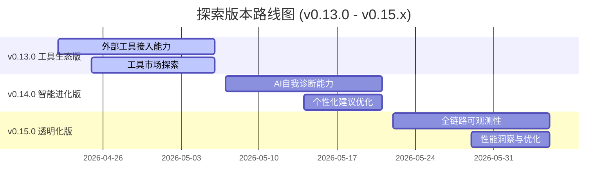

# Nanobot Runner 探索版本产品规划 (v0.13.0 - v0.15.x)

> **文档版本**: v2.0  
> **创建日期**: 2026-04-22  
> **最后更新**: 2026-04-22  
> **文档状态**: 正式发布  
> **适用范围**: v1.0.0 发布前的探索迭代版本

---

## 1. 规划概述

### 1.1 战略目标

在v1.0.0正式发布前，通过3个探索版本（v0.13.0 - v0.15.x）实现以下核心目标：

1. **AI能力最大化**: 深度挖掘nanobot-ai底座能力，打造差异化AI体验
2. **架构能力充分利用**: 全面整合MCP、Memory、Observability、Hook、MyTool等核心模块
3. **核心价值验证**: 验证隐私保护+本地部署的差异化价值主张
4. **用户反馈驱动**: 建立完善的用户反馈收集与快速迭代机制

### 1.2 核心原则

| 原则 | 说明 |
|------|------|
| **聚焦差异化** | 所有功能必须围绕"隐私保护+本地AI"核心价值展开 |
| **底座优先** | 优先使用nanobot-ai底座能力，避免重复造轮子 |
| **渐进式探索** | 每个版本聚焦1-2个核心能力，避免功能堆砌 |
| **数据驱动** | 每个功能必须有明确的度量指标和成功标准 |
| **快速验证** | 小步快跑，快速验证假设，及时止损 |

### 1.3 nanobot-ai底座能力分析

| 能力模块 | 当前使用状态 | 潜在价值 | 探索优先级 |
|----------|-------------|----------|-----------|
| **AgentLoop** | ✅ 已使用（agent chat） | 核心AI交互引擎 | P0 |
| **Memory系统** | ✅ 已使用（MEMORY.md） | 长期记忆、用户画像持久化 | P0 |
| **Gateway服务** | ✅ 已使用（飞书通道） | 多通道接入、异步交互 | P0 |
| **MCP系统** | ⚠️ 未使用 | 外部工具生态接入 | P1 |
| **Observability** | ❌ 未使用 | 可观测性、调试优化 | P1 |
| **Hook系统** | ❌ 未使用 | 扩展点、插件化 | P2 |
| **MyTool** | ❌ 未使用 | 自反思、参数自调优 | P1 |
| **CommandRouter** | ✅ 已使用 | 命令路由、直接执行 | P0 |

---

## 2. 探索版本路线图



---

## 3. v0.13.0 工具生态版 - 外部工具接入能力

### 3.1 版本目标

基于MCP（Model Context Protocol）协议，让Nanobot Runner能够接入丰富的外部工具生态，扩展AI助手的能力边界，为用户提供更全面的跑步数据分析和训练支持。

**什么是MCP？**
MCP是AI Agent的"USB接口"标准协议，支持即插即用地接入各种外部工具，如天气查询、地图服务、健康数据同步等。

### 3.2 核心功能

#### 3.2.1 外部工具接入能力

| 功能点 | 用户价值 | 典型应用场景 |
|--------|----------|--------------|
| 天气数据接入 | 训练前查看天气，合理安排训练计划 | "明天早上适合跑步吗？" → 自动查询天气并给出建议 |
| 地图服务接入 | 规划跑步路线，分析路线坡度 | "帮我规划一条10公里的路线" → 生成推荐路线 |
| 健康数据同步 | 整合睡眠、心率变异性等健康数据 | "分析我最近的恢复状态" → 综合多维度数据给出评估 |
| 训练知识库接入 | 获取专业训练理论和最新研究 | "解释什么是超量恢复" → 提供专业解答 |

**AI能力指标**:
- 外部工具调用成功率 > 95%
- 工具响应时间 < 3秒
- 用户满意度 > 4.2/5

#### 3.2.2 工具市场探索

| 功能点 | 用户价值 | 说明 |
|--------|----------|------|
| 工具发现与管理 | 用户可查看和启用可用工具 | 类似插件管理器的体验 |
| 工具配置简化 | 支持与Claude Desktop配置兼容 | 已有配置可直接导入使用 |
| 本地工具优先 | 优先推荐本地部署的工具 | 符合隐私保护核心价值 |

**典型应用场景**:
```
用户: "明天早上6点想去奥森跑步，天气怎么样？"
Agent: [调用天气工具查询] → 
      "明天早上北京奥森公园：晴，15°C，空气质量良，风速2级。非常适合跑步！"
      "建议穿着：短袖+短裤，记得带防晒。需要我帮你规划路线吗？"

用户: "帮我规划一条10公里的路线"
Agent: [调用地图工具规划] →
      "已为您规划奥森10公里环线：起点南门→北园→南园→终点南门"
      "预计爬升50米，以平路为主，适合节奏跑。路线已同步到您的手表。"
```

### 3.3 底座能力利用策略

| 底座能力 | 产品功能支撑 | 用户价值 |
|----------|-------------|----------|
| MCP协议支持 | 外部工具即插即用 | 能力边界无限扩展 |
| Stdio传输 | 本地工具安全接入 | 数据不出本地 |
| HTTP传输 | 云端服务灵活集成 | 丰富功能选择 |
| Claude配置兼容 | 配置一键导入 | 降低使用门槛 |

### 3.4 成功指标

| 指标类型 | 指标名称 | 目标值 | 测量方式 |
|----------|----------|--------|----------|
| 产品指标 | 外部工具接入数量 | ≥ 3个 | 功能统计 |
| 产品指标 | 工具调用成功率 | > 95% | 日志分析 |
| 产品指标 | 用户工具使用频率 | > 30% | 行为分析 |
| 产品指标 | 功能满意度评分 | > 4.2/5 | 用户反馈 |

### 3.5 资源与时间估算

| 任务 | 工期 | 依赖 |
|------|------|------|
| 工具生态调研与选型 | 3天 | 用户需求确认 |
| 核心工具接入实现 | 5天 | 工具API对接 |
| 工具管理界面设计 | 3天 | UX设计 |
| 测试与优化 | 4天 | 功能实现 |
| **总计** | **15天** | - |

---

## 4. v0.14.0 智能进化版 - AI自我诊断与个性化

### 4.1 版本目标

基于MyTool的自反思能力，让AI助手具备自我诊断和持续学习能力，能够根据用户的反馈不断优化建议质量，实现真正个性化的训练指导。

**什么是MyTool？**
MyTool是nanobot-ai提供的运行时自检能力，让Agent能够检查自身状态、分析执行结果，从而实现自我优化。

### 4.2 核心功能

#### 4.2.1 AI自我诊断能力

| 功能点 | 用户价值 | 典型应用场景 |
|--------|----------|--------------|
| 建议质量自检 | AI自动评估建议的合理性 | 避免给出不符合运动科学的建议 |
| 错误智能诊断 | 出现问题时自动分析原因 | 快速定位并解决问题 |
| 执行效果追踪 | 跟踪建议的实际执行效果 | 持续优化建议质量 |

**AI能力指标**:
- 建议合理性自检覆盖率 100%
- 问题诊断准确率 > 85%
- 用户问题反馈减少 > 30%

#### 4.2.2 个性化建议优化

| 功能点 | 用户价值 | 说明 |
|--------|----------|------|
| 训练偏好学习 | AI学习用户的训练习惯和偏好 | 越用越懂你的AI教练 |
| 建议风格调整 | 根据用户反馈调整建议方式 | 有人喜欢详细分析，有人喜欢简洁指令 |
| 渐进式难度调整 | 根据适应能力调整训练强度 | 避免过度训练或训练不足 |

**典型应用场景**:
```
场景1: 建议风格自适应
- 用户A习惯: 喜欢详细的数据分析和原理说明
- AI学习: 每次给出建议时附加数据支撑和理论解释
- 结果: 用户满意度提升

场景2: 训练强度个性化
- 历史: 用户多次反馈"今天强度太大"
- AI学习: 该用户对强度敏感，需要更保守的调整
- 后续: 自动降低建议强度系数

场景3: 恢复周期个性化
- 观察: 用户在高强度训练后需要更长恢复时间
- AI学习: 为该用户调整恢复周期计算
- 结果: 训练效果提升，疲劳度降低
```

### 4.3 底座能力利用策略

| 底座能力 | 产品功能支撑 | 用户价值 |
|----------|-------------|----------|
| MyTool自检 | AI自我诊断 | 建议质量保障 |
| Memory持久化 | 用户偏好学习 | 个性化体验 |
| AgentLoop优化 | 实时反馈处理 | 即时响应调整 |

### 4.4 成功指标

| 指标类型 | 指标名称 | 目标值 | 测量方式 |
|----------|----------|--------|----------|
| 产品指标 | 建议接受率 | > 85% | 用户行为分析 |
| 产品指标 | 重复修改次数降低 | > 30% | 对比测试 |
| 产品指标 | 用户满意度提升 | > 15% | 前后对比 |
| 产品指标 | 个性化感知度 | > 4.0/5 | 用户调研 |

### 4.5 资源与时间估算

| 任务 | 工期 | 依赖 |
|------|------|------|
| 用户偏好模型设计 | 3天 | 需求分析 |
| 个性化引擎实现 | 6天 | 模型设计确认 |
| 反馈闭环机制 | 4天 | 引擎实现 |
| 测试与调优 | 2天 | 功能实现 |
| **总计** | **15天** | - |

---

## 5. v0.15.0 透明化版 - 全链路可观测性

### 5.1 版本目标

建立完整的可观测性体系，让用户能够清晰了解AI助手的决策过程，同时为开发者提供系统运行的全面洞察，确保v1.0.0发布的稳定性和可靠性。

**什么是可观测性？**
可观测性让用户和开发者能够"看见"系统内部：AI如何思考、工具如何调用、性能如何表现，从而建立信任并持续优化。

### 5.2 核心功能

#### 5.2.1 AI决策透明化

| 功能点 | 用户价值 | 典型应用场景 |
|--------|----------|--------------|
| 思考过程展示 | 了解AI是如何得出结论的 | "为什么建议我今天休息？" → 展示数据分析和推理过程 |
| 数据来源追溯 | 知道建议基于哪些数据 | "这个VDOT值是怎么算出来的？" → 展示原始数据和计算步骤 |
| 决策依据说明 | 理解决策背后的逻辑 | "为什么推荐这个配速？" → 说明基于当前体能和目标的选择逻辑 |

**用户价值指标**:
- 用户对AI建议的信任度提升 > 20%
- "为什么"类问题减少 > 50%
- 功能满意度 > 4.3/5

#### 5.2.2 系统性能洞察

| 功能点 | 用户价值 | 说明 |
|--------|----------|------|
| 响应速度优化 | 更快的AI响应 | 基于性能数据持续优化 |
| 成本透明化 | 了解API调用成本 | 帮助用户控制使用成本 |
| 稳定性保障 | 99.5%+的系统可用性 | 监控告警，快速响应 |

#### 5.2.3 开发者调试支持

| 功能点 | 开发者价值 | 说明 |
|--------|-----------|------|
| 全链路追踪 | 快速定位问题 | 从用户输入到AI输出的完整链路 |
| 性能瓶颈分析 | 优化系统性能 | 识别慢查询、慢调用 |
| 错误根因分析 | 提高修复效率 | 自动归类错误类型 |

**典型应用场景**:
```
用户场景:
用户: "为什么建议我今天休息？"
AI: [展示思考过程]
    "基于以下分析给出建议：
    1. 您的TSB（训练压力平衡）为-25，处于疲劳状态
    2. 昨晚睡眠质量评分65%，低于平时80%
    3. 过去7天跑量较上周增加30%，超出安全范围
    4. 心率变异性（HRV）显示身体未完全恢复
    
    综合建议：今天进行30分钟轻松慢跑或完全休息"

开发者场景:
问题: 用户反馈AI响应变慢
追踪: 发现是VDOT计算查询耗时增加
根因: 数据量增加后未建立索引
修复: 优化查询逻辑，响应时间从3s降至500ms
```

### 5.3 底座能力利用策略

| 底座能力 | 产品功能支撑 | 用户价值 |
|----------|-------------|----------|
| OpenTelemetry | 全链路追踪 | 问题快速定位 |
| Langfuse集成 | 可视化分析 | 直观的数据展示 |
| Memory存储 | 历史数据查询 | 趋势分析能力 |

### 5.4 成功指标

| 指标类型 | 指标名称 | 目标值 | 测量方式 |
|----------|----------|--------|----------|
| 产品指标 | AI决策透明度感知 | > 4.2/5 | 用户调研 |
| 产品指标 | 用户对AI信任度 | > 4.5/5 | 用户调研 |
| 技术指标 | 系统可用性 | > 99.5% | 监控数据 |
| 技术指标 | 平均响应时间 | < 2s | 性能监控 |
| 技术指标 | 问题定位时间 | < 5分钟 | 模拟测试 |

### 5.5 资源与时间估算

| 任务 | 工期 | 依赖 |
|------|------|------|
| 可观测性体系设计 | 3天 | 架构评审 |
| 用户透明化功能 | 5天 | 设计确认 |
| 开发者工具 | 4天 | 追踪实现 |
| 性能优化 | 3天 | 数据分析 |
| **总计** | **15天** | - |

---

## 6. 跨版本协同机制

### 6.1 用户反馈收集机制

| 反馈渠道 | 收集内容 | 处理流程 |
|----------|----------|----------|
| 内置反馈命令 | `nanobotrun feedback "..."` | 自动记录到本地文件 |
| 对话满意度评分 | 每次对话后1-5星评分 | 关联到对话记录 |
| 使用数据统计 | 功能使用频率、成功率 | 匿名化后分析 |
| 社区Issue | GitHub issue反馈 | 定期review和归类 |

### 6.2 快速迭代流程

```
周1-2: 功能开发
   ↓
周2-3: 内部测试 + 问题修复
   ↓
周3-4: 小范围用户测试（邀请制）
   ↓
周4: 收集反馈 + 快速调整
   ↓
发布: 版本发布 + 反馈通道开启
```

### 6.3 版本间学习沉淀

| 学习内容 | 沉淀方式 | 应用场景 |
|----------|----------|----------|
| 用户偏好模式 | 结构化存储 | 个性化推荐优化 |
| 常见错误模式 | 错误库建设 | 自动诊断能力 |
| 性能优化经验 | 最佳实践文档 | 后续版本优化 |
| 用户反馈热点 | 需求优先级调整 | 产品方向调整 |

---

## 7. 风险评估与应对

### 7.1 技术风险

| 风险 | 概率 | 影响 | 应对策略 |
|------|------|------|----------|
| 外部工具API变更 | 中 | 中 | 工具抽象层隔离，快速适配 |
| 个性化学习效果不达预期 | 中 | 中 | 规则兜底，逐步优化 |
| 可观测性性能开销 | 低 | 中 | 采样策略，可配置开关 |

### 7.2 产品风险

| 风险 | 概率 | 影响 | 应对策略 |
|------|------|------|----------|
| 用户对新功能接受度低 | 中 | 中 | 渐进式发布，充分引导 |
| 功能复杂度影响稳定性 | 中 | 高 | 严格测试，核心功能优先 |
| 与v1.0时间冲突 | 中 | 高 | 预留缓冲，必要时裁剪 |

### 7.3 资源风险

| 风险 | 概率 | 影响 | 应对策略 |
|------|------|------|----------|
| 开发时间不足 | 高 | 高 | 优先级排序，接受功能裁剪 |
| 外部工具接入复杂度超预期 | 中 | 中 | 优先接入文档完善的工具 |

---

## 8. 成功标准与验收

### 8.1 版本发布标准

每个探索版本必须满足以下条件才能发布：

| 检查项 | 要求 | 验证方式 |
|--------|------|----------|
| 功能完整性 | 规划功能100%实现 | 功能清单核对 |
| 测试覆盖率 | 新增代码≥80% | 覆盖率报告 |
| 质量门禁 | mypy零错误，ruff零警告 | 自动化检查 |
| 性能基准 | 不劣于上一版本 | 性能测试对比 |
| 文档更新 | 用户文档同步更新 | 文档review |

### 8.2 v1.0.0就绪检查清单

探索版本全部完成后，v1.0.0发布前需确认：

- [ ] 所有探索版本功能稳定运行2周以上
- [ ] 用户反馈满意度≥4.0/5
- [ ] 核心功能测试覆盖率≥85%
- [ ] 性能监控数据完整，无明显瓶颈
- [ ] 已知问题清单清空或明确记录
- [ ] 用户文档完整，示例充分
- [ ] 回滚方案准备就绪

---

## 9. 附录

### 9.1 参考文档

- [产品规划方案](./产品规划方案.md)
- [探索版本产品规划评审报告](./探索版本产品规划评审报告.md)
- [需求规格说明书](../requirements/REQ_需求规格说明书.md)
- [架构设计说明书](../architecture/架构设计说明书.md)
- [AGENTS.md](../../AGENTS.md) - 开发指南

### 9.2 变更记录

| 版本 | 日期 | 变更内容 | 作者 |
|------|------|----------|------|
| v1.0 | 2026-04-22 | 初始版本 | 产品经理 |
| v2.0 | 2026-04-22 | 根据评审报告修正：MCP概念修正为Model Context Protocol，重新定义v0.13.0为工具生态版，优化用户价值描述 | 产品经理 |

---

*本文档遵循产品规划规范，定期 review 和更新*
