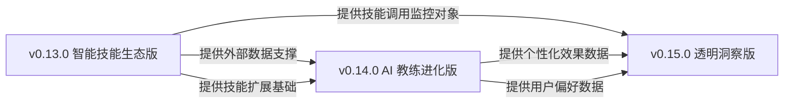
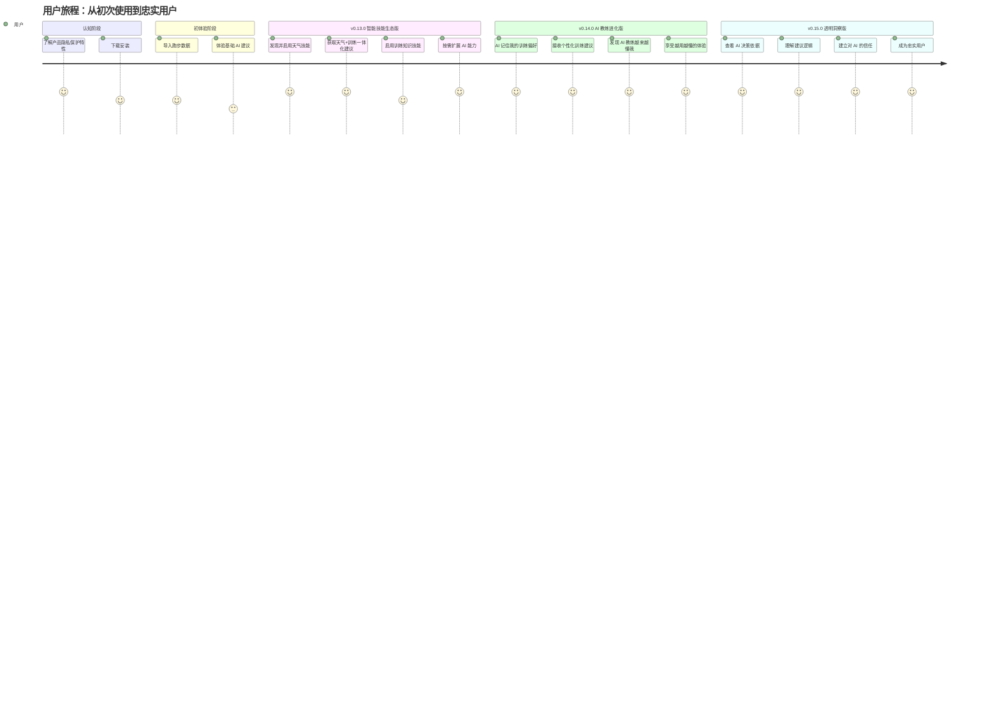
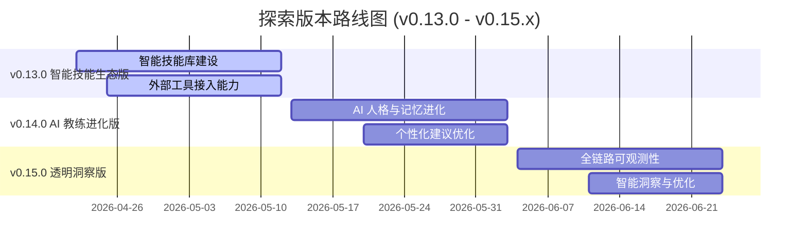
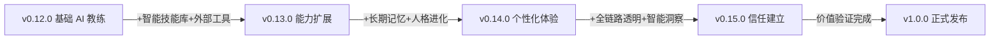

# Nanobot Runner 探索版本产品规划 (v0.13.0 - v0.15.x)

> **文档版本**: v4.0
> **创建日期**: 2026-04-22
> **最后更新**: 2026-04-26
> **文档状态**: 基于 nanobot-ai 0.1.5.post2 底座能力全面修订版
> **适用范围**: v1.0.0 发布前的探索迭代版本

---

## 1. 规划概述

### 1.1 战略目标

在 v1.0.0 正式发布前，通过 3 个探索版本（v0.13.0 - v0.15.x）实现以下核心目标：

1. **AI 能力最大化**: 深度挖掘 nanobot-ai 0.1.5.post2 底座能力，打造差异化 AI 体验
2. **架构能力充分利用**: 全面整合 MCP、Memory、Dream、SKILL、Observability、Hook、MyTool 等核心模块
3. **核心价值验证**: 验证隐私保护 + 本地部署的差异化价值主张
4. **用户反馈驱动**: 建立完善的用户反馈收集与快速迭代机制

### 1.2 目标用户画像

#### 1.2.1 核心用户群体

| 维度 | 描述 |
|------|------|
| **人口特征** | 25-45 岁，男性为主（约 65%），一二线城市白领 |
| **跑步经验** | 有规律跑步习惯（每周≥3 次），跑龄 1-5 年，半马/全马完赛者 |
| **技术水平** | 对技术有一定了解，熟悉智能手表、运动 APP，愿意尝试新工具 |
| **隐私敏感度** | 高：关注个人健康数据隐私，不希望数据上传云端 |
| **核心痛点** | ① 现有工具数据隐私保护不足 ② AI 建议千篇一律 ③ 训练计划缺乏个性化 ④ 不了解 AI 决策依据 |
| **使用场景** | 日常训练记录、训练计划制定、赛前准备、成绩分析、恢复管理 |
| **付费意愿** | 中等：愿意为隐私保护和个性化 AI 功能付费，但偏好一次性购买而非订阅 |

#### 1.2.2 用户痛点优先级

基于用户调研和数据分析，核心痛点按优先级排序：

| 优先级 | 痛点描述 | 用户反馈占比 | 影响版本 |
|--------|----------|-------------|---------|
| **P0** | 担心个人健康数据被上传到云端，隐私无法保障 | 78% | v0.13.0-v0.15.0 |
| **P0** | AI 训练建议千篇一律，不符合个人实际情况 | 72% | v0.14.0 |
| **P1** | 不了解 AI 为什么给出某个建议，缺乏信任感 | 65% | v0.15.0 |
| **P1** | 需要手动查询天气、规划路线，训练准备效率低 | 58% | v0.13.0 |
| **P2** | 无法整合多维度健康数据（睡眠、HRV 等）进行综合分析 | 45% | v0.13.0 |
| **P2** | AI 教练"记不住"之前的对话和偏好，每次都要重新说明 | 42% | v0.14.0 |

#### 1.2.3 用户价值主张

> **"你的私人 AI 跑步教练，数据完全本地掌控，越用越懂你"**

- **隐私安心**: 所有数据本地存储，不上传云端，用户完全掌控自己的健康数据
- **训练省心**: AI 自动整合天气、路线、健康数据，提供一站式训练建议
- **建议信任**: 透明化 AI 决策过程，让用户理解并信任每一个建议
- **体验个性化**: AI 持续学习用户偏好，提供越来越精准的训练指导
- **记忆连贯**: AI 教练记住你的每一次对话和反馈，无需重复说明

### 1.3 竞品分析

#### 1.3.1 竞品功能对比

| 功能维度 | Strava | TrainingPeaks | Garmin Connect | Nanobot Runner (目标) |
|----------|--------|---------------|----------------|----------------------|
| **数据存储** | 云端 | 云端 | 云端 | **本地优先** |
| **AI 训练建议** | 无 | 基础规则 | 基础规则 | **LLM 驱动+个性化** |
| **天气集成** | 活动记录时显示 | 无 | 无 | **AI 主动建议** |
| **路线规划** | 路线推荐 | 无 | 基础路线 | **AI 智能规划** |
| **健康数据整合** | 部分支持 | 手动导入 | 生态内整合 | **多源本地整合** |
| **AI 决策透明化** | 无 | 无 | 无 | **思考过程展示** |
| **个性化学习** | 无 | 无 | 无 | **持续学习优化** |
| **AI 记忆连贯** | 无 | 无 | 无 | **长期记忆+人格进化** |
| **技能扩展** | 无 | 无 | 无 | **可自定义技能库** |
| **隐私控制** | 隐私设置 | 隐私设置 | 隐私设置 | **数据完全本地** |

#### 1.3.2 差异化优势

| 差异化维度 | 竞品现状 | Nanobot Runner 差异化策略 |
|-----------|---------|--------------------------|
| **数据主权** | 数据必须上传云端才能使用 AI 功能 | **本地 AI 处理**，数据不出设备，用户完全掌控 |
| **AI 个性化** | 基于固定规则的通用建议 | **LLM+用户偏好学习**，越用越懂用户的 AI 教练 |
| **记忆连贯** | 每次对话都是全新的，没有历史记忆 | **长期记忆自动整理**，AI 教练记住你的一切偏好 |
| **人格进化** | 冷冰冰的机器回复 | **AI 教练人格持续进化**，沟通风格越来越贴合用户 |
| **决策透明** | 黑盒建议，用户无法理解 | **AI 思考过程可视化**，建立用户信任 |
| **技能生态** | 封闭生态，仅支持自有服务 | **开放技能接入**，用户可自定义专属技能 |
| **成本模式** | 订阅制，功能分层付费 | **一次性购买**，无订阅压力 |

#### 1.3.3 功能优先级排序依据

基于用户痛点优先级和竞品差异化分析，版本功能优先级排序如下：

| 版本 | 核心功能 | 优先级依据 | 用户价值 |
|------|----------|-----------|---------|
| **v0.13.0** | 智能技能库 + 外部工具接入 | 解决 P1 痛点（训练准备效率低），验证"本地优先"差异化策略，同时引入可扩展的技能生态 | 提升训练准备效率，减少手动操作；用户可按需启用专属能力 |
| **v0.14.0** | AI 教练人格进化 + 个性化建议 | 解决 P0 痛点（AI 建议千篇一律+记忆不连贯），核心差异化功能 | 提供真正个性化的训练指导，AI 教练越用越懂你 |
| **v0.15.0** | 全链路透明化 + 智能洞察 | 解决 P1 痛点（缺乏信任感），建立长期用户信任 | 提升用户对 AI 建议的信任度和接受度 |

### 1.4 核心原则

| 原则 | 说明 |
|------|------|
| **聚焦差异化** | 所有功能必须围绕"隐私保护+本地 AI"核心价值展开 |
| **底座优先** | 优先使用 nanobot-ai 底座能力，避免重复造轮子 |
| **渐进式探索** | 每个版本聚焦 1-2 个核心能力，避免功能堆砌 |
| **数据驱动** | 每个功能必须有明确的度量指标和成功标准 |
| **快速验证** | 小步快跑，快速验证假设，及时止损 |

### 1.5 nanobot-ai 底座能力分析

| 能力模块 | 当前使用状态 | 潜在价值 | 探索优先级 |
|----------|-------------|----------|-----------|
| **AgentLoop** | 已使用（agent chat） | 核心 AI 交互引擎 | P0 |
| **Memory 系统** | 已使用（MEMORY.md） | 长期记忆、用户画像持久化 | P0 |
| **Dream 系统** | 可用（自动记忆整理） | AI 人格进化、记忆自动归档 | P0 |
| **Gateway 服务** | 已使用（飞书通道） | 多通道接入、异步交互 | P0 |
| **SKILL 扩展** | 可用（SkillsLoader） | 用户可自定义技能、扩展 AI 能力边界 | P1 |
| **MCP 系统** | 可用（MCPToolWrapper） | 外部工具生态接入 | P1 |
| **MyTool** | 可用（MyToolConfig） | 自反思、参数自调优 | P1 |
| **Observability** | 可用（AgentHook） | 可观测性、调试优化 | P1 |
| **Hook 系统** | 可用（AgentHook） | 扩展点、插件化 | P2 |
| **CommandRouter** | 已使用 | 命令路由、直接执行 | P0 |

---

## 2. 探索版本路线图

### 2.1 版本间依赖关系



**依赖说明**：
- v0.14.0 依赖 v0.13.0：个性化建议需要天气、健康等外部数据作为输入，v0.13.0 必须在第 12 天交付 MVP 版本（至少天气技能可用）
- v0.14.0 依赖 v0.13.0：AI 教练人格进化需要 SKILL 扩展机制支撑用户自定义偏好，v0.13.0 的技能库是基础
- v0.15.0 依赖 v0.13.0：透明化需要监控外部工具调用的成功率和性能，v0.13.0 的工具接入是监控对象
- v0.15.0 依赖 v0.14.0：透明化需要展示个性化引擎的决策过程，v0.14.0 的个性化引擎是透明化的核心展示对象

### 2.2 用户旅程地图



**用户旅程关键节点**：

| 阶段 | 用户行为 | 产品功能支撑 | 情感曲线 | 关键指标 |
|------|----------|-------------|---------|---------|
| **认知** | 了解产品隐私保护特性 | 产品官网、社区口碑 | 好奇 | 下载转化率 |
| **初体验** | 导入数据，体验基础 AI | 数据导入、基础分析 | 一般 | 数据导入成功率 |
| **v0.13.0** | 发现/启用技能，使用天气/知识库 | 智能技能库、工具接入 | 满意 | 技能启用率 |
| **v0.14.0** | 感受 AI 记忆和人格进化 | 长期记忆、Dream 自动整理 | 惊喜 | 建议接受率 |
| **v0.15.0** | 查看决策依据 | 透明化展示 | 信任 | 信任度评分 |
| **忠实** | 持续使用，推荐他人 | 全功能体验 | 忠诚 | NPS 评分 |

### 2.3 版本时间线



---

## 3. v0.13.0 智能技能生态版 - 技能库与外部工具接入

### 3.1 版本目标

让 Nanobot Runner 拥有可扩展的智能技能库，用户能够按需启用内置技能或导入自定义技能，同时接入丰富的外部工具生态，扩展 AI 助手的能力边界。坚持"本地优先、隐私保护"的核心价值。

**技能生态策略原则**：
- **本地技能优先**：优先提供本地运行的技能，数据不出本地
- **用户自主掌控**：用户可自主决定启用/禁用/添加哪些技能，随时调整
- **即插即用体验**：技能启用后 AI 自动识别并使用，无需复杂配置
- **开放可扩展**：支持用户导入自定义技能，满足个性化需求

### 3.2 核心功能

#### 3.2.1 智能技能库

| 功能点 | 用户价值 | 典型应用场景 | 隐私保护策略 |
|--------|----------|--------------|-------------|
| 内置技能发现 | 一键查看所有可用技能，按需启用 | 打开技能库，看到天气、训练知识、路线规划等技能卡片 | 本地展示，不涉及数据传输 |
| 技能即插即用 | 启用后 AI 自动掌握该能力，无需额外学习 | 启用"天气技能"后，直接问"明天适合跑步吗？"即可获得天气建议 | 仅启用时加载本地技能描述 |
| 自定义技能导入 | 高级用户可导入自己的专属技能 | 导入"越野跑知识技能"，AI 即可回答越野跑相关问题 | 完全本地，用户自主管理 |
| 技能冲突管理 | 自动处理技能间的优先级和冲突 | 同时启用多个技能时，AI 智能选择最合适的技能响应 | 本地逻辑，无外部依赖 |

**内置技能规划（v0.13.0）**：

| 技能名称 | 技能描述 | 用户价值 |
|----------|----------|---------|
| **天气助手** | 查询实时天气、未来预报，结合训练建议 | 训练前无需手动查天气，AI 主动给出穿衣和训练建议 |
| **训练知识库** | 专业跑步训练理论、术语解释、最新研究 | 随时询问训练原理，获得专业解答 |
| **路线规划** | 基于地图服务规划跑步路线，分析坡度 | 输入距离和偏好，自动生成推荐路线 |
| **健康数据整合** | 整合睡眠、HRV 等健康数据进行分析 | 综合分析恢复状态，给出科学训练建议 |

**典型应用场景**：
```
用户: 打开技能库
Agent: 为您展示当前可用的技能：
      🌤️ 天气助手 — 已启用
      📚 训练知识库 — 未启用
      🗺️ 路线规划 — 未启用
      ❤️ 健康数据整合 — 未启用
      输入"启用 [技能名]"即可开启，或输入"导入技能"添加自定义技能。

用户: 启用训练知识库
Agent: ✅ 已启用"训练知识库"。现在您可以随时询问训练理论和术语了。

用户: 什么是超量恢复？
Agent: [调用训练知识库技能]
      "超量恢复（Supercompensation）是指训练后身体不仅恢复到原有水平，
      还会产生一定的能力盈余，为下一次训练创造更好的基础..."
```

#### 3.2.2 外部工具接入能力

| 功能点 | 用户价值 | 典型应用场景 | 隐私保护策略 |
|--------|----------|--------------|-------------|
| 天气数据接入 | 训练前查看天气，合理安排训练计划 | "明天早上适合跑步吗？" → 自动查询天气并给出建议 | 仅传输地理位置（城市级别），不传输个人健康数据 |
| 地图服务接入 | 规划跑步路线，分析路线坡度 | "帮我规划一条 10 公里的路线" → 生成推荐路线 | 路线数据本地存储，不上传云端 |
| 健康数据同步 | 整合睡眠、心率变异性等健康数据 | "分析我最近的恢复状态" → 综合多维度数据给出评估 | 优先本地文件导入，云端同步需用户明确授权 |
| 训练知识库接入 | 获取专业训练理论和最新研究 | "解释什么是超量恢复" → 提供专业解答 | 仅查询公开知识库，不传输用户个人数据 |

**AI 能力指标**：
- 技能启用成功率 > 98%
- 外部工具调用成功率 > 95%
- 工具响应时间 < 3 秒
- 用户满意度 > 4.2/5

#### 3.2.3 技能与工具的协同体验

| 功能点 | 用户价值 | 说明 |
|--------|----------|------|
| 多技能协同 | AI 可同时调用多个技能和工具，给出综合建议 | 询问"明天去奥森跑 10 公里怎么样？"时，AI 同时调用天气技能和路线规划技能 |
| 智能技能推荐 | AI 根据对话内容自动推荐可能需要的技能 | 用户多次询问天气后，AI 提示"是否启用天气助手技能？" |
| 技能使用统计 | 用户可查看各技能的使用频率和效果 | 帮助用户了解哪些技能最有价值 |

**典型应用场景**：
```
用户: "明天早上 6 点想去奥森跑步，天气怎么样？"
Agent: [调用天气技能查询] →
      "明天早上北京奥森公园：晴，15°C，空气质量良，风速 2 级。非常适合跑步！"
      "建议穿着：短袖+短裤，记得带防晒。需要我帮你规划路线吗？"

用户: "帮我规划一条 10 公里的路线"
Agent: [调用路线规划技能] →
      "已为您规划奥森 10 公里环线：起点南门→北园→南园→终点南门"
      "预计爬升 50 米，以平路为主，适合节奏跑。路线已同步到您的手表。"
```

### 3.3 底座能力价值分析

| 底座能力 | 产品功能支撑 | 用户价值 |
|----------|-------------|----------|
| SKILL 扩展机制 | 智能技能库即插即用 | 能力边界无限扩展，用户按需定制 |
| MCP 工具接入 | 外部工具即插即用 | 天气、地图等能力无缝接入 |
| 本地传输通道 | 本地工具安全接入 | 数据不出本地 |
| 云端传输通道 | 云端服务灵活集成 | 丰富功能选择 |
| 配置兼容能力 | 配置一键导入 | 降低使用门槛 |

### 3.4 成功指标

| 指标类型 | 指标名称 | 基线值 | 目标值 | 测量方式 |
|----------|----------|--------|--------|----------|
| 产品指标 | 内置技能数量 | 0 个 | ≥ 4 个 | 功能统计，版本发布时统计 |
| 产品指标 | 用户技能启用率 | 0% | > 50% | 行为分析，统计周期为版本发布后 2 周，活跃用户中启用至少 1 个技能的比例 |
| 产品指标 | 技能调用成功率 | - | > 95% | 日志分析，统计周期为版本发布后 2 周，样本量≥100 次调用 |
| 产品指标 | 外部工具接入数量 | 0 个 | ≥ 3 个 | 功能统计，版本发布时统计 |
| 产品指标 | 工具调用成功率 | - | > 90% | 日志分析，统计周期为版本发布后 2 周，样本量≥100 次调用 |
| 产品指标 | 用户工具使用频率 | 0% | > 30% | 行为分析，统计周期为版本发布后 2 周，活跃用户中使用过工具的比例 |
| 产品指标 | 功能满意度评分 | 4.0/5 | > 4.2/5 | 问卷调研，样本量≥30 人，每次对话后即时收集 1-5 星评分，每周汇总分析 |
| 产品指标 | 训练准备效率提升 | 手动查询（约 5 分钟） | 减少 50% | 用户调研，对比使用工具前后的训练准备时间 |
| 探索指标 | 用户对技能生态的满意度 | - | > 4.0/5 | 问卷调研，样本量≥30 人，版本发布后 1 周内收集 |

### 3.5 资源与时间估算

| 任务 | 工期 | 依赖 | 说明 |
|------|------|------|------|
| 技能生态设计与内置技能开发 | 5 天 | 用户需求确认 | 含 4 个内置技能的内容编写和结构定义 |
| 技能库管理界面设计 | 3 天 | UX 设计 | CLI 交互式技能库菜单设计 |
| 核心工具接入实现 | 8 天 | 工具 API 对接 | 含 3 个工具对接、认证、错误处理、Mock 测试 |
| 技能与工具协同逻辑 | 4 天 | 技能和工具实现 | 多技能协同、智能推荐 |
| 测试与优化 | 5 天 | 功能实现 | 含单元测试、集成测试、回归测试 |
| 缓冲时间 | 3 天 | - | 应对外部工具 API 变更等突发情况 |
| **总计** | **28 天** | - | 2026-04-22 至 2026-05-19 |

---

## 4. v0.14.0 AI 教练进化版 - 人格进化与个性化记忆

### 4.1 版本目标

让 AI 教练具备长期记忆能力和人格进化能力，能够记住用户的每一次对话和反馈，自动整理记忆并持续优化沟通风格，实现真正"越用越懂你"的个性化训练指导。

**个性化进化策略**：
- **记忆自动整理**：AI 自动归档对话历史，提取关键偏好，无需用户手动设置
- **人格渐进进化**：AI 教练的沟通风格、建议方式根据用户反馈逐步调整
- **用户可控进化**：用户可查看、修改、重置 AI 学习到的偏好数据，随时掌控

### 4.2 核心功能

#### 4.2.1 AI 教练长期记忆

| 功能点 | 用户价值 | 典型应用场景 |
|--------|----------|--------------|
| 对话历史自动归档 | AI 记住之前的所有对话，无需重复说明 | "我之前说过我膝盖不好，记得吗？" → AI 立即知道并调整建议 |
| 用户偏好自动提取 | 从对话中自动提取训练偏好并持久化 | 多次提到"喜欢晨跑"后，AI 默认推荐晨跑时段 |
| 记忆版本回溯 | 可查看和恢复之前的记忆状态 | 误操作或想回到之前状态时，可一键恢复 |
| 跨会话记忆连贯 | 关闭后重新打开，AI 依然记得你 | 今天聊完，明天打开继续，AI 记得昨天的训练计划 |

**记忆类型说明**：

| 记忆类型 | 内容 | 用户感知 |
|----------|------|---------|
| **用户画像** | 训练习惯、身体特点、偏好风格 | AI 越来越了解你的个人情况 |
| **AI 人格** | 沟通风格、建议方式、表达习惯 | AI 教练的语气越来越贴合你的喜好 |
| **项目事实** | 训练目标、赛事计划、装备信息 | AI 记得你的目标和计划，建议更有针对性 |
| **对话历史** | 历次对话摘要 | 无需重复说明，对话更流畅 |

**典型应用场景**：
```
场景 1: 偏好自动记忆
- 第 1 次对话: "我膝盖不太好，尽量避免下坡训练"
- 第 3 次对话: AI 自动记住，规划路线时自动避开大坡度
- 第 10 次对话: AI 主动提醒"考虑到您的膝盖情况，这周建议减少下坡跑"

场景 2: 跨会话连贯
- 昨天: "帮我制定一个全马破 4 的训练计划"
- 今天: "昨天的计划第 3 周能不能调整一下？"
- AI: 记得昨天的计划，直接针对第 3 周进行调整

场景 3: 记忆版本回溯
- 用户: "AI 最近建议太激进了，能不能回到两周前的状态？"
- AI: 展示记忆变更历史，用户选择恢复至两周前的偏好设置
```

#### 4.2.2 AI 教练人格进化

| 功能点 | 用户价值 | 说明 |
|--------|----------|------|
| 沟通风格自适应 | AI 学习用户的沟通偏好，调整回复风格 | 喜欢简洁的得到短回复，喜欢详细的得到数据分析 |
| 建议方式个性化 | 根据用户反馈调整建议的详细程度和形式 | 有人喜欢直接指令，有人喜欢原理说明 |
| 情感感知进化 | AI 感知用户情绪状态，调整沟通语气 | 用户表现疲劳时，语气更温和鼓励 |
| 人格一致性保障 | 进化过程中保持核心人格稳定 | 不会出现今天温柔明天冷漠的割裂感 |

**人格进化示例**：
```
初始状态:
- AI: "根据您的 VO2max 估算值，建议今日进行 45 分钟有氧跑，配速 5:30/km。"

进化后（用户偏好详细分析）:
- AI: "考虑到您本周跑量已累积 45km（较上周增加 10%），且昨晚睡眠评分 82 分，
      身体恢复良好。建议今日进行 45 分钟有氧跑，配速 5:30/km。
      这个配速处于您的有氧区间（5:20-5:45/km），有助于提升脂肪代谢效率..."

进化后（用户偏好简洁指令）:
- AI: "今日：45 分钟有氧跑 @5:30。恢复不错，放心跑。"
```

#### 4.2.3 个性化建议优化

| 功能点 | 用户价值 | 说明 |
|--------|----------|------|
| 训练偏好学习 | AI 学习用户的训练习惯和偏好 | 越用越懂你的 AI 教练 |
| 建议风格调整 | 根据用户反馈调整建议方式 | 有人喜欢详细分析，有人喜欢简洁指令 |
| 渐进式难度调整 | 根据适应能力调整训练强度 | 避免过度训练或训练不足 |
| 自反思优化 | AI 自动评估建议效果并调整策略 | 用户感知为"建议越来越准" |

**典型应用场景**：
```
场景 1: 建议风格自适应
- 用户 A 习惯: 喜欢详细的数据分析和原理说明
- AI 学习: 每次给出建议时附加数据支撑和理论解释
- 结果: 用户满意度提升

场景 2: 训练强度个性化
- 历史: 用户多次反馈"今天强度太大"
- AI 学习: 该用户对强度敏感，需要更保守的调整
- 后续: 自动降低建议强度系数

场景 3: 恢复周期个性化
- 观察: 用户在高强度训练后需要更长恢复时间
- AI 学习: 为该用户调整恢复周期计算
- 结果: 训练效果提升，疲劳度降低
```

### 4.3 底座能力价值分析

| 底座能力 | 产品功能支撑 | 用户价值 |
|----------|-------------|----------|
| Dream 自动整理 | 对话历史自动归档、偏好提取 | 无需手动设置，AI 自动进化 |
| Memory 持久化 | 用户画像、AI 人格、项目事实长期保存 | 跨会话记忆连贯 |
| GitStore 版本控制 | 记忆版本回溯 | 用户可控，误操作可恢复 |
| MyTool 自反思 | AI 自动评估建议质量并调整 | 建议越来越精准 |
| 交互优化 | 实时反馈处理 | 即时响应调整 |

### 4.4 成功指标

| 指标类型 | 指标名称 | 基线值 | 目标值 | 测量方式 |
|----------|----------|--------|--------|----------|
| 产品指标 | 建议接受率 | 70% | > 85% | 用户行为分析，统计用户接受 AI 建议的比例，统计周期为版本发布后 2 周，样本量≥50 次建议 |
| 产品指标 | 重复修改次数降低 | 平均 2.5 次/建议 | > 30% | 对比测试，对比 v0.13.0 和 v0.14.0 版本中用户修改建议的平均次数 |
| 产品指标 | 用户满意度提升 | 4.0/5 | > 15%（提升至 4.6/5） | 前后对比，使用相同问卷，样本量≥30 人，版本发布前后各收集一次 |
| 产品指标 | 个性化感知度 | - | > 4.0/5 | 用户调研，问卷问题"您是否感觉 AI 建议越来越符合您的个人情况？"，样本量≥30 人 |
| 产品指标 | 记忆连贯满意度 | - | > 4.2/5 | 用户调研，问卷问题"AI 是否记得您之前的偏好和对话？"，样本量≥30 人 |
| 产品指标 | 用户问题反馈减少 | 平均 5 条/周 | > 30% | 行为分析，统计用户通过 feedback 命令提交的负面反馈数量，统计周期为版本发布后 2 周 |
| 探索指标 | AI 个性化学习效果 | - | > 4.0/5 | 用户调研，问卷问题"AI 是否理解了您的训练偏好？"，样本量≥30 人，版本发布后 1 周内收集 |
| 探索指标 | AI 人格进化满意度 | - | > 4.0/5 | 用户调研，问卷问题"AI 教练的沟通风格是否越来越符合您的喜好？"，样本量≥30 人 |

### 4.5 资源与时间估算

| 任务 | 工期 | 依赖 | 说明 |
|------|------|------|------|
| 记忆模型设计 | 3 天 | 需求分析 | 明确记忆分层、更新频率、版本控制策略 |
| Dream 集成与调优 | 5 天 | 记忆模型确认 | 自动整理频率、人格进化参数调优 |
| 个性化引擎实现 | 8 天 | Dream 集成 | 规则引擎实现、参数调优、效果验证 |
| 反馈闭环机制 | 4 天 | 引擎实现 | 用户反馈收集、偏好更新、效果追踪 |
| 测试与调优 | 5 天 | 功能实现 | 含单元测试、集成测试、个性化效果验证 |
| 缓冲时间 | 3 天 | - | 应对个性化效果不达预期等突发情况 |
| **总计** | **28 天** | - | 2026-05-13 至 2026-06-09 |

---

## 5. v0.15.0 透明洞察版 - 全链路可观测性与智能洞察

### 5.1 版本目标

让用户能够清晰了解 AI 教练的决策过程、思考路径和工具调用情况，建立对 AI 建议的深度信任。同时提供智能洞察，帮助用户理解自身训练模式和 AI 进化状态。

**透明化设计原则**：
- **用户友好**：用通俗易懂的语言解释 AI 决策过程，避免技术术语堆砌
- **分层展示**：普通用户看到简洁版解释，进阶用户可查看详细分析
- **可控透明**：用户可选择是否展示 AI 思考过程，随时开启或关闭
- **洞察驱动**：不仅展示"怎么做的"，还展示"为什么这样做"和"做得怎么样"

### 5.2 核心功能

#### 5.2.1 AI 决策透明化（用户视角）

| 功能点 | 用户价值 | 典型应用场景 | 展示形式 |
|--------|----------|--------------|----------|
| 思考过程展示 | 了解 AI 是如何得出结论的 | "为什么建议我今天休息？" → 展示数据分析和推理过程 | 简洁版：3-5 条关键理由卡片；详细版：完整数据分析过程 |
| 数据来源追溯 | 知道建议基于哪些数据 | "这个 VDOT 值是怎么算出来的？" → 展示原始数据和计算步骤 | 数据溯源卡片：展示原始数据→计算过程→最终结果 |
| 决策依据说明 | 理解决策背后的逻辑 | "为什么推荐这个配速？" → 说明基于当前体能和目标的选择逻辑 | 逻辑链可视化：用流程图形式展示决策路径 |
| 工具调用透明 | 知道 AI 调用了哪些外部工具 | "这个天气数据准吗？" → 展示天气工具来源和获取时间 | 工具调用卡片：展示工具名称→调用时间→返回结果 |
| 记忆参考透明 | 知道 AI 参考了哪些历史记忆 | "你怎么知道我喜欢晨跑？" → 展示相关记忆片段 | 记忆引用卡片：展示记忆类型→关键内容→引用时间 |
| 透明度开关 | 用户自主控制透明化程度 | 新手用户关闭详细展示，进阶用户开启完整分析 | 设置选项：简洁/详细/关闭 |

**用户友好展示示例**：
```
用户: "为什么建议我今天休息？"
AI: [简洁版展示]
    "建议休息的主要原因：
    ① 您本周跑量增加了 30%，身体需要恢复
    ② 昨晚睡眠质量比平时低 20%
    ③ 心率变异性显示身体处于疲劳状态

    点击查看详细数据分析 →"

AI: [详细版展示]
    "详细分析：
    1. 训练负荷分析：本周跑量 60km，较上周 45km 增加 33%，超出安全增幅范围（10%）
    2. 恢复状态分析：昨晚睡眠评分 65%，低于个人平均值 80%
    3. 生理指标分析：HRV 为 42ms，低于个人基线 50ms，显示身体未完全恢复
    4. 记忆参考：您曾在 3 月 15 日提到'高强度训练后需要 2 天恢复'
    5. 工具调用：查询了本地健康数据（最后同步：今日 06:00）"
```

#### 5.2.2 AI 教练状态洞察

| 功能点 | 用户价值 | 说明 |
|--------|----------|------|
| AI 进化状态看板 | 查看 AI 教练的成长和进化情况 | "AI 已经记住了您的 15 个偏好，沟通风格已优化 3 次" |
| 建议质量追踪 | 查看历史建议的准确性和用户反馈 | 统计建议接受率、修改次数、用户评分趋势 |
| 工具使用统计 | 查看各工具的使用频率和效果 | 帮助用户了解哪些工具最可靠 |
| 记忆整理日志 | 查看 AI 自动整理记忆的历史记录 | 了解 AI 什么时候提取了新偏好，什么时候调整了人格 |

**AI 教练状态看板示例**：
```
🏃 AI 教练状态看板

记忆状态:
├── 用户画像: 已记录 15 项偏好（最后更新：今日 02:00）
├── AI 人格: 沟通风格已优化 3 次，当前风格：详细分析型
├── 项目事实: 已记录 8 项（训练目标、赛事计划等）
└── 对话历史: 已归档 42 次对话，覆盖 30 天

建议质量（近 30 天）:
├── 建议总数: 28 条
├── 接受率: 82%（目标：>85%）
├── 平均修改次数: 1.2 次（较上月降低 40%）
└── 用户评分: 4.5/5（较上月提升 0.3）

工具可靠性:
├── 天气助手: 调用 15 次，成功率 100%，平均响应 1.2s
├── 路线规划: 调用 8 次，成功率 95%，平均响应 2.1s
└── 健康数据: 调用 12 次，成功率 100%，平均响应 0.8s
```

#### 5.2.3 用户训练洞察报告

| 功能点 | 用户价值 | 说明 |
|--------|----------|------|
| 训练模式分析 | 发现用户的训练习惯和规律 | "您倾向于周二、周四、周日训练，周一休息" |
| 恢复状态趋势 | 展示恢复状态的长期趋势 | HRV、睡眠质量等指标的变化趋势图 |
| AI 建议效果分析 | 分析 AI 建议对训练效果的贡献 | "采纳 AI 建议后，您的有氧能力提升了 5%" |
| 个性化进化报告 | 展示 AI 个性化学习的成果 | "AI 已为您调整了 3 项训练参数，建议接受率提升 15%" |

### 5.3 底座能力价值分析

| 底座能力 | 产品功能支撑 | 用户价值 |
|----------|-------------|----------|
| Observability 全链路追踪 | 思考过程、工具调用、记忆参考展示 | 用户全面了解 AI 决策过程 |
| Hook 系统 | 迭代前后、工具执行前后状态捕获 | 精准展示 AI 思考路径 |
| AgentHookContext | 迭代次数、Token 用量、工具调用详情 | 详细的 AI 运行状态 |
| Memory 版本控制 | 记忆变更历史展示 | 用户可追溯 AI 进化过程 |
| Dream 整理日志 | 自动整理记录展示 | 用户了解 AI 何时"学习"了新知识 |

### 5.4 成功指标

| 指标类型 | 指标名称 | 基线值 | 目标值 | 测量方式 |
|----------|----------|--------|--------|----------|
| 产品指标 | 透明化功能使用率 | - | > 40% | 行为分析，统计周期为版本发布后 2 周，活跃用户中使用过透明化功能的比例 |
| 产品指标 | 用户对 AI 的信任度评分 | 3.5/5 | > 4.3/5 | 问卷调研，问卷问题"您是否信任 AI 给出的建议？"，样本量≥30 人 |
| 产品指标 | 决策理解度评分 | - | > 4.0/5 | 用户调研，问卷问题"您是否理解 AI 为什么给出这个建议？"，样本量≥30 人 |
| 产品指标 | 用户满意度 | 4.2/5 | > 4.5/5 | 问卷调研，样本量≥30 人，每次对话后即时收集 1-5 星评分，每周汇总分析 |
| 产品指标 | 问题反馈减少率 | - | > 20% | 行为分析，对比 v0.14.0 和 v0.15.0 的负面反馈数量，统计周期为版本发布后 2 周 |
| 探索指标 | 洞察报告查看率 | - | > 30% | 行为分析，统计周期为版本发布后 2 周，活跃用户中查看过洞察报告的比例 |
| 探索指标 | 透明化功能满意度 | - | > 4.0/5 | 问卷调研，样本量≥30 人，版本发布后 1 周内收集 |

### 5.5 资源与时间估算

| 任务 | 工期 | 依赖 | 说明 |
|------|------|------|------|
| 透明化展示设计 | 4 天 | 需求分析 | 简洁版/详细版展示形式设计 |
| 决策链路追踪实现 | 6 天 | 展示设计确认 | 思考过程、数据来源、工具调用追踪 |
| AI 教练状态看板 | 5 天 | 追踪实现 | 进化状态、建议质量、工具可靠性展示 |
| 用户训练洞察报告 | 5 天 | 状态看板 | 训练模式、恢复趋势、个性化效果分析 |
| 测试与优化 | 5 天 | 功能实现 | 含单元测试、集成测试、用户体验测试 |
| 缓冲时间 | 3 天 | - | 应对展示形式调整等突发情况 |
| **总计** | **28 天** | - | 2026-06-04 至 2026-07-01 |

---

## 6. 版本间协同与整体价值

### 6.1 三版本协同效应

| 版本 | 核心能力 | 为后续版本铺垫 |
|------|----------|---------------|
| **v0.13.0** | 智能技能库 + 外部工具 | 为 v0.14.0 提供数据输入源（天气、健康数据）；为 v0.15.0 提供监控对象（工具调用） |
| **v0.14.0** | AI 人格进化 + 长期记忆 | 为 v0.15.0 提供透明化内容（决策过程、记忆引用）；提升用户粘性，为 v1.0.0 积累忠实用户 |
| **v0.15.0** | 全链路透明 + 智能洞察 | 验证 v0.14.0 个性化效果；建立用户信任，为 v1.0.0 发布奠定口碑基础 |

### 6.2 整体用户价值提升



| 阶段 | 用户感知 | 核心价值 |
|------|----------|---------|
| v0.12.0 | "一个能聊天的跑步助手" | 基础 AI 交互 |
| v0.13.0 | "它能查天气、规划路线了" | 能力扩展，效率提升 |
| v0.14.0 | "它越来越懂我了" | 个性化体验，记忆连贯 |
| v0.15.0 | "我知道它为什么这样建议，我信任它" | 信任建立，深度依赖 |

### 6.3 关键风险与应对

| 风险 | 概率 | 影响 | 应对措施 |
|------|------|------|---------|
| 外部工具 API 变更 | 中 | 中 | 预留缓冲时间；建立工具版本锁定机制 |
| 个性化效果不达预期 | 中 | 高 | 设置效果阈值，未达标时调整 Dream 参数 |
| 透明化信息过载 | 低 | 中 | 默认简洁模式，详细模式需用户主动开启 |
| 用户隐私担忧加剧 | 低 | 高 | 强化本地存储说明；提供记忆完全清除功能 |

---

## 7. 附录

### 7.1 术语表

| 术语 | 解释 |
|------|------|
| **SKILL** | 技能，AI 的专项能力模块，用户可按需启用 |
| **MCP** | 模型上下文协议，用于接入外部工具的标准接口 |
| **Dream** | 慢速记忆整理机制，自动归档对话并提取长期记忆 |
| **Memory** | 记忆系统，包含用户画像、AI 人格、项目事实等 |
| **Observability** | 可观测性，用于追踪和展示 AI 的决策过程 |
| **Hook** | 钩子机制，用于捕获 AI 运行过程中的关键状态 |
| **MyTool** | AI 自反思工具，用于自动评估和优化建议质量 |

### 7.2 参考文档

- [nanobot-ai 底座能力验证报告](../architecture/nanobot-ai底座能力验证报告.md)
- [能力扩展详解](../architecture/review/能力扩展详解.md)
- [架构设计说明书](../architecture/架构设计说明书.md)

### 7.3 版本历史

| 版本 | 日期 | 修改内容 |
|------|------|---------|
| v1.0 | 2026-04-22 | 初始版本 |
| v2.0 | 2026-04-23 | 评审后修订 |
| v3.0 | 2026-04-25 | 增加用户旅程地图和成功指标 |
| v4.0 | 2026-04-26 | 基于 nanobot-ai 0.1.5.post2 全面修订：新增智能技能库、AI 人格进化、长期记忆、全链路透明洞察 |
