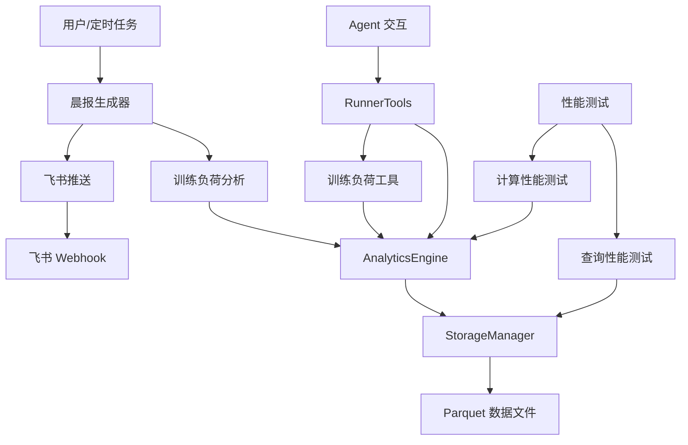
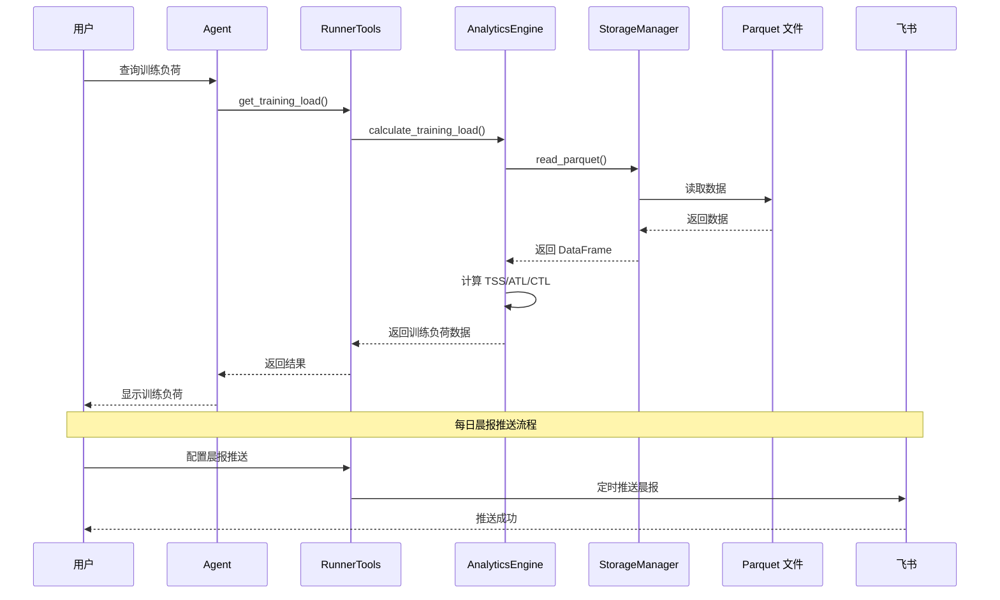
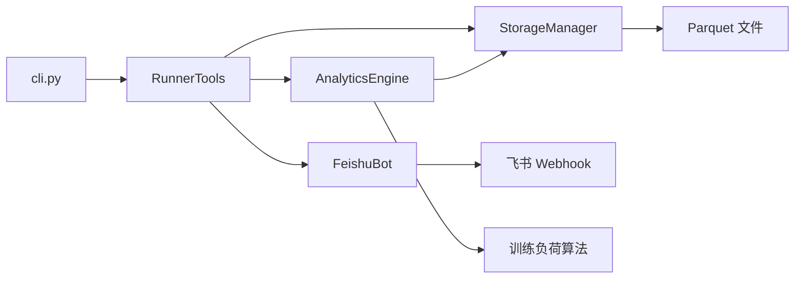

# 迭代需求规格说明书 v0.3.0

## 📋 文档信息

| 项目 | 内容 |
|------|------|
| **版本号** | v0.3.0 |
| **迭代主题** | 训练负荷完整实现与智能晨报生成 |
| **优先级** | P0 - 核心功能 |
| **依赖底座** | nanobot-ai >= 0.1.4, Python >= 3.11 |
| **文档状态** | 待评审 |
| **创建日期** | 2026-03-06 |
| **基线版本** | v0.2.0 |

---

## 1. 迭代概述

### 1.1 迭代目标

本迭代聚焦于**训练负荷体系完整实现**与**每日晨报智能生成**,补齐原始需求规格说明书中的核心功能缺口,为技术型跑者提供专业级的体能状态评估与训练建议。

### 1.2 核心价值

- **专业级体能评估**: 完整实现 TSS/ATL/CTL 训练负荷体系,提供科学化的体能状态评估
- **智能训练建议**: 基于训练负荷数据,自动生成每日训练建议和体能状态预警
- **自动化晨报推送**: 每日定时推送个性化训练报告,降低用户主动查询成本
- **数据驱动决策**: 通过可视化图表展示体能趋势,辅助训练计划制定

### 1.3 与原始需求的关系

本迭代实现原需求规格说明书中的:

- **FR-004 深度数据分析引擎** - TSS/ATL/CTL 完整计算(原需求 3.4 节)
- **FR-003 飞书交互模块** - 每日晨报推送(原需求 3.3 节)
- **NFR-001 性能要求** - 查询响应优化与性能验证
- **NFR-004 可维护性** - 测试覆盖率提升至 80% 以上

### 1.4 与 v0.2.0 的关系

- **v0.2.0 已实现**: Agent 自然语言交互入口、基础查询工具、CLI 格式化输出
- **v0.3.0 新增**: 训练负荷完整计算、每日晨报生成、性能优化、分析指标扩展

---

## 2. 功能性需求规格

### 2.1 MVP 核心需求(P0)

#### 2.1.1 训练负荷完整实现(FR-001)

**需求描述**:
完整实现 TSS(训练压力分数)、ATL(急性训练负荷)、CTL(慢性训练负荷)计算体系,为用户提供科学化的体能状态评估。

**功能规格**:

**FR-001-1 单次跑步 TSS 计算**

```python
def calculate_tss_for_run(
    self,
    distance_m: float,        # 距离(米)
    duration_s: float,        # 时长(秒)
    avg_heart_rate: float,    # 平均心率
    age: int = 30,            # 年龄(用于估算最大心率)
    threshold_pace: float = None  # 阈值配速(可选)
) -> float:
    """
    计算单次跑步的 TSS 值

    计算公式:
    - 基于心率的 TSS: TSS = (duration_s * IF) / 3600 * 100
    - IF(强度因子) = (avg_hr - rest_hr) / (max_hr - rest_hr)

    Args:
        distance_m: 距离(米)
        duration_s: 时长(秒)
        avg_heart_rate: 平均心率
        age: 年龄(默认30)
        threshold_pace: 阈值配速(秒/公里,可选)

    Returns:
        float: TSS 值(0-300+)

    验收标准:
    - ✅ 心率数据缺失时返回 0
    - ✅ 时长为 0 时返回 0
    - ✅ TSS 值范围合理(0-500)
    - ✅ 计算结果与 TrainingPeaks 标准一致(误差 < 5%)
    """
```

**FR-001-2 训练负荷计算(ATL/CTL/TSB)**

```python
def get_training_load(
    self,
    days: int = 42,           # 分析天数(默认42天)
    atl_decay: float = 7.0,   # ATL 衰减系数(默认7天)
    ctl_decay: float = 42.0   # CTL 衰减系数(默认42天)
) -> Dict[str, Any]:
    """
    获取训练负荷(ATL/CTL/TSB)

    计算公式:
    - ATL = 指数加权移动平均(TSS, 时间窗口=7天)
    - CTL = 指数加权移动平均(TSS, 时间窗口=42天)
    - TSB = CTL - ATL (训练压力平衡)

    Args:
        days: 分析天数
        atl_decay: ATL 衰减系数
        ctl_decay: CTL 衰减系数

    Returns:
        dict: {
            "atl": 急性训练负荷,
            "ctl": 慢性训练负荷,
            "tsb": 训练压力平衡,
            "fitness_level": 体能水平评估,
            "fatigue_level": 疲劳水平评估,
            "form_level": 状态水平评估,
            "recommendation": 训练建议,
            "days_analyzed": 分析天数,
            "runs_count": 跑步次数
        }

    验收标准:
    - ✅ ATL/CTL 计算使用指数加权移动平均(EWMA)
    - ✅ 数据不足时返回友好提示
    - ✅ 计算结果与 TrainingPeaks 标准一致(误差 < 10%)
    - ✅ 提供体能状态评估和训练建议
    - ✅ 性能要求: 1000 条记录计算时间 < 2 秒
    """
```

**FR-001-3 训练负荷趋势分析**

```python
def get_training_load_trend(
    self,
    days: int = 90            # 分析天数(默认90天)
) -> List[Dict[str, Any]]:
    """
    获取训练负荷趋势数据

    Args:
        days: 分析天数

    Returns:
        List[dict]: 每日训练负荷数据列表
        [
            {
                "date": "2026-03-01",
                "tss": 85.5,
                "atl": 72.3,
                "ctl": 68.5,
                "tsb": -3.8,
                "fitness_level": "良好",
                "recommendation": "保持当前训练强度"
            },
            ...
        ]

    验收标准:
    - ✅ 返回每日训练负荷数据
    - ✅ 包含体能状态评估
    - ✅ 支持可视化图表展示
    - ✅ 性能要求: 90 天数据计算时间 < 3 秒
    """
```

**体能状态评估标准**:

| TSB 范围 | 体能状态 | 训练建议 |
|---------|---------|---------|
| TSB > 25 | 极佳 | 可进行高强度训练或比赛 |
| 10 < TSB ≤ 25 | 良好 | 保持当前训练强度 |
| -10 < TSB ≤ 10 | 适中 | 正常训练,注意恢复 |
| -30 < TSB ≤ -10 | 疲劳 | 减少训练量,增加恢复 |
| TSB ≤ -30 | 过度疲劳 | 休息或轻度恢复跑 |

**验收标准**:
- ✅ TSS 计算准确,与行业标准误差 < 5%
- ✅ ATL/CTL 计算准确,与行业标准误差 < 10%
- ✅ 体能状态评估符合运动科学原理
- ✅ 训练建议具有可操作性
- ✅ 性能满足要求(1000 条记录 < 2 秒)

---

#### 2.1.2 每日晨报自动生成(FR-002)

**需求描述**:
基于训练负荷数据,自动生成每日晨报内容,通过飞书 Webhook 推送给用户。

**功能规格**:

**FR-002-1 晨报内容生成**

```python
def generate_daily_report(
    self,
    date: str = None          # 日期(默认今天)
) -> Dict[str, Any]:
    """
    生成每日晨报内容

    Args:
        date: 日期(格式: YYYY-MM-DD)

    Returns:
        dict: {
            "date": "2026-03-06",
            "greeting": "早上好,跑者!",
            "summary": {
                "total_runs": 128,
                "total_distance_km": 1250.5,
                "total_duration_hours": 125.5
            },
            "training_load": {
                "atl": 72.3,
                "ctl": 68.5,
                "tsb": -3.8,
                "fitness_level": "适中",
                "fatigue_level": "轻度疲劳"
            },
            "yesterday_activity": {
                "has_run": True,
                "distance_km": 10.5,
                "duration_min": 52.5,
                "avg_pace": "5'00\"",
                "avg_hr": 152,
                "tss": 85.5
            },
            "today_recommendation": {
                "type": "轻松跑",
                "distance_km": "5-8",
                "duration_min": "30-45",
                "intensity": "低强度(心率 < 140)",
                "reason": "昨日进行了10公里训练,建议今日进行恢复跑"
            },
            "vdot_trend": {
                "current": 45.2,
                "change": "+0.5",
                "trend": "上升"
            },
            "weekly_summary": {
                "runs_count": 5,
                "total_distance_km": 52.3,
                "total_duration_hours": 5.2,
                "avg_tss": 78.5
            },
            "weather_tip": "今日气温适宜,适合户外跑步",
            "motivation": "坚持训练,你正在变得更强!"
        }

    验收标准:
    - ✅ 晨报内容完整,包含所有关键字段
    - ✅ 训练建议基于训练负荷数据生成
    - ✅ 语言风格友好且专业
    - ✅ 生成时间 < 1 秒
    """
```

**FR-002-2 晨报推送调度**

```python
def schedule_daily_report(
    self,
    time: str = "07:00",      # 推送时间(默认早上7点)
    enabled: bool = True      # 是否启用
) -> None:
    """
    配置每日晨报推送

    Args:
        time: 推送时间(格式: HH:MM)
        enabled: 是否启用

    实现方式:
    - 使用系统定时任务(Windows Task Scheduler / cron)
    - 或使用 Python schedule 库实现轻量级调度

    验收标准:
    - ✅ 支持配置推送时间
    - ✅ 支持启用/禁用推送
    - ✅ 推送时间准确(误差 < 1 分钟)
    - ✅ 推送失败时记录日志并重试
    """
```

**FR-002-3 飞书晨报推送**

```python
def send_daily_report_to_feishu(
    self,
    report: Dict[str, Any]    # 晨报内容
) -> bool:
    """
    推送晨报到飞书

    Args:
        report: 晨报内容字典

    Returns:
        bool: 推送是否成功

    消息格式:
    - 使用飞书卡片消息格式
    - 包含关键指标和训练建议
    - 支持点击查看详细报告

    验收标准:
    - ✅ 消息格式正确
    - ✅ 推送成功率 >= 99%
    - ✅ 推送失败时记录详细日志
    - ✅ 支持 Webhook URL 配置
    """
```

**晨报卡片消息格式示例**:

```
┌─────────────────────────────────────┐
│ 🌅 每日晨报 - 2026-03-06            │
├─────────────────────────────────────┤
│ 📊 训练负荷                          │
│ • ATL: 72.3 | CTL: 68.5 | TSB: -3.8 │
│ • 体能状态: 适中                      │
│ • 疲劳程度: 轻度疲劳                  │
├─────────────────────────────────────┤
│ 🏃 昨日训练                          │
│ • 距离: 10.5km | 时长: 52'30"        │
│ • 配速: 5'00"/km | 心率: 152bpm      │
│ • TSS: 85.5                          │
├─────────────────────────────────────┤
│ 💡 今日建议                          │
│ • 类型: 轻松跑                        │
│ • 距离: 5-8km | 时长: 30-45分钟      │
│ • 强度: 低强度(心率 < 140)           │
│ • 原因: 昨日进行了10公里训练          │
├─────────────────────────────────────┤
│ 📈 VDOT 趋势                         │
│ • 当前: 45.2 (+0.5) ↗️               │
├─────────────────────────────────────┤
│ 💪 每日激励                          │
│ 坚持训练,你正在变得更强!              │
└─────────────────────────────────────┘
```

**验收标准**:
- ✅ 晨报内容完整且准确
- ✅ 训练建议科学合理
- ✅ 推送时间可配置
- ✅ 推送成功率 >= 99%
- ✅ 消息格式友好美观

---

#### 2.1.3 性能优化与测试补充(FR-003)

**需求描述**:
补充性能测试,确保查询响应时间满足架构设计要求;提升测试覆盖率至 80% 以上。

**功能规格**:

**FR-003-1 性能基准测试**

```python
# tests/performance/test_query_performance.py

class TestQueryPerformance:
    """查询性能基准测试"""

    @pytest.mark.performance
    def test_query_by_date_range_performance(self):
        """测试日期范围查询性能"""
        # 性能要求: 1000 条记录 < 1 秒, 10000 条记录 < 3 秒
        pass

    @pytest.mark.performance
    def test_query_by_distance_performance(self):
        """测试距离范围查询性能"""
        # 性能要求: 1000 条记录 < 1 秒, 10000 条记录 < 3 秒
        pass

    @pytest.mark.performance
    def test_get_vdot_trend_performance(self):
        """测试 VDOT 趋势查询性能"""
        # 性能要求: 1000 条记录 < 1 秒
        pass

    @pytest.mark.performance
    def test_get_training_load_performance(self):
        """测试训练负荷计算性能"""
        # 性能要求: 1000 条记录 < 2 秒
        pass

    @pytest.mark.performance
    def test_generate_daily_report_performance(self):
        """测试晨报生成性能"""
        # 性能要求: 生成时间 < 1 秒
        pass
```

**FR-003-2 测试覆盖率提升**

目标覆盖率:
- `src/core/analytics.py`: ≥ 85%
- `src/agents/tools.py`: ≥ 85%
- `src/notify/feishu.py`: ≥ 80%
- `src/cli_formatter.py`: ≥ 80%
- **总体覆盖率**: ≥ 80%

**FR-003-3 Polars 查询优化**

优化策略:
- ✅ 使用 LazyFrame 延迟加载
- ✅ 谓词下推(Predicate Pushdown)
- ✅ 列剪枝(Column Pruning)
- ✅ 添加查询缓存机制
- ✅ 优化训练负荷计算算法

**验收标准**:
- ✅ 所有查询接口响应时间 < 3 秒(10000 条记录)
- ✅ 训练负荷计算响应时间 < 2 秒(1000 条记录)
- ✅ 晨报生成时间 < 1 秒
- ✅ 总体测试覆盖率 ≥ 80%
- ✅ 性能测试全部通过

---

#### 2.1.4 分析指标扩展(FR-004)

**需求描述**:
扩展分析指标,提供更丰富的数据洞察。

**功能规格**:

**FR-004-1 配速分布分析**

```python
def get_pace_distribution(
    self,
    days: int = 30            # 分析天数
) -> Dict[str, Any]:
    """
    获取配速分布分析

    Args:
        days: 分析天数

    Returns:
        dict: {
            "pace_zones": {
                "zone1": {"range": ">6'00\"", "count": 5, "percentage": 25%},
                "zone2": {"range": "5'30\"-6'00\"", "count": 8, "percentage": 40%},
                "zone3": {"range": "5'00\"-5'30\"", "count": 4, "percentage": 20%},
                "zone4": {"range": "4'30\"-5'00\"", "count": 2, "percentage": 10%},
                "zone5": {"range": "<4'30\"", "count": 1, "percentage": 5%}
            },
            "avg_pace": "5'30\"",
            "best_pace": "4'45\"",
            "worst_pace": "6'15\"",
            "pace_trend": "稳定"
        }
    """
```

**FR-004-2 心率区间分析**

```python
def get_heart_rate_zones(
    self,
    days: int = 30,           # 分析天数
    age: int = 30             # 年龄
) -> Dict[str, Any]:
    """
    获取心率区间分析

    Args:
        days: 分析天数
        age: 年龄

    Returns:
        dict: {
            "zones": {
                "zone1": {"range": "50-60% HRmax", "time_min": 120, "percentage": 15%},
                "zone2": {"range": "60-70% HRmax", "time_min": 300, "percentage": 38%},
                "zone3": {"range": "70-80% HRmax", "time_min": 280, "percentage": 35%},
                "zone4": {"range": "80-90% HRmax", "time_min": 80, "percentage": 10%},
                "zone5": {"range": "90-100% HRmax", "time_min": 20, "percentage": 2%}
            },
            "avg_hr": 152,
            "max_hr": 178,
            "hr_trend": "稳定"
        }
    """
```

**FR-004-3 训练效果评估**

```python
def get_training_effect(
    self,
    days: int = 30            # 分析天数
) -> Dict[str, Any]:
    """
    获取训练效果评估

    Args:
        days: 分析天数

    Returns:
        dict: {
            "aerobic_effect": 3.8,        # 有氧效果(1-5)
            "anaerobic_effect": 2.5,      # 无氧效果(1-5)
            "recovery_time_hours": 24,    # 恢复时间(小时)
            "vo2max_estimate": 52.5,      # VO2max 估算值
            "lactate_threshold_hr": 165   # 乳酸阈值心率
        }
    """
```

**验收标准**:
- ✅ 配速分布分析准确
- ✅ 心率区间分析符合运动科学原理
- ✅ 训练效果评估合理
- ✅ 性能要求: 计算时间 < 2 秒

---

### 2.2 扩展需求(P1)

#### 2.2.1 可视化图表生成(FR-005)

**需求描述**:
生成训练负荷趋势图、VDOT 趋势图等可视化图表。

**功能规格**:
- 支持生成训练负荷趋势图(ATL/CTL/TSB)
- 支持生成 VDOT 趋势图
- 支持生成心率区间分布图
- 支持导出为 PNG/SVG 格式

**验收标准**:
- ✅ 图表清晰美观
- ✅ 图表生成时间 < 3 秒
- ✅ 支持多种格式导出

*注: 本功能需要可视化库支持(如 matplotlib、plotly),可在 v0.3.1 实现*

---

#### 2.2.2 Agent 交互功能完善(FR-006)

**需求描述**:
完善 Agent 自然语言交互功能,支持本地模型配置。

**功能规格**:
- 支持配置本地模型路径
- 支持多种模型格式(GGUF、ONNX 等)
- 优化 Agent 响应速度
- 提升意图识别准确率

**验收标准**:
- ✅ 支持本地模型配置
- ✅ Agent 响应时间 < 2 秒
- ✅ 意图识别准确率 >= 95%

*注: 本功能依赖 nanobot-ai 底座更新,可在 v0.3.1 实现*

---

#### 2.2.3 配速字段存储优化(FR-007)

**需求描述**:
优化配速字段的存储和计算方式。

**功能规格**:
- 将配速字段从计算字段改为存储字段
- 优化配速计算精度
- 支持配速单位转换(分钟/公里 vs 分钟/英里)

**验收标准**:
- ✅ 配速存储精度提升
- ✅ 查询性能提升 > 20%
- ✅ 支持单位转换

*注: 本功能需要修改 Parquet Schema,可在 v0.3.1 实现*

---

## 3. 非功能性需求

### 3.1 性能要求(NFR-001)

| 指标 | 要求 | 测量方法 |
|------|------|---------|
| TSS 计算 | < 0.1 秒/条 | 单条记录计算时间 |
| 训练负荷计算 | < 2 秒 | 1000 条记录计算时间 |
| 晨报生成 | < 1 秒 | 生成完整晨报时间 |
| 查询响应 | < 3 秒 | 10000 条记录查询时间 |
| 内存占用 | < 600MB | 峰值内存使用 |

**验收标准**:
- ✅ 所有性能指标通过测试
- ✅ 性能测试在标准硬件环境执行(8GB RAM, SSD)
- ✅ 提供性能基准测试报告

---

### 3.2 数据隐私(NFR-002)

**需求描述**:
严格遵循本地化数据处理原则,确保用户隐私。

**技术要求**:
- 所有数据存储在本地(~/.nanobot-runner/data/)
- 晨报推送仅发送摘要数据,不包含原始 FIT 数据
- 飞书 Webhook URL 支持用户自定义配置
- 支持禁用飞书推送功能

**验收标准**:
- ✅ 网络监控无外部请求(除飞书推送外)
- ✅ 飞书推送仅包含摘要数据
- ✅ 提供隐私政策说明文档

---

### 3.3 兼容性(NFR-003)

**支持平台**:
- Windows 10/11 (PowerShell 5.1+)
- macOS 11+ (Bash/Zsh)
- Linux (Ubuntu 20.04+, CentOS 7+)

**验收标准**:
- ✅ 在三个平台上通过所有测试
- ✅ 提供各平台的安装和配置指南
- ✅ 处理平台差异(如路径分隔符、编码)

---

### 3.4 可维护性(NFR-004)

**技术要求**:
- 代码覆盖率 >= 80%
- 类型注解完整率 >= 90%
- 文档完整率 >= 95%

**验收标准**:
- ✅ 单元测试覆盖率报告
- ✅ 类型检查通过(mypy)
- ✅ API 文档自动生成

---

### 3.5 可扩展性(NFR-005)

**技术要求**:
- 训练负荷算法支持自定义参数
- 晨报模板支持自定义
- 分析指标支持插件化扩展

**验收标准**:
- ✅ 支持配置文件自定义参数
- ✅ 支持自定义晨报模板
- ✅ 提供扩展开发指南

---

## 4. 数据规模与性能指标

### 4.1 数据规模支持

| 指标 | 要求 | 当前基线 |
|------|------|---------|
| 活动记录数 | 10,000+ 条 | 已支持 |
| Parquet 数据集 | 500MB - 2GB | 已支持 |
| 训练负荷计算 | 1000 条 < 2 秒 | 待验证 |
| 晨报生成 | < 1 秒 | 待验证 |

### 4.2 并发能力

**要求**:
- 支持 1 路写入(导入)与 1 路读取(Agent 分析)
- 采用文件锁或写时复制策略避免冲突

**验收标准**:
- ✅ 并发读写测试通过
- ✅ 无数据损坏或丢失
- ✅ 性能下降 < 20%

---

## 5. 核心业务场景覆盖

### 5.1 场景分类

| 场景类别 | 场景数量 | 覆盖率要求 |
|---------|---------|-----------|
| 训练负荷查询 | 5+ | 100% |
| 晨报生成与推送 | 3+ | 100% |
| 性能测试 | 5+ | 100% |
| 分析指标扩展 | 3+ | 100% |

### 5.2 典型场景示例

#### 场景 1: 训练负荷查询

```
用户: 我现在的体能状态怎么样?
Agent 行为:
1. 调用 get_training_load()
2. 分析 ATL/CTL/TSB 数据
3. 生成体能状态评估
期望输出:
您的当前体能状态评估:
• ATL(急性负荷): 72.3
• CTL(慢性负荷): 68.5
• TSB(训练压力平衡): -3.8
• 体能状态: 适中
• 疲劳程度: 轻度疲劳
• 训练建议: 正常训练,注意恢复
```

#### 场景 2: 每日晨报推送

```
系统行为:
1. 每日早上 7:00 自动触发
2. 调用 generate_daily_report()
3. 推送到飞书 Webhook
期望输出:
🌅 每日晨报 - 2026-03-06
📊 训练负荷: ATL 72.3 | CTL 68.5 | TSB -3.8
🏃 昨日训练: 10.5km | 52'30" | TSS 85.5
💡 今日建议: 轻松跑 5-8km | 低强度
📈 VDOT: 45.2 (+0.5) ↗️
```

#### 场景 3: 训练负荷趋势查询

```
用户: 展示我最近 3 个月的训练负荷趋势
Agent 行为:
1. 调用 get_training_load_trend(days=90)
2. 生成趋势数据
3. 格式化输出
期望输出:
训练负荷趋势(最近 90 天):
• 平均 ATL: 70.5
• 平均 CTL: 65.2
• ATL/CTL 比值: 1.08
• 体能状态趋势: 稳定上升
• 建议: 保持当前训练节奏
```

---

## 6. 验收标准汇总

### 6.1 MVP 核心需求验收清单

| 编号 | 需求项 | 验收方法 | 优先级 | 状态 |
|------|--------|---------|--------|------|
| FR-001 | 训练负荷完整实现 | 单元测试 + 集成测试 + 性能测试 | P0 | 待验收 |
| FR-002 | 每日晨报自动生成 | 功能测试 + 推送测试 | P0 | 待验收 |
| FR-003 | 性能优化与测试补充 | 性能测试 + 覆盖率测试 | P0 | 待验收 |
| FR-004 | 分析指标扩展 | 单元测试 + 功能测试 | P0 | 待验收 |

### 6.2 性能验收标准

| 测试场景 | 数据规模 | 响应时间要求 | 实测结果 | 状态 |
|---------|---------|-------------|---------|------|
| TSS 计算 | 单条记录 | < 0.1 秒 | 待测试 | 待验收 |
| 训练负荷计算 | 1000 条记录 | < 2 秒 | 待测试 | 待验收 |
| 晨报生成 | - | < 1 秒 | 待测试 | 待验收 |
| 日期范围查询 | 10000 条记录 | < 3 秒 | 待测试 | 待验收 |
| 距离范围查询 | 10000 条记录 | < 3 秒 | 待测试 | 待验收 |

### 6.3 质量验收标准

| 指标 | 要求 | 测量工具 | 状态 |
|------|------|---------|------|
| 单元测试覆盖率 | >= 80% | pytest-cov | 待测试 |
| 类型检查通过率 | 100% | mypy | 待测试 |
| 代码格式化 | 100% | black, isort | 待测试 |
| 安全扫描 | 无高危漏洞 | bandit | 待测试 |
| TSS 计算准确率 | >= 95% | 测试集验证 | 待测试 |
| 晨报推送成功率 | >= 99% | 推送测试 | 待测试 |

---

## 7. 技术架构设计

### 7.1 系统架构图



### 7.2 数据流图



### 7.3 组件依赖关系



---

## 8. 实施计划

### 8.1 开发任务分解

| 任务 ID | 任务名称 | 预估工时 | 优先级 | 依赖 |
|--------|---------|---------|--------|------|
| T001 | 实现 TSS 计算功能 | 4h | P0 | - |
| T002 | 实现 ATL/CTL/TSB 计算 | 6h | P0 | T001 |
| T003 | 实现训练负荷趋势分析 | 4h | P0 | T002 |
| T004 | 实现晨报内容生成 | 6h | P0 | T002 |
| T005 | 实现晨报推送调度 | 4h | P0 | T004 |
| T006 | 集成飞书推送 | 3h | P0 | T005 |
| T007 | 补充性能测试 | 6h | P0 | T001-T006 |
| T008 | 提升测试覆盖率 | 8h | P0 | T001-T006 |
| T009 | 实现配速分布分析 | 4h | P0 | - |
| T010 | 实现心率区间分析 | 4h | P0 | - |
| T011 | 实现训练效果评估 | 4h | P0 | - |
| T012 | Polars 查询优化 | 4h | P1 | T007 |
| T013 | 文档编写 | 4h | P1 | T001-T011 |

**总预估工时**: 61 小时(约 8 个工作日)

### 8.2 里程碑

| 里程碑 | 时间节点 | 交付物 |
|--------|---------|--------|
| M1: 训练负荷功能实现 | Day 3 | TSS/ATL/CTL 计算功能 |
| M2: 晨报生成与推送 | Day 5 | 每日晨报自动推送 |
| M3: 性能优化与测试 | Day 7 | 性能测试通过,覆盖率 >= 80% |
| M4: 分析指标扩展 | Day 8 | 配速/心率区间分析 |
| M5: 发布准备 | Day 10 | v0.3.0 正式发布 |

---

## 9. 风险评估与应对

### 9.1 技术风险

| 风险项 | 可能性 | 影响程度 | 应对策略 |
|--------|--------|---------|---------|
| TSS 计算准确率不达标 | 中 | 高 | 参考 TrainingPeaks 标准,进行对比测试 |
| 性能不达标 | 中 | 高 | 使用 Polars Lazy API 优化,添加缓存 |
| 飞书推送失败 | 低 | 中 | 实现重试机制,记录详细日志 |
| 测试覆盖率不足 | 中 | 中 | 制定详细测试计划,自动化测试 |

### 9.2 项目风险

| 风险项 | 可能性 | 影响程度 | 应对策略 |
|--------|--------|---------|---------|
| 开发周期延期 | 中 | 中 | 优先保证 MVP,扩展功能延后 |
| 需求变更 | 低 | 低 | 严格需求评审,变更需评估影响 |
| 依赖库更新 | 低 | 低 | 锁定依赖版本,定期更新 |

---

## 10. 附录

### 10.1 术语表

| 术语 | 定义 |
|------|------|
| TSS | 训练压力分数(Training Stress Score),衡量单次训练强度的指标 |
| ATL | 急性训练负荷(Acute Training Load),7 天平均 TSS |
| CTL | 慢性训练负荷(Chronic Training Load),42 天平均 TSS |
| TSB | 训练压力平衡(Training Stress Balance),CTL - ATL |
| VDOT | 跑力值,衡量跑步能力的指标 |
| EWMA | 指数加权移动平均(Exponentially Weighted Moving Average) |

### 10.2 参考资料

1. [TrainingPeaks TSS 计算标准](https://www.trainingpeaks.com/blog/what-is-tss/)
2. [Polars 性能优化指南](https://pola-rs.github.io/polars/)
3. [飞书开放平台文档](https://open.feishu.cn/document/)
4. [运动生理学基础](https://www.ncbi.nlm.nih.gov/)

### 10.3 变更历史

| 版本 | 日期 | 变更内容 | 作者 |
|------|------|---------|------|
| v0.1 | 2026-03-06 | 初始版本 | 架构师智能体 |

---

## 11. 评审与验收

### 11.1 评审 Checklist

- [ ] 需求无歧义,描述清晰
- [ ] 覆盖所有核心业务场景
- [ ] 验收标准可量化、可测试
- [ ] 技术方案可行
- [ ] 风险评估充分
- [ ] 开发计划合理

### 11.2 验收流程

1. **开发自测**: 开发者完成功能后进行自测
2. **测试验证**: 测试工程师执行验收测试
3. **性能测试**: 执行性能基准测试
4. **代码审查**: 架构师进行代码审查
5. **用户验收**: 最终用户进行验收测试
6. **发布审批**: 项目经理审批发布

---

**文档状态**: 待评审
**下次更新**: 评审通过后更新
**发布版本**: v0.3.0
