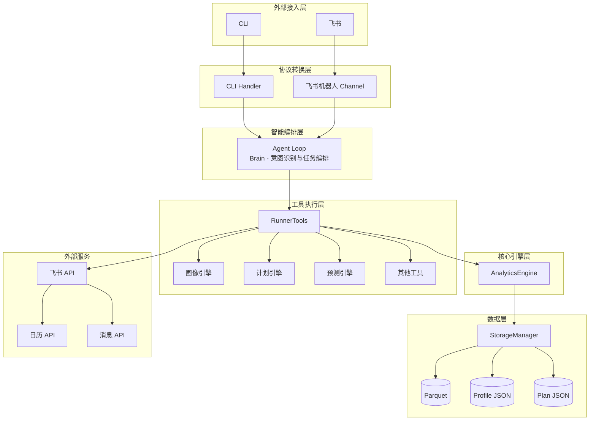

# 迭代需求规格说明书 v0.4.0

## 📋 文档信息

| 项目 | 内容 |
|------|------|
| **版本号** | v0.4.0-spec-v0.2 |
| **迭代主题** | 智能个性化 + 飞书深度集成 |
| **优先级** | P0 - 核心功能 |
| **依赖底座** | nanobot-ai >= 0.1.4, Python >= 3.11 |
| **文档状态** | 已修订 - 待评审 |
| **创建日期** | 2026-03-18 |
| **修订日期** | 2026-03-18 |
| **基线版本** | v0.3.1 |

---

## 1. 迭代概述

### 1.1 迭代目标

本迭代聚焦于**智能个性化**与**飞书深度集成**，通过用户画像系统实现真正个性化的训练建议，并通过飞书平台实现日程级别的训练管理。

### 1.2 核心价值

- **用户画像系统**：基于历史数据构建多维度画像，实现个性化训练建议
- **训练计划智能化**：根据用户画像和目标自动生成周期化训练计划
- **飞书深度集成**：训练计划同步到飞书日历，实现双向交互
- **增强用户体验**：智能训练回顾、比赛预测

### 1.3 与 v0.3.1 的关系

| 模块 | v0.3.1 已实现 | v0.4.0 新增 |
|------|--------------|-------------|
| 分析引擎 | TSS/ATL/CTL计算 | 用户画像、比赛预测 |
| Agent工具 | 8个基础工具 | 7+个新工具 |
| 飞书集成 | 单向推送 | 双向交互、日历同步 |
| 定时任务 | 每日晨报 | 周报、计划提醒 |
| 存储系统 | Parquet数据存储 | 画像+计划持久化 |

---

## 2. 功能性需求规格

### 2.1 P0 级需求

#### 2.1.1 智能跑步画像系统 (FR-001)

**需求描述**:
基于用户历史训练数据构建多维度画像，实现真正个性化的训练建议。

**功能规格**:

**FR-001-1 画像引擎核心类**

```python
class RunnerProfileEngine:
    """用户画像引擎"""
    
    def __init__(self, storage: StorageManager, analytics: AnalyticsEngine):
        self.storage = storage
        self.analytics = analytics
        self.profile_path = self.storage.config.base_dir / "profile.json"
    
    def build_profile(self) -> RunnerProfile:
        """
        构建用户画像
        
        Returns:
            RunnerProfile: 用户画像对象
        """
        pass
    
    def update_profile(self, activity_data: Dict) -> None:
        """
        增量更新画像
        
        Args:
            activity_data: 新增训练数据
        """
        pass
    
    def get_fitness_level(self) -> FitnessLevel:
        """获取跑力水平维度"""
        pass
    
    def get_training_pattern(self) -> TrainingPattern:
        """获取训练习惯维度"""
        pass
    
    def get_recovery_capacity(self) -> RecoveryCapacity:
        """获取恢复能力维度"""
        pass
    
    def calculate_injury_risk(self) -> InjuryRisk:
        """计算伤病风险"""
        pass
```

**FR-001-2 画像数据结构**

```python
@dataclass
class RunnerProfile:
    user_id: str
    profile_version: str
    last_updated: datetime
    
    fitness_level: FitnessLevel
    training_pattern: TrainingPattern
    recovery_capacity: RecoveryCapacity
    goal_preference: GoalPreference
    injury_risk: InjuryRisk
    summary: ProfileSummary
    
    stale_status: ProfileStaleStatus
    confidence_level: float

@dataclass
class FitnessLevel:
    current_vdot: float
    vdot_trend: str
    best_vdot: float
    vdot_history: List[float]
    fitness_score: int
    
@dataclass
class TrainingPattern:
    weekly_frequency: float
    preferred_time: str
    avg_distance_km: float
    distance_distribution: Dict[str, float]
    consistency_score: int
    
@dataclass
class RecoveryCapacity:
    avg_recovery_hours: int
    recovery_rate: float
    tsb_average: float
    hr_drift_trend: str
    
@dataclass
class InjuryRisk:
    risk_level: str
    risk_factors: List[str]
    recommendations: List[str]
    last_assessment: datetime

@dataclass
class ProfileStaleStatus:
    is_stale: bool
    days_since_update: int
    stale_threshold_days: int = 7
    recommendation: Optional[str] = None
```

**FR-001-3 画像保鲜期机制**

```python
def check_profile_freshness(profile: RunnerProfile) -> ProfileStaleStatus:
    """
    检查画像数据新鲜度
    
    保鲜期规则:
    - 数据超过 7 天未更新，标记为"陈旧"
    - 陈旧画像在预测和建议中降权使用
    - 超过 14 天未更新，建议用户重新校准
    """
    days_since_update = (datetime.now() - profile.last_updated).days
    
    is_stale = days_since_update > 7
    recommendation = None
    
    if days_since_update > 14:
        recommendation = "画像数据已过时，建议导入最新训练数据重新校准"
    elif days_since_update > 7:
        recommendation = "画像数据可能已过时，建议更新训练数据"
    
    return ProfileStaleStatus(
        is_stale=is_stale,
        days_since_update=days_since_update,
        stale_threshold_days=7,
        recommendation=recommendation
    )
```

**FR-001-4 异常数据过滤规则**

```python
ANOMALY_FILTER_RULES = {
    "pace_too_fast": {
        "condition": lambda pace: pace < 120,  # 配速 < 2:00/km (秒/公里)
        "description": "配速异常快，可能为GPS漂移",
        "action": "exclude_from_vdot"
    },
    "pace_too_slow": {
        "condition": lambda pace: pace > 600,  # 配速 > 10:00/km
        "description": "配速异常慢，可能为步行或间歇",
        "action": "exclude_from_vdot"
    },
    "hr_abnormal": {
        "condition": lambda hr: hr < 40 or hr > 220,
        "description": "心率数据异常",
        "action": "exclude_all"
    },
    "distance_unreasonable": {
        "condition": lambda dist: dist < 0.5 or dist > 100,
        "description": "距离数据不合理",
        "action": "flag_for_review"
    }
}

def filter_anomaly_data(activity: Activity) -> Tuple[Activity, List[str]]:
    """
    过滤异常数据
    
    Returns:
        Tuple[Activity, List[str]]: (过滤后的活动, 异常标记列表)
    """
    flags = []
    
    for rule_name, rule in ANOMALY_FILTER_RULES.items():
        if rule["condition"](activity):
            flags.append(rule["description"])
            if rule["action"] == "exclude_all":
                return None, flags
            elif rule["action"] == "exclude_from_vdot":
                activity.exclude_from_vdot = True
    
    return activity, flags
```

**FR-001-5 画像计算算法**

```python
def calculate_fitness_score(vdot: float, vdot_trend: List[float]) -> int:
    """
    计算体能评分 (1-100)
    
    评分规则:
    - 基础分: VDOT * 1.5 (VDOT 40 -> 60分)
    - 趋势加分: 上升趋势 +5, 下降趋势 -5
    - 稳定性加分: 标准差 < 1 加 +5
    """
    base_score = vdot * 1.5
    
    if len(vdot_trend) >= 3:
        trend = vdot_trend[-1] - vdot_trend[0]
        if trend > 0:
            base_score += 5
        elif trend < 0:
            base_score -= 5
        
        std = statistics.stdev(vdot_trend)
        if std < 1:
            base_score += 5
    
    return min(max(int(base_score), 1), 100)

def calculate_consistency_score(
    training_dates: List[date],
    weeks: int = 4
) -> int:
    """
    计算训练一致性评分 (1-100)
    
    评分规则:
    - 基于过去N周的训练频率一致性
    - 每周训练天数标准差越小，评分越高
    """
    pass

def assess_injury_risk(
    tss_values: List[float],
    tsb_values: List[float],
    hr_drift_values: List[float]
) -> InjuryRisk:
    """
    评估伤病风险
    
    风险因素:
    - 训练负荷周增长率 > 10%
    - TSB 连续7天 < -15
    - 心率漂移持续恶化
    """
    pass
```

**验收标准**:
- ✅ 画像生成时间 < 3 秒
- ✅ 画像更新时间 < 2 秒
- ✅ 画像数据本地存储
- ✅ 支持画像导出为 JSON 格式

---

#### 2.1.2 个性化训练计划生成 (FR-002)

**需求描述**:
根据用户画像和目标，自动生成周期化训练计划，支持动态调整。

**功能规格**:

**FR-002-1 训练计划引擎**

```python
class TrainingPlanEngine:
    """训练计划生成引擎"""
    
    def __init__(
        self,
        profile_engine: RunnerProfileEngine,
        analytics: AnalyticsEngine
    ):
        self.profile = profile_engine
        self.analytics = analytics
    
    def generate_plan(
        self,
        goal: str,
        race_date: Optional[date] = None,
        duration_weeks: Optional[int] = None
    ) -> TrainingPlan:
        """
        生成训练计划
        
        Args:
            goal: 目标（如"全马400"）
            race_date: 比赛日期
            duration_weeks: 训练周期（周）
        
        Returns:
            TrainingPlan: 训练计划对象
        """
        pass
    
    def adjust_plan(
        self,
        plan: TrainingPlan,
        completion_rate: float,
        current_tsb: float
    ) -> TrainingPlan:
        """
        动态调整训练计划
        
        Args:
            plan: 当前计划
            completion_rate: 训练完成率
            current_tsb: 当前TSB
        
        Returns:
            TrainingPlan: 调整后的计划
        """
        pass
    
    def get_daily_workout(
        self,
        plan: TrainingPlan,
        date: date
    ) -> DailyPlan:
        """获取指定日期的训练计划"""
        pass
```

**FR-002-2 训练计划数据结构**

```python
@dataclass
class TrainingPlan:
    plan_id: str
    goal: str
    target_race: Optional[str]
    race_date: Optional[date]
    duration_weeks: int
    start_date: date
    current_phase: str
    current_week: int
    
    weekly_schedule: List[WeeklySchedule]
    target_vdot: float
    estimated_race_time: str
    
    created_at: datetime
    updated_at: datetime

@dataclass
class WeeklySchedule:
    week_number: int
    phase: str
    total_distance_km: float
    total_duration_hours: float
    daily_plans: List[DailyPlan]

@dataclass
class DailyPlan:
    day_of_week: str
    workout_type: str
    distance_km: Optional[float]
    duration_min: Optional[int]
    intensity: str
    target_hr_zone: Optional[str]
    description: str
    completed: bool
    actual_data: Optional[Dict]
```

**FR-002-3 训练阶段划分算法**

```python
PHASE_CONFIG = {
    "基础期": {
        "weeks_ratio": 0.40,
        "workout_distribution": {
            "轻松跑": 0.60,
            "长距离跑": 0.25,
            "节奏跑": 0.10,
            "间歇跑": 0.05,
        }
    },
    "强化期": {
        "weeks_ratio": 0.30,
        "workout_distribution": {
            "轻松跑": 0.40,
            "长距离跑": 0.20,
            "节奏跑": 0.20,
            "间歇跑": 0.20,
        }
    },
    "巅峰期": {
        "weeks_ratio": 0.20,
        "workout_distribution": {
            "轻松跑": 0.30,
            "长距离跑": 0.15,
            "节奏跑": 0.25,
            "间歇跑": 0.30,
        }
    },
    "减量期": {
        "weeks_ratio": 0.10,
        "workout_distribution": {
            "轻松跑": 0.70,
            "长距离跑": 0.10,
            "节奏跑": 0.10,
            "间歇跑": 0.10,
        }
    }
}

def generate_weekly_schedule(
    phase: str,
    week_number: int,
    target_vdot: float,
    current_vdot: float
) -> WeeklySchedule:
    """
    生成周训练计划
    
    Args:
        phase: 训练阶段
        week_number: 周次
        target_vdot: 目标VDOT
        current_vdot: 当前VDOT
    
    Returns:
        WeeklySchedule: 周训练计划
    """
    pass
```

**FR-002-4 动态调整算法（增强版）**

```python
@dataclass
class AdjustmentContext:
    """训练计划调整上下文"""
    completion_rate: float       # 训练完成率 (0-1)
    current_tsb: float           # 当前TSB
    avg_hr_drift: float          # 平均心率漂移百分比
    rpe_score: Optional[int]     # 主观疲劳度 (1-10)，用户可选填写
    recent_injury_flags: List[str]  # 近期伤病标记

def adjust_training_intensity(
    context: AdjustmentContext,
    base_intensity: str
) -> Tuple[str, List[str]]:
    """
    根据多维度指标调整训练强度
    
    Args:
        context: 调整上下文，包含完成率、TSB、心率漂移、主观疲劳度等
        base_intensity: 基础强度
    
    Returns:
        Tuple[str, List[str]]: (调整结果, 调整原因列表)
    """
    reasons = []
    adjustment = "maintain"
    
    if context.current_tsb > 10 and context.completion_rate >= 0.8 and context.avg_hr_drift < 3.0:
        adjustment = "increase"
        reasons.append(f"TSB良好({context.current_tsb})，完成率高({context.completion_rate:.0%})，心率漂移正常")
    elif context.current_tsb < -10:
        adjustment = "decrease_significantly"
        reasons.append(f"TSB过低({context.current_tsb})，需要大幅减量")
    elif context.current_tsb < 0:
        adjustment = "decrease"
        reasons.append(f"TSB偏低({context.current_tsb})，建议降低强度")
    
    if context.avg_hr_drift > 5.0:
        if adjustment != "decrease_significantly":
            adjustment = "decrease"
        reasons.append(f"心率漂移过高({context.avg_hr_drift:.1f}%)，强度可能过大")
    
    if context.rpe_score and context.rpe_score >= 8:
        if adjustment != "decrease_significantly":
            adjustment = "decrease"
        reasons.append(f"主观疲劳度高(RPE={context.rpe_score})，建议休息或轻松跑")
    
    if context.recent_injury_flags:
        adjustment = "decrease_significantly"
        reasons.append(f"检测到伤病风险: {', '.join(context.recent_injury_flags)}")
    
    return adjustment, reasons
```

**FR-002-5 训练阶段动态配置**

```python
def get_phase_config_by_fitness_level(fitness_level: str) -> Dict:
    """
    根据体能水平动态调整阶段配置
    
    不同水平跑者的周期划分不同：
    - 新手：基础期更长，强化期较短
    - 进阶：各阶段均衡
    - 高级：强化期和巅峰期可适当延长
    """
    configs = {
        "beginner": {
            "基础期": {"weeks_ratio": 0.50},
            "强化期": {"weeks_ratio": 0.25},
            "巅峰期": {"weeks_ratio": 0.15},
            "减量期": {"weeks_ratio": 0.10},
        },
        "intermediate": {
            "基础期": {"weeks_ratio": 0.40},
            "强化期": {"weeks_ratio": 0.30},
            "巅峰期": {"weeks_ratio": 0.20},
            "减量期": {"weeks_ratio": 0.10},
        },
        "advanced": {
            "基础期": {"weeks_ratio": 0.35},
            "强化期": {"weeks_ratio": 0.30},
            "巅峰期": {"weeks_ratio": 0.25},
            "减量期": {"weeks_ratio": 0.10},
        }
    }
    return configs.get(fitness_level, configs["intermediate"])
```

**验收标准**:
- ✅ 训练计划生成时间 < 5 秒
- ✅ 计划符合运动科学原理
- ✅ 支持导出为 JSON/CSV 格式
- ✅ 支持动态调整

---

#### 2.1.3 飞书日历训练计划同步 (FR-003)

**需求描述**:
训练计划自动同步到飞书日历，实现日程级别的训练管理。

**功能规格**:

**FR-003-1 飞书日历同步服务**

```python
class FeishuCalendarSync:
    """飞书日历同步服务"""
    
    def __init__(self, config: CalendarSyncConfig):
        self.config = config
        self.access_token = None
    
    async def sync_plan(
        self,
        plan: TrainingPlan
    ) -> SyncResult:
        """
        同步训练计划到飞书日历
        
        Args:
            plan: 训练计划
        
        Returns:
            SyncResult: 同步结果
        """
        pass
    
    async def sync_daily_workout(
        self,
        daily_plan: DailyPlan,
        date: date
    ) -> SyncResult:
        """
        同步单日训练到日历
        
        Args:
            daily_plan: 日训练计划
            date: 日期
        
        Returns:
            SyncResult: 同步结果
        """
        pass
    
    async def update_event(
        self,
        event_id: str,
        daily_plan: DailyPlan
    ) -> SyncResult:
        """更新日历事件"""
        pass
    
    async def delete_event(
        self,
        event_id: str
    ) -> SyncResult:
        """删除日历事件"""
        pass
    
    async def check_conflicts(
        self,
        date: date,
        time_range: Tuple[time, time]
    ) -> List[CalendarEvent]:
        """检测日程冲突"""
        pass
```

**FR-003-2 日历事件构建**

```python
def build_calendar_event(
    daily_plan: DailyPlan,
    date: date,
    config: CalendarSyncConfig
) -> CalendarEventCreateRequest:
    """
    构建飞书日历事件请求
    
    Args:
        daily_plan: 日训练计划
        date: 日期
        config: 同步配置
    
    Returns:
        CalendarEventCreateRequest: 日历事件创建请求
    """
    event = CalendarEventCreateRequest(
        summary=f"🏃 {daily_plan.workout_type} - {format_distance(daily_plan.distance_km)}",
        start_time=datetime.combine(date, time(6, 0)),  # 默认早上6点
        end_time=datetime.combine(date, time(6, 0)) + timedelta(minutes=daily_plan.duration_min),
        description=build_event_description(daily_plan),
        reminders=[
            Reminder(minutes=config.reminder_minutes)
        ]
    )
    return event

def build_event_description(daily_plan: DailyPlan) -> str:
    """构建事件描述"""
    lines = [
        f"训练类型: {daily_plan.workout_type}",
        f"目标距离: {daily_plan.distance_km} km" if daily_plan.distance_km else "",
        f"目标时长: {daily_plan.duration_min} 分钟" if daily_plan.duration_min else "",
        f"强度: {daily_plan.intensity}",
        f"目标心率区间: {daily_plan.target_hr_zone}" if daily_plan.target_hr_zone else "",
        "",
        f"训练说明: {daily_plan.description}"
    ]
    return "\n".join([line for line in lines if line])
```

**FR-003-3 飞书API调用**

```python
class FeishuCalendarAPI:
    """飞书日历API封装"""
    
    BASE_URL = "https://open.feishu.cn/open-apis/calendar/v4"
    
    async def create_event(
        self,
        calendar_id: str,
        event: CalendarEventCreateRequest
    ) -> APIResponse:
        """
        创建日历事件
        
        API: POST /calendarEvents
        """
        pass
    
    async def update_event(
        self,
        event_id: str,
        event: CalendarEventUpdateRequest
    ) -> APIResponse:
        """
        更新日历事件
        
        API: PATCH /calendarEvents/{event_id}
        """
        pass
    
    async def delete_event(
        self,
        event_id: str
    ) -> APIResponse:
        """
        删除日历事件
        
        API: DELETE /calendarEvents/{event_id}
        """
        pass
    
    async def get_event(
        self,
        event_id: str
    ) -> APIResponse:
        """
        获取日历事件
        
        API: GET /calendarEvents/{event_id}
        """
        pass
    
    async def subscribe_events(
        self,
        calendar_id: str,
        webhook_url: str
    ) -> APIResponse:
        """
        订阅日历事件变更
        
        API: POST /calendarEvents/subscribe
        """
        pass
```

**验收标准**:
- ✅ 训练计划同步成功率 >= 99%
- ✅ 单个事件同步时间 < 2 秒
- ✅ 支持增量更新
- ✅ 支持冲突检测

---

**FR-003-4 飞书反向同步（飞书 -> 系统）**

```python
class FeishuCalendarWebhookHandler:
    """
    飞书日历事件变更处理器
    
    处理用户在飞书日历上直接修改训练时间的场景
    """
    
    def __init__(
        self,
        plan_engine: TrainingPlanEngine,
        calendar_sync: FeishuCalendarSync
    ):
        self.plan_engine = plan_engine
        self.calendar_sync = calendar_sync
    
    async def handle_calendar_event_update(
        self,
        event: Dict[str, Any]
    ) -> None:
        """
        处理飞书日历事件变更
        
        Args:
            event: 飞书日历事件变更通知
        """
        event_id = event.get("event_id")
        event_type = event.get("type")  # created, updated, deleted
        
        if event_type == "updated":
            await self._sync_update_to_local(event_id, event)
        elif event_type == "deleted":
            await self._handle_event_deleted(event_id)
    
    async def _sync_update_to_local(
        self,
        event_id: str,
        event_data: Dict
    ) -> None:
        """
        将飞书日历的修改同步到本地训练计划
        
        更新本地 TrainingPlan 中的 planned_time
        """
        new_start_time = event_data.get("start_time")
        new_end_time = event_data.get("end_time")
        
        plan = self.plan_engine.get_current_plan()
        daily_plan = plan.find_plan_by_event_id(event_id)
        
        if daily_plan:
            daily_plan.planned_time = new_start_time
            daily_plan.duration_min = self._calculate_duration(
                new_start_time, new_end_time
            )
            self.plan_engine.save_plan(plan)
            
            logger.info(f"已从飞书同步时间变更: {event_id} -> {new_start_time}")
```

**FR-003-5 冲突处理策略**

```python
class ConflictResolutionStrategy(Enum):
    """冲突解决策略"""
    AUTO_RESCHEDULE = "auto_reschedule"      # 自动顺延
    DIRECT_OVERRIDE = "direct_override"      # 直接覆盖
    ASK_USER = "ask_user"                    # 询问用户

@dataclass
class ConflictResolution:
    """冲突解决结果"""
    strategy: ConflictResolutionStrategy
    new_time: Optional[datetime]
    message: Optional[str]
    user_action_required: bool

def resolve_calendar_conflict(
    conflict: CalendarEvent,
    training_plan: DailyPlan,
    user_preferences: Dict
) -> ConflictResolution:
    """
    解决训练计划与工作日程冲突
    
    策略规则:
    - 低强度训练（轻松跑）：自动顺延到下一个可用时段
    - 高强度训练（间歇跑、节奏跑）：发送飞书卡片询问用户
    - 长距离跑：发送飞书卡片询问用户
    """
    if training_plan.intensity == "低" and training_plan.workout_type == "轻松跑":
        new_time = find_next_available_slot(conflict.end_time)
        return ConflictResolution(
            strategy=ConflictResolutionStrategy.AUTO_RESCHEDULE,
            new_time=new_time,
            message=f"检测到日程冲突，已自动将训练顺延至 {new_time}",
            user_action_required=False
        )
    else:
        return ConflictResolution(
            strategy=ConflictResolutionStrategy.ASK_USER,
            new_time=None,
            message=None,
            user_action_required=True
        )

def build_conflict_resolution_card(
    conflict: CalendarEvent,
    training_plan: DailyPlan,
    suggested_times: List[datetime]
) -> Dict:
    """
    构建冲突解决询问卡片
    
    用户可选择:
    1. 顺延到建议时间
    2. 取消本次训练
    3. 忽略冲突，按原计划执行
    """
    return {
        "config": {"wide_screen_mode": True},
        "elements": [
            {
                "tag": "div",
                "text": {
                    "tag": "lark_md",
                    "content": f"⚠️ **检测到日程冲突**\n\n"
                              f"训练: {training_plan.workout_type}\n"
                              f"冲突事件: {conflict.summary}\n"
                              f"冲突时间: {conflict.start_time}"
                }
            },
            {
                "tag": "action",
                "actions": [
                    {
                        "tag": "button",
                        "text": {"tag": "plain_text", "content": "顺延到建议时间"},
                        "value": {"action": "reschedule", "time": suggested_times[0].isoformat()}
                    },
                    {
                        "tag": "button",
                        "text": {"tag": "plain_text", "content": "取消本次训练"},
                        "value": {"action": "cancel"}
                    },
                    {
                        "tag": "button",
                        "text": {"tag": "plain_text", "content": "忽略冲突"},
                        "value": {"action": "ignore"}
                    }
                ]
            }
        ]
    }
```

---

### 2.2 P1 级需求

#### 2.2.1 飞书机器人交互增强 (FR-004)

**需求描述**:
从单向推送升级为双向对话交互，支持自然语言查询和训练记录。

**架构原则**:
> **飞书机器人作为 Channel（通道），Agent 作为 Brain（大脑），Tools 作为 Hands（手脚）**
> 
> 所有用户消息（包括自然语言和快捷指令）统一由 Agent 处理，确保上下文一致性和个性化能力。

**功能规格**:

**FR-004-1 飞书机器人处理器（重构版）**

```python
class FeishuBotChannel:
    """
    飞书机器人通道
    
    职责：协议转换（飞书事件 <-> Agent 输入/输出格式）
    不承担业务逻辑，所有决策由 Agent 完成
    """
    
    def __init__(self, agent_loop: AgentLoop):
        """
        Args:
            agent_loop: nanobot-ai Agent 实例
        """
        self.agent = agent_loop
    
    async def handle_message(
        self,
        event: Dict[str, Any]
    ) -> BotResponse:
        """
        处理接收到的消息
        
        所有消息统一发送给 Agent 处理，包括快捷指令
        """
        message_type = event.get("message", {}).get("message_type")
        content = self._extract_content(event)
        sender_id = event.get("sender", {}).get("sender_id", {}).get("user_id")
        
        response = await self.agent.process_direct(
            user_input=content,
            context={"sender_id": sender_id, "source": "feishu"}
        )
        
        return self._convert_to_feishu_response(response)
    
    def _extract_content(self, event: Dict) -> str:
        """提取消息内容"""
        message_type = event.get("message", {}).get("message_type")
        content = event.get("message", {}).get("content", "{}")
        
        if message_type == "text":
            return json.loads(content).get("text", "")
        elif message_type == "post":
            return self._extract_post_content(content)
        else:
            return content
    
    def _convert_to_feishu_response(self, agent_response: str) -> BotResponse:
        """将 Agent 响应转换为飞书消息格式"""
        return BotResponse(
            message_type=MessageType.INTERACTIVE,
            content=self._build_response_card(agent_response)
        )
```

**FR-004-2 Agent 系统提示词配置**

```python
AGENT_SYSTEM_PROMPT = """
你是 Nanobot Runner，一位专业的跑步训练助手。

## 快捷指令映射
当用户输入以下指令时，请调用对应工具：
- /stats -> 调用 get_running_stats 工具
- /plan -> 调用 get_training_plan 工具
- /vdot -> 调用 get_vdot_trend 工具
- /load -> 调用 get_training_load 工具
- /today -> 调用 get_today_workout 工具
- /help -> 显示帮助信息

## 个性化上下文
当前用户画像：
{user_profile_summary}

## 回复原则
1. 基于用户画像提供个性化建议
2. 保持上下文记忆，支持追问
3. 使用卡片格式展示结构化数据
"""
```

**FR-004-3 消息类型支持**

```python
class MessageType(Enum):
    TEXT = "text"
    POST = "post"
    INTERACTIVE = "interactive"
    IMAGE = "image"
    AUDIO = "audio"

@dataclass
class BotResponse:
    message_type: MessageType
    content: Union[str, Dict]
    
    def to_feishu_format(self) -> Dict:
        """转换为飞书消息格式"""
        if self.message_type == MessageType.TEXT:
            return {
                "msg_type": "text",
                "content": {"text": self.content}
            }
        elif self.message_type == MessageType.INTERACTIVE:
            return {
                "msg_type": "interactive",
                "card": self.content
            }
```

**FR-004-3 快捷指令处理**

```python
SHORTCUT_COMMANDS = {
    "/stats": "get_running_stats",
    "/plan": "get_training_plan",
    "/vdot": "get_vdot_trend",
    "/load": "get_training_load",
    "/today": "get_today_workout",
    "/help": "show_help",
}

async def handle_shortcut(
    self,
    command: str
) -> BotResponse:
    """处理快捷指令"""
    tool_name = SHORTCUT_COMMANDS.get(command)
    if tool_name:
        result = await self.tools.execute(tool_name)
        return BotResponse(
            message_type=MessageType.INTERACTIVE,
            content=self._build_stats_card(result)
        )
    return BotResponse(
        message_type=MessageType.TEXT,
        content=f"未知指令: {command}"
    )
```

**验收标准**:
- ✅ 消息响应时间 < 3 秒
- ✅ 自然语言理解准确率 >= 90%
- ✅ 支持私聊和群聊

---

#### 2.2.2 比赛成绩预测 (FR-005)

**需求描述**:
基于VDOT趋势预测不同距离的比赛成绩。

**功能规格**:

**FR-005-1 预测引擎**

```python
class RacePredictionEngine:
    """比赛成绩预测引擎"""
    
    DISTANCE_FACTORS = {
        5: {"min_vdot": 20, "max_vdot": 85},
        10: {"min_vdot": 20, "max_vdot": 80},
        21.0975: {"min_vdot": 20, "max_vdot": 75},
        42.195: {"min_vdot": 20, "max_vdot": 70},
    }
    
    def predict(
        self,
        distance_km: float,
        current_vdot: float,
        vdot_trend: List[float],
        weeks_to_race: int = 0,
        training_consistency: float = 1.0
    ) -> RacePrediction:
        """
        预测比赛成绩
        
        Args:
            distance_km: 目标距离
            current_vdot: 当前VDOT
            vdot_trend: VDOT趋势
            weeks_to_race: 距离比赛周数
            training_consistency: 训练一致性 (0-1)
        
        Returns:
            RacePrediction: 预测结果
        """
        pass
    
    def predict_vdot_at_race(
        self,
        current_vdot: float,
        vdot_trend: List[float],
        weeks: int
    ) -> float:
        """预测比赛时的VDOT"""
        pass
    
    def vdot_to_time(
        self,
        vdot: float,
        distance_m: float
    ) -> float:
        """
        VDOT转换为完赛时间（秒）
        
        使用 Jack Daniels VDOT 表
        """
        pass
    
    def calculate_confidence(
        self,
        vdot_trend: List[float],
        training_consistency: float
    ) -> float:
        """计算预测置信度"""
        pass
```

**FR-005-2 VDOT 时间换算（公式拟合算法）**

```python
import math

def vdot_to_time_by_formula(vdot: float, distance_km: float) -> float:
    """
    使用 Jack Daniels VDOT 公式计算完赛时间（秒）
    
    基于 Jack Daniels Running Formula 的多项式拟合算法，
    覆盖 VDOT 20-85 的完整区间，支持任意距离。
    
    公式来源: Jack Daniels' Running Formula (第3版)
    
    Args:
        vdot: 跑力值 (20-85)
        distance_km: 目标距离 (公里)
    
    Returns:
        float: 完赛时间（秒）
    """
    distance_m = distance_km * 1000
    
    if vdot < 20 or vdot > 85:
        logger.warning(f"VDOT {vdot} 超出标准范围 [20, 85]，结果可能不准确")
    
    v = vdot
    
    t_5k = 0.0001 * v**4 - 0.035 * v**3 + 4.5 * v**2 - 250 * v + 5500
    t_10k = t_5k * 2.08
    t_half = t_5k * 4.55
    t_full = t_5k * 9.55
    
    if distance_km <= 5:
        base_time = t_5k * (distance_km / 5)
    elif distance_km <= 10:
        base_time = t_5k + (t_10k - t_5k) * ((distance_km - 5) / 5)
    elif distance_km <= 21.0975:
        base_time = t_10k + (t_half - t_10k) * ((distance_km - 10) / 11.0975)
    elif distance_km <= 42.195:
        base_time = t_half + (t_full - t_half) * ((distance_km - 21.0975) / 21.0975)
    else:
        base_time = t_full * (distance_km / 42.195) * 1.05
    
    return base_time

def time_to_vdot(time_seconds: float, distance_km: float) -> float:
    """
    根据完赛时间反推 VDOT
    
    使用二分法求解，适用于任意距离和时间。
    
    Args:
        time_seconds: 完赛时间（秒）
        distance_km: 距离（公里）
    
    Returns:
        float: 估算的 VDOT
    """
    low, high = 20.0, 85.0
    tolerance = 0.1
    
    while high - low > tolerance:
        mid = (low + high) / 2
        predicted_time = vdot_to_time_by_formula(mid, distance_km)
        
        if predicted_time > time_seconds:
            low = mid
        else:
            high = mid
    
    return (low + high) / 2

def get_vdot_time_table_sample() -> Dict[int, Dict[float, int]]:
    """
    获取 VDOT 时间换算表示例（用于验证和展示）
    
    注意：实际计算使用公式拟合，此表仅供参考
    """
    return {
        40: {5: 1340, 10: 2790, 21.0975: 6120, 42.195: 12780},
        45: {5: 1195, 10: 2480, 21.0975: 5430, 42.195: 11280},
        50: {5: 1075, 10: 2240, 21.0975: 4850, 42.195: 10080},
    }
```

**验收标准**:
- ✅ 预测误差在合理范围内
- ✅ 预测计算时间 < 1 秒
- ✅ 提供置信度分析

---

#### 2.2.3 智能训练回顾 (FR-006)

**需求描述**:
自动生成周报/月报，识别训练亮点和改进点。

**功能规格**:

**FR-006-1 报告生成器**

```python
class ReportGenerator:
    """训练报告生成器"""
    
    def __init__(
        self,
        storage: StorageManager,
        analytics: AnalyticsEngine,
        profile_engine: RunnerProfileEngine
    ):
        self.storage = storage
        self.analytics = analytics
        self.profile = profile_engine
    
    def generate_weekly_report(
        self,
        week_number: int,
        year: int
    ) -> WeeklyReport:
        """生成周报"""
        pass
    
    def generate_monthly_report(
        self,
        month: int,
        year: int
    ) -> MonthlyReport:
        """生成月报"""
        pass
    
    def identify_highlights(
        self,
        activities: List[Activity]
    ) -> List[Highlight]:
        """识别训练亮点"""
        pass
    
    def identify_concerns(
        self,
        activities: List[Activity],
        training_load: Dict
    ) -> List[Concern]:
        """识别需关注项"""
        pass
    
    def generate_recommendations(
        self,
        highlights: List[Highlight],
        concerns: List[Concern],
        profile: RunnerProfile
    ) -> List[Recommendation]:
        """生成训练建议"""
        pass
```

**FR-006-2 报告数据结构**

```python
@dataclass
class WeeklyReport:
    week_number: int
    year: int
    start_date: date
    end_date: date
    
    overview: ReportOverview
    highlights: List[Highlight]
    concerns: List[Concern]
    recommendations: List[Recommendation]
    daily_calendar: List[DailySummary]

@dataclass
class ReportOverview:
    total_distance_km: float
    total_duration_hours: float
    total_runs: int
    avg_pace: str
    total_tss: float
    distance_change_pct: float
    duration_change_pct: float

@dataclass
class Highlight:
    type: str
    description: str
    value: Any
    improvement: Optional[str]

@dataclass
class Concern:
    type: str
    description: str
    severity: str
    recommendation: str

@dataclass
class Recommendation:
    category: str
    description: str
    priority: str
```

**验收标准**:
- ✅ 报告生成时间 < 3 秒
- ✅ 支持飞书推送
- ✅ 内容准确完整

---

### 2.3 P3 级需求

#### 2.3.1 自然语言查询增强 (FR-007)

**功能规格**:

```python
QUERY_INTENTS = {
    "compare": {
        "patterns": ["对比", "比较", "vs", "相较于"],
        "entities": ["time_period", "metric"],
        "handler": "handle_compare_query"
    },
    "trend": {
        "patterns": ["趋势", "变化", "为什么"],
        "entities": ["metric", "time_period"],
        "handler": "handle_trend_query"
    },
    "plan": {
        "patterns": ["制定", "计划", "训练"],
        "entities": ["goal", "duration"],
        "handler": "handle_plan_query"
    },
    "advice": {
        "patterns": ["建议", "该不该", "应该"],
        "entities": ["topic"],
        "handler": "handle_advice_query"
    },
    "predict": {
        "patterns": ["预测", "能破", "可能"],
        "entities": ["distance", "goal"],
        "handler": "handle_predict_query"
    }
}
```

---

#### 2.3.2 伤病风险预警 (FR-008)

**功能规格**:

```python
INJURY_RISK_INDICATORS = {
    "high_tss_increase": {
        "threshold": 0.10,
        "description": "训练负荷周增长率超过10%",
        "risk_level": "medium"
    },
    "low_tsb": {
        "threshold": -15,
        "duration_days": 7,
        "description": "TSB连续7天低于-15",
        "risk_level": "high"
    },
    "hr_drift_worsening": {
        "threshold": 0.05,
        "occurrences": 3,
        "description": "心率漂移持续恶化",
        "risk_level": "medium"
    },
    "frequency_spike": {
        "threshold": 0.50,
        "description": "训练频率突增超过50%",
        "risk_level": "medium"
    }
}

class InjuryRiskMonitor:
    """伤病风险监控器"""
    
    def assess_risk(
        self,
        profile: RunnerProfile,
        recent_activities: List[Activity]
    ) -> RiskAssessment:
        """评估伤病风险"""
        pass
    
    def generate_warning(
        self,
        risk_factors: List[RiskFactor]
    ) -> WarningMessage:
        """生成预警消息"""
        pass
```

---

## 3. 非功能性需求

### 3.1 性能要求

| 指标 | 要求 | 测量方法 |
|------|------|---------|
| 画像生成 | < 3 秒 | 首次生成时间 |
| 画像更新 | < 2 秒 | 增量更新时间 |
| 训练计划生成 | < 5 秒 | 完整计划生成 |
| 日历同步 | < 2 秒/事件 | 单个事件同步 |
| 查询响应 | < 3 秒 | 复杂查询响应 |
| 内存占用 | < 800MB | 峰值内存使用 |

### 3.2 数据隐私

| 要求 | 描述 |
|------|------|
| 本地存储 | 所有原始数据存储在本地 |
| 可选推送 | 飞书推送需用户主动配置 |
| 数据脱敏 | 推送数据仅包含摘要信息 |
| 数据导出 | 支持完整数据导出和删除 |

### 3.3 兼容性

| 平台 | 要求 |
|------|------|
| Windows | Windows 10/11, PowerShell 5.1+ |
| macOS | macOS 11+, Bash/Zsh |
| Linux | Ubuntu 20.04+, CentOS 7+ |
| Python | Python 3.11+ |

### 3.4 可维护性

| 指标 | 要求 |
|------|------|
| 代码覆盖率 | >= 80% |
| 类型注解完整率 | >= 90% |
| 文档完整率 | >= 95% |

---

## 4. 数据规模与性能指标

### 4.1 数据规模支持

| 指标 | 要求 | 当前基线 |
|------|------|---------|
| 活动记录数 | 10,000+ 条 | 已支持 |
| 画像数据 | < 1MB | 新增 |
| 训练计划 | < 100KB/计划 | 新增 |
| 日历事件 | < 1000 事件/计划 | 新增 |

### 4.2 并发能力

**要求**:
- 支持 1 路写入（导入）与 1 路读取（Agent 分析）
- 飞书消息处理支持异步队列

---

## 5. 核心业务场景覆盖

### 5.1 场景分类

| 场景类别 | 场景数量 | 覆盖率要求 |
|---------|---------|-----------|
| 用户画像 | 5+ | 100% |
| 训练计划 | 5+ | 100% |
| 飞书集成 | 5+ | 100% |
| 比赛预测 | 3+ | 100% |
| 训练回顾 | 3+ | 100% |

### 5.2 典型场景示例

#### 场景 1: 用户画像查询

```
用户: 我的跑步能力怎么样？
Agent 行为:
1. 调用 get_runner_profile()
2. 分析各维度数据
3. 生成画像报告
期望输出:
📊 您的跑步能力画像
━━━━━━━━━━━━━━━━━━━━━━━━━━━━
🏃 跑力水平
  - 当前VDOT: 45.2
  - 最佳VDOT: 46.1
  - VDOT趋势: 稳定上升
  - 体能评分: 68/100

📅 训练习惯
  - 周训练频率: 4.2 次
  - 偏好时段: 早晨
  - 平均距离: 8.5 km
  - 一致性评分: 85/100

💪 恢复能力
  - 平均恢复时间: 24 小时
  - TSB平均值: -5.2
  - 心率漂移趋势: 改善中

⚠️ 伤病风险
  - 风险等级: 低
  - 风险因素: 无
```

#### 场景 2: 训练计划生成

```
用户: 给我制定一个全马400的训练计划
Agent 行为:
1. 获取用户画像
2. 分析目标可行性
3. 生成周期化训练计划
4. 同步到飞书日历
期望输出:
🎯 训练计划已生成

📋 计划概览
━━━━━━━━━━━━━━━━━━━━━━━━━━━━
  - 目标: 全马400 (3小时59分)
  - 周期: 16 周
  - 当前VDOT: 45.2
  - 目标VDOT: 48.5
  - 可行性: ✅ 可实现

📅 阶段划分
━━━━━━━━━━━━━━━━━━━━━━━━━━━━
  - 基础期: 第1-6周
  - 强化期: 第7-11周
  - 巅峰期: 第12-14周
  - 减量期: 第15-16周

✅ 已同步到飞书日历
```

---

## 6. 验收标准汇总

### 6.1 MVP 核心需求验收清单

| 编号 | 需求项 | 验收方法 | 优先级 | 状态 |
|------|--------|---------|--------|------|
| FR-001 | 用户画像系统 | 单元测试 + 集成测试 | P0 | 待验收 |
| FR-002 | 训练计划生成 | 功能测试 + 专家评审 | P0 | 待验收 |
| FR-003 | 飞书日历同步 | 集成测试 + 推送测试 | P0 | 待验收 |
| FR-004 | 飞书机器人交互 | 功能测试 + 性能测试 | P1 | 待验收 |
| FR-005 | 比赛成绩预测 | 单元测试 + 准确性验证 | P1 | 待验收 |
| FR-006 | 智能训练回顾 | 功能测试 + 内容审核 | P1 | 待验收 |
| FR-007 | 自然语言查询增强 | 功能测试 + 准确性测试 | P3 | 待验收 |
| FR-008 | 伤病风险预警 | 功能测试 + 预警准确性验证 | P3 | 待验收 |

### 6.2 性能验收标准

| 测试场景 | 数据规模 | 响应时间要求 | 实测结果 | 状态 |
|---------|---------|-------------|---------|------|
| 画像生成 | 1000 条记录 | < 3 秒 | 待测试 | 待验收 |
| 画像更新 | 单次训练 | < 2 秒 | 待测试 | 待验收 |
| 训练计划生成 | 16 周计划 | < 5 秒 | 待测试 | 待验收 |
| 日历同步 | 单个事件 | < 2 秒 | 待测试 | 待验收 |
| 自然语言查询 | 复杂查询 | < 3 秒 | 待测试 | 待验收 |

### 6.3 质量验收标准

| 指标 | 要求 | 测量工具 | 状态 |
|------|------|---------|------|
| 单元测试覆盖率 | >= 80% | pytest-cov | 待测试 |
| 类型检查通过率 | 100% | mypy | 待测试 |
| 代码格式化 | 100% | black, isort | 待测试 |
| 安全扫描 | 无高危漏洞 | bandit | 待测试 |

---

## 7. 技术架构设计

### 7.1 系统架构图



**架构说明**:

| 层级 | 组件 | 职责 |
|------|------|------|
| 外部接入层 | CLI/飞书 | 用户交互入口 |
| 协议转换层 | Handler/Channel | 协议转换，不承担业务逻辑 |
| 智能编排层 | Agent Loop | 意图识别、上下文记忆、任务编排 |
| 工具执行层 | RunnerTools | 业务逻辑执行 |
| 核心引擎层 | AnalyticsEngine | 数据分析计算 |
| 数据层 | StorageManager | 数据持久化 |

**关键设计原则**:
1. **Agent 作为唯一决策中心**：所有用户输入（包括快捷指令）统一由 Agent 处理
2. **Channel 仅做协议转换**：飞书机器人不直接调用工具，确保上下文一致性
3. **工具层无状态**：所有状态由 Agent 的 memory_window 管理

### 7.2 新增模块架构

```
src/
├── core/
│   ├── analytics.py          # 现有分析引擎
│   ├── profile.py            # 🆕 用户画像引擎
│   ├── training_plan.py      # 🆕 训练计划生成
│   └── prediction.py         # 🆕 比赛预测引擎
├── agents/
│   ├── tools.py              # 现有工具
│   └── tools_v2.py           # 🆕 新增工具
├── notify/
│   ├── feishu.py             # 现有推送
│   ├── feishu_calendar.py    # 🆕 日历同步
│   └── feishu_bot.py         # 🆕 机器人交互
└── report/
    ├── weekly_report.py      # 🆕 周报生成
    └── monthly_report.py     # 🆕 月报生成
```

---

## 8. 实施计划

### 8.1 开发任务分解

| 任务 ID | 任务名称 | 预估工时 | 优先级 | 依赖 | 说明 |
|--------|---------|---------|--------|------|------|
| T001 | 用户画像引擎实现 | 8h | P0 | - | 包含保鲜期机制和异常数据过滤 |
| T002 | 画像数据持久化 | 4h | P0 | T001 | |
| T003 | 训练计划引擎实现 | 12h | P0 | T001 | 包含动态调整算法增强 |
| T004 | 飞书日历同步服务 | 8h | P0 | T003 | 包含反向同步和冲突处理 |
| T005 | 飞书机器人 Channel | 6h | P1 | T001, T003 | 依赖画像和计划（Agent 需要） |
| T006 | Agent 系统提示词配置 | 2h | P1 | T005 | 配置快捷指令映射和画像上下文 |
| T007 | 比赛预测引擎 | 6h | P1 | T001 | 使用公式拟合算法 |
| T008 | 训练回顾报告生成 | 6h | P1 | T001 | |
| T009 | 自然语言查询增强 | 6h | P3 | T005, T006 | |
| T010 | 伤病风险预警 | 4h | P3 | T001 | |
| T011 | 单元测试补充 | 10h | P0 | T001-T010 | |
| T012 | 集成测试补充 | 6h | P0 | T001-T010 | |
| T013 | 文档编写 | 4h | P1 | T001-T010 | |

**总预估工时**: 88 小时（约 11 个工作日）

### 8.2 里程碑

| 里程碑 | 时间节点 | 交付物 |
|--------|---------|--------|
| M1: 画像系统实现 | Day 3 | 用户画像引擎 + 持久化 + 保鲜期机制 |
| M2: 训练计划实现 | Day 7 | 训练计划引擎 + 日历同步（含反向同步） |
| M3: 飞书集成完成 | Day 9 | 机器人 Channel + Agent 提示词配置 |
| M4: 增强功能完成 | Day 10 | 预测（公式拟合） + 报告 |
| M5: 测试与发布 | Day 11 | 测试通过 + 文档完善 |

---

## 9. 风险评估与应对

### 9.1 技术风险

| 风险项 | 可能性 | 影响程度 | 应对策略 |
|--------|--------|---------|---------|
| 飞书 API 权限限制 | 中 | 高 | 使用企业自建应用，提前申请权限 |
| nanobot-ai 版本兼容 | 低 | 中 | 锁定版本依赖，充分测试 |
| 画像准确性不足 | 中 | 高 | 多维度验证，引入用户反馈机制 |
| 训练计划科学性存疑 | 中 | 高 | 引入专业教练审核，参考权威文献 |

### 9.2 项目风险

| 风险项 | 可能性 | 影响程度 | 应对策略 |
|--------|--------|---------|---------|
| 开发周期延期 | 中 | 中 | 优先保证 P0 功能，P1/P2 可迭代发布 |
| 需求变更 | 低 | 低 | 严格需求评审，变更需评估影响 |
| 用户接受度低 | 中 | 高 | 提前进行用户调研，收集反馈 |

---

## 10. 附录

### 10.1 术语表

| 术语 | 定义 |
|------|------|
| 用户画像 | 基于用户数据构建的多维度能力模型 |
| VDOT | 跑力值，衡量跑者有氧能力的指标 |
| TSS | 训练压力分数 |
| ATL/CTL | 急性/慢性训练负荷 |
| TSB | 训练压力平衡 |
| 周期化训练 | 将训练分为不同阶段的科学训练方法 |
| EWMA | 指数加权移动平均 |

### 10.2 参考资料

1. [Jack Daniels' Running Formula](https://www.humankinetics.com/) - VDOT 计算标准
2. [TrainingPeaks TSS 标准](https://www.trainingpeaks.com/blog/what-is-tss/)
3. [飞书开放平台文档](https://open.feishu.cn/document/)
4. [nanobot-ai 技术文档](https://github.com/nanobot-ai/nanobot)
5. [运动生理学基础](https://www.ncbi.nlm.nih.gov/)

### 10.3 变更历史

| 版本 | 日期 | 变更内容 | 作者 |
|------|------|---------|------|
| v0.1 | 2026-03-18 | 初始版本 | 架构师智能体 |
| v0.2 | 2026-03-18 | 根据评审报告修订：<br/>- **Arch-01(P0)**: 重构飞书交互架构，确立 "Bot -> Agent -> Tools" 链路<br/>- **FR-001**: 增加画像保鲜期机制和异常数据过滤规则<br/>- **FR-002**: 动态调整算法引入心率漂移/主观疲劳度参数，增加体能水平动态配置<br/>- **FR-003**: 补充飞书反向同步逻辑和冲突处理策略<br/>- **FR-005**: 使用公式拟合算法替代查表法，覆盖更广VDOT区间<br/>- 更新系统架构图，明确各层职责<br/>- 修正实施计划依赖关系 | 架构师智能体 |

---

## 11. 评审与验收

### 11.1 评审 Checklist

- [ ] 需求无歧义，描述清晰
- [ ] 覆盖所有核心业务场景
- [ ] 验收标准可量化、可测试
- [ ] 技术方案可行
- [ ] 风险评估充分
- [ ] 开发计划合理

### 11.2 验收流程

1. **开发自测**: 开发者完成功能后进行自测
2. **测试验证**: 测试工程师执行验收测试
3. **性能测试**: 执行性能基准测试
4. **代码审查**: 架构师进行代码审查
5. **用户验收**: 最终用户进行验收测试
6. **发布审批**: 项目经理审批发布

---

**文档状态**: 已修订 - 待评审  
**当前版本**: v0.4.0-spec-v0.2  
**下次更新**: 评审通过后更新  
**发布版本**: v0.4.0
