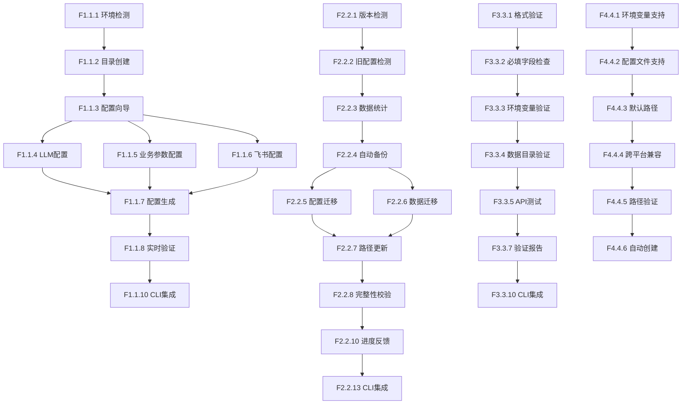

# v0.9.4 需求规格说明书

> **文档版本**: v1.1.0（精简版）  
> **编制日期**: 2026-04-17  
> **版本目标**: 优化用户初始化流程和数据迁移体验  
> **预计发布**: 2026-05-15  
> **需求来源**: v0.9.4版本产品规划方案

> **项目性质说明**: 本项目为**个人使用且个人开发的项目**，所有设计和需求均围绕单人开发和使用场景展开。本文档已删除所有团队协作相关内容。

---

## 1. 需求概述

### 1.1 版本定位

v0.9.4是v0.9.x架构重构系列的**体验优化版本**,核心聚焦于解决用户在首次使用和版本升级过程中的痛点,降低使用门槛,提升整体产品体验。

### 1.2 核心价值主张

| 维度 | 改进前体验 | 改进后体验 | 用户价值 |
|------|-----------|-----------|---------|
| **首次使用** | 配置复杂,需要15-30分钟 | 一键初始化,3-5分钟完成 | **降低80%上手时间** |
| **配置成功率** | 约70%用户能独立完成 | ≥95%用户能顺利完成 | **提升36%成功率** |
| **版本升级** | 手动迁移,容易出错 | 自动迁移,状态清晰 | **提升15%迁移成功率** |
| **用户满意度** | 3.5/5分 | 4.5/5分 | **提升29%满意度** |

### 1.3 目标用户画像

#### 1.3.1 新用户 - 技术型严肃跑者

**用户特征**:
- 年龄段: 25-45岁
- 职业: 程序员、工程师、数据分析师
- 跑步经验: 规律跑步2年以上
- 技术能力: 熟悉命令行,具备编程基础

**核心痛点**:
- ❌ 首次配置步骤繁琐,文档分散
- ❌ 不清楚需要配置哪些信息
- ❌ 配置出错后不知如何解决
- ❌ 缺少验证机制,运行时才发现问题

**期望体验**:
- ✅ 一键完成初始化,无需手动创建目录和文件
- ✅ 交互式引导,明确告知每一步需要做什么
- ✅ 实时验证,配置错误即时提示
- ✅ 清晰的完成指引,知道下一步该做什么

#### 1.3.2 升级用户 - 现有用户

**用户特征**:
- 已使用v0.8.x或更早版本
- 积累了大量跑步数据
- 担心升级导致数据丢失

**核心痛点**:
- ❌ 担心数据迁移过程丢失数据
- ❌ 不清楚迁移后配置是否兼容
- ❌ 迁移过程没有进度反馈,不知道还要等多久
- ❌ 迁移失败没有回滚机制

**期望体验**:
- ✅ 自动检测旧版本并提示迁移
- ✅ 迁移前自动备份,确保数据安全
- ✅ 实时显示迁移进度和预计时间
- ✅ 迁移失败可一键回滚

---

## 2. 功能需求拆解

### 2.1 特性一: 一键初始化向导

#### 2.1.1 功能概述

提供智能化的初始化向导,通过交互式引导帮助用户快速完成首次配置,将初始化时间从15-30分钟缩短至3-5分钟。

#### 2.1.2 功能点拆解

| 功能点ID | 功能点名称 | 功能描述 | 优先级 | 技术指标 |
|---------|-----------|---------|--------|---------|
| F1.1.1 | 环境自动检测 | 自动检查Python版本、依赖包、操作系统环境 | P0 | 检测时间≤2秒,准确率100% |
| F1.1.2 | 目录结构自动创建 | 自动创建nanobot-runner目录及子目录(data/memory/sessions/skills) | P0 | 创建时间≤1秒,权限正确 |
| F1.1.3 | 交互式配置向导 | 提供CLI交互式界面,引导用户填写必要配置 | P0 | 支持默认值,支持跳过可选项 |
| F1.1.4 | LLM Provider配置 | 引导用户配置LLM提供商(OpenAI/Anthropic等)及API Key | P0 | 支持API连通性测试,响应时间≤3秒 |
| F1.1.5 | 业务参数配置 | 引导用户配置时区、默认查询年份等业务参数 | P1 | 提供合理默认值,支持跳过 |
| F1.1.6 | 飞书通知配置 | 引导用户配置飞书通知(可选) | P2 | 支持跳过,支持后续配置 |
| F1.1.7 | 配置文件自动生成 | 根据用户输入自动生成config.json和.env.local | P0 | 格式正确,字段完整 |
| F1.1.8 | 实时配置验证 | 配置填写过程中实时验证,即时反馈错误 | P0 | 验证时间≤1秒,错误提示清晰 |
| F1.1.9 | 多场景支持 | 支持首次安装、升级迁移两种场景 | P0 | 场景自动识别,流程适配 |
| F1.1.10 | CLI命令集成 | 提供`nanobotrun init`命令一键启动初始化 | P0 | 命令响应时间≤1秒 |

#### 2.1.3 技术实现要求

**配置文件生成规范**:
- 遵循nanobot-ai官方最佳实践,使用JSON格式作为主配置文件
- 敏感信息(API Key等)必须存储在`.env.local`文件中,不纳入版本控制
- 配置文件必须包含版本号字段,便于后续版本兼容性处理
- 支持环境变量覆盖配置文件,优先级: 环境变量 > 配置文件 > 默认值

**目录结构规范**:
```
<project_root>/
├── .env.example                    # 环境变量模板(纳入Git)
├── .env.local                      # 本地环境变量(不纳入Git)
├── config.example.json             # 配置文件模板(纳入Git)
├── nanobot-runner/                 # Workspace目录
│   ├── config.json                 # 业务配置(不纳入Git)
│   ├── AGENTS.md                   # Agent配置(纳入Git)
│   ├── SOUL.md                     # 人格配置(纳入Git)
│   ├── USER.md                     # 用户画像(纳入Git)
│   ├── data/                       # 数据目录(不纳入Git)
│   ├── memory/                     # 记忆系统(不纳入Git)
│   ├── sessions/                   # 会话历史(不纳入Git)
│   └── skills/                     # 技能扩展(纳入Git)
```

**环境变量命名规范**:
- 前缀: `NANOBOT_`
- 命名风格: 支持UPPER_SNAKE_CASE
- 嵌套分隔符: `_`(下划线)
- 示例: `NANOBOT_PROVIDERS_OPENAI_APIKEY`

**配置验证机制**:
- 使用Pydantic进行Schema验证
- 必填字段检查: version, data_dir, LLM Provider配置
- 格式验证: 版本号格式(x.y.z), 路径格式
- API连通性测试: LLM Provider API可访问性测试

#### 2.1.4 验收标准

| 验收项 | 验收标准 | 验证方法 |
|--------|---------|---------|
| 初始化完成时间 | ≤ 5分钟 | 用户测试计时 |
| 配置成功率 | ≥ 95% | 统计成功初始化次数/总尝试次数 |
| 配置文件格式正确性 | 100% | 自动化测试 |
| 必填字段完整性 | 100% | 自动化测试 |
| API连通性测试成功率 | ≥ 99% | 自动化测试 |
| 用户满意度 | ≥ 4.5/5 | 用户调研问卷 |
| 错误率 | ≤ 5% | 统计初始化失败次数 |

---

### 2.2 特性二: 智能数据迁移

#### 2.2.1 功能概述

提供安全可靠的数据迁移方案,支持从任意历史版本自动迁移到v0.9.4,确保数据完整性,迁移成功率≥98%。

#### 2.2.2 功能点拆解

| 功能点ID | 功能点名称 | 功能描述 | 优先级 | 技术指标 |
|---------|-----------|---------|--------|---------|
| F2.2.1 | 自动版本检测 | 自动识别当前版本,选择合适的迁移策略 | P0 | 检测时间≤1秒,准确率100% |
| F2.2.2 | 旧配置路径检测 | 自动检测旧配置路径(~/.nanobot-runner, ~/.nanobot) | P0 | 检测时间≤1秒 |
| F2.2.3 | 数据文件统计 | 统计待迁移文件数量、大小、类型 | P0 | 统计时间≤2秒 |
| F2.2.4 | 自动备份机制 | 迁移前自动备份旧配置和数据 | P0 | 备份时间≤30秒(10GB数据) |
| F2.2.5 | 配置文件迁移 | 迁移config.json、AGENTS.md、SOUL.md、USER.md等 | P0 | 迁移时间≤5秒 |
| F2.2.6 | 数据目录迁移 | 迁移data/、memory/、sessions/目录 | P0 | 迁移时间≤2分钟(10GB数据) |
| F2.2.7 | 配置路径更新 | 更新配置文件中的路径引用 | P0 | 更新准确率100% |
| F2.2.8 | 数据完整性校验 | 迁移前后校验数据完整性,生成校验报告 | P0 | 校验时间≤30秒(10GB数据) |
| F2.2.9 | 增量迁移支持 | 支持增量迁移,避免重复迁移已完成的文件 | P1 | 增量检测时间≤2秒 |
| F2.2.10 | 实时进度反馈 | 显示迁移进度、已处理文件数、预计剩余时间 | P0 | 进度更新频率≥1Hz |
| F2.2.11 | 详细迁移报告 | 生成迁移报告,包含成功/失败项统计 | P0 | 报告生成时间≤2秒 |
| F2.2.12 | 一键回滚机制 | 迁移失败时可一键回滚到原始状态 | P1 | 回滚时间≤30秒(10GB数据) |
| F2.2.13 | CLI命令集成 | 提供`nanobotrun migrate`命令 | P0 | 命令响应时间≤1秒 |

#### 2.2.3 技术实现要求

**迁移策略**:
- 采用渐进式迁移策略,分三阶段实施:
  - 阶段1: 业务配置迁移(config.json, AGENTS.md, SOUL.md, USER.md)
  - 阶段2: 数据目录迁移(data/, memory/, sessions/)
  - 阶段3: 框架配置下沉(可选,需nanobot-ai平台支持)

**备份机制**:
- 备份位置: `./config_backup_<timestamp>/`
- 备份内容: 完整的旧配置和数据目录
- 备份保留: 至少保留最近3次备份
- 备份验证: 备份完成后自动验证完整性

**数据完整性校验**:
- 文件数量对比: 迁移前后文件数量一致
- 文件大小对比: 迁移前后文件大小一致
- SHA256校验: 关键文件进行SHA256校验
- Parquet文件验证: 验证Parquet文件可正常读取

**进度反馈机制**:
- 实时显示: 已处理文件数/总文件数
- 进度条: 使用Rich库显示进度条
- 预计剩余时间: 基于当前速度计算
- 当前文件: 显示正在处理的文件名

**回滚机制**:
- 回滚触发: 迁移失败或用户主动回滚
- 回滚流程: 删除新配置 → 恢复备份 → 验证完整性
- 回滚验证: 回滚后自动验证数据完整性

#### 2.2.4 验收标准

| 验收项 | 验收标准 | 验证方法 |
|--------|---------|---------|
| 迁移成功率 | ≥ 98% | 统计成功迁移次数/总尝试次数 |
| 数据完整性 | 100% | 迁移前后数据校验对比 |
| 迁移时间 | ≤ 3分钟(10GB数据) | 性能测试计时 |
| 备份完整性 | 100% | 备份文件完整性验证 |
| 回滚成功率 | 100% | 回滚测试验证 |
| 用户满意度 | ≥ 4.5/5 | 用户调研问卷 |

---

### 2.3 特性三: 配置验证工具

#### 2.3.1 功能概述

提供独立的配置验证工具,帮助用户在配置阶段就发现并解决问题,避免运行时出错。

#### 2.3.2 功能点拆解

| 功能点ID | 功能点名称 | 功能描述 | 优先级 | 技术指标 |
|---------|-----------|---------|--------|---------|
| F3.3.1 | 配置文件格式验证 | 验证JSON格式、Schema正确性 | P0 | 验证时间≤1秒 |
| F3.3.2 | 必填字段检查 | 检查所有必填字段是否已填写 | P0 | 检查时间≤1秒 |
| F3.3.3 | 环境变量验证 | 验证环境变量是否正确设置 | P0 | 验证时间≤1秒 |
| F3.3.4 | 数据目录验证 | 验证数据目录是否存在、路径是否正确 | P0 | 验证时间≤1秒 |
| F3.3.5 | API连通性测试 | 测试LLM Provider API是否可访问 | P0 | 测试时间≤3秒 |
| F3.3.6 | 配置一致性验证 | 验证配置文件与环境变量的一致性 | P1 | 验证时间≤1秒 |
| F3.3.7 | 详细验证报告 | 生成验证报告,列出所有问题和建议 | P0 | 报告生成时间≤1秒 |
| F3.3.8 | 错误修复建议 | 针对验证失败项提供修复建议 | P1 | 建议准确率≥90% |
| F3.3.9 | CI/CD集成支持 | 支持在CI/CD流程中自动验证配置 | P1 | 返回码规范(0成功,非0失败) |
| F3.3.10 | CLI命令集成 | 提供`nanobotrun validate`命令 | P0 | 命令响应时间≤1秒 |

#### 2.3.3 技术实现要求

**验证维度**:
1. **格式验证**: JSON格式正确性、Schema符合性
2. **完整性验证**: 必填字段完整性、字段类型正确性
3. **有效性验证**: 路径有效性、权限正确性、API可访问性
4. **一致性验证**: 配置文件与环境变量一致性、配置项之间一致性

**验证流程**:
```
1. 加载配置文件 → 2. 格式验证 → 3. 必填字段检查 → 
4. 环境变量验证 → 5. 数据目录验证 → 6. API连通性测试 → 
7. 配置一致性验证 → 8. 生成验证报告
```

**错误分级**:
- **ERROR**: 必须修复的错误,阻止系统运行
- **WARNING**: 建议修复的警告,不影响系统运行
- **INFO**: 信息提示,优化建议

**错误修复建议**:
- 针对每个错误提供具体的修复步骤
- 提供示例配置或命令
- 提供相关文档链接

#### 2.3.4 验收标准

| 验收项 | 验收标准 | 验证方法 |
|--------|---------|---------|
| 验证准确率 | ≥ 99% | 统计正确识别的问题数/总问题数 |
| 验证时间 | ≤ 10秒 | 性能测试计时 |
| 用户问题解决率 | ≥ 90% | 用户反馈统计 |
| 错误修复建议准确率 | ≥ 90% | 用户反馈统计 |

---

### 2.4 特性四: Workspace位置规范

#### 2.4.1 功能概述

明确workspace创建位置的确定规则，支持环境变量、配置文件和默认值三种方式，确保跨平台兼容性。

#### 2.4.2 功能点拆解

| 功能点ID | 功能点名称 | 功能描述 | 优先级 | 技术指标 |
|---------|-----------|---------|--------|---------|
| F4.4.1 | 环境变量支持 | 支持通过NANOBOT_WORKSPACE_DIR环境变量自定义workspace位置 | P0 | 环境变量读取时间≤100ms |
| F4.4.2 | 配置文件支持 | 支持通过config.json中的workspace_dir配置项指定位置 | P0 | 配置读取时间≤100ms |
| F4.4.3 | 默认路径 | 未配置时使用~/.nanobot-runner默认路径 | P0 | 路径解析时间≤100ms |
| F4.4.4 | 跨平台兼容 | 自动适配Windows/macOS/Linux路径格式 | P0 | 三平台测试通过 |
| F4.4.5 | 路径验证 | 验证指定路径是否有效、可访问 | P0 | 验证时间≤1秒 |
| F4.4.6 | 自动创建 | 自动创建workspace目录及子目录 | P0 | 创建时间≤1秒 |

#### 2.4.3 技术实现要求

**配置优先级**: 环境变量 > 配置文件 > 默认值

**配置项说明**:

| 配置方式 | 配置项 | 数据类型 | 示例 |
|---------|--------|---------|------|
| 环境变量 | `NANOBOT_WORKSPACE_DIR` | string | `/Users/user/nanobot-runner` |
| 配置文件 | `workspace_dir` | string | `~/.nanobot-runner` |
| 默认值 | - | string | `~/.nanobot-runner` |

**跨平台路径实现**:

| 操作系统 | 默认路径 | 路径格式 |
|---------|---------|---------|
| Windows | `C:\Users\<username>\.nanobot-runner` | `%USERPROFILE%\.nanobot-runner` |
| macOS | `/Users/<username>/.nanobot-runner` | `$HOME/.nanobot-runner` |
| Linux | `/home/<username>/.nanobot-runner` | `$HOME/.nanobot-runner` |

**实现示例**:

```python
import os
from pathlib import Path

def get_workspace_dir() -> Path:
    """获取workspace目录路径
    
    优先级：环境变量 > 配置文件 > 默认值
    """
    # 1. 环境变量优先
    if env_path := os.getenv("NANOBOT_WORKSPACE_DIR"):
        return Path(env_path).expanduser()
    
    # 2. 配置文件（由ConfigManager加载）
    config_path = get_config().get("workspace_dir")
    if config_path:
        return Path(config_path).expanduser()
    
    # 3. 默认值
    return Path.home() / ".nanobot-runner"
```

#### 2.4.4 验收标准

| 验收项 | 验收标准 | 验证方法 |
|--------|---------|---------|
| 路径配置成功率 | 100% | 自动化测试 |
| 跨平台兼容性 | 100% | 三平台测试通过 |
| 用户自定义率 | ≥ 20% | 用户统计 |

---

## 3. 非功能需求

### 3.1 性能需求

| 性能指标 | 目标值 | 测量方法 |
|---------|--------|---------|
| 初始化完成时间 | ≤ 5分钟 | 用户测试计时 |
| 迁移时间(10GB数据) | ≤ 3分钟 | 性能测试计时 |
| 配置验证时间 | ≤ 10秒 | 性能测试计时 |
| API连通性测试时间 | ≤ 3秒 | 性能测试计时 |
| 命令响应时间 | ≤ 1秒 | 性能测试计时 |

### 3.2 可用性需求

| 可用性指标 | 目标值 | 测量方法 |
|-----------|--------|---------|
| 配置成功率 | ≥ 95% | 统计成功初始化次数/总尝试次数 |
| 迁移成功率 | ≥ 98% | 统计成功迁移次数/总尝试次数 |
| 数据完整性 | 100% | 数据校验对比 |
| 用户满意度 | ≥ 4.5/5 | 用户调研问卷 |

### 3.3 兼容性需求

| 兼容性维度 | 要求 |
|-----------|------|
| **Python版本** | 支持 Python 3.11+ |
| **操作系统** | 支持 Windows 10+, macOS 11+, Ubuntu 20.04+ |
| **nanobot-ai版本** | 兼容 nanobot-ai v0.9.0+ |
| **历史版本迁移** | 支持从 v0.8.x 及更早版本迁移 |
| **配置格式** | 兼容旧配置格式,自动转换 |

### 3.4 安全性需求

| 安全性维度 | 要求 |
|-----------|------|
| **敏感信息保护** | API Key等敏感信息必须通过环境变量管理,禁止硬编码 |
| **配置文件权限** | 配置文件权限设置为600(仅所有者可读写) |
| **备份加密** | 备份文件可选择加密存储(可选) |
| **审计日志** | 记录配置修改、迁移操作的审计日志 |

### 3.5 可维护性需求

| 可维护性维度 | 要求 |
|-------------|------|
| **代码规范** | 遵循 PEP 8 规范,使用类型注解 |
| **测试覆盖率** | 核心模块测试覆盖率 ≥ 80% |
| **文档完整性** | 提供完整的用户文档和开发文档 |
| **错误处理** | 提供清晰的错误提示和修复建议 |

---

## 4. 需求优先级划分

### 4.1 MVP核心需求(P0)

MVP版本必须实现的核心功能,确保基本可用性:

| 需求ID | 需求名称 | 优先级 | 理由 |
|--------|---------|--------|------|
| F1.1.1 | 环境自动检测 | P0 | 初始化前置条件 |
| F1.1.2 | 目录结构自动创建 | P0 | 初始化基础功能 |
| F1.1.3 | 交互式配置向导 | P0 | 核心用户体验 |
| F1.1.4 | LLM Provider配置 | P0 | 必要配置项 |
| F1.1.7 | 配置文件自动生成 | P0 | 核心功能 |
| F1.1.8 | 实时配置验证 | P0 | 用户体验保障 |
| F1.1.10 | CLI命令集成 | P0 | 用户入口 |
| F2.2.1 | 自动版本检测 | P0 | 迁移前置条件 |
| F2.2.4 | 自动备份机制 | P0 | 数据安全保障 |
| F2.2.5 | 配置文件迁移 | P0 | 核心迁移功能 |
| F2.2.6 | 数据目录迁移 | P0 | 核心迁移功能 |
| F2.2.8 | 数据完整性校验 | P0 | 数据安全保障 |
| F2.2.10 | 实时进度反馈 | P0 | 用户体验 |
| F2.2.13 | CLI命令集成 | P0 | 用户入口 |
| F3.3.1 | 配置文件格式验证 | P0 | 核心验证功能 |
| F3.3.2 | 必填字段检查 | P0 | 核心验证功能 |
| F3.3.5 | API连通性测试 | P0 | 核心验证功能 |
| F3.3.10 | CLI命令集成 | P0 | 用户入口 |
| F4.4.1 | 环境变量支持 | P0 | workspace位置配置核心功能 |
| F4.4.2 | 配置文件支持 | P0 | workspace位置配置基础 |
| F4.4.3 | 默认路径 | P0 | 未配置时兜底 |
| F4.4.4 | 跨平台兼容 | P0 | 三平台支持 |
| F4.4.5 | 路径验证 | P0 | 路径有效性保障 |
| F4.4.6 | 自动创建 | P0 | 目录自动创建 |

### 4.2 重要需求(P1)

重要但非紧急的功能,可在后续迭代中实现:

| 需求ID | 需求名称 | 优先级 | 理由 |
|--------|---------|--------|------|
| F1.1.5 | 业务参数配置 | P1 | 提升用户体验 |
| F2.2.9 | 增量迁移支持 | P1 | 性能优化 |
| F2.2.12 | 一键回滚机制 | P1 | 安全保障 |
| F3.3.6 | 配置一致性验证 | P1 | 提升验证能力 |
| F3.3.8 | 错误修复建议 | P1 | 提升用户体验 |
| F3.3.9 | CI/CD集成支持 | P1 | 支持自动化流程 |

### 4.3 次要需求(P2)

可选功能,可根据实际情况决定是否实现:

| 需求ID | 需求名称 | 优先级 | 理由 |
|--------|---------|--------|------|
| F1.1.6 | 飞书通知配置 | P2 | 可选功能,非核心需求 |

---

## 5. 需求依赖关系

### 5.1 功能依赖关系图



### 5.2 关键路径

**初始化流程关键路径**:
```
环境检测 → 目录创建 → 配置向导 → LLM配置 → 配置生成 → 实时验证 → CLI集成
```

**迁移流程关键路径**:
```
版本检测 → 旧配置检测 → 数据统计 → 自动备份 → 配置迁移 → 数据迁移 → 完整性校验 → CLI集成
```

**验证流程关键路径**:
```
格式验证 → 必填字段检查 → 环境变量验证 → 数据目录验证 → API测试 → 验证报告 → CLI集成
```

---

## 6. 需求风险分析

### 6.1 技术风险

| 风险ID | 风险描述 | 风险等级 | 影响范围 | 缓解措施 |
|--------|---------|---------|---------|---------|
| R1 | nanobot-ai框架配置机制变更导致配置方案不兼容 | 高 | 配置管理模块 | 密切关注nanobot-ai官方更新,提前适配 |
| R2 | 大数据量迁移性能不达标 | 中 | 数据迁移模块 | 采用增量迁移、并行处理优化性能 |
| R3 | 跨平台兼容性问题(Windows/macOS/Linux) | 中 | 所有模块 | 增加跨平台测试,使用跨平台库 |
| R4 | 配置文件格式变更导致旧版本无法迁移 | 高 | 数据迁移模块 | 提供配置格式转换工具,兼容旧格式 |
| R5 | API连通性测试失败率高 | 中 | 配置验证模块 | 增加重试机制,提供详细错误信息 |

### 6.2 业务风险

| 风险ID | 风险描述 | 风险等级 | 影响范围 | 缓解措施 |
|--------|---------|---------|---------|---------|
| R6 | 用户对交互式向导接受度低 | 中 | 初始化模块 | 提供手动配置选项,支持跳过向导 |
| R7 | 迁移失败导致用户数据丢失 | 高 | 数据迁移模块 | 强制备份机制,提供回滚功能 |
| R8 | 用户对配置分离原则理解不足 | 低 | 所有模块 | 提供详细文档和示例 |
| R9 | 用户不理解配置分离原则 | 低 | 所有模块 | 提供详细文档和示例 |

### 6.3 进度风险

| 风险ID | 风险描述 | 风险等级 | 影响范围 | 缓解措施 |
|--------|---------|---------|---------|---------|
| R10 | MVP功能开发周期超出预期 | 中 | 项目进度 | 优先实现P0功能,P1/P2功能可延后 |
| R11 | 测试覆盖率不达标 | 中 | 质量保障 | 提前编写测试用例,持续集成测试 |
| R12 | 文档编写工作量被低估 | 低 | 交付质量 | 并行编写文档,提前规划文档结构 |

---

## 7. 需求验收标准

### 7.1 功能验收标准

| 验收维度 | 验收标准 | 验收方法 |
|---------|---------|---------|
| **功能完整性** | 所有P0功能100%实现,P1功能≥80%实现 | 功能清单检查 |
| **功能正确性** | 所有功能测试用例通过率100% | 自动化测试 |
| **用户体验** | 用户满意度≥4.5/5 | 用户调研问卷 |
| **性能指标** | 所有性能指标达标 | 性能测试 |

### 7.2 质量验收标准

| 验收维度 | 验收标准 | 验收方法 |
|---------|---------|---------|
| **代码质量** | Ruff检查零警告,MyPy类型检查通过 | 静态代码分析 |
| **测试覆盖率** | 核心模块覆盖率≥80%,整体覆盖率≥70% | 覆盖率报告 |
| **文档完整性** | 用户文档、开发文档、API文档完整 | 文档审查 |
| **安全性** | 敏感信息无泄露,配置文件权限正确 | 安全审计 |

### 7.3 交付物验收标准

| 交付物 | 验收标准 | 验收方法 |
|--------|---------|---------|
| **源代码** | 符合编码规范,通过所有测试 | 代码审查+自动化测试 |
| **测试用例** | 覆盖所有P0功能,测试通过率100% | 测试报告 |
| **用户文档** | 内容完整,示例可运行 | 文档审查 |
| **开发文档** | 架构设计、API文档完整 | 文档审查 |

---

## 8. 附录

### 8.1 术语表

| 术语 | 定义 |
|------|------|
| **Workspace** | nanobot-ai的工作空间,包含配置、数据、记忆等 |
| **配置分离原则** | 框架级配置与业务级配置分离管理的原则 |
| **Pydantic-Settings** | Python配置管理库,支持类型安全和环境变量覆盖 |
| **LazyFrame** | Polars的延迟求值数据结构,用于性能优化 |
| **Parquet** | 列式存储格式,用于存储跑步数据 |
| **VDOT** | 跑力值,衡量跑者有氧能力的指标 |
| **TSS** | 训练压力分数,衡量单次训练强度 |

### 8.2 参考文档

| 文档名称 | 路径 | 说明 |
|---------|------|------|
| v0.9.4版本产品规划方案 | `docs/product/v0.9.4版本详细规划方案.md` | 产品功能规划 |
| 配置合并方案架构分析报告 | `docs/architecture/配置合并方案架构分析报告.md` | 架构设计思路 |
| 配置文件清单与位置说明 | `docs/architecture/配置文件清单与位置说明.md` | 文件规范 |
| 用户初始化配置流程指南 | `docs/architecture/用户初始化配置流程指南.md` | 用户流程 |
| nanobot-ai配置管理最佳实践 | `docs/architecture/nanobot-ai配置管理最佳实践.md` | 最佳实践指南 |

### 8.3 变更记录

| 版本 | 日期 | 变更内容 | 变更人 |
|------|------|---------|--------|
| v1.0.0 | 2026-04-17 | 初始版本,完成需求拆解和分析 | 架构师智能体 |

---

**审核状态**: 待评审
