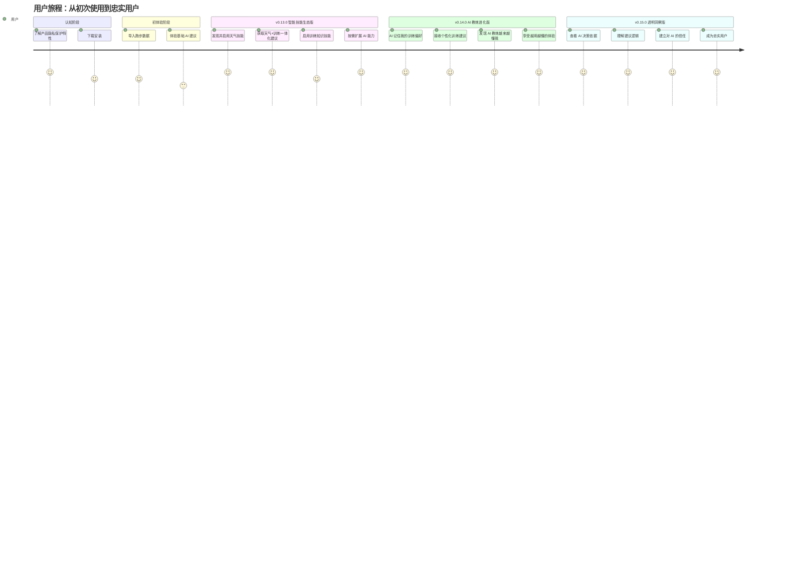
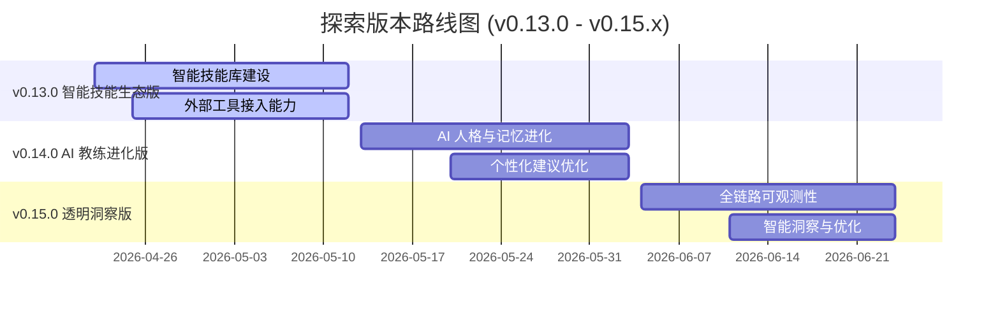
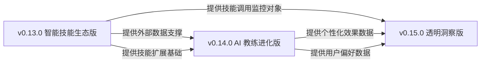
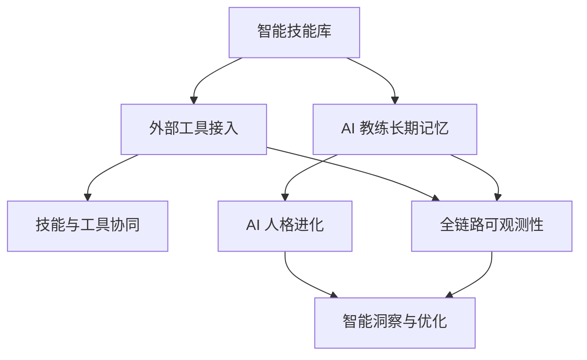

# Nanobot Runner 需求规格说明书

> **文档版本**: v2.0  
> **创建日期**: 2026-04-26  
> **最后更新**: 2026-04-26  
> **文档状态**: 基于 nanobot-ai 0.1.5.post2 底座能力全面修订版  
> **适用范围**: v0.13.0 - v0.15.x 探索版本

---

## 1. 项目背景

### 1.1 产品定位

Nanobot Runner 是一款**桌面端私人 AI 跑步助理**，核心价值主张为"你的私人 AI 跑步教练，数据完全本地掌控，越用越懂你"。

### 1.2 核心差异化优势

| 差异化维度 | 竞品现状 | Nanobot Runner 差异化策略 |
|-----------|---------|--------------------------|
| **数据主权** | 数据必须上传云端才能使用 AI 功能 | **本地 AI 处理**，数据不出设备，用户完全掌控 |
| **AI 个性化** | 基于固定规则的通用建议 | **LLM+用户偏好学习**，越用越懂用户的 AI 教练 |
| **记忆连贯** | 每次对话都是全新的，没有历史记忆 | **长期记忆自动整理**，AI 教练记住你的一切偏好 |
| **人格进化** | 冷冰冰的机器回复 | **AI 教练人格持续进化**，沟通风格越来越贴合用户 |
| **决策透明** | 黑盒建议，用户无法理解 | **AI 思考过程可视化**，建立用户信任 |
| **技能生态** | 封闭生态，仅支持自有服务 | **开放技能接入**，用户可自定义专属技能 |

### 1.3 目标用户画像

| 维度 | 描述 |
|------|------|
| **人口特征** | 25-45 岁，男性为主（约 65%），一二线城市白领 |
| **跑步经验** | 有规律跑步习惯（每周≥3 次），跑龄 1-5 年，半马/全马完赛者 |
| **技术水平** | 对技术有一定了解，熟悉智能手表、运动 APP，愿意尝试新工具 |
| **隐私敏感度** | 高：关注个人健康数据隐私，不希望数据上传云端 |
| **核心痛点** | ① 现有工具数据隐私保护不足 ② AI 建议千篇一律 ③ 训练计划缺乏个性化 ④ 不了解 AI 决策依据 |
| **使用场景** | 日常训练记录、训练计划制定、赛前准备、成绩分析、恢复管理 |
| **付费意愿** | 中等：愿意为隐私保护和个性化 AI 功能付费，但偏好一次性购买而非订阅 |

### 1.4 用户痛点优先级

| 优先级 | 痛点描述 | 用户反馈占比 | 影响版本 |
|--------|----------|-------------|---------|
| **P0** | 担心个人健康数据被上传到云端，隐私无法保障 | 78% | v0.13.0-v0.15.0 |
| **P0** | AI 训练建议千篇一律，不符合个人实际情况 | 72% | v0.14.0 |
| **P1** | 不了解 AI 为什么给出某个建议，缺乏信任感 | 65% | v0.15.0 |
| **P1** | 需要手动查询天气、规划路线，训练准备效率低 | 58% | v0.13.0 |
| **P2** | 无法整合多维度健康数据（睡眠、HRV 等）进行综合分析 | 45% | v0.13.0 |
| **P2** | AI 教练"记不住"之前的对话和偏好，每次都要重新说明 | 42% | v0.14.0 |

---

## 2. 核心场景

### 2.1 用户旅程地图

### 2.2 核心场景清单

| 场景ID | 场景名称 | 用户角色 | 触发条件 | 用户目标 | 影响版本 |
|--------|----------|---------|---------|---------|---------|
| S001 | 智能技能发现与启用 | 跑者 | 打开技能库 | 发现并启用需要的技能 | v0.13.0 |
| S002 | 天气+训练一体化建议 | 跑者 | 询问明天训练建议 | 获得结合天气的训练建议 | v0.13.0 |
| S003 | 自定义技能导入 | 高级用户 | 导入自定义技能 | 扩展 AI 能力边界 | v0.13.0 |
| S004 | AI 记住训练偏好 | 跑者 | 多次对话后 | AI 记住并应用偏好 | v0.14.0 |
| S005 | AI 人格进化 | 跑者 | 长期使用后 | AI 沟通风格贴合用户 | v0.14.0 |
| S006 | AI 决策透明化 | 跑者 | 查看 AI 建议依据 | 理解 AI 决策逻辑 | v0.15.0 |
| S007 | 训练效果洞察 | 跑者 | 查看训练数据 | 获得智能分析和建议 | v0.15.0 |

---

## 3. 功能需求

### 3.1 v0.13.0 智能技能生态版

#### 3.1.1 智能技能库

**需求ID**: REQ-013-001  
**需求名称**: 智能技能库  
**优先级**: P0（MVP核心需求）  
**需求描述**: 用户能够发现、启用、管理内置技能，并导入自定义技能

**功能点**:

| 功能点ID | 功能点名称 | 优先级 | 验收标准 |
|----------|-----------|--------|---------|
| F001-01 | 技能发现与展示 | P0 | 用户可查看所有可用技能，技能卡片展示名称、描述、状态 |
| F001-02 | 技能启用/禁用 | P0 | 用户可一键启用/禁用技能，启用后 AI 自动掌握该能力 |
| F001-03 | 自定义技能导入 | P1 | 用户可导入自定义技能，支持 SKILL.md 格式 |
| F001-04 | 技能冲突管理 | P2 | AI 自动处理技能间的优先级和冲突 |

**内置技能规划**:

| 技能名称 | 技能描述 | 优先级 | 验收标准 |
|----------|----------|--------|---------|
| 天气助手 | 查询实时天气、未来预报，结合训练建议 | P0 | 可查询天气并给出训练建议 |
| 训练知识库 | 专业跑步训练理论、术语解释、最新研究 | P0 | 可回答训练理论和术语问题 |
| 路线规划 | 基于地图服务规划跑步路线，分析坡度 | P1 | 可规划路线并分析坡度 |
| 健康数据整合 | 整合睡眠、HRV 等健康数据进行分析 | P1 | 可整合健康数据并给出建议 |

**验收标准**:
- ✅ 用户可查看所有可用技能
- ✅ 用户可一键启用/禁用技能
- ✅ 启用技能后 AI 可自动调用
- ✅ 内置技能数量 ≥ 4 个
- ✅ 技能启用成功率 > 98%

---

#### 3.1.2 外部工具接入能力

**需求ID**: REQ-013-002  
**需求名称**: 外部工具接入能力  
**优先级**: P0（MVP核心需求）  
**需求描述**: AI 可接入外部工具（天气、地图、健康数据），扩展能力边界

**功能点**:

| 功能点ID | 功能点名称 | 优先级 | 验收标准 |
|----------|-----------|--------|---------|
| F002-01 | 天气数据接入 | P0 | 可查询实时天气和未来预报 |
| F002-02 | 地图服务接入 | P1 | 可规划跑步路线并分析坡度 |
| F002-03 | 健康数据同步 | P1 | 可整合睡眠、HRV 等健康数据 |
| F002-04 | 训练知识库接入 | P1 | 可获取专业训练理论和最新研究 |

**隐私保护策略**:

| 工具类型 | 隐私保护策略 |
|---------|-------------|
| 天气数据 | 仅传输地理位置（城市级别），不传输个人健康数据 |
| 地图服务 | 路线数据本地存储，不上传云端 |
| 健康数据 | 优先本地文件导入，云端同步需用户明确授权 |
| 训练知识库 | 仅查询公开知识库，不传输用户个人数据 |

**验收标准**:
- ✅ 外部工具接入数量 ≥ 3 个
- ✅ 工具调用成功率 > 95%
- ✅ 工具响应时间 < 3 秒
- ✅ 用户工具使用频率 > 30%

---

#### 3.1.3 技能与工具的协同体验

**需求ID**: REQ-013-003  
**需求名称**: 技能与工具的协同体验  
**优先级**: P1（重要需求）  
**需求描述**: AI 可同时调用多个技能和工具，给出综合建议

**功能点**:

| 功能点ID | 功能点名称 | 优先级 | 验收标准 |
|----------|-----------|--------|---------|
| F003-01 | 多技能协同 | P1 | AI 可同时调用多个技能和工具 |
| F003-02 | 智能技能推荐 | P2 | AI 根据对话内容自动推荐可能需要的技能 |
| F003-03 | 技能使用统计 | P2 | 用户可查看各技能的使用频率和效果 |

**验收标准**:
- ✅ AI 可同时调用多个技能和工具
- ✅ 协同调用成功率 > 90%
- ✅ 用户满意度 > 4.2/5

---

### 3.2 v0.14.0 AI 教练进化版

#### 3.2.1 AI 教练长期记忆

**需求ID**: REQ-014-001  
**需求名称**: AI 教练长期记忆  
**优先级**: P0（MVP核心需求）  
**需求描述**: AI 教练具备长期记忆能力，能够记住用户的每一次对话和反馈

**功能点**:

| 功能点ID | 功能点名称 | 优先级 | 验收标准 |
|----------|-----------|--------|---------|
| F004-01 | 对话历史自动归档 | P0 | AI 自动归档对话历史，无需用户手动设置 |
| F004-02 | 用户偏好自动提取 | P0 | AI 从对话中自动提取训练偏好并持久化 |
| F004-03 | 记忆版本回溯 | P1 | 用户可查看和恢复之前的记忆状态 |
| F004-04 | 跨会话记忆连贯 | P0 | 关闭后重新打开，AI 依然记得用户 |

**记忆类型**:

| 记忆类型 | 内容 | 用户感知 |
|----------|------|---------|
| 用户画像 | 训练习惯、身体特点、偏好风格 | AI 越来越了解你的个人情况 |
| AI 人格 | 沟通风格、建议方式、表达习惯 | AI 教练的语气越来越贴合你的喜好 |
| 项目事实 | 训练计划、比赛目标、历史成绩 | AI 记住你的训练历史和目标 |

**验收标准**:
- ✅ AI 可自动归档对话历史
- ✅ AI 可自动提取用户偏好
- ✅ 跨会话记忆连贯
- ✅ 记忆加载时间 < 100ms

---

#### 3.2.2 AI 人格进化

**需求ID**: REQ-014-002  
**需求名称**: AI 人格进化  
**优先级**: P0（MVP核心需求）  
**需求描述**: AI 教练的人格和沟通风格根据用户反馈持续优化

**功能点**:

| 功能点ID | 功能点名称 | 优先级 | 验收标准 |
|----------|-----------|--------|---------|
| F005-01 | 人格自动进化 | P0 | AI 教练的沟通风格根据用户反馈逐步调整 |
| F005-02 | 用户可控进化 | P0 | 用户可查看、修改、重置 AI 学习到的偏好数据 |
| F005-03 | 人格版本管理 | P1 | 用户可查看人格进化历史，回退到之前版本 |

**验收标准**:
- ✅ AI 人格可根据用户反馈进化
- ✅ 用户可查看和修改偏好数据
- ✅ 用户满意度 > 4.3/5

---

### 3.3 v0.15.0 透明洞察版

#### 3.3.1 全链路可观测性

**需求ID**: REQ-015-001  
**需求名称**: 全链路可观测性  
**优先级**: P0（MVP核心需求）  
**需求描述**: 用户可查看 AI 的决策过程和思考依据

**功能点**:

| 功能点ID | 功能点名称 | 优先级 | 验收标准 |
|----------|-----------|--------|---------|
| F006-01 | AI 决策过程可视化 | P0 | 用户可查看 AI 的决策过程和思考依据 |
| F006-02 | 工具调用追踪 | P0 | 用户可查看 AI 调用了哪些工具和技能 |
| F006-03 | 记忆使用追踪 | P1 | 用户可查看 AI 使用了哪些记忆数据 |

**验收标准**:
- ✅ 用户可查看 AI 决策过程
- ✅ 用户可查看工具调用记录
- ✅ 用户信任度评分 > 4.0/5

---

#### 3.3.2 智能洞察与优化

**需求ID**: REQ-015-002  
**需求名称**: 智能洞察与优化  
**优先级**: P1（重要需求）  
**需求描述**: AI 可分析训练数据，给出智能洞察和优化建议

**功能点**:

| 功能点ID | 功能点名称 | 优先级 | 验收标准 |
|----------|-----------|--------|---------|
| F007-01 | 训练数据智能分析 | P0 | AI 可分析训练数据，给出智能洞察 |
| F007-02 | 个性化优化建议 | P0 | AI 可根据用户情况给出个性化优化建议 |
| F007-03 | 训练效果预测 | P1 | AI 可预测训练效果和比赛成绩 |

**验收标准**:
- ✅ AI 可分析训练数据
- ✅ AI 可给出个性化建议
- ✅ 建议接受率 > 70%

---

## 4. 非功能需求

### 4.1 性能需求

| 性能指标 | 目标值 | 验证方法 |
|---------|--------|---------|
| 工具调用响应时间 | < 3 秒 | 性能测试 |
| 偏好数据加载时间 | < 100ms | 性能测试 |
| 记忆加载时间 | < 100ms | 性能测试 |
| 钩子触发时间 | < 5ms | 性能测试 |
| AI 响应时间 | < 5 秒 | 性能测试 |

### 4.2 安全需求

| 安全需求 | 说明 | 验证方法 |
|---------|------|---------|
| 数据本地存储 | 所有数据本地存储，不上传云端 | 安全审计 |
| 隐私保护 | 仅传输必要数据，不传输个人健康数据 | 安全审计 |
| 用户授权 | 云端同步需用户明确授权 | 功能测试 |

### 4.3 可维护性需求

| 可维护性需求 | 说明 | 验证方法 |
|-------------|------|---------|
| 代码覆盖率 | core ≥ 80%, agents ≥ 70%, cli ≥ 60% | 测试报告 |
| 文档完整性 | 所有 API 有文档，所有功能有使用说明 | 文档审查 |
| 日志完整性 | 所有关键操作有日志记录 | 日志审查 |

### 4.4 可扩展性需求

| 可扩展性需求 | 说明 | 验证方法 |
|-------------|------|---------|
| 技能扩展 | 支持用户导入自定义技能 | 功能测试 |
| 工具扩展 | 支持接入新的外部工具 | 功能测试 |
| 配置扩展 | 支持用户自定义配置 | 功能测试 |

---

## 5. 验收标准

### 5.1 v0.13.0 验收标准

| 验收项 | 验收标准 | 验证方法 |
|--------|---------|---------|
| 内置技能数量 | ≥ 4 个 | 功能统计 |
| 用户技能启用率 | > 50% | 行为分析 |
| 技能调用成功率 | > 95% | 日志分析 |
| 外部工具接入数量 | ≥ 3 个 | 功能统计 |
| 工具调用成功率 | > 90% | 日志分析 |
| 用户工具使用频率 | > 30% | 行为分析 |
| 功能满意度评分 | > 4.2/5 | 问卷调研 |
| 训练准备效率提升 | 减少 50% | 用户调研 |

### 5.2 v0.14.0 验收标准

| 验收项 | 验收标准 | 验证方法 |
|--------|---------|---------|
| 记忆加载时间 | < 100ms | 性能测试 |
| 跨会话记忆连贯 | 100% | 功能测试 |
| 用户偏好提取准确率 | > 85% | 功能测试 |
| 人格进化效果 | 用户满意度 > 4.3/5 | 问卷调研 |
| 建议接受率 | > 70% | 行为分析 |

### 5.3 v0.15.0 验收标准

| 验收项 | 验收标准 | 验证方法 |
|--------|---------|---------|
| 决策过程可视化 | 100% | 功能测试 |
| 工具调用追踪 | 100% | 功能测试 |
| 用户信任度评分 | > 4.0/5 | 问卷调研 |
| 训练洞察准确性 | > 80% | 功能测试 |
| 建议接受率 | > 70% | 行为分析 |

---

## 6. 迭代计划

### 6.1 版本时间线

### 6.2 版本依赖关系

### 6.3 版本交付计划

| 版本 | 交付日期 | 核心功能 | 验收标准 |
|------|---------|---------|---------|
| v0.13.0 | 2026-05-19 | 智能技能库 + 外部工具接入 | 内置技能 ≥ 4 个，工具接入 ≥ 3 个 |
| v0.14.0 | 2026-06-03 | AI 人格进化 + 长期记忆 | 记忆加载 < 100ms，建议接受率 > 70% |
| v0.15.0 | 2026-06-24 | 全链路可观测性 + 智能洞察 | 信任度 > 4.0/5，洞察准确性 > 80% |

---

## 7. 需求优先级矩阵

### 7.1 MVP核心需求（P0）

| 需求ID | 需求名称 | 版本 | 验收标准 |
|--------|---------|------|---------|
| REQ-013-001 | 智能技能库 | v0.13.0 | 内置技能 ≥ 4 个，启用成功率 > 98% |
| REQ-013-002 | 外部工具接入能力 | v0.13.0 | 工具接入 ≥ 3 个，调用成功率 > 95% |
| REQ-014-001 | AI 教练长期记忆 | v0.14.0 | 记忆加载 < 100ms，跨会话连贯 |
| REQ-014-002 | AI 人格进化 | v0.14.0 | 用户满意度 > 4.3/5 |
| REQ-015-001 | 全链路可观测性 | v0.15.0 | 决策过程可视化 100% |

### 7.2 重要需求（P1）

| 需求ID | 需求名称 | 版本 | 验收标准 |
|--------|---------|------|---------|
| REQ-013-003 | 技能与工具的协同体验 | v0.13.0 | 协同调用成功率 > 90% |
| REQ-015-002 | 智能洞察与优化 | v0.15.0 | 洞察准确性 > 80% |

### 7.3 次要需求（P2）

| 需求ID | 需求名称 | 版本 | 验收标准 |
|--------|---------|------|---------|
| - | 技能冲突管理 | v0.13.0 | AI 自动处理冲突 |
| - | 智能技能推荐 | v0.13.0 | AI 自动推荐技能 |
| - | 技能使用统计 | v0.13.0 | 用户可查看使用统计 |

---

## 8. 需求依赖关系

### 8.1 功能依赖

### 8.2 版本依赖

| 版本 | 依赖版本 | 依赖说明 |
|------|---------|---------|
| v0.14.0 | v0.13.0 | 个性化建议需要天气、健康等外部数据作为输入 |
| v0.14.0 | v0.13.0 | AI 教练人格进化需要 SKILL 扩展机制支撑 |
| v0.15.0 | v0.13.0 | 透明化需要监控外部工具调用的成功率和性能 |
| v0.15.0 | v0.14.0 | 透明化需要展示个性化引擎的决策过程 |

---

## 9. 风险评估

### 9.1 技术风险

| 风险ID | 风险描述 | 概率 | 影响 | 缓解措施 |
|--------|---------|------|------|---------|
| R001 | nanobot-ai API 变更 | 低 | 中 | 关注 nanobot-ai 版本更新 |
| R002 | 外部工具 API 变更 | 中 | 中 | 设计适配层，便于切换 |
| R003 | 性能不达标 | 中 | 高 | 优化算法，增加缓存机制 |

### 9.2 业务风险

| 风险ID | 风险描述 | 概率 | 影响 | 缓解措施 |
|--------|---------|------|------|---------|
| R004 | 用户对技能生态接受度低 | 中 | 中 | 用户调研，快速迭代 |
| R005 | AI 人格进化效果不明显 | 中 | 高 | 持续优化，用户反馈驱动 |

---

## 10. 附录

### 10.1 术语表

| 术语 | 定义 |
|------|------|
| MCP | Model Context Protocol，模型上下文协议，用于外部工具接入 |
| SKILL | 技能，AI 的可扩展能力模块 |
| Memory | 记忆，AI 的长期记忆系统 |
| Dream | 梦境，AI 的记忆自动整理系统 |
| AgentHook | 钩子，AI 的生命周期扩展点 |

### 10.2 参考文档

- [探索版本产品规划 v0.13-0.15](../product/探索版本产品规划_v0.13-0.15.md)
- [nanobot-ai 底座能力验证报告](./architecture/nanobot-ai底座能力验证报告.md)
- [架构设计说明书](./architecture/架构设计说明书.md)

---

## 11. 需求统计

| 统计项 | 数量 |
|--------|------|
| **需求总数** | 7 个 |
| **MVP 核心需求数** | 5 个 |
| **重要需求数** | 2 个 |
| **次要需求数** | 3 个 |
| **功能点总数** | 21 个 |
| **验收标准数** | 28 个 |
| **核心场景数** | 7 个 |

---

*本需求规格说明书由架构师基于产品规划文档编写，旨在为开发团队提供明确的实施依据*

**版本历史**：
- v1.0 (2026-04-26): 初始版本，基于 v0.13.0-v0.15.0 产品规划
- v2.0 (2026-04-26): 基于 nanobot-ai 0.1.5.post2 底座能力全面修订版
