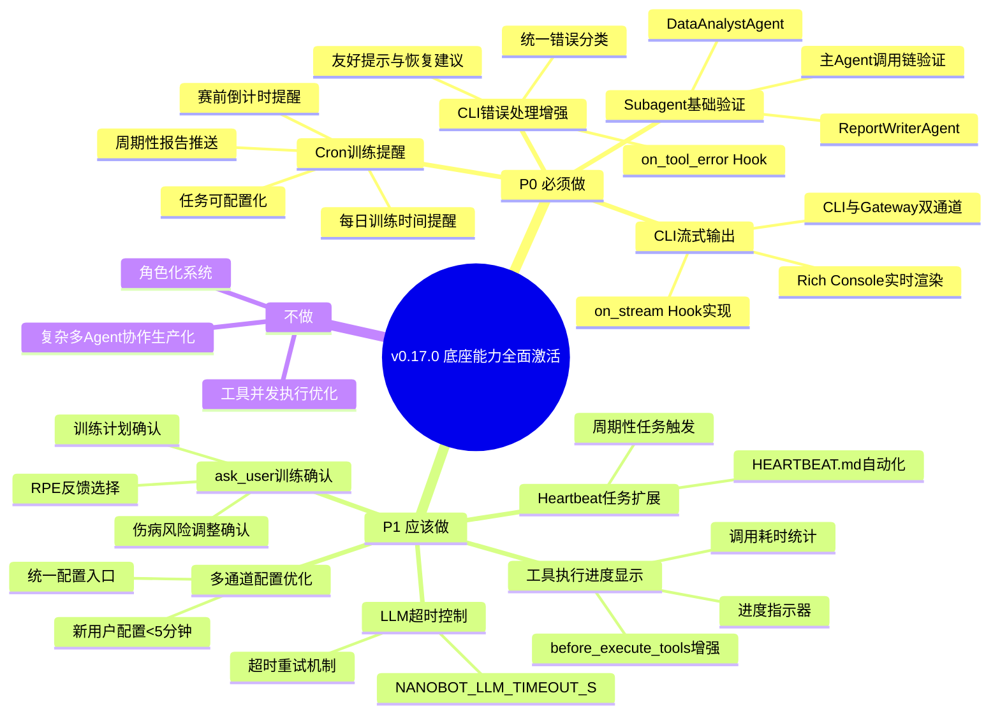
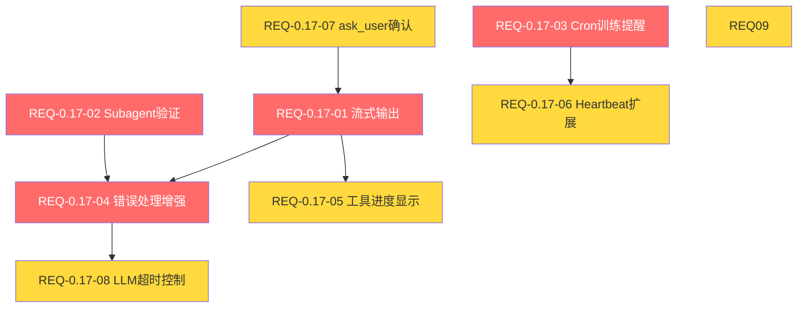

# PRD: v0.17.0 底座能力全面激活

> **文档版本**: v1.0
> **创建日期**: 2026-05-02
> **版本基线**: v0.16.1
> **目标版本**: v0.17.0
> **计划发布**: 2026-05-20
> **对齐文档**: [产品规划方案](../product/产品规划方案.md) | [架构设计说明书](../architecture/架构设计说明书.md) | [REQ_需求规格说明书](REQ_需求规格说明书.md)

---

## 1. 项目背景

### 1.1 版本定位

v0.17.0 的核心主题是**底座能力全面激活**，基于 nanobot-ai >=0.1.5.post3 底座，将已注册但未实现的 Hook、未激活的 Subagent 能力、部分激活的 Cron/Heartbeat 服务全面激活，让用户感受到 AI 响应更快、交互更智能、提醒更及时。

### 1.2 用户问题

> "AI 响应有点慢，而且看不到它在想什么。另外，我想知道未来能不能有更智能的协作能力？还有，能不能定时提醒我训练？"

### 1.3 用户价值承诺

| 感知变化 | 底座能力 | 当前状态 |
|----------|----------|----------|
| AI 响应变快了，能看到实时输出 | `on_stream` Hook | ⚠️ 已注册未实现 |
| 为未来多 Agent 能力做好准备 | `call_subagent` | ❌ 未激活 |
| 定时收到训练提醒 | `CronService` | ⚠️ 部分激活 |
| CLI 错误提示更友好 | `on_tool_error` Hook | ❌ 未激活 |

### 1.4 底座能力全景与激活状态

| 能力模块 | 底座组件 | 当前状态 | v0.17.0 目标 |
|----------|----------|----------|-------------|
| Agent 核心 | `AgentLoop` | ✅ 已激活 | 保持 |
| 消息总线 | `MessageBus` | ✅ 已激活 | 保持 |
| MCP 工具 | `connect_mcp_servers` | ✅ 已激活 | 保持 |
| 通道管理 | `ChannelManager` | ✅ 已激活 | 优化配置 |
| Agent Hook | `AgentHook` | ⚠️ 部分激活 | **增强实现** |
| Cron 定时任务 | `CronService` | ⚠️ 部分激活 | **深度激活** |
| Heartbeat 心跳 | `HeartbeatService` | ⚠️ 部分激活 | **扩展场景** |
| 流式输出 | `on_stream` Hook | ⚠️ 已注册未实现 | **完整实现** |
| Subagent 调用 | `call_subagent` | ❌ 未激活 | **基础验证** |
| ask_user 工具 | `ask_user` | ❌ 未激活 | **场景集成** |
| LLM 超时 | `NANOBOT_LLM_TIMEOUT_S` | ❌ 未配置 | **配置支持** |

---

## 2. 需求脑图

---

## 3. 功能需求

### 3.1 P0 — CLI 流式输出（REQ-0.17-01）

**需求描述**: 实现 `on_stream` Hook 方法，通过 Rich Console 实时输出 AI 响应，让用户在等待 AI 回复时能看到实时内容，而非等待全部生成后才显示。

**当前状态**: `ObservabilityHook.on_stream()` 方法已注册但方法体为空（[hook_integration.py:73](../../src/core/transparency/hook_integration.py#L73)），CLI 模式下使用 `console.status("思考中...")` 阻塞等待完整响应。

**功能要点**:
- 实现 `on_stream` Hook 方法，接收 `delta` 流式片段
- CLI 通道：通过 Rich Console 实时渲染流式内容（逐字/逐句输出）
- Gateway 通道：通过 MessageBus 将流式片段推送到飞书等通道
- 流式输出与现有 `console.status("思考中...")` 的切换逻辑
- 流式输出中断处理（用户 Ctrl+C 时优雅终止）

**验收标准**:
- [ ] AC-01: CLI 模式下 AI 响应首字出现时间 < 3 秒（当前为等待全部生成）
- [ ] AC-02: 流式输出效果流畅，无明显卡顿或闪烁
- [ ] AC-03: Gateway 模式下流式片段正确推送到飞书通道
- [ ] AC-04: 流式输出过程中 Ctrl+C 可优雅中断，不产生异常堆栈
- [ ] AC-05: 流式输出与 `ObservabilityHook` 透明化追踪功能兼容，追踪数据不丢失

**技术约束**:
- 必须兼容现有 `ObservabilityHook` 的 `before_iteration`/`after_iteration` 生命周期
- 流式输出不得影响 `finalize_content` 的决策追踪逻辑
- Rich Console 的 Live/Status 组件与流式输出的协调

---

### 3.2 P0 — Subagent 基础验证（REQ-0.17-02）

**需求描述**: 创建 2 个 Subagent 配置（数据分析 Agent + 报告生成 Agent），验证主 Agent 通过 `call_subagent` 调用 Subagent 的完整调用链，为未来多 Agent 协作奠定基础。

**当前状态**: 项目中无任何 Subagent 相关代码，`call_subagent` 能力完全未激活。

**功能要点**:
- 定义 DataAnalystAgent 配置（专注数据分析：VDOT 趋势、训练负荷、心率分析）
- 定义 ReportWriterAgent 配置（专注报告生成：周报、月报、训练总结）
- 实现主 Agent 到 Subagent 的调用逻辑
- 验证调用链：主 Agent → 识别子任务 → 调用 Subagent → 获取结果 → 整合回复
- Subagent 配置文件管理（workspace/agents/ 目录）

**验收标准**:
- [ ] AC-01: 主 Agent 能成功调用 DataAnalystAgent 并获取数据分析结果
- [ ] AC-02: 主 Agent 能成功调用 ReportWriterAgent 并获取报告生成结果
- [ ] AC-03: Subagent 调用链完整：主 Agent → Subagent → 结果返回，无数据丢失
- [ ] AC-04: Subagent 配置文件格式符合 nanobot-ai 规范
- [ ] AC-05: Subagent 调用失败时主 Agent 有降级处理（直接使用自身工具完成）

**技术约束**:
- 仅验证基础调用能力，不实现复杂的多轮编排
- Subagent 共享主 Agent 的工具集和数据上下文
- Subagent 调用超时需有兜底机制

---

### 3.3 P0 — Cron 训练提醒深度集成（REQ-0.17-03）

**需求描述**: 深度激活 CronService，实现每日训练时间提醒、赛前倒计时提醒、周期性报告推送，让用户不再错过训练。

**当前状态**: CronService 在 `report/service.py` 和 `gateway.py` 中已使用，但仅支持基础的一次性定时报告推送，不支持训练提醒、周期性任务、用户自定义配置。

**功能要点**:
- 每日训练时间提醒：用户配置训练时间，到时自动推送提醒
- 赛前倒计时提醒：基于训练计划中的比赛日期，自动计算倒计时
- 周期性报告推送：每周训练总结、每月进度报告的 Cron 定时任务
- 任务可配置化：用户可通过 CLI 命令管理 Cron 任务（添加/删除/查看）
- Cron 任务与 ReportService 的深度整合

**验收标准**:
- [ ] AC-01: 每日训练提醒定时触发，消息准时送达（误差 < 1 分钟）
- [ ] AC-02: 赛前倒计时提醒在比赛前 7/3/1 天自动触发
- [ ] AC-03: 周期性报告（周报/月报）按计划自动生成并推送
- [ ] AC-04: 用户可通过 CLI 命令查看、添加、删除 Cron 任务
- [ ] AC-05: Cron 任务持久化，服务重启后任务不丢失
- [ ] AC-06: 并发 Cron 任务数 ≤ 5，防止性能影响

**技术约束**:
- 基于 nanobot-ai `CronService` 和 `CronSchedule` 实现
- Cron 任务消息通过 MessageBus 推送到已启用通道
- 任务配置存储在 workspace/cron.json

---

### 3.4 P0 — CLI 错误处理增强（REQ-0.17-04）

**需求描述**: 实现 `on_tool_error` Hook，统一错误分类和提示，结合 AgentHook 记录错误上下文，让用户遇到错误时能自助解决。

**当前状态**: `ObservabilityHook` 中 `on_tool_error` 未实现；CLI 模式下错误处理分散，部分错误直接显示异常堆栈，用户体验差。

**功能要点**:
- 实现 `on_tool_error` Hook 方法，捕获工具执行错误
- 统一错误分类：网络错误、数据错误、配置错误、权限错误、超时错误
- 友好错误提示：每个错误类型提供用户可理解的提示和恢复建议
- 错误上下文记录：结合 ObservabilityManager 记录错误发生时的完整上下文
- 错误恢复建议：根据错误类型自动推荐恢复操作

**验收标准**:
- [ ] AC-01: 所有工具执行错误通过 `on_tool_error` Hook 统一捕获
- [ ] AC-02: 错误提示友好，不显示原始异常堆栈（除非 `--verbose` 模式）
- [ ] AC-03: 每个错误类型有对应的恢复建议（如"请检查网络连接"、"请运行 nanobotrun system init"）
- [ ] AC-04: 错误上下文记录到 ObservabilityManager，可通过 `transparency trace` 查看
- [ ] AC-05: LLM 调用超时时提示"AI 响应超时，请稍后重试"而非异常堆栈

**技术约束**:
- 错误处理不得吞没异常，必须保留原始异常信息用于调试
- `--verbose` 模式下显示完整异常堆栈
- 错误分类需覆盖项目自定义异常类（`src.core.base.exceptions`）

---

### 3.5 P1 — 工具执行进度显示（REQ-0.17-05）

**需求描述**: 增强 `before_execute_tools` Hook，在工具调用前显示进度指示器，让用户知道 AI 正在调用什么工具。

**当前状态**: `before_execute_tools` 已在 `ObservabilityHook` 中实现追踪记录，但未向用户展示进度信息。

**功能要点**:
- 工具调用前显示进度指示器（如"正在查询训练数据..."）
- 工具调用耗时统计（调用完成后显示耗时）
- 多工具连续调用时的进度展示

**验收标准**:
- [ ] AC-01: 工具调用前显示工具名称和简要描述
- [ ] AC-02: 工具调用完成后显示耗时（如"查询完成，耗时 0.3s"）
- [ ] AC-03: 多工具调用时依次显示进度，不互相覆盖

---

### 3.6 P1 — Heartbeat 任务扩展（REQ-0.17-06）

**需求描述**: 扩展 HeartbeatService 的应用场景，实现 HEARTBEAT.md 中定义的任务自动执行。

**当前状态**: HeartbeatService 在 `gateway.py` 中已使用，但仅实现了基础的 `on_execute`/`on_notify` 回调，未与 HEARTBEAT.md 任务定义联动。

**功能要点**:
- HEARTBEAT.md 任务定义规范（定义周期性检查项）
- Heartbeat 触发时自动执行 HEARTBEAT.md 中定义的任务
- 任务执行结果通知到已启用通道

**验收标准**:
- [ ] AC-01: HEARTBEAT.md 中定义的任务在心跳周期内自动触发
- [ ] AC-02: 任务执行结果通过 MessageBus 推送到已启用通道
- [ ] AC-03: HEARTBEAT.md 支持用户自定义任务

---

### 3.7 P1 — ask_user 训练确认（REQ-0.17-07）

**需求描述**: 集成 nanobot-ai 的 `ask_user` 工具，在训练计划生成、RPE 反馈、伤病风险评估等场景中让用户确认或调整。

**当前状态**: `ask_user` 工具未集成，所有 AI 建议直接输出，无用户确认环节。

**功能要点**:
- 训练计划生成后让用户确认或调整
- RPE 反馈选择（1-10 分）
- 伤病风险评估后的调整确认
- CLI 模式下降级为文本选择（因 CLI 不支持按钮交互）

**验收标准**:
- [ ] AC-01: 训练计划生成后弹出确认选项（确认/调整/取消）
- [ ] AC-02: RPE 反馈提供 1-10 分选择界面
- [ ] AC-03: CLI 模式下降级为文本输入选择，功能可用
- [ ] AC-04: Gateway 模式下支持飞书交互卡片选择

---

### 3.8 P1 — LLM 超时控制（REQ-0.17-08）

**需求描述**: 配置 `NANOBOT_LLM_TIMEOUT_S` 环境变量，防止 LLM 请求挂起，超时后自动重试或提示用户。

**当前状态**: LLM 调用无超时控制，网络异常时可能导致请求无限挂起。

**功能要点**:
- 支持 `NANOBOT_LLM_TIMEOUT_S` 环境变量配置超时时间
- 默认超时时间 60 秒
- 超时后自动重试（最多 2 次）
- 重试失败后友好提示用户

**验收标准**:
- [ ] AC-01: `NANOBOT_LLM_TIMEOUT_S` 环境变量生效，超时后请求终止
- [ ] AC-02: 默认超时 60 秒，可通过环境变量覆盖
- [ ] AC-03: 超时后自动重试，最多 2 次
- [ ] AC-04: 重试全部失败后提示"AI 响应超时，请检查网络或稍后重试"

---

### 3.9 P1 — 多通道配置优化（REQ-0.17-09）

**需求描述**: 优化 ChannelManager 配置流程，统一飞书/微信/CLI 配置入口，让新用户配置时间 < 5 分钟。

**当前状态**: ChannelManager 已激活，但配置分散在多个文件中，新用户配置流程复杂。

**功能要点**:
- 统一配置入口：`nanobotrun system init` 中整合通道配置
- 配置模板：提供常见通道的配置模板
- 配置验证：启动时自动验证通道配置完整性

**验收标准**:
- [ ] AC-01: 新用户通过 `nanobotrun system init` 可完成通道配置
- [ ] AC-02: 配置时间 < 5 分钟（从运行命令到通道可用）
- [ ] AC-03: 配置错误时提供明确的修复建议

---

## 4. 非功能需求

### 4.1 性能需求

| 指标 | 要求 | 说明 |
|------|------|------|
| 流式输出首字延迟 | < 3 秒 | 从用户输入到首个流式片段出现 |
| Subagent 调用延迟 | < 5 秒 | 主 Agent 到 Subagent 的调用开销 |
| Cron 任务触发精度 | 误差 < 1 分钟 | 定时任务的实际触发时间偏差 |
| 错误处理开销 | < 50ms | 错误捕获和友好提示的额外耗时 |
| LLM 超时控制 | 默认 60s | 可通过环境变量配置 |

### 4.2 兼容性需求

| 维度 | 要求 |
|------|------|
| 底座版本 | nanobot-ai >=0.1.5.post3 |
| Python 版本 | 3.11+ |
| 向后兼容 | 不破坏现有 CLI 命令和 Agent 工具 |
| 配置兼容 | 现有 config.json 无需修改即可升级 |

### 4.3 可靠性需求

| 指标 | 要求 |
|------|------|
| Subagent 降级 | Subagent 调用失败时主 Agent 可独立完成 |
| Cron 持久化 | 服务重启后任务不丢失 |
| 流式中断恢复 | 流式输出中断不产生异常堆栈 |
| 错误不吞没 | 友好提示不丢失原始异常信息 |

### 4.4 可维护性需求

| 指标 | 要求 |
|------|------|
| 类型注解 | 新增代码类型注解覆盖率 ≥ 80% |
| 单元测试 | P0 功能单元测试覆盖率 ≥ 80% |
| 代码规范 | ruff 零警告，mypy 零错误 |

---

## 5. 明确不做

| 项目 | 原因 |
|------|------|
| 角色化系统 | 等待底座更成熟的 Persona 支持 |
| 复杂多 Agent 协作生产化 | 仅验证基础调用能力，不实现复杂编排 |
| 工具并发执行优化 | P2 优先级，后续版本考虑 |
| A2A 协议集成 | 底座 A2A 协议仍在 RFC 阶段 |
| 向量记忆集成 | 底座向量记忆能力仍在规划中 |

---

## 6. 需求依赖关系

**关键依赖说明**:
- 流式输出（REQ-01）是错误处理增强（REQ-04）和工具进度显示（REQ-05）的前置依赖
- Subagent 验证（REQ-02）的错误处理依赖错误处理增强（REQ-04）
- Cron 训练提醒（REQ-03）与 Heartbeat 扩展（REQ-06）共享定时调度基础设施
- ask_user 确认（REQ-07）的流式反馈依赖流式输出（REQ-01）

---

## 7. 风险评估

| 风险 | 等级 | 影响 | 缓解措施 |
|------|------|------|----------|
| 流式输出与 Rich Console 兼容性问题 | 中 | CLI 显示异常 | 先实现基础版本，再优化样式；参考 nanobot-ai 示例实现 |
| Subagent 调用链复杂度高 | 中 | 调用失败或性能差 | 仅验证基础调用，不实现复杂编排；提供降级方案 |
| Cron 任务过多影响性能 | 低 | 系统资源占用 | 限制并发任务数 ≤ 5；提供任务管理命令 |
| 底座 API 理解偏差 | 低 | 实现与预期不符 | 仔细阅读底座文档和源码，参考示例实现 |
| ask_user 工具与 CLI 集成 | 低 | CLI 不支持按钮交互 | 降级为文本选择，保持功能可用 |
| on_stream Hook 与现有 Hook 生命周期冲突 | 中 | 透明化追踪数据丢失 | 确保流式输出不干扰 before_iteration/after_iteration 逻辑 |

---

## 8. 迭代计划

### 8.1 开发周期：3 周（2026-05-02 ~ 2026-05-20）

| 阶段 | 时间 | 内容 | 交付物 |
|------|------|------|--------|
| 第 1 周 | 05.02-05.08 | P0 核心实现：流式输出 + 错误处理增强 | Hook 实现代码 + 单元测试 |
| 第 2 周 | 05.09-05.15 | P0 核心实现：Subagent 验证 + Cron 深度集成 | Subagent 配置 + Cron 命令 + 单元测试 |
| 第 3 周 | 05.16-05.20 | P1 体验增强 + 集成测试 + Bug 修复 | P1 功能 + 集成测试 + 发布 |

### 8.2 准入标准

- [x] v0.16.1 已发布且稳定
- [x] 产品规划方案已确认 v0.17.0 范围
- [x] nanobot-ai >=0.1.5.post3 底座能力已验证

### 8.3 准出标准

- [ ] P0 功能 100% 实现且测试通过
- [ ] P1 功能 ≥ 60% 实现（未实现的移至 v0.18.0）
- [ ] 核心模块单元测试覆盖率 ≥ 80%
- [ ] ruff 零警告，mypy 零错误
- [ ] 无 P0/P1 级 Bug

---

## 9. 验收标准汇总

| 需求ID | 需求名称 | 优先级 | 验收标准数 | 关键验收标准 |
|--------|---------|--------|-----------|-------------|
| REQ-0.17-01 | CLI 流式输出 | P0 | 5 | 首字延迟 < 3s，双通道支持 |
| REQ-0.17-02 | Subagent 基础验证 | P0 | 5 | 主 Agent 成功调用 2 个 Subagent |
| REQ-0.17-03 | Cron 训练提醒 | P0 | 6 | 定时触发误差 < 1min，任务持久化 |
| REQ-0.17-04 | CLI 错误处理增强 | P0 | 5 | 友好提示 + 恢复建议 + 上下文记录 |
| REQ-0.17-05 | 工具执行进度显示 | P1 | 3 | 显示工具名称和耗时 |
| REQ-0.17-06 | Heartbeat 任务扩展 | P1 | 3 | HEARTBEAT.md 任务自动执行 |
| REQ-0.17-07 | ask_user 训练确认 | P1 | 4 | 训练计划确认 + CLI 降级 |
| REQ-0.17-08 | LLM 超时控制 | P1 | 4 | 超时终止 + 自动重试 |
| REQ-0.17-09 | 多通道配置优化 | P1 | 3 | 配置时间 < 5min |

**需求总数**: 9 | **MVP（P0）需求数**: 4 | **验收标准总数**: 38

---

## 10. 成功标准（用户视角）

| 用户感知 | 测量方式 |
|----------|----------|
| AI 响应变快了，能看到实时输出 | 首字延迟 < 3s，流式输出流畅 |
| 未来有更智能的协作能力 | Subagent 调用链验证通过 |
| 定时收到训练提醒 | Cron 任务准时触发，消息送达 |
| 错误提示更友好，能自助解决 | 所有错误有友好提示和恢复建议 |
