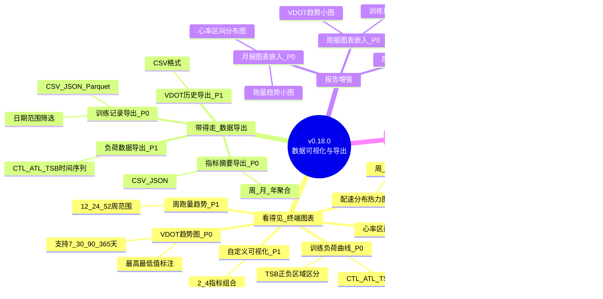

# PRD: v0.18.0 数据可视化与导出

> **文档版本**: v1.1
> **创建日期**: 2026-05-03
> **版本基线**: v0.17.0
> **对齐文档**: [产品规划方案](../product/产品规划方案.md) v5.5 | [架构设计说明书](../architecture/架构设计说明书.md) v4.2.0
> **需求来源**: 产品规划方案 v5.5 §4.2

---

## 1. 项目背景

### 1.1 版本主题

**让数据"看得见、带得走"**

### 1.2 用户问题

> "我知道你们分析了我的心率、配速、VDOT，但终端里一堆数字我看不懂趋势。我想看看我过去三个月的进步曲线，还想把数据导出来用 Python 自己分析。"

### 1.3 核心价值

| 价值维度 | 用户获益 | 当前痛点 |
|----------|---------|---------|
| **看得见** | 终端内直观看到训练趋势图表 | 只有数字表格，无法直观感知变化趋势 |
| **带得走** | 数据可导出为CSV/JSON/Parquet | 数据锁定在系统内，无法二次分析 |
| **可分享** | 周报/月报嵌入图表，信息密度更高 | 报告只有文字和数字，信息传达效率低 |

### 1.4 目标用户

与项目整体目标用户一致：**数据敏感的严肃跑者**（25-45岁技术从业者，规律跑步2年+）

### 1.5 版本边界

**本版本聚焦**：终端内可视化 + 数据可导出

**明确不做**：
- Web UI / 浏览器端可视化（P2延后至v1.x）
- 实时数据流可视化
- 多用户数据对比
- 云端数据同步

---

## 2. 功能需求

### 2.1 终端图表显示系统（P0）

#### 2.1.1 REQ-0.18-01: VDOT趋势图

**需求描述**: 在终端内以折线图形式展示VDOT随时间的变化趋势

**功能要点**:
- 支持7天/30天/90天/365天时间范围筛选
- X轴为日期，Y轴为VDOT值
- 数据点标注（最高/最低值）
- 缺失数据点平滑处理

**用户故事**:
- 作为跑者，我想看到过去3个月的VDOT趋势，了解自己有氧能力是否在进步
- 作为跑者，我想快速切换不同时间范围，对比不同阶段的VDOT变化

**验收标准**:
- [ ] AC-01: 图表在80列以上终端清晰可读，无字符重叠
- [ ] AC-02: 支持 `--days 7/30/90/365` 参数筛选时间范围
- [ ] AC-03: 数据点与VDOT计算器输出结果完全一致（误差<0.1）
- [ ] AC-04: 最高/最低VDOT值有标注
- [ ] AC-05: 无数据时显示"该时间段无VDOT数据"提示

**CLI命令**:
```bash
uv run nanobotrun viz vdot --days 90
```

---

#### 2.1.2 REQ-0.18-02: 训练负荷曲线

**需求描述**: 在终端内以多线折线图展示CTL/ATL/TSB随时间的变化趋势

**功能要点**:
- CTL/ATL/TSB三条曲线同屏显示
- 不同颜色/线型区分三条曲线
- TSB正值区域（绿色，`+`符号填充）和负值区域（红色，`-`符号填充），零线用`─`标注
- 峰值/谷值标注
- 支持时间范围筛选
- **数据源**: 复用 `AnalyticsEngine.get_training_load_trend()` 已有方法，直接获取每日TSS/ATL/CTL/TSB时间序列

**用户故事**:
- 作为跑者，我想看到训练负荷的变化趋势，判断自己是否过度训练
- 作为跑者，我想看到TSB从负值回到正值的过程，了解恢复状态

**验收标准**:
- [ ] AC-01: 三条曲线颜色/线型可区分（CTL蓝色、ATL红色、TSB绿色）
- [ ] AC-02: TSB>0区域使用`+`符号填充，TSB<0区域使用`-`符号填充，零线用`─`标注
- [ ] AC-03: 支持 `--days 30/90/180` 参数筛选时间范围
- [ ] AC-04: 数据点与 `analytics.get_training_load_trend()` 返回结果完全一致
- [ ] AC-05: 图例清晰标注CTL(体能)/ATL(疲劳)/TSB(状态)含义

**CLI命令**:
```bash
uv run nanobotrun viz load --days 90
```

---

#### 2.1.3 REQ-0.18-03: 心率区间分布图

**需求描述**: 在终端内以堆叠柱状图展示各心率区间的时长占比

**功能要点**:
- 按心率区间（Z1-Z5）堆叠显示时长占比
- 百分比精确到1%
- P0支持按日期范围聚合（复用现有 `HeartRateAnalyzer.get_heart_rate_zones(age, start_date, end_date)`）
- P1扩展支持按周/月聚合维度（需新增 `_aggregate_hr_zones_by_period()` 方法）
- 颜色编码与心率区间含义对应

**用户故事**:
- 作为跑者，我想看到本周的心率区间分布，判断训练强度是否合理
- 作为跑者，我想对比不同月份的心率区间分布变化

**验收标准**:
- [ ] AC-01: 各区间百分比之和为100%（误差<1%）
- [ ] AC-02: P0支持 `--start`/`--end` 日期范围筛选；P1扩展 `--period weekly/monthly` 聚合维度
- [ ] AC-03: Z1-Z5颜色编码一致（Z1蓝/Z2绿/Z3黄/Z4橙/Z5红）
- [ ] AC-04: 无心率数据时显示"该记录无心率数据"提示

**CLI命令**:
```bash
# P0: 日期范围筛选
uv run nanobotrun viz hr-zones --start 2024-01-01 --end 2024-01-31
# P1: 聚合维度
uv run nanobotrun viz hr-zones --period weekly
```

---

### 2.2 数据导出系统（P0）

#### 2.2.1 REQ-0.18-04: 训练记录导出

**需求描述**: 将训练记录导出为CSV/JSON/Parquet格式文件

**功能要点**:
- 支持CSV/JSON/Parquet三种导出格式
- 按日期范围筛选（`--start`/`--end`参数）
- 导出字段：日期、距离、时长、平均配速、平均心率、最大心率、TSS、VDOT
- **计算字段策略**: TSS/VDOT等计算值在导出时实时计算（基于已有 `calculate_tss_for_run` / `calculate_vdot`），采用分批计算+流式写入，避免内存溢出；Parquet格式导出原始字段不含计算值
- 指定输出文件路径（`--output`参数）

**用户故事**:
- 作为跑者，我想把Q1的训练数据导出为CSV，用Python自己分析
- 作为跑者，我想把全部训练记录导出为Parquet，做数据备份

**验收标准**:
- [ ] AC-01: CSV文件可被 `pandas.read_csv()` 正常读取，无编码问题
- [ ] AC-02: JSON文件符合标准JSON格式，UTF-8编码
- [ ] AC-03: Parquet文件可被 `polars.read_parquet()` 正常读取
- [ ] AC-04: 导出字段完整，不遗漏核心指标
- [ ] AC-05: 日期范围筛选边界正确（包含start，包含end当天）
- [ ] AC-06: 无数据时生成空文件并提示"该时间段无训练记录"
- [ ] AC-07: 导出文件默认权限仅当前用户可读写

**CLI命令**:
```bash
uv run nanobotrun export sessions --start 2024-01-01 --end 2024-03-31 --format csv --output ./q1_data.csv
uv run nanobotrun export sessions --format json --output ./all_sessions.json
uv run nanobotrun export sessions --format parquet --output ./backup.parquet
```

---

#### 2.2.2 REQ-0.18-05: 指标摘要导出

**需求描述**: 将聚合指标（周/月/年维度）导出为CSV/JSON格式

**功能要点**:
- 支持CSV/JSON两种导出格式
- 聚合维度：周/月/年（`--period weekly/monthly/yearly`）
- 导出指标：跑量、平均配速、平均心率、VDOT、TSS、CTL、ATL、TSB
- 指定输出文件路径

**用户故事**:
- 作为跑者，我想导出月度汇总数据，在Excel中做年度对比
- 作为数据分析师，我想获取聚合指标做进一步统计分析

**验收标准**:
- [ ] AC-01: 聚合指标计算结果与CLI `data stats` 命令输出一致
- [ ] AC-02: 周聚合按ISO周计算，月聚合按自然月计算
- [ ] AC-03: CSV文件可被Excel正常打开，无乱码
- [ ] AC-04: JSON文件结构化清晰，包含元数据（导出时间、聚合维度）

**CLI命令**:
```bash
uv run nanobotrun export summary --period monthly --format csv --output ./monthly_stats.csv
uv run nanobotrun export summary --period weekly --format json --output ./weekly_stats.json
```

---

### 2.3 报告图表增强（P0）

#### 2.3.1 REQ-0.18-06: 周报/月报图表增强

**需求描述**: 在现有周报/月报的终端展示中嵌入趋势图表

**功能要点**:
- 周报嵌入：本周VDOT趋势、训练负荷状态图
- 月报嵌入：本月跑量趋势、心率区间分布图
- 图表与文字报告数据来源一致
- 保持现有报告命令接口不变，增强输出内容

**用户故事**:
- 作为跑者，我在看周报时想直接看到趋势图，不用再单独执行viz命令

**验收标准**:
- [ ] AC-01: 周报输出包含VDOT趋势小图和训练负荷状态图
- [ ] AC-02: 月报输出包含跑量趋势小图和心率区间分布图
- [ ] AC-03: 图表数据与报告文字数据完全一致
- [ ] AC-04: 现有报告命令参数和输出格式向后兼容
- [ ] AC-05: 图表渲染失败时降级为纯文字报告，不阻塞报告生成

**CLI命令**:
```bash
# 现有命令不变，输出内容增强
uv run nanobotrun report weekly
uv run nanobotrun report monthly
```

---

### 2.4 P1功能需求

#### 2.4.1 REQ-0.18-07: 周跑量趋势图

**需求描述**: 柱状图展示每周跑量变化

**验收标准**:
- [ ] AC-01: 支持12/24/52周时间范围
- [ ] AC-02: 标注最高/最低周跑量
- [ ] AC-03: 柱状图颜色区分跑量高低（低灰/中蓝/高绿）

**CLI命令**:
```bash
uv run nanobotrun viz weekly-volume --weeks 24
```

---

#### 2.4.2 REQ-0.18-08: 配速分布热力图

**需求描述**: 按周×时段统计配速分布，以热力图矩阵展示

**验收标准**:
- [ ] AC-01: X轴为时段（早/午/晚/夜），Y轴为星期
- [ ] AC-02: 颜色深浅表示配速快慢
- [ ] AC-03: 支持自定义配速区间阈值

**CLI命令**:
```bash
uv run nanobotrun viz pace-heatmap
```

---

#### 2.4.3 REQ-0.18-09: VDOT历史导出

**需求描述**: 导出全部VDOT计算记录为CSV

**验收标准**:
- [ ] AC-01: 包含计算日期、距离、配速、VDOT值
- [ ] AC-02: 按日期降序排列
- [ ] AC-03: 可被Excel正常打开

**CLI命令**:
```bash
uv run nanobotrun export vdot-history --format csv --output ./vdot_progress.csv
```

---

#### 2.4.4 REQ-0.18-10: 负荷数据导出

**需求描述**: 导出CTL/ATL/TSB时间序列为CSV

**验收标准**:
- [ ] AC-01: 包含日期、CTL、ATL、TSB四列
- [ ] AC-02: 支持日/周粒度（`--granularity daily/weekly`）
- [ ] AC-03: 数据与 `analysis load` 命令输出一致

**CLI命令**:
```bash
uv run nanobotrun export load --granularity daily --output ./load_data.csv
```

---

#### 2.4.5 REQ-0.18-11: 自定义可视化

**需求描述**: 用户可指定2-4个指标组合图表显示

**验收标准**:
- [ ] AC-01: 支持2-4个指标同屏对比
- [ ] AC-02: 可选指标：vdot/ctl/atl/tsb/distance/duration/hr
- [ ] AC-03: 支持对比不同时间段（`--compare`参数）

**CLI命令**:
```bash
uv run nanobotrun viz custom --metrics vdot,ctl,atl --days 90
```

---

#### 2.4.6 REQ-0.18-12: 阶段总结报告

**需求描述**: 支持自定义时间段的综合分析报告

**验收标准**:
- [ ] AC-01: 支持 `--start`/`--end` 自定义时间段
- [ ] AC-02: 包含趋势图表+文字分析
- [ ] AC-03: 报告可保存为文件（`--output`参数）

**CLI命令**:
```bash
uv run nanobotrun report period --start 2024-01-01 --end 2024-03-31
```

---

### 2.5 P2功能需求（延后至v1.x）

| 需求ID | 需求名称 | 延后理由 |
|--------|---------|---------|
| REQ-0.18-13 | Excel导出 | openpyxl依赖较重，P1验证用户需求后再引入 |
| REQ-0.18-14 | 本地HTML报告 | 需引入前端图表库，复杂度高，优先保证终端体验 |
| REQ-0.18-15 | 原始数据完整导出 | 可通过Parquet格式导出近似替代，非紧急 |

---

## 3. 非功能需求

### 3.1 性能需求

| 指标 | 要求 | 测量方式 |
|------|------|---------|
| 图表渲染时间 | < 1秒（1年数据量） | 计时测试 |
| CSV导出时间 | < 3秒（1年数据量） | 计时测试 |
| 图表数据查询 | < 500ms | Polars查询计时 |
| 大数据量导出内存 | < 200MB（3年数据量） | 内存监控 |

### 3.2 安全性需求

| 指标 | 要求 | 实施策略 |
|------|------|---------|
| 导出文件权限 | 默认仅当前用户可读写 | `os.chmod` 设置文件权限 |
| 路径安全 | 禁止路径穿越攻击 | 校验输出路径，禁止 `../` 等路径 |
| 敏感字段过滤 | 导出不包含内部指纹等字段 | 导出字段白名单机制 |

### 3.3 可维护性需求

| 指标 | 要求 | 实施策略 |
|------|------|---------|
| 新增依赖 | 仅 `plotext`（P0），`openpyxl`（P1可选） | pyproject.toml 可选依赖组 |
| 图表渲染器可替换 | 抽象渲染接口 | `ChartRenderer` Protocol |
| 导出引擎可扩展 | 统一导出接口 | `DataExporter` Protocol |
| 单元测试覆盖率 | 新增模块 ≥ 80% | pytest覆盖率报告 |

### 3.4 兼容性需求

| 指标 | 要求 |
|------|------|
| 终端宽度 | 自适应80-200列终端宽度 |
| Windows兼容 | PowerShell/CMD/Windows Terminal均正常渲染 |
| 编码 | CSV使用UTF-8 BOM编码（Excel兼容） |

---

## 4. 技术方案概要

### 4.1 技术选型

| 类别 | 选型 | 理由 |
|------|------|------|
| 终端图表 | `plotext` | 纯Python，无系统依赖，与Rich配合良好 |
| 表格/布局 | `rich`（已有） | 项目已集成，无需新增 |
| 数据处理 | `polars`（已有） | 原生支持CSV/JSON/Parquet导出 |
| Excel导出 | `openpyxl`（P1可选） | 成熟库，Python生态标准 |

### 4.2 模块架构

```
src/
├── cli/
│   ├── commands/
│   │   ├── viz.py              # 新增：可视化命令
│   │   └── export.py           # 新增：导出命令
│   └── handlers/
│       ├── viz_handler.py      # 新增：可视化业务逻辑
│       └── export_handler.py   # 新增：导出业务逻辑
├── core/
│   ├── visualization/          # 新增：可视化核心模块
│   │   ├── __init__.py
│   │   ├── renderer.py         # 图表渲染器（ChartRenderer Protocol）
│   │   ├── plotext_renderer.py # plotext实现
│   │   └── models.py           # 图表数据模型
│   └── export/                 # 新增：导出核心模块
│       ├── __init__.py
│       ├── engine.py           # 导出引擎（DataExporter Protocol）
│       ├── csv_exporter.py     # CSV导出实现
│       ├── json_exporter.py    # JSON导出实现
│       ├── parquet_exporter.py # Parquet导出实现
│       └── models.py           # 导出数据模型
```

### 4.3 数据流设计

```
终端图表: Parquet → Polars LazyFrame → 数据聚合 → ChartRenderer → Rich Console
数据导出: Parquet → Polars LazyFrame → 数据筛选/聚合 → DataExporter → 文件系统
报告增强: Parquet → Polars LazyFrame → ReportService + ChartRenderer → Rich Console
```

### 4.4 依赖注入

```python
# AppContext 新增组件
@dataclass
class AppContext:
    # ... 现有组件
    chart_renderer: ChartRenderer    # 新增
    export_engine: ExportEngine      # 新增
```

---

## 5. 风险评估

| 风险 | 等级 | 触发条件 | 缓解措施 | 残余风险 |
|------|------|----------|----------|---------|
| 终端图表显示效果不佳 | 中 | 复杂图表在窄终端显示混乱 | 检测终端宽度自适应；限制图表复杂度；提供HTML导出备选 | 低 |
| plotext与Windows终端兼容性 | 中 | Windows CMD/PowerShell渲染异常 | 测试Windows终端兼容性；备选Rich原生图表方案 | 低 |
| 大数据量导出性能问题 | 中 | 导出3年+数据时内存不足 | 流式导出；分批次处理；限制单次导出上限 | 低 |
| 图表数据与文字报告不一致 | 中 | 数据查询路径不同 | 统一数据查询入口；图表和报告共用SessionRepository | 低 |
| 时间范围筛选边界错误 | 低 | 日期边界处理不当 | 复用现有SessionRepository查询逻辑；完善边界测试 | 极低 |
| 计算字段导出性能 | 中 | 导出大量记录时逐条计算TSS/VDOT耗时 | 分批计算+进度显示；Parquet格式仅导出原始字段不含计算值；后续版本考虑预计算缓存 | 低 |

---

## 6. 需求追踪矩阵

| 需求ID | 优先级 | 对应产品规划章节 | 依赖模块 | 预估工时 |
|--------|--------|-----------------|---------|---------|
| REQ-0.18-01 | P0 | §4.2.2 终端图表 | analytics.get_vdot_trend() | 8h |
| REQ-0.18-02 | P0 | §4.2.2 终端图表 | analytics.get_training_load_trend() | 6h |
| REQ-0.18-03 | P0 | §4.2.2 终端图表 | heart_rate_analyzer.get_heart_rate_zones() | 5h |
| REQ-0.18-04 | P0 | §4.2.2 数据导出 | session_repository, parquet_manager | 8h |
| REQ-0.18-05 | P0 | §4.2.2 数据导出 | statistics_aggregator, session_repository | 6h |
| REQ-0.18-06 | P0 | §4.2.2 报告增强 | report_service, chart_renderer | 6h |
| REQ-0.18-07 | P1 | §4.2.2 终端图表 | statistics_aggregator | 4h |
| REQ-0.18-08 | P1 | §4.2.2 终端图表 | statistics_aggregator | 6h |
| REQ-0.18-09 | P1 | §4.2.2 数据导出 | vdot_calculator | 3h |
| REQ-0.18-10 | P1 | §4.2.2 数据导出 | training_load_analyzer | 3h |
| REQ-0.18-11 | P1 | §4.2.3 自定义可视化 | chart_renderer | 6h |
| REQ-0.18-12 | P1 | §4.2.3 阶段总结 | report_service, chart_renderer | 4h |

**P0总工时**: 约39小时
**P1总工时**: 约26小时
**合计**: 约65小时（单人3-4周开发周期）

---

## 7. 迭代计划

### 7.1 Sprint 1（第1-2周）：基础设施 + P0核心

| 任务 | 需求ID | 交付物 |
|------|--------|--------|
| 新增 `plotext` 依赖，搭建 visualization 模块骨架 | - | `src/core/visualization/` |
| 实现 ChartRenderer Protocol + plotext_renderer | REQ-0.18-01/02/03 | `renderer.py`, `plotext_renderer.py` |
| 实现 VDOT趋势图 | REQ-0.18-01 | `viz vdot` 命令 |
| 实现训练负荷曲线 | REQ-0.18-02 | `viz load` 命令 |
| 实现 ExportEngine + CSV/JSON/Parquet导出 | REQ-0.18-04 | `src/core/export/` |
| 实现训练记录导出 | REQ-0.18-04 | `export sessions` 命令 |

### 7.2 Sprint 2（第3-4周）：P0完成 + P1选择性实现

| 任务 | 需求ID | 交付物 |
|------|--------|--------|
| 实现心率区间分布图 | REQ-0.18-03 | `viz hr-zones` 命令 |
| 实现指标摘要导出 | REQ-0.18-05 | `export summary` 命令 |
| 周报/月报图表增强 | REQ-0.18-06 | 报告命令输出增强 |
| P1功能选择性实现 | REQ-0.18-07~12 | 视开发进度决定 |
| 集成测试 + 性能测试 | - | 测试报告 |

### 7.3 准入标准

- v0.17.0 已发布且稳定运行
- 核心计算模块（VDOT/TSS/CTL/ATL/TSB/心率区间）测试通过
- SessionRepository 查询接口稳定

### 7.4 准出标准

- P0功能100%实现且测试通过
- 新增模块单元测试覆盖率 ≥ 80%
- 图表渲染时间 < 1秒（1年数据量）
- 导出文件可被Pandas/Polars正常读取
- Windows终端兼容性验证通过

---

## 8. 需求脑图



---

## 9. 变更记录

| 版本 | 日期 | 变更内容 | 作者 |
|------|------|---------|------|
| v1.0 | 2026-05-03 | 初始版本，完成v0.18.0需求分析 | 架构师 |
| v1.1 | 2026-05-03 | 评审修正：B-01修正REQ-0.18-02数据源映射；B-02修正REQ-0.18-03聚合维度P0/P1拆分；B-03补充REQ-0.18-04计算字段策略及风险评估 | 架构师 |
