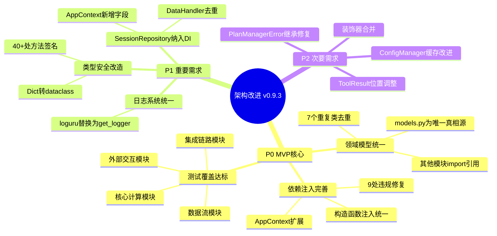
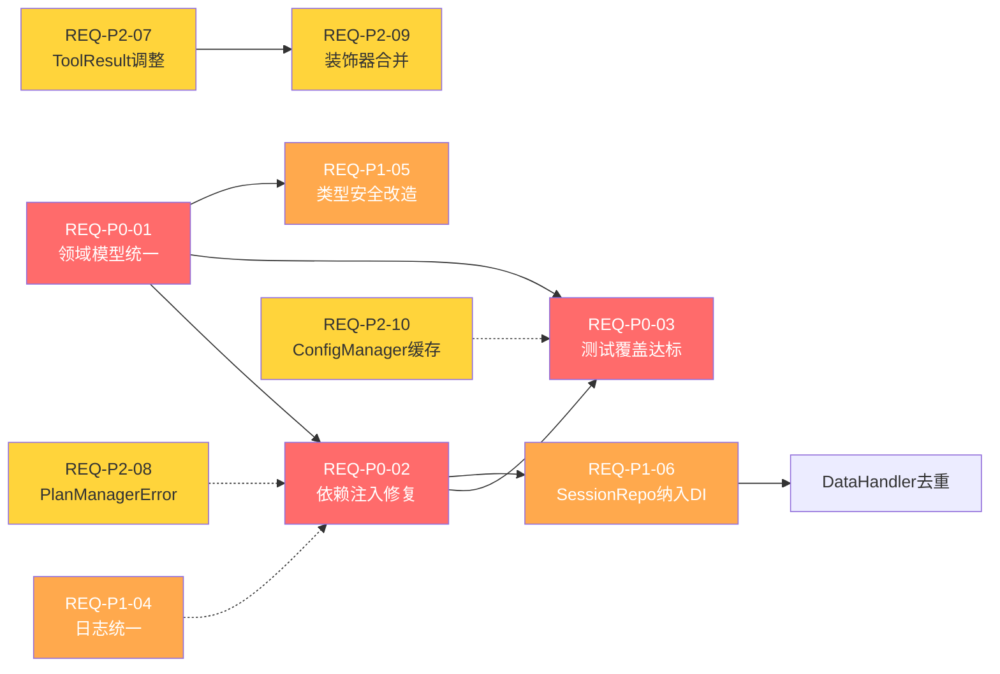

# 需求规格说明书 — 架构改进 v0.9.3

> **文档版本**: v1.0
> **创建日期**: 2026-04-14
> **来源文档**: `docs/review/代码评审报告_v0.9.2.md`
> **需求状态**: 待确认

---

## 1. 项目背景

### 1.1 诉求来源

基于 v0.9.2 架构评审报告（评审结论：⚠️ 不通过），识别出 11 项架构偏离与代码质量问题。这些问题导致项目无法通过发布门禁，需进行系统性整改。

### 1.2 核心目标

1. **消除领域模型碎片化**：统一重复定义，建立唯一真相源
2. **完善依赖注入体系**：消除绕过 AppContext 的直接实例化
3. **提升测试覆盖率至门禁标准**：core≥80% | agents≥70% | cli≥60%

### 1.3 边界范围

- **范围内**：`src/core/`、`src/agents/`、`src/cli/`、`src/notify/` 的架构整改
- **范围外**：新增业务功能、UI/UX 变更、第三方 API 升级

### 1.4 用户画像

| 角色 | 关注点 |
|------|--------|
| 开发工程师 | 代码可维护性、依赖注入清晰度、模型定义唯一性 |
| 测试工程师 | 测试覆盖率、Mock 友好度、测试隔离性 |
| 运维工程师 | 部署稳定性、异常可追溯性 |

---

## 2. 需求脑图

---

## 3. 功能需求

### 3.1 P0 — MVP核心需求（阻塞发布）

---

#### REQ-P0-01：领域模型统一去重

**需求描述**：将分散在多个文件中的 7 个重复领域类统一到 `src/core/models.py`，建立唯一真相源。

**功能要点**：

| 子项 | 当前状态 | 目标状态 |
|------|---------|---------|
| `ProfileStorageManager` | `profile.py` 和 `user_profile_manager.py` 各1份 | 保留 `user_profile_manager.py` 版本，`profile.py` 删除重复定义改为 import |
| `PlanStatus` | `models.py`(Enum) 和 `plan_manager.py`(StrEnum) | 统一到 `models.py`，使用 `StrEnum`（更现代） |
| `FitnessLevel` | 3处定义，枚举值完全不同 | 统一到 `models.py`，合并枚举值为完整集合 |
| `DailyPlan` | `models.py` 和 `training_plan.py`，字段不同 | 统一到 `models.py`，取字段并集 |
| `WeeklySchedule` | `models.py` 和 `training_plan.py`，字段不同 | 统一到 `models.py`，取字段并集 |
| `ReportType` | `report_generator.py`(Enum) 和 `report_service.py`(StrEnum) | 统一到 `models.py`，使用 `StrEnum` |
| `TrainingPlan` | `models.py` 和 `training_plan.py` | 统一到 `models.py`，`training_plan.py` 保留业务逻辑方法 |

**验收标准**：

- [ ] AC-01: `grep -r "class ProfileStorageManager" src/` 仅返回 1 处定义
- [ ] AC-02: `grep -r "class PlanStatus" src/` 仅返回 1 处定义
- [ ] AC-03: `grep -r "class FitnessLevel" src/` 仅返回 1 处定义
- [ ] AC-04: `grep -r "class DailyPlan" src/` 仅返回 1 处定义
- [ ] AC-05: `grep -r "class WeeklySchedule" src/` 仅返回 1 处定义
- [ ] AC-06: `grep -r "class ReportType" src/` 仅返回 1 处定义
- [ ] AC-07: `grep -r "class TrainingPlan" src/` 仅返回 1 处定义（`models.py`）
- [ ] AC-08: 所有原重复定义位置改为 `from src.core.models import ...`
- [ ] AC-09: `uv run pytest tests/unit/` 通过率 100%
- [ ] AC-10: `uv run mypy src/` 零错误

**前置依赖**：无

**风险**：
- `FitnessLevel` 三处枚举值不同，合并时需确认业务语义对应关系
- `DailyPlan`/`WeeklySchedule` 字段不同，合并后可能影响序列化/反序列化

---

#### REQ-P0-02：依赖注入违规修复

**需求描述**：消除 9 处绕过 AppContext 的核心组件直接实例化，统一通过构造函数注入 AppContext。

**功能要点**：

| 子项 | 违规位置 | 修复方式 |
|------|---------|---------|
| DI-01 | `data_handler.py:175` `AnalyticsEngine(self.storage)` | 改为 `self.analytics`（通过构造函数注入的 context 获取） |
| DI-02 | `profile.py:1100` `AnalyticsEngine(self.storage)` | ProfileEngine 通过构造函数接收 AppContext，使用 `context.analytics` |
| DI-03 | `profile.py:1216` `AnalyticsEngine(self.storage)` | 同 DI-02 |
| DI-04 | `report_generator.py:268` `AnalyticsEngine(self.storage)` | ReportGenerator 通过构造函数接收 AppContext |
| DI-05 | `report_service.py:44` `AnalyticsEngine(self.storage)` | ReportService 通过构造函数接收 AppContext |
| DI-06 | `importer.py:36` `StorageManager()` | ImportService 通过构造函数接收 AppContext |
| DI-07 | `feishu.py:41` `ConfigManager()` | FeishuBot 通过构造函数接收 ConfigManager |
| DI-08 | `feishu_calendar.py:307` `ConfigManager()` | FeishuCalendar 通过构造函数接收 ConfigManager |
| DI-09 | `plan_manager.py:76` `ConfigManager()` | PlanManager 通过构造函数接收 AppContext |

**验收标准**：

- [ ] AC-01: `grep -rn "AnalyticsEngine(" src/ | grep -v "context.py" | grep -v "__init__"` 返回 0 行（无外部直接实例化）
- [ ] AC-02: `grep -rn "StorageManager()" src/ | grep -v "context.py"` 返回 0 行
- [ ] AC-03: `grep -rn "ConfigManager()" src/ | grep -v "context.py" | grep -v "config.py"` 返回 0 行
- [ ] AC-04: `AppContext` 新增 `session_repo: SessionRepository` 字段
- [ ] AC-05: `AppContext` 新增 `report_service: ReportService` 字段
- [ ] AC-06: `AppContext` 新增 `plan_manager: PlanManager` 字段
- [ ] AC-07: `AppContextFactory.create()` 自动创建所有新增组件
- [ ] AC-08: `uv run pytest tests/unit/` 通过率 100%
- [ ] AC-09: `uv run mypy src/` 零错误

**前置依赖**：REQ-P0-01（领域模型统一后，AppContext 的类型引用更清晰）

**风险**：
- 构造函数签名变更可能导致现有测试的 Mock 需要同步调整
- 循环依赖风险：AppContext → ReportService → AnalyticsEngine → StorageManager（当前无循环，但需验证新增组件后是否引入）

---

#### REQ-P0-03：核心模块测试覆盖达标

**需求描述**：将核心模块测试覆盖率从 22% 提升至门禁标准（core≥80%）。

**功能要点**：

分四批补充测试，按投入产出比排序：

**第一批：核心计算模块（纯逻辑，Mock少）**

| 模块 | 当前覆盖率 | 目标覆盖率 | 预估用例数 |
|------|-----------|-----------|-----------|
| `vdot_calculator.py` | 22% | ≥80% | ~15 |
| `training_load_analyzer.py` | ~30% | ≥80% | ~20 |
| `heart_rate_analyzer.py` | ~35% | ≥80% | ~15 |

**第二批：数据流模块（Mock StorageManager）**

| 模块 | 当前覆盖率 | 目标覆盖率 | 预估用例数 |
|------|-----------|-----------|-----------|
| `session_repository.py` | ~40% | ≥80% | ~15 |
| `statistics_aggregator.py` | ~35% | ≥80% | ~12 |
| `storage.py` | ~45% | ≥80% | ~15 |

**第三批：集成链路模块（Mock多依赖）**

| 模块 | 当前覆盖率 | 目标覆盖率 | 预估用例数 |
|------|-----------|-----------|-----------|
| `profile.py` | ~30% | ≥80% | ~20 |
| `report_generator.py` | ~25% | ≥80% | ~15 |
| `importer.py` | ~40% | ≥80% | ~10 |

**第四批：外部交互模块（Mock HTTP）**

| 模块 | 当前覆盖率 | 目标覆盖率 | 预估用例数 |
|------|-----------|-----------|-----------|
| `feishu.py` | 18% | ≥70% | ~15 |
| `feishu_calendar.py` | 22% | ≥70% | ~15 |

**验收标准**：

- [ ] AC-01: `uv run pytest tests/unit/ --cov=src/core --cov-report=term-missing` 显示 core 总覆盖率 ≥ 80%
- [ ] AC-02: `vdot_calculator.py` 覆盖率 ≥ 80%
- [ ] AC-03: `training_load_analyzer.py` 覆盖率 ≥ 80%
- [ ] AC-04: `heart_rate_analyzer.py` 覆盖率 ≥ 80%
- [ ] AC-05: `session_repository.py` 覆盖率 ≥ 80%
- [ ] AC-06: `uv run pytest tests/unit/` 通过率 100%
- [ ] AC-07: 所有新增测试使用 `unittest.mock.Mock`，不使用真实文件/网络
- [ ] AC-08: 无测试间状态泄漏（`ConfigManager._cache` 等类变量在 fixture 中重置）

**前置依赖**：REQ-P0-01、REQ-P0-02（先完成模型统一和DI修复，避免测试写完又重构）

**风险**：
- 第三/四批模块依赖较多，Mock 编写复杂度高
- 覆盖率数值可能因分支覆盖不完全而难以达标

---

### 3.2 P1 — 重要需求

---

#### REQ-P1-04：日志系统统一

**需求描述**：消除 `config.py` 中对 loguru 的依赖，统一使用项目自定义的 `get_logger`。

**功能要点**：

| 子项 | 当前代码 | 目标代码 |
|------|---------|---------|
| LOG-01 | `import loguru; loguru.logger.debug(...)` | `from src.core.logger import get_logger; logger = get_logger(__name__); logger.debug(...)` |
| LOG-02 | `import loguru; loguru.logger.info(...)` | 同上 |
| LOG-03 | `import loguru; loguru.logger.warning(...)` | 同上 |

**验收标准**：

- [ ] AC-01: `grep -rn "loguru" src/` 返回 0 行
- [ ] AC-02: `uv run pytest tests/unit/test_config.py` 通过率 100%
- [ ] AC-03: `uv run mypy src/core/config.py` 零错误

**前置依赖**：无（可独立执行）

---

#### REQ-P1-05：返回类型安全改造

**需求描述**：将 40+ 处 `Dict[str, Any]` 返回类型替换为类型安全的 `frozen dataclass`。

**功能要点**：

优先改造对外 API 层（影响面最大）：

| 优先级 | 方法 | 新返回类型 | 所属模块 |
|--------|------|-----------|---------|
| 高 | `analytics.get_running_stats()` | `RunningStats` | `analytics.py` |
| 高 | `analytics.analyze_hr_drift()` | `HRDriftResult` | `analytics.py` |
| 高 | `analytics.get_hr_zones()` | `HRZoneResult` | `heart_rate_analyzer.py` |
| 高 | `report_generator.generate_report()` | `ReportData` | `report_generator.py` |
| 中 | `hard_validator.validate_*()` (6个方法) | `ValidationResult`（已存在于models.py） | `hard_validator.py` |
| 中 | `feishu_calendar.*_event()` (5个方法) | `CalendarEventResult` | `feishu_calendar.py` |
| 低 | 内部辅助方法 | 渐进式替换 | 各模块 |

**验收标准**：

- [ ] AC-01: `grep -rn "Dict\[str, Any\]" src/core/analytics.py` 返回 0 行
- [ ] AC-02: `grep -rn "Dict\[str, Any\]" src/core/heart_rate_analyzer.py` 返回 0 行
- [ ] AC-03: `grep -rn "Dict\[str, Any\]" src/core/report_generator.py` 返回 0 行
- [ ] AC-04: 所有新增 dataclass 使用 `@dataclass(frozen=True)`
- [ ] AC-05: 所有新增 dataclass 提供 `to_dict()` 方法（兼容 JSON 序列化）
- [ ] AC-06: `uv run pytest tests/unit/` 通过率 100%
- [ ] AC-07: `uv run mypy src/` 零错误

**前置依赖**：REQ-P0-01（新增 dataclass 应定义在统一的 `models.py` 中）

---

#### REQ-P1-06：SessionRepository 纳入 AppContext 与 DataHandler 去重

**需求描述**：将 `SessionRepository` 纳入 `AppContext` 依赖注入体系，并消除 `DataHandler.get_recent_runs()` 中与 `SessionRepository` 重复的 session 聚合逻辑。

**功能要点**：

| 子项 | 当前状态 | 目标状态 |
|------|---------|---------|
| SR-01 | `AppContext` 无 `session_repo` 字段 | `AppContext` 新增 `session_repo: SessionRepository` |
| SR-02 | `AppContextFactory.create()` 未创建 `SessionRepository` | 自动创建 `SessionRepository(storage)` |
| SR-03 | `DataHandler.get_recent_runs()` 自行实现 session 聚合 | 委托给 `context.session_repo.get_recent_sessions()` |

**验收标准**：

- [ ] AC-01: `AppContext` 包含 `session_repo: SessionRepository` 字段
- [ ] AC-02: `DataHandler.get_recent_runs()` 内部调用 `self.session_repo` 方法，无重复聚合逻辑
- [ ] AC-03: `uv run pytest tests/unit/` 通过率 100%
- [ ] AC-04: `uv run pytest tests/e2e/` 通过率 100%

**前置依赖**：REQ-P0-02（AppContext 扩展是 DI 修复的一部分）

---

### 3.3 P2 — 次要需求

---

#### REQ-P2-07：ToolResult 位置调整

**需求描述**：将 `ToolResult` 从 `src/core/exceptions.py` 移至 `src/core/result.py`。

**验收标准**：

- [ ] AC-01: `src/core/exceptions.py` 不再包含 `ToolResult` 类
- [ ] AC-02: `src/core/result.py` 包含 `ToolResult` 类
- [ ] AC-03: 所有 `from src.core.exceptions import ToolResult` 改为 `from src.core.result import ToolResult`
- [ ] AC-04: `uv run pytest tests/unit/` 通过率 100%

**前置依赖**：无

---

#### REQ-P2-08：PlanManagerError 继承修复

**需求描述**：将 `PlanManagerError` 的基类从 `Exception` 改为 `NanobotRunnerError`。

**验收标准**：

- [ ] AC-01: `PlanManagerError` 继承 `NanobotRunnerError`
- [ ] AC-02: `PlanManagerError` 包含 `error_code` 和 `recovery_suggestion` 字段
- [ ] AC-03: `uv run pytest tests/unit/core/plan/` 通过率 100%

**前置依赖**：无

---

#### REQ-P2-09：装饰器合并

**需求描述**：合并 `tool_wrapper` 和 `handle_tool_errors` 为单一装饰器，通过参数控制返回格式。

**验收标准**：

- [ ] AC-01: `decorators.py` 中仅保留 1 个工具异常处理装饰器
- [ ] AC-02: 装饰器支持 `return_format: str = "json"` 参数控制返回类型
- [ ] AC-03: 所有使用 `tool_wrapper` 和 `handle_tool_errors` 的代码迁移完成
- [ ] AC-04: `uv run pytest tests/unit/test_decorators.py` 通过率 100%

**前置依赖**：REQ-P2-07（ToolResult 位置调整后，装饰器 import 路径需同步更新）

---

#### REQ-P2-10：ConfigManager 缓存改进

**需求描述**：将 `ConfigManager._cache` 和 `_cache_time` 从类变量改为实例变量，并新增 `reset_cache()` 类方法供测试使用。

**验收标准**：

- [ ] AC-01: `_cache` 和 `_cache_time` 为实例变量（非类变量）
- [ ] AC-02: 新增 `@classmethod reset_cache(cls)` 方法
- [ ] AC-03: 测试 fixture 中调用 `ConfigManager.reset_cache()` 确保隔离
- [ ] AC-04: `uv run pytest tests/unit/test_config.py` 通过率 100%

**前置依赖**：无

---

## 4. 非功能需求

### 4.1 性能要求

| 指标 | 要求 | 验证方式 |
|------|------|---------|
| 领域模型合并后启动时间 | 不劣于当前（≤ 2s） | `uv run nanobotrun system version` 计时 |
| 依赖注入链路初始化 | ≤ 500ms | AppContextFactory.create() 计时 |
| 测试套件执行时间 | ≤ 120s（全量单元测试） | `uv run pytest tests/unit/ --durations=0` |

### 4.2 安全要求

| 指标 | 要求 | 验证方式 |
|------|------|---------|
| 无硬编码密钥 | 0 处 | `grep -rn "app_secret\|api_key" src/` 排除 config 读取 |
| 异常信息不泄露内部实现 | 所有对外异常使用 NanobotRunnerError 体系 | mypy 类型检查 + 代码审查 |

### 4.3 可维护性要求

| 指标 | 要求 | 验证方式 |
|------|------|---------|
| ruff check | 零警告 | `uv run ruff check src/` |
| mypy | 零错误 | `uv run mypy src/ --ignore-missing-imports` |
| 重复类定义 | 0 处 | `grep -r "class (ProfileStorageManager|PlanStatus|FitnessLevel|DailyPlan|WeeklySchedule|ReportType|TrainingPlan)" src/` 仅返回 models.py |

---

## 5. 需求依赖关系

---

## 6. 迭代计划

### v0.9.3-alpha — MVP迭代（P0）

| 需求 | 预估工时 | 交付物 |
|------|---------|--------|
| REQ-P0-01 领域模型统一 | 24h | `models.py` 统一版本 + 各模块 import 迁移 |
| REQ-P0-02 依赖注入修复 | 16h | `AppContext` 扩展 + 9处违规修复 |
| REQ-P0-03 测试覆盖（第一批） | 16h | vdot/training_load/heart_rate 单元测试 |
| REQ-P0-03 测试覆盖（第二批） | 16h | session_repo/statistics/storage 单元测试 |

**准入标准**：评审报告已确认，需求已拆解
**准出标准**：P0 全部 AC 通过 + `uv run pytest tests/unit/` 通过率 100% + core 覆盖率 ≥ 60%

### v0.9.3-beta — 完善迭代（P1 + P0第三/四批测试）

| 需求 | 预估工时 | 交付物 |
|------|---------|--------|
| REQ-P0-03 测试覆盖（第三批） | 16h | profile/report/importer 单元测试 |
| REQ-P0-03 测试覆盖（第四批） | 16h | feishu/feishu_calendar 单元测试 |
| REQ-P1-04 日志系统统一 | 4h | config.py loguru 清除 |
| REQ-P1-05 类型安全改造 | 24h | 新增 dataclass + 方法签名迁移 |
| REQ-P1-06 SessionRepo纳入DI | 8h | AppContext扩展 + DataHandler去重 |

**准入标准**：v0.9.3-alpha 准出通过
**准出标准**：P1 全部 AC 通过 + core 覆盖率 ≥ 80% + agents 覆盖率 ≥ 70%

### v0.9.3 — 正式版（P2）

| 需求 | 预估工时 | 交付物 |
|------|---------|--------|
| REQ-P2-07 ToolResult位置调整 | 4h | `src/core/result.py` |
| REQ-P2-08 PlanManagerError继承修复 | 2h | 异常类继承修正 |
| REQ-P2-09 装饰器合并 | 4h | 统一装饰器 |
| REQ-P2-10 ConfigManager缓存改进 | 4h | 实例变量 + reset_cache() |

**准入标准**：v0.9.3-beta 准出通过
**准出标准**：全部 AC 通过 + `uv run ruff check src/` 零警告 + `uv run mypy src/` 零错误 + 重新评审通过

---

## 7. 风险评估

| 风险ID | 风险描述 | 可能性 | 影响 | 规避方案 |
|--------|---------|--------|------|---------|
| RSK-01 | `FitnessLevel` 三处枚举值不同，合并时业务语义冲突 | 高 | 高 | 逐一比对三处定义的枚举值与使用场景，确认映射关系后再合并 |
| RSK-02 | 构造函数签名变更导致现有测试大面积失败 | 中 | 中 | 先补充测试再改签名；使用 `AppContextFactory.create_for_testing()` 注入 Mock |
| RSK-03 | AppContext 新增组件后引入循环依赖 | 低 | 高 | 新增组件后立即运行 `mypy` 检测；保持 AppContext 仅依赖直接子模块 |
| RSK-04 | 测试覆盖率因分支覆盖不完整难以达标 | 中 | 中 | 优先覆盖核心业务分支；使用 `--cov-fail-under` 渐进式提升阈值 |
| RSK-05 | Dict→dataclass 改造破坏 JSON 序列化兼容性 | 中 | 高 | 所有新增 dataclass 提供 `to_dict()` 方法；Agent Tools 输出格式不变 |

---

## 8. 需求追踪矩阵

| 需求ID | 评审报告编号 | 优先级 | 验收标准数 | 前置依赖 | 迭代 |
|--------|------------|--------|-----------|---------|------|
| REQ-P0-01 | P0-1 | 🔴 阻塞 | 10 | 无 | alpha |
| REQ-P0-02 | P0-2 | 🔴 阻塞 | 9 | REQ-P0-01 | alpha |
| REQ-P0-03 | P0-3 | 🔴 阻塞 | 8 | REQ-P0-01, REQ-P0-02 | alpha~beta |
| REQ-P1-04 | P1-4 | 🟠 高 | 3 | 无 | beta |
| REQ-P1-05 | P1-5 | 🟠 高 | 7 | REQ-P0-01 | beta |
| REQ-P1-06 | P1-6/P1-7 | 🟠 高 | 4 | REQ-P0-02 | beta |
| REQ-P2-07 | P2-8 | 🟡 中 | 4 | 无 | 正式版 |
| REQ-P2-08 | P2-9 | 🟡 中 | 3 | 无 | 正式版 |
| REQ-P2-09 | P2-10 | 🟡 中 | 4 | REQ-P2-07 | 正式版 |
| REQ-P2-10 | P2-11 | 🟡 中 | 4 | 无 | 正式版 |

**需求总数**: 10
**MVP核心需求数**: 3（REQ-P0-01/02/03）
**验收标准总数**: 56

---

**文档编写**: 架构师智能体
**编写日期**: 2026-04-14
