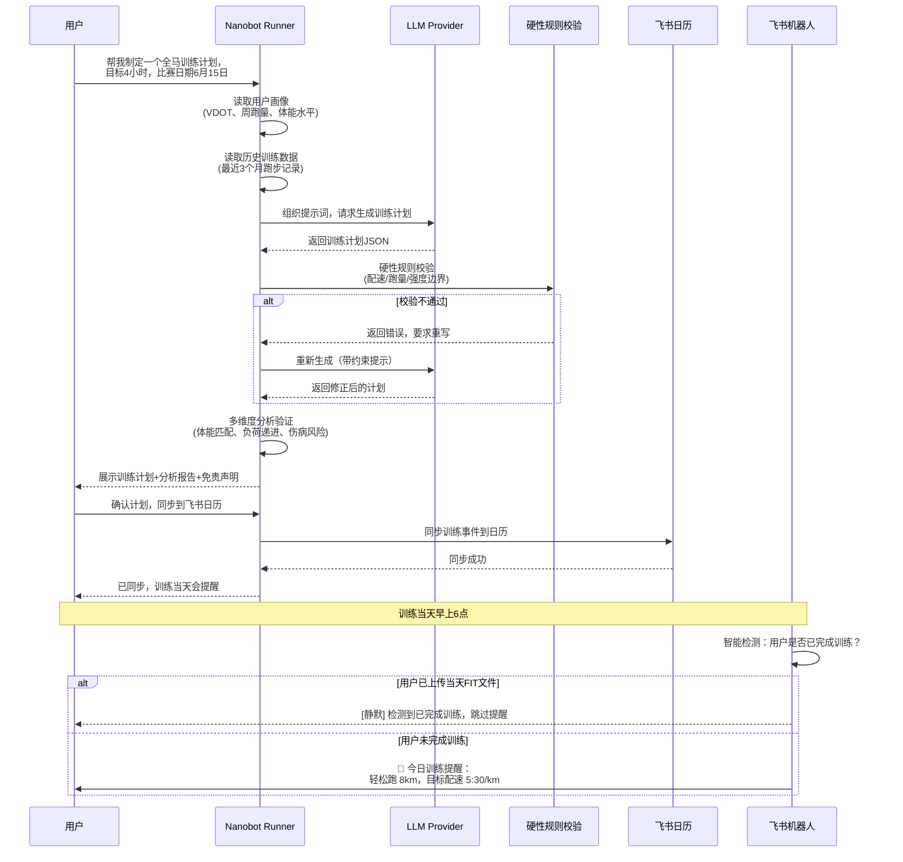
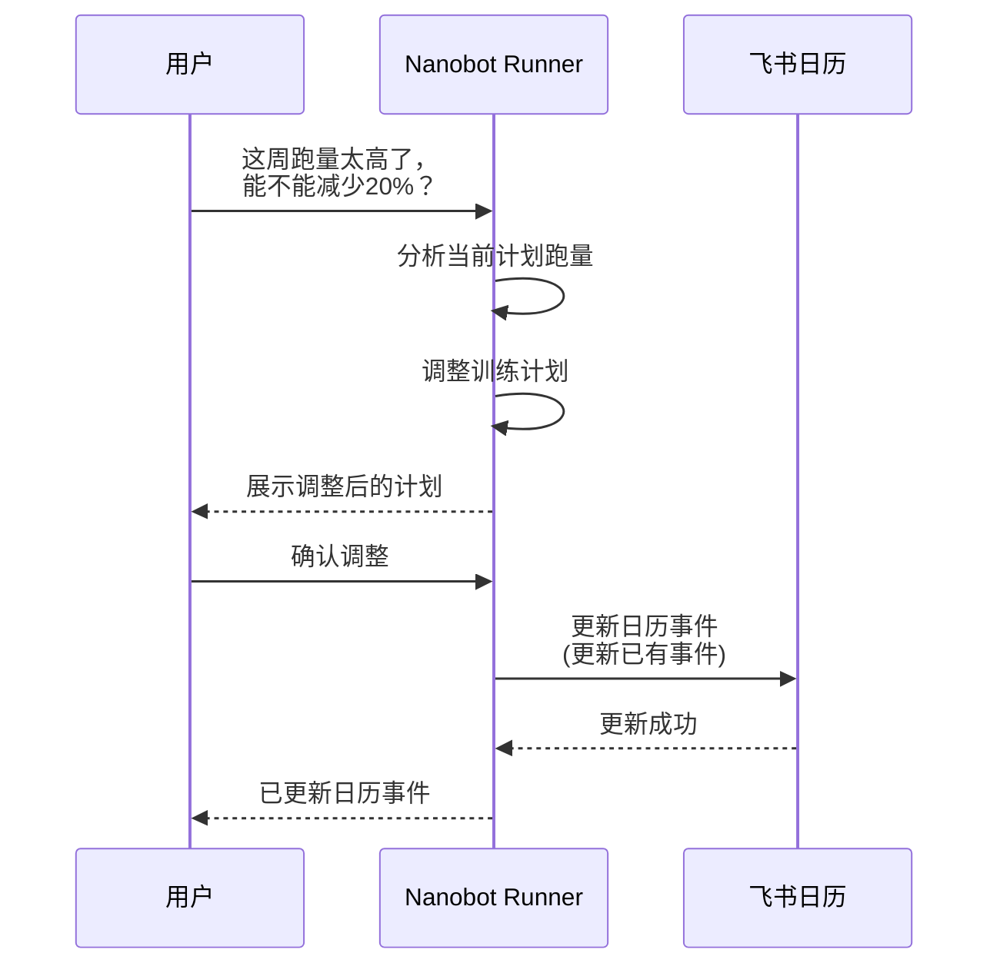
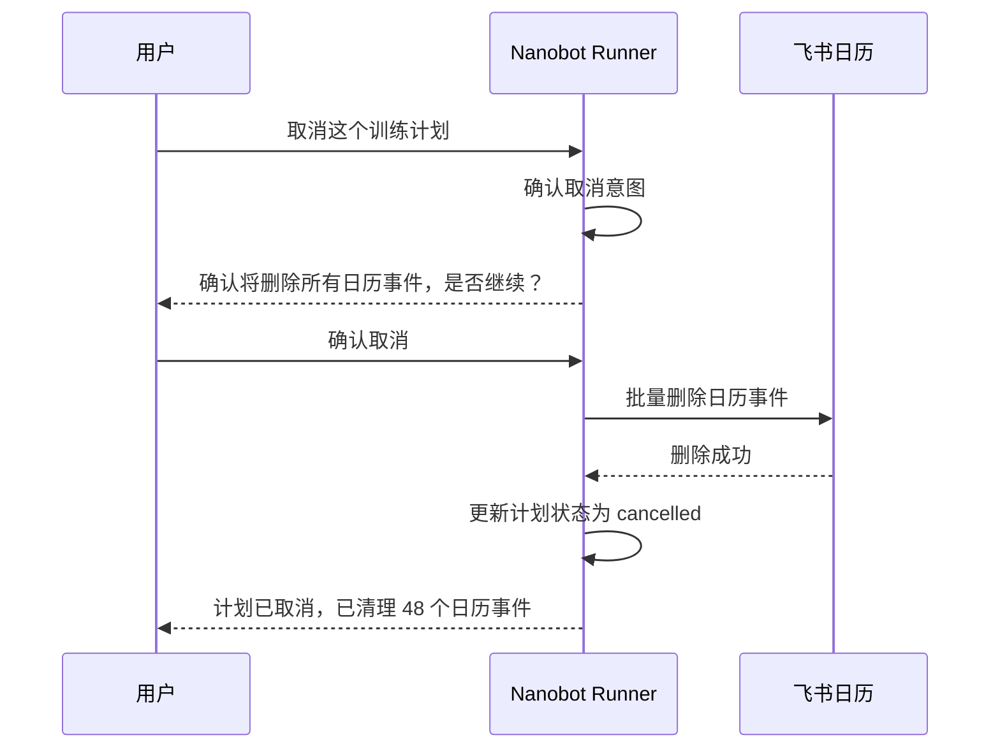
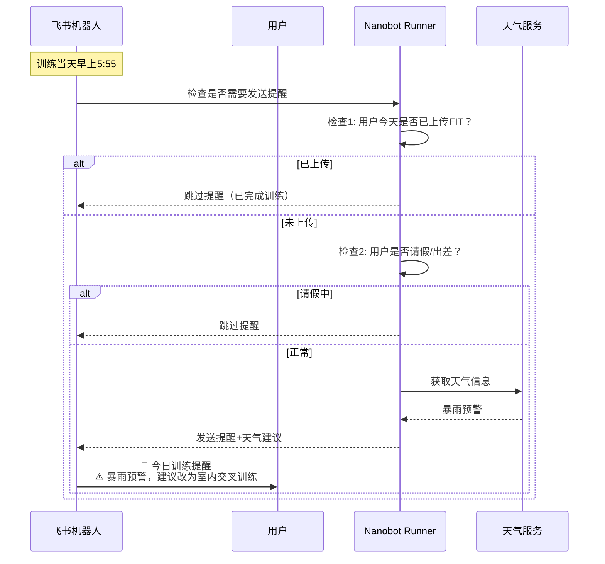
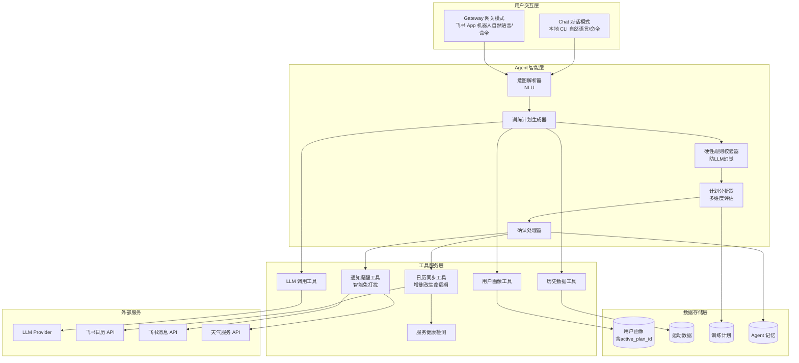
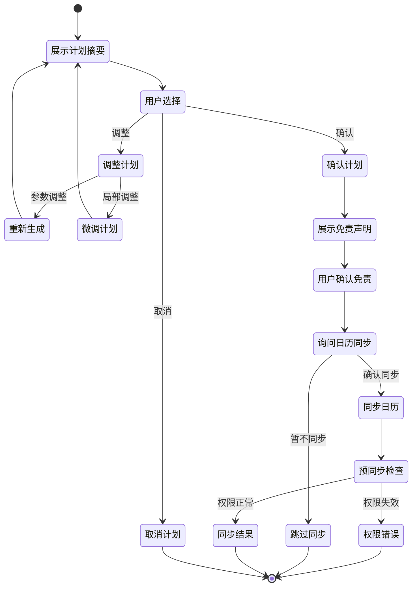
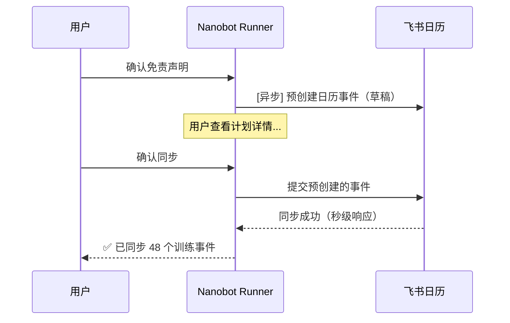
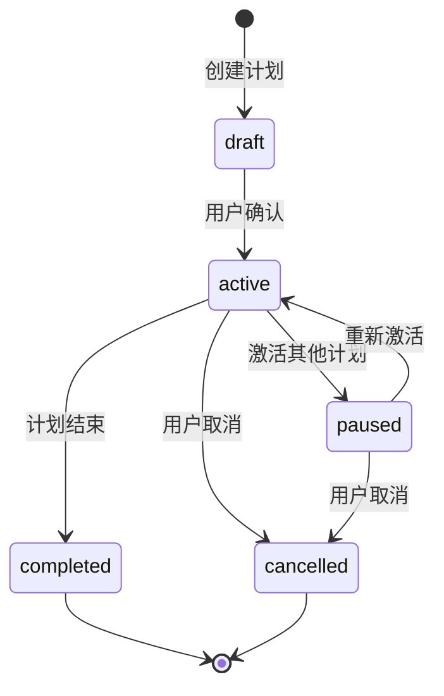

# 产品需求文档 (PRD)

## 训练计划制定与飞书日历同步功能

***

| 文档信息     | 内容                                                     |
| -------- | ------------------------------------------------------ |
| **文档版本** | v1.3.0                                                 |
| **创建日期** | 2026-03-31                                             |
| **最后更新** | 2026-04-01                                             |
| **文档状态** | 评审修订版                                                  |
| **维护者**  | Architecture Agent                                     |
| **关联需求** | REQ\_需求规格说明书.md                                        |
| **修订说明** | 根据产品经理评审意见修订，补充业务边界、免责声明、交互优化、预同步策略、交互模式定位澄清等 |

***

## 1. 文档概述

### 1.1 编写目的

本文档旨在详细描述 Nanobot Runner「训练计划制定与飞书日历同步」功能的产品需求，为后续系统架构设计、开发任务拆解、测试验收提供唯一、可落地、无歧义的执行标准。

### 1.2 适用范围

本文档适用于以下角色：

- **架构师**：作为架构设计的输入依据
- **开发工程师**：作为功能开发的执行标准
- **测试工程师**：作为测试用例设计的验收依据
- **产品经理/用户**：作为需求确认的参考文档

### 1.3 参考文档

| 文档名称      | 路径                                  |
| --------- | ----------------------------------- |
| 需求规格说明书   | `docs/requirements/REQ_需求规格说明书.md`  |
| 系统架构设计说明书 | `docs/architecture/架构设计说明书.md`      |
| Agent配置指南 | `docs/guides/agent_config_guide.md` |

### 1.4 修订历史

| 版本     | 日期         | 修订内容                                                      | 修订人                |
| ------ | ---------- | --------------------------------------------------------- | ------------------ |
| v1.0.0 | 2026-03-31 | 初稿                                                        | Architecture Agent |
| v1.1.0 | 2026-04-01 | 根据PM评审意见修订：补充日历事件生命周期管理、医疗免责声明、LLM硬性规则校验、交互展示优化、产品业务指标体系等 | Architecture Agent |
| v1.2.0 | 2026-04-01 | 根据PM二次评审修订：补充每次提醒附带免责声明、预同步/乐观更新策略、免责声明强制展示规则             | Architecture Agent |
| v1.3.0 | 2026-04-01 | 根据PM三次评审修订：澄清交互模式定位（Gateway=飞书App机器人），统一Chat/Gateway功能支持 | Architecture Agent |

***

## 2. 需求背景

### 2.1 业务背景

Nanobot Runner 作为桌面端私人 AI 跑步助理，目前已具备：

- FIT 文件导入与解析能力
- VDOT、TSS、心率漂移等数据分析能力
- 用户画像系统（profile.json + MEMORY.md）
- 训练计划引擎（TrainingPlanEngine）
- 飞书日历同步服务（FeishuCalendarSync）
- 飞书机器人通知（FeishuBot）

然而，上述能力尚未形成完整的「训练计划制定→分析验证→日历同步→提醒通知」闭环流程，用户需要手动串联各个环节，体验不够流畅。

### 2.2 用户痛点

| 痛点编号 | 痛点描述                        | 影响程度 |
| ---- | --------------------------- | ---- |
| P1   | 用户需要手动组织训练计划需求，无法通过自然语言交互完成 | 高    |
| P2   | 生成的训练计划缺乏多维度验证，可能不适合用户实际情况  | 高    |
| P3   | 训练计划与日历同步需要手动操作，容易遗漏        | 中    |
| P4   | 缺乏训练提醒机制，用户容易忘记执行训练计划       | 中    |

### 2.3 需求目标

构建「训练计划智能制定与飞书日历闭环」功能，实现：

1. **自然语言交互优先**：用户通过对话方式提出训练计划需求，Agent 的 NLU 自动将自然语言映射为意图，无需用户记忆命令
2. **智能计划生成**：Agent 根据用户画像、历史数据、目标自动生成个性化训练计划
3. **硬性规则校验**：在 LLM 生成后增加硬性规则校验层，防止 LLM 幻觉导致的反人类计划
4. **多维分析验证**：从体能水平、训练负荷、伤病风险等角度验证计划合理性
5. **一键日历同步**：用户确认后自动同步到飞书日历，支持完整的增删改生命周期管理
6. **智能训练提醒**：通过飞书机器人按时提醒用户执行训练，支持智能免打扰

### 2.4 交互模式定位说明

| 交互模式 | 定位 | 说明 |
|---------|------|------|
| **Chat 对话模式** | 主要交互方式 | 本地 CLI 中的自然语言对话，Agent 的 NLU 自动解析意图，支持自然语言和斜杠命令 |
| **Gateway 网关模式** | 主要交互方式 | 通过飞书 App 中的机器人进行自然语言交互，支持自然语言和斜杠命令，功能与 Chat 模式完全一致 |

**设计原则**：
1. **功能一致**：Chat 模式和 Gateway 模式支持的功能完全一致，都支持自然语言和斜杠命令
2. **自然语言优先**：用户无需记忆命令，直接用自然语言表达意图即可
3. **命令为辅**：斜杠命令作为高级用户的快捷入口，底层调用相同的意图解析逻辑

**示例**：
- 自然语言：「帮我制定一个全马训练计划，目标4小时，比赛日期6月15日」
- 斜杠命令：`/plan 42.195 2026-06-15 --time 04:00:00`
- 两种方式效果相同，用户可根据习惯选择

***

## 3. 用户角色与场景

### 3.1 用户角色定义

| 角色名称       | 角色描述         | 核心诉求             |
| ---------- | ------------ | ---------------- |
| **跑步爱好者**  | 有规律跑步习惯的用户   | 获得科学的训练计划，提高跑步成绩 |
| **马拉松训练者** | 准备参加马拉松比赛的跑者 | 针对比赛目标的系统训练计划    |
| **初级跑者**   | 刚开始跑步的用户     | 安全、循序渐进的训练指导     |

### 3.2 核心用户场景

#### 场景 1：马拉松备赛训练计划制定



#### 场景 2：训练计划调整（含日历事件更新）



#### 场景 3：训练计划取消（含日历事件删除）



#### 场景 4：训练提醒与反馈（智能免打扰）



***

## 4. 功能需求详细说明

### 4.1 功能架构图



### 4.2 功能模块拆解

#### 4.2.1 F1: 训练计划意图解析

| 属性       | 描述                                                 |
| -------- | -------------------------------------------------- |
| **功能ID** | F1                                                 |
| **功能名称** | 训练计划意图解析                                           |
| **优先级**  | P0（核心功能）                                           |
| **功能描述** | 解析用户自然语言输入，识别训练计划相关意图和参数。支持自然语言和斜杠命令两种输入方式，底层统一处理。 |

**输入参数**：

| 参数名         | 类型     | 必填 | 说明              |
| ----------- | ------ | -- | --------------- |
| user\_input | string | 是  | 用户输入（自然语言或斜杠命令） |
| context     | dict   | 否  | 对话上下文           |

**输出结果**：

```json
{
    "intent": "generate_plan|adjust_plan|query_plan|cancel_plan",
    "parameters": {
        "goal_distance_km": 42.195,
        "goal_date": "2026-06-15",
        "target_time": "04:00:00",
        "plan_duration_weeks": 12,
        "adjustment": "-20%"
    },
    "confidence": 0.95,
    "input_type": "natural_language|slash_command"
}
```

**验收标准**：

- AC1: 能识别「制定训练计划」意图，准确率 ≥ 90%
- AC2: 能提取目标距离、目标日期、目标成绩等参数
- AC3: 能识别「调整计划」意图及调整参数
- AC4: 意图识别响应时间 < 500ms
- AC5: 自然语言和斜杠命令输出格式一致

***

#### 4.2.2 F2: 用户画像与历史数据整合

| 属性       | 描述                         |
| -------- | -------------------------- |
| **功能ID** | F2                         |
| **功能名称** | 用户画像与历史数据整合                |
| **优先级**  | P0（核心功能）                   |
| **功能描述** | 整合用户画像、历史训练数据，为训练计划生成提供上下文 |

**数据来源**：

| 数据类型     | 来源                     | 字段                                      |
| -------- | ---------------------- | --------------------------------------- |
| 用户画像     | `profile.json`         | VDOT、体能水平、周跑量、训练模式、**active\_plan\_id** |
| 历史数据     | `activities_*.parquet` | 最近3个月跑步记录                               |
| Agent 记忆 | `MEMORY.md`            | 用户偏好、伤病记录、训练反馈                          |

**输出结果**：

```json
{
    "profile": {
        "user_id": "default_user",
        "avg_vdot": 42.5,
        "max_vdot": 45.2,
        "fitness_level": "中级",
        "weekly_avg_distance_km": 35.0,
        "training_pattern": "适度型",
        "injury_risk_level": "低",
        "active_plan_id": null
    },
    "recent_activities": [
        {
            "date": "2026-03-30",
            "distance_km": 10.5,
            "duration_min": 55,
            "avg_pace_min_per_km": 5.24,
            "vdot": 43.2
        }
    ],
    "training_load": {
        "atl": 45.2,
        "ctl": 52.8,
        "tsb": -7.6
    },
    "preferences": {
        "favorite_running_time": "morning",
        "preferred_long_run_day": "saturday"
    },
    "historical_best_pace_min_per_km": 4.50
}
```

**验收标准**：

- AC1: 能正确读取用户画像数据
- AC2: 能聚合最近3个月（可配置）的跑步记录
- AC3: 能计算当前训练负荷（ATL/CTL/TSB）
- AC4: 能从 MEMORY.md 提取用户偏好信息
- AC5: 数据整合时间 < 1s
- AC6: 返回用户历史最快配速（用于硬性规则校验）

***

#### 4.2.3 F3: 训练计划生成（LLM 调用）

| 属性       | 描述                     |
| -------- | ---------------------- |
| **功能ID** | F3                     |
| **功能名称** | 训练计划生成（LLM 调用）         |
| **优先级**  | P0（核心功能）               |
| **功能描述** | 组织提示词，调用 LLM 生成个性化训练计划 |

**提示词模板结构**：

```
## 角色设定
你是一位专业的跑步教练，擅长制定科学的马拉松训练计划。

## 用户信息
- 当前 VDOT: {avg_vdot}
- 体能水平: {fitness_level}
- 周跑量: {weekly_avg_distance_km} km
- 训练模式: {training_pattern}
- 伤病风险: {injury_risk_level}
- 训练负荷: ATL={atl}, CTL={ctl}, TSB={tsb}
- 历史最快配速: {historical_best_pace_min_per_km} min/km

## 最近训练记录
{recent_activities_summary}

## 用户偏好
{preferences}

## 目标
- 比赛距离: {goal_distance_km} km
- 比赛日期: {goal_date}
- 目标成绩: {target_time}

## 硬性约束（必须遵守）
1. 目标配速不得超过用户历史最快配速的 105%
2. 单次跑量不得超过周跑量的 50%
3. 周跑量增长不超过 10%
4. 每周至少安排 2 天恢复日

## 要求
1. 生成 {plan_duration_weeks} 周的训练计划
2. 遵循 10% 原则（周跑量增长不超过 10%）
3. 包含基础期、进展期、巅峰期、比赛期
4. 每周安排 4-5 次训练
5. 输出 JSON 格式

## 输出格式
{output_schema}
```

**输出结果**：

```json
{
    "plan_id": "plan_default_user_20260331_080000",
    "plan_type": "马拉松备赛",
    "start_date": "2026-03-31",
    "end_date": "2026-06-15",
    "goal_distance_km": 42.195,
    "goal_date": "2026-06-15",
    "target_time": "04:00:00",
    "weeks": [
        {
            "week_number": 1,
            "phase": "基础期",
            "weekly_distance_km": 40.0,
            "daily_plans": [
                {
                    "date": "2026-03-31",
                    "workout_type": "轻松跑",
                    "distance_km": 8.0,
                    "duration_min": 45,
                    "target_pace_min_per_km": 5.45,
                    "target_hr_zone": 2,
                    "notes": "有氧基础训练"
                }
            ]
        }
    ]
}
```

**验收标准**：

- AC1: 提示词包含完整的用户画像和历史数据
- AC2: LLM 返回符合 schema 的 JSON 格式训练计划
- AC3: 训练计划包含完整的周期划分
- AC4: LLM 调用超时时间可配置（默认 30s）
- AC5: 支持 LLM 调用失败重试（最多 3 次）

***

#### 4.2.4 F3.5: 硬性规则校验层（新增）

| 属性       | 描述                                                             |
| -------- | -------------------------------------------------------------- |
| **功能ID** | F3.5                                                           |
| **功能名称** | 硬性规则校验层                                                        |
| **优先级**  | P0（核心功能）                                                       |
| **功能描述** | 在 LLM 生成后、多维分析前，对计划进行硬性规则校验，防止 LLM 幻觉导致的反人类计划。校验不通过则要求 LLM 重写。 |

**校验规则**：

| 规则ID | 规则名称     | 校验逻辑                   | 错误处理                   |
| ---- | -------- | ---------------------- | ---------------------- |
| V001 | 配速边界     | 目标配速 ≤ 用户历史最快配速 × 1.05 | 打回 LLM 重写，提示"配速过快"     |
| V002 | 单次跑量边界   | 单次跑量 ≤ 周跑量 × 0.5       | 打回 LLM 重写，提示"单次跑量过大"   |
| V003 | 周跑量增长边界  | 周跑量增长 ≤ 10%            | 打回 LLM 重写，提示"周跑量增长过快"  |
| V004 | 恢复日最低要求  | 每周恢复日 ≥ 2 天            | 打回 LLM 重写，提示"恢复日不足"    |
| V005 | 间歇跑配速合理性 | 间歇跑配速 ≥ 轻松跑配速 × 0.85   | 打回 LLM 重写，提示"间歇跑配速不合理" |
| V006 | 长距离跑比例   | 长距离跑 ≤ 周跑量 × 0.35      | 打回 LLM 重写，提示"长距离跑占比过高" |

**输出结果**：

```json
{
    "passed": true,
    "violations": [],
    "retry_count": 0
}
```

**校验失败示例**：

```json
{
    "passed": false,
    "violations": [
        {
            "rule_id": "V001",
            "rule_name": "配速边界",
            "actual_value": 4.30,
            "limit_value": 4.72,
            "message": "第 5 周间歇跑目标配速 4:30/km 超过用户历史最快配速 4:50/km 的 105%"
        }
    ],
    "retry_count": 1,
    "action": "regenerate_with_constraints"
}
```

**验收标准**：

- AC1: 能检测出配速过快的计划
- AC2: 能检测出单次跑量过大的计划
- AC3: 能检测出周跑量增长过快的计划
- AC4: 校验失败时能自动打回 LLM 重写（最多 2 次）
- AC5: 2 次重写后仍不通过，返回错误并提示用户
- AC6: 校验时间 < 100ms

***

#### 4.2.5 F4: 训练计划多维度分析验证

| 属性       | 描述                     |
| -------- | ---------------------- |
| **功能ID** | F4                     |
| **功能名称** | 训练计划多维度分析验证            |
| **优先级**  | P0（核心功能）               |
| **功能描述** | 从多个维度分析训练计划的合理性，识别潜在风险 |

**评估模型依据**：

本功能基于以下运动科学理论体系：

- **Jack Daniels' VDOT Training System**：VDOT 值计算与训练强度分区
- **TrainingPeaks TSS/ATL/CTL Model**：训练压力分数与体能状态模型
- **Hanon Marathon Training Principles**：马拉松周期化训练原则
- **ACSM Exercise Guidelines**：美国运动医学会运动指南

**分析维度**：

| 维度        | 分析内容              | 风险阈值                | 评估依据                  |
| --------- | ----------------- | ------------------- | --------------------- |
| **体能匹配度** | 计划强度是否匹配用户当前 VDOT | 匹配度 < 70% 为高风险      | Jack Daniels VDOT 表对照 |
| **负荷递进性** | 周跑量增长是否符合 10% 原则  | 增长 > 15% 为高风险       | ACSM 渐进超负荷原则          |
| **伤病风险**  | 训练强度是否增加伤病风险      | 风险评分 > 60 为高风险      | 基于 TSB 和周跑量变化率        |
| **恢复充分性** | 是否安排足够的恢复日        | 恢复日 < 2天/周 为高风险     | Hanon 恢复原则            |
| **目标可行性** | 目标成绩是否在合理范围内      | 目标 VDOT 增长 > 5 为高风险 | VDOT 提升速度上限研究         |

**输出结果**：

```json
{
    "analysis_result": {
        "overall_score": 85,
        "risk_level": "低",
        "model_references": [
            "Jack Daniels' VDOT Training System",
            "TrainingPeaks TSS Model"
        ],
        "dimensions": [
            {
                "name": "体能匹配度",
                "score": 90,
                "status": "通过",
                "details": "计划强度与当前 VDOT 42.5 匹配良好",
                "reference": "VDOT 42.5 对应训练配速区间：轻松跑 5:30-6:00/km"
            },
            {
                "name": "负荷递进性",
                "score": 85,
                "status": "通过",
                "details": "周跑量增长符合 10% 原则",
                "reference": "ACSM 建议周跑量增长不超过 10%"
            },
            {
                "name": "伤病风险",
                "score": 80,
                "status": "注意",
                "details": "第 8 周间歇跑强度较高，建议降低 10%",
                "reference": "TSB 连续负值超过 -10 增加伤病风险"
            },
            {
                "name": "恢复充分性",
                "score": 90,
                "status": "通过",
                "details": "每周安排 2 天恢复日",
                "reference": "Hanon 建议每周至少 1-2 天恢复日"
            },
            {
                "name": "目标可行性",
                "score": 80,
                "status": "通过",
                "details": "目标 VDOT 45.2，当前 42.5，增长 2.7，可行",
                "reference": "12 周内 VDOT 提升 2-4 点为合理范围"
            }
        ],
        "recommendations": [
            "建议第 8 周间歇跑强度降低 10%",
            "建议每 4 周安排一次减量周"
        ]
    }
}
```

**验收标准**：

- AC1: 能从 5 个维度分析训练计划
- AC2: 每个维度输出评分（0-100）和状态
- AC3: 能识别高风险项并给出建议
- AC4: 分析时间 < 2s
- AC5: 每个维度标注评估依据

***

#### 4.2.6 F5: 用户确认与交互流程

| 属性       | 描述                                |
| -------- | --------------------------------- |
| **功能ID** | F5                                |
| **功能名称** | 用户确认与交互流程                         |
| **优先级**  | P0（核心功能）                          |
| **功能描述** | 展示训练计划和分析结果，引导用户确认或调整。包含医疗免责声明确认。 |

**交互流程**：



**展示要求**：

| 展示层级     | 内容                | 格式要求                |
| -------- | ----------------- | ------------------- |
| **摘要视图** | 周期化曲线、关键长距离课表、总跑量 | 图表：跑量递增折线图 + 关键课表列表 |
| **详情视图** | 每周详细计划            | 表格：周历视图，支持按周展开      |
| **微调视图** | 单日训练详情            | 卡片：支持拖拽调整日期         |

**输出格式**：

```
📊 训练计划已生成

📋 计划概览
- 计划类型: 马拉松备赛
- 训练周期: 12 周 (2026-03-31 ~ 2026-06-15)
- 目标: 全马 4:00:00
- 总跑量: 520 km

📈 跑量曲线
[图表：周跑量递增折线图]

🔥 关键课表
- 第 4 周：长距离跑 25 km
- 第 8 周：长距离跑 30 km
- 第 11 周：长距离跑 32 km（巅峰期最长）

📈 分析结果
- 综合评分: 85/100
- 风险等级: 低
- ⚠️ 注意事项: 第 8 周间歇跑强度较高

💡 建议
1. 建议第 8 周间歇跑强度降低 10%
2. 建议每 4 周安排一次减量周

━━━━━━━━━━━━━━━━━━━━━━━━━━━━━━━━━━━━━━━━

⚠️ 重要提示（医疗免责声明）

本训练计划由 AI 生成，仅供参考。请在执行前注意：
1. 请结合自身身体状况（特别是心率、疲劳感）调整训练强度
2. 如有不适（头晕、胸闷、关节疼痛等）请立即停止并就医
3. 如有慢性疾病或伤病史，请咨询专业医生后再执行

[我已阅读并理解以上提示] ← 必须确认

━━━━━━━━━━━━━━━━━━━━━━━━━━━━━━━━━━━━━━━━

请确认是否接受此计划？
[确认计划] [调整计划] [取消]
```

**免责声明确认机制**：

| 场景     | 处理方式              |
| ------ | ----------------- |
| 首次生成计划 | 必须确认免责声明才能继续      |
| 后续生成计划 | 每次生成都需要确认（避免用户遗忘） |
| 调整计划后  | 需要重新确认            |

**预同步/乐观更新策略**：

为降低用户确认流程的"沉没成本"，采用预同步策略优化体验：

| 策略        | 说明                              |
| --------- | ------------------------------- |
| **预创建事件** | 用户确认免责声明后，后台异步开始预创建日历事件（草稿状态）   |
| **秒同步确认** | 用户点击"同步"时，只需将预创建的事件正式提交，实现"秒同步" |
| **失败回滚**  | 若预创建失败，用户点击同步时再实时创建，不影响正常流程     |
| **超时清理**  | 预创建的事件若 10 分钟内未确认，自动清理          |



**验收标准**：

- AC1: 能清晰展示计划摘要和分析结果
- AC2: 支持用户确认、调整、取消操作
- AC3: 调整后能重新生成或微调计划
- AC4: 确认后询问是否同步到飞书日历
- AC5: 必须确认免责声明才能继续
- AC6: 提供图表化的跑量曲线展示
- AC7: 支持按周展开查看详情

***

#### 4.2.7 F6: 飞书日历同步（完整生命周期管理）

| 属性       | 描述                          |
| -------- | --------------------------- |
| **功能ID** | F6                          |
| **功能名称** | 飞书日历同步                      |
| **优先级**  | P0（核心功能）                    |
| **功能描述** | 将训练计划同步到飞书日历，支持完整的增删改生命周期管理 |

**前置条件**：

- 用户已配置飞书应用凭证（app\_id, app\_secret）
- 用户已配置日历 ID（calendar\_id）
- 飞书服务健康检测通过

**服务健康检测**：

| 检测项       | 检测方式             | 失败处理               |
| --------- | ---------------- | ------------------ |
| 网络连通性     | Ping 飞书 API      | 提示"网络异常，请检查网络连接"   |
| 凭证有效性     | 获取 access\_token | 提示"飞书凭证无效，请检查配置"   |
| 日历权限      | 获取日历列表           | 提示"无日历访问权限，请重新授权"  |
| 日历 ID 有效性 | 获取指定日历           | 提示"日历 ID 无效，请检查配置" |

**生命周期管理**：

| 操作       | 触发场景    | API 调用                                              | 说明       |
| -------- | ------- | --------------------------------------------------- | -------- |
| **创建**   | 首次同步计划  | `POST /calendars/events`                            | 创建所有训练事件 |
| **更新**   | 调整计划后确认 | `PATCH /calendars/{calendar_id}/events/{event_id}`  | 更新已变更的事件 |
| **删除**   | 取消计划    | `DELETE /calendars/{calendar_id}/events/{event_id}` | 批量删除所有事件 |
| **增量同步** | 新增训练日   | `POST /calendars/events`                            | 仅创建新增的事件 |

**同步规则**：

| 规则       | 说明                       |
| -------- | ------------------------ |
| 事件标题     | `🏃 {训练类型} - {距离}`       |
| 事件时间     | 默认早上 6:00，时长按训练时长        |
| 事件描述     | 包含训练类型、距离、时长、目标配速、心率区间   |
| 提醒设置     | 提前 60 分钟（可配置）            |
| 跳过规则     | 休息日不同步                   |
| 事件 ID 映射 | 本地存储 event\_id，用于后续更新/删除 |

**更新策略**：

| 更新类型   | 处理方式      |
| ------ | --------- |
| 训练类型变更 | 更新事件标题和描述 |
| 时间变更   | 更新事件时间    |
| 取消某天训练 | 删除对应事件    |
| 新增训练日  | 创建新事件     |
| 整体跑量调整 | 批量更新所有事件  |

**输出结果**：

```json
{
    "success": true,
    "message": "成功同步 48 个训练事件到飞书日历",
    "operation": "create|update|delete",
    "details": {
        "synced_count": 48,
        "updated_count": 0,
        "deleted_count": 0,
        "skipped_count": 12,
        "failed_count": 0,
        "event_mappings": [
            {
                "date": "2026-03-31",
                "plan_item_id": "day_001",
                "event_id": "evt_xxx"
            }
        ]
    }
}
```

**错误处理**：

| 错误类型   | 错误码                  | 用户提示              | 处理建议        |
| ------ | -------------------- | ----------------- | ----------- |
| 网络超时   | NETWORK\_TIMEOUT     | 网络连接超时，请稍后重试      | 重试机制        |
| 凭证过期   | TOKEN\_EXPIRED       | 飞书授权已过期，请重新配置     | 引导用户重新授权    |
| 权限不足   | PERMISSION\_DENIED   | 无日历写入权限，请检查飞书应用权限 | 引导用户检查权限配置  |
| 日历不存在  | CALENDAR\_NOT\_FOUND | 指定日历不存在，请检查日历 ID  | 引导用户检查日历 ID |
| API 限流 | RATE\_LIMITED        | 请求过于频繁，请稍后重试      | 队列缓冲 + 重试   |

**验收标准**：

- AC1: 能正确调用飞书日历 API 创建事件
- AC2: 事件内容包含完整的训练信息
- AC3: 休息日自动跳过
- AC4: 同步失败时返回明确的错误信息和处理建议
- AC5: 支持增量同步（已同步的事件不重复创建）
- AC6: 调整计划后能更新已有事件
- AC7: 取消计划后能批量删除所有事件
- AC8: 同步前检测服务健康状态
- AC9: 本地存储 event\_id 与 plan\_item\_id 的映射关系

***

#### 4.2.8 F7: 飞书机器人训练提醒（智能免打扰）

| 属性       | 描述                                |
| -------- | --------------------------------- |
| **功能ID** | F7                                |
| **功能名称** | 飞书机器人训练提醒                         |
| **优先级**  | P1（重要功能）                          |
| **功能描述** | 根据日历事件，通过飞书机器人按时提醒用户训练。支持智能免打扰机制。 |

**智能免打扰检测**：

| 检测项   | 检测方式                | 触发条件             | 处理方式        |
| ----- | ------------------- | ---------------- | ----------- |
| 已完成训练 | 检查当天是否上传 FIT 文件     | 当天有新的 FIT 文件上传   | 跳过提醒，发送完成确认 |
| 请假/出差 | 检查 MEMORY.md 中的用户状态 | 用户说过"今天请假/出差"    | 跳过提醒        |
| 伤病状态  | 检查用户画像伤病风险          | 伤病风险等级为"高"       | 跳过提醒，发送康复建议 |
| 天气预警  | 调用天气 API            | 暴雨/高温/雾霾预警       | 发送提醒 + 天气建议 |
| 连续疲劳  | 检查 TSB 值            | TSB < -15 连续 3 天 | 发送提醒 + 减量建议 |

**提醒规则**：

| 规则   | 说明                |
| ---- | ----------------- |
| 提醒时间 | 训练当天早上 6:00（可配置）  |
| 提醒内容 | 训练类型、距离、目标配速、心率区间 |
| 提醒方式 | 飞书消息推送            |
| 交互支持 | 支持用户反馈（调整、请假等）    |

**提醒消息格式**：

```
🏃 今日训练提醒

📅 日期: 2026-03-31
🎯 训练类型: 轻松跑
📏 目标距离: 8 km
⏱️ 预计时长: 45 分钟
💓 目标心率: Z2 (有氧区间)
📝 训练说明: 有氧基础训练

⚠️ 天气提示: 今日暴雨预警，建议改为室内交叉训练

加油！保持轻松的节奏 💪

━━━━━━━━━━━━━━━━━━━━━━━━━━━━
⚠️ 重要提示：本计划由 AI 生成仅供参考，请结合自身身体状况（特别是心率、疲劳感）调整，如有不适请立即停止并就医。
━━━━━━━━━━━━━━━━━━━━━━━━━━━━
如需调整，请回复：
• "改成轻松跑" - 降低强度
• "今天请假" - 跳过今天训练
• "查看详情" - 查看完整计划
```

**免责声明强制展示规则**：

| 场景     | 展示要求        |
| ------ | ----------- |
| 每日训练提醒 | 必须附带免责声明文案  |
| 计划确认流程 | 必须用户主动确认勾选  |
| 计划调整后  | 重新展示免责声明    |
| 训练完成确认 | 可不附带（已完成训练） |

**已完成训练确认消息**：

```
✅ 训练完成确认

检测到您今天已完成训练：
📏 实际距离: 8.2 km
⏱️ 实际时长: 47 分钟
💓 平均心率: 142 bpm

训练完成度: 102% 🎉

休息好，明天继续加油！
```

**验收标准**：

- AC1: 能按时发送训练提醒
- AC2: 提醒内容完整准确
- AC3: 支持用户反馈交互
- AC4: 提醒失败时记录日志并重试
- AC5: 检测用户已完成训练时跳过提醒
- AC6: 检测用户请假/出差时跳过提醒
- AC7: 天气预警时附加天气建议
- AC8: 连续疲劳时附加减量建议

***

#### 4.2.9 F8: 多计划管理与权限失效处理（新增）

| 属性       | 描述                                           |
| -------- | -------------------------------------------- |
| **功能ID** | F8                                           |
| **功能名称** | 多计划管理与权限失效处理                                 |
| **优先级**  | P1（重要功能）                                     |
| **功能描述** | 支持用户同时拥有多个训练计划，确保提醒和同步只针对当前激活的计划。处理飞书权限失效场景。 |

**多计划管理**：

| 规则      | 说明                             |
| ------- | ------------------------------ |
| 激活计划唯一性 | 同一时刻只能有一个 active\_plan\_id     |
| 计划切换    | 激活新计划时，自动将旧计划状态改为 paused       |
| 提醒范围    | 仅针对 active\_plan\_id 对应的计划发送提醒 |
| 日历同步    | 仅同步 active\_plan\_id 对应的计划     |

**计划状态流转**：



**权限失效处理**：

| 场景               | 检测方式            | 用户提示           | 处理方式         |
| ---------------- | --------------- | -------------- | ------------ |
| access\_token 过期 | API 返回 99991663 | 飞书授权已过期，请重新配置  | 引导用户更新配置     |
| app\_secret 失效   | 获取 token 失败     | 飞书应用凭证无效，请检查配置 | 引导用户重新创建应用   |
| 日历权限被收回          | API 返回 99991664 | 无日历访问权限，请重新授权  | 引导用户检查飞书应用权限 |
| 用户被移出企业          | API 返回 99991661 | 您已不在该企业，无法访问日历 | 提示用户联系管理员    |

**权限失效检测时机**：

| 时机    | 说明           |
| ----- | ------------ |
| 同步前检测 | 每次日历同步前检测权限  |
| 提醒前检测 | 每次发送提醒前检测权限  |
| 定期检测  | 每天凌晨检测一次（可选） |

**输出结果**：

```json
{
    "permission_status": "valid|expired|invalid",
    "error_code": "TOKEN_EXPIRED",
    "user_message": "飞书授权已过期，请重新配置",
    "action_required": "update_config",
    "config_path": "~/.nanobot-runner/config.json"
}
```

**验收标准**：

- AC1: 用户画像中包含 active\_plan\_id 字段
- AC2: 激活新计划时自动暂停旧计划
- AC3: 提醒只针对激活计划发送
- AC4: 能检测飞书权限失效并给出明确提示
- AC5: 权限失效时提供配置更新指引

***

## 5. 非功能需求

### 5.1 性能需求

| 指标       | 要求      | 说明        |
| -------- | ------- | --------- |
| 意图解析响应时间 | < 500ms | 用户输入后快速响应 |
| 数据整合时间   | < 1s    | 读取画像和历史数据 |
| LLM 调用时间 | < 30s   | 可配置超时时间   |
| 硬性规则校验时间 | < 100ms | 快速校验      |
| 计划分析时间   | < 2s    | 多维度分析验证   |
| 日历同步时间   | < 10s   | 同步单个计划    |
| 服务健康检测时间 | < 3s    | 检测飞书服务状态  |

### 5.2 可靠性需求

| 指标        | 要求         |
| --------- | ---------- |
| LLM 调用成功率 | ≥ 95%（含重试） |
| 日历同步成功率   | ≥ 99%      |
| 提醒送达率     | ≥ 99%      |
| 数据一致性     | 100%       |

### 5.3 安全性需求

| 需求     | 说明                   |
| ------ | -------------------- |
| 敏感信息保护 | 飞书凭证不硬编码，使用配置文件或环境变量 |
| 数据加密   | 本地数据存储加密（如需要）        |
| 访问控制   | 仅用户本人可访问自己的数据        |
| 医疗免责   | 每次生成计划必须确认免责声明       |

### 5.4 可用性需求

| 需求     | 说明               |
| ------ | ---------------- |
| 错误提示   | 提供清晰的错误提示和恢复建议   |
| 操作引导   | 提供操作引导和帮助信息      |
| 回滚支持   | 支持计划调整和取消操作      |
| 权限失效指引 | 权限失效时提供明确的配置更新指引 |

***

## 6. 数据需求

### 6.1 数据模型

#### 6.1.1 用户画像扩展

**存储位置**: `~/.nanobot-runner/data/profile.json`

**新增字段**:

```json
{
    "user_id": "default_user",
    "active_plan_id": "plan_default_user_20260331_080000",
    "historical_best_pace_min_per_km": 4.50,
    ...
}
```

#### 6.1.2 训练计划存储

**存储位置**: `~/.nanobot-runner/data/plans/`

**文件命名**: `plan_{user_id}_{timestamp}.json`

**数据结构**:

```json
{
    "plan_id": "plan_default_user_20260331_080000",
    "user_id": "default_user",
    "plan_type": "马拉松备赛",
    "status": "active|paused|completed|cancelled",
    "start_date": "2026-03-31",
    "end_date": "2026-06-15",
    "goal_distance_km": 42.195,
    "goal_date": "2026-06-15",
    "target_time": "04:00:00",
    "weeks": [...],
    "analysis_result": {...},
    "hard_validation_result": {
        "passed": true,
        "violations": [],
        "retry_count": 0
    },
    "calendar_sync_status": {
        "synced": true,
        "synced_at": "2026-03-31T08:30:00",
        "event_mappings": [
            {
                "date": "2026-03-31",
                "plan_item_id": "day_001",
                "event_id": "evt_xxx"
            }
        ]
    },
    "disclaimer_confirmed": true,
    "disclaimer_confirmed_at": "2026-03-31T08:25:00",
    "created_at": "2026-03-31T08:00:00",
    "updated_at": "2026-03-31T08:30:00"
}
```

#### 6.1.3 提醒记录存储

**存储位置**: `~/.nanobot-runner/data/reminders/`

**文件命名**: `reminder_{date}.json`

**数据结构**:

```json
{
    "date": "2026-03-31",
    "reminders": [
        {
            "reminder_id": "rem_xxx",
            "plan_id": "plan_default_user_20260331_080000",
            "event_id": "evt_xxx",
            "scheduled_time": "2026-03-31T06:00:00",
            "sent": true,
            "sent_at": "2026-03-31T06:00:00",
            "skipped": false,
            "skip_reason": null,
            "user_feedback": null
        }
    ]
}
```

#### 6.1.4 免打扰状态存储

**存储位置**: `~/.nanobot-runner/data/dnd_status.json`

**数据结构**:

```json
{
    "dnd_enabled": false,
    "dnd_reason": null,
    "dnd_until": null,
    "last_activity_date": "2026-03-31",
    "notes": [
        {
            "date": "2026-03-30",
            "content": "今天出差",
            "type": "dnd"
        }
    ]
}
```

### 6.2 配置扩展

**配置文件**: `~/.nanobot-runner/config.json`

**新增配置项**:

```json
{
    "training_plan": {
        "default_plan_duration_weeks": 12,
        "max_plan_duration_weeks": 24,
        "llm_timeout_seconds": 30,
        "llm_max_retries": 3,
        "hard_validation_enabled": true,
        "hard_validation_max_retries": 2
    },
    "calendar_sync": {
        "enabled": true,
        "calendar_id": "",
        "reminder_minutes": 60,
        "default_start_hour": 6,
        "health_check_enabled": true
    },
    "reminder": {
        "enabled": true,
        "reminder_time": "06:00",
        "timezone": "Asia/Shanghai",
        "smart_dnd_enabled": true,
        "weather_check_enabled": true,
        "weather_api_key": ""
    },
    "disclaimer": {
        "require_confirmation": true,
        "confirmation_validity_days": 1
    }
}
```

***

## 7. 接口需求

### 7.1 Agent 工具接口

#### 7.1.1 GenerateTrainingPlanTool（扩展）

**工具名称**: `generate_training_plan`

**功能描述**: 根据用户目标生成个性化训练计划

**参数定义**:

```json
{
    "type": "object",
    "properties": {
        "goal_distance_km": {
            "type": "number",
            "description": "目标比赛距离（公里），例如：5, 10, 21.0975, 42.195"
        },
        "goal_date": {
            "type": "string",
            "description": "目标比赛日期（YYYY-MM-DD）"
        },
        "target_time": {
            "type": "string",
            "description": "目标成绩（HH:MM:SS），可选"
        },
        "plan_duration_weeks": {
            "type": "integer",
            "description": "计划周期（周），默认自动计算"
        }
    },
    "required": ["goal_distance_km", "goal_date"]
}
```

**返回格式**:

```json
{
    "success": true,
    "data": {
        "plan": {...},
        "hard_validation": {...},
        "analysis": {...}
    },
    "message": "训练计划已生成，请确认免责声明"
}
```

#### 7.1.2 AnalyzeTrainingPlanTool

**工具名称**: `analyze_training_plan`

**功能描述**: 多维度分析训练计划合理性

**参数定义**:

```json
{
    "type": "object",
    "properties": {
        "plan_id": {
            "type": "string",
            "description": "训练计划 ID"
        }
    },
    "required": ["plan_id"]
}
```

#### 7.1.3 SyncToCalendarTool

**工具名称**: `sync_to_calendar`

**功能描述**: 同步训练计划到飞书日历

**参数定义**:

```json
{
    "type": "object",
    "properties": {
        "plan_id": {
            "type": "string",
            "description": "训练计划 ID"
        },
        "calendar_id": {
            "type": "string",
            "description": "日历 ID，可选，默认使用配置"
        },
        "operation": {
            "type": "string",
            "enum": ["create", "update", "delete"],
            "description": "操作类型，默认 create"
        }
    },
    "required": ["plan_id"]
}
```

#### 7.1.4 AdjustTrainingPlanTool

**工具名称**: `adjust_training_plan`

**功能描述**: 调整训练计划

**参数定义**:

```json
{
    "type": "object",
    "properties": {
        "plan_id": {
            "type": "string",
            "description": "训练计划 ID"
        },
        "adjustment_type": {
            "type": "string",
            "enum": ["distance", "intensity", "schedule", "regenerate"],
            "description": "调整类型"
        },
        "adjustment_value": {
            "type": "string",
            "description": "调整值，如 '-20%'、'+10km'"
        }
    },
    "required": ["plan_id", "adjustment_type"]
}
```

#### 7.1.5 CancelTrainingPlanTool（新增）

**工具名称**: `cancel_training_plan`

**功能描述**: 取消训练计划并清理日历事件

**参数定义**:

```json
{
    "type": "object",
    "properties": {
        "plan_id": {
            "type": "string",
            "description": "训练计划 ID"
        },
        "delete_calendar_events": {
            "type": "boolean",
            "description": "是否删除已同步的日历事件，默认 true"
        }
    },
    "required": ["plan_id"]
}
```

#### 7.1.6 ActivatePlanTool（新增）

**工具名称**: `activate_plan`

**功能描述**: 激活指定训练计划

**参数定义**:

```json
{
    "type": "object",
    "properties": {
        "plan_id": {
            "type": "string",
            "description": "要激活的训练计划 ID"
        }
    },
    "required": ["plan_id"]
}
```

#### 7.1.7 CheckServiceHealthTool（新增）

**工具名称**: `check_service_health`

**功能描述**: 检测飞书服务健康状态

**参数定义**:

```json
{
    "type": "object",
    "properties": {
        "check_items": {
            "type": "array",
            "items": {
                "type": "string",
                "enum": ["network", "token", "calendar_permission", "calendar_id"]
            },
            "description": "检测项，默认全部检测"
        }
    }
}
```

### 7.2 飞书机器人命令扩展

| 命令               | 参数                         | 说明     | 底层处理          | <br /> |
| ---------------- | -------------------------- | ------ | ------------- | :----- |
| `/plan`          | `<distance> <date> [time]` | 生成训练计划 | 调用意图解析，支持自然语言 | <br /> |
| `/plan adjust`   | `<plan_id> <adjustment>`   | 调整训练计划 | 同上            | <br /> |
| `/plan sync`     | `<plan_id>`                | 同步到日历  | 同上            | <br /> |
| `/plan cancel`   | `<plan_id>`                | 取消训练计划 | 同上            | <br /> |
| `/plan activate` | `<plan_id>`                | 激活计划   | 同上            | <br /> |
| `/plan list`     | -                          | 列出所有计划 | 同上            | <br /> |
| `/reminder`      | \`\[on                     | off]\` | 开启/关闭提醒       | 同上     |
| `/health`        | -                          | 检测服务状态 | 同上            | <br /> |

**设计原则**：所有斜杠命令底层都调用意图解析器，用户也可以直接用自然语言表达相同意图。

***

## 8. 验收标准

### 8.1 功能验收

| 验收项    | 验收标准               | 验收方法   |
| ------ | ------------------ | ------ |
| 意图解析   | 准确率 ≥ 90%          | 测试用例覆盖 |
| 计划生成   | 生成符合 schema 的 JSON | 自动化测试  |
| 硬性规则校验 | 能检测出 6 类违规         | 单元测试   |
| 计划分析   | 5 个维度分析完整          | 测试用例覆盖 |
| 日历同步   | 同步成功率 ≥ 99%        | 集成测试   |
| 日历更新   | 调整后正确更新事件          | 集成测试   |
| 日历删除   | 取消后正确删除事件          | 集成测试   |
| 训练提醒   | 送达率 ≥ 99%          | 集成测试   |
| 智能免打扰  | 正确跳过已完成/请假         | 集成测试   |
| 免责声明   | 必须确认才能继续           | E2E 测试 |
| 权限失效检测 | 正确识别并提示            | 集成测试   |

### 8.2 性能验收

| 验收项    | 验收标准            | 验收方法 |
| ------ | --------------- | ---- |
| 端到端响应  | < 45s（含 LLM 调用） | 性能测试 |
| 并发处理   | 支持 10 用户并发      | 压力测试 |
| 硬性规则校验 | < 100ms         | 性能测试 |

### 8.3 安全验收

| 验收项  | 验收标准     | 验收方法   |
| ---- | -------- | ------ |
| 敏感信息 | 无硬编码     | 安全扫描   |
| 数据隔离 | 用户数据隔离   | 渗透测试   |
| 免责声明 | 每次生成必须确认 | E2E 测试 |

***

## 9. 风险评估

### 9.1 技术风险

| 风险项       | 风险等级 | 影响      | 规避方案          |
| --------- | ---- | ------- | ------------- |
| LLM 调用不稳定 | 中    | 计划生成失败  | 重试机制 + 本地备选方案 |
| LLM 幻觉    | 高    | 生成反人类计划 | 硬性规则校验层       |
| 飞书 API 限流 | 低    | 同步/提醒失败 | 限流控制 + 队列缓冲   |
| 数据不一致     | 中    | 计划与实际不符 | 数据校验 + 定期同步   |
| 权限失效      | 中    | 同步/提醒失败 | 健康检测 + 明确提示   |

### 9.2 业务风险

| 风险项       | 风险等级  | 影响     | 规避方案                        |
| --------- | ----- | ------ | --------------------------- |
| 计划不合理导致伤病 | **高** | 用户受伤   | 硬性规则校验 + 多维度验证 + **强制免责声明** |
| 用户过度依赖    | 低     | 忽视身体信号 | 提醒用户倾听身体                    |
| 医疗纠纷      | **高** | 法律风险   | **强制免责声明 + 明确 AI 仅供参考**     |

### 9.3 依赖风险

| 依赖项           | 风险等级 | 影响     | 规避方案          |
| ------------- | ---- | ------ | ------------- |
| nanobot-ai 框架 | 低    | 框架变更   | 版本锁定 + 兼容性测试  |
| 飞书开放平台        | 低    | API 变更 | 版本监控 + 适配更新   |
| 天气 API        | 低    | 无法获取天气 | 降级处理（不显示天气提示） |

***

## 10. 产品业务指标体系（新增）

### 10.1 北极星指标

| 指标名称      | 定义                         | 目标值   | 说明            |
| --------- | -------------------------- | ----- | ------------- |
| **计划执行率** | 已同步的训练事件中，用户实际上传 FIT 文件的比例 | ≥ 60% | 衡量计划是否有用的核心指标 |

### 10.2 漏斗指标


| 漏斗环节 | 指标名称    | 定义                   | 目标转化率 |
| ---- | ------- | -------------------- | ----- |
| A→B  | 使用渗透率   | 发起计划生成的用户 / 活跃用户     | ≥ 30% |
| B→C  | 免责确认率   | 确认免责声明的用户 / 发起生成的用户  | ≥ 95% |
| C→D  | 计划确认率   | 确认计划的用户 / 确认免责的用户    | ≥ 70% |
| D→E  | 日历同步成功率 | 同步成功的用户 / 确认计划的用户    | ≥ 95% |
| E→F  | 训练完成率   | 上传 FIT 的用户 / 同步成功的用户 | ≥ 60% |

### 10.3 质量指标

| 指标名称    | 定义                  | 目标值   | 说明            |
| ------- | ------------------- | ----- | ------------- |
| 计划调整率   | 调整过计划的用户 / 生成计划的用户  | ≤ 30% | 过高说明生成质量不佳    |
| 硬性规则拦截率 | 被硬性规则拦截的计划 / 生成的计划  | ≤ 10% | 过高说明 LLM 质量不佳 |
| 提醒跳过率   | 被智能免打扰跳过的提醒 / 总提醒数  | 监控    | 异常高需检查检测逻辑    |
| 权限失效率   | 权限失效的用户 / 使用日历功能的用户 | ≤ 5%  | 过高需优化授权流程     |

### 10.4 用户满意度指标

| 指标名称  | 定义              | 目标值       |
| ----- | --------------- | --------- |
| NPS   | 净推荐值            | ≥ 40      |
| 功能满意度 | 用户对训练计划功能的满意度评分 | ≥ 4.0/5.0 |

***

## 11. 迭代规划

### 11.1 MVP 版本（v0.5.0）

**目标**: 实现核心闭环流程

**功能范围**:

- F1: 训练计划意图解析（基础版）
- F2: 用户画像与历史数据整合
- F3: 训练计划生成（LLM 调用）
- F3.5: 硬性规则校验层
- F4: 训练计划多维度分析验证（基础版）
- F5: 用户确认与交互流程（含免责声明）
- F6: 飞书日历同步（创建）
- F8: 多计划管理与权限失效处理（基础版）

**交付物**:

- Agent 工具：GenerateTrainingPlanTool、SyncToCalendarTool、CancelTrainingPlanTool
- 飞书日历同步服务完善
- 硬性规则校验模块
- 单元测试 + 集成测试

### 11.2 V0.6.0 版本

**目标**: 完善功能体验

**功能范围**:

- F1: 训练计划意图解析（完整版，支持自然语言优先）
- F4: 训练计划多维度分析验证（完整版，含评估依据）
- F5: 交互展示优化（图表化展示）
- F6: 日历更新/删除功能
- F7: 飞书机器人训练提醒（含智能免打扰）
- F8: 多计划管理与权限失效处理（完整版）
- 产品业务指标埋点

**交付物**:

- 飞书机器人训练提醒功能
- 计划调整功能
- 智能免打扰机制
- 完整的 E2E 测试
- 数据埋点与分析看板

### 11.3 后续迭代

- 训练计划执行反馈闭环
- 多用户支持
- 训练数据可视化
- 社区计划分享
- 天气 API 集成

***

## 附录

### A. 术语表

| 术语   | 说明                                 |
| ---- | ---------------------------------- |
| VDOT | 跑力值，衡量跑步能力的指标，基于 Jack Daniels 训练体系 |
| TSS  | 训练压力分数，TrainingPeaks 模型            |
| ATL  | 急性训练负荷（7天），TrainingPeaks 模型        |
| CTL  | 慢性训练负荷（42天），TrainingPeaks 模型       |
| TSB  | 训练压力平衡，TrainingPeaks 模型            |
| LLM  | 大语言模型                              |
| NLU  | 自然语言理解                             |
| DND  | Do Not Disturb，免打扰模式               |

### B. 相关文档链接

- [需求规格说明书](./REQ_需求规格说明书.md)
- [系统架构设计说明书](../architecture/架构设计说明书.md)
- [Agent配置指南](../guides/agent_config_guide.md)
- [飞书开放平台文档](https://open.feishu.cn/document/)
- [Jack Daniels VDOT Calculator](https://runsmartproject.com/calculator/)
- [TrainingPeaks TSS Guide](https://www.trainingpeaks.com/coach-blog/a-coachs-guide-to-training-stress-score-tss/)

### C. 免责声明模板

```
⚠️ 重要提示（医疗免责声明）

本训练计划由 AI 生成，仅供参考。请在执行前注意：

1. 请结合自身身体状况（特别是心率、疲劳感）调整训练强度
2. 如有不适（头晕、胸闷、关节疼痛等）请立即停止并就医
3. 如有慢性疾病或伤病史，请咨询专业医生后再执行
4. 本计划不构成医疗建议，不替代专业医疗诊断和治疗

Nanobot Runner 对因执行本计划导致的任何健康问题不承担责任。
```

***

**文档结束**

*本文档由 Architecture Agent 生成，根据产品经理评审意见修订。*
*版本：v1.3.0 | 更新日期：2026-04-01*
