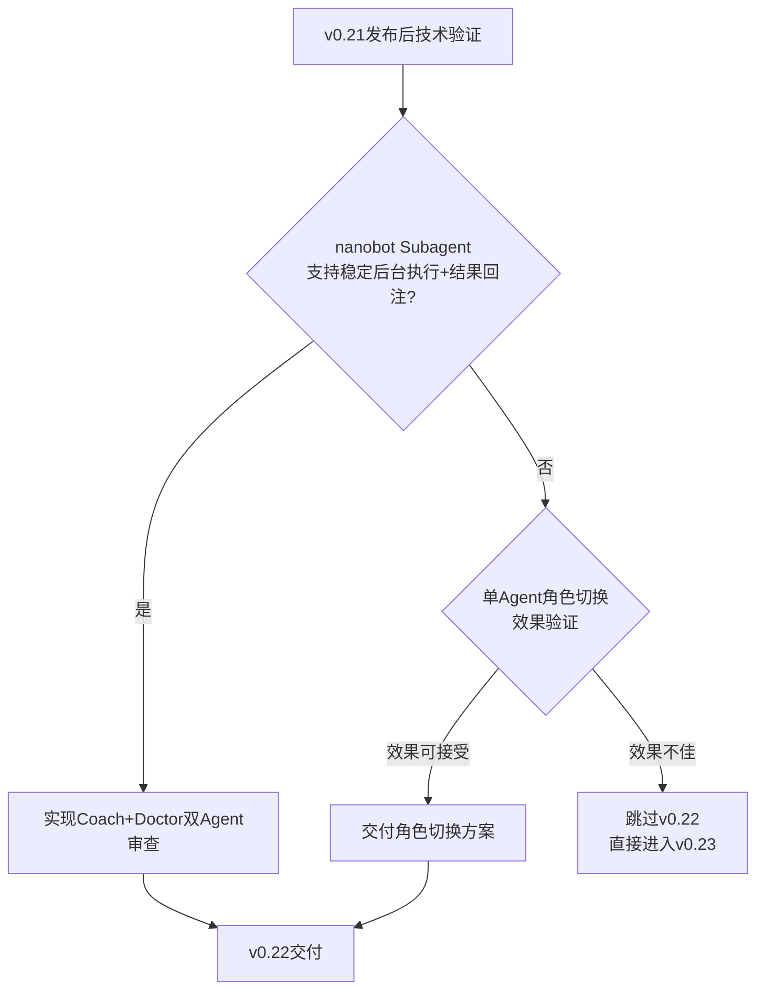
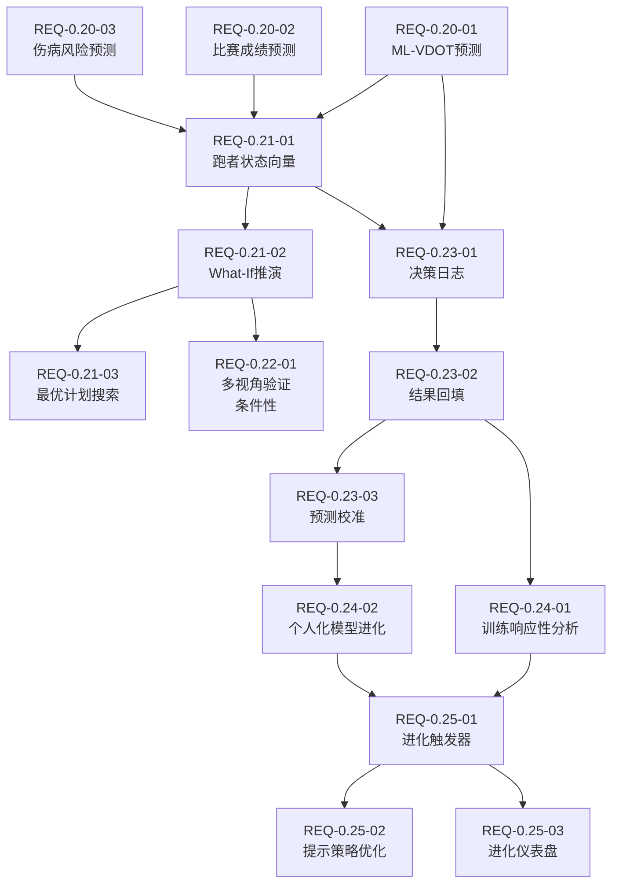
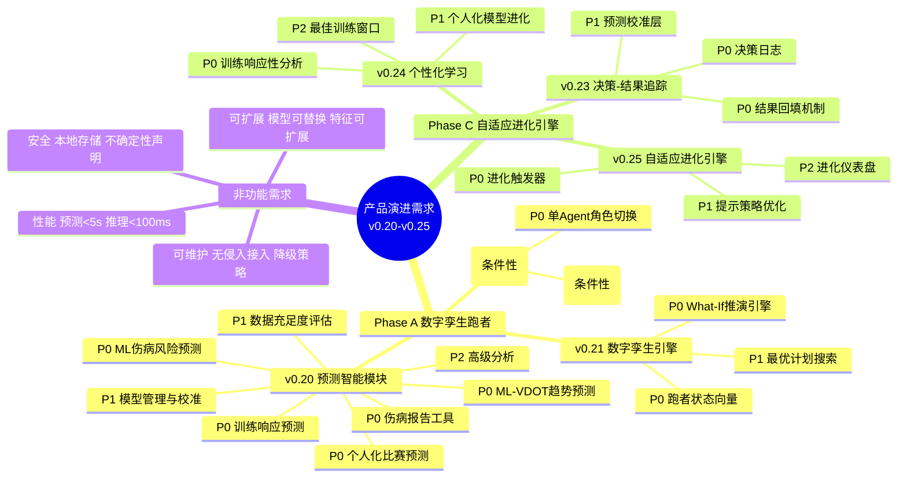

# 产品演进需求规格说明书：数字孪生跑者 → 自适应进化引擎

> **文档版本**: v1.0
> **创建日期**: 2026-05-08
> **当前基线**: v0.19.0
> **覆盖版本**: v0.20.0 - v0.25.0
> **状态**: 待审核
> **对齐文档**:
> - [产品演进设计 v1.0](2026-05-07-product-evolution-design.md)
> - [多智能体架构分析](../architecture/multiagents.md)
> - [产品规划方案 v9.0](../product/产品规划方案.md)
> - [架构设计说明书 v6.1.0](../architecture/架构设计说明书.md)
> - [需求规格说明书 v7.0](REQ_需求规格说明书.md)（v0.20.0详细规格）

---

## 1. 项目概述

### 1.1 产品定位

Nanobot Runner 是一款桌面端私人 AI 跑步助理，基于 nanobot-ai 框架构建。本次演进将产品从"记录跑步"升级为"预测跑步"再到"进化跑步"，核心价值：**本地化、隐私可控、专业可信、预测未来、自我进化**。

### 1.2 演进愿景

| 阶段 | 口号 | 核心能力 | 对应版本 |
|------|------|----------|----------|
| **记录跑步** | "你的跑步数据管家" | FIT解析、数据存储、基础统计 | v0.5-v0.19 ✅ |
| **预测跑步** | "你的数字孪生跑者" | ML增强预测、What-If推演、风险预警 | v0.20-v0.22 |
| **进化跑步** | "越用越懂你的私人教练" | 决策追踪、自适应学习、个性化进化 | v0.23-v0.25 |

### 1.3 目标用户

技术型严肃跑者：25-45岁技术从业者，规律跑步2年+，关注数据隐私，具备CLI操作能力。

### 1.4 核心痛点与演进目标

| 痛点 | 当前状态 | 演进目标 | 覆盖版本 |
|------|---------|---------|---------|
| 训练计划不够个性化 | 基于规则和LLM推理 | 数据驱动的个体化预测推演 | v0.20-v0.21 |
| 缺乏预测性健康预警 | 事后评估 | 3周前置伤病风险预警 | v0.20 |
| 决策视角单一 | 单Agent模式 | 多视角交叉验证（条件性） | v0.22 |
| 缺乏自我进化能力 | 每次决策从零开始 | 从训练结果中学习优化 | v0.23-v0.25 |

---

## 2. 文档冲突裁决记录

> 以下冲突在产品演进设计文档与架构设计说明书/产品规划方案之间存在不一致，本规格书给出统一裁决。

### 2.1 ML框架选型裁决

| 冲突项 | 产品演进设计 | 架构设计/产品规划 | **裁决** |
|--------|-------------|-----------------|---------|
| ML框架 | LightGBM | scikit-learn | **scikit-learn (GradientBoostingRegressor/Classifier)** |
| 依据 | LightGBM性能更优 | 技术栈一致性、轻量化 | 产品规划方案v9.0已明确裁决，不引入LightGBM |

**裁决理由**：
1. 产品规划方案v9.0已明确裁决"LightGBM方案因与架构师统一选型冲突，不采用"
2. scikit-learn GradientBoosting 在本项目数据规模（100-2000条）下性能足够
3. 保持技术栈一致性，减少依赖管理复杂度
4. 个人开发者场景，轻量化优先

### 2.2 模块命名裁决

| 冲突项 | 产品演进设计 | 架构设计 | **裁决** |
|--------|-------------|---------|---------|
| 预测模块 | `src/core/predictive/` | `src/core/prediction/` | **`src/core/prediction/`** |
| 孪生模块 | `src/core/twin/` | 未定义 | **`src/core/twin/`**（v0.21新增） |
| 进化模块 | `src/core/evolution/` | 未定义 | **`src/core/evolution/`**（v0.23新增） |

**裁决理由**：prediction命名与架构设计说明书v6.1.0一致；twin/evolution为新增模块，沿用产品演进设计命名。

### 2.3 CLI命令裁决

| 冲突项 | 产品演进设计 | 现有需求规格 | **裁决** |
|--------|-------------|-------------|---------|
| 模型训练 | `model train --name` | `predict model train --type` | **`predict model train --type`** |
| VDOT预测 | `predict performance --weeks` | `predict vdot --days` | **`predict vdot --days`** |
| 训练响应 | `predict training-response` | 无 | **v0.20不独立命令，集成到predict vdot** |
| 孪生模拟 | `twin simulate --plan` | 无 | **`twin simulate --plan`**（v0.21） |
| 进化状态 | `evolution status` | 无 | **`evolution status`**（v0.25） |

**裁决理由**：CLI命令以现有需求规格v7.0为基准，保持命令组层级一致性（predict/twin/evolution各自独立命令组）。

### 2.4 Agent工具命名裁决

| 冲突项 | 产品演进设计 | 现有需求规格 | **裁决** |
|--------|-------------|-------------|---------|
| VDOT预测 | PredictPerformanceTool | predict_vdot_trend | **predict_vdot_trend** |
| 比赛预测 | 无 | predict_race_result | **predict_race_result** |
| 伤病风险 | PredictInjuryRiskTool | predict_injury_risk | **predict_injury_risk** |
| 伤病报告 | ReportInjuryTool | 无 | **report_injury**（v0.20新增） |
| 训练响应 | PredictTrainingResponseTool | 无 | **predict_training_response**（v0.20新增） |
| 数据评估 | 无 | check_prediction_status | **check_prediction_status** |
| 模型管理 | 无 | manage_prediction_model | **manage_prediction_model** |
| 跑者状态 | GetRunnerStateTool | 无 | **get_runner_state**（v0.21新增） |
| 计划模拟 | SimulatePlanTool | 无 | **simulate_plan**（v0.21新增） |
| 计划对比 | ComparePlansTool | 无 | **compare_plans**（v0.21新增） |
| 最优计划 | FindOptimalPlanTool | 无 | **find_optimal_plan**（v0.21新增） |

**裁决理由**：Agent工具命名遵循snake_case风格，与现有工具命名规范一致。

### 2.5 多智能体架构约束裁决

| 冲突项 | 产品演进设计 | 多智能体分析结论 | **裁决** |
|--------|-------------|----------------|---------|
| v0.22多视角 | Coach+Doctor双Agent | nanobot不支持Agent间协作 | **单Agent角色切换为主方案，双Agent为条件性增强** |
| 多Agent路线图 | v0.24+多Agent辩论 | 底座能力不足 | **多Agent为增强手段，非核心依赖** |

**裁决理由**：多智能体分析文档明确指出nanobot仅支持主-从后台任务模式，无Agent间协作能力。v0.22必须以单Agent角色切换为基准方案。

---

## 3. Phase A：数字孪生跑者（v0.20-v0.22）

### 3.1 v0.20.0：预测智能模块

#### 3.1.1 版本概述

**版本主题**: ML增强预测 —— 为数据充足用户提供更精准的未来洞察
**核心目标**: 基于18个月+历史数据，用ML模型替代简单线性回归，显著提升预测准确度
**目标用户**: 数据充足的高级用户（18个月+跑步数据，400+条记录）
**详细规格**: 参见[需求规格说明书v7.0](REQ_需求规格说明书.md)第2章

#### 3.1.2 P0需求：ML增强核心

##### REQ-0.20-01：ML-VDOT趋势预测引擎

**需求描述**: 基于历史VDOT数据、训练负荷和身体信号，使用ML时间序列模型预测未来VDOT变化趋势

**功能要点**:

| 子功能 | 说明 | 数据来源 |
|--------|------|---------|
| 时序特征工程 | 提取训练周期、季节性、身体适应特征（≥5类） | 18个月+训练数据 |
| 多因子ML模型 | scikit-learn GradientBoosting整合多维度预测VDOT | v0.19身体信号数据 |
| 预测置信区间 | 基于分位数回归输出(p10, p50, p90)置信区间 | 模型内置 |
| 特征重要性 | SHAP值分析，输出Top3关键特征及影响方向 | shap库 |
| 参数化基线 | Banister IR Model冷启动（数据<200条） | 运动科学模型 |

**验收标准**:

- [ ] AC-01: 数据充足时(18个月+/400+条)，ML预测VDOT误差<5%（对比基础预测8%）
- [ ] AC-02: 数据不足时，自动降级为参数化基线模型（Banister IR），输出明确提示
- [ ] AC-03: 时序特征工程提取≥5类特征：训练周期特征、季节性特征、身体适应特征、负荷变化率特征、强度分布特征
- [ ] AC-04: 预测置信区间输出(下限, 上限)和置信度(0-1)
- [ ] AC-05: 特征重要性通过SHAP值分析，输出Top3关键特征及其影响权重和方向
- [ ] AC-06: 新增CLI命令 `predict vdot --days 30`，数据充足时输出标注"🧠 ML增强预测 | 模型置信度: 高/中/低"
- [ ] AC-07: 新增Agent工具 `predict_vdot_trend`，返回VDOTPrediction数据结构

**数据模型**:

```python
@dataclass(frozen=True)
class VDOTPrediction:
    current_vdot: float
    predicted_vdot: float
    prediction_days: int
    confidence_interval: tuple[float, float]
    confidence: float
    trend_slope: float
    key_factors: list[VDOTFactor]
    data_quality: DataQuality
    prediction_type: str  # "ml_enhanced" / "parametric" / "basic"
    model_info: MLPredictionInfo | None

@dataclass(frozen=True)
class VDOTFactor:
    name: str
    weight: float
    direction: str  # "positive" / "negative"
    value: float

@dataclass(frozen=True)
class MLPredictionInfo:
    model_type: str  # "gradient_boosting" / "banister_ir" / "linear_regression"
    training_samples: int
    feature_count: int
    shap_available: bool
```

**前置依赖**: RacePredictionEngine, VDOTCalculator, SessionRepository, BodySignalEngine(v0.19)

---

##### REQ-0.20-02：个人化比赛成绩预测

**需求描述**: 基于个人历史比赛数据训练个人化修正模型，替代Jack Daniels固定系数

**功能要点**:

| 子功能 | 说明 | 数据来源 |
|--------|------|---------|
| 个人修正系数学习 | 识别"耐力型/速度型/均衡型"跑者类型 | 3次+实测比赛 |
| Riegel曲线拟合 | 个人化指数拟合（标准值1.06，偏差0.95-1.15） | 多距离比赛数据 |
| 赛前状态修正 | 集成BodySignalEngine调整预测 | v0.19身体信号 |
| 预测历史验证 | 记录预测vs实际，持续校准 | 历史预测记录 |

**验收标准**:

- [ ] AC-01: 数据充足时(3次+实测比赛)，全马预测误差<8分钟（对比基础预测15分钟）
- [ ] AC-02: 输出个人类型标签（耐力型/速度型/均衡型）及修正系数
- [ ] AC-03: Riegel曲线拟合输出个人化指数（标准值1.06，偏差0.95-1.15）
- [ ] AC-04: 赛前状态修正集成BodySignalEngine，疲劳度高时预测成绩自动下调
- [ ] AC-05: 数据不足时(比赛记录<3次)，降级为基础Jack Daniels公式预测
- [ ] AC-06: 新增CLI命令 `predict race --distance marathon --date YYYY-MM-DD`
- [ ] AC-07: 新增Agent工具 `predict_race_result`，返回RacePredictionResult数据结构

**前置依赖**: RacePredictionEngine, GoalPredictionEngine, BodySignalEngine(v0.19)

---

##### REQ-0.20-03：ML伤病风险预测

**需求描述**: 综合训练负荷时序特征和身体信号数据，使用ML分类模型预测伤病风险

**功能要点**:

| 子功能 | 说明 | 数据来源 |
|--------|------|---------|
| 时序特征提取 | ≥4类：负荷变化率、TSB趋势、静息心率偏移、HRV变化 | 18个月+负荷数据 |
| 多模态融合 | 训练负荷+身体信号+HRV综合判断 | v0.19全量数据 |
| 风险时间线 | 未来7/14/21天伤病概率曲线 | 时序预测模型 |
| 可解释风险因子 | Top3触发因子及贡献度 | 特征归因分析 |
| 规则基线 | ACWR/单调性/连续高强度/静息心率异常规则 | 冷启动兜底 |

**验收标准**:

- [ ] AC-01: 数据充足时(18个月+/心率完整度>80%)，3周前置预警召回率>75%
- [ ] AC-02: 时序特征提取≥4类特征
- [ ] AC-03: 多模态融合整合TrainingLoadAnalyzer + BodySignalEngine + HRVAnalyzer
- [ ] AC-04: 风险时间线输出未来7/14/21天伤病概率曲线，概率>60%触发预警
- [ ] AC-05: 可解释风险因子输出Top3触发因子及贡献度
- [ ] AC-06: 数据不足时降级为基础多因子评估（v0.19 InjuryRiskAnalyzer）
- [ ] AC-07: 新增CLI命令 `predict injury-risk --days 21`
- [ ] AC-08: 新增Agent工具 `predict_injury_risk`，返回InjuryRiskPrediction数据结构

**前置依赖**: InjuryRiskAnalyzer, TrainingLoadAnalyzer, BodySignalEngine(v0.19), HRVAnalyzer(v0.19)

---

##### REQ-0.20-04：伤病报告工具

**需求描述**: 用户报告伤病事件，为伤病风险ML模型提供训练标签

**功能要点**:

| 子功能 | 说明 |
|--------|------|
| 伤病报告提交 | 用户通过CLI或Agent报告伤病事件 |
| 标签分类 | confirmed(用户报告)/suspected(训练中断>7天+疲劳>70)/unconfirmed(异常模式) |
| 标签存储 | 伤病事件存储至本地，用于模型训练 |

**验收标准**:

- [ ] AC-01: 新增Agent工具 `report_injury`，支持提交伤病类型、严重程度、日期
- [ ] AC-02: 伤病标签分类为confirmed/suspected/unconfirmed三级
- [ ] AC-03: 伤病记录持久化存储，可用于ML模型训练标签

---

##### REQ-0.20-05：训练响应预测工具

**需求描述**: 预测单次训练对体能的影响，基于Banister IR Model

**功能要点**:

| 子功能 | 说明 |
|--------|------|
| 训练刺激计算 | 基于TRIMP/HR_zone计算正向刺激量和疲劳量 |
| 响应预测 | 预测VDOT变化、CTL/ATL变化、恢复时间、疲劳增量 |
| 参数化模型 | Banister IR Model，scipy.optimize拟合参数 |

**验收标准**:

- [ ] AC-01: 新增Agent工具 `predict_training_response`，返回TrainingResponse数据结构
- [ ] AC-02: 输出VDOT变化量、CTL/ATL变化量、恢复时间估计、疲劳增量
- [ ] AC-03: 参数拟合使用scipy.optimize.minimize(L-BFGS-B)，训练时间<1秒

---

#### 3.1.3 P1需求：模型管理与数据评估

##### REQ-0.20-06：模型管理与校准

**需求描述**: 管理个人ML预测模型的生命周期，支持训练、版本管理、准确性追踪和增量学习

**验收标准**:

- [ ] AC-01: 个人模型训练支持VDOT/比赛/伤病三种模型，训练完成输出模型指标
- [ ] AC-02: 模型版本管理保存至`~/.nanobot-runner/models/`，支持按版本号回滚
- [ ] AC-03: 预测准确性追踪记录每次预测结果，实际结果可用时自动计算偏差
- [ ] AC-04: 增量学习在新数据积累≥50条时自动触发，异步执行不阻塞CLI
- [ ] AC-05: 重训练触发条件：首次数据≥100条/新增50条/距上次>30天/用户手动/训练失败回退基线
- [ ] AC-06: 单模型训练时间<5分钟
- [ ] AC-07: 新增CLI命令 `predict model status` / `predict model train --type vdot`
- [ ] AC-08: 新增Agent工具 `manage_prediction_model`

---

##### REQ-0.20-07：数据充足度评估

**需求描述**: 评估当前数据是否满足ML预测要求，提供质量报告、积累建议和解锁进度

**验收标准**:

- [ ] AC-01: 数据质量报告输出6个维度：时间跨度、记录数量、训练频率、比赛记录、心率完整度、身体信号可用性
- [ ] AC-02: 每个维度输出当前值、目标值、达标状态(✅/🔒)
- [ ] AC-03: 数据积累建议针对未达标维度给出具体行动建议
- [ ] AC-04: 解锁进度提示输出百分比进度条
- [ ] AC-05: 新增CLI命令 `predict status`
- [ ] AC-06: 新增Agent工具 `check_prediction_status`

---

#### 3.1.4 P2需求：高级分析（可延后）

##### REQ-0.20-08：高级分析功能

**需求描述**: 基于充足历史数据提供深度分析能力

**验收标准**:

- [ ] AC-01: 训练响应性分析输出不同训练类型对VDOT的提升效果排名
- [ ] AC-02: 最佳训练窗口预测基于CTL-VDOT关联分析
- [ ] AC-03: 年度周期规划建议基于历史数据识别个人年度周期模式

---

#### 3.1.5 v0.20.0 新增存储设计

```
~/.nanobot-runner/
├── models/                        # 新增：ML模型存储
│   ├── performance_v1.joblib
│   ├── injury_risk_v1.joblib
│   └── training_response_v1.joblib
├── predictions/                   # 新增：预测记录
│   └── {date}_prediction.json
└── (现有存储结构不变)
```

#### 3.1.6 v0.20.0 技术选型

| 决策项 | 选型 | 说明 |
|--------|------|------|
| ML框架 | scikit-learn (GradientBoosting) | 轻量、可解释、本地运行无GPU依赖 |
| 科学计算 | scipy | Banister IR参数拟合、Riegel曲线拟合 |
| 特征解释 | shap | SHAP值特征重要性分析 |
| 模型持久化 | joblib | sklearn模型序列化 |
| 冷启动策略 | 参数化基线模型（Banister IR） | 数据不足时使用确定性模型 |

#### 3.1.7 v0.20.0 成功标准

| 维度 | 标准 | 对比基础预测 |
|------|------|-------------|
| VDOT预测准确 | ML预测误差<5% | 基础8%→ML 5% |
| 比赛预测准确 | 全马预测误差<8分钟 | 基础15分钟→ML 8分钟 |
| 伤病预警有效 | 3周前置预警召回率>75% | 基础1周→ML 3周 |
| 模型可用率 | 数据充足用户ML预测使用率>80% | - |
| 性能要求 | ML预测响应<5秒 | - |
| 模型训练 | 单模型训练<5分钟 | - |

---

### 3.2 v0.21.0：数字孪生引擎

#### 3.2.1 版本概述

**版本主题**: 数字孪生引擎 —— 构建可推演的跑者生理模型
**核心目标**: 实现What-If推演能力，让用户"在训练前看到训练后的自己"
**目标用户**: 有明确训练目标的高级用户
**前置依赖**: v0.20预测引擎、v0.19身体信号引擎

#### 3.2.2 P0需求：核心孪生能力

##### REQ-0.21-01：跑者状态向量

**需求描述**: 统一封装跑者当前全部生理状态，作为孪生推演的输入基准

**功能要点**:

| 维度 | 指标 | 数据来源 |
|------|------|---------|
| 体能维度 | VDOT、VDOT趋势、VO2max估算 | VDOTCalculator, 预测引擎 |
| 负荷维度 | CTL、ATL、TSB、ACWR | TrainingLoadAnalyzer |
| 身体信号维度 | 疲劳评分、恢复状态、静息心率、HRV-RMSSD | BodySignalEngine |
| 风险维度 | 7天伤病风险、28天伤病风险、过度训练风险 | 预测引擎 |
| 训练模式维度 | 周跑量、强度分布、长距离频率 | SessionRepository |

**验收标准**:

- [ ] AC-01: RunnerStateVector为frozen dataclass，包含5个维度≥15个指标
- [ ] AC-02: 状态向量可从现有计算器/引擎自动聚合生成，无需用户手动输入
- [ ] AC-03: 新增Agent工具 `get_runner_state`，返回RunnerStateVector
- [ ] AC-04: 新增CLI命令 `twin state`，Rich格式化输出当前跑者状态

**数据模型**:

```python
@dataclass(frozen=True)
class RunnerStateVector:
    timestamp: datetime
    vdot: float
    vdot_trend: float
    vo2max_estimate: float
    ctl: float
    atl: float
    tsb: float
    acwr: float
    fatigue_score: float
    recovery_status: str
    resting_hr: float
    hrv_rmssd: float
    injury_risk_7d: float
    injury_risk_28d: float
    overtraining_risk: float
    weekly_volume_km: float
    intensity_distribution: dict
    long_run_frequency: float
```

---

##### REQ-0.21-02：What-If推演引擎

**需求描述**: 模拟执行训练计划后的状态演变，支持计划对比

**功能要点**:

| 功能 | 说明 | 用户价值 |
|------|------|---------|
| simulate_plan() | 模拟训练计划N周后的状态演变 | "按这个计划练4周，VDOT能到多少？" |
| compare_plans() | 比较多个训练计划的预测效果 | "计划A和计划B哪个更适合我？" |

**验收标准**:

- [ ] AC-01: simulate_plan()输入RunnerStateVector + TrainingPlan + weeks，输出list[RunnerStateVector]（每周一个状态快照）
- [ ] AC-02: compare_plans()输入多个TrainingPlan，输出PlanComparison（含VDOT预测、伤病风险、过度训练风险、恢复余量、综合推荐评分）
- [ ] AC-03: 推演基于v0.20预测引擎，每步推演调用PerformancePredictor和InjuryRiskPredictor
- [ ] AC-04: 综合推荐评分基于加权公式：VDOT提升权重0.4 + 伤病风险权重0.35 + 恢复余量权重0.25
- [ ] AC-05: 新增Agent工具 `simulate_plan` 和 `compare_plans`
- [ ] AC-06: 新增CLI命令 `twin simulate --plan <plan_id> --weeks 4` 和 `twin compare --plans <id1,id2,id3>`

**数据模型**:

```python
@dataclass(frozen=True)
class PlanComparison:
    plans: list[PlanSimulationResult]
    recommendation: str
    recommendation_reason: str

@dataclass(frozen=True)
class PlanSimulationResult:
    plan_id: str
    plan_name: str
    vdot_start: float
    vdot_end: float
    injury_risk_max: float
    overtraining_risk: str
    recovery_margin: str
    composite_score: float
    weekly_states: list[RunnerStateVector]
```

---

#### 3.2.3 P1需求：最优计划搜索

##### REQ-0.21-03：最优计划搜索

**需求描述**: 搜索满足约束条件的最优训练计划

**验收标准**:

- [ ] AC-01: find_optimal_plan()输入RunnerStateVector + TrainingGoal + PlanConstraints，输出TrainingPlan
- [ ] AC-02: PlanConstraints支持约束：最大伤病风险阈值、最小恢复余量、周跑量上限
- [ ] AC-03: 搜索策略为参数化生成+推演评估，非穷举搜索
- [ ] AC-04: 新增Agent工具 `find_optimal_plan`
- [ ] AC-05: 新增CLI命令 `twin optimize --goal <goal> --max-injury-risk 15`

---

#### 3.2.4 v0.21.0 新增存储设计

```
~/.nanobot-runner/
├── predictions/                   # 扩展：推演记录
│   ├── {date}_prediction.json
│   └── {date}_simulation.json     # 新增：推演结果
└── (现有存储结构不变)
```

#### 3.2.5 v0.21.0 成功标准

| 维度 | 标准 |
|------|------|
| 推演准确性 | 4周VDOT推演误差<8% |
| 推演性能 | 单计划4周推演<10秒 |
| 计划对比 | 支持≥3个计划同时对比 |
| 综合推荐 | 推荐评分与用户主观选择一致率>70% |

---

### 3.3 v0.22.0：多视角决策验证（条件性版本）

#### 3.3.1 版本概述

**版本主题**: 多视角决策验证 —— 从教练和医生两个角度交叉验证训练计划
**核心目标**: 减少单视角决策偏差，提升训练计划安全性和有效性
**⚠️ 条件性说明**: 本版本为条件性交付，可能跳过直接进入v0.23

#### 3.3.2 架构约束（来自多智能体分析）

| 能力 | nanobot支持 | 对v0.22影响 |
|------|-----------|------------|
| Agent间协作 | ❌ 不支持 | 无法真正实现Coach+Doctor Agent协作 |
| 状态共享 | ❌ 不支持 | 两个视角无法共享中间推理状态 |
| 任务编排 | ❌ 不支持 | 无中央编排器分配任务 |
| 后台子代理 | ✅ 支持 | 仅支持独立后台任务，结果单向回传 |

#### 3.3.3 条件性交付策略



#### 3.3.4 P0需求（基准方案：单Agent角色切换）

##### REQ-0.22-01：单Agent角色切换决策验证

**需求描述**: 在单Agent内实现教练视角和医生视角的交叉验证

**验收标准**:

- [ ] AC-01: LLM先以教练视角（训练效果最大化）审查计划，输出CoachReview
- [ ] AC-02: LLM再以医生视角（健康风险最小化）审查计划，输出DoctorReview
- [ ] AC-03: 综合两个视角结论，输出冲突点和调整建议
- [ ] AC-04: 角色切换通过Prompt Engineering实现，不修改Agent核心逻辑
- [ ] AC-05: 如果角色切换效果不佳（v0.21验证期评估），跳过v0.22

#### 3.3.5 P1需求（条件性：底座支持双Agent时）

##### REQ-0.22-02：双Agent多视角审查

**需求描述**: 实现Coach Agent + Doctor Agent双视角审查

**验收标准**:

- [ ] AC-01: Coach Agent从训练效果最大化角度审查计划
- [ ] AC-02: Doctor Agent从健康风险最小化角度审查计划
- [ ] AC-03: LLM作为仲裁者权衡双方论据，输出综合推荐
- [ ] AC-04: 仅在nanobot SubagentManager支持稳定后台执行+结果回注时实现

#### 3.3.6 v0.22.0 成功标准

| 维度 | 标准（基准方案） | 标准（增强方案） |
|------|----------------|----------------|
| 视角覆盖 | 教练+医生双视角结论 | 同左 |
| 冲突识别 | 识别≥80%的视角冲突点 | 识别≥90% |
| 推荐质量 | 综合推荐用户满意度>70% | >80% |
| 性能 | 角色切换总耗时<30秒 | 双Agent总耗时<45秒 |

---

## 4. Phase C：自适应进化引擎（v0.23-v0.25）

### 4.1 v0.23.0：决策-结果追踪系统

#### 4.1.1 版本概述

**版本主题**: 决策-结果追踪 —— 记录AI决策全链路，建立"决策→执行→结果→校准"闭环
**核心目标**: 让系统具备自我评估能力，为后续个性化学习提供数据基础
**前置依赖**: v0.20预测引擎、v0.21孪生引擎（可选）
**⚠️ 不依赖v0.22**: 即使v0.22跳过，v0.23仍可独立交付

#### 4.1.2 P0需求：决策追踪核心

##### REQ-0.23-01：决策日志

**需求描述**: 记录每次AI决策的完整上下文，包括跑者状态、工具调用链、预测快照

**功能要点**:

| 字段 | 说明 |
|------|------|
| decision_id | 唯一标识 |
| timestamp | 决策发生时间 |
| runner_state | 决策时的RunnerStateVector |
| decision_type | 训练计划生成/预测查询/风险评估 |
| input_context | 决策输入上下文 |
| tools_called | 本次决策调用的所有工具及参数 |
| prediction_made | 决策时做出的预测（如有） |
| decision_summary | 决策摘要 |

**验收标准**:

- [ ] AC-01: DecisionRecord为frozen dataclass，包含上述全部字段
- [ ] AC-02: 通过现有Hook系统无侵入接入，不修改核心Agent逻辑
- [ ] AC-03: 决策日志按月分片存储为Parquet格式：`~/.nanobot-runner/decisions/2026-05/`
- [ ] AC-04: DecisionTrackingHook实现before_iteration/before_execute_tools/after_iteration三个钩子

**数据模型**:

```python
@dataclass
class DecisionRecord:
    decision_id: str
    timestamp: datetime
    runner_state: RunnerStateVector
    decision_type: str
    input_context: dict
    decision_summary: str
    tools_called: list[ToolCallRecord]
    prediction_made: PredictionSnapshot | None
    executed: bool | None = None
    execution_fidelity: float | None = None
    actual_outcome: OutcomeRecord | None = None
    user_feedback: str | None = None
    prediction_error: float | None = None
    decision_quality: float | None = None
```

---

##### REQ-0.23-02：结果回填机制

**需求描述**: 对比计划vs实际、预测vs实际，建立结果追踪闭环

**功能要点**:

| 功能 | 说明 |
|------|------|
| check_plan_execution() | 对比计划训练vs实际训练，计算执行忠实度 |
| check_prediction_accuracy() | 对比预测VDOT vs 实际VDOT，对比预测伤病风险vs实际伤病事件 |
| generate_feedback_prompt() | 生成用户反馈收集提示 |

**验收标准**:

- [ ] AC-01: check_plan_execution()输出ExecutionReport，含执行忠实度(0-1)、偏差详情
- [ ] AC-02: check_prediction_accuracy()输出AccuracyReport，含MAE、偏差方向、校准建议
- [ ] AC-03: 结果回填不阻塞主流程，异步执行
- [ ] AC-04: 结果记录按月分片存储为Parquet格式：`~/.nanobot-runner/outcomes/2026-05/`

---

#### 4.1.3 P1需求：预测校准

##### REQ-0.23-03：预测校准层

**需求描述**: 基于决策日志和结果记录，校准预测模型的系统性偏差

**验收标准**:

- [ ] AC-01: 校准器检测预测的系统性偏差（持续高估/低估），输出偏差方向和幅度
- [ ] AC-02: 校准结果应用于后续预测，自动修正预测值
- [ ] AC-03: 校准触发条件：累计≥10条预测-实际配对数据
- [ ] AC-04: 校准过程输出校准报告，含修正前后对比

---

#### 4.1.4 v0.23.0 成功标准

| 维度 | 标准 |
|------|------|
| 决策记录 | 每次AI决策100%自动记录 |
| 结果回填 | 计划执行忠实度可计算率>80% |
| 预测校准 | 校准后预测误差降低≥10% |
| 性能 | Hook接入对主流程延迟增加<100ms |

---

### 4.2 v0.24.0：个性化学习

#### 4.2.1 版本概述

**版本主题**: 个性化学习 —— 让系统理解"这个跑者对什么训练响应最好"
**核心目标**: 基于决策日志和结果记录，实现训练响应性分析和模型个体化进化
**前置依赖**: v0.23决策追踪系统

#### 4.2.2 P0需求：训练响应性分析

##### REQ-0.24-01：训练响应性分析

**需求描述**: 分析用户对不同训练刺激的反应，识别最有效的训练类型

**验收标准**:

- [ ] AC-01: 输出不同训练类型(间歇/阈值/长距离/恢复)对VDOT的提升效果排名
- [ ] AC-02: 基于v0.23决策日志中的训练-结果配对数据
- [ ] AC-03: 输出个人训练响应画像（如"间歇训练响应性强"）
- [ ] AC-04: 分析结果可被LLM引用，用于个性化训练计划生成

---

#### 4.2.3 P1需求：个人化模型进化

##### REQ-0.24-02：个人化模型进化

**需求描述**: 基于决策日志持续校准预测模型参数

**验收标准**:

- [ ] AC-01: VDOT预测校准基于预测误差调整模型偏差，校准后MAE降低≥15%
- [ ] AC-02: 伤病风险校准基于实际伤病事件调整风险阈值
- [ ] AC-03: 训练响应校准基于实际训练效果调整Banister IR参数(τ_fitness, τ_fatigue)
- [ ] AC-04: 校准过程输出校准报告，含参数变化对比

---

#### 4.2.4 P2需求：最佳训练窗口

##### REQ-0.24-03：最佳训练窗口预测

**需求描述**: 基于CTL-VDOT关联分析，预测突破VDOT的最佳时机

**验收标准**:

- [ ] AC-01: 基于历史CTL-VDOT关联分析，输出"未来2-4周是突破VDOT的最佳窗口"
- [ ] AC-02: 窗口预测基于≥6个月的CTL-VDOT关联数据

---

#### 4.2.5 v0.24.0 成功标准

| 维度 | 标准 |
|------|------|
| 响应性分析 | 训练类型效果排名与用户主观感受一致率>70% |
| 模型进化 | 校准后VDOT预测MAE降低≥15% |
| 伤病校准 | 校准后伤病风险AUC提升≥0.05 |

---

### 4.3 v0.25.0：自适应进化引擎

#### 4.3.1 版本概述

**版本主题**: 自适应进化引擎 —— 实现"决策→执行→追踪→校准→优化→更好决策"自进化闭环
**核心目标**: 让系统从用户反馈和训练结果中自动学习优化
**前置依赖**: v0.23决策追踪 + v0.24个性化学习

#### 4.3.2 P0需求：进化触发器

##### REQ-0.25-01：自动化进化触发器

**需求描述**: 自动检测进化条件并触发模型重训练/策略优化

**验收标准**:

- [ ] AC-01: 预测误差连续3次>阈值(15%)时，自动触发对应模型重训练
- [ ] AC-02: 用户连续2次拒绝推荐时，调整推荐策略
- [ ] AC-03: 新数据积累≥50条时，触发增量学习
- [ ] AC-04: 月度复盘时，生成个性化进化报告
- [ ] AC-05: 进化触发不阻塞主流程，异步执行

---

#### 4.3.3 P1需求：提示策略优化

##### REQ-0.25-02：LLM提示策略优化

**需求描述**: 基于用户反馈和决策效果，自动优化LLM提示词

**验收标准**:

- [ ] AC-01: 个性化语气：根据用户偏好调整建议风格（严厉/温和/数据驱动）
- [ ] AC-02: 信息密度：根据用户反馈调整输出详细程度
- [ ] AC-03: 推荐策略：根据采纳率调整推荐激进程度
- [ ] AC-04: 优化策略存储为配置文件，可回滚

---

#### 4.3.4 P2需求：进化仪表盘

##### REQ-0.25-03：进化仪表盘

**需求描述**: 可视化展示系统进化状态和效果

**验收标准**:

- [ ] AC-01: 新增CLI命令 `evolution status`，输出进化引擎状态
- [ ] AC-02: 展示：决策记录数、预测准确率趋势、决策接受率、模型版本、个性化程度、上次进化时间
- [ ] AC-03: 新增CLI命令 `evolution trigger`，手动触发进化检查

---

#### 4.3.5 v0.25.0 成功标准

| 维度 | 标准 |
|------|------|
| 自进化闭环 | 决策→校准→优化闭环自动运行率>90% |
| 预测进化 | VDOT预测MAE<0.5（个体化校准后） |
| 伤病进化 | 伤病风险AUC>0.80 |
| 决策进化 | 训练计划接受率较v0.20提升≥20% |
| 预测校准 | 校准误差<5% |

---

## 5. 非功能需求

### 5.1 性能需求

| 需求ID | 需求描述 | 验收标准 | 覆盖版本 |
|--------|---------|---------|---------|
| NFR-01 | ML预测响应时间 | <5秒 | v0.20+ |
| NFR-02 | ML模型训练时间 | <5分钟/单模型 | v0.20+ |
| NFR-03 | ML推理延迟 | <100ms | v0.20+ |
| NFR-04 | 孪生推演性能 | 单计划4周推演<10秒 | v0.21+ |
| NFR-05 | Hook接入延迟 | 对主流程增加<100ms | v0.23+ |
| NFR-06 | 模型文件大小 | <50MB/模型 | v0.20+ |

### 5.2 安全需求

| 需求ID | 需求描述 | 验收标准 | 覆盖版本 |
|--------|---------|---------|---------|
| NFR-07 | 数据本地存储 | 所有ML模型和预测数据仅存储本地 | v0.20+ |
| NFR-08 | 预测不确定性声明 | ML预测必须输出置信区间和不确定性声明 | v0.20+ |
| NFR-09 | 模型回滚安全 | 模型重训练失败时自动回退到上一版本 | v0.20+ |

### 5.3 可维护性需求

| 需求ID | 需求描述 | 验收标准 | 覆盖版本 |
|--------|---------|---------|---------|
| NFR-10 | 模块无侵入接入 | 新模块通过Hook/接口接入，不修改现有核心逻辑 | v0.20+ |
| NFR-11 | 数据降级策略 | 数据不足时自动降级为基础预测，不阻塞用户 | v0.20+ |
| NFR-12 | 向后兼容 | 新版本不破坏现有CLI命令和Agent工具接口 | v0.20+ |

### 5.4 可扩展性需求

| 需求ID | 需求描述 | 验收标准 | 覆盖版本 |
|--------|---------|---------|---------|
| NFR-13 | 模型可替换 | ML模型实现可替换（sklearn→其他框架），接口不变 | v0.20+ |
| NFR-14 | 特征可扩展 | 特征工程支持新增特征维度，不破坏现有模型 | v0.20+ |

---

## 6. 需求依赖关系



---

## 7. 版本迭代计划

| 版本 | 主题 | P0需求数 | P1需求数 | P2需求数 | 前置依赖 |
|------|------|---------|---------|---------|---------|
| v0.20 | 预测智能模块 | 5 | 2 | 1 | v0.19 |
| v0.21 | 数字孪生引擎 | 2 | 1 | 0 | v0.20 |
| v0.22 | 多视角验证（条件性） | 1 | 1 | 0 | v0.21 |
| v0.23 | 决策-结果追踪 | 2 | 1 | 0 | v0.20+v0.21 |
| v0.24 | 个性化学习 | 1 | 1 | 1 | v0.23 |
| v0.25 | 自适应进化引擎 | 1 | 1 | 1 | v0.23+v0.24 |

**需求总数**: P0=12, P1=7, P2=3, **总计=22**

---

## 8. 风险评估

| 风险 | 等级 | 影响 | 缓解措施 | 覆盖版本 |
|------|------|------|---------|---------|
| 数据不足导致ML模型无效 | 高 | 预测不准确 | 双轨制：参数化基线兜底，ML增强可选 | v0.20 |
| 伤病事件稀少导致分类模型欠拟合 | 高 | 伤病风险预测不准 | 规则基线+强正则化+类别权重平衡 | v0.20 |
| nanobot底座不支持多Agent | 中 | v0.22无法实现双Agent方案 | 单Agent角色切换为基准方案，v0.22可跳过 | v0.22 |
| 预测过度自信导致用户过度依赖 | 中 | 用户做出不安全决策 | 输出校准概率+置信区间+不确定性声明 | v0.20+ |
| 冷启动期用户体验平淡 | 中 | 用户流失 | 参数化基线立即可用，展示学习进度 | v0.20 |
| 本地计算资源限制 | 低 | 训练时间过长 | 严格控制模型复杂度，训练时间预算5分钟 | v0.20 |
| LLM对预测结果误读 | 低 | 错误决策 | 预测输出含置信区间+使用建议 | v0.20+ |
| 决策日志数据量增长 | 低 | 存储压力 | 按月分片Parquet，支持归档清理 | v0.23+ |

---

## 9. 验收总览

### 9.1 Phase A 验收门禁

| 门禁项 | 标准 | 版本 |
|--------|------|------|
| VDOT预测准确 | ML预测误差<5% | v0.20 |
| 比赛预测准确 | 全马预测误差<8分钟 | v0.20 |
| 伤病预警有效 | 3周前置预警召回率>75% | v0.20 |
| 推演准确性 | 4周VDOT推演误差<8% | v0.21 |
| 推演性能 | 单计划4周推演<10秒 | v0.21 |

### 9.2 Phase C 验收门禁

| 门禁项 | 标准 | 版本 |
|--------|------|------|
| 决策记录 | 每次AI决策100%自动记录 | v0.23 |
| 预测校准 | 校准后预测误差降低≥10% | v0.23 |
| 模型进化 | 校准后VDOT预测MAE降低≥15% | v0.24 |
| 自进化闭环 | 闭环自动运行率>90% | v0.25 |
| 预测进化 | VDOT预测MAE<0.5 | v0.25 |

---

## 10. 需求脑图



---

## 附录A：术语表

| 术语 | 定义 |
|------|------|
| VDOT | 跑力值，衡量跑者有氧能力的指标 |
| Banister IR Model | 运动科学经典模型，描述训练刺激与体能响应的关系 |
| Riegel曲线 | 距离-成绩关系模型，标准指数1.06 |
| ACWR | 急慢性负荷比（Acute:Chronic Workload Ratio） |
| CTL | 慢性训练负荷（42天EWMA） |
| ATL | 急性训练负荷（7天EWMA） |
| TSB | 训练压力平衡（CTL-ATL） |
| TRIMP | 训练冲量，基于心率的训练负荷量化指标 |
| SHAP | SHapley Additive exPlanations，特征重要性解释方法 |
| RunnerStateVector | 跑者状态向量，统一封装跑者当前全部生理状态 |
| DecisionLog | 决策日志，记录AI决策的完整上下文 |
| Hook系统 | nanobot-ai的事件钩子机制，支持无侵入扩展 |

## 附录B：变更记录

| 版本 | 日期 | 变更内容 |
|------|------|---------|
| v1.0 | 2026-05-08 | 初始版本，覆盖v0.20-v0.25全量需求规格 |
