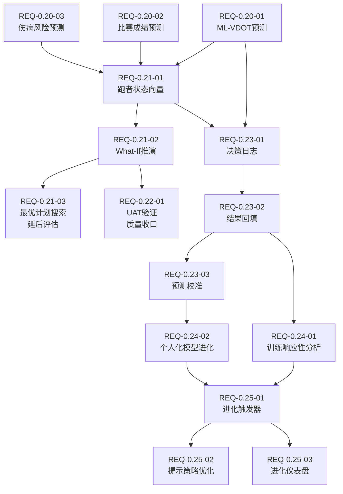
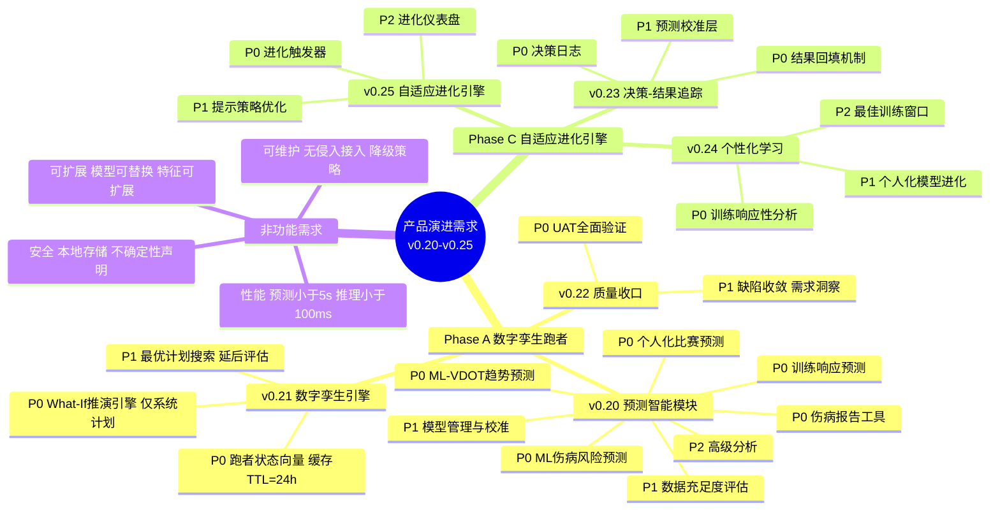

# 需求规格说明书

> **文档版本**: v8.6  
> **最后更新**: 2026-05-18  
> **当前基线**: v0.22.0  
> **覆盖版本**: v0.22.0 - v0.25.0  
> **对齐产品规划**: v9.2 (2026-05-18)  
> **对齐架构设计**: v9.2.0 (2026-05-18)  
> **外部参考**: 产品演进设计 v1.0 + 多智能体架构分析

---

## 1. 项目概述

### 1.1 产品定位

Nanobot Runner 是一款桌面端私人 AI 跑步助理，基于 nanobot-ai 框架构建。产品从"记录跑步"升级为"预测跑步"再到"进化跑步"，核心价值：**本地化、隐私可控、专业可信、预测未来、自我进化**。

### 1.2 演进愿景

| 阶段 | 口号 | 核心能力 | 对应版本 |
|------|------|----------|----------|
| **记录跑步** | "你的跑步数据管家" | FIT解析、数据存储、基础统计 | v0.5-v0.18 ✅ |
| **预测跑步** | "你的数字孪生跑者" | ML增强预测、What-If推演、风险预警 | v0.20-v0.22 ✅ |
| **进化跑步** | "越用越懂你的私人教练" | 决策追踪、自适应学习、个性化进化 | v0.23-v0.25 📋 |

### 1.3 目标用户

技术型严肃跑者：25-45岁技术从业者，规律跑步2年+，关注数据隐私，具备CLI操作能力。

### 1.4 核心痛点与演进目标

| 痛点 | 当前状态 | 演进目标 | 覆盖版本 |
|------|---------|---------|---------|
| 训练计划不够个性化 | 基于规则和LLM推理 | 数据驱动的个体化预测推演 | v0.20-v0.21 |
| 缺乏预测性健康预警 | 事后评估 | 3周前置伤病风险预警 | v0.20 |
| 缺乏自我进化能力 | 每次决策从零开始 | 从训练结果中学习优化 | v0.23-v0.25 |

### 1.5 已完成功能摘要

| 模块 | 核心能力 | 版本 |
|------|----------|------|
| 数据管理 | FIT解析、SHA256去重、Parquet按年分片 | v0.5 |
| 数据分析 | VDOT、TSS/ATL/CTL/TSB、心率漂移、用户画像 | v0.8-v0.9 |
| Agent交互 | 自然语言查询、智能建议、训练计划 | v0.8-v0.12 |
| CLI | 分层架构、Rich格式化 | v0.9 |
| 架构 | 依赖注入(AppContext)、Polars向量化 | v0.9-v0.16 |
| 工具生态 | MCP协议、AI自我诊断、决策透明化 | v0.13-v0.15 |
| 可视化与导出 | 终端图表(plotext)、多格式导出 | v0.18 |
| 身体信号分析 | HRV分析、疲劳度评估、恢复状态、身体信号解读 | v0.19 |
| ML增强预测 | VDOT趋势预测、比赛成绩预测、伤病风险预测、模型管理 | v0.20 |
| 数字孪生引擎 | 跑者状态向量(5维度)、What-If推演、计划对比 | v0.21 |
| 质量收口 | UAT验证、缺陷收敛 | v0.22 |

---

## 2. 文档冲突裁决记录

> 以下冲突在产品演进设计文档与架构设计说明书/产品规划方案之间存在不一致，本规格书给出统一裁决。

### 2.1 ML框架选型裁决

| 冲突项 | 产品演进设计 | 架构设计/产品规划 | **裁决** |
|--------|-------------|-----------------|---------|
| ML框架 | LightGBM | scikit-learn | **scikit-learn (GradientBoostingRegressor/Classifier)** |

**裁决理由**：
1. 产品规划方案v9.0已明确裁决"LightGBM方案因与架构师统一选型冲突，不采用"
2. scikit-learn GradientBoosting 在本项目数据规模（100-2000条）下性能足够
3. 保持技术栈一致性，减少依赖管理复杂度
4. 个人开发者场景，轻量化优先

### 2.2 模块命名裁决

| 冲突项 | 产品演进设计 | 架构设计 | **裁决** |
|--------|-------------|---------|---------|
| 预测模块 | `src/core/predictive/` | `src/core/prediction/` | **`src/core/prediction/`** |
| 孪生模块 | `src/core/twin/` | 未定义 | **`src/core/twin/`**（v0.21新增） |
| 决策追踪模块 | 未定义 | 未定义 | **`src/core/tracking/`**（v0.23新增） |
| 个性化学习模块 | 未定义 | 未定义 | **`src/core/personalization/`**（v0.24新增） |
| 进化模块 | `src/core/evolution/` | 未定义 | **`src/core/evolution/`**（v0.25新增） |

**裁决理由**：prediction命名与架构设计说明书v7.1.0一致；twin/review/tracking/personalization/evolution为新增模块，命名与架构设计说明书7.1-7.5节骨架设计完全对齐。

### 2.3 CLI命令裁决

| 冲突项 | 产品演进设计 | 现有需求规格 | **裁决** |
|--------|-------------|-------------|---------|
| 模型训练 | `model train --name` | `predict model train --type` | **`predict model train --type`** |
| VDOT预测 | `predict performance --weeks` | `predict vdot --days` | **`predict vdot --days`** |
| 训练响应 | `predict training-response` | 无 | **v0.20不独立命令，集成到predict vdot** |
| 孪生模拟 | `twin simulate --plan` | 无 | **`twin simulate --plan`**（v0.21） |
| 进化状态 | `evolution status` | 无 | **`evolution status`**（v0.25） |

**裁决理由**：CLI命令以现有需求规格为基准，保持命令组层级一致性（predict/twin/evolution各自独立命令组）。

### 2.4 Agent工具命名裁决

| 冲突项 | 产品演进设计 | 现有需求规格 | **裁决** |
|--------|-------------|-------------|---------|
| VDOT预测 | PredictPerformanceTool | predict_vdot_trend | **predict_vdot_trend** |
| 比赛预测 | 无 | predict_race_result | **predict_race_result** |
| 伤病风险 | PredictInjuryRiskTool | predict_injury_risk | **predict_injury_risk** |
| 伤病报告 | ReportInjuryTool | 无 | **report_injury**（v0.20新增） |
| 训练响应 | PredictTrainingResponseTool | 无 | **predict_training_response**（v0.20新增） |
| 数据评估 | 无 | check_prediction_status | **check_prediction_status** |
| 模型管理 | 无 | manage_prediction_model | **manage_prediction_model** |
| 跑者状态 | GetRunnerStateTool | 无 | **get_runner_state**（v0.21新增） |
| 计划模拟 | SimulatePlanTool | 无 | **simulate_plan**（v0.21新增） |
| 计划对比 | ComparePlansTool | 无 | **compare_plans**（v0.21新增） |
| 最优计划 | FindOptimalPlanTool | 无 | **find_optimal_plan**（v0.21新增） |

**裁决理由**：Agent工具命名遵循snake_case风格，与现有工具命名规范一致。

### 2.5 多智能体架构约束裁决

| 冲突项 | 产品演进设计 | 多智能体分析结论 | **裁决** |
|--------|-------------|----------------|---------|
| 多Agent路线图 | v0.24+多Agent辩论 | 底座能力不足 | **多Agent为增强手段，非核心依赖** |

**裁决理由**：多智能体分析文档明确指出nanobot仅支持主-从后台任务模式，无Agent间协作能力。多视角验证需求延后到后续版本。当前v0.22以UAT验证+缺陷收敛为实际交付目标。

---

## 3. Phase A：数字孪生跑者（v0.20-v0.22）✅ 已完成

> Phase A 已全部完成交付。以下为核心交付摘要，详细需求规格见Git历史版本。

### 3.1 v0.20.0 需求规格：ML增强预测 ✅

**核心交付**: ML增强预测（VDOT趋势/比赛成绩/伤病风险）+ 模型管理
**需求清单**: REQ-0.20-01~08（P0: VDOT预测/比赛预测/伤病预测/伤病报告/训练响应；P1: 模型管理/数据评估；P2: 高级分析）
**新增CLI**: `predict status/vdot/race/injury-risk/model`
**新增Agent工具**: `predict_vdot_trend`, `predict_race_result`, `predict_injury_risk`, `check_prediction_status`, `manage_prediction_model`, `report_injury`, `predict_training_response`
**技术选型**: scikit-learn + scipy + shap + joblib
**关键设计**: 三层降级策略、分位数回归不确定性量化、SHAP可解释性、Banister IR冷启动
**成功标准**: VDOT预测误差<5%、全马预测误差<8分钟、伤病3周预警召回率>75%

### 3.2 v0.21.0 需求规格：数字孪生引擎 ✅

**核心交付**: 跑者状态向量（5维度）+ What-If推演 + 计划对比
**需求清单**: REQ-0.21-01~02（P0: 状态向量/推演引擎；P1: 最优计划搜索延后评估）
**新增CLI**: `twin status/simulate/compare`
**新增Agent工具**: `get_runner_state`, `simulate_plan`, `compare_plans`
**关键设计**: MVP Twin最小可用设计、薄编排层架构、状态向量缓存（TTL=24h）、ML优先+Banister降级
**成功标准**: 4周VDOT推演误差<8%、单计划推演<10秒、推荐一致率>70%

### 3.3 v0.22.0 需求规格：质量收口 ✅

**核心交付**: UAT验证 + 缺陷收敛 + 质量兜底
**需求清单**: REQ-0.22-01~02（P0: UAT全面验证五大模块；P1: 缺陷收敛与需求洞察）
**关键产出**: 数字孪生/ML预测/身体信号/数据管理/系统性能五大模块UAT验证、修复10+高优先级缺陷、文档同步与版本归档
**成功标准**: 核心模块测试覆盖率≥80%、性能基准达标、文档与代码版本一致

---

## 4. Phase C：自适应进化引擎（v0.23-v0.25）

### 4.1 v0.23.0 需求规格：决策-结果追踪系统

#### 4.1.1 版本概述

**版本主题**: 决策-结果追踪 —— 记录AI决策全链路，建立"决策→执行→结果→校准"闭环  
**核心目标**: 让系统具备自我评估能力，为后续个性化学习提供数据基础  
**前置依赖**: v0.20预测引擎、v0.21孪生引擎（可选）  
**⚠️ 不依赖v0.22**: 即使v0.22跳过某些功能，v0.23仍可独立交付

#### 4.1.2 P0需求：决策追踪核心

##### REQ-0.23-01：决策日志

**需求描述**: 记录每次AI决策的完整上下文，包括跑者状态、工具调用链、预测快照

**功能要点**:

| 字段 | 说明 |
|------|------|
| decision_id | 唯一标识 |
| timestamp | 决策发生时间 |
| runner_state | 决策时的RunnerStateVector |
| decision_type | 训练计划生成/预测查询/风险评估 |
| input_context | 决策输入上下文 |
| tools_called | 本次决策调用的所有工具及参数 |
| prediction_made | 决策时做出的预测（如有） |
| decision_summary | 决策摘要 |

**验收标准**:

- [ ] AC-01: DecisionRecord为frozen dataclass，包含上述全部字段
- [ ] AC-02: 通过现有Hook系统无侵入接入，不修改核心Agent逻辑
- [ ] AC-03: 决策日志按月分片存储为Parquet格式：`~/.nanobot-runner/decisions/2026-05/`
- [ ] AC-04: DecisionTrackingHook实现before_iteration/before_execute_tools/after_iteration三个钩子

**数据模型**:

```python
@dataclass
class DecisionRecord:
    decision_id: str
    timestamp: datetime
    runner_state: RunnerStateVector
    decision_type: str
    input_context: dict
    decision_summary: str
    tools_called: list[ToolCallRecord]
    prediction_made: PredictionSnapshot | None
    executed: bool | None = None
    execution_fidelity: float | None = None
    actual_outcome: OutcomeRecord | None = None
    user_feedback: str | None = None
    prediction_error: float | None = None
    decision_quality: float | None = None
```

---

##### REQ-0.23-02：结果回填机制

**需求描述**: 对比计划vs实际、预测vs实际，建立结果追踪闭环

**功能要点**:

| 功能 | 说明 |
|------|------|
| check_plan_execution() | 对比计划训练vs实际训练，计算执行忠实度 |
| check_prediction_accuracy() | 对比预测VDOT vs 实际VDOT，对比预测伤病风险vs实际伤病事件 |
| generate_feedback_prompt() | 生成用户反馈收集提示 |

**验收标准**:

- [ ] AC-01: check_plan_execution()输出ExecutionReport，含执行忠实度(0-1)、偏差详情
- [ ] AC-02: check_prediction_accuracy()输出AccuracyReport，含MAE、偏差方向、校准建议
- [ ] AC-03: 结果回填不阻塞主流程，异步执行
- [ ] AC-04: 结果记录按月分片存储为Parquet格式：`~/.nanobot-runner/outcomes/2026-05/`

---

#### 4.1.3 P1需求：预测校准

##### REQ-0.23-03：预测校准层

**需求描述**: 基于决策日志和结果记录，校准预测模型的系统性偏差

**验收标准**:

- [ ] AC-01: 校准器检测预测的系统性偏差（持续高估/低估），输出偏差方向和幅度
- [ ] AC-02: 校准结果应用于后续预测，自动修正预测值
- [ ] AC-03: 校准触发条件：累计≥10条预测-实际配对数据
- [ ] AC-04: 校准过程输出校准报告，含修正前后对比

---

#### 4.1.4 v0.23.0 成功标准

| 维度 | 标准 |
|------|------|
| 决策记录 | 每次AI决策100%自动记录 |
| 结果回填 | 计划执行忠实度可计算率>80% |
| 预测校准 | 校准后预测误差降低≥10% |
| 性能 | Hook接入对主流程延迟增加<100ms |

---

### 4.2 v0.24.0 需求规格：个性化学习

#### 4.2.1 版本概述

**版本主题**: 个性化学习 —— 让系统理解"这个跑者对什么训练响应最好"  
**核心目标**: 基于决策日志和结果记录，实现训练响应性分析和模型个体化进化  
**前置依赖**: v0.23决策追踪系统

#### 4.2.2 P0需求：训练响应性分析

##### REQ-0.24-01：训练响应性分析

**需求描述**: 分析用户对不同训练刺激的反应，识别最有效的训练类型

**验收标准**:

- [ ] AC-01: 输出不同训练类型(间歇/阈值/长距离/恢复)对VDOT的提升效果排名
- [ ] AC-02: 基于v0.23决策日志中的训练-结果配对数据
- [ ] AC-03: 输出个人训练响应画像（如"间歇训练响应性强"）
- [ ] AC-04: 分析结果可被LLM引用，用于个性化训练计划生成

---

#### 4.2.3 P1需求：个人化模型进化

##### REQ-0.24-02：个人化模型进化

**需求描述**: 基于决策日志持续校准预测模型参数

**验收标准**:

- [ ] AC-01: VDOT预测校准基于预测误差调整模型偏差，校准后MAE降低≥15%
- [ ] AC-02: 伤病风险校准基于实际伤病事件调整风险阈值
- [ ] AC-03: 训练响应校准基于实际训练效果调整Banister IR参数(τ_fitness, τ_fatigue)
- [ ] AC-04: 校准过程输出校准报告，含参数变化对比

---

#### 4.2.4 P2需求：最佳训练窗口

##### REQ-0.24-03：最佳训练窗口预测

**需求描述**: 基于CTL-VDOT关联分析，预测突破VDOT的最佳时机

**验收标准**:

- [ ] AC-01: 基于历史CTL-VDOT关联分析，输出"未来2-4周是突破VDOT的最佳窗口"
- [ ] AC-02: 窗口预测基于≥6个月的CTL-VDOT关联数据

---

#### 4.2.5 v0.24.0 成功标准

| 维度 | 标准 |
|------|------|
| 响应性分析 | 训练类型效果排名与用户主观感受一致率>70% |
| 模型进化 | 校准后VDOT预测MAE降低≥15% |
| 伤病校准 | 校准后伤病风险AUC提升≥0.05 |

---

### 4.3 v0.25.0 需求规格：自适应进化引擎

#### 4.3.1 版本概述

**版本主题**: 自适应进化引擎 —— 实现"决策→执行→追踪→校准→优化→更好决策"自进化闭环  
**核心目标**: 让系统从用户反馈和训练结果中自动学习优化  
**前置依赖**: v0.23决策追踪 + v0.24个性化学习

#### 4.3.2 P0需求：进化触发器

##### REQ-0.25-01：自动化进化触发器

**需求描述**: 自动检测进化条件并触发模型重训练/策略优化

**验收标准**:

- [ ] AC-01: 预测误差连续3次>阈值(15%)时，自动触发对应模型重训练
- [ ] AC-02: 用户连续2次拒绝推荐时，调整推荐策略
- [ ] AC-03: 新数据积累≥50条时，触发增量学习
- [ ] AC-04: 月度复盘时，生成个性化进化报告
- [ ] AC-05: 进化触发不阻塞主流程，异步执行

---

#### 4.3.3 P1需求：提示策略优化

##### REQ-0.25-02：LLM提示策略优化

**需求描述**: 基于用户反馈和决策效果，自动优化LLM提示词

**验收标准**:

- [ ] AC-01: 个性化语气：根据用户偏好调整建议风格（严厉/温和/数据驱动）
- [ ] AC-02: 信息密度：根据用户反馈调整输出详细程度
- [ ] AC-03: 推荐策略：根据采纳率调整推荐激进程度
- [ ] AC-04: 优化策略存储为配置文件，可回滚

---

#### 4.3.4 P2需求：进化仪表盘

##### REQ-0.25-03：进化仪表盘

**需求描述**: 可视化展示系统进化状态和效果

**验收标准**:

- [ ] AC-01: 新增CLI命令 `evolution status`，输出进化引擎状态
- [ ] AC-02: 展示：决策记录数、预测准确率趋势、决策接受率、模型版本、个性化程度、上次进化时间
- [ ] AC-03: 新增CLI命令 `evolution trigger`，手动触发进化检查

---

#### 4.3.5 v0.25.0 成功标准

| 维度 | 标准 |
|------|------|
| 自进化闭环 | 决策→校准→优化闭环自动运行率>90% |
| 预测进化 | VDOT预测MAE<0.5（个体化校准后） |
| 伤病进化 | 伤病风险AUC>0.80 |
| 决策进化 | 训练计划接受率较v0.20提升≥20% |
| 预测校准 | 校准误差<5% |

---

## 5. 非功能需求

### 5.1 性能需求

| 需求ID | 需求描述 | 验收标准 | 覆盖版本 |
|--------|---------|---------|---------|
| NFR-01 | ML预测响应时间 | <5秒 | v0.20+ |
| NFR-02 | ML模型训练时间 | <5分钟/单模型 | v0.20+ |
| NFR-03 | ML推理延迟 | <100ms | v0.20+ |
| NFR-04 | 孪生推演性能 | 单计划4周推演<10秒 | v0.21+ |
| NFR-04b | 多计划对比性能 | 3计划4周对比<30秒 | v0.21+ |
| NFR-04c | 状态向量聚合性能 | RunnerStateVector聚合计算<3秒 | v0.21+ |
| NFR-05 | Hook接入延迟 | 对主流程增加<100ms | v0.23+ |
| NFR-06 | 模型文件大小 | <50MB/模型 | v0.20+ |

### 5.2 安全需求

| 需求ID | 需求描述 | 验收标准 | 覆盖版本 |
|--------|---------|---------|---------|
| NFR-07 | 数据本地存储 | 所有ML模型和预测数据仅存储本地 | v0.20+ |
| NFR-08 | 预测不确定性声明 | ML预测必须输出置信区间和不确定性声明 | v0.20+ |
| NFR-09 | 模型回滚安全 | 模型重训练失败时自动回退到上一版本 | v0.20+ |
| NFR-09b | 推演不确定性声明 | 孪生推演必须标注"模拟结果，非确定性预测" | v0.21+ |

### 5.3 可维护性需求

| 需求ID | 需求描述 | 验收标准 | 覆盖版本 |
|--------|---------|---------|---------|
| NFR-10 | 模块无侵入接入 | 新模块通过Hook/接口接入，不修改现有核心逻辑 | v0.20+ |
| NFR-11 | 数据降级策略 | 数据不足时自动降级为基础预测，不阻塞用户 | v0.20+ |
| NFR-12 | 向后兼容 | 新版本不破坏现有CLI命令和Agent工具接口 | v0.20+ |
| NFR-12b | 孪生模块无侵入 | twin模块通过AppContext扩展属性接入，不修改现有核心逻辑 | v0.21+ |

### 5.4 可扩展性需求

| 需求ID | 需求描述 | 验收标准 | 覆盖版本 |
|--------|---------|---------|---------|
| NFR-13 | 模型可替换 | ML模型实现可替换（sklearn→其他框架），接口不变 | v0.20+ |
| NFR-14 | 特征可扩展 | 特征工程支持新增特征维度，不破坏现有模型 | v0.20+ |
| NFR-14b | 推演策略可扩展 | What-If推演策略可替换（Banister IR→其他模型），接口不变 | v0.21+ |

---

## 6. 约束条件

- Python 3.11+ / Polars 0.20+ / nanobot-ai Latest
- 本地部署，无云服务依赖
- 支持 Windows/Linux/macOS
- 仅支持 FIT 格式文件
- 单用户使用场景
- ML模型训练和推理均在本地执行
- 模型文件存储于用户本地目录
- nanobot框架仅支持主-从后台任务模式，不支持Agent间协作

---

## 7. 数据需求

### 7.1 v0.20.0 新增数据项

| 数据项 | 类型 | 说明 | 来源 |
|--------|------|------|------|
| predicted_vdot | float | 预测VDOT值 | ML模型/线性回归 |
| prediction_confidence | float | 预测置信度(0-1) | 模型输出 |
| confidence_lower | float | 置信区间下限 | 模型输出 |
| confidence_upper | float | 置信区间上限 | 模型输出 |
| prediction_type | str | 预测类型(ml_enhanced/parametric/basic) | 数据充足度判断 |
| injury_risk_probability | float | 伤病风险概率(0-1) | ML分类模型 |
| risk_timeline | list | 风险时间线(未来N天概率) | ML时序预测 |
| runner_type | str | 跑者类型(endurance/speed/balanced) | 个人修正系数学习 |
| riegel_exponent | float | 个人Riegel指数 | 曲线拟合 |
| model_version | str | 模型版本号 | 模型管理 |

### 7.2 v0.21.0 新增数据项

| 数据项 | 类型 | 说明 | 来源 |
|--------|------|------|------|
| runner_state_vector | RunnerStateVector | 跑者状态向量(5维度≥15指标) | 各计算器/引擎聚合 |
| state_vector_cache | RunnerStateCache | 状态向量缓存(TTL=24h) | 本地文件 |
| plan_simulation_result | PlanSimulationResult | 计划推演结果 | WhatIfSimulator |
| plan_comparison | PlanComparison | 计划对比结果 | PlanComparator |
| composite_score | float | 综合推荐评分(0-100) | 加权公式计算 |
| overtraining_risk | str | 过度训练风险(low/medium/high) | 推演引擎 |
| recovery_margin | str | 恢复余量(sufficient/tight/insufficient) | 推演引擎 |

### 7.3 新增存储需求

| 数据类型 | 存储位置 | 估算大小 |
|---------|---------|---------|
| ML模型文件 | ~/.nanobot-runner/models/ | 5-50MB/模型 |
| 预测历史记录 | ~/.nanobot-runner/predictions/ | ~1MB/年 |
| 特征缓存 | ~/.nanobot-runner/cache/ | ~10MB |
| 伤病标签 | ~/.nanobot-runner/injury_labels/ | ~1MB/年 |
| 决策日志 | ~/.nanobot-runner/decisions/ | ~5MB/年 |
| 结果记录 | ~/.nanobot-runner/outcomes/ | ~2MB/年 |
| 状态向量缓存 | ~/.nanobot-runner/twin/state_vector.json | ~5KB |
| 推演结果缓存 | ~/.nanobot-runner/twin/simulations/ | ~50KB/次 |

### 7.4 数据量估算

| 数据类型 | 年增长量 | 5年增长量 |
|---------|---------|-----------|
| 运动记录 | ~500条/年 | ~2500条 |
| 存储空间 | ~50MB/年 | ~250MB |
| ML模型 | ~50MB(初始) | ~100MB(含版本) |
| 决策日志 | ~5MB/年 | ~25MB |

---

## 8. 需求依赖关系



**需求清单汇总**:

| 需求ID | 需求描述 | 优先级 | 前置依赖 |
|--------|---------|--------|----------|
| REQ-0.20-01 | ML-VDOT趋势预测（时序特征/多因子ML/置信区间/SHAP特征重要性） | P0 | VDOTCalculator, RacePredictionEngine, BodySignalEngine |
| REQ-0.20-02 | 个人化比赛成绩预测（修正系数/Riegel拟合/赛前修正/历史验证） | P0 | REQ-0.20-01, RacePredictionEngine, BodySignalEngine |
| REQ-0.20-03 | ML伤病风险预测（时序特征/多模态融合/风险时间线/可解释因子） | P0 | REQ-0.20-01, BodySignalEngine, HRVAnalyzer |
| REQ-0.20-04 | 伤病报告工具（标签分类/持久化存储） | P0 | 无 |
| REQ-0.20-05 | 训练响应预测工具（Banister IR/刺激计算/响应预测） | P0 | REQ-0.20-01 |
| REQ-0.20-06 | 模型管理与校准（训练/版本管理/准确性追踪/增量学习） | P1 | REQ-0.20-01, REQ-0.20-02, REQ-0.20-03 |
| REQ-0.20-07 | 数据充足度评估（质量报告/积累建议/解锁进度） | P1 | REQ-0.20-01, REQ-0.20-02, REQ-0.20-03 |
| REQ-0.20-08 | 高级分析功能（训练响应性/最佳窗口/年度周期） | P2 | REQ-0.20-01, REQ-0.20-02 |
| REQ-0.21-01 | 跑者状态向量（5维度≥15指标/自动聚合/缓存TTL=24h） | P0 | REQ-0.20-01, REQ-0.20-02, REQ-0.20-03 |
| REQ-0.21-02 | What-If推演引擎（模拟/对比/综合评分/仅支持系统计划） | P0 | REQ-0.21-01 |
| REQ-0.21-03 | 最优计划搜索（延后到后续版本评估，v0.21不交付） | P1(延后) | REQ-0.21-02 |
| REQ-0.22-01 | UAT全面验证（数字孪生/ML预测/身体信号/数据管理/系统性能） | P0 | REQ-0.21-02 |
| REQ-0.22-02 | 缺陷收敛与需求洞察 | P1 | REQ-0.22-01 |
| REQ-0.23-01 | 决策日志（Hook接入/Parquet分片） | P0 | REQ-0.20-01, REQ-0.21-01 |
| REQ-0.23-02 | 结果回填机制（忠实度/准确性/异步） | P0 | REQ-0.23-01 |
| REQ-0.23-03 | 预测校准层（偏差检测/自动修正） | P1 | REQ-0.23-02 |
| REQ-0.24-01 | 训练响应性分析（效果排名/响应画像） | P0 | REQ-0.23-02 |
| REQ-0.24-02 | 个人化模型进化（参数校准/进化报告） | P1 | REQ-0.23-03 |
| REQ-0.24-03 | 最佳训练窗口预测 | P2 | REQ-0.24-01 |
| REQ-0.25-01 | 自动化进化触发器（条件检测/异步触发） | P0 | REQ-0.24-01, REQ-0.24-02 |
| REQ-0.25-02 | LLM提示策略优化（语气/密度/策略） | P1 | REQ-0.25-01 |
| REQ-0.25-03 | 进化仪表盘（状态可视化/手动触发） | P2 | REQ-0.25-01 |

---

## 9. 版本迭代计划

| 版本 | 主题 | P0需求数 | P1需求数 | P2需求数 | 前置依赖 |
|------|------|---------|---------|---------|---------|
| v0.20 | 预测智能模块 | 5 | 2 | 1 | v0.19 |
| v0.21 | 数字孪生引擎 | 2 | 0 | 0 | v0.20 |
| v0.22 | 质量收口 | 1 | 1 | 0 | v0.21 |
| v0.23 | 决策-结果追踪 | 2 | 1 | 0 | v0.20+v0.21 |
| v0.24 | 个性化学习 | 1 | 1 | 1 | v0.23 |
| v0.25 | 自适应进化引擎 | 1 | 1 | 1 | v0.23+v0.24 |

**需求总数**: P0=12, P1=6(含1项延后), P2=3, **总计=22**（v0.21交付P0=2项）

---

## 10. 风险评估

### 10.1 Phase A 风险

| 风险 | 等级 | 影响 | 缓解措施 | 覆盖版本 |
|------|------|------|---------|---------|
| 数据不足导致ML模型无效 | 高 | 预测不准确 | 双轨制：参数化基线兜底，ML增强可选 | v0.20 |
| 伤病事件稀少导致分类模型欠拟合 | 高 | 伤病风险预测不准 | 规则基线+强正则化+类别权重平衡 | v0.20 |
| 数据门槛过高 | 高 | 大部分用户无法使用ML功能 | 明确分层，基础预测继续可用；提供数据积累指导 | v0.20 |
| 模型过拟合 | 高 | 个人数据少导致模型过拟合 | 使用正则化；设置最小数据门槛；冷启动用参数化基线 | v0.20 |
| 推演误差累积 | 高 | 多步推演误差逐周放大 | 每步推演基于当前状态重新预测，而非链式传播；输出不确定性声明 | v0.21 |
| 推演与实际偏差大 | 中 | 用户对推演结果失去信任 | 推演输出标注"模拟结果，非确定性预测"；4周推演误差<8% | v0.21 |
| PlanManager计划结构不兼容 | 中 | 无法获取计划详情进行推演 | v0.21仅支持系统生成计划(plan_id)，提前验证PlanManager接口 | v0.21 |
| 预测过度自信导致用户过度依赖 | 中 | 用户做出不安全决策 | 输出校准概率+置信区间+不确定性声明 | v0.20+ |
| 冷启动期用户体验平淡 | 中 | 用户流失 | 参数化基线立即可用，展示学习进度 | v0.20 |
| 训练耗时 | 中 | 本地ML训练可能耗时较长 | 异步训练；增量更新而非全量重训；提供训练进度提示 | v0.20 |
| 本地计算资源限制 | 低 | 训练时间过长 | 严格控制模型复杂度，训练时间预算5分钟 | v0.20 |
| LLM对预测结果误读 | 低 | 错误决策 | 预测输出含置信区间+使用建议 | v0.20+ |
| 技术选型冲突 | 中 | 演进设计推荐LightGBM与架构师选型冲突 | **产品规划统一采用scikit-learn，删除LightGBM引用** | v0.20 |

### 10.2 Phase C 风险

| 风险 | 等级 | 影响 | 缓解措施 |
|------|------|------|----------|
| 决策日志数据膨胀 | 中 | 长期运行后日志过大 | Parquet按月分片；自动归档旧数据 |
| 用户反馈稀疏 | 高 | 缺乏足够反馈驱动进化 | 设计轻量反馈机制（thumbs up/down）；主动询问 |
| 进化方向偏差 | 中 | 系统学习到的偏好与真实目标偏离 | 保留人工覆盖机制；定期review进化报告 |

---

## 11. 验收总览

### 11.1 Phase A 验收门禁

| 门禁项 | 标准 | 版本 |
|--------|------|------|
| VDOT预测准确 | ML预测误差<5% | v0.20 |
| 比赛预测准确 | 全马预测误差<8分钟 | v0.20 |
| 伤病预警有效 | 3周前置预警召回率>75% | v0.20 |
| 推演准确性 | 4周VDOT推演误差<8% | v0.21 |
| 推演性能 | 单计划4周推演<10秒 | v0.21 |
| 状态聚合性能 | RunnerStateVector聚合计算<3秒 | v0.21 |
| 缓存机制 | 同日缓存命中率>90% | v0.21 |
| 推演不确定性 | 推演输出标注"模拟结果，非确定性预测" | v0.21 |

### 11.2 Phase C 验收门禁

| 门禁项 | 标准 | 版本 |
|--------|------|------|
| 决策记录 | 每次AI决策100%自动记录 | v0.23 |
| 预测校准 | 校准后预测误差降低≥10% | v0.23 |
| 模型进化 | 校准后VDOT预测MAE降低≥15% | v0.24 |
| 自进化闭环 | 闭环自动运行率>90% | v0.25 |
| 预测进化 | VDOT预测MAE<0.5 | v0.25 |

---

## 12. 需求脑图



---

## 附录A：术语表

| 术语 | 定义 |
|------|------|
| VDOT | 跑力值，衡量跑者有氧能力的指标 |
| Banister IR Model | 运动科学经典模型，描述训练刺激与体能响应的关系 |
| Riegel曲线 | 距离-成绩关系模型，标准指数1.06 |
| ACWR | 急慢性负荷比（Acute:Chronic Workload Ratio） |
| CTL | 慢性训练负荷（42天EWMA） |
| ATL | 急性训练负荷（7天EWMA） |
| TSB | 训练压力平衡（CTL-ATL） |
| TRIMP | 训练冲量，基于心率的训练负荷量化指标 |
| SHAP | SHapley Additive exPlanations，特征重要性解释方法 |
| RunnerStateVector | 跑者状态向量，统一封装跑者当前全部生理状态 |
| DecisionLog | 决策日志，记录AI决策的完整上下文 |
| Hook系统 | nanobot-ai的事件钩子机制，支持无侵入扩展 |
| ML增强预测 | 使用机器学习模型替代简单统计模型的预测能力 |
| 参数化基线 | 数据不足时使用确定性模型（如Banister IR）的冷启动策略 |
| 基础预测 | v0.19及之前版本的简单线性回归/公式预测 |
| 个人化模型 | 基于用户个人数据训练的专属预测模型 |
| 冷启动 | 新用户或数据不足时使用参数化基线模型的阶段 |
| 增量学习 | 用新数据更新现有模型而非重新训练 |
| 数字孪生 | 基于数据构建的、可推演的跑者生理模型 |
| What-If推演 | 模拟不同训练方案下的状态演变 |
| 条件性版本 | 依赖底座能力是否支持的版本，如不支持可跳过 |
| 综合推荐评分 | 基于VDOT提升(0.4)+伤病风险(0.35)+恢复余量(0.25)加权的计划评分(0-100) |
| 推演不确定性 | 孪生推演结果必须标注"模拟结果，非确定性预测" |
| MVP Twin | v0.21最小可用孪生设计，仅核心推演能力，手动计划和自动寻优延后 |
| 分位数回归 | 输出预测分布的多个分位数（p10/p50/p90），用于不确定性量化 |
| 伤病标签 | confirmed/suspected/unconfirmed三级伤病事件分类 |

## 附录B：变更记录

| 版本 | 日期 | 变更内容 |
|------|------|---------|
| v8.4 | 2026-05-11 | **v0.21.0需求规格更新**：新增MVP Twin设计决策（仅系统计划/自动寻优延后）；补充用户核心痛点和技术可行性评估；REQ-0.21-01新增缓存机制(TTL=24h)、IntensityDistribution数据模型、前置依赖；REQ-0.21-02新增计划输入限制、推演输出示例、细化AC(9项)；REQ-0.21-03标记为延后到后续版本评估；新增3.2.5 CLI命令设计(twin命令组--help规范)；新增3.2.6 Agent工具设计；补充NFR-04b/04c/09b/12b/14b共5项非功能需求；补充7.2 v0.21数据项和存储需求；补充3项v0.21风险评估；更新验收门禁、需求脑图、术语表；对齐产品规划v9.1 |
| v8.1 | 2026-05-08 | **评审整改**：修正v0.19功能状态标注为v0.20（CLI命令层和Agent工具层）；修复3项不可量化验收标准（REQ-0.20-01 AC-03/AC-05、REQ-0.20-03 AC-05）；补充REQ-0.20-02 AC-09配速策略输出验证；对齐架构设计v7.1.0 |
| v8.0 | 2026-05-08 | **合并升级**：吸收REQ_产品演进需求规格说明书v1.0全量内容；覆盖版本扩展至v0.20-v0.25；新增Phase C自适应进化引擎需求；新增冲突裁决记录；新增约束条件/数据需求章节；对齐产品规划v9.0和架构设计v7.0.0（已升级至v7.1.0） |
| v7.0 | 2026-05-07 | v0.20.0详细需求规格：ML-VDOT趋势预测、个人化比赛预测、ML伤病风险预测、模型管理、数据充足度评估 |
| v6.0 | 2026-05-06 | v0.19.0身体信号分析需求规格 |
| v5.0 | 2026-04-20 | v0.18.0可视化与导出需求规格 |